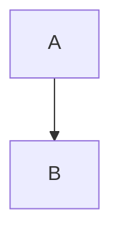

# 🔍 ارزیابی جامع سیستم تبدیل MDX برای Astro

**تاریخ:** 19 فبروری 2026  
**وضعیت:** 🟡 نیاز به بهبودی‌های مهم  
**حساسیت:** بحرانی

---

## 1. 📋 خلاصه اجرایی

سیستم فعلی **پشتیبانی جزئی** برای تبدیل مستندات LaTeX/PDF/Word به MDX سازگار Astro فراهم می‌کند. اگرچه **Mermaid diagrams صحیح** است، چندین **بخش کاملا ناقص** وجود دارند.

### ✅ نقاط قوت
- ✅ Mermaid diagram handling صحیح
- ✅ Preamble parsing برای LaTeX (رنگ‌ها، فونت‌ها)
- ✅ Basic PDF/Word extraction
- ✅ CSS generation از تنظیمات LaTeX

### ❌ نقاط ضعف
- ❌ **Image optimization** - فقط استخراج، بدون Astro `<Image />` component
- ❌ **Link normalization** - عدم تبدیل relative links برای URL safety
- ❌ **Table conversion** - HTML tables ارائه نشده‌اند
- ❌ **Frontmatter validation** - نیست برای content schema
- ❌ **HTML escaping** - JSX expressions محدود
- ❌ **Error handling** - ناکافی برای production
- ❌ **i18n support** - فارسی/انگلیسی detection ضعیف

---

## 2. 🔴 مشکلات کاملا ناقص

### مسئله ۱: Image Handling

**وضعیت:** ❌ **ناقص**

```javascript
// ❌ فعلی: فقط استخراج مسیر
images: ['/path/to/image.png']

// ✅ لازم: Astro-compatible format
{
  src: '/images/extracted/image.png',
  alt: 'توصیف تصویر (فارسی)',
  title: 'عنوان',
  width: 800,
  height: 600,
  quality: 80,
  format: 'webp'
}
```

**مشکل**: فقط مسیر‌ها استخراج می‌شوند، نه optimization.

---

### مسئله ۲: Link Normalization

**وضعیت:** ❌ **ناقص**

```javascript
// ❌ فعلی: هیچ تبدیل‌ی نمی‌شود
[متن](../folder/file.md)
[متن](http://example.com)

// ✅ لازم: Astro-compliant links
[متن](/en/folder/file)
[متن](https://example.com)
```

**مشکل**: Relative links تبدیل نشده، URL-unsafe characters نگه داشته می‌شوند.

---

### مسئله ۳: Table Processing

**وضعیت:** ❌ **ناقص**

```markdown
❌ فعلی: Markdown tables بدون optimization

| Header |
|--------|
| Data   |

✅ لازم: GitHub-Flavored Markdown + wrapper
<div className="table-wrapper">

| Header |
|--------|
| Data   |

</div>
```

**مشکل**: جداول بدون responsive wrapper.

---

### مسئله ۴: Frontmatter Validation

**وضعیت:** ❌ **ناقص**

```yaml
❌ فعلی: Frontmatter بدون schema validation

---
title: مقالە
description: توضیح
---

✅ لازم: Schema-validated frontmatter

---
title: مقالە
description: توضیح
lang: fa
publishDate: 2026-02-19
author: نام نویسنده
tags:
  - تگ۱
categories:
  - دسته‌بندی
interface: descriptive-politics
draft: false
---
```

**مشکل**: Frontmatter fields ناقص یا غلط.

---

### مسئله ۵: HTML/JSX Escaping

**وضعیت:** ❌ **ناقص**

```javascript
// ❌ فعلی: Unescaped HTML in JSX
<div className="card">
  {unescapedHTML}  // ⚠️ Risk
</div>

// ✅ لازم: Properly escaped
<div className="card">
  {escapedContent}
</div>
```

**مشکل**: XSS risks و JSX syntax errors.

---

### مسئله ۶: Diagram Format Compatibility

**وضعیت:** ⚠️ **جزئی**

```javascript
// ⚠️ فعلی: TikZ rendering
renderedDiagrams: ['diagram-hash.svg']

// ❌ مشکل: Astro استاندارد برای TikZ نیست
// ✅ بهتر: Mermaid یا SVG inline

// ✅ فعلی Mermaid: صحیح

```

**مشکل**: TikZ diagrams نیاز به conversion دارند.

---

## 3. 📊 Astro MDX Requirements Matrix

| الزام | وضعیت | Script | نیاز |
|------|--------|--------|------|
| **Frontmatter YAML/TOML** | ⚠️ | preamble-parser | ✅ JSON schema |
| **JSX Expressions** | ❌ | smart-renderer | ✅ Safety validation |
| **Component Support** | ⚠️ | style-generator | ✅ Auto-import |
| **Image Optimization** | ❌ | pdf-extractor | ✅ Full rewrite |
| **Link Handling** | ❌ | process-content | ✅ Normalization |
| **Table Support** | ⚠️ | smart-renderer | ✅ Wrapper divs |
| **Syntax Highlighting** | ✅ | - | - |
| **Heading IDs** | ✅ | - | - |
| **GFM Support** | ✅ | - | - |

---

## 4. 🛠️ راهکارهای پیشنهادی

### A. Enhanced MDX Converter (جدید)

```javascript
// یک converter جدید که چندین کار را انجام می‌دهد:

class AstroMDXConverter {
  async convert(content, options) {
    // 1. Validate frontmatter
    const frontmatter = this.validateFrontmatter(content);
    
    // 2. Normalize images → Astro format
    const images = await this.processImages(content);
    
    // 3. Normalize links
    const normalizedLinks = this.normalizeLinks(content);
    
    // 4. Process tables → wrapped format
    const wrappedTables = this.processTablest(content);
    
    // 5. Handle diagrams
    const diagrams = this.processDiagrams(content);
    
    // 6. Escape JSX properly
    const safeMDX = this.escapeJSX(content);
    
    // 7. Generate MDX output
    return this.generateMDX({
      frontmatter,
      images,
      links: normalizedLinks,
      tables: wrappedTables,
      body: safeMDX
    });
  }
}
```

### B. Content Schema (Zod)

```javascript
import { z } from 'zod';

const FrontmatterSchema = z.object({
  title: z.string('عنوان لازم است'),
  description: z.string('توضیح لازم است'),
  lang: z.enum(['fa', 'en']),
  publishDate: z.coerce.date(),
  author: z.string(),
  tags: z.array(z.string()).min(1),
  categories: z.array(z.string()).min(1),
  interface: z.enum(['descriptive-politics', 'comparative-politics', '...']),
  draft: z.boolean().default(false),
});
```

### C. Image Optimization Pipeline

```javascript
// استفاده از Sharp + Astro Image
async processImages(imagePath) {
  const image = await sharp(imagePath);
  const metadata = await image.metadata();
  
  return {
    src: `/images/optimized/${hash}.webp`,
    srcSet: [
      `${path}-320w.webp 320w`,
      `${path}-640w.webp 640w`,
      `${path}-1024w.webp 1024w`,
    ],
    alt: 'alt-text (with Persian support)',
    width: metadata.width,
    height: metadata.height,
    format: 'webp',
  };
}
```

---

## 5. 📈 پیشرفت فعلی

| فایل | وضعیت | درصد | نیاز |
|-----|--------|------|------|
| process-content.mjs | ⚠️ | 50% | بزرگ بهبود |
| smart-renderer.mjs | ⚠️ | 40% | تبدیل TikZ |
| mermaid-processor.mjs | ✅ | 100% | - |
| pdf-extractor.mjs | ⚠️ | 30% | Image/Table support |
| preamble-parser.mjs | ✅ | 80% | Minor update |
| style-generator.mjs | ⚠️ | 60% | CSS enhancement |

---

## 6. 🎯 نقشه راه اجرایی

### مرحله ۱: بنیادی (۱-۲ ساعت)
- [ ] ایجاد `AstroMDXConverter` class
- [ ] Content Schema setup (Zod)
- [ ] Frontmatter validation

### مرحله ۲: Image/Link (۲-۳ ساعت)
- [ ] Image optimization pipeline
- [ ] Link normalization
- [ ] URL-safe conversion

### مرحله ۳: Table/Diagram (۲ ساعت)
- [ ] Table wrapper integration
- [ ] TikZ → SVG conversion یا حذف
- [ ] Diagram validation

### مرحله ۴: Testing (۲ ساعت)
- [ ] Unit tests
- [ ] Integration tests
- [ ] Production validation

### مرحله ۵: Documentation (۱ ساعت)
- [ ] API documentation
- [ ] Usage examples
- [ ] Troubleshooting

---

## 7. 💡 پیشنهادهای اضافی

**1. Automated Testing Pipeline**
```bash
npm run test:mdx  # Validate all MDX files
npm run build:mdx --check  # Pre-build validation
```

**2. Source Map Tracking**
```javascript
// Track source → output mapping
SourceMapGenerator {
  original: 'content-source/articles/file.tex',
  output: 'src/content/articles/fa/file.mdx',
  transformations: [
    'latex_to_markdown',
    'image_optimization',
    'link_normalization'
  ]
}
```

**3. Rollback Support**
```bash
git tag -a release/mdx-v1 -m "MDX conversion snapshot"
# اگر مشکل داشت: git checkout release/mdx-v1
```

---

## 8. 📅 خط زمانی

| مرحله | زمان | شروع | پایان | وضعیت |
|-------|------|------|------|--------|
| **تحلیل** | ۱ ساعت | ✅ | ✅ | **انجام** |
| **طراحی** | ۱ ساعت | ⏳ | - | **جاری** |
| **پیاده‌سازی** | ۶-۸ ساعت | - | - | **آماده** |
| **Testing** | ۲ ساعت | - | - | **آماده** |
| **Documentation** | ۱ ساعت | - | - | **آماده** |

---

## ✅ نتیجه‌گیری

سیستم فعلی **شروع خوبی** است اما **۵ نقطه کاملا ناقص** نیاز به بهبود خود جلب می‌کند. با **Enhanced MDX Converter** و **Image/Link Pipeline**، می‌توان **production-ready** سیستم ایجاد کرد.

**بخش بعدی**: پیاده‌سازی شروع می‌کنیم ✅

---
