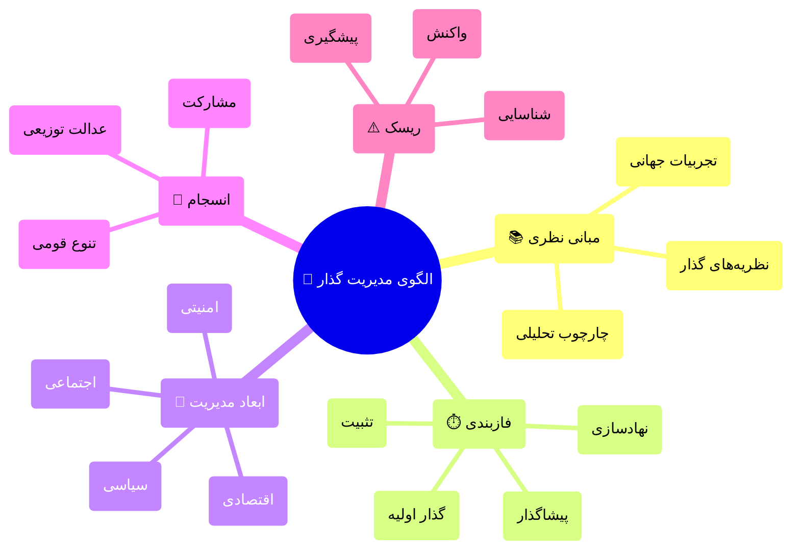
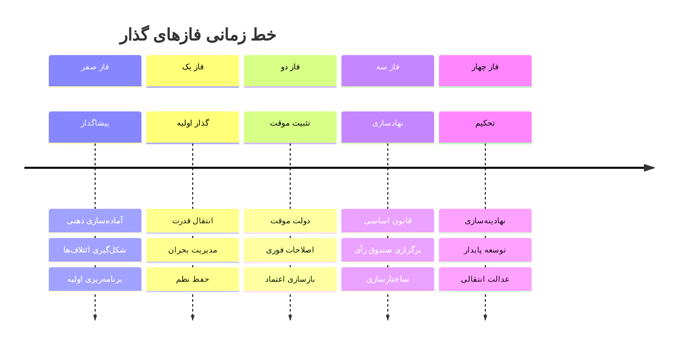
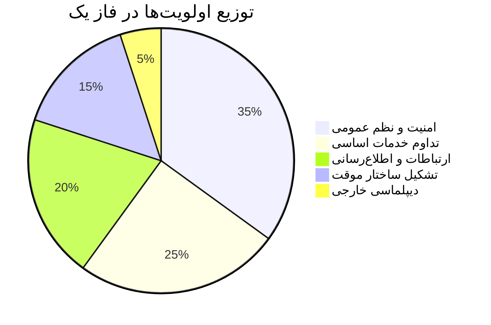
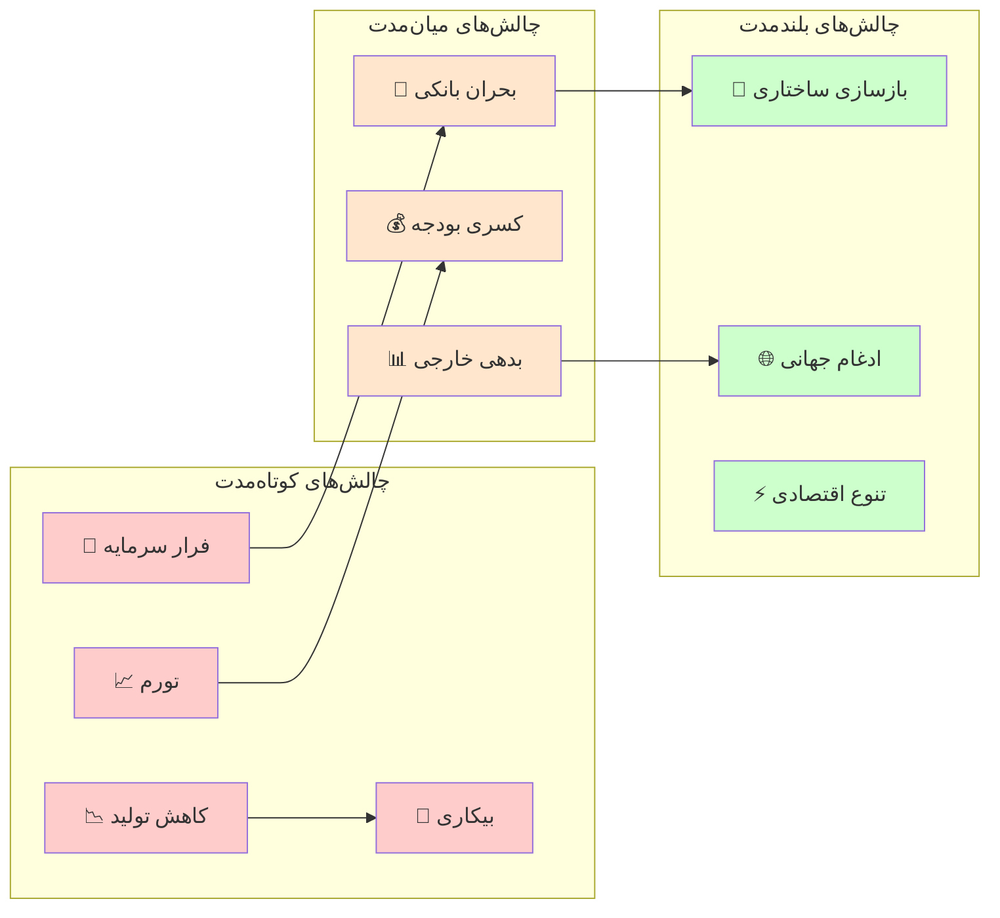
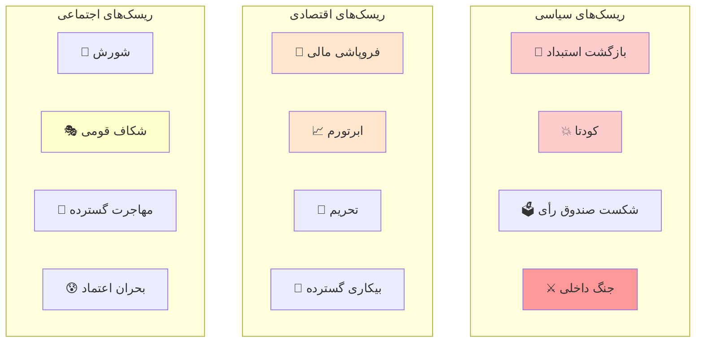

# 📘 الگوی جامع مدیریت دوره گذار

## راهنمای علمی-عملی برای حصول ثبات و پیشگیری از بی‌نظمی

---

## فهرست مطالب

<details>
<summary>📚 فهرست کامل مطالب</summary>

| بخش | موضوع |
| --- | --- |
| اول | مبانی نظری و چارچوب مفهومی |
| دوم | فازشناسی دوره گذار |
| سوم | ابعاد چندگانه مدیریت گذار |
| چهارم | مدیریت تنوع و انسجام |
| پنجم | تحلیل ریسک و مدیریت بحران |
| ششم | ارتباطات و اعتمادسازی |
| هفتم | نقشه راه اجرایی |
| هشتم | نظام پایش و ارزیابی |
| نهم | تجربیات تطبیقی |
| دهم | جمع‌بندی و توصیه‌های کلیدی |

</details>

---

# 🎯 خلاصه اجرایی

> **هدف این سند:** ارائه یک چارچوب جامع، علمی و عملیاتی برای مدیریت موفق دوره‌های گذار سیاسی-اجتماعی، با هدف حفظ ثبات، جلوگیری از خلأ قدرت، و ایجاد اطمینان در میان آحاد جامعه.

<div className="flex justify-center my-6">





</div>

---

# بخش اول: مبانی نظری و چارچوب مفهومی

## ۱.۱ تعریف دوره گذار

> **تعریف علمی دوره گذار (Transition Period):**
دوره‌ای از تحول سیاسی-اجتماعی که طی آن یک نظام سیاسی از وضعیت موجود به وضعیت جدید حرکت می‌کند. این دوره با عدم قطعیت، بازتوزیع قدرت، و بازتعریف قواعد بازی مشخص می‌شود.
— *O'Donnell & Schmitter (1986); Linz & Stepan (1996)*

### ویژگی‌های ذاتی دوره گذار

<div className="flex justify-center my-6">


```mermaid
flowchart LR
    A["🔄 عدم قطعیت"] -->"B["⚖️ بازتوزیع قدرت""]
    B -->"C["📜 بازتعریف قواعد""]
    C -->"D["🏛️ نهادسازی مجدد""]
    D -->"E["🤝 قرارداد اجتماعی جدید""]

    style A fill:#ffcccc,stroke:#333
    style B fill:#ffe6cc,stroke:#333
    style C fill:#ffffcc,stroke:#333
    style D fill:#ccffcc,stroke:#333
    style E fill:#cce6ff,stroke:#333

```


</div>

## ۱.۲ چارچوب نظری یکپارچه

### نظریه‌های بنیادین گذار

| نظریه | نظریه‌پرداز اصلی | محور تحلیل | کاربرد در مدل ما |
| --- | --- | --- | --- |
| **گذار دموکراتیک** | O'Donnell, Schmitter | نقش نخبگان و پیمان‌ها | طراحی میزگردهای ملی |
| **موج‌های دموکراتیزاسیون** | Huntington | الگوهای جهانی | درس‌گیری تطبیقی |
| **تثبیت دموکراسی** | Linz, Stepan | نهادسازی | فاز تحکیم |
| **عدالت انتقالی** | Teitel | مواجهه با گذشته | سازوکارهای آشتی ملی |
| **اقتصاد سیاسی گذار** | Przeworski | توازن اصلاحات | مدیریت اقتصادی |
| **جامعه‌شناسی انقلاب** | Skocpol, Goldstone | علل ساختاری | تحلیل زمینه‌ای |

---

# بخش دوم: فازشناسی دوره گذار

## ۲.۱ مدل پنج‌فازی گذار

<div className="flex justify-center my-6">





</div>

## ۲.۲ جزئیات هر فاز

### 🔵 فاز صفر: پیشاگذار (Pre-Transition)

**مدت تقریبی:** متغیر (ماه‌ها تا سال‌ها)

| بُعد | اقدامات کلیدی | شاخص موفقیت |
| --- | --- | --- |
| **فکری** | تولید گفتمان جایگزین، ترویج ارزش‌های دموکراتیک | میزان پذیرش عمومی ایده‌های جدید |
| **سازمانی** | شکل‌گیری ائتلاف‌های اصلاح‌طلب، شبکه‌سازی نخبگان | تعداد و تنوع ائتلاف‌ها |
| **برنامه‌ای** | تدوین نقشه راه، سناریونویسی | وجود برنامه‌های مدون |
| **ارتباطی** | ایجاد کانال‌های ارتباطی، دیپلماسی عمومی | سطح هماهنگی میان بازیگران |

### 🟢 فاز یک: گذار اولیه (Initial Transition)

**مدت تقریبی:** ۱ تا ۶ ماه

> **⚠️ این حساس‌ترین فاز است.** بیشترین احتمال شکست و بازگشت در این مرحله وجود دارد.

### اولویت‌های فاز یک

<div className="flex justify-center my-6">





</div>

### 🟡 فاز دو: تثبیت موقت (Interim Stabilization)

**مدت تقریبی:** ۶ تا ۱۸ ماه

### اصول حاکم بر دولت موقت

1. **فراگیری (Inclusiveness):** نمایندگی حداکثری گروه‌های مختلف
2. **محدودیت زمانی:** تعهد قاطع به برگزاری صندوق رأی در موعد مقرر
3. **شفافیت:** گزارش‌دهی منظم به مردم
4. **خویشتن‌داری:** پرهیز از تصمیمات غیرقابل برگشت
5. **پاسخگویی:** سازوکارهای نظارتی مشخص

### 🟠 فاز سه: نهادسازی (Institution Building)

**مدت تقریبی:** ۱۸ ماه تا ۳ سال

### 🔴 فاز چهار: تحکیم (Consolidation)

**مدت تقریبی:** ۳ تا ۱۰ سال

> **تعریف تحکیم دموکراتیک:**
زمانی که دموکراسی «تنها بازی ممکن در شهر» شود — یعنی هیچ گروه مهمی خارج از چارچوب دموکراتیک به دنبال قدرت نباشد.
— *Linz & Stepan (1996)*

---

# بخش سوم: ابعاد چندگانه مدیریت گذار

## ۳.۱ بُعد سیاسی

### ساختار قدرت در دوره گذار

<div className="flex justify-center my-6">


```mermaid
flowchart TB
    A["🏛️ شورای عالی گذار<br/>("تصمیم‌گیری استراتژیک")"] --> B["👥 مجمع مشورتی ملی<br/>("نمایندگی اقشار")"]
    A --> C["⚖️ هیئت داوری<br/>("حل اختلاف")"]
    A --> D["📋 کابینه تکنوکرات<br/>("اجرا")"]
    A --> E["👁️ نهاد نظارت مستقل<br/>("پاسخگویی")"]

    style A fill:#4a90d9,stroke:#2c5282,color:#fff
    style B fill:#68d391,stroke:#276749,color:#fff
    style C fill:#f6ad55,stroke:#c05621,color:#fff
    style D fill:#fc8181,stroke:#c53030,color:#fff
    style E fill:#b794f4,stroke:#6b46c1,color:#fff

```


</div>

## ۳.۲ بُعد اقتصادی

### چالش‌های اقتصادی دوره گذار

<div className="flex justify-center my-6">





</div>

---

# بخش چهارم: مدیریت تنوع و انسجام

## ۴.۱ طیف گزینه‌های ساختاری

<div className="flex justify-center my-6">


```mermaid
flowchart LR
    A["🏛️ دولت متمرکز"] -->"B["📍 تمرکززدایی اداری""]
    B -->"C["🗺️ خودمختاری منطقه‌ای""]
    C -->"D["🤝 فدرالیسم""]
    D -->"E["🔗 کنفدراسیون""]

    style A fill:#ff6666
    style B fill:#ff9966
    style C fill:#ffcc66
    style D fill:#99ff99
    style E fill:#66ccff

```


</div>

## ۴.۲ چهار ستون عدالت انتقالی

| ستون | هدف | سازوکار | مثال موفق |
| --- | --- | --- | --- |
| **حقیقت‌یابی** | آشکارسازی گذشته | کمیسیون حقیقت | آفریقای جنوبی |
| **عدالت** | محاکمه عاملان | دادگاه‌ها | آرژانتین |
| **جبران خسارت** | ترمیم قربانیان | غرامت، اعاده حیثیت | شیلی |
| **تضمین عدم تکرار** | اصلاحات نهادی | بازبینی قوانین | آلمان |

---

# بخش پنجم: تحلیل ریسک و مدیریت بحران

## ۵.۱ نقشه ریسک‌های دوره گذار

<div className="flex justify-center my-6">





</div>

---

# بخش ششم: ارتباطات و اعتمادسازی

## ۶.۱ استراتژی ارتباطات ملی

> **اصل کلیدی:** در دوره گذار، خلأ اطلاعاتی سریع‌تر از خلأ قدرت به بی‌ثباتی منجر می‌شود. ارتباطات شفاف، پیوسته و صادقانه حیاتی است.

---

# بخش هفتم: نقشه راه اجرایی

## ۷.۱ چک‌لیست ۱۰۰ روز اول

| هفته | اقدامات کلیدی | مسئول |
| --- | --- | --- |
| **۱** | ☐ تأمین امنیت پایتخت | فرمانده امنیتی |
|  | ☐ اولین سخنرانی ملی | رئیس شورا |
| **۲** | ☐ بازگشایی بانک‌ها | رئیس بانک مرکزی |
|  | ☐ معرفی کابینه | رئیس شورا |
| **۳-۴** | ☐ ارزیابی مالی کشور | وزیر اقتصاد |
|  | ☐ نقشه راه مقدماتی | دفتر برنامه‌ریزی |
| **۵-۸** | ☐ آغاز گفتگوی ملی | دبیرخانه گفتگو |
|  | ☐ برنامه حمایت معیشتی | وزیر رفاه |
| **۹-۱۴** | ☐ انتشار منشور گذار | شورای گذار |
|  | ☐ تقویم صندوق رأی | کمیسیون صندوق رأی |

---

# بخش هشتم: نظام پایش و ارزیابی

## ۸.۱ شاخص‌های کلیدی عملکرد (KPIs)

### شاخص‌های امنیتی

| شاخص | واحد | هدف فاز ۱ | هدف فاز ۲ | هدف فاز ۳ |
| --- | --- | --- | --- | --- |
| نرخ جرم | در ۱۰۰,۰۰۰ | &lt;۵۰۰ | &lt;۳۰۰ | &lt;۲۰۰ |
| اعتراضات خشونت‌آمیز | تعداد/ماه | &lt;۲۰ | &lt;۵ | ~۰ |
| احساس امنیت | نظرسنجی | >۵۰٪ | >۷۰٪ | >۸۵٪ |

### شاخص‌های اقتصادی

| شاخص | واحد | هدف فاز ۱ | هدف فاز ۲ | هدف فاز ۳ |
| --- | --- | --- | --- | --- |
| تورم ماهانه | درصد | &lt;۵٪ | &lt;۲٪ | &lt;۱٪ |
| نرخ بیکاری | درصد | &lt;۲۵٪ | &lt;۱۵٪ | &lt;۱۰٪ |
| رشد GDP | درصد | >-۵٪ | >۰٪ | >۳٪ |

---

# بخش نهم: تجربیات تطبیقی

## ۹.۱ تحلیل تطبیقی گذارهای موفق

### جدول مقایسه‌ای

| کشور | سال | مدت گذار | عوامل موفقیت | درس‌های کلیدی |
| --- | --- | --- | --- | --- |
| **اسپانیا** | ۱۹۷۵-۱۹۸۲ | ۷ سال | پیمان مونکلوا، نقش پادشاه، اجماع نخبگان | مصالحه بهتر از تقابل |
| **لهستان** | ۱۹۸۹-۱۹۹۱ | ۲ سال | میزگرد، همبستگی، حمایت غرب | جامعه مدنی قوی |
| **آفریقای جنوبی** | ۱۹۹۰-۱۹۹۴ | ۴ سال | رهبری ماندلا، کمیسیون حقیقت | آشتی بدون فراموشی |
| **شیلی** | ۱۹۸۸-۱۹۹۰ | ۲ سال | همه‌پرسی، ائتلاف گسترده | تدریج بهتر از انقلاب |
| **تونس** | ۲۰۱۱-۲۰۱۴ | ۳ سال | چهارگانه گفتگو، قانون اساسی | گفتگوی ملی حیاتی |

---

# بخش دهم: جمع‌بندی و توصیه‌های کلیدی

## ۱۰.۱ ده اصل طلایی مدیریت گذار

| اصل | توضیح | اقدام عملی |
| --- | --- | --- |
| **۱. برنامه‌ریزی** | گذار موفق از پیش طراحی می‌شود | تدوین نقشه راه قبل از شروع |
| **۲. فراگیری** | طرد کردن = بی‌ثباتی | نمایندگی همه گروه‌ها |
| **۳. تدریج** | شوک درمانی خطرناک است | اصلاحات مرحله‌ای |
| **۴. شفافیت** | خلأ اطلاعاتی = شایعه | ارتباطات مداوم |
| **۵. انعطاف** | برنامه قابل تغییر است | بازنگری دوره‌ای |
| **۶. عدالت** | بی‌عدالتی = انفجار | توازن در توزیع |
| **۷. صبر** | دموکراسی زمان می‌برد | مدیریت انتظارات |
| **۸. نهادسازی** | افراد می‌روند، نهادها می‌مانند | تمرکز بر ساختارها |
| **۹. امید** | ناامیدی = رادیکالیزه شدن | چشم‌انداز روشن |
| **۱۰. یادگیری** | چرخ را دوباره اختراع نکن | مطالعه تجربیات |

---

> **«گذار سخت است، اما ممکن. ملت‌های بسیاری این مسیر را طی کرده‌اند. ما هم می‌توانیم.»**

---

# منابع و مراجع

## منابع اصلی

1. **O'Donnell, G., & Schmitter, P.** (1986). *Transitions from Authoritarian Rule*. Johns Hopkins University Press.
2. **Linz, J., & Stepan, A.** (1996). *Problems of Democratic Transition and Consolidation*. Johns Hopkins University Press.
3. **Huntington, S.** (1991). *The Third Wave*. University of Oklahoma Press.
4. **Diamond, L.** (1999). *Developing Democracy*. Johns Hopkins University Press.
5. **Przeworski, A.** (1991). *Democracy and the Market*. Cambridge University Press.
6. **Teitel, R.** (2000). *Transitional Justice*. Oxford University Press.