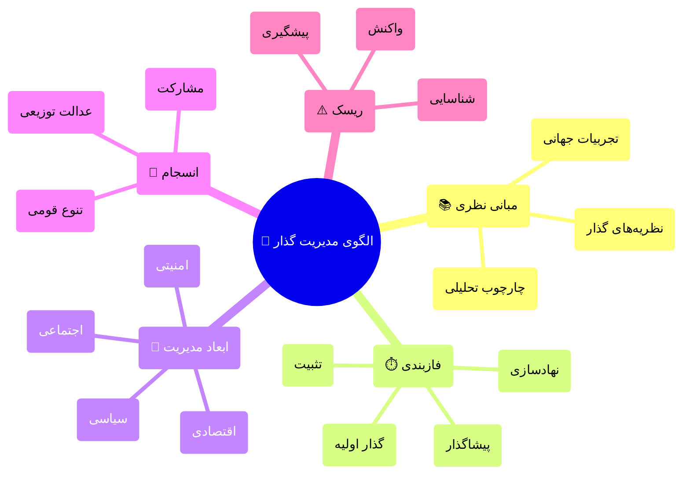
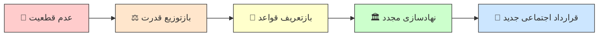
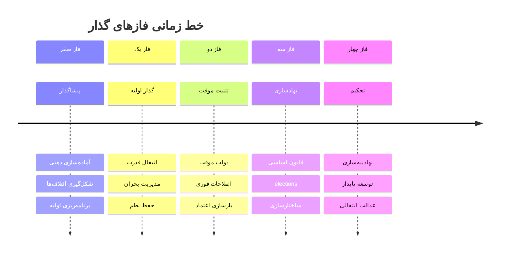
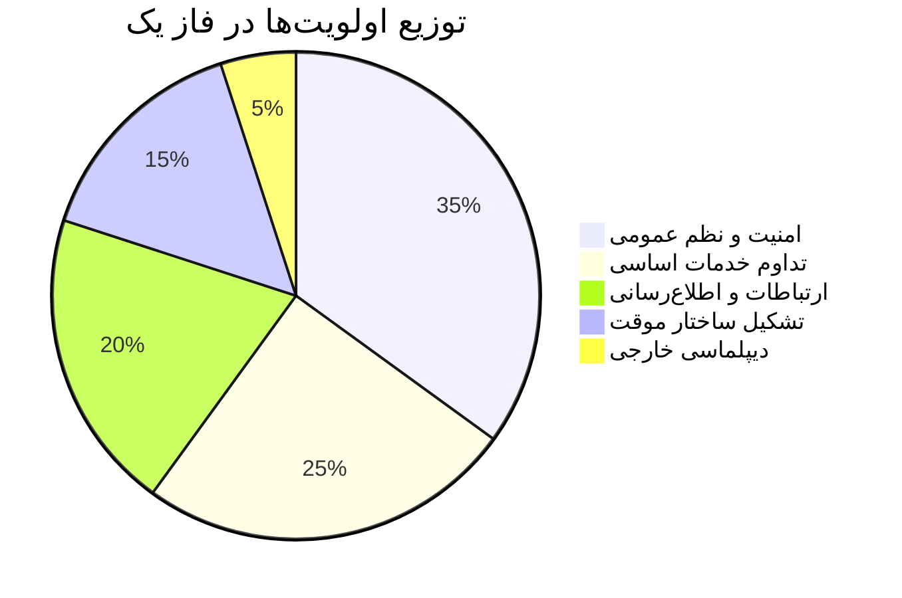
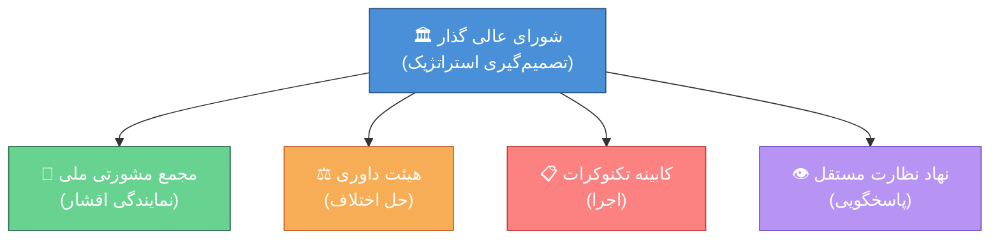
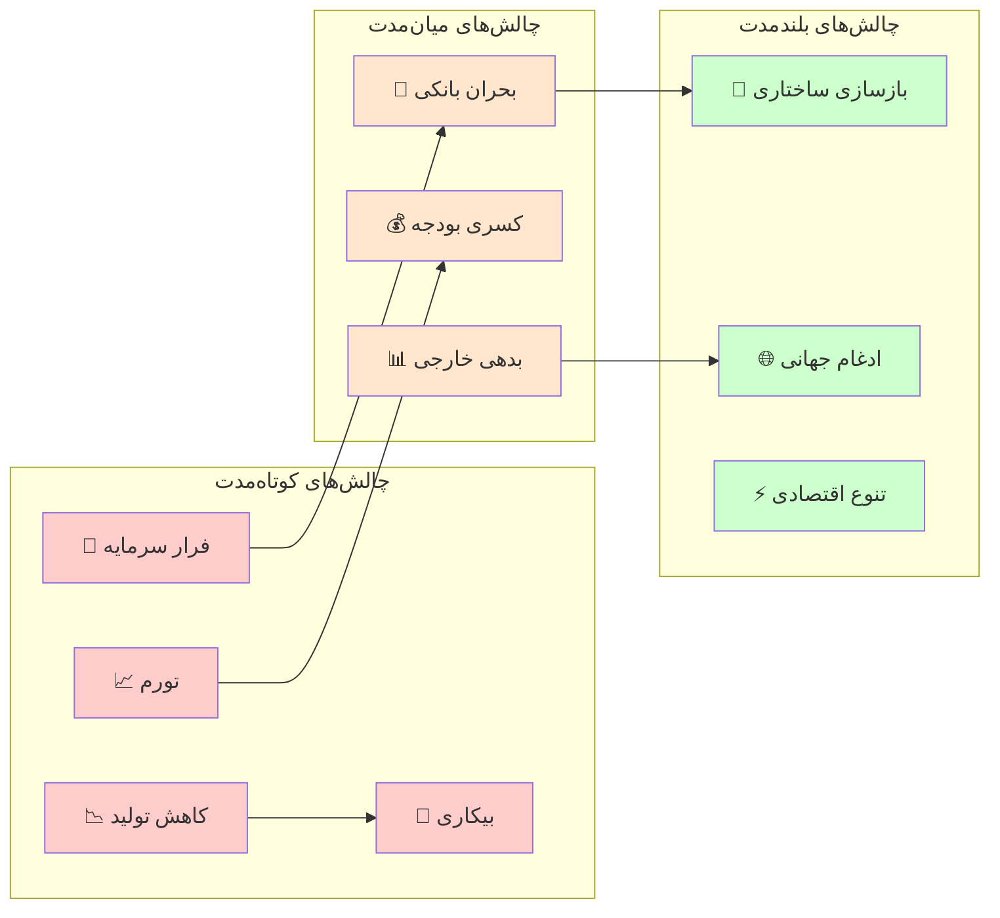
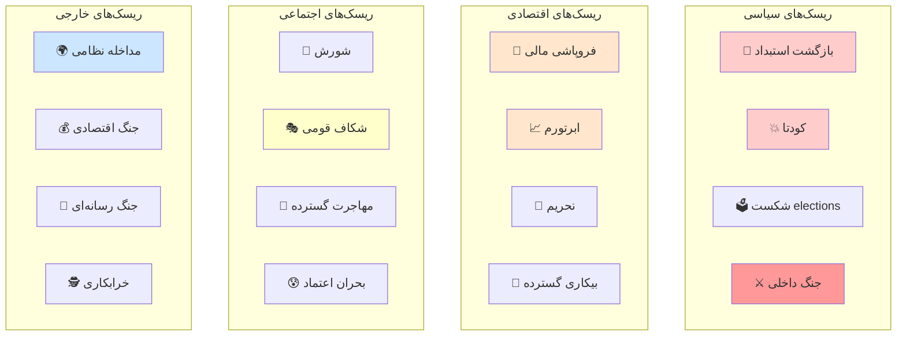
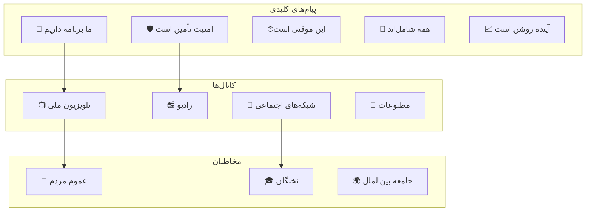
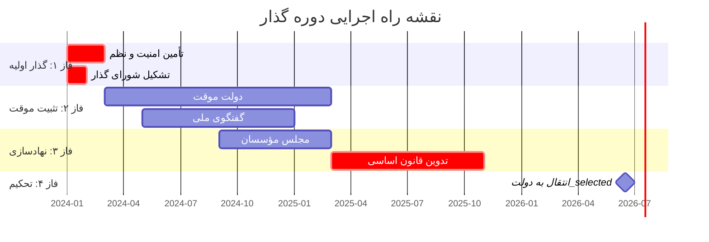
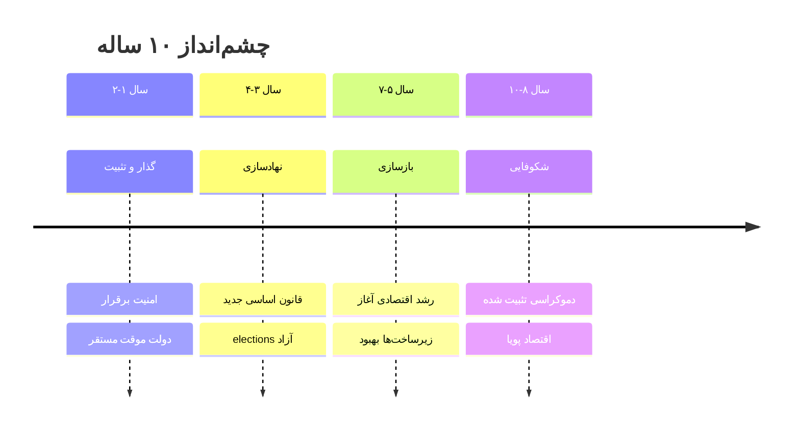

# 📘 الگوی جامع مدیریت دوره گذار

## راهنمای علمی-عملی برای حصول ثبات و پیشگیری از بی‌نظمی

---

# فهرست مطالب

| بخش | موضوع |
| --- | --- |
| اول | مبانی نظری و چارچوب مفهومی |
| دوم | فازشناسی دوره گذار |
| سوم | ابعاد چندگانه مدیریت گذار |
| چهارم | مدیریت تنوع و انسجام |
| پنجم | تحلیل ریسک و مدیریت بحران |
| ششم | ارتباطات و اعتمادسازی |
| هفتم | نقشه راه اجرایی |
| هشتم | نظام پایش و ارزیابی |
| نهم | تجربیات تطبیقی |
| دهم | جمع‌بندی و توصیه‌های کلیدی |

---

# 🎯 خلاصه اجرایی

> **هدف این سند:** ارائه یک چارچوب جامع، علمی و عملیاتی برای مدیریت موفق دوره‌های گذار سیاسی-اجتماعی، با هدف حفظ ثبات، جلوگیری از خلأ قدرت، و ایجاد اطمینان در میان آحاد جامعه.

### پیام کلیدی به مخاطبان

| مخاطب | پیام اصلی |
| --- | --- |
| **عامه مردم** | 🏠 گذار یک فرآیند طبیعی است؛ با برنامه‌ریزی و مشارکت همگانی، آینده‌ای روشن‌تر در انتظار است |
| **نخبگان** | 🎓 نقش شما در طراحی و هدایت فرآیند گذار حیاتی است؛ این فرصت تاریخی را دریابید |
| **سیاست‌گذاران** | 📋 الگوهای موفق وجود دارد؛ با تکیه بر علم و تجربه، می‌توان مسیر را هموار کرد |
| **جامعه بین‌الملل** | 🌍 همراهی و حمایت سازنده، منافع مشترک را تأمین می‌کند |

---

# بخش اول: مبانی نظری و چارچوب مفهومی

## ۱.۱ تعریف دوره گذار

> **تعریف علمی دوره گذار (Transition Period):**
دوره‌ای از تحول سیاسی-اجتماعی که طی آن یک نظام سیاسی از وضعیت موجود به وضعیت جدید حرکت می‌کند. این دوره با عدم قطعیت، بازتوزیع قدرت، و بازتعریف قواعد بازی مشخص می‌شود.
— *O'Donnell & Schmitter (1986); Linz & Stepan (1996)*

### ویژگی‌های ذاتی دوره گذار

## ۱.۲ چارچوب نظری یکپارچه

### نظریه‌های بنیادین گذار

| نظریه | نظریه‌پرداز اصلی | محور تحلیل | کاربرد در مدل ما |
| --- | --- | --- | --- |
| **گذار دموکراتیک** | O'Donnell, Schmitter | نقش نخبگان و پیمان‌ها | طراحی میزگردهای ملی |
| **موج‌های دموکراتیزاسیون** | Huntington | الگوهای جهانی | درس‌گیری تطبیقی |
| **تثبیت دموکراسی** | Linz, Stepan | نهادسازی | فاز تحکیم |
| **عدالت انتقالی** | Teitel | مواجهه با گذشته | سازوکارهای آشتی ملی |
| **اقتصاد سیاسی گذار** | Przeworski | توازن اصلاحات | مدیریت اقتصادی |
| **جامعه‌شناسی انقلاب** | Skocpol, Goldstone | علل ساختاری | تحلیل زمینه‌ای |

---

# بخش دوم: فازشناسی دوره گذار

## ۲.۱ مدل پنج‌فازی گذار

## ۲.۲ جزئیات هر فاز

### 🔵 فاز صفر: پیشاگذار (Pre-Transition)

**مدت تقریبی:** متغیر (ماه‌ها تا سال‌ها)

| بُعد | اقدامات کلیدی | شاخص موفقیت |
| --- | --- | --- |
| **فکری** | تولید گفتمان جایگزین، ترویج ارزش‌های دموکراتیک | میزان پذیرش عمومی ایده‌های جدید |
| **سازمانی** | شکل‌گیری ائتلاف‌های اصلاح‌طلب، شبکه‌سازی نخبگان | تعداد و تنوع ائتلاف‌ها |
| **برنامه‌ای** | تدوین نقشه راه، سناریونویسی | وجود برنامه‌های مدون |
| **ارتباطی** | ایجاد کانال‌های ارتباطی، دیپلماسی عمومی | سطح هماهنگی میان بازیگران |

### 🟢 فاز یک: گذار اولیه (Initial Transition)

**مدت تقریبی:** ۱ تا ۶ ماه

> **⚠️ این حساس‌ترین فاز است.** بیشترین احتمال شکست و بازگشت در این مرحله وجود دارد.

### اولویت‌های فاز یک

### ماتریس اقدامات فوری

| اولویت | اقدام | مسئول | زمان‌بندی | ریسک عدم انجام |
| --- | --- | --- | --- | --- |
| **۱** | استقرار نظم و امنیت | نیروهای امنیتی منضبط | فوری (۰-۷۲ ساعت) | هرج و مرج، غارت |
| **۲** | تداوم خدمات حیاتی | وزارتخانه‌های خدماتی | فوری (۰-۴۸ ساعت) | بحران انسانی |
| **۳** | اطلاع‌رسانی شفاف | تیم ارتباطات | مداوم | شایعه، وحشت |
| **۴** | تشکیل شورای موقت | نمایندگان ائتلاف | ۱-۷ روز | خلأ قدرت |
| **۵** | تماس با بین‌الملل | تیم دیپلماسی | ۱-۳ روز | انزوا، تحریم |

### 🟡 فاز دو: تثبیت موقت (Interim Stabilization)

**مدت تقریبی:** ۶ تا ۱۸ ماه

### اصول حاکم بر دولت موقت

1. **فراگیری (Inclusiveness):** نمایندگی حداکثری گروه‌های مختلف
2. **محدودیت زمانی:** تعهد قاطع به برگزاری elections در موعد مقرر
3. **شفافیت:** گزارش‌دهی منظم به مردم
4. **خویشتن‌داری:** پرهیز از تصمیمات غیرقابل برگشت
5. **پاسخگویی:** سازوکارهای نظارتی مشخص

### 🟠 فاز سه: نهادسازی (Institution Building)

**مدت تقریبی:** ۱۸ ماه تا ۳ سال

### 🔴 فاز چهار: تحکیم (Consolidation)

**مدت تقریبی:** ۳ تا ۱۰ سال

> **تعریف تحکیم دموکراتیک:**
زمانی که دموکراسی «تنها بازی ممکن در شهر» شود — یعنی هیچ گروه مهمی خارج از چارچوب دموکراتیک به دنبال قدرت نباشد.
— *Linz & Stepan (1996)*

### شاخص‌های تحکیم

| بُعد | شاخص | معیار موفقیت |
| --- | --- | --- |
| **رفتاری** | عدم تلاش معنادار برای براندازی | صفر کودتا یا شورش |
| **نگرشی** | حمایت عمومی از دموکراسی | >70% در نظرسنجی‌ها |
| **قانونی** | پذیرش قواعد بازی | انتقال مسالمت‌آمیز قدرت |
| **نهادی** | استقلال نهادها | امتیاز بالا در شاخص‌های بین‌المللی |

---

# بخش سوم: ابعاد چندگانه مدیریت گذار

## ۳.۱ بُعد سیاسی

### ساختار قدرت در دوره گذار

## ۳.۲ بُعد اقتصادی

### چالش‌های اقتصادی دوره گذار

## ۳.۳ بُعد اجتماعی

### لایه‌بندی اجتماعی و اولویت‌های هر گروه

| گروه اجتماعی | نگرانی اصلی | نیاز فوری | سازوکار پاسخ |
| --- | --- | --- | --- |
| **طبقه متوسط شهری** | ثبات شغلی، آینده فرزندان | امنیت اقتصادی | تضمین حقوق مالکیت، آموزش |
| **طبقه کارگر** | معیشت، اشتغال | حمایت مالی فوری | شبکه ایمنی، کارهای عمومی |
| **کشاورزان و روستاییان** | قیمت محصولات، آب | ثبات بازار | یارانه کشاورزی، زیرساخت |
| **زنان** | برابری، امنیت | حضور در تصمیم‌گیری | سهمیه، قوانین حمایتی |
| **جوانان** | آینده، شغل، آزادی | فرصت‌های جدید | آموزش، کارآفرینی |
| **اقلیت‌ها** | به‌رسمیت‌شناسی، امنیت | نمایندگی | قوانین ضدتبعیض |
| **بازنشستگان** | مستمری، بهداشت | امنیت درآمد | تضمین پرداخت‌ها |

## ۳.۴ بُعد امنیتی

### اصل‌الاصول: انحصار مشروع خشونت

> **اصل وبری:** دولت نهادی است که انحصار استفاده مشروع از زور را در یک قلمرو مشخص دارد. بدون این انحصار، دولت وجود ندارد.
— *Max Weber*

---

# بخش چهارم: مدیریت تنوع و انسجام

## ۴.۱ چارچوب مفهومی تنوع-انسجام

> **پارادوکس گذار:** چگونه می‌توان هم تنوع را به رسمیت شناخت و هم انسجام ملی را حفظ کرد؟

### طیف گزینه‌های ساختاری

## ۴.۲ عدالت انتقالی و آشتی ملی

### چهار ستون عدالت انتقالی

| ستون | هدف | سازوکار | مثال موفق |
| --- | --- | --- | --- |
| **حقیقت‌یابی** | آشکارسازی گذشته | کمیسیون حقیقت | آفریقای جنوبی |
| **عدالت** | محاکمه عاملان | دادگاه‌ها | آرژانتین |
| **جبران خسارت** | ترمیم قربانیان | غرامت، اعاده حیثیت | شیلی |
| **تضمین عدم تکرار** | اصلاحات نهادی | بازبینی قوانین | آلمان |

---

# بخش پنجم: تحلیل ریسک و مدیریت بحران

## ۵.۱ نقشه ریسک‌های دوره گذار

## ۵.۲ ماتریس ارزیابی ریسک

| ریسک | احتمال | تأثیر | امتیاز ریسک | اولویت |
| --- | --- | --- | --- | --- |
| کودتای نظامی | ۳/۵ | ۵/۵ | **۱۵** | 🔴 بحرانی |
| ابرتورم | ۴/۵ | ۴/۵ | **۱۶** | 🔴 بحرانی |
| شورش قومی | ۳/۵ | ۴/۵ | **۱۲** | 🟠 بالا |
| مداخله خارجی | ۲/۵ | ۵/۵ | **۱۰** | 🟠 بالا |
| شکست elections | ۳/۵ | ۳/۵ | **۹** | 🟡 متوسط |
| بحران اعتماد | ۴/۵ | ۳/۵ | **۱۲** | 🟠 بالا |
| مهاجرت نخبگان | ۴/۵ | ۲/۵ | **۸** | 🟡 متوسط |

---

# بخش ششم: ارتباطات و اعتمادسازی

## ۶.۱ استراتژی ارتباطات ملی

> **اصل کلیدی:** در دوره گذار، خلأ اطلاعاتی سریع‌تر از خلأ قدرت به بی‌ثباتی منجر می‌شود. ارتباطات شفاف، پیوسته و صادقانه حیاتی است.

### چارچوب ارتباطات استراتژیک

---

# بخش هفتم: نقشه راه اجرایی

## ۷.۱ نقشه راه کلان

## ۷.۲ چک‌لیست ۱۰۰ روز اول

| هفته | اقدامات کلیدی | مسئول |
| --- | --- | --- |
| **۱** | ☐ تأمین امنیت پایتخت | فرمانده امنیتی |
|  | ☐ اولین سخنرانی ملی | رئیس شورا |
| **۲** | ☐ بازگشایی بانک‌ها | رئیس بانک مرکزی |
|  | ☐ معرفی کابینه | رئیس شورا |
| **۳-۴** | ☐ ارزیابی مالی کشور | وزیر اقتصاد |
|  | ☐ نقشه راه مقدماتی | دفتر برنامه‌ریزی |
| **۵-۸** | ☐ آغاز گفتگوی ملی | دبیرخانه گفتگو |
|  | ☐ برنامه حمایت معیشتی | وزیر رفاه |
| **۹-۱۴** | ☐ انتشار منشور گذار | شورای گذار |
|  | ☐ تقویم elections | کمیسیون elections |

---

# بخش هشتم: نظام پایش و ارزیابی

## ۸.۱ شاخص‌های کلیدی عملکرد (KPIs)

### شاخص‌های امنیتی

| شاخص | واحد | هدف فاز ۱ | هدف فاز ۲ | هدف فاز ۳ |
| --- | --- | --- | --- | --- |
| نرخ جرم | در ۱۰۰,۰۰۰ | <۵۰۰ | <۳۰۰ | <۲۰۰ |
| اعتراضات خشونت‌آمیز | تعداد/ماه | <۲۰ | <۵ | ~۰ |
| احساس امنیت | نظرسنجی | >۵۰٪ | >۷۰٪ | >۸۵٪ |

### شاخص‌های اقتصادی

| شاخص | واحد | هدف فاز ۱ | هدف فاز ۲ | هدف فاز ۳ |
| --- | --- | --- | --- | --- |
| تورم ماهانه | درصد | <۵٪ | <۲٪ | <۱٪ |
| نرخ بیکاری | درصد | <۲۵٪ | <۱۵٪ | <۱۰٪ |
| رشد GDP | درصد | >-۵٪ | >۰٪ | >۳٪ |

### شاخص‌های سیاسی

| شاخص | واحد | هدف فاز ۱ | هدف فاز ۲ | هدف فاز ۳ |
| --- | --- | --- | --- | --- |
| آزادی بیان | شاخص ۰-۱۰۰ | >۴۰ | >۶۰ | >۷۵ |
| مشارکت electionsی | درصد | — | — | >۶۰٪ |
| اعتماد به نهادها | نظرسنجی | >۳۰٪ | >۵۰٪ | >۶۵٪ |

---

# بخش نهم: تجربیات تطبیقی

## ۹.۱ تحلیل تطبیقی گذارهای موفق

### جدول مقایسه‌ای

| کشور | سال | مدت گذار | عوامل موفقیت | درس‌های کلیدی |
| --- | --- | --- | --- | --- |
| **اسپانیا** | ۱۹۷۵-۱۹۸۲ | ۷ سال | پیمان مونکلوا، نقش پادشاه، اجماع نخبگان | مصالحه بهتر از تقابل |
| **لهستان** | ۱۹۸۹-۱۹۹۱ | ۲ سال | میزگرد، همبستگی، حمایت غرب | جامعه مدنی قوی |
| **آفریقای جنوبی** | ۱۹۹۰-۱۹۹۴ | ۴ سال | رهبری ماندلا، کمیسیون حقیقت | آشتی بدون فراموشی |
| **شیلی** | ۱۹۸۸-۱۹۹۰ | ۲ سال | همه‌پرسی، ائتلاف گسترده | تدریج بهتر از انقلاب |
| **تونس** | ۲۰۱۱-۲۰۱۴ | ۳ سال | چهارگانه گفتگو، قانون اساسی | گفتگوی ملی حیاتی |
| **کره جنوبی** | ۱۹۸۷-۱۹۹۲ | ۵ سال | فشار مردمی، رشد اقتصادی | توسعه اقتصادی کمک‌کننده |

## ۹.۲ درس‌گیری از شکست‌ها

### جدول تجربیات ناموفق

| کشور | سال | علت شکست | درس |
| --- | --- | --- | --- |
| **لیبی** | ۲۰۱۱ | خلأ قدرت، شکاف قبیله‌ای، مداخله خارجی | برنامه‌ریزی قبل از سقوط |
| **عراق** | ۲۰۰۳ | انحلال ارتش، اشغال، سهمیه‌بندی قومی | حفظ نهادها، خودی‌سازی |
| **یمن** | ۲۰۱۱ | مداخله خارجی، شکاف‌های عمیق | توافق ملی واقعی |
| **مصر** | ۲۰۱۱ | کودتای نظامی، تقابل اسلام‌گرا/سکولار | کنترل مدنی بر ارتش |
| **سوریه** | ۲۰۱۱ | خشونت، مداخله چندجانبه | اجتناب از نظامی شدن |

---

# بخش دهم: جمع‌بندی و توصیه‌های کلیدی

## ۱۰.۱ ده اصل طلایی مدیریت گذار

| اصل | توضیح | اقدام عملی |
| --- | --- | --- |
| **۱. برنامه‌ریزی** | گذار موفق از پیش طراحی می‌شود | تدوین نقشه راه قبل از شروع |
| **۲. فراگیری** | طرد کردن = بی‌ثباتی | نمایندگی همه گروه‌ها |
| **۳. تدریج** | شوک درمانی خطرناک است | اصلاحات مرحله‌ای |
| **۴. شفافیت** | خلأ اطلاعاتی = شایعه | ارتباطات مداوم |
| **۵. انعطاف** | برنامه قابل تغییر است | بازنگری دوره‌ای |
| **۶. عدالت** | بی‌عدالتی = انفجار | توازن در توزیع |
| **۷. صبر** | دموکراسی زمان می‌برد | مدیریت انتظارات |
| **۸. نهادسازی** | افراد می‌روند، نهادها می‌مانند | تمرکز بر ساختارها |
| **۹. امید** | ناامیدی = رادیکالیزه شدن | چشم‌انداز روشن |
| **۱۰. یادگیری** | چرخ را دوباره اختراع نکن | مطالعه تجربیات |

## ۱۰.۲ چشم‌انداز ۱۰ ساله

### شاخص‌های چشم‌انداز

| شاخص | وضعیت فعلی | هدف ۱۰ ساله |
| --- | --- | --- |
| شاخص دموکراسی | ~۲ (استبدادی) | >۷ |
| درآمد سرانه | ~$۵,۰۰۰ | >$۱۵,۰۰۰ |
| شاخص توسعه انسانی | ~۰.۷۸ | >۰.۸۵ |

---

> **«گذار سخت است، اما ممکن. ملت‌های بسیاری این مسیر را طی کرده‌اند. ما هم می‌توانیم.»**

---

# منابع و مراجع

## منابع اصلی

1. **O'Donnell, G., & Schmitter, P.** (1986). *Transitions from Authoritarian Rule*. Johns Hopkins University Press.
2. **Linz, J., & Stepan, A.** (1996). *Problems of Democratic Transition and Consolidation*. Johns Hopkins University Press.
3. **Huntington, S.** (1991). *The Third Wave*. University of Oklahoma Press.
4. **Diamond, L.** (1999). *Developing Democracy*. Johns Hopkins University Press.
5. **Przeworski, A.** (1991). *Democracy and the Market*. Cambridge University Press.
6. **Teitel, R.** (2000). *Transitional Justice*. Oxford University Press.

## منابع فارسی

| نویسنده | اثر |
| --- | --- |
| آبراهامیان، یرواند | *ایران بین دو انقلاب* |
| کاتوزیان، همایون | *اقتصاد سیاسی ایران* |
| بشیریه، حسین | *درآمدی بر جامعه‌شناسی سیاسی* |
