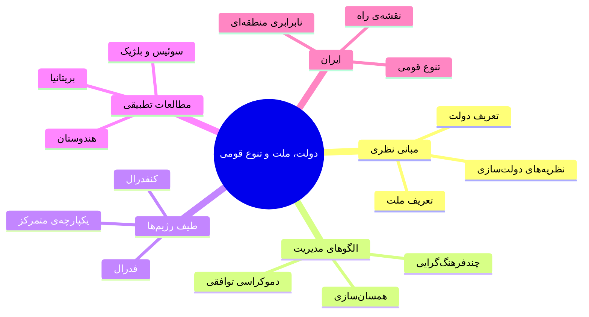
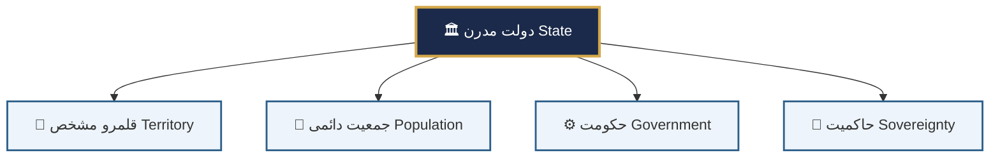
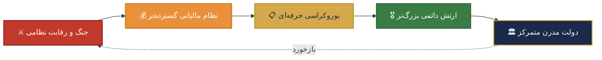
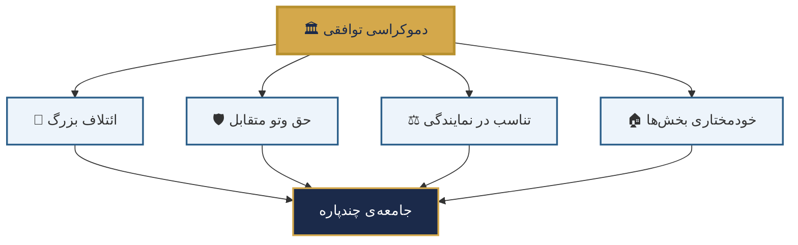
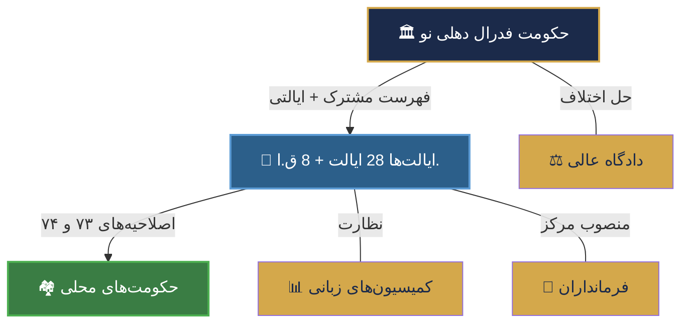
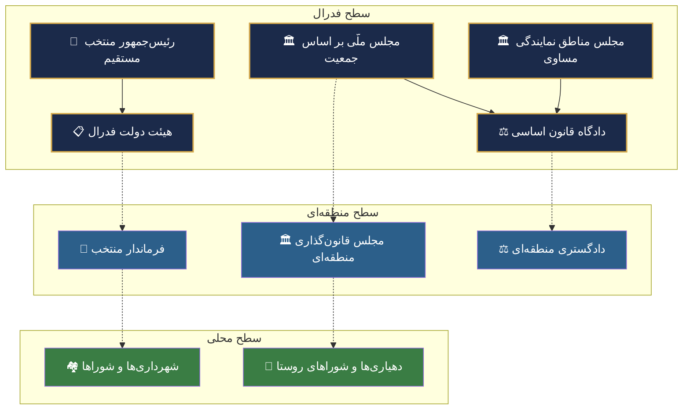
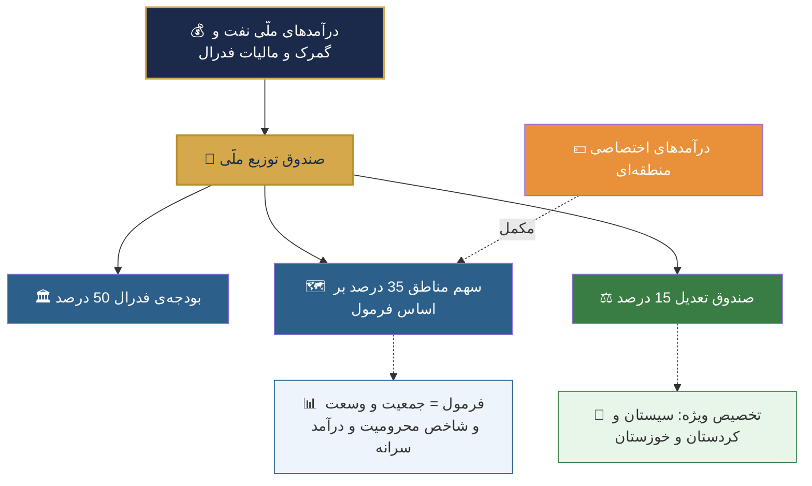

# دولت، ملت و تنوع قومی

## مبانی نظری، الگوهای تطبیقی و نقشه‌ی راه برای ایران

> «هنر حکمرانی، هنر زیستن با تفاوت‌هاست.»
> — ویل کیملیکا

مهدی سالم

پژوهشگر سیاست تطبیقی و طراحی نهادی • زمستان ۱۴۰۴

---

## فهرست مطالب

- [۱. درآمد: چرا این بحث مهم است؟](#1-درآمد)
- [۲. مفهوم‌شناسی: دولت، ملت و قومیت](#2-مفهوم‌شناسی)
- [۳. نظریه‌های شکل‌گیری دولت](#3-نظریه‌های-شکل‌گیری-دولت)
- [۴. الگوهای مدیریت تنوع قومی–ملّی](#4-الگوهای-مدیریت-تنوع)
- [۵. طیف رژیم‌های سیاسی](#5-طیف-رژیم‌های-سیاسی)
- [۶. مطالعات تطبیقی](#6-مطالعات-تطبیقی)
- [۷. ایران: تحلیل ساختار قومی–ملّی](#7-ایران)
- [۸. نقشه‌ی راه اجرایی برای ایران](#8-نقشه‌ی-راه)
- [۹. جمع‌بندی: دَه فرمان اصلاحات ساختاری](#9-جمع‌بندی)
- [منابع](#منابع)

---

## ۱. درآمد: چرا این بحث مهم است؟ {#1-درآمد}

از مجموع تقریباً **۲۰۰ کشور** جهان، کمتر از **۱۰ درصد** از نظر قومی همگن هستند. بیشتر دولت‌ها با چالش مدیریت تنوع درونی مواجه‌اند. پرسش بنیادین این است:

**🔑 پرسش محوری:**
چگونه می‌توان ساختاری سیاسی طراحی کرد که تنوع قومی و ملّی را نه **تهدید**، بلکه **فرصت** بشمارد — و هم‌زمان یکپارچگی سرزمینی، دموکراسی و توسعه‌ی پایدار را تضمین کند؟

این پرسش به‌ویژه برای **ایران** — کشوری با حداقل ۸ تا ۱۰ گروه قومی–زبانی اصلی — اهمیت حیاتی دارد.

### نقشه‌ی مفهومی مقاله

---

## ۲. مفهوم‌شناسی: دولت، ملت و قومیت {#2-مفهوم‌شناسی}

### ۲.۱. سه مفهوم بنیادین

تمایز میان **دولت** (State)، **ملت** (Nation) و **قومیت** (Ethnicity) نقطه‌ی آغاز هر تحلیلی در این حوزه است:

| مفهوم | تعریف | ماهیت | مثال |
|:---:|:---|:---:|:---|
| **🏛️ دولت (State)** | نهاد سیاسی دارای انحصار مشروع خشونت در قلمرو مشخص (وبر) | **حقوقی–سیاسی** | جمهوری فرانسه، پادشاهی متحده |
| **🌍 ملت (Nation)** | جامعه‌ای با هویت مشترک (مدنی یا قومی) که خواهان خودحکومتی است | **فرهنگی–سیاسی** | ملت کُرد، ملت کاتالان |
| **🧬 قومیت (Ethnicity)** | گروه فرهنگی با زبان، آداب یا تبار مشترک | **فرهنگی–اجتماعی** | بلوچ‌ها، باسک‌ها |

### ۲.۲. چهار عنصر سازنده‌ی دولت مدرن

### ۲.۳. دو رویکرد به ملت

#### 🏛️ ملت مدنی (Civic Nation)
- مبنا: **شهروندی مشترک** و اراده‌ی سیاسی
- زبان: یک زبان رسمی (اما نه لزوماً مادری همه)
- هویت: **انتخابی** و قابل اکتساب
- 📌 نمونه: فرانسه، ایالات متحده
- 👤 اندیشمند: ارنست رنان

#### 🧬 ملت قومی (Ethnic Nation)
- مبنا: **تبار، زبان و فرهنگ** مشترک
- زبان: زبان مادری مشترک
- هویت: **ذاتی** و موروثی
- 📌 نمونه: آلمان (پیش از ۱۹۴۵)، ژاپن
- 👤 اندیشمند: یوهان گوتفرید هردر

**⚠️ نکته‌ی کلیدی:**
یک **دولت** ممکن است چندین **ملت** و ده‌ها **قومیت** را در بر بگیرد. عدم تطابق مرزهای دولت با مرزهای ملت، ریشه‌ی بسیاری از تنش‌های سیاسی معاصر است.

---

## ۳. نظریه‌های شکل‌گیری دولت {#3-نظریه‌های-شکل‌گیری-دولت}

### ۳.۱. شش نظریه‌ی اصلی

| # | نظریه | شرح اجمالی | اندیشمند(ان) | قوت اصلی | ضعف اصلی |
|:---:|:---|:---|:---|:---|:---|
| ۱ | **قرارداد اجتماعی** | دولت حاصل توافق ارادی افراد برای خروج از وضع طبیعی | هابز، لاک، روسو | مبنای حقوق بشر | غیرتاریخی |
| ۲ | **فتح و غلبه** | تسلط گروهی بر گروه دیگر | ابن‌خلدون، اوپنهایمر | واقع‌گرایی تاریخی | تقلیل‌گرا |
| ۳ | **مارکسیستی** | ابزار سلطه‌ی طبقاتی همراه مالکیت خصوصی | مارکس، انگلس، لنین | تحلیل اقتصادی | نادیده‌گرفتن فرهنگ |
| ۴ | **جنگ (تیلی)** | رقابت نظامی → بوروکراسی → دولت مدرن | چارلز تیلی | شواهد تاریخی قوی | اروپامحور |
| ۵ | **هیدرولیکی** | مدیریت آبیاری در مقیاس بزرگ → تمرکز | ویتفوگل | شرق‌شناسی تاریخی | بیش‌تعمیم |
| ۶ | **نهادگرایی تاریخی** | مسیرهای تاریخی ویژه (وابستگی به مسیر) | مور، اسکاچپل | جامعیت | پیچیدگی |

### ۳.۲. چرخه‌ی تیلی: «جنگ دولت می‌سازد»

> *"War made the state, and the state made war."*
> — Charles Tilly

### ۳.۳. سه مسیر عمده‌ی دولت‌سازی در جهان

#### 🇪🇺 مسیر اروپایی
جنگ → مالیات → بوروکراسی → **دموکراسی تدریجی**

📌 بریتانیا، فرانسه، آلمان

#### 🌍 مسیر پسااستعماری
مرزهای مصنوعی → دولتِ وارداتی → **بحران مشروعیت**

📌 عراق، نیجریه، سودان

#### ✊ مسیر انقلابی
انقلاب → دولت ایدئولوژیک → **اصلاحات یا فروپاشی**

📌 شوروی، چین، ایران

---

## ۴. الگوهای مدیریت تنوع قومی–ملّی {#4-الگوهای-مدیریت-تنوع}

### ۴.۱. طیف الگوها: از سرکوب تا جدایی

◀ کمترین تنوع‌پذیری ─────────────────── بیشترین تنوع‌پذیری ▶

### ۴.۲. ارزیابی تطبیقی الگوها

| الگو | مزایا | معایب | نمونه | پایداری | دموکراسی |
|:---|:---|:---|:---|:---:|:---:|
| **همسان‌سازی** | وحدت ملی قوی، ساده‌سازی اداری | سرکوب فرهنگی، مقاومت بلندمدت | فرانسه‌ی قدیم، ترکیه‌ی کمالیستی | 🟡 متوسط | 🔴 ضعیف |
| **ادغام مدنی** | انعطاف‌پذیری، جذب مهاجران | عدم پاسخ به مطالبات عمیق قومی | آمریکا، فرانسه‌ی معاصر | 🟢 بالا | 🟢 خوب |
| **چندفرهنگ‌گرایی** | رضایت اقلیت‌ها، ثبات اجتماعی | هزینه‌ی بالا، تشدید مرزهای قومی | کانادا، استرالیا | 🟢 بالا | 🟢 خوب |
| **دموکراسی توافقی** | صلح در جوامع چندپاره | کُندی تصمیم‌گیری، بن‌بست | بلژیک، لبنان | 🟡 متوسط | 🟡 متوسط |
| **فدرالیسم قومی** | خودمختاری + وحدت | خطر جدایی‌طلبی | هند، بلژیک | 🟢 بالا | 🟢 خوب |
| **خودمختاری سرزمینی** | پاسخ به مطالبات بدون جدایی | نابرابری بین مناطق | اسپانیا، عراق | 🟡 متوسط | 🟢 خوب |
| **کنفدراسیون** | احترام حداکثری به حق تعیین سرنوشت | ضعف ساختاری، ناپایداری | اتحادیه‌ی اروپا | 🔴 پایین | 🟢 خوب |

### ۴.۳. دموکراسی توافقی لیپهارت: چهار ستون

### ۴.۴. اجماع‌های نسبی در ادبیات تطبیقی

**✅ یافته‌های مشترک پژوهشگران (لیپهارت، هورویتز، کیملیکا، لینتس و استپان):**

1. **هیچ مدل واحدی** برای همه‌ی جوامع جواب نمی‌دهد — طراحی باید **زمینه‌محور** باشد.
2. **سرکوب تنوع در بلندمدت ناکارآمد است** — مدل‌های همسان‌ساز رادیکالیسم می‌زایند.
3. **فدرالیسم غیرمتقارن** اغلب از فدرالیسم متقارن کارآمدتر است.
4. **دموکراسی توافقی** در جوامع عمیقاً تقسیم‌شده مؤثرتر از دموکراسی اکثریتی است.
5. **توسعه‌ی اقتصادی عادلانه** پیش‌نیاز صلح قومی پایدار است.

---

## ۵. طیف رژیم‌های سیاسی {#5-طیف-رژیم‌های-سیاسی}

### ۵.۱. از تمرکز مطلق تا حداکثر تمرکززدایی

### ۵.۲. مقایسه‌ی تفصیلی پنج نوع نظام

#### نوع ۱: دولت یکپارچه‌ی متمرکز

| ویژگی | توضیح |
|:---|:---|
| **توزیع قدرت** | تمام قدرت در مرکز متمرکز |
| **واحدهای محلی** | صرفاً نمایندگان اداری مرکز |
| **اختیار ذاتی** | واحدها اختیار ذاتی ندارند |
| **نمونه‌ها** | فرانسه (پیش از ۱۹۸۲)، ترکیه‌ی کمالیستی، ایران |
| **مناسب برای** | جوامع نسبتاً همگن |
| **چالش اصلی** | بحران مشروعیت در پیرامون |

#### نوع ۲: دولت یکپارچه‌ی غیرمتمرکز

| ویژگی | توضیح |
|:---|:---|
| **توزیع قدرت** | ساختار یکپارچه + تفویض اختیارات اجرایی |
| **تفاوت با فدرالیسم** | واحدها حق ذاتی ندارند؛ تفویض قابل بازپس‌گیری |
| **نمونه‌ها** | فرانسه‌ی معاصر، اندونزی (پس از ۱۹۹۸)، اسکاندیناوی |

#### نوع ۳: دولت منطقه‌ای‌شده (Regionalized)

| ویژگی | توضیح |
|:---|:---|
| **توزیع قدرت** | میانه‌ی یکپارچه و فدرال |
| **خودمختاری** | برخی مناطق خودمختاری قانون‌گذاری دارند |
| **نمونه‌ها** | اسپانیا (Comunidades Autónomas)، ایتالیا |
| **چالش** | بحران کاتالونیا ۲۰۱۷ |

#### نوع ۴: فدراسیون

**🏗️ چهار اصل بنیادین فدرالیسم:**

1. **تقسیم قانون‌اساسی قدرت:** هیچ سطحی نمی‌تواند یک‌جانبه سهم دیگری را تغییر دهد
2. **نمایندگی دوگانه:** شهروندان هم در سطح فدرال و هم ایالتی نمایندگی دارند
3. **داوری قضایی:** دادگاه قانون اساسی اختلافات بین سطوح را حل می‌کند
4. **قانون اساسی سخت:** تغییر نیازمند موافقت واحدهاست

#### نوع ۵: کنفدراسیون

| ویژگی | توضیح |
|:---|:---|
| **حاکمیت** | واحدها حاکمیت کامل حفظ می‌کنند |
| **نهاد مرکزی** | صرفاً هماهنگ‌کننده |
| **خروج** | خروج یک‌جانبه ممکن |
| **نمونه** | مواد کنفدراسیون آمریکا (۱۷۸۱–۱۷۸۹)، اتحادیه‌ی اروپا |

### ۵.۳. مقایسه‌ی فدراسیون‌های عمده‌ی جهان

| کشور | تعداد واحدها | نوع فدرالیسم | مجلس دوم | ویژگی خاص | چالش اصلی |
|:---|:---:|:---|:---|:---|:---|
| 🇺🇸 **آمریکا** | ۵۰ | متقارن–رقابتی | سنا (۱۰۰) | قدرت ایالتی بالا | نابرابری، قطبی‌شدن |
| 🇩🇪 **آلمان** | ۱۶ | متقارن–همکاری | بوندِسرات | فدرالیسم اجرایی | تفاوت شرق/غرب |
| 🇮🇳 **هند** | ۲۸+۸ | نامتقارن–قومی | راجیاسبها | ایالت‌سازی زبانی | تنش مذهبی |
| 🇨🇦 **کانادا** | ۱۰+۳ | نامتقارن | سنا (منصوب) | دوزبانگی، کِبِک | جدایی‌طلبی کبک |
| 🇨🇭 **سوئیس** | ۲۶ | متقارن | شورای ایالات | دموکراسی مستقیم، ۴ زبان | فرایند کُند |
| 🇧🇪 **بلژیک** | ۳+۳ | نامتقارن–قومی | سنا | فدرالیسم گریز از مرکز | بن‌بست مکرر |
| 🇷🇺 **روسیه** | ۸۵ | نامتقارن | شورای فدراسیون | رسماً فدرال، عملاً متمرکز | اقتدارگرایی |
| 🇪🇹 **اتیوپی** | ۱۱ | قومی | مجلس فدراسیون | حق جدایی (ماده ۳۹) | جنگ تیگرای |

---

## ۶. مطالعات تطبیقی {#6-مطالعات-تطبیقی}

### ۶.۱. هندوستان: آزمایشگاه بزرگ مدیریت تنوع

**🇮🇳 هند در یک نگاه:**
- 🔢 جمعیت: بیش از **۱.۴ میلیارد** نفر
- 🗣️ زبان‌ها: بیش از **۲۰۰۰** گروه قومی و **۲۲** زبان رسمی
- 🛕 ادیان: هندوئیسم، اسلام، مسیحیت، سیکیسم، بودیسم و...
- 🏛️ نظام: **فدراسیون نامتقارن** با ۲۸ ایالت + ۸ قلمرو اتحادی

#### ابزارهای کلیدی مدیریت تنوع

| ابزار | شرح | تاریخ |
|:---|:---|:---:|
| **بازترسیم مرزهای ایالتی** | ایجاد ایالت‌ها بر پایه‌ی زبان (کمیسیون فضل‌علی) | ۱۹۵۶ |
| **سیستم سهمیه‌بندی (Reservation)** | سهمیه برای طبقات محروم در آموزش و استخدام | ۱۹۵۰ |
| **چندزبانگی رسمی** | ۲۲ زبان + فرمول سه‌زبانه در آموزش | ۱۹۵۰ |
| **فهرست‌های سه‌گانه** | تقسیم صلاحیت: فدرال (۹۷)، ایالتی (۶۶)، مشترک (۴۷) | ۱۹۵۰ |
| **ماده ۳۷۰ (کشمیر)** | خودمختاری ویژه (لغو شده در ۲۰۱۹) | ۱۹۵۰–۲۰۱۹ |
| **ضمیمه‌ی ششم** | خودمختاری مناطق قبیله‌ای شمال‌شرق | ۱۹۵۰ |

### ۶.۲. بریتانیا: واگذاری قدرت (Devolution)

**🇬🇧 بریتانیا:** رسماً دولت یکپارچه، اما از ۱۹۹۸ واگذاری نامتقارن قدرت:

| ملت | نهاد | اختیارات | از سال |
|:---|:---|:---|:---:|
| 🏴󠁧󠁢󠁳󠁣󠁴󠁿 **اسکاتلند** | پارلمان اسکاتلند | آموزش، بهداشت، حقوق، مالیات جزئی | ۱۹۹۹ |
| 🏴󠁧󠁢󠁷󠁬󠁳󠁿 **ولز** | سِنِد کِمرو | محدودتر از اسکاتلند | ۱۹۹۹ |
| 🇬🇧 **ایرلند شمالی** | مجلس استورمونت | گسترده (توافق جمعه‌ی نیک) | ۱۹۹۸ |
| 🏴󠁧󠁢󠁥󠁮󠁧󠁿 **انگلستان** | ❌ بدون پارلمان جداگانه | حکومت مستقیم وست‌مینستر | — |

### ۶.۳. نمونه‌های تکمیلی

#### 🇨🇭 سوئیس: الگوی موفق
- ۲۶ کانتون، ۴ زبان رسمی
- دموکراسی مستقیم + فدرالیسم + اجماع
- **آموزه:** فرهنگ اجماع + نهادهای قوی = تنوع پایدار

#### 🇧🇪 بلژیک: فدرالیسم بحران‌زده
- ۵۴۱ روز بدون دولت (۲۰۱۰–۲۰۱۱)!
- تقسیم والونی/فلاندر
- **آموزه:** فدرالیسم قومی بدون مکانیسم حل اختلاف = بن‌بست

#### 🇮🇶 عراق: فدرالیسم ناتمام
- فقط اقلیم کردستان عملاً شکل گرفت
- تنش بغداد–اربیل
- **آموزه:** فدرالیسم بدون اعتماد متقابل = بی‌ثباتی

#### 🇪🇹 اتیوپی: آزمایش خطرناک
- حق جدایی در قانون اساسی (ماده ۳۹)
- جنگ تیگرای (۲۰۲۰–۲۰۲۲)
- **آموزه:** حق جدایی بدون نهادسازی = فاجعه

### ۶.۴. آموزه‌های کلیدی برای ایران

| کشور | آموزه‌ی مثبت | هشدار |
|:---|:---|:---|
| 🇮🇳 **هند** | ایالت‌سازی زبانی، فدرالیسم نامتقارن | لغو ماده ۳۷۰ → نتیجه‌ی معکوس |
| 🇬🇧 **بریتانیا** | واگذاری تدریجی و نامتقارن | عدم واگذاری به انگلستان، تنش برگزیت |
| 🇨🇭 **سوئیس** | فدرالیسم + دموکراسی مستقیم + اجماع | نیاز به فرهنگ سیاسی بلوغ‌یافته |
| 🇧🇪 **بلژیک** | حل خلاقانه‌ی تعارض زبانی | بن‌بست مکرر |
| 🇮🇶 **عراق** | به‌رسمیت‌شناسی فدرالیسم | فدرالیسم بدون اعتماد ناکارآمد |
| 🇪🇹 **اتیوپی** | صراحت قانون اساسی | فدرالیسم قومی افراطی خطرناک |

---
## ۸. نقشه‌ی راه اجرایی برای ایران {#8-نقشه‌ی-راه}

### ۸.۱. هشت اصل راهنما

| # | اصل | توضیح |
|:---:|:---|:---|
| 🛡️ **I** | **یکپارچگی سرزمینی** | هیچ طرحی نباید تمامیت ارضی را به خطر اندازد |
| 🗳️ **II** | **دموکراسی و حقوق بشر** | مبنای هر اصلاحی حقوق فردی و جمعی شهروندان |
| 🌈 **III** | **به‌رسمیت‌شناسی تنوع** | حمایت فعال از هویت‌های فرهنگی متفاوت |
| 🐢 **IV** | **تدریجی‌بودن** | مرحله‌به‌مرحله با ارزیابی مستمر |
| ⚖️ **V** | **عدم تقارن هوشمند** | واحدها می‌توانند اختیارات متفاوت داشته باشند |
| 💰 **VI** | **عدالت توزیعی** | توسعه‌ی اقتصادی عادلانه پیش‌شرط اصلاح سیاسی |
| 🤝 **VII** | **مشارکت و اجماع** | گفت‌وگوی ملّی نه تحمیل از بالا |
| ☮️ **VIII** | **سکولاریسم شمول‌گرا** | جدایی دین از حکومت با احترام به همه‌ی باورها |

### ۸.۲. ساختار نهادی پیشنهادی

### ۸.۳. تقسیم صلاحیت‌ها

| صلاحیت فدرال (انحصاری)  | صلاحیت مشترک              | صلاحیت منطقه‌ای (انحصاری)         |
| :---------------------- | :------------------------ | :-------------------------------- |
| 🎖️ دفاع ملّی و ارتش    | 🏥 بهداشت عمومی           | 📚 آموزش (محتوای منطقه‌ای + زبان) |
| 🌐 سیاست خارجی          | 🌿 محیط زیست              | 🎭 فرهنگ و میراث محلی             |
| 💵 پول و بانکداری مرکزی | ⚡ انرژی (تولید و توزیع)   | 🏖️ گردشگری منطقه‌ای              |
| 🛃 گمرک و تجارت خارجی   | 🚂 حمل‌ونقل بین‌منطقه‌ای  | 🚌 حمل‌ونقل درون‌منطقه‌ای         |
| 📜 حقوق شهروندی پایه    | 🎓 آموزش عالی             | 🌾 کشاورزی و منابع محلی           |
| ⚖️ دادگاه قانون اساسی   | 🏭 صنعت و معدن            | 🏗️ مسکن و شهرسازی                |
| 💰 مالیات‌های فدرال     | 🛡️ امنیت داخلی (هماهنگی) | 💰 مالیات‌های منطقه‌ای            |
| 🛂 مهاجرت و تابعیت      | 👴 تأمین اجتماعی          | 👮 پلیس محلی                      |

### ۸.۴. مدل فدرالیسم مالی

### ۸.۵. سیاست زبانی: مدل سه‌لایه‌ای

#### 🌐 لایه‌ی اول: زبان ملّی مشترک
**فارسی** — زبان ارتباط ملّی، قانون‌گذاری فدرال، رسانه‌ی ملّی

#### 🗣️ لایه‌ی دوم: زبان‌های رسمی منطقه‌ای
**ترکی آذربایجانی** (شمال‌غرب) • **کُردی** (غرب) • **عربی** (جنوب‌غرب)
**بلوچی** (جنوب‌شرق) • **ترکمنی** (شمال‌شرق) • **گیلکی/مازندرانی** (شمال)

#### 🌍 لایه‌ی سوم: زبان بین‌المللی
**انگلیسی** — از مقطع راهنمایی به‌عنوان زبان بین‌المللی

#### مقایسه‌ی سیاست زبانی

| معیار | 🇮🇷 ایران فعلی | 🇮🇳 هند | 📋 مدل پیشنهادی |
|:---|:---|:---|:---|
| **زبان رسمی ملّی** | فارسی (تنها زبان رسمی) | هندی + انگلیسی | فارسی (زبان مشترک ملّی) |
| **زبان‌های منطقه‌ای** | غیررسمی (اصل ۱۵ اجرا نشده) | ۲۲ زبان رسمی | رسمیت در واحدهای فدرال |
| **آموزش ابتدایی** | فقط فارسی | به زبان ایالتی + هندی | زبان مادری + فارسی از سوم |
| **خدمات دولتی** | فقط فارسی | دوزبانه در ایالات | دوزبانه در مناطق |
| **رسانه‌ی عمومی** | عمدتاً فارسی | شبکه‌های ایالتی قوی | شبکه‌های منطقه‌ای تمام‌عیار |

### ۸.۶. ماتریس ریسک و مهار

| ریسک | احتمال | شدت | راهکار مهار |
|:---|:---:|:---:|:---|
| 🔺 **تشدید جدایی‌طلبی** | 🟡 متوسط | 🔴 بالا | ترکیب خودمختاری با عدالت اقتصادی؛ واحدبندی غیرقومی؛ تقویت هویت مشترک |
| 🌐 **مداخله‌ی خارجی** | 🟡 متوسط | 🔴 بالا | دیپلماسی فعال؛ ارتش فدرال قوی؛ اتحادهای منطقه‌ای |
| 🏛️ **مقاومت نخبگان متمرکزگرا** | 🔴 بالا | 🟡 متوسط | گفت‌وگو؛ نشان‌دادن منافع ملّی تمرکززدایی؛ فشار مدنی |
| 🔒 **بن‌بست سیاسی** | 🟡 متوسط | 🟡 متوسط | مکانیسم‌های حل اختلاف (دادگاه ق.ا.، کمیسیون میانجی‌گری) |
| 📋 **ناکارآمدی اداری** | 🟡 متوسط | 🟡 متوسط | آموزش کارکنان؛ دولت الکترونیک؛ ساده‌سازی |
| 💰 **نابرابری بین واحدها** | 🔴 بالا | 🟡 متوسط | صندوق انتقالی قوی (مدل آلمان)؛ فرمول توزیع عادلانه |

### ۸.۷. شاخص‌های پایش (KPIs)

| شاخص | تعریف | 🎯 هدف ۵ ساله | 🎯 هدف ۱۵ ساله |
|:---|:---|:---:|:---:|
| 📊 **شکاف HDI** | اختلاف بالاترین و پایین‌ترین منطقه | < ۰.۱۵ | < ۰.۰۸ |
| 📚 **آموزش به زبان مادری** | درصد دانش‌آموزان اقلیت با دسترسی | ۵۰% | ۹۵% |
| 😊 **رضایت‌مندی قومی** | پیمایش سالانه (۱–۱۰) | > ۶ | > ۸ |
| 👥 **نمایندگی اقلیت‌ها** | درصد در مناصب کلیدی | ۲۰% | متناسب |
| 🔍 **شفافیت بودجه** | امتیاز (۱–۱۰۰) | > ۶۰ | > ۸۵ |
| 🏠 **مهاجرت معکوس** | درصد بازگشت به مناطق اقلیت‌نشین | +۱۰% | +۲۵% |
| 🏛️ **ثبات سیاسی** | Fragile States Index | +۱۰ رتبه | +۳۰ رتبه |

---

## ۹. جمع‌بندی: دَه فرمان اصلاحات ساختاری {#9-جمع‌بندی}

### 📜 دَه فرمان اصلاحات ساختاری برای ایران

۱
**وحدت در تنوع:** یکپارچگی سرزمینی + احترام به تفاوت‌ها

۲
**تدریجی‌بودن:** عجله دشمن اصلاحات است

۳
**عدالت اقتصادی** پیش‌شرط صلح قومی است

۴
**زبان مادری حق است** نه امتیاز

۵
**فدرالیسم نامتقارن** بر فدرالیسم متقارن ترجیح دارد

۶
**واحدبندی جغرافیایی–فرهنگی** نه صرفاً قومی

۷
**مجلس دوم** برای صدای مناطق ضروری است

۸
**دادگاه قانون اساسی مستقل** داور نهایی است

۹
**دموکراسی محلی** پایه‌ی دموکراسی ملّی است

۱۰
**گفت‌وگوی ملّی** جایگزین تحمیل از بالاست

### جدول جامع نهایی

| شاخص | 🇮🇷 ایران فعلی | 🇮🇳 هند | 🇨🇭 سوئیس | 🇬🇧 بریتانیا | 📋 مدل پیشنهادی |
|:---|:---:|:---:|:---:|:---:|:---:|
| **نوع نظام** | یکپارچه‌ی متمرکز | فدرال نامتقارن | فدرال متقارن | یکپارچه + واگذاری | فدرال نامتقارن |
| **زبان‌های رسمی** | ۱ | ۲۳ | ۴ | ۱ + محلی | ۱ ملّی + ۶ منطقه‌ای |
| **مجلس دوم** | ❌ | ✅ راجیاسبها | ✅ شورای ایالات | ✅ لُردها | ✅ مجلس مناطق |
| **دادگاه ق.ا.** | ❌ (شورای نگهبان) | ✅ دادگاه عالی | ✅ دادگاه فدرال | ❌ (محدود) | ✅ مستقل |
| **HDI** | ۰.۷۴ | ۰.۶۳ | ۰.۹۶ | ۰.۹۳ | هدف: بالای ۰.۸۵ |
| **شاخص دموکراسی** | ۱.۹ | ۷.۰ | ۹.۱ | ۸.۱ | هدف: بالای ۷.۵ |
| **حقوق اقلیت‌ها** | 🔴 ضعیف | 🟡 متوسط | 🟢 خوب | 🟢 خوب | هدف: 🟢 خوب |

### پیام پایانی

> ایران سرزمین تنوع است — تنوع زبان، تنوع فرهنگ، تنوع جغرافیا.
> این تنوع می‌تواند **بزرگ‌ترین ثروت** ما باشد یا **بزرگ‌ترین چالش** ما.
>
> فرق این دو در **طراحی نهادی** است:
> نهادهایی که صدای همه را بشنوند، حقوق همه را تضمین کنند
> و فرصت‌ها را عادلانه توزیع کنند.
>
> این انتخاب در دست ماست.

---

## چک‌لیست اقدامات اولویت‌دار

| # | اقدام | اولویت | بازه‌ی زمانی |
|:---:|:---|:---:|:---:|
| ۱ | اجرای اصل ۱۵ (آموزش به زبان مادری) | 🔴 **فوری** | ۱–۲ سال |
| ۲ | تصویب قانون ضد تبعیض قومی | 🔴 **فوری** | ۱ سال |
| ۳ | برنامه‌ی ویژه‌ی توسعه‌ی مناطق محروم | 🔴 **فوری** | ۱–۳ سال |
| ۴ | تقویت شوراهای محلی و استانی | 🟠 **بالا** | ۲–۳ سال |
| ۵ | تشکیل کمیسیون ملّی گفت‌وگوی قومی | 🟠 **بالا** | ۱–۲ سال |
| ۶ | انتخابی‌شدن استانداران | 🟡 **متوسط** | ۳–۵ سال |
| ۷ | ایجاد مجالس قانون‌گذاری منطقه‌ای | 🟡 **متوسط** | ۳–۵ سال |
| ۸ | ایجاد مجلس مناطق (مجلس دوم) | 🟡 **متوسط** | ۵–۷ سال |
| ۹ | صندوق تعدیل منطقه‌ای | 🟡 **متوسط** | ۳–۵ سال |
| ۱۰ | دادگاه قانون اساسی مستقل | 🔵 **بلندمدت** | ۵–۱۰ سال |
| ۱۱ | مجلس مؤسسان و قانون اساسی جدید | 🔵 **بلندمدت** | ۷–۱۵ سال |
| ۱۲ | همه‌پرسی ملّی | 🔵 **بلندمدت** | ۱۰–۱۵ سال |

---

## منابع {#منابع}

### کتاب‌های کلیدی لاتین

1. **Lijphart, Arend.** *Patterns of Democracy* (2012)
2. **Kymlicka, Will.** *Multicultural Citizenship* (1995)
3. **Tilly, Charles.** *Coercion, Capital and European States* (1990)
4. **Linz & Stepan.** *Problems of Democratic Transition* (1996)
5. **Horowitz, Donald.** *Ethnic Groups in Conflict* (1985)

6. **Anderson, Benedict.** *Imagined Communities* (1983)
7. **Gellner, Ernest.** *Nations and Nationalism* (1983)
8. **Watts, Ronald.** *Comparing Federal Systems* (2008)
9. **Stepan, Alfred.** *Arguing Comparative Politics* (2001)
10. **McGarry & O'Leary.** *The Politics of Ethnic Conflict Regulation* (1993)

### منابع فارسی

1. **قاضی، ابوالفضل.** *حقوق اساسی و نهادهای سیاسی*
2. **بشیریه، حسین.** *آموزش دانش سیاسی*
3. **احمدی، حمید.** *قومیت و قوم‌گرایی در ایران: افسانه و واقعیت*
4. **کاتوزیان، محمدعلی.** *تضاد دولت و ملت*
5. **آبراهامیان، یرواند.** *ایران بین دو انقلاب*
6. **اشرف، احمد.** *هویت ایرانی*

### مقالات کلیدی

- Lijphart, A. (1969). "Consociational Democracy." *World Politics*, 21(2), 207–225.
- Stepan, A. (1999). "Federalism and Democracy: Beyond the U.S. Model." *Journal of Democracy*, 10(4), 19–34.
- Kymlicka, W. (2006). "Emerging Western Models of Multination Federalism." *Nationalism and Ethnic Politics*, 12(3–4), 371–396.
- Horowitz, D. (2002). "Constitutional Design: Proposals versus Processes." In Reynolds (ed.), *The Architecture of Democracy*.

---

---

📖 این مقاله خلاصه‌ای از پژوهش جامع «دولت، ملت و تنوع قومی: مبانی نظری، الگوهای تطبیقی و راهنمای اجرایی برای ایران» است.

بازنشر با ذکر منبع بلامانع است.

*ویرایش اول — بهار ۱۴۰۴*
---

### ✍️ درباره‌ی نویسنده

م.س

**مهدی سالم** — پژوهشگر حوزه‌ی سیاست تطبیقی، طراحی نهادی و مدیریت تنوع. علاقه‌مند به بررسی الگوهای حکمرانی دموکراتیک و ارائه‌ی راهکارهای عملی برای بهبود ساختارهای سیاسی در ایران.

این مقاله بخشی از پروژه‌ی پژوهشی «سیاست تأسیسی و مدیریت تنوع» است که با هدف غنی‌سازی گفت‌وگوی ملّی درباره‌ی آینده‌ی ایران تدوین شده.

📬 برای تماس و تبادل نظر: [https://mahdisalem.com]

