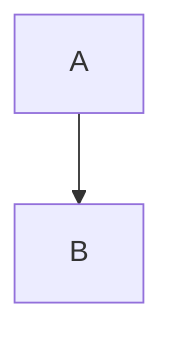
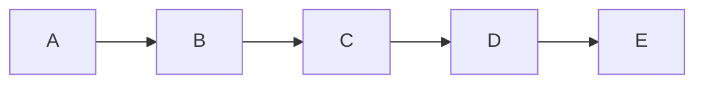

# Problems to be Addressed

## Content Management


#### problem 3- still issue with mixing the mermaid and other html element! please check and fix the logic specially for farsi contents ! 

### Mermaid Chart Size and Position
Keep the toolbar button you added. 
review the ouputs of current converted diagrams and charts or figures! the ones are not showing correctly in the html page. (having error-icon or not showing at all)
however check and apply improvment regarding making the diagram sizes and its resizing more smart using this instruction. 

like this one:
<details open>
<summary>syntax error</summary>
```html
<div class="mermaid-wrapper is-collapsed" role="figure" style="margin-left:auto;margin-right:auto;overflow:auto" data-align="center" data-expanded="false">
<div class="mermaid-toolbar">
    <button class="mermaid-tool-btn zoom-btn" title="Full Screen">🔍</button>
    <button class="mermaid-tool-btn expand-btn" title="Expand/Collapse">↕️</button>
</div>
<div class="mermaid" data-processed="true"><div id="dmermaid-1771620147602" style="font-family: &quot;trebuchet ms&quot;, verdana, arial, sans-serif;"><svg id="mermaid-1771620147602" width="100%" xmlns="http://www.w3.org/2000/svg" xmlns:xlink="http://www.w3.org/1999/xlink" viewBox="0 0 2412 512" style="max-width: 512px;" role="graphics-document document" aria-roledescription="error"><style>#mermaid-1771620147602{font-family:"trebuchet ms",verdana,arial,sans-serif;font-size:16px;fill:#333;}#mermaid-1771620147602 .error-icon{fill:#552222;}#mermaid-1771620147602 .error-text{fill:#552222;stroke:#552222;}#mermaid-1771620147602 .edge-thickness-normal{stroke-width:2px;}#mermaid-1771620147602 .edge-thickness-thick{stroke-width:3.5px;}#mermaid-1771620147602 .edge-pattern-solid{stroke-dasharray:0;}#mermaid-1771620147602 .edge-pattern-dashed{stroke-dasharray:3;}#mermaid-1771620147602 .edge-pattern-dotted{stroke-dasharray:2;}#mermaid-1771620147602 .marker{fill:#333333;stroke:#333333;}#mermaid-1771620147602 .marker.cross{stroke:#333333;}#mermaid-1771620147602 svg{font-family:"trebuchet ms",verdana,arial,sans-serif;font-size:16px;}#mermaid-1771620147602 :root{--mermaid-font-family:"trebuchet ms",verdana,arial,sans-serif;}</style><g></g><g><path class="error-icon" d="m411.313,123.313c6.25-6.25 6.25-16.375 0-22.625s-16.375-6.25-22.625,0l-32,32-9.375,9.375-20.688-20.688c-12.484-12.5-32.766-12.5-45.25,0l-16,16c-1.261,1.261-2.304,2.648-3.31,4.051-21.739-8.561-45.324-13.426-70.065-13.426-105.867,0-192,86.133-192,192s86.133,192 192,192 192-86.133 192-192c0-24.741-4.864-48.327-13.426-70.065 1.402-1.007 2.79-2.049 4.051-3.31l16-16c12.5-12.492 12.5-32.758 0-45.25l-20.688-20.688 9.375-9.375 32.001-31.999zm-219.313,100.687c-52.938,0-96,43.063-96,96 0,8.836-7.164,16-16,16s-16-7.164-16-16c0-70.578 57.422-128 128-128 8.836,0 16,7.164 16,16s-7.164,16-16,16z"></path><path class="error-icon" d="m459.02,148.98c-6.25-6.25-16.375-6.25-22.625,0s-6.25,16.375 0,22.625l16,16c3.125,3.125 7.219,4.688 11.313,4.688 4.094,0 8.188-1.563 11.313-4.688 6.25-6.25 6.25-16.375 0-22.625l-16.001-16z"></path><path class="error-icon" d="m340.395,75.605c3.125,3.125 7.219,4.688 11.313,4.688 4.094,0 8.188-1.563 11.313-4.688 6.25-6.25 6.25-16.375 0-22.625l-16-16c-6.25-6.25-16.375-6.25-22.625,0s-6.25,16.375 0,22.625l15.999,16z"></path><path class="error-icon" d="m400,64c8.844,0 16-7.164 16-16v-32c0-8.836-7.156-16-16-16-8.844,0-16,7.164-16,16v32c0,8.836 7.156,16 16,16z"></path><path class="error-icon" d="m496,96.586h-32c-8.844,0-16,7.164-16,16 0,8.836 7.156,16 16,16h32c8.844,0 16-7.164 16-16 0-8.836-7.156-16-16-16z"></path><path class="error-icon" d="m436.98,75.605c3.125,3.125 7.219,4.688 11.313,4.688 4.094,0 8.188-1.563 11.313-4.688l32-32c6.25-6.25 6.25-16.375 0-22.625s-16.375-6.25-22.625,0l-32,32c-6.251,6.25-6.251,16.375-0.001,22.625z"></path><text class="error-text" x="1440" y="250" font-size="150px" style="text-anchor: middle;">Syntax error in text</text><text class="error-text" x="1250" y="400" font-size="100px" style="text-anchor: middle;">mermaid version 10.9.5</text></g></svg></div></div>
</div>
```
</details>

or this one:
```html
<div class="mermaid" data-processed="true"><div id="dmermaid-1771620274386" style="font-family: &quot;trebuchet ms&quot;, verdana, arial, sans-serif;"><svg id="mermaid-1771620274386" width="100%" xmlns="http://www.w3.org/2000/svg" xmlns:xlink="http://www.w3.org/1999/xlink" viewBox="0 0 2412 512" style="max-width: 512px;" role="graphics-document document" aria-roledescription="error"><style>#mermaid-1771620274386{font-family:"trebuchet ms",verdana,arial,sans-serif;font-size:16px;fill:#333;}#mermaid-1771620274386 .error-icon{fill:#552222;}#mermaid-1771620274386 .error-text{fill:#552222;stroke:#552222;}#mermaid-1771620274386 .edge-thickness-normal{stroke-width:2px;}#mermaid-1771620274386 .edge-thickness-thick{stroke-width:3.5px;}#mermaid-1771620274386 .edge-pattern-solid{stroke-dasharray:0;}#mermaid-1771620274386 .edge-pattern-dashed{stroke-dasharray:3;}#mermaid-1771620274386 .edge-pattern-dotted{stroke-dasharray:2;}#mermaid-1771620274386 .marker{fill:#333333;stroke:#333333;}#mermaid-1771620274386 .marker.cross{stroke:#333333;}#mermaid-1771620274386 svg{font-family:"trebuchet ms",verdana,arial,sans-serif;font-size:16px;}#mermaid-1771620274386 :root{--mermaid-font-family:"trebuchet ms",verdana,arial,sans-serif;}</style><g></g><g><path class="error-icon" d="m411.313,123.313c6.25-6.25 6.25-16.375 0-22.625s-16.375-6.25-22.625,0l-32,32-9.375,9.375-20.688-20.688c-12.484-12.5-32.766-12.5-45.25,0l-16,16c-1.261,1.261-2.304,2.648-3.31,4.051-21.739-8.561-45.324-13.426-70.065-13.426-105.867,0-192,86.133-192,192s86.133,192 192,192 192-86.133 192-192c0-24.741-4.864-48.327-13.426-70.065 1.402-1.007 2.79-2.049 4.051-3.31l16-16c12.5-12.492 12.5-32.758 0-45.25l-20.688-20.688 9.375-9.375 32.001-31.999zm-219.313,100.687c-52.938,0-96,43.063-96,96 0,8.836-7.164,16-16,16s-16-7.164-16-16c0-70.578 57.422-128 128-128 8.836,0 16,7.164 16,16s-7.164,16-16,16z"></path><path class="error-icon" d="m459.02,148.98c-6.25-6.25-16.375-6.25-22.625,0s-6.25,16.375 0,22.625l16,16c3.125,3.125 7.219,4.688 11.313,4.688 4.094,0 8.188-1.563 11.313-4.688 6.25-6.25 6.25-16.375 0-22.625l-16.001-16z"></path><path class="error-icon" d="m340.395,75.605c3.125,3.125 7.219,4.688 11.313,4.688 4.094,0 8.188-1.563 11.313-4.688 6.25-6.25 6.25-16.375 0-22.625l-16-16c-6.25-6.25-16.375-6.25-22.625,0s-6.25,16.375 0,22.625l15.999,16z"></path><path class="error-icon" d="m400,64c8.844,0 16-7.164 16-16v-32c0-8.836-7.156-16-16-16-8.844,0-16,7.164-16,16v32c0,8.836 7.156,16 16,16z"></path><path class="error-icon" d="m496,96.586h-32c-8.844,0-16,7.164-16,16 0,8.836 7.156,16 16,16h32c8.844,0 16-7.164 16-16 0-8.836-7.156-16-16-16z"></path><path class="error-icon" d="m436.98,75.605c3.125,3.125 7.219,4.688 11.313,4.688 4.094,0 8.188-1.563 11.313-4.688l32-32c6.25-6.25 6.25-16.375 0-22.625s-16.375-6.25-22.625,0l-32,32c-6.251,6.25-6.251,16.375-0.001,22.625z"></path><text class="error-text" x="1440" y="250" font-size="150px" style="text-anchor: middle;">Syntax error in text</text><text class="error-text" x="1250" y="400" font-size="100px" style="text-anchor: middle;">mermaid version 10.9.5</text></g></svg></div></div>
```

### instruction for smarter handeling of mermais charts visually
````markdown


# Smart Mermaid Chart Sizing for Astro

The root problem: Mermaid generates SVGs with `width="100%"` and a `max-width` set to the **exact pixel dimensions** of the viewBox. Small diagrams stretch too wide, and wide diagrams get constrained too small.

## The Solution: A Post-Render Sizing Script + CSS

### 1. Client-Side Smart Resizer Script

Create `src/scripts/mermaid-resize.ts` (or `.js`):

```js
// src/scripts/mermaid-resize.js
// Run AFTER mermaid has rendered all diagrams

export function smartResizeMermaidDiagrams() {
  const wrappers = document.querySelectorAll('.mermaid-wrapper');

  wrappers.forEach((wrapper) => {
    const svg = wrapper.querySelector('svg');
    if (!svg) return;

    const viewBox = svg.getAttribute('viewBox');
    if (!viewBox) return;

    const parts = viewBox.split(/\s+/).map(Number);
    // viewBox = "minX minY width height"
    const vbWidth = parts[2] - parts[0];   // could have negative minX offset
    const vbHeight = parts[3] - parts[1];

    // Actual content dimensions (accounting for -8 -8 offset mermaid adds)
    const contentWidth = parts[2];
    const contentHeight = parts[3];

    const aspectRatio = contentWidth / contentHeight;
    const containerWidth = wrapper.parentElement?.clientWidth || 800;

    // Remove mermaid's default width="100%" and max-width
    svg.removeAttribute('width');
    svg.style.removeProperty('max-width');

    // Classification
    const isSmall = contentWidth < 350 && contentHeight < 350;
    const isNarrow = contentWidth < 400 && aspectRatio < 0.6;       // tall & narrow
    const isWide = contentWidth > 500 && aspectRatio > 1.8;         // wide & short
    const isMedium = !isSmall && !isNarrow && !isWide;

    // Desired rendered width
    let targetWidth;
    let maxHeight = null;

    if (isWide) {
      // Wide diagrams: use full container width, minimum 80%
      targetWidth = Math.min(contentWidth * 1.2, containerWidth);
      targetWidth = Math.max(targetWidth, containerWidth * 0.8);
    } else if (isNarrow) {
      // Tall narrow diagrams: cap width, constrain height
      targetWidth = Math.min(contentWidth * 1.5, containerWidth * 0.6);
      maxHeight = Math.min(contentHeight * (targetWidth / contentWidth), 700);
    } else if (isSmall) {
      // Small diagrams: scale up but not beyond 2x or container
      targetWidth = Math.min(contentWidth * 2, containerWidth * 0.7);
    } else {
      // Medium diagrams: natural size up to 90% container
      targetWidth = Math.min(contentWidth * 1.3, containerWidth * 0.9);
    }

    // Apply sizing
    svg.style.width = `${Math.round(targetWidth)}px`;
    svg.style.maxWidth = '100%';
    svg.style.height = 'auto';

    if (maxHeight) {
      wrapper.style.maxHeight = `${Math.round(maxHeight)}px`;
      wrapper.style.overflowY = 'auto';
    }

    // Add size class for CSS hooks
    wrapper.classList.add(`mermaid-${isWide ? 'wide' : isNarrow ? 'narrow' : isSmall ? 'small' : 'medium'}`);

    // Store original dimensions for the zoom/fullscreen feature
    wrapper.dataset.vbWidth = String(contentWidth);
    wrapper.dataset.vbHeight = String(contentHeight);
    wrapper.dataset.aspectRatio = String(aspectRatio.toFixed(2));
  });
}
```

### 2. Enhanced Initialization Script

In your Astro layout or component where Mermaid is initialized:

```astro
---
// MermaidInit.astro - place this in your layout
---

<script>
import mermaid from 'mermaid';
import { smartResizeMermaidDiagrams } from '../scripts/mermaid-resize.js';

mermaid.initialize({
  startOnLoad: false,
  theme: 'default',
  flowchart: {
    useMaxWidth: false,    // KEY: This prevents the width="100%" problem
    htmlLabels: true,
    curve: 'basis',
  },
  themeVariables: {
    fontSize: '14px',
  },
});

async function renderMermaid() {
  try {
    await mermaid.run({
      querySelector: '.mermaid:not([data-processed])',
    });
  } catch (e) {
    console.error('Mermaid render error:', e);
  }

  // Apply smart sizing AFTER render
  requestAnimationFrame(() => {
    smartResizeMermaidDiagrams();
  });
}

// Initial render
document.addEventListener('DOMContentLoaded', renderMermaid);

// Re-render on page navigation (Astro View Transitions)
document.addEventListener('astro:page-load', renderMermaid);

// Re-size on window resize (debounced)
let resizeTimeout;
window.addEventListener('resize', () => {
  clearTimeout(resizeTimeout);
  resizeTimeout = setTimeout(smartResizeMermaidDiagrams, 250);
});
</script>
```

### 3. CSS for Smart Sizing

```css
/* src/styles/mermaid.css */

/* ========================================
   BASE WRAPPER
   ======================================== */
.mermaid-wrapper {
  position: relative;
  display: flex;
  flex-direction: column;
  align-items: center;
  justify-content: center;
  margin: 1.5rem auto;
  padding: 1rem;
  border-radius: 8px;
  background: #fafafa;
  border: 1px solid #e5e7eb;
  overflow: hidden; /* default - overridden by JS for narrow */
  transition: all 0.3s ease;
}

.mermaid-wrapper svg {
  display: block;
  margin: 0 auto;
  height: auto;
  /* Override Mermaid defaults until JS runs */
  max-width: 100% !important;
}

/* ========================================
   SIZE-SPECIFIC OVERRIDES (added by JS)
   ======================================== */

/* Wide diagrams: full width */
.mermaid-wrapper.mermaid-wide {
  width: 100%;
  max-width: 100%;
  padding: 1rem 0.5rem;
}

.mermaid-wrapper.mermaid-wide svg {
  width: 100% !important;
}

/* Narrow/tall diagrams */
.mermaid-wrapper.mermaid-narrow {
  max-width: 60%;
  max-height: 700px;
  overflow-y: auto;
  scrollbar-width: thin;
}

.mermaid-wrapper.mermaid-narrow::-webkit-scrollbar {
  width: 6px;
}

.mermaid-wrapper.mermaid-narrow::-webkit-scrollbar-thumb {
  background: #cbd5e1;
  border-radius: 3px;
}

/* Small diagrams: don't over-stretch */
.mermaid-wrapper.mermaid-small {
  max-width: 70%;
}

/* Medium diagrams */
.mermaid-wrapper.mermaid-medium {
  max-width: 90%;
}

/* ========================================
   RESPONSIVE BREAKPOINTS
   ======================================== */
@media (max-width: 768px) {
  .mermaid-wrapper.mermaid-wide,
  .mermaid-wrapper.mermaid-medium,
  .mermaid-wrapper.mermaid-small,
  .mermaid-wrapper.mermaid-narrow {
    max-width: 100%;
    overflow-x: auto;
  }

  .mermaid-wrapper.mermaid-narrow {
    max-height: 500px;
  }
}

/* ========================================
   TOOLBAR (your existing zoom/expand)
   ======================================== */
.mermaid-toolbar {
  position: absolute;
  top: 4px;
  right: 4px;
  display: flex;
  gap: 4px;
  opacity: 0;
  transition: opacity 0.2s;
  z-index: 10;
}

.mermaid-wrapper:hover .mermaid-toolbar {
  opacity: 1;
}

.mermaid-tool-btn {
  background: rgba(255, 255, 255, 0.9);
  border: 1px solid #d1d5db;
  border-radius: 4px;
  padding: 2px 6px;
  cursor: pointer;
  font-size: 14px;
  line-height: 1;
}

.mermaid-tool-btn:hover {
  background: #e5e7eb;
}

/* ========================================
   FULLSCREEN MODAL (for zoom button)
   ======================================== */
.mermaid-fullscreen-overlay {
  position: fixed;
  inset: 0;
  background: rgba(0, 0, 0, 0.85);
  z-index: 9999;
  display: flex;
  align-items: center;
  justify-content: center;
  padding: 2rem;
  cursor: zoom-out;
}

.mermaid-fullscreen-overlay svg {
  max-width: 95vw !important;
  max-height: 90vh !important;
  width: auto !important;
  height: auto !important;
  background: white;
  border-radius: 8px;
  padding: 1rem;
}
```

### 4. Updated Remark Plugin

The key change: **pass `useMaxWidth: false`** hint, and add dimension metadata:

```mjs
// src/plugins/remark-mermaid.mjs
import { visit } from 'unist-util-visit';

export function remarkMermaid() {
  return (tree) => {
    visit(tree, 'code', (node, index, parent) => {
      if (node.lang === 'mermaid') {
        let processedValue = node.value;
        const meta = node.meta || '';

        // Extract optional sizing hints
        const widthMatch = meta.match(/width=["']?([^"'\s]+)["']?/);
        const heightMatch = meta.match(/height=["']?([^"'\s]+)["']?/);
        const sizeMatch = meta.match(/size=["']?(small|medium|large|full|auto)["']?/);

        const width = widthMatch
          ? widthMatch[1].endsWith('%') || widthMatch[1].endsWith('px')
            ? widthMatch[1]
            : `${widthMatch[1]}px`
          : null;

        const height = heightMatch
          ? heightMatch[1].endsWith('%') || heightMatch[1].endsWith('px')
            ? heightMatch[1]
            : `${heightMatch[1]}px`
          : null;

        const sizeHint = sizeMatch ? sizeMatch[1] : 'auto';

        // 1. Escape HTML and braces
        processedValue = processedValue
          .replaceAll('<', '&lt;')
          .replaceAll('>', '&gt;')
          .replaceAll('{', '&#123;')
          .replaceAll('}', '&#125;');

        // 2. Auto-quote Farsi text
        processedValue = processedValue.replace(
          /([\[\(\{>])([^"\[\(\{>][^\]\)\}<]+?)([\]\)\}])/g,
          (match, open, text, close) => {
            if (/[\u0600-\u06FF]/.test(text) && !text.includes('"')) {
              return `${open}"${text}"${close}`;
            }
            return match;
          }
        );

        // Build wrapper styles
        const wrapperStyles = ['overflow: auto'];

        if (width) wrapperStyles.push(`width: ${width}`);
        if (height) wrapperStyles.push(`max-height: ${height}`);

        // Size hint classes
        const sizeClassMap = {
          small: 'mermaid-hint-small',
          medium: 'mermaid-hint-medium',
          large: 'mermaid-hint-large',
          full: 'mermaid-hint-full',
          auto: '',
        };
        const sizeClass = sizeClassMap[sizeHint] || '';

        // Alignment
        const alignMatch = meta.match(/align=["']?([^"'\s]+)["']?/);
        const align = alignMatch ? alignMatch[1] : 'center';

        if (align === 'left') {
          wrapperStyles.push('margin-left: 0', 'margin-right: auto');
        } else if (align === 'right') {
          wrapperStyles.push('margin-left: auto', 'margin-right: 0');
        } else {
          wrapperStyles.push('margin-left: auto', 'margin-right: auto');
        }

        const styleAttr = ` style="${wrapperStyles.join('; ')}"`;
        const expanded = meta.includes('expanded') ? 'true' : 'false';
        const classAttr = `mermaid-wrapper${sizeClass ? ` ${sizeClass}` : ''}`;

        const html = {
          type: 'html',
          value: `<div class="${classAttr}" role="figure"${styleAttr} data-align="${align}" data-expanded="${expanded}" data-size-hint="${sizeHint}">
<div class="mermaid-toolbar">
    <button class="mermaid-tool-btn zoom-btn" title="Full Screen">🔍</button>
    <button class="mermaid-tool-btn expand-btn" title="Expand/Collapse">↕️</button>
</div>
<div class="mermaid">
${processedValue}
</div>
</div>`,
        };

        parent.children[index] = html;
      }
    });
  };
}

export default remarkMermaid;
```

### 5. Fullscreen Zoom Handler

```js
// src/scripts/mermaid-toolbar.js

export function initMermaidToolbar() {
  document.addEventListener('click', (e) => {
    const btn = e.target.closest('.mermaid-tool-btn');
    if (!btn) return;

    const wrapper = btn.closest('.mermaid-wrapper');
    if (!wrapper) return;

    // ZOOM / FULLSCREEN
    if (btn.classList.contains('zoom-btn')) {
      const svg = wrapper.querySelector('svg');
      if (!svg) return;

      const overlay = document.createElement('div');
      overlay.className = 'mermaid-fullscreen-overlay';
      overlay.innerHTML = svg.outerHTML;
      overlay.addEventListener('click', () => overlay.remove());

      // ESC to close
      const escHandler = (e) => {
        if (e.key === 'Escape') {
          overlay.remove();
          document.removeEventListener('keydown', escHandler);
        }
      };
      document.addEventListener('keydown', escHandler);

      document.body.appendChild(overlay);
    }

    // EXPAND / COLLAPSE
    if (btn.classList.contains('expand-btn')) {
      const isExpanded = wrapper.dataset.expanded === 'true';
      if (isExpanded) {
        wrapper.style.maxHeight = '';
        wrapper.dataset.expanded = 'false';
      } else {
        wrapper.style.maxHeight = 'none';
        wrapper.style.overflow = 'visible';
        wrapper.dataset.expanded = 'true';
      }
    }
  });
}
```

---

## How It Fixes Your 3 Examples

| Example | Problem | viewBox | Fix Applied |
|---------|---------|---------|-------------|
| **#1** (4 nodes) | Tiny diagram stretched to 100% width | `278 × 253` | Classified as **small** → capped at `~556px` (2×) or 70% of container |
| **#2** (9 nodes, tall) | Narrow tall diagram stretched wide | `311 × 945` | Classified as **narrow** → capped at ~60% width, max-height 700px with scroll |
| **#3** (12 nodes, tree) | Wide diagram squished small | `736 × 253` | Classified as **wide** → uses 80-100% of container width |

## Usage in MDX

Default auto-sizing:
```markdown


Manual override when needed:
```markdown


```markdown


### Critical Mermaid Config

The **single most important setting** is in `mermaid.initialize()`:

```js
mermaid.initialize({
  flowchart: {
    useMaxWidth: false,  // ← THIS IS THE KEY FIX
  },
});
```

When `useMaxWidth: false`, Mermaid generates SVGs with their **natural pixel dimensions** instead of `width="100%"`, making the smart resizer work correctly.

````


# to ignore // already done


### Processed contents should moved to Archive folder

there is ontent-source/archive folder. the processed contents should be moved to this folder after they been Processed and added to site content. they should be added like in a date format yyyymmdd subfolder. if duplicate they should rename the older files. 

### Proccessing and preparing articles and other contents for the site

#### problem 1- Mermaid diagrams are not rendered in the site properly

I see that the Mermaid diagrams are not rendered in the site. I have added the Mermaid diagrams to the documents, but they are not visible on the output site properly visible. 
farsi contents should be wrapped correctly in "" or [""] in mermaid diagrams. so this hsould be checked and applied. 

#### problem 2- the size and width of the diagrams are not correct
some are very limited, some are very big! can this be manageble by the user? so there be a defult sizing (if the diagram is very tall heigh is too much it should not bother user so he / she loose the site content! then the size should be smaller, if the diagram is very wide width is too much) and user can override it if needed. So anyway, user can handle the size and see the content as he /she like, while the beaty and neatness of content of site stayes untouched. 
look: [mermaid-small](public/dev/mermaid-small.png)
look: [mermaid-super-small](public/dev/mermaid-super-small.png)
look: [mermaid-big](public/dev/mermaid-tall.png)
look: [mermaid-big](public/dev/mermaid-bad-tall.png)

<details open>
<summary>ignore</summary>
```markdown
### Processing and preparing Books for the sites

~~#### Problem1- Book Contents are not processed! 

in [content-source/books] folder, there are some books that are not processed. I added different type of books in the ways could be presented.
1- Single Latex File [content-source/books/Shadow Political Court for Iran.tex](content-source\books\Shadow Political Court for Iran.tex)
2- Book in a Folder with subfolders and files  [content-source/books/Iran-Transition-Monitoring](content-source\books\Iran-Transition-Monitoring)
3- Book in a Folder with subfolders as zip file [content-source/books/Nations-States.zip](content-source\books\Nations-States.zip)
4- Book as PDF file [content-source/books/Shadow Political Court for Iran.pdf](content-source\books\Shadow Political Court for Iran.pdf)


So the problem is that the books are not processed and added to the site. What I am only seeing is some bunch of folders! 
the conversion should have two phase: 
1- Conversion of the book to mdx files and moving them to src/content/books
2- if PDF file is available (no matter is same folder as book content or same folder as book folder is available, but in same name as the folder name) the pdf file also should be available in the book page. This should be already implemented as we have fronmatters of `pdfUrl: /pdfs/***.pdf` ans `showPdfViewer: true` 

so please check this all. first lets confirm your underestanding of this issue and then go from there. ~~

#### Problem 2- PDF are not attached to book (need Automatic PDF Association)

I see that the PDF files are not attached to the book pages. I have added the PDF files to the book pages, but they are not visible on the book pages. 

Implement a helper to find a related PDF for any book and ensure PDFs are stored in public/documents/books (updating script to be consistent).

so please check this all. first lets confirm your underestanding of this issue and then go from there. 

### change of mind for Book processing! 

lets consider another scenario... it seems the converting books is not possible or feasible. 
lets tottaly forget that. 

optimize the website for displaying books (and article or statements) when they are only pdf files! 
so there should be frontmatter and meta data for them, but what should be displayed in the html page itself is embeded pdf file! 
somethink link fronmatter as pdf-only:true
is this better or not? 
i will separately convert the books to PDF, 
if the site have latex or MDX contents, they shoul donly be visible when pdf-only:false and they don't have error.. 

is this possible or good idea? 

</details>