# 🧪 Mermaid Chart Test Baseline

> **Auto-generated on 2026-02-20**
> Each diagram has a stable **Chart ID** (e.g. `TR-1`) you can reference in feedback.
> Re-run `npm run test:mermaid` to refresh this file after adding new articles.

---

**Statistics:**
- Total diagrams: **52**
- Source files: **8**
- Issues detected: **32**
- Generated: `2026-02-20`

---

## ⚠️ Auto-Detected Issues

| Chart ID | Type | Issues |
|----------|------|--------|
| `TR-3` | gantt | CLASS D |
| `TR-4` | graph | CLASS G |
| `GA-2` | flowchart | CLASS B |
| `GA-5` | flowchart | CLASS C |
| `GA-7` | flowchart | CLASS B |
| `AR-1` | flowchart | CLASS B, CLASS C |
| `AR-2` | flowchart | CLASS B |
| `AR-3` | flowchart | CLASS B, CLASS C |
| `FR-1` | graph | CLASS B, CLASS H |
| `FR-2` | pie | CLASS F |
| `FR-4` | graph | CLASS C |
| `FR-6` | graph | CLASS B, CLASS C |
| `RU-1` | graph | CLASS B, CLASS C |
| `RU-3` | graph | CLASS B |
| `RU-5` | graph | CLASS B |
| `RU-6` | graph | CLASS B, CLASS C |
| `PC-1` | graph | CLASS B |
| `PC-2` | graph | CLASS B |
| `PC-3` | graph | CLASS B |
| `PC-4` | graph | CLASS B |
| `PC-5` | graph | CLASS B |
| `PC-6` | graph | CLASS B |
| `RG-1` | graph | CLASS B |
| `RG-2` | graph | CLASS B |
| `RG-3` | graph | CLASS B |
| `RG-4` | graph | CLASS B |
| `RG-5` | graph | CLASS B |
| `RG-7` | graph | CLASS B |
| `RG-8` | graph | CLASS B |
| `CM-1` | graph | CLASS B |
| `CM-3` | graph | CLASS B |
| `CM-5` | graph | CLASS B |

> See `developments/MERMAID_CHART_FIX_TRACKER.md` for what each class means.

---


## 📄 Source: `fa/iran-transition-article.mdx`

### 🆔 `TR-1` — graph

> ✅ No issues detected

**Raw Source:**
```text
graph LR
    A["همکاری"] --> B["شفافیت"]
    B --> C["مشارکت"]
    C --> D["انتقال"]
    D --> A
    
    style A fill:#003d6e,stroke:#333,color:white
    style B fill:#0066a2,stroke:#333,color:white
    style C fill:#008000,stroke:#333,color:white
    style D fill:#ffd700,stroke:#333,color:#333
```

**Rendered:**

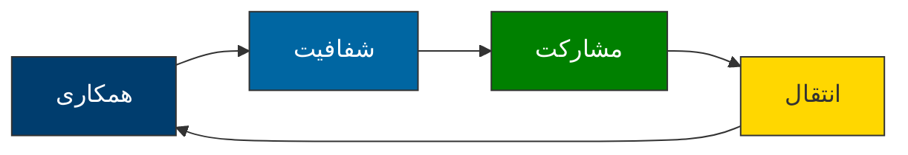

---

### 🆔 `TR-2` — graph

> ✅ No issues detected

**Raw Source:**
```text
graph TD
    A["شورای انتقالی"] --> B["دولت موقت"]
    A --> C["مجلس مؤسسان"]
    B --> D["انتخاب آزاد"]
    C --> D
    
    style A fill:#003d6e,stroke:#333,color:white
    style B fill:#008000,stroke:#333,color:white
    style C fill:#ffd700,stroke:#333,color:#333
    style D fill:#0066a2,stroke:#333,color:white
```

**Rendered:**

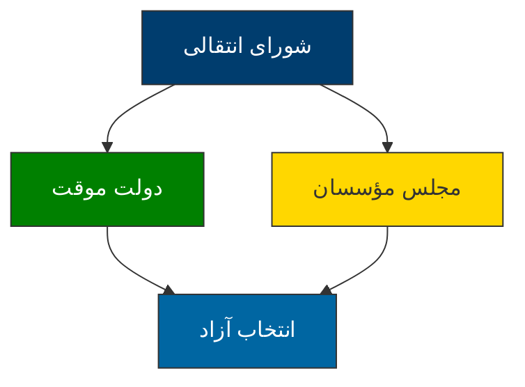

---

### 🆔 `TR-3` — gantt

> ⚠️ Issues: CLASS D

**Raw Source:**
```text
gantt
    title نقشه راه گذار دموکراتیک ایران
    dateFormat  YYYY-MM
    axisFormat  ماه
    
    فاز ۱: آمادگی         :active,    des1, 2025-01, 3ماه
    مذاکرات محرمانه       :          des2, 2025-01, 2ماه
    ایجاد شورای انتقالی  :          des3, 2025-03, 1ماه
    
    فاز ۲: انتقال         :          des4, 2025-04, 6ماه
    تدوین قانون اساسی     :          des5, 2025-04, 4ماه
    رفراندوم              :          des6, 2025-08, 1ماه
    
    فاز ۳: تثبیت         :          des7, 2025-09, 6ماه
    برگزاری انتخاب       :          des8, 2025-09, 2ماه
    انتقال قدرت          :          des9, 2025-11, 1ماه
```

**Rendered:**

```mermaid 
gantt
    title نقشه راه گذار دموکراتیک ایران
    dateFormat  YYYY-MM
    axisFormat  ماه
    
    فاز ۱: آمادگی         :active,    des1, 2025-01, 3ماه
    مذاکرات محرمانه       :          des2, 2025-01, 2ماه
    ایجاد شورای انتقالی  :          des3, 2025-03, 1ماه
    
    فاز ۲: انتقال         :          des4, 2025-04, 6ماه
    تدوین قانون اساسی     :          des5, 2025-04, 4ماه
    رفراندوم              :          des6, 2025-08, 1ماه
    
    فاز ۳: تثبیت         :          des7, 2025-09, 6ماه
    برگزاری انتخاب       :          des8, 2025-09, 2ماه
    انتقال قدرت          :          des9, 2025-11, 1ماه
```

---

### 🆔 `TR-4` — graph

> ⚠️ Issues: CLASS G

**Raw Source:**
```text
graph TD
    subgraph حلقه هسته‌ای
    A["رهبران سیاسی"]
    end
    
    subgraph حلقه میانی
    B["احزاب و سازمان‌های مدنی"]
    end
    
    subgraph حلقه بیرونی
    C["مردم و شهروندان"]
    end
    
    A --> B
    B --> C
    
    style A fill:#003d6e,stroke:#333,color:white
    style B fill:#0066a2,stroke:#333,color:white
    style C fill:#008000,stroke:#333,color:white
```

**Rendered:**

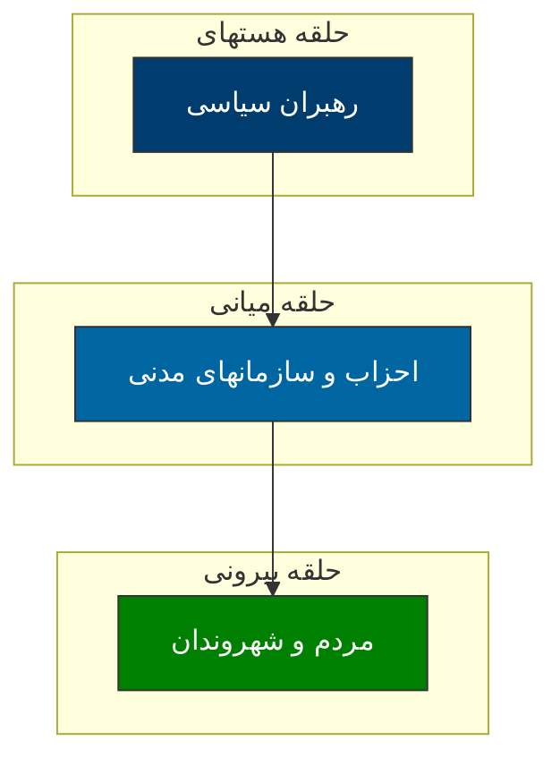

---

### 🆔 `TR-5` — flowchart

> ✅ No issues detected

**Raw Source:**
```text
flowchart LR
    A["اختلاف"] --> B{"شدت؟"}
    B -->|"کم"| C["گفتگوی مستقیم"]
    B -->|"متوسط"| D["میانجیگری"]
    B -->|"بالا"| E["شورای عالی"]
    
    C --> F["توافق"]
    D --> F
    E --> F
    
    F --> G["اجرا"]
    G --> H{"موفق؟"}
    H -->|"بله"| I["پایان"]
    H -->|"خیر"| A
    
    style A fill:#ff6b6b,stroke:#333,color:white
    style F fill:#51cf66,stroke:#333,color:white
    style I fill:#339af0,stroke:#333,color:white
```

**Rendered:**

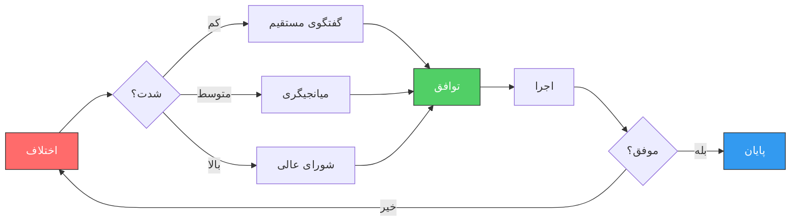

---

### 🆔 `TR-6` — graph

> ✅ No issues detected

**Raw Source:**
```text
graph LR
    A["تیم نظارت بین‌المللی"] --> B["سازمان ملل"]
    A --> C["اتحادیه اروپا"]
    A --> D["کشورهای همسایه"]
    A --> E["کارشناسان مستقل"]
    
    B --> F["گزارش‌دهی شفاف"]
    C --> F
    D --> F
    E --> F
    
    style A fill:#003d6e,stroke:#333,color:white
    style F fill:#008000,stroke:#333,color:white
```

**Rendered:**

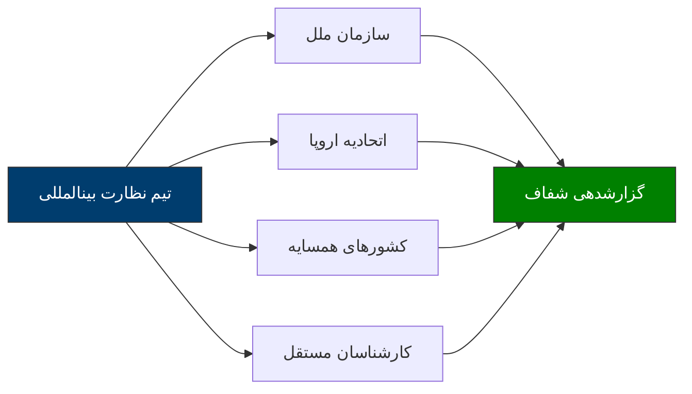

---

### 🆔 `TR-7` — pie

> ✅ No issues detected

**Raw Source:**
```text
pie
    title شاخص‌های کلیدی موفقیت
    "مشارکت مردمی >70%" : 40
    "امنیت >95%" : 25
    "اعتماد عمومی >60%" : 15
    "شفافیت >8/10" : 10
    "مشارکت زنان >40%" : 10
```

**Rendered:**

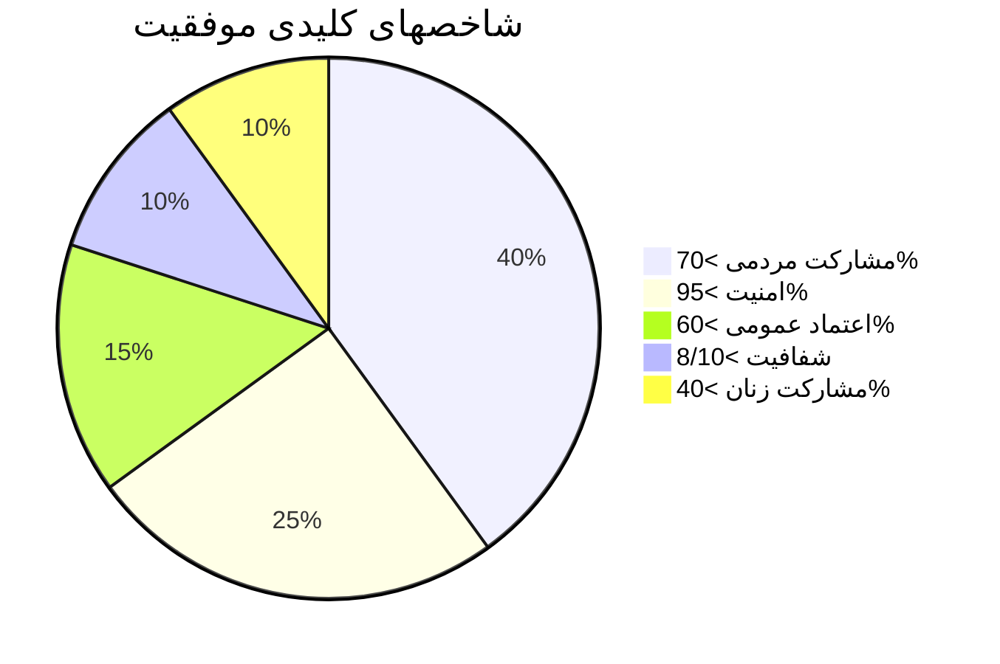

---

### 🆔 `TR-8` — graph

> ✅ No issues detected

**Raw Source:**
```text
graph TD
    A["مردم"] --> B["ثبت‌نام فعال"]
    A --> C["مشارکت در بحث‌ها"]
    A --> D["نظارت بر نامزدها"]
    A --> E["گزارش تخلفات"]
    
    style A fill:#003d6e,stroke:#333,color:white
    style B fill:#0066a2,stroke:#333,color:white
    style C fill:#0066a2,stroke:#333,color:white
    style D fill:#0066a2,stroke:#333,color:white
    style E fill:#0066a2,stroke:#333,color:white
```

**Rendered:**

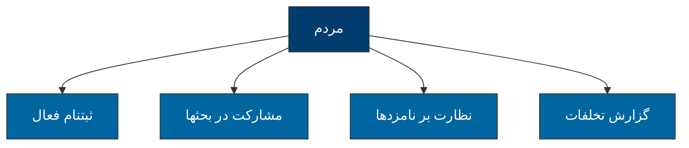

---

### 🆔 `TR-9` — flowchart

> ✅ No issues detected

**Raw Source:**
```text
flowchart TD
    A["شروع"] --> B{"وضعیت؟"}
    B -->|"موافق"| C["ادامه برنامه"]
    B -->|"مقاومت"| D{"شدت؟"}
    D -->|"کم"| E["مذاکره"]
    D -->|"زیاد"| F["میانجیگری"]
    E --> G["توافق"]
    F --> H{"موفق؟"}
    H -->|"بله"| G
    H -->|"خیر"| I["تغییر برنامه"]
    G --> C
    I --> C
    
    style A fill:#003d6e,stroke:#333,color:white
    style C fill:#51cf66,stroke:#333,color:white
```

**Rendered:**

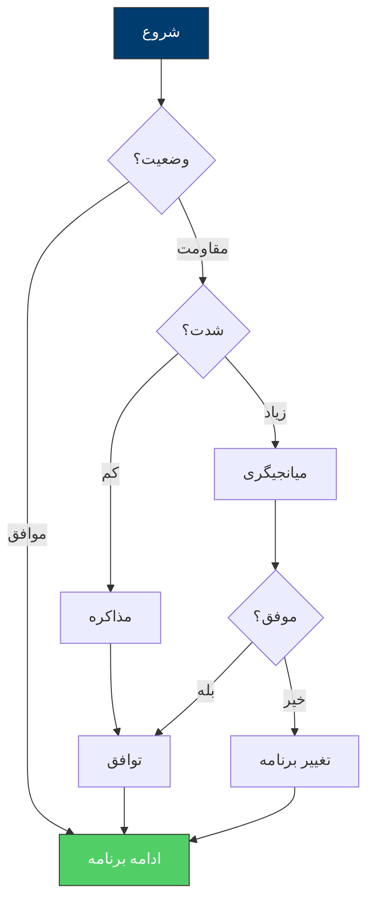

---

### 🆔 `TR-10` — graph

> ✅ No issues detected

**Raw Source:**
```text
graph LR
    A["همکاری"] -.-> B["شفافیت"]
    B -.-> C["مشارکت"]
    C -.-> D["نظارت"]
    D -.-> E["انعطاف‌پذیری"]
    
    style A fill:#003d6e,stroke:#333,color:white
    style B fill:#0066a2,stroke:#333,color:white
    style C fill:#008000,stroke:#333,color:white
    style D fill:#ffd700,stroke:#333,color:#333
    style E fill:#6c757d,stroke:#333,color:white
```

**Rendered:**


---


## 📄 Source: `fa/آشنایی-با-دوران-گذار-انقلابی.mdx`

### 🆔 `GA-1` — mindmap

> ✅ No issues detected

**Raw Source:**
```text
mindmap
  root(("🎯 الگوی مدیریت گذار"))
    ("📚 مبانی نظری")
      ("نظریه‌های گذار")
      ("تجربیات جهانی")
      ("چارچوب تحلیلی")
    ("⏱️ فازبندی")
      ("پیشاگذار")
      ("گذار اولیه")
      ("تثبیت")
      ("نهادسازی")
    ("🔧 ابعاد مدیریت")
      ("سیاسی")
      ("اقتصادی")
      ("اجتماعی")
      ("امنیتی")
    ("🤝 انسجام")
      ("تنوع قومی")
      ("عدالت توزیعی")
      ("مشارکت")
    ("⚠️ ریسک")
      ("شناسایی")
      ("پیشگیری")
      ("واکنش")
```

**Rendered:**

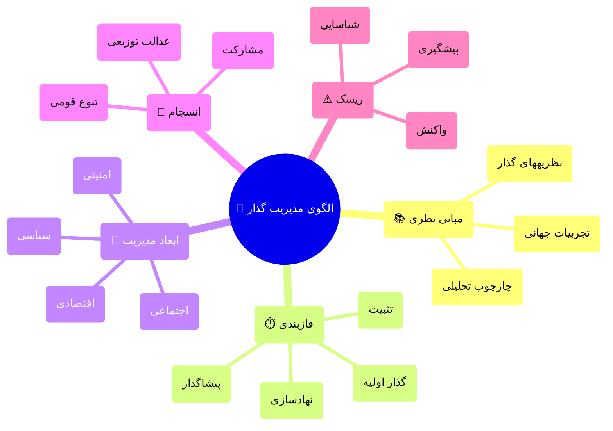

---

### 🆔 `GA-2` — flowchart

> ⚠️ Issues: CLASS B

**Raw Source:**
```text
flowchart LR
    A["🔄 عدم قطعیت"] -->"B["⚖️ بازتوزیع قدرت""]
    B -->"C["📜 بازتعریف قواعد""]
    C -->"D["🏛️ نهادسازی مجدد""]
    D -->"E["🤝 قرارداد اجتماعی جدید""]

    style A fill:#ffcccc,stroke:#333
    style B fill:#ffe6cc,stroke:#333
    style C fill:#ffffcc,stroke:#333
    style D fill:#ccffcc,stroke:#333
    style E fill:#cce6ff,stroke:#333
```

**Rendered:**

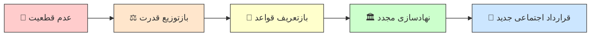

---

### 🆔 `GA-3` — timeline

> ✅ No issues detected

**Raw Source:**
```text
timeline
    title خط زمانی فازهای گذار
    section فاز صفر
        پیشاگذار : آماده‌سازی ذهنی
                 : شکل‌گیری ائتلاف‌ها
                 : برنامه‌ریزی اولیه
    section فاز یک
        گذار اولیه : انتقال قدرت
                   : مدیریت بحران
                   : حفظ نظم
    section فاز دو
        تثبیت موقت : دولت موقت
                   : اصلاحات فوری
                   : بازسازی اعتماد
    section فاز سه
        نهادسازی : قانون اساسی
                 : برگزاری صندوق رأی
                 : ساختارسازی
    section فاز چهار
        تحکیم : نهادینه‌سازی
              : توسعه پایدار
              : عدالت انتقالی
```

**Rendered:**

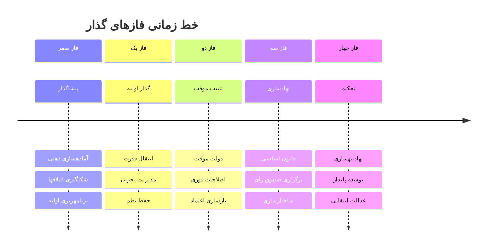

---

### 🆔 `GA-4` — pie

> ✅ No issues detected

**Raw Source:**
```text
pie title توزیع اولویت‌ها در فاز یک
    "امنیت و نظم عمومی" : 35
    "تداوم خدمات اساسی" : 25
    "ارتباطات و اطلاع‌رسانی" : 20
    "تشکیل ساختار موقت" : 15
    "دیپلماسی خارجی" : 5
```

**Rendered:**

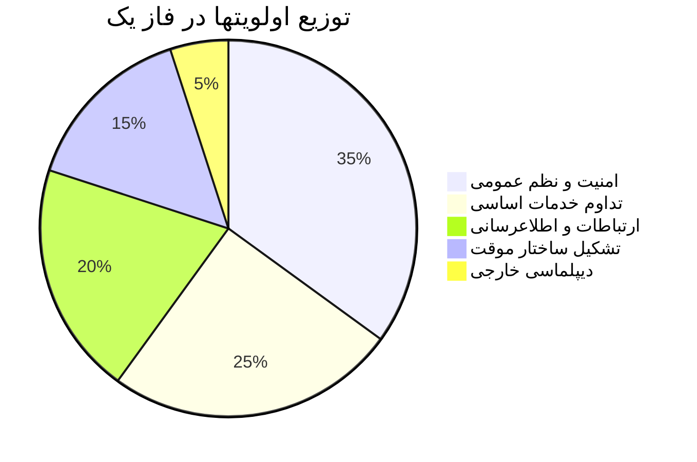

---

### 🆔 `GA-5` — flowchart

> ⚠️ Issues: CLASS C

**Raw Source:**
```text
flowchart TB
    A["🏛️ شورای عالی گذار<br/>("تصمیم‌گیری استراتژیک")"] --> B["👥 مجمع مشورتی ملی<br/>("نمایندگی اقشار")"]
    A --> C["⚖️ هیئت داوری<br/>("حل اختلاف")"]
    A --> D["📋 کابینه تکنوکرات<br/>("اجرا")"]
    A --> E["👁️ نهاد نظارت مستقل<br/>("پاسخگویی")"]

    style A fill:#4a90d9,stroke:#2c5282,color:#fff
    style B fill:#68d391,stroke:#276749,color:#fff
    style C fill:#f6ad55,stroke:#c05621,color:#fff
    style D fill:#fc8181,stroke:#c53030,color:#fff
    style E fill:#b794f4,stroke:#6b46c1,color:#fff
```

**Rendered:**

```mermaid 
flowchart TB
    A["🏛️ شورای عالی گذار<br/>("تصمیمگیری استراتژیک")"] --> B["👥 مجمع مشورتی ملی<br/>("نمایندگی اقشار")"]
    A --> C["⚖️ هیئت داوری<br/>("حل اختلاف")"]
    A --> D["📋 کابینه تکنوکرات<br/>("اجرا")"]
    A --> E["👁️ نهاد نظارت مستقل<br/>("پاسخگویی")"]

    style A fill:#4a90d9,stroke:#2c5282,color:#fff
    style B fill:#68d391,stroke:#276749,color:#fff
    style C fill:#f6ad55,stroke:#c05621,color:#fff
    style D fill:#fc8181,stroke:#c53030,color:#fff
    style E fill:#b794f4,stroke:#6b46c1,color:#fff
```

---

### 🆔 `GA-6` — flowchart

> ✅ No issues detected

**Raw Source:**
```text
flowchart LR
    subgraph "چالش‌های کوتاه‌مدت"
        A1["💸 فرار سرمایه"]
        A2["📉 کاهش تولید"]
        A3["📈 تورم"]
        A4["💼 بیکاری"]
    end

    subgraph "چالش‌های میان‌مدت"
        B1["🏦 بحران بانکی"]
        B2["💰 کسری بودجه"]
        B3["📊 بدهی خارجی"]
    end

    subgraph "چالش‌های بلندمدت"
        C1["🔧 بازسازی ساختاری"]
        C2["🌐 ادغام جهانی"]
        C3["⚡ تنوع اقتصادی"]
    end

    A1 --> B1
    A2 --> A4
    A3 --> B2
    B1 --> C1
    B3 --> C2

    style A1 fill:#ffcccc
    style A2 fill:#ffcccc
    style A3 fill:#ffcccc
    style A4 fill:#ffcccc
    style B1 fill:#ffe6cc
    style B2 fill:#ffe6cc
    style B3 fill:#ffe6cc
    style C1 fill:#ccffcc
    style C2 fill:#ccffcc
    style C3 fill:#ccffcc
```

**Rendered:**

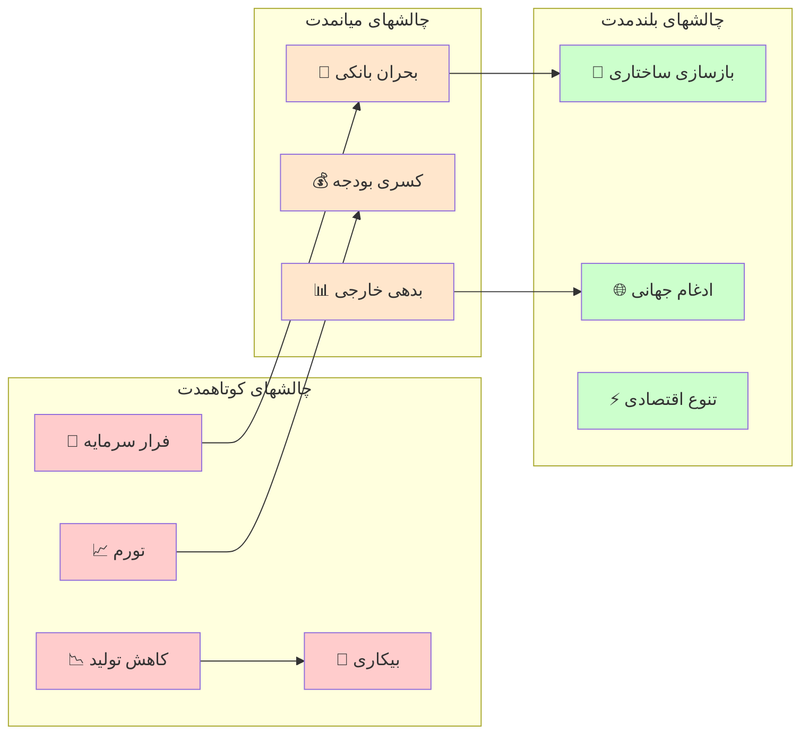

---

### 🆔 `GA-7` — flowchart

> ⚠️ Issues: CLASS B

**Raw Source:**
```text
flowchart LR
    A["🏛️ دولت متمرکز"] -->"B["📍 تمرکززدایی اداری""]
    B -->"C["🗺️ خودمختاری منطقه‌ای""]
    C -->"D["🤝 فدرالیسم""]
    D -->"E["🔗 کنفدراسیون""]

    style A fill:#ff6666
    style B fill:#ff9966
    style C fill:#ffcc66
    style D fill:#99ff99
    style E fill:#66ccff
```

**Rendered:**

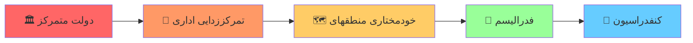

---

### 🆔 `GA-8` — flowchart

> ✅ No issues detected

**Raw Source:**
```text
flowchart TB
    subgraph "ریسک‌های سیاسی"
        P1["🔄 بازگشت استبداد"]
        P2["💥 کودتا"]
        P3["🗳️ شکست صندوق رأی"]
        P4["⚔️ جنگ داخلی"]
    end

    subgraph "ریسک‌های اقتصادی"
        E1["💸 فروپاشی مالی"]
        E2["📈 ابرتورم"]
        E3["🚫 تحریم"]
        E4["💼 بیکاری گسترده"]
    end

    subgraph "ریسک‌های اجتماعی"
        S1["👥 شورش"]
        S2["🎭 شکاف قومی"]
        S3["🏃 مهاجرت گسترده"]
        S4["😰 بحران اعتماد"]
    end

    style P1 fill:#ffcccc
    style P2 fill:#ffcccc
    style P4 fill:#ff9999
    style E1 fill:#ffe6cc
    style E2 fill:#ffe6cc
    style S2 fill:#ffffcc
```

**Rendered:**

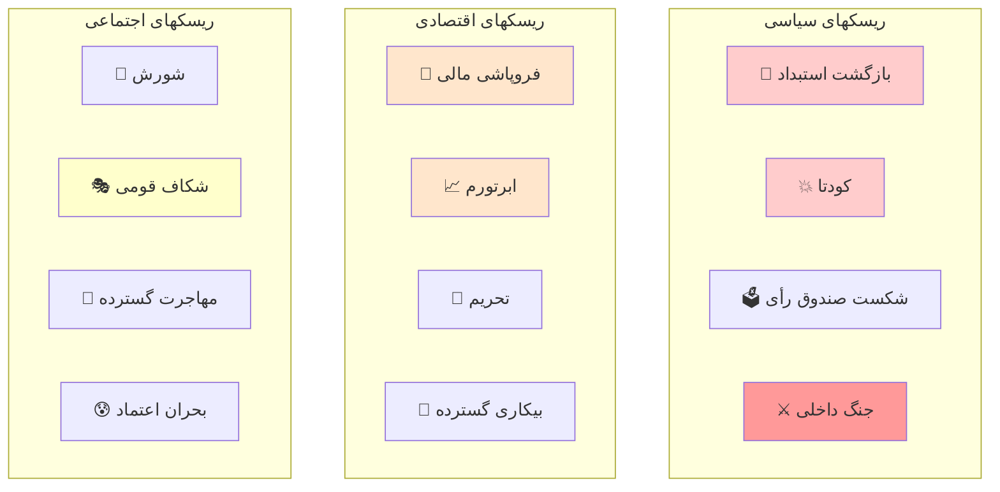

---


## 📄 Source: `fa/ارتش-و-انقلاب-ها.mdx`

### 🆔 `AR-1` — flowchart

> ⚠️ Issues: CLASS B, CLASS C

**Raw Source:**
```text
flowchart TD
    A["فشار بین‌المللی<br/>"جنگ، رقابت""] -->"B["بحران دولت""]
    B -->"C["ناتوانی مالی-اداری""]
    C -->"D["ضعف ارتش""]
    D -->"E["فرصت برای شورش""]
    E -->"F["انقلاب""]

    style A fill:#ffcccc
    style F fill:#ccffcc
```

**Rendered:**

```mermaid 
flowchart TD
    A["فشار بینالمللی<br/>"جنگ، رقابت"] --> B["بحران دولت"]
    B --> C["ناتوانی مالی-اداری"]
    C --> D["ضعف ارتش"]
    D --> E["فرصت برای شورش"]
    E --> F["انقلاب"]

    style A fill:#ffcccc
    style F fill:#ccffcc
```

---

### 🆔 `AR-2` — flowchart

> ⚠️ Issues: CLASS B

**Raw Source:**
```text
flowchart TD
    A["رفتار ارتش در بحران انقلابی"] -->"B["سرکوب کامل""]
    A -->"C["خنثی‌سازی""]
    A -->"D["انشعاب""]
    A -->"E["پیوستن""]
    A -->"F["کودتا""]

    B -->"B1["شکست انقلاب""]
    C -->"C1["موفقیت انقلاب""]
    D -->"D1["جنگ داخلی""]
    E -->"E1["موفقیت سریع""]
    F -->"F1["حکومت نظامی""]

    style B fill:#ff6666
    style C fill:#66ff66
    style D fill:#ffff66
    style E fill:#66ffff
    style F fill:#ff66ff
```

**Rendered:**

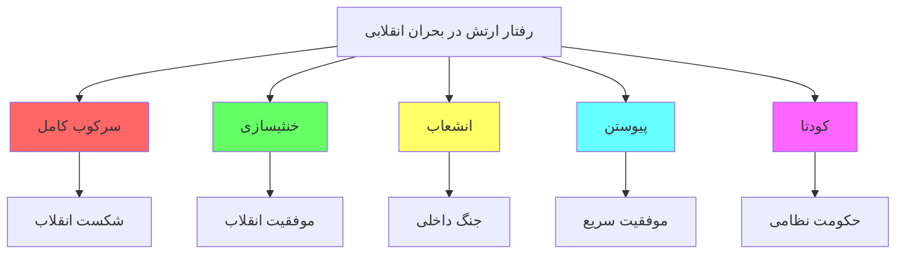

---

### 🆔 `AR-3` — flowchart

> ⚠️ Issues: CLASS B, CLASS C

**Raw Source:**
```text
flowchart TD
    A["نوع سربازگیری"] --> B["سربازگیری اجباری<br/>"خدمت وظیفه""]
    A --> C["داوطلبانه<br/>"حرفه‌ای""]
    A --> D["قومی/فرقه‌ای<br/>"گزینشی""]

    B -->"B1["پیوند قوی با جامعه""]
    B1 -->"B2["احتمال خنثی‌سازی یا پیوستن""]

    C -->"C1["جدایی از جامعه""]
    C1 -->"C2["احتمال سرکوب یا کودتا""]

    D -->"D1["وفاداری به گروه""]
    D1 -->"D2["احتمال سرکوب شدید""]

    style B2 fill:#66ff66
    style C2 fill:#ffff66
    style D2 fill:#ff6666
```

**Rendered:**

```mermaid 
flowchart TD
    A["نوع سربازگیری"] --> B["سربازگیری اجباری<br/>"خدمت وظیفه"]
    A --> C["داوطلبانه<br/>"حرفهای"]
    A --> D["قومی/فرقهای<br/>"گزینشی"]

    B --> B1["پیوند قوی با جامعه"]
    B1 --> B2["احتمال خنثیسازی یا پیوستن"]

    C --> C1["جدایی از جامعه"]
    C1 --> C2["احتمال سرکوب یا کودتا"]

    D --> D1["وفاداری به گروه"]
    D1 --> D2["احتمال سرکوب شدید"]

    style B2 fill:#66ff66
    style C2 fill:#ffff66
    style D2 fill:#ff6666
```

---


## 📄 Source: `fa/انقلاب-شناسی-تحلیل-جامع-انقلاب-فرانسه.mdx`

### 🆔 `FR-1` — graph

> ⚠️ Issues: CLASS B, CLASS H

**Raw Source:**
```text
graph TD
    subgraph "عوامل زمینه‌ای"
        A["🏛️ میراث تاریخی"] -->"D["⚡ بحران قرن هجدهم""]
        B["📊 ساختار اجتماعی"] -->"D
        C["💰 بحران اقتصادی""] -->"D
        C --> E["🔥 انقلاب فرانسه""]
        D -->"E
        F["🌱 جنبش روشنگری""] --> E
    end
    
    A -->|"فئودالیسم<br/>مطلق‌گرایی<br/>کلیسا"| G
    B -->|"نابرابری<br/>طبقات"<| G
    C -->|"تورم<br/>کسری بودجه"| G
    
    style E fill:#ff0000,color:#fff,stroke:#333,stroke-width:3px
    style D fill:#ffaa00,color:#333
    style G fill:#eee,color:#333
```

**Rendered:**

```mermaid 
graph TD
    subgraph "عوامل زمینهای"
        A["🏛️ میراث تاریخی"] --> D["⚡ بحران قرن هجدهم"]
        B["📊 ساختار اجتماعی"] -->"D
        C["💰 بحران اقتصادی"] -->"D
        C --> E["🔥 انقلاب فرانسه"]
        D -->"E
        F["🌱 جنبش روشنگری"] --> E
    end
    
    A -->|"فئودالیسم<br/>مطلقگرایی<br/>کلیسا"| G
    B -->|"نابرابری<br/>طبقات"<| G
    C -->|"تورم<br/>کسری بودجه"| G
    
    style E fill:#ff0000,color:#fff,stroke:#333,stroke-width:3px
    style D fill:#ffaa00,color:#333
    style G fill:#eee,color:#333
```

---

### 🆔 `FR-2` — pie

> ⚠️ Issues: CLASS F

**Raw Source:**
```text
pie title "سهم هزینه‌های دولت فرانسه ("۱۷۸۸")"
    "هزینه‌های دربار" : 35
    "ارتش" : 25
    "بدهی خارجی" : 20
    "هزینه‌های اداری" : 15
    "خدمات عمومی" : 5
```

**Rendered:**

```mermaid 
pie title "سهم هزینههای دولت فرانسه ("۱۷۸۸")"
    "هزینههای دربار" : 35
    "ارتش" : 25
    "بدهی خارجی" : 20
    "هزینههای اداری" : 15
    "خدمات عمومی" : 5
```

---

### 🆔 `FR-3` — timeline

> ✅ No issues detected

**Raw Source:**
```text
timeline
    title Chronologie انقلاب فرانسه
    section ۱۷۸۹ - آغاز
        ۵ مه : تشکیل طبقات
        ۱۷ ژوئن : ملت ملی
        ۲۰ ژوئن : سوگند توپیلری
        ۱۴ ژوئیه : تسخیر باستیل
    section ۱۷۸۹-۱۷۹۱ - قانون اساسی
        اوت : اعلامیه حقوق بشر
        نوامبر : الغای اشرافیت
        دسامبر : قانون اساسی
    section ۱۷۹۲ - جمهوری
        ۲۰ آوریل : اعلان جنگ به اتریش
        ۱۰ اوت : حمله به کاخ
        ۲۱ ژانویه : اعدام لویی شانزدهم
    section ۱۷۹۳-۱۷۹۴ - ترور
        ژوئن ۱۷۹۳ : حاکمیت Jakobin
        اکتبر ۱۷۹۳ : اعدام ژیروندن‌ها
        ۱۶ اکتبر : اعدام ملکه
        ۲۸ جولای ۱۷۹۴ : اعدام روبسپیر
    section ۱۷۹۵-۱۷۹۹ - پایان
        ۱۷۹۵ : قانون اساسی سوم
        ۱۷۹۹ : کودتای ناپلئون
```

**Rendered:**

```mermaid 
timeline
    title Chronologie انقلاب فرانسه
    section ۱۷۸۹ - آغاز
        ۵ مه : تشکیل طبقات
        ۱۷ ژوئن : ملت ملی
        ۲۰ ژوئن : سوگند توپیلری
        ۱۴ ژوئیه : تسخیر باستیل
    section ۱۷۸۹-۱۷۹۱ - قانون اساسی
        اوت : اعلامیه حقوق بشر
        نوامبر : الغای اشرافیت
        دسامبر : قانون اساسی
    section ۱۷۹۲ - جمهوری
        ۲۰ آوریل : اعلان جنگ به اتریش
        ۱۰ اوت : حمله به کاخ
        ۲۱ ژانویه : اعدام لویی شانزدهم
    section ۱۷۹۳-۱۷۹۴ - ترور
        ژوئن ۱۷۹۳ : حاکمیت Jakobin
        اکتبر ۱۷۹۳ : اعدام ژیروندنها
        ۱۶ اکتبر : اعدام ملکه
        ۲۸ جولای ۱۷۹۴ : اعدام روبسپیر
    section ۱۷۹۵-۱۷۹۹ - پایان
        ۱۷۹۵ : قانون اساسی سوم
        ۱۷۹۹ : کودتای ناپلئون
```

---

### 🆔 `FR-4` — graph

> ⚠️ Issues: CLASS C

**Raw Source:**
```text
graph LR
    A["🔴 ژاکوبن‌ها<br/>("چپ افراطی")"] --> B["🟠 جیروندن‌ها<br/>("چپ میانه")"]
    B --> C["🟡 فایان‌ها<br/>("میانه")"]
    C --> D["🟢 راست moderate<br/>"]
    D --> E["🔵 محافظه‌کاران<br/>("ارتجاع")"]
    
    A -->|"رادیکال<br/>"انقلابی"| F["🎯 اهداف""]
    B -->|" умеренный<br/>اصلاح‌طلب"| F
    C -->|"لیبرال<br/>میانه‌رو"| F
    
    style A fill:#ff4444,color:#fff
    style B fill:#ff8844,color:#fff
    style C fill:#ffcc00,color:#333
    style D fill:#44aa44,color:#fff
    style E fill:#4444ff,color:#fff
```

**Rendered:**

```mermaid 
graph LR
    A["🔴 ژاکوبنها<br/>("چپ افراطی")"] --> B["🟠 جیروندنها<br/>("چپ میانه")"]
    B --> C["🟡 فایانها<br/>("میانه")"]
    C --> D["🟢 راست moderate<br/>"]
    D --> E["🔵 محافظهکاران<br/>("ارتجاع")"]
    
    A -->|"رادیکال<br/>"انقلابی"| F["🎯 اهداف"]
    B -->|" умеренный<br/>اصلاحطلب"| F
    C -->|"لیبرال<br/>میانهرو"| F
    
    style A fill:#ff4444,color:#fff
    style B fill:#ff8844,color:#fff
    style C fill:#ffcc00,color:#333
    style D fill:#44aa44,color:#fff
    style E fill:#4444ff,color:#fff
```

---

### 🆔 `FR-5` — mindmap

> ✅ No issues detected

**Raw Source:**
```text
mindmap
  root(("ایدئولوژی‌های انقلاب فرانسه"))
    لیبرالیسم
      آزادی فردی
      مالکیت خصوصی
      حکومت قانون
    جمهوری‌خواهی
      حاکمیت مردم
      برابری شهروندی
      جمهوری دموکراتیک
    رادیکالیسم
      نابودی طبقات
      حاکمیت فضیلت
      ترور برای هدف
    سوسیالیسم اولیه
      مالکیت عمومی
      کمک متقابل
      عدالت اجتماعی
```

**Rendered:**

```mermaid 
mindmap
  root(("ایدئولوژیهای انقلاب فرانسه"))
    لیبرالیسم
      آزادی فردی
      مالکیت خصوصی
      حکومت قانون
    جمهوریخواهی
      حاکمیت مردم
      برابری شهروندی
      جمهوری دموکراتیک
    رادیکالیسم
      نابودی طبقات
      حاکمیت فضیلت
      ترور برای هدف
    سوسیالیسم اولیه
      مالکیت عمومی
      کمک متقابل
      عدالت اجتماعی
```

---

### 🆔 `FR-6` — graph

> ⚠️ Issues: CLASS B, CLASS C

**Raw Source:**
```text
graph TD
    A["🌟 میراث انقلاب فرانسه"] -->"B["🏛️ نهادهای مدرن""]
    A -->"C["📜 مفاهیم سیاسی""]
    A -->"D["⚖️ حقوق بشر""]
    A -->"E["🎖️ ملی‌گرایی""]
    
    B --> B1["پارلمان<br/>مجلس<br/>"قوه قضاییه""]
    C --> C1["آزادی، برابری<br/>"برادری""]
    D --> D1["اعلامیه جهانی<br/>"حقوق بشر""]
    E --> E1["هویت ملی<br/>"فرانسوی""]
    
    style A fill:#ff0000,color:#fff,stroke:#333,stroke-width:3px
```

**Rendered:**

```mermaid 
graph TD
    A["🌟 میراث انقلاب فرانسه"] --> B["🏛️ نهادهای مدرن"]
    A --> C["📜 مفاهیم سیاسی"]
    A --> D["⚖️ حقوق بشر"]
    A --> E["🎖️ ملیگرایی"]
    
    B --> B1["پارلمان<br/>مجلس<br/>"قوه قضاییه"]
    C --> C1["آزادی، برابری<br/>"برادری"]
    D --> D1["اعلامیه جهانی<br/>"حقوق بشر"]
    E --> E1["هویت ملی<br/>"فرانسوی"]
    
    style A fill:#ff0000,color:#fff,stroke:#333,stroke-width:3px
```

---


## 📄 Source: `fa/انقلاب-شناسی-تحلیلی-از-انقلاب-1917-روسیه.mdx`

### 🆔 `RU-1` — graph

> ⚠️ Issues: CLASS B, CLASS C

**Raw Source:**
```text
graph TD
    subgraph "ساختار قدرت"
        A["👑 تزار<br/>"الکساندر سوم""] -->"B["دربار""]
        A -->"C["ارتش""]
        A -->"D["کلیسا""]
        B -->"E["اشرافیت""]
        C -->"E
        D --> E
        E --> F["👥 توده‌های مردم""]
        F -->"|"نارضایتی"| G["🔥 انقلاب""]
    end
    
    style A fill:#ff0000,color:#fff
    style G fill:#ff6600,color:#fff
```

**Rendered:**

```mermaid 
graph TD
    subgraph "ساختار قدرت"
        A["👑 تزار<br/>"الکساندر سوم"] --> B["دربار"]
        A --> C["ارتش"]
        A --> D["کلیسا"]
        B --> E["اشرافیت"]
        C -->"E
        D --> E
        E --> F["👥 تودههای مردم"]
        F -->"|"نارضایتی"| G["🔥 انقلاب"]
    end
    
    style A fill:#ff0000,color:#fff
    style G fill:#ff6600,color:#fff
```

---

### 🆔 `RU-2` — pie

> ✅ No issues detected

**Raw Source:**
```text
pie title "علل انقلاب 1917"
    "جنگ جهانی اول" : 40
    "نابرابری اجتماعی" : 25
    "بحران اقتصادی" : 20
    "شکست در جنگ ژاپن" : 10
    "جنبش روشنگری" : 5
```

**Rendered:**

```mermaid 
pie title "علل انقلاب 1917"
    "جنگ جهانی اول" : 40
    "نابرابری اجتماعی" : 25
    "بحران اقتصادی" : 20
    "شکست در جنگ ژاپن" : 10
    "جنبش روشنگری" : 5
```

---

### 🆔 `RU-3` — graph

> ⚠️ Issues: CLASS B

**Raw Source:**
```text
graph LR
    subgraph "قدرت موازی"
        A["🏛️ دولت موقت"] --- B["⚖️ شورای نوینین"]
        B -->"C["بلشویک‌ها""]
        B -->"D["منشویک‌ها""]
        B -->"E["اس‌آر‌ها""]
    end
    
    style A fill:#00aaff,color:#fff
    style B fill:#ff0000,color:#fff
```

**Rendered:**

```mermaid 
graph LR
    subgraph "قدرت موازی"
        A["🏛️ دولت موقت"] --- B["⚖️ شورای نوینین"]
        B --> C["بلشویکها"]
        B --> D["منشویکها"]
        B --> E["اسآرها"]
    end
    
    style A fill:#00aaff,color:#fff
    style B fill:#ff0000,color:#fff
```

---

### 🆔 `RU-4` — gantt

> ✅ No issues detected

**Raw Source:**
```text
gantt
    title "انقلاب اکتبر 1917"
    dateFormat HH:mm
    axisFormat %H:%M
    
    ساعت ۶ صبح    :milestone, m1, 1917-10-25 06:00, 0h
    آغاز حمله     :active, a1, 1917-10-25 09:00, 2h
    محاصره کاخ    :a2, after a1, 4h
    تصرف رادیو   :a3, 1917-10-25 10:00, 1h
    استعفای کرنسکی :milestone, m2, 1917-10-25 14:00, 0h
    اعلام پیروزی :milestone, m3, 1917-10-25 22:00, 0h
```

**Rendered:**

```mermaid 
gantt
    title "انقلاب اکتبر 1917"
    dateFormat HH:mm
    axisFormat %H:%M
    
    ساعت ۶ صبح    :milestone, m1, 1917-10-25 06:00, 0h
    آغاز حمله     :active, a1, 1917-10-25 09:00, 2h
    محاصره کاخ    :a2, after a1, 4h
    تصرف رادیو   :a3, 1917-10-25 10:00, 1h
    استعفای کرنسکی :milestone, m2, 1917-10-25 14:00, 0h
    اعلام پیروزی :milestone, m3, 1917-10-25 22:00, 0h
```

---

### 🆔 `RU-5` — graph

> ⚠️ Issues: CLASS B

**Raw Source:**
```text
graph TD
    A["🇷🇺 جمهوری شوروی"] -->"B["کنگره شوراها""]
    B -->"C["کمیته اجرایی مرکزی""]
    C -->"D["شورای کمیسارهای خلق""]
    D -->"E["وزارتخانه‌ها""]
    
    style A fill:#ff0000,color:#fff
    style B fill:#ff4444,color:#fff
    style C fill:#ff6666,color:#fff
    style D fill:#ff8888,color:#333
```

**Rendered:**

```mermaid 
graph TD
    A["🇷🇺 جمهوری شوروی"] --> B["کنگره شوراها"]
    B --> C["کمیته اجرایی مرکزی"]
    C --> D["شورای کمیسارهای خلق"]
    D --> E["وزارتخانهها"]
    
    style A fill:#ff0000,color:#fff
    style B fill:#ff4444,color:#fff
    style C fill:#ff6666,color:#fff
    style D fill:#ff8888,color:#333
```

---

### 🆔 `RU-6` — graph

> ⚠️ Issues: CLASS B, CLASS C

**Raw Source:**
```text
graph LR
    A["انقلاب 1917"] -->"B["با فرانسه""]
    A -->"C["با ایران 1979""]
    
    B -->|"تشابه"| D["خشونت<br/>"سرنگونی رژیم""]
    C -->"|"تشابه"| E["حکومت دینی-سیاسی""]
    
    B -->"|"تفاوت"| F["پیروزی کارگری""]
    C -->"|"تفاوت"| G["نقش روحانیت""]
```

**Rendered:**

```mermaid 
graph LR
    A["انقلاب 1917"] --> B["با فرانسه"]
    A --> C["با ایران 1979"]
    
    B -->|"تشابه"| D["خشونت<br/>"سرنگونی رژیم"]
    C -->"|"تشابه"| E["حکومت دینی-سیاسی"]
    
    B -->"|"تفاوت"| F["پیروزی کارگری"]
    C -->"|"تفاوت"| G["نقش روحانیت"]
```

---


## 📄 Source: `fa/انواع-سطوح-تغییر-سیاسی.mdx`

### 🆔 `PC-1` — graph

> ⚠️ Issues: CLASS B

**Raw Source:**
```text
graph LR
    A["⚙️ اصلاحات"] -->"B["تغییر تدریجی""]
    A -->"C["حفظ ساختار""]
    A -->"D["از بالا""]
    
    style A fill:#00ff00,color:#fff
```

**Rendered:**

```mermaid 
graph LR
    A["⚙️ اصلاحات"] --> B["تغییر تدریجی"]
    A --> C["حفظ ساختار"]
    A --> D["از بالا"]
    
    style A fill:#00ff00,color:#fff
```

---

### 🆔 `PC-2` — graph

> ⚠️ Issues: CLASS B

**Raw Source:**
```text
graph TD
    A["🏭 نوسازی"] -->"B["تغییر اقتصادی-اجتماعی""]
    A -->"C["صنعتی‌سازی""]
    A -->"D["شهرنشینی""]
    A -->"E["آموزش همگانی""]
    
    style A fill:#0000ff,color:#fff
```

**Rendered:**

```mermaid 
graph TD
    A["🏭 نوسازی"] --> B["تغییر اقتصادی-اجتماعی"]
    A --> C["صنعتیسازی"]
    A --> D["شهرنشینی"]
    A --> E["آموزش همگانی"]
    
    style A fill:#0000ff,color:#fff
```

---

### 🆔 `PC-3` — graph

> ⚠️ Issues: CLASS B

**Raw Source:**
```text
graph LR
    A["گذار"] -->"B["از بالا""]
    A -->"C["از پایین""]
    A -->"D["توافقی""]
    
    B -->"|"1. رهبری نخبگان"| E["مذاکره""]
    C -->|"2. فشار توده‌ها"| E
    D -->|"3. توافق نخبگان"| E
    
    style A fill:#ffaa00
    style E fill:#00ff00
```

**Rendered:**

```mermaid 
graph LR
    A["گذار"] --> B["از بالا"]
    A --> C["از پایین"]
    A --> D["توافقی"]
    
    B -->"|"1. رهبری نخبگان"| E["مذاکره"]
    C -->|"2. فشار تودهها"| E
    D -->|"3. توافق نخبگان"| E
    
    style A fill:#ffaa00
    style E fill:#00ff00
```

---

### 🆔 `PC-4` — graph

> ⚠️ Issues: CLASS B

**Raw Source:**
```text
graph TD
    A["🔥 انقلاب"] -->"B["تغییر بنیادی""]
    A -->"C["سرنگونی نظام""]
    A -->"D["بازتوزیع قدرت""]
    A -->"E["تغییر ارزش‌ها""]
    
    style A fill:#ff0000,color:#fff,stroke:#333,stroke-width:3px
```

**Rendered:**

```mermaid 
graph TD
    A["🔥 انقلاب"] --> B["تغییر بنیادی"]
    A --> C["سرنگونی نظام"]
    A --> D["بازتوزیع قدرت"]
    A --> E["تغییر ارزشها"]
    
    style A fill:#ff0000,color:#fff,stroke:#333,stroke-width:3px
```

---

### 🆔 `PC-5` — graph

> ⚠️ Issues: CLASS B

**Raw Source:**
```text
graph LR
    A["💥 کودتا"] -->"B["تغییر رهبری""]
    A -->"C["حفظ ساختار""]
    A -->"D["از داخل حکومت""]
    
    style A fill:#ff6600,color:#fff
```

**Rendered:**

```mermaid 
graph LR
    A["💥 کودتا"] --> B["تغییر رهبری"]
    A --> C["حفظ ساختار"]
    A --> D["از داخل حکومت"]
    
    style A fill:#ff6600,color:#fff
```

---

### 🆔 `PC-6` — graph

> ⚠️ Issues: CLASS B

**Raw Source:**
```text
graph LR
    A["🟢 اصلاح"] -->"B["🔵 نوسازی""]
    B -->"C["🟡 گذار""]
    C -->"D["🟠 انقلاب""]
    D -->"E["🔴 کودتا""]
    
    A -->"|"تدریج"| F["رادیکال""]
    F --> E
    
    style A fill:#00ff00
    style B fill:#0000ff,color:#fff
    style C fill:#ffff00
    style D fill:#ffaa00
    style E fill:#ff0000,color:#fff
```

**Rendered:**

```mermaid 
graph LR
    A["🟢 اصلاح"] --> B["🔵 نوسازی"]
    B --> C["🟡 گذار"]
    C --> D["🟠 انقلاب"]
    D --> E["🔴 کودتا"]
    
    A -->"|"تدریج"| F["رادیکال"]
    F --> E
    
    style A fill:#00ff00
    style B fill:#0000ff,color:#fff
    style C fill:#ffff00
    style D fill:#ffaa00
    style E fill:#ff0000,color:#fff
```

---


## 📄 Source: `fa/مروری-بر-شیوه-های-تغییر-رژیم-های-سیاسی.mdx`

### 🆔 `RG-1` — graph

> ⚠️ Issues: CLASS B

**Raw Source:**
```text
graph TD
    subgraph "دلایل تغییر رژیم"
        A["📉 بحران اقتصادی"] -->"G["تغییر رژیم""]
        B["⚔️ شکست نظامی"] -->"G
        C["👥 اعتراضات مردمی""] -->"G
        D["内部的 شکاف""] -->"G
        E["🌍 فشار بین‌المللی""] -->"G
        F["👑 مرگ رهبر""] --> G
    end
    
    style G fill:#ff0000,color:#fff,stroke:#333,stroke-width:3px
```

**Rendered:**

```mermaid 
graph TD
    subgraph "دلایل تغییر رژیم"
        A["📉 بحران اقتصادی"] --> G["تغییر رژیم"]
        B["⚔️ شکست نظامی"] -->"G
        C["👥 اعتراضات مردمی"] -->"G
        D["内部的 شکاف"] -->"G
        E["🌍 فشار بینالمللی"] -->"G
        F["👑 مرگ رهبر"] --> G
    end
    
    style G fill:#ff0000,color:#fff,stroke:#333,stroke-width:3px
```

---

### 🆔 `RG-2` — graph

> ⚠️ Issues: CLASS B

**Raw Source:**
```text
graph LR
    A["🔥 انقلاب"] -->"B["خشونت بالا""]
    A -->"C["تغییر بنیادین""]
    A -->"D["مشارکت توده‌ای""]
    A -->"E["عدم قطعیت زیاد""]
    A -->"F["پیامدهای بلندمدت""]
    
    style A fill:#ff0000,color:#fff,stroke:#333,stroke-width:3px
```

**Rendered:**

```mermaid 
graph LR
    A["🔥 انقلاب"] --> B["خشونت بالا"]
    A --> C["تغییر بنیادین"]
    A --> D["مشارکت تودهای"]
    A --> E["عدم قطعیت زیاد"]
    A --> F["پیامدهای بلندمدت"]
    
    style A fill:#ff0000,color:#fff,stroke:#333,stroke-width:3px
```

---

### 🆔 `RG-3` — graph

> ⚠️ Issues: CLASS B

**Raw Source:**
```text
graph TD
    A["⚔️ جنگ داخلی"] -->"B["دو یا چند گروه مسلح""]
    B -->"C[" مبارزه برای کنترل دولت""]
    C -->"D["یا جدایی""]
    
    style A fill:#8B0000,color:#fff
```

**Rendered:**

```mermaid 
graph TD
    A["⚔️ جنگ داخلی"] --> B["دو یا چند گروه مسلح"]
    B --> C[" مبارزه برای کنترل دولت"]
    C --> D["یا جدایی"]
    
    style A fill:#8B0000,color:#fff
```

---

### 🆔 `RG-4` — graph

> ⚠️ Issues: CLASS B

**Raw Source:**
```text
graph LR
    A["🕊️ انقلاب مسالمت‌آمیز"] -->"B["اعتراضات""]
    A -->"C["عدم همکاری مدنی""]
    A -->"D["تحصن و اعتصاب""]
    A -->"E["فشار اقتصادی""]
    E -->"F["سازش حکومت""]
    
    style A fill:#00FF00,color:#000
```

**Rendered:**

```mermaid 
graph LR
    A["🕊️ انقلاب مسالمتآمیز"] --> B["اعتراضات"]
    A --> C["عدم همکاری مدنی"]
    A --> D["تحصن و اعتصاب"]
    A --> E["فشار اقتصادی"]
    E --> F["سازش حکومت"]
    
    style A fill:#00FF00,color:#000
```

---

### 🆔 `RG-5` — graph

> ⚠️ Issues: CLASS B

**Raw Source:**
```text
graph LR
    A["🌫️ انقلاب خاکستری"] -->"B["ترکیب""]
    A -->"C["عناصر مسالمت‌آمیز""]
    A -->"D["عناصر خشونت‌آمیز محدود""]
    
    B -->"E["نتیجه: تغییر""]
    
    style A fill:#808080,color:#fff
```

**Rendered:**

```mermaid 
graph LR
    A["🌫️ انقلاب خاکستری"] --> B["ترکیب"]
    A --> C["عناصر مسالمتآمیز"]
    A --> D["عناصر خشونتآمیز محدود"]
    
    B --> E["نتیجه: تغییر"]
    
    style A fill:#808080,color:#fff
```

---

### 🆔 `RG-6` — pie

> ✅ No issues detected

**Raw Source:**
```text
pie title "نوع گذار در کشورهای مختلف"
    "توافقی" : 35
    "از بالا" : 25
    "از پایین" : 20
    "مداخله خارجی" : 15
    "فروپاشی" : 5
```

**Rendered:**

```mermaid 
pie title "نوع گذار در کشورهای مختلف"
    "توافقی" : 35
    "از بالا" : 25
    "از پایین" : 20
    "مداخله خارجی" : 15
    "فروپاشی" : 5
```

---

### 🆔 `RG-7` — graph

> ⚠️ Issues: CLASS B

**Raw Source:**
```text
graph TD
    A["🎯 گذار موفق"] -->"B["نخبگان موافق""]
    A -->"C["نخبگان مخالف""]
    C -->"D["مذاکره""]
    D -->"E["توافق""]
    E -->"F["اجرا""]
    B --> F
    
    style A fill:#00FF00,color:#000
    style F fill:#008000,color:#fff
```

**Rendered:**

```mermaid 
graph TD
    A["🎯 گذار موفق"] --> B["نخبگان موافق"]
    A --> C["نخبگان مخالف"]
    C --> D["مذاکره"]
    D --> E["توافق"]
    E --> F["اجرا"]
    B --> F
    
    style A fill:#00FF00,color:#000
    style F fill:#008000,color:#fff
```

---

### 🆔 `RG-8` — graph

> ⚠️ Issues: CLASS B

**Raw Source:**
```text
graph TD
    A["🇮🇷 الگوی پیشنهادی برای ایران"] -->"B["فاز ۱: گفتگو""]
    B -->"C["فاز ۲: توافق""]
    C -->"D["فاز ۳: elections""]
    D -->"E["فاز ۴: انتقال قدرت""]
    E -->"F["فاز ۵: تثبیت""]
    
    style A fill:#0000FF,color:#fff
    style F fill:#008000,color:#fff
```

**Rendered:**

```mermaid 
graph TD
    A["🇮🇷 الگوی پیشنهادی برای ایران"] --> B["فاز ۱: گفتگو"]
    B --> C["فاز ۲: توافق"]
    C --> D["فاز ۳: elections"]
    D --> E["فاز ۴: انتقال قدرت"]
    E --> F["فاز ۵: تثبیت"]
    
    style A fill:#0000FF,color:#fff
    style F fill:#008000,color:#fff
```

---


## 📄 Source: `fa/مقایسه‌ای-انقلاب-ایران-روسیه.mdx`

### 🆔 `CM-1` — graph

> ⚠️ Issues: CLASS B

**Raw Source:**
```text
graph TD
    subgraph "روسیه 1917"
        A1["امپراتوری تزاری"] -->"B1["جنگ جهانی اول""]
        B1 -->"C1["فروپاشی""]
    end
    
    subgraph "ایران 1979"
        A2["سلطنت پهلوی"] -->"B2["انقلاب اسلامی""]
        B2 -->"C2["جمهوری اسلامی""]
    end
    
    style C1 fill:#ff0000,color:#fff
    style C2 fill:#0000ff,color:#fff
```

**Rendered:**

```mermaid 
graph TD
    subgraph "روسیه 1917"
        A1["امپراتوری تزاری"] --> B1["جنگ جهانی اول"]
        B1 --> C1["فروپاشی"]
    end
    
    subgraph "ایران 1979"
        A2["سلطنت پهلوی"] --> B2["انقلاب اسلامی"]
        B2 --> C2["جمهوری اسلامی"]
    end
    
    style C1 fill:#ff0000,color:#fff
    style C2 fill:#0000ff,color:#fff
```

---

### 🆔 `CM-2` — pie

> ✅ No issues detected

**Raw Source:**
```text
pie title "علل انقلاب"
    subgraph "روسیه"
        "جنگ جهانی" : 35
        "نابرابری" : 25
        "بحران اقتصادی" : 20
        "ناکارآمدی دولت" : 15
        "تبلیغات" : 5
    end
```

**Rendered:**

```mermaid 
pie title "علل انقلاب"
    subgraph "روسیه"
        "جنگ جهانی" : 35
        "نابرابری" : 25
        "بحران اقتصادی" : 20
        "ناکارآمدی دولت" : 15
        "تبلیغات" : 5
    end
```

---

### 🆔 `CM-3` — graph

> ⚠️ Issues: CLASS B

**Raw Source:**
```text
graph LR
    subgraph "روسیه"
        A1["لنین"] -->"B1["از غرب آمده""]
        B1 -->"C1["مارکسیست""]
    end
    
    subgraph "ایران"
        A2["خمینی"] -->"B2["روحانی شیعه""]
        B2 -->"C2["مستقل از غرب""]
    end
    
    style A1 fill:#ff0000,color:#fff
    style A2 fill:#0000ff,color:#fff
```

**Rendered:**

```mermaid 
graph LR
    subgraph "روسیه"
        A1["لنین"] --> B1["از غرب آمده"]
        B1 --> C1["مارکسیست"]
    end
    
    subgraph "ایران"
        A2["خمینی"] --> B2["روحانی شیعه"]
        B2 --> C2["مستقل از غرب"]
    end
    
    style A1 fill:#ff0000,color:#fff
    style A2 fill:#0000ff,color:#fff
```

---

### 🆔 `CM-4` — timeline

> ✅ No issues detected

**Raw Source:**
```text
timeline
    title مقایسه زمانی انقلاب‌ها
    section 🇷🇺روسیه
        1917-Feb : استعفای تزار
        1917-Oct : پیروزی بلشویک
        1918-1922 : جنگ داخلی
    section 🇮🇷ایران
        1977-1978 : اعتراضات
        1979-Jan : فرار شاه
        1979-Apr : همه‌پرسی
        1979-Dec : اشغال سفارت
```

**Rendered:**

```mermaid 
timeline
    title مقایسه زمانی انقلابها
    section 🇷🇺روسیه
        1917-Feb : استعفای تزار
        1917-Oct : پیروزی بلشویک
        1918-1922 : جنگ داخلی
    section 🇮🇷ایران
        1977-1978 : اعتراضات
        1979-Jan : فرار شاه
        1979-Apr : همهپرسی
        1979-Dec : اشغال سفارت
```

---

### 🆔 `CM-5` — graph

> ⚠️ Issues: CLASS B

**Raw Source:**
```text
graph TD
    subgraph "میراث"
        A["🌟 دستاوردها"] -->"A1["آموزش همگانی""]
        A -->"A2["صنعتی‌سازی""]
        A -->"A3["نهضت‌های آزادی‌بخش""]
        
        B["⚠️ تراژدی‌ها"] -->"B1["سرکوب""]
        B -->"B2["گولاگ""]
        B -->"B3["جنگ سرد""]
        
        C["📚 درس‌ها"] -->"C1["قدرت مطلق فساد می‌آورد""]
        C -->"C2["بدون آزادی، انقلاب ناقص است""]
    end
    
    style A fill:#00ff00
    style B fill:#ff0000,color:#fff
    style C fill:#ffff00
```

**Rendered:**

```mermaid 
graph TD
    subgraph "میراث"
        A["🌟 دستاوردها"] --> A1["آموزش همگانی"]
        A --> A2["صنعتیسازی"]
        A --> A3["نهضتهای آزادیبخش"]
        
        B["⚠️ تراژدیها"] --> B1["سرکوب"]
        B --> B2["گولاگ"]
        B --> B3["جنگ سرد"]
        
        C["📚 درسها"] --> C1["قدرت مطلق فساد میآورد"]
        C --> C2["بدون آزادی، انقلاب ناقص است"]
    end
    
    style A fill:#00ff00
    style B fill:#ff0000,color:#fff
    style C fill:#ffff00
```

---

