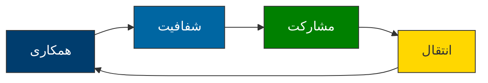
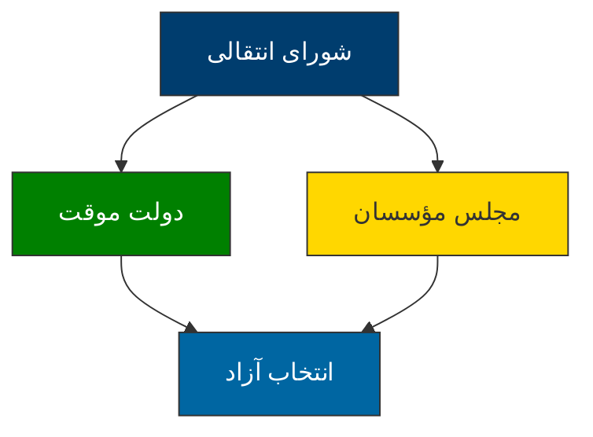
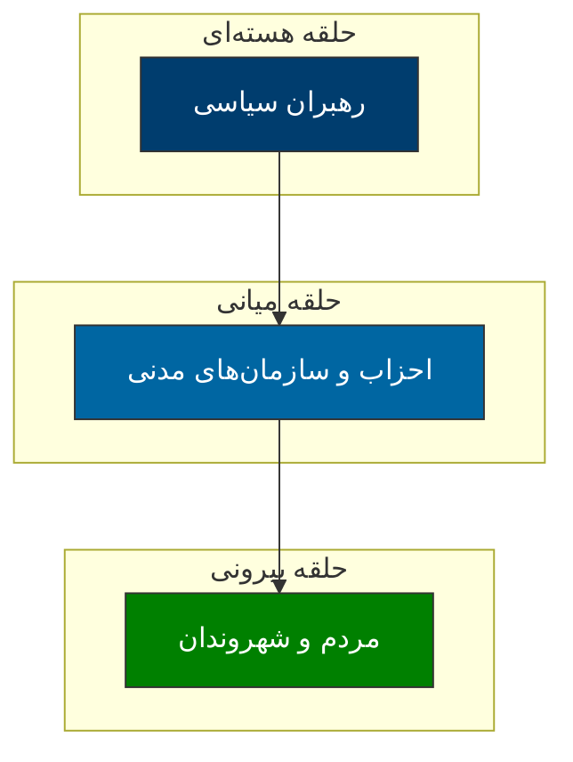
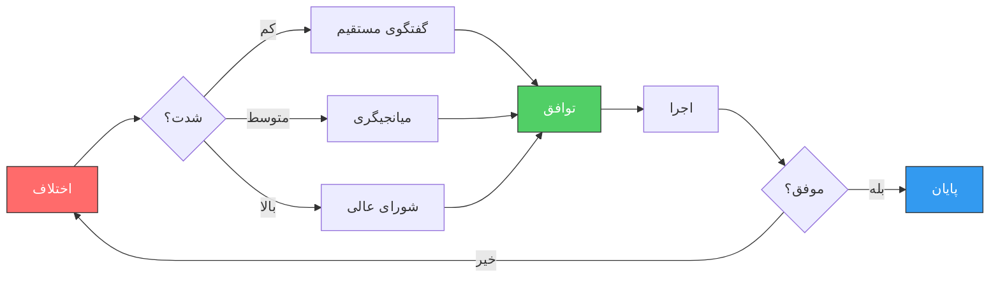
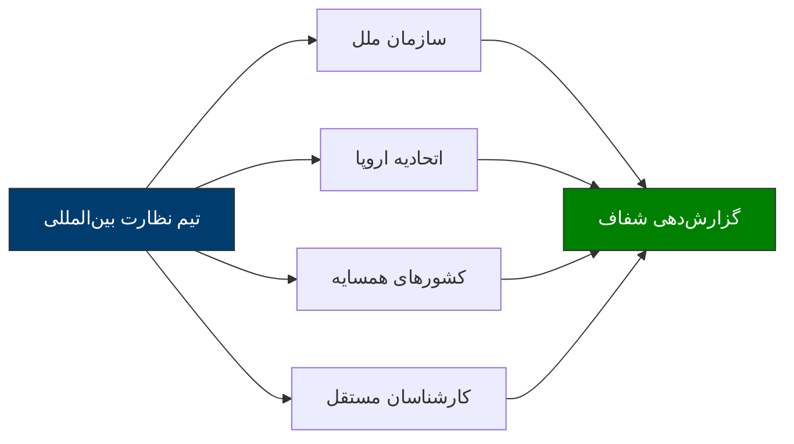
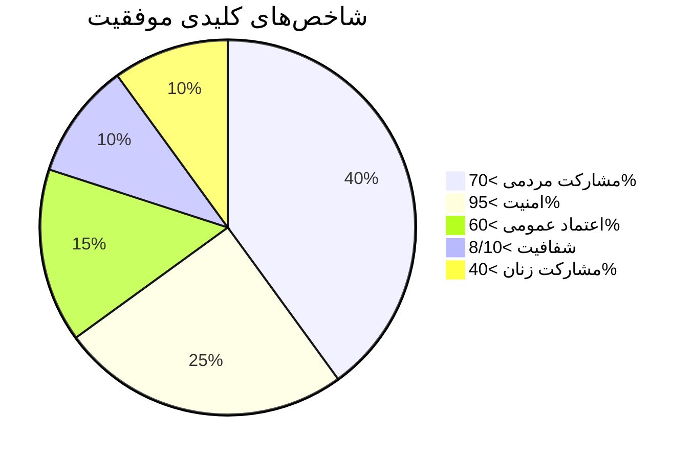
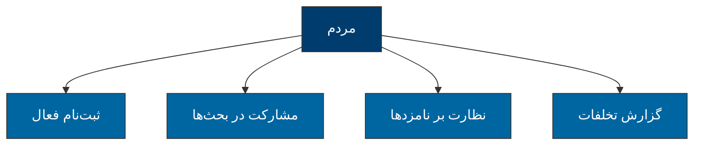
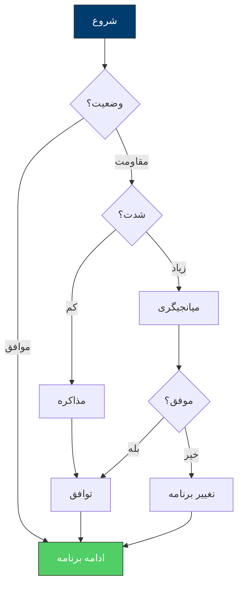

# راهبرد گذار دموکراتیک ایران

## نهادها، مشارکت و همکاری

---

> **چکیده:** این سند یک طرح جامع برای گذار دموکراتیک ایران ارائه می‌دهد. تمرکز بر ایجاد نهادهای موقت، مشارکت همه ذینفعان، و همکاری بین‌المللی است.

---

## ۱. چشم‌انداز: از انسجام به دموکراسی

### ۱.۱ چارچوب کلی

گذار دموکراتیک ایران نیازمند یک برنامه‌ریزی دقیق و عملیاتی است. این طرح بر اساس تجربیات موفق جهانی و ویژگی‌های خاص ایران طراحی شده است.

### ۱.۲ اصول بنیادین



---

## ۲. چارچوب نهادی پیشنهادی

### ۲.۱ مثلث حکمرانی دموکراتیک



### ۲.۲ ساختار پیشنهادی قدرت

| نهاد | ترکیب | وظایف | مدت |
|:-----|:------|:-------|:----|
| **شورای انتقالی** | ۵۰ نفر از همه طیف‌ها | اداره کشور | ۱۲-۱۸ ماه |
| **دولت موقت** | نخست‌وزیر + وزرا | اجرای امور | تا انتخاب |
| **مجلس مؤسسان** | ۱۰۰ نفر | تدوین قانون اساسی | ۶ ماه |

---

## ۳. نقشه راه گذار

### ۳.۱ فازبندی زمانی

```mermaid
gantt
    title نقشه راه گذار دموکراتیک ایران
    dateFormat  YYYY-MM
    axisFormat  %Y-%m
    فاز 1: آمادگی         :active,    des1, 2025-01-01, 90d
    مذاکرات محرمانه       :          des2, 2025-01-01, 60d
    ایجاد شورای انتقالی  :          des3, 2025-03-01, 30d

    فاز 2: انتقال         :          des4, 2025-04-01, 180d
    تدوین قانون اساسی     :          des5, 2025-04-01, 120d
    رفراندوم              :          des6, 2025-08-01, 30d

    فاز 3: تثبیت         :          des7, 2025-09-01, 180d
    برگزاری انتخاب       :          des8, 2025-09-01, 60d
    انتقال قدرت          :          des9, 2025-11-01, 30d
```

### ۳.۲ نقاط عطف کلیدی

| نقطه عطف | زمان | شرح |
|:----------|:-----|:----|
| ۱ | ماه ۲ | تشکیل شورای موقت |
| ۲ | ماه ۵ | تشکیل شورای انتقالی |
| ۳ | ماه ۸ | رفراندوم |
| ۴ | ماه ۱۱ | تصویب قانون اساسی |
| ۵ | ماه ۱۵ | برگزاری انتخاب |
| ۶ | ماه ۱۸ | انتقال قدرت |

---

## ۴. مشارکت و همکاری

### ۴.۱ دایره مشارکت



### ۴.۲ ماتریس مسئولیت‌ها

| گروه | نقش | مسئولیت | ابزار |
|:-----|:----|:---------|:------|
| **مردم** | مشارکت فعال | رأی‌دهی، نظارت، اعتراض | ثبت‌نام، پرسش‌نامه |
| **احزاب** | نمایندگی | ارائه برنامه، بسیج | کمپین، مذاکره |
| **دانشگاه** | پشتیبانی علمی | تحقیق، مشاوره | گزارش، کارگاه |
| **نهادهای بین‌المللی** | نظارت | تأیید، کمک | ناظر، میانجی |

---

## ۵. حل تعارضات

### ۵.۱ پروتکل‌های حل اختلاف



### ۵.۲ تکنیک‌های عملی

**۱. گفتگوی ساختاریافته**
- جلسات منظم بین طرف‌ها
- دستور کار مشخص
- مستندسازی توافقات

**۲. میانجیگری حرفه‌ای**
- دعوت از افراد مورد اعتماد
- حفظ بی‌طرفی
- تمرکز بر منافع مشترک

**۳. عدالت انتقالی**
- کمیسیون حقیقت‌یاب
- بخشش مشروط
- جبران خسارت

---

## ۶. نهادهای بین‌المللی و نقش آنها

### ۶.۱ نهادهای پشتیبان

| نهاد | نوع کمک | مزیت |
|:-----|:--------|:-----|
| **سازمان ملل** | نظارت، تأیید | مشروعیت جهانی |
| **اتحادیه اروپا** | کمک مالی، تجربه | منابع مالی |
| **آمریکا** | حمایت سیاسی | قدرت جهانی |
| **روسیه و چین** | عدم وتو | موازنه قدرت |
| **شورای راسل** | میانجیگری | اعتبار اخلاقی |

### ۶.۲ مدل نظارت بین‌المللی



---

## ۷. شاخص‌های موفقیت

### ۷.۱ داشبورد KPI



### ۷.۲ ماتریس اولویت‌ها

| شاخص | هدف | سنجه | اولویت |
|:------|:----|:------|:-------|
| مشارکت مردمی | > ۷۰٪ | درصد رأی‌دهندگان | 🔴 بحرانی |
| امنیت | > ۹۵٪ | احساس امنیت | 🔴 بحرانی |
| اعتماد عمومی | > ۶۰٪ | نظرسنجی | 🟡 متوسط |
| شفافیت | > ۸/۱۰ | ارزیابی | 🟢 عادی |
| مشارکت زنان | > ۴۰٪ | نامزدها | 🟡 متوسط |
| مشارکت اقوام | متناسب | ترکیب نامزدها | 🟡 متوسط |

### ۷.۳ اهرم‌های اطمینان‌بخشی

> **نظارت چندلایه:** داخلی + منطقه‌ای + بین‌المللی

> **شفافیت کامل:** همه مراحل قابل ردیابی

> **اعتراضات قانونی:** سازوکار مشخص برای شکایات

---

## ۸. راهکارهای عملیاتی

### ۸.۱ برای مردم



### ۸.۲ برای دانشگاه‌ها

- **تحقیق** درباره تجربیات جهانی
- **آموزش** شهروندان
- **مشاوره** به نهادهای گذار
- **نظارت** علمی بر فرآیند

### ۸.۳ برای نهادهای بین‌المللی

- **اعزام** ناظران
- **ارائه** کمک فنی
- **میانجیگری** در اختلافات
- **تأیید** مشروعیت فرآیند

---

## ۹. سناریوهای محتمل

### ۹.۱ ماتریس سناریو

| سناریو | احتمال | پیامد | آمادگی |
|:-------|:-------|:-------|:--------|
| گذار مسالمت‌آمیز | ۵۰٪ | موفق | برنامه‌ریزی کامل |
| تأخیر | ۲۵٪ | طولانی‌تر شدن | صبر و تداوم |
| اختلاف | ۱۵٪ | بحران | میانجیگری |
| مداخله خارجی | ۱۰٪ | پیچیدگی | دیپلماسی فعال |

### ۹.۲ درخت تصمیم‌گیری


---

## ۱۰. نتیجه‌گیری

### اصول کلیدی


> **همکاری** به جای تقابل
> 
> **شفافیت** در همه مراحل
> 
> **مشارکت** همه اقشار
> 
> **نظارت** بین‌المللی
> 
> **انعطاف‌پذیری** در برنامه

### پیام امیدوارکننده

> *«گذار دموکراتیک ایران نه یک رؤیا، بلکه یک فرآیند عملی است که با برنامه‌ریزی دقیق، مشارکت گسترده و همکاری همه ذینفعان قابل تحقق است»*

---

## درباره نویسنده

**مهدی سالم**  
پژوهشگر مستقل فلسفه تحلیلی و سیاست‌گذاری عمومی  
ریچموند هیل

- ایمیل: mahhdy@gmail.com
- وب‌سایت: mahdisalem.com

---

## منابع و مراجع

- هانتینگتون، ساموئل. (۱۹۹۱). *موج سوم دموکراتیزاسیون*
- اودانل، گیلرمتو. (۱۹۸۶). *گذار از حکومت اقتدارگرا*
- لینتز، خوان. (۱۹۹۶). *مشکلات گذار و تحکیم دموکراسی*
- گزارش‌های سازمان ملل متحد
- تجربیات کشورهای گذار موفق

---

*این سند یک طرح اولیه و قابل بحث است. نظرات و پیشنهادات برای بهبود پذیرفته می‌شود.*

---

**تاریخ تنظیم:** اسفند ۱۴۰۴

**نسخه:** ۱.۰
