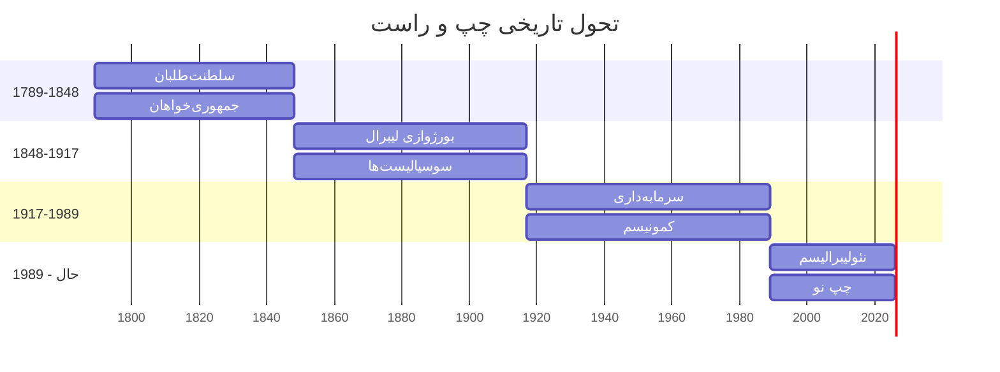
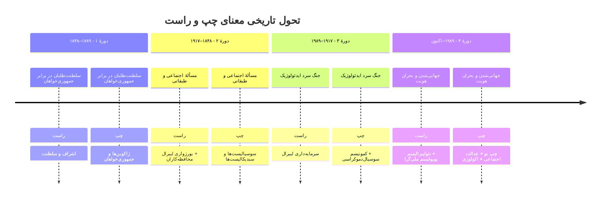
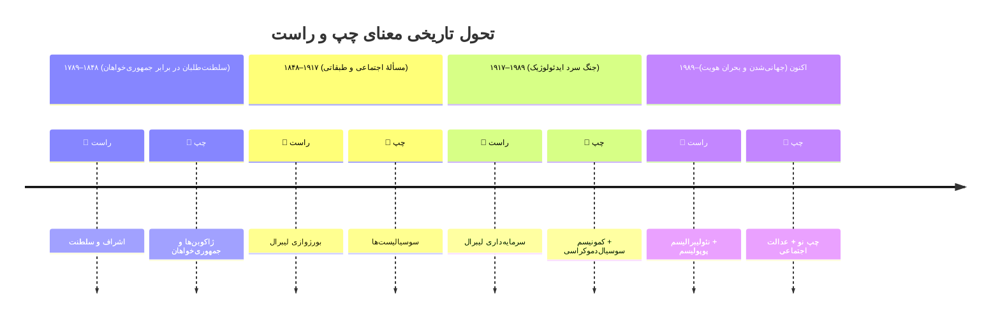
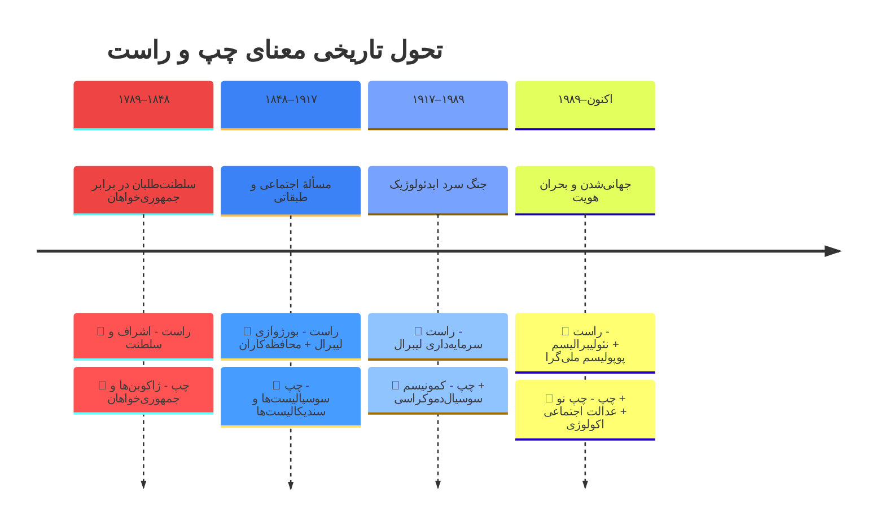
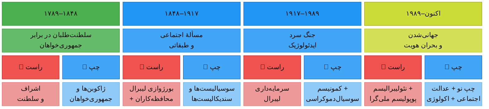
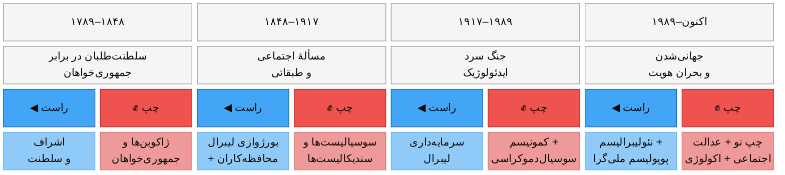

```mermaid
%%{init:{'theme':'base'}}%%
block-beta
    columns 8

    %% سطر ۱: دوره‌های زمانی
    p1["۱۷۸۹–۱۸۴۸"]:2
    p2["۱۸۴۸–۱۹۱۷"]:2
    p3["۱۹۱۷–۱۹۸۹"]:2
    p4["۱۹۸۹–اکنون"]:2

    %% سطر ۲: موضوع هر دوره
    t1["سلطنت‌طلبان در برابر<br>جمهوری‌خواهان"]:2
    t2["مسألهٔ اجتماعی<br>و طبقاتی"]:2
    t3["جنگ سرد<br>ایدئولوژیک"]:2
    t4["جهانی‌شدن<br>و بحران هویت"]:2

    %% سطر ۳: راست و چپ
    r1["🏛️ راست"]
    l1["✊ چپ"]
    r2["🏛️ راست"]
    l2["✊ چپ"]
    r3["🏛️ راست"]
    l3["✊ چپ"]
    r4["🏛️ راست"]
    l4["✊ چپ"]

    %% سطر ۴: دیدگاه‌ها
    rv1["اشراف<br>و سلطنت"]
    lv1["ژاکوبن‌ها و<br>جمهوری‌خواهان"]
    rv2["بورژوازی لیبرال<br>+ محافظه‌کاران"]
    lv2["سوسیالیست‌ها و<br>سندیکالیست‌ها"]
    rv3["سرمایه‌داری<br>لیبرال"]
    lv3["کمونیسم +<br>سوسیال‌دموکراسی"]
    rv4["نئولیبرالیسم +<br>پوپولیسم ملی‌گرا"]
    lv4["چپ نو + عدالت<br>اجتماعی + اکولوژی"]

    %% رنگ سطر ۱: دوره‌ها
    style p1 fill:#4CAF50,stroke:#388E3C,color:#fff
    style p2 fill:#2196F3,stroke:#1565C0,color:#fff
    style p3 fill:#CDDC39,stroke:#1565C0,color:#333
    style p4 fill:#2196F3,stroke:#9E9D24,color:#fff

    %% رنگ سطر ۲: موضوعات
    style t1 fill:#66BB6A,stroke:#43A047,color:#fff
    style t2 fill:#42A5F5,stroke:#1E88E5,color:#fff
    style t3 fill:#D4E157,stroke:#1E88E5,color:#333
    style t4 fill:#42A5F5,stroke:#C0CA33,color:#fff

    %% رنگ سطر ۳: راست = آبی
    style r1 fill:#1565C0,stroke:#0D47A1,color:#fff
    style r2 fill:#1565C0,stroke:#0D47A1,color:#fff
    style r3 fill:#1565C0,stroke:#0D47A1,color:#fff
    style r4 fill:#1565C0,stroke:#0D47A1,color:#fff

    %% رنگ سطر ۳: چپ = قرمز
    style l1 fill:#c62828,stroke:#b71c1c,color:#fff
    style l2 fill:#c62828,stroke:#b71c1c,color:#fff
    style l3 fill:#c62828,stroke:#b71c1c,color:#fff
    style l4 fill:#c62828,stroke:#b71c1c,color:#fff

    %% رنگ سطر ۴: دیدگاه راست = آبی روشن + فونت تیره
    style rv1 fill:#BBDEFB,stroke:#1565C0,color:#0D47A1
    style rv2 fill:#BBDEFB,stroke:#1565C0,color:#0D47A1
    style rv3 fill:#BBDEFB,stroke:#1565C0,color:#0D47A1
    style rv4 fill:#BBDEFB,stroke:#1565C0,color:#0D47A1

    %% رنگ سطر ۴: دیدگاه چپ = قرمز روشن + فونت تیره
    style lv1 fill:#FFCDD2,stroke:#c62828,color:#7f0000
    style lv2 fill:#FFCDD2,stroke:#c62828,color:#7f0000
    style lv3 fill:#FFCDD2,stroke:#c62828,color:#7f0000
    style lv4 fill:#FFCDD2,stroke:#c62828,color:#7f0000
```
  
  

    تحقیقی جامع در باب ایدئولوژی‌ها، دغدغه‌ها، زیرگروه‌ها، نظریه‌پردازان و پیامدهای عملی دو سنت بزرگ فکری مدرن
  

  

    تاریخ تدوین:  زانویه 2026 · نسخهٔ ۱.۰ · فرمت: گزارش تحقیقاتی چندسطحی،  گردآوری و تالیف، مهدی سالم
  

نمودار ۱ – تحول تاریخی محتوای دوگانهٔ چپ–راست از ۱۷۸۹ تاکنون
 

<h3 className="section" id="s1-2">۱.۲ مدل‌های چندبُعدی طیف سیاسی</h3>

