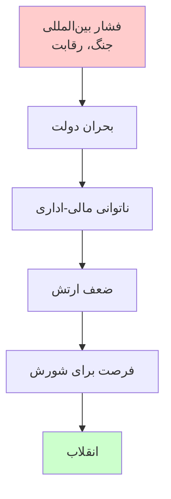
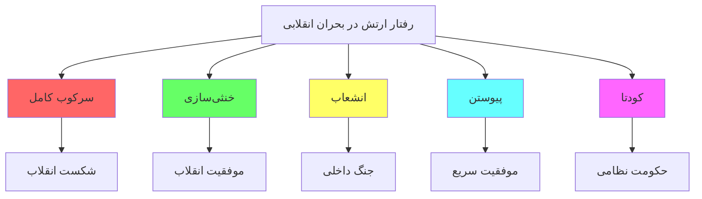
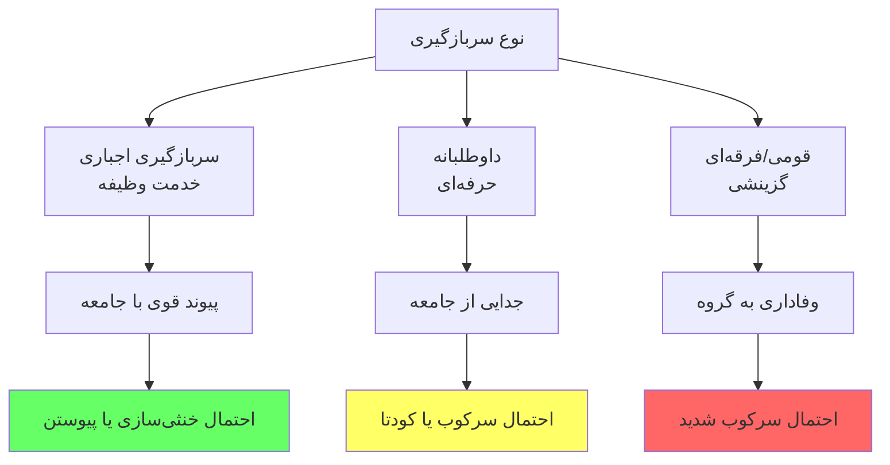

# نقش ارتش در انقلاب‌ها: مطالعه‌ی تطبیقی جامع

## خلاصه‌ی اجرایی

نقش ارتش در سرنوشت انقلاب‌ها **تعیین‌کننده** است. بدون **خنثی‌سازی، شکاف، یا پیوستن** نیروهای مسلح، هیچ انقلابی موفق نشده است. این مطالعه با بررسی ۱۵ انقلاب تاریخ مدرن، الگوهای رفتار نظامی را تحلیل می‌کند.

> **«هیچ حکومتی بدون از دست دادن کنترل بر ابزار خشونت سازمان‌یافته سقوط نکرده است.»**
> — تدا اسکاچپول، ۱۹۷۹

## فهرست مطالب

| بخش | موضوع |
| --- | --- |
| اول | چارچوب نظری |
| دوم | گونه‌شناسی رفتار نظامی |
| سوم | عوامل تعیین‌کننده‌ی رفتار ارتش |
| چهارم | مطالعات موردی (۱۵ انقلاب) |
| پنجم | تحلیل تطبیقی |
| ششم | الگوها و نتیجه‌گیری |

---

# بخش اول: چارچوب نظری

## ۱.۱ تعریف مفاهیم کلیدی

### انقلاب

| نظریه‌پرداز | تعریف |
| --- | --- |
| **اسکاچپول** | تغییر سریع و بنیادین در ساختار دولت و طبقاتی جامعه |
| **تیلی** | انتقال قدرت از طریق تهدید یا استفاده از خشونت |
| **هانتینگتون** | فروپاشی نظم موجود و بازسازی نظم جدید |
| **گلدستون** | بحران دولت + بسیج نخبگان + بسیج توده‌ای |

### ارتش و نیروهای مسلح

| نوع | تعریف | نمونه |
| --- | --- | --- |
| **ارتش منظم** | نیروی نظامی حرفه‌ای دولت | همه‌ی کشورها |
| **گارد ملی/انقلابی** | نیروی موازی وفادار به رهبر | سپاه ایران، گارد سوریه |
| **پلیس و نیروی امنیتی** | کنترل داخلی | ساواک، استازی |
| **شبه‌نظامیان** | نیروی غیررسمی | شبیحه، بسیج |

## ۱.۲ نظریه‌های کلاسیک

### نظریه‌ی اسکاچپول

### نظریه‌ی هانتینگتون

| معادله | توضیح |
| --- | --- |
| **ثبات = نهادمندی / مشارکت** | اگر مشارکت بیش از ظرفیت نهادی رشد کند → بی‌ثباتی |
| **نقش ارتش** | نهاد جایگزین یا ابزار سرکوب |
| **پیش‌بینی** | در جوامع در حال توسعه، ارتش یا سرکوب می‌کند یا کودتا می‌کند |

---

# بخش دوم: گونه‌شناسی رفتار نظامی

## ۲.۱ پنج الگوی اصلی رفتار ارتش

## ۲.۲ تشریح هر الگو

### الگوی ۱: سرکوب کامل

| ویژگی | توضیح |
| --- | --- |
| **تعریف** | ارتش کاملاً و مؤثر از رژیم دفاع می‌کند |
| **پیش‌شرط** | وفاداری بالا، انسجام، منابع کافی |
| **نتیجه** | شکست انقلاب |
| **هزینه** | خشونت بالا، مشروعیت پایین |

**نمونه‌های تاریخی:**

| نمونه | سال | توضیح |
| --- | --- | --- |
| چین (تیانانمن) | ۱۹۸۹ | سرکوب کامل، ۳۰۰-۳۰۰۰ کشته |
| بحرین | ۲۰۱۱ | سرکوب با کمک عربستان |
| ازبکستان (آندیجان) | ۲۰۰۵ | کشتار ۷۰۰+ نفر |
| میانمار | ۱۹۸۸، ۲۰۲۱ | سرکوب مکرر |

### الگوی ۲: خنثی‌سازی

| ویژگی | توضیح |
| --- | --- |
| **تعریف** | ارتش از سرکوب خودداری می‌کند |
| **پیش‌شرط** | فشار افکار عمومی، تردید در پیروزی |
| **نتیجه** | سقوط رژیم بدون جنگ داخلی |
| **مزیت** | کمترین خشونت |

**نمونه‌های تاریخی:**

| نمونه | سال | توضیح |
| --- | --- | --- |
| ایران | ۱۹۷۹ | اعلام بی‌طرفی ۱۱ بهمن |
| فیلیپین | ۱۹۸۶ | امتناع از سرکوب |
| تونس | ۲۰۱۱ | ارتش از بن‌علی حمایت نکرد |
| آلمان شرقی | ۱۹۸۹ | عدم سرکوب |

---

# بخش سوم: عوامل تعیین‌کننده‌ی رفتار ارتش

## ۳.۱ عوامل ساختاری

### ۳.۱.۱ نوع سربازگیری

### جدول تفصیلی

| نوع | ویژگی | رفتار محتمل | نمونه |
| --- | --- | --- | --- |
| **وظیفه‌ای** | سربازان از همه‌ی طبقات | خنثی/پیوستن | ایران،روسیه،تونس |
| **حرفه‌ای** | جدا از جامعه، وفادار به نهاد | سرکوب/کودتا | شیلی،آرژانتین |
| **قومی** | از یک قوم/فرقه | سرکوب شدید | سوریه (علوی)،بحرین |
| **ایدئولوژیک** | گزینش بر اساس ایدئولوژی | سرکوب کامل | چین،کره شمالی |

---

# بخش چهارم: مطالعات موردی

## ۴.۱ نمای کلی ۱۵ انقلاب

| # | انقلاب | سال | رفتار ارتش | نتیجه |
| --- | --- | --- | --- | --- |
| ۱ | آمریکا | ۱۷۷۵-۸۳ | تشکیل ارتش جدید | موفقیت |
| ۲ | فرانسه | ۱۷۸۹ | انشعاب + پیوستن | موفقیت → بی‌ثباتی |
| ۳ | روسیه (فوریه) | ۱۹۱۷ | پیوستن | موفقیت |
| ۴ | چین | ۱۹۴۹ | ارتش انقلابی | موفقیت |
| ۵ | ایران | ۱۹۷۹ | خنثی‌سازی | موفقیت |
| ۶ | فیلیپین | ۱۹۸۶ | خنثی + انشعاب | موفقیت |
| ۷ | چین (تیانانمن) | ۱۹۸۹ | سرکوب | شکست |
| ۸ | رومانی | ۱۹۸۹ | پیوستن | موفقیت |
| ۹ | تونس | ۲۰۱۱ | خنثی | موفقیت |
| ۱۰ | مصر | ۲۰۱۱ | کودتا | «سرقت» |
| ۱۱ | لیبی | ۲۰۱۱ | انشعاب | جنگ داخلی |
| ۱۲ | سوریه | ۲۰۱۱+ | سرکوب + انشعاب | جنگ داخلی |

---

# بخش پنجم: تحلیل تطبیقی

## ۵.۱ ماتریس مقایسه‌ای ۱۵ انقلاب

| انقلاب | نوع سربازگیری | رابطه ارتش-رژیم | نیروی موازی | رفتار ارتش | نتیجه‌ی انقلاب |
| --- | --- | --- | --- | --- | --- |
| فرانسه ۱۷۸۹ | وظیفه | سنتی-اشرافی | خیر | انشعاب+پیوستن | موفقیت |
| ایران ۱۹۷۹ | وظیفه | پاتریمونیال | محدود | خنثی | موفقیت |
| فیلیپین ۱۹۸۶ | حرفه‌ای | پاتریمونیال | خیر | خنثی+انشعاب | موفقیت |
| چین ۱۹۸۹ | وظیفه | حزبی | خیر | سرکوب | شکست |
| تونس ۲۰۱۱ | وظیفه | حرفه‌ای-مستقل | خیر | خنثی | موفقیت |
| مصر ۲۰۱۱ | وظیفه | پراتورین | خیر | کودتا | سرقت |
| سوریه ۲۰۱۱ | وظیفه | فرقه‌ای | گارد | سرکوب+انشعاب | جنگ داخلی |

## ۵.۲ الگوهای آماری

### توزیع رفتار ارتش در ۱۵ انقلاب

| رفتار | تعداد | درصد | نتیجه‌ی غالب |
| --- | --- | --- | --- |
| **سرکوب کامل** | ۲ | ۱۳٪ | شکست انقلاب |
| **خنثی‌سازی** | ۳ | ۲۰٪ | موفقیت انقلاب |
| **پیوستن** | ۳ | ۲۰٪ | موفقیت سریع |
| **انشعاب** | ۴ | ۲۷٪ | جنگ داخلی |
| **کودتا** | ۳ | ۲۰٪ | سرقت/بی‌ثباتی |

---

# بخش ششم: نتیجه‌گیری و الگوها

## ۶.۱ قوانین کلی

### قانون اول: شرط لازم

> **«موفقیت انقلاب مستلزم خنثی‌سازی، انشعاب، یا پیوستن نیروهای مسلح است. هیچ انقلابی با سرکوب کامل نظامی موفق نشده است.»**

### قانون دوم: ترکیب تعیین‌کننده است

> **«ارتش‌هایی که از همان طبقات/اقوام معترضان هستند، کمتر سرکوب می‌کنند.»**

### قانون سوم: سرنوشت مشترک

> **«اگر سرنوشت ارتش با سرنوشت رژیم گره خورده باشد، سرکوب محتمل‌تر است.»**

### قانون چهارم: نیروی موازی

> **«وجود نیروی موازی وفادار، شانس موفقیت انقلاب را کاهش می‌دهد.»**

## ۶.۲ توصیه‌ها

### برای جنبش‌های انقلابی

| توصیه | توضیح |
| --- | --- |
| **شعار «ارتش برادر ماست»** | فشار روانی برای خنثی‌سازی |
| **خشونت‌پرهیزی** | سخت‌تر کردن توجیه سرکوب |
| **بسیج خانواده‌های سربازان** | تقویت پیوند |
| **جذب افسران ناراضی** | ایجاد شکاف |
| **گسترش جغرافیایی** | غیرممکن کردن سرکوب کامل |

---

> **«ارتش نمی‌تواند یک ملت را برای همیشه سرکوب کند. یا باید بپیوندد، یا باید کنار برود، یا باید در جنگ داخلی نابود شود.»**

---

# منابع

## منابع اصلی

| نویسنده | اثر | سال |
| --- | --- | --- |
| **Skocpol, Theda** | *States and Social Revolutions* | ۱۹۷۹ |
| **Tilly, Charles** | *From Mobilization to Revolution* | ۱۹۷۸ |
| **Huntington, Samuel** | *Political Order in Changing Societies* | ۱۹۶۸ |
| **Goldstone, Jack** | *Revolution and Rebellion in the Early Modern World* | ۱۹۹۱ |
| **Bellin, Eva** | *Reconsidering the Robustness of Authoritarianism* | ۲۰۱۲ |
| **Chenoweth, Erica & Stephan, Maria** | *Why Civil Resistance Works* | ۲۰۱۱ |

## منابع فارسی

| نویسنده | اثر |
| --- | --- |
| آبراهامیان، یرواند | *ایران بین دو انقلاب* |
| فوران، جان | *مقاومت شکننده* |
| کاتوزیان، همایون | *اقتصاد سیاسی ایران* |
