# 🧪 Mermaid Chart Test Baseline

> **Auto-generated on 2026-02-23**
> Each diagram has a stable **Chart ID** (e.g. `TR-1`) you can reference in feedback.
> Re-run `npm run test:mermaid` to refresh this file after adding new articles.

---

**Statistics:**
- Total diagrams: **77**
- Source files: **9**
- Issues detected: **20**
- Generated: `2026-02-23`

---

## ⚠️ Auto-Detected Issues

| Chart ID | Type | Issues |
|----------|------|--------|
| `GA-5` | flowchart | CLASS C |
| `AR-1` | flowchart | CLASS C |
| `AR-3` | flowchart | CLASS C |
| `FR-4` | graph | CLASS C |
| `FR-6` | graph | CLASS C |
| `RU-1` | graph | CLASS C |
| `RU-6` | graph | CLASS C |
| `را-2` | %%{init: | CLASS C |
| `را-9` | flowchart | CLASS C |
| `را-11` | flowchart | CLASS C |
| `را-12` | flowchart | CLASS C |
| `را-13` | flowchart | CLASS C |
| `را-15` | flowchart | CLASS C |
| `را-18` | flowchart | CLASS C |
| `را-19` | flowchart | CLASS C |
| `را-20` | flowchart | CLASS C |
| `را-22` | flowchart | CLASS C |
| `را-23` | flowchart | CLASS C |
| `را-24` | flowchart | CLASS C |
| `را-25` | flowchart | CLASS C |

> See `developments/MERMAID_CHART_FIX_TRACKER.md` for what each class means.

---


## 📄 Source: `fa/iran-transition-article.mdx`

### 🆔 `TR-1` — graph

> ✅ No issues detected

**Raw Source:**
```text
graph LR
    A["همکاری"] --> B["شفافیت"]
    B --> C["مشارکت"]
    C --> D["انتقال"]
    D --> A

    style A fill:#003d6e,stroke:#333,color:white
    style B fill:#0066a2,stroke:#333,color:white
    style C fill:#008000,stroke:#333,color:white
    style D fill:#ffd700,stroke:#333,color:#333
```

**Rendered:**


---

### 🆔 `TR-2` — graph

> ✅ No issues detected

**Raw Source:**
```text
graph TD
    A["شورای انتقالی"] --> B["دولت موقت"]
    A --> C["مجلس مؤسسان"]
    B --> D["انتخاب آزاد"]
    C --> D

    style A fill:#003d6e,stroke:#333,color:white
    style B fill:#008000,stroke:#333,color:white
    style C fill:#ffd700,stroke:#333,color:#333
    style D fill:#0066a2,stroke:#333,color:white
```

**Rendered:**

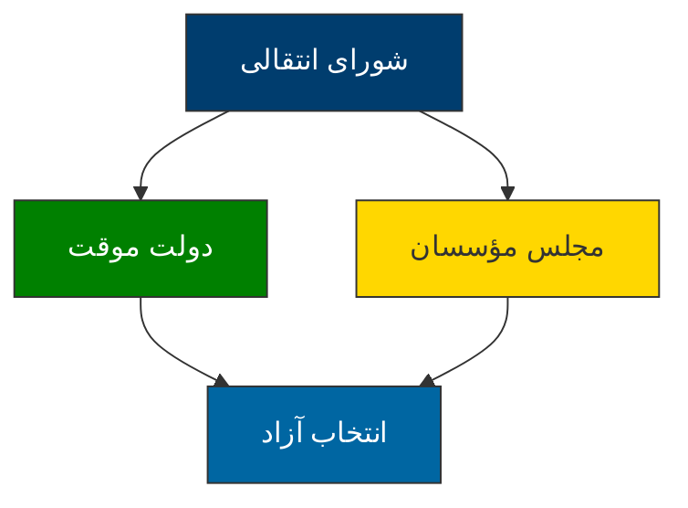

---

### 🆔 `TR-3` — gantt

> ✅ No issues detected

**Raw Source:**
```text
gantt
    title نقشه راه گذار دموکراتیک ایران
    dateFormat  YYYY-MM-DD
    axisFormat  %Y-%m
    فاز 1 (آمادگی)         :active,    des1, 2025-01-01, 90d
    مذاکرات محرمانه       :          des2, 2025-01-01, 60d
    ایجاد شورای انتقالی  :          des3, 2025-03-01, 30d

    فاز 2 (انتقال)         :          des4, 2025-04-01, 180d
    تدوین قانون اساسی     :          des5, 2025-04-01, 120d
    رفراندوم              :          des6, 2025-08-01, 30d

    فاز 3 (تثبیت)         :          des7, 2025-09-01, 180d
    برگزاری انتخاب       :          des8, 2025-09-01, 60d
    انتقال قدرت          :          des9, 2025-11-01, 30d
```

**Rendered:**

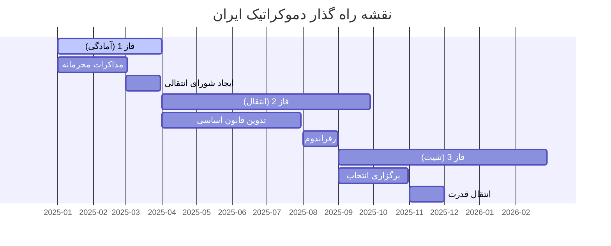

---

### 🆔 `TR-4` — graph

> ✅ No issues detected

**Raw Source:**
```text
graph TD
    subgraph "حلقه هسته‌ای"
    A["رهبران سیاسی"]
    end

    subgraph "حلقه میانی"
    B["احزاب و سازمان‌های مدنی"]
    end

    subgraph "حلقه بیرونی"
    C["مردم و شهروندان"]
    end

    A --> B
    B --> C

    style A fill:#003d6e,stroke:#333,color:white
    style B fill:#0066a2,stroke:#333,color:white
    style C fill:#008000,stroke:#333,color:white
```

**Rendered:**

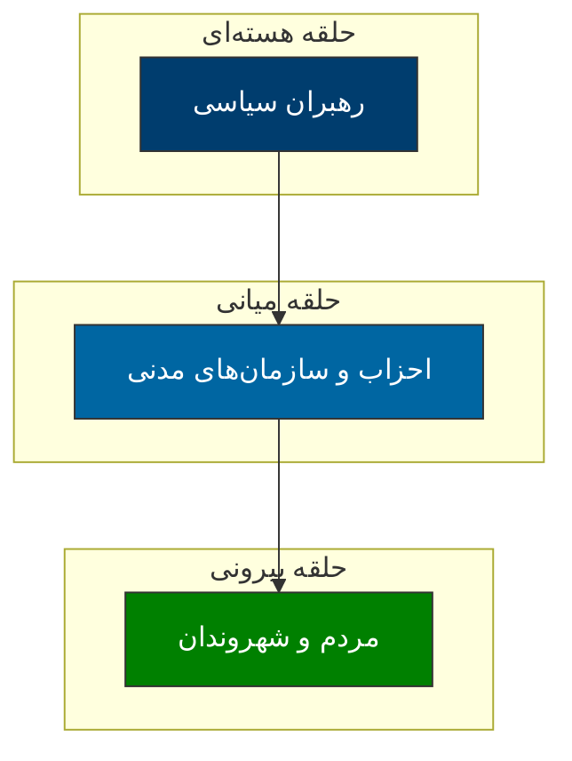

---

### 🆔 `TR-5` — flowchart

> ✅ No issues detected

**Raw Source:**
```text
flowchart LR
    A["اختلاف"] --> B{شدت؟}
    B -->|"کم"| C["گفتگوی مستقیم"]
    B -->|"متوسط"| D["میانجیگری"]
    B -->|"بالا"| E["شورای عالی"]

    C --> F["توافق"]
    D --> F
    E --> F

    F --> G["اجرا"]
    G --> H{موفق؟}
    H -->|"بله"| I["پایان"]
    H -->|"خیر"| A

    style A fill:#ff6b6b,stroke:#333,color:white
    style F fill:#51cf66,stroke:#333,color:white
    style I fill:#339af0,stroke:#333,color:white
```

**Rendered:**

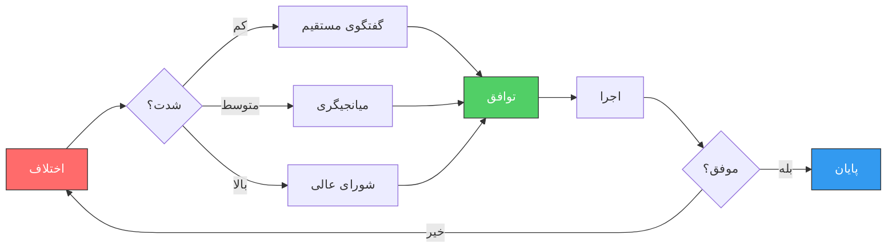

---

### 🆔 `TR-6` — graph

> ✅ No issues detected

**Raw Source:**
```text
graph LR
    A["تیم نظارت بین‌المللی"] --> B["سازمان ملل"]
    A --> C["اتحادیه اروپا"]
    A --> D["کشورهای همسایه"]
    A --> E["کارشناسان مستقل"]

    B --> F["گزارش‌دهی شفاف"]
    C --> F
    D --> F
    E --> F

    style A fill:#003d6e,stroke:#333,color:white
    style F fill:#008000,stroke:#333,color:white
```

**Rendered:**

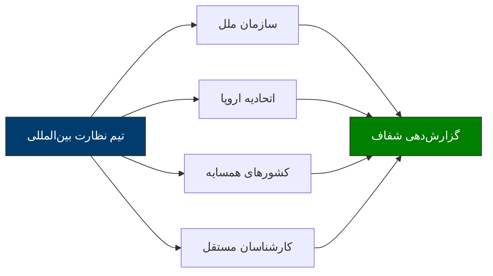

---

### 🆔 `TR-7` — pie

> ✅ No issues detected

**Raw Source:**
```text
pie
    title شاخص‌های کلیدی موفقیت
    "مشارکت مردمی >70%" : 40
    "امنیت >95%" : 25
    "اعتماد عمومی >60%" : 15
    "شفافیت >8/10" : 10
    "مشارکت زنان >40%" : 10
```

**Rendered:**

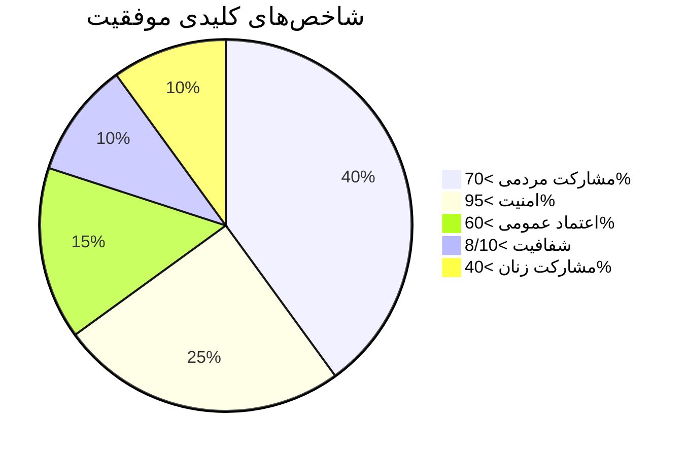

---

### 🆔 `TR-8` — graph

> ✅ No issues detected

**Raw Source:**
```text
graph TD
    A["مردم"] --> B["ثبت‌نام فعال"]
    A --> C["مشارکت در بحث‌ها"]
    A --> D["نظارت بر نامزدها"]
    A --> E["گزارش تخلفات"]

    style A fill:#003d6e,stroke:#333,color:white
    style B fill:#0066a2,stroke:#333,color:white
    style C fill:#0066a2,stroke:#333,color:white
    style D fill:#0066a2,stroke:#333,color:white
    style E fill:#0066a2,stroke:#333,color:white
```

**Rendered:**

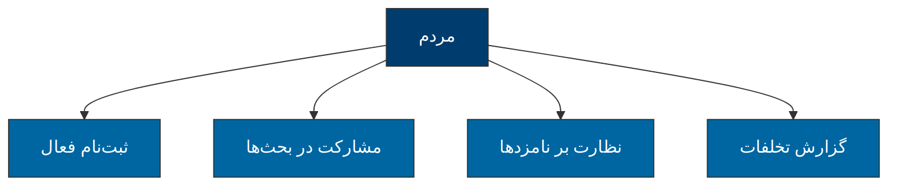

---

### 🆔 `TR-9` — flowchart

> ✅ No issues detected

**Raw Source:**
```text
flowchart TD
    A["شروع"] --> B{وضعیت؟}
    B -->|"موافق"| C["ادامه برنامه"]
    B --> |"مقاومت"| D{شدت؟}
    D --> |"کم"| E["مذاکره"]
    D -->|"زیاد"| F["میانجیگری"]
    E --> G["توافق"]
    F --> H{موفق؟}
    H -->|"بله"| G
    H -->|"خیر"| I["تغییر برنامه"]
    G --> C
    I --> C

    style A fill:#003d6e,stroke:#333,color:white
    style C fill:#51cf66,stroke:#333,color:white
```

**Rendered:**

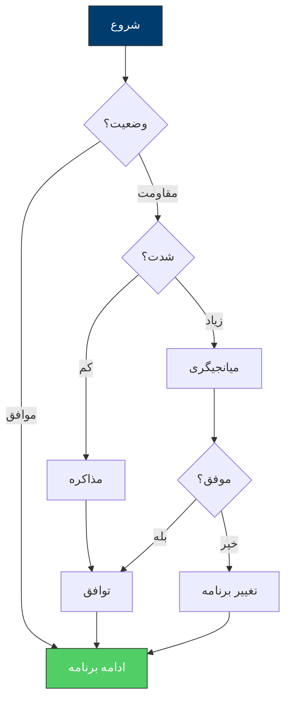

---

### 🆔 `TR-10` — graph

> ✅ No issues detected

**Raw Source:**
```text
graph LR
    A["همکاری"] -.-> B["شفافیت"]
    B -.-> C["مشارکت"]
    C -.-> D["نظارت"]
    D -.-> E["انعطاف‌پذیری"]

    style A fill:#003d6e,stroke:#333,color:white
    style B fill:#0066a2,stroke:#333,color:white
    style C fill:#008000,stroke:#333,color:white
    style D fill:#ffd700,stroke:#333,color:#333
    style E fill:#6c757d,stroke:#333,color:white
```

**Rendered:**


---


## 📄 Source: `fa/آشنایی-با-دوران-گذار-انقلابی.mdx`

### 🆔 `GA-1` — mindmap

> ✅ No issues detected

**Raw Source:**
```text
mindmap
  root(("🎯 الگوی مدیریت گذار"))
    ("📚 مبانی نظری")
      ("نظریه‌های گذار")
      ("تجربیات جهانی")
      ("چارچوب تحلیلی")
    ("⏱️ فازبندی")
      ("پیشاگذار")
      ("گذار اولیه")
      ("تثبیت")
      ("نهادسازی")
    ("🔧 ابعاد مدیریت")
      ("سیاسی")
      ("اقتصادی")
      ("اجتماعی")
      ("امنیتی")
    ("🤝 انسجام")
      ("تنوع قومی")
      ("عدالت توزیعی")
      ("مشارکت")
    ("⚠️ ریسک")
      ("شناسایی")
      ("پیشگیری")
      ("واکنش")
```

**Rendered:**

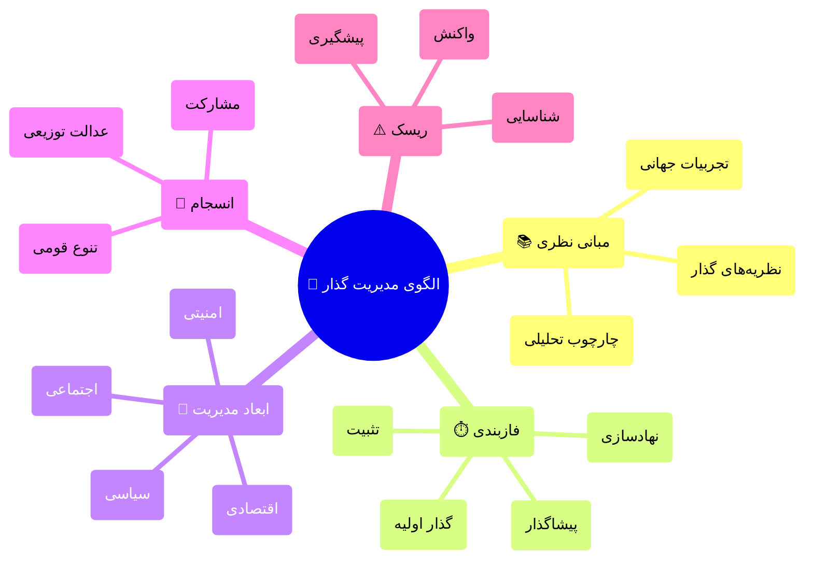

---

### 🆔 `GA-2` — flowchart

> ✅ No issues detected

**Raw Source:**
```text
flowchart LR
    A["🔄 عدم قطعیت"] --> B["⚖️ بازتوزیع قدرت"]
    B --> C["📜 بازتعریف قواعد"]
    C --> D["🏛️ نهادسازی مجدد"]
    D --> E["🤝 قرارداد اجتماعی جدید"]

    style A fill:#ffcccc,stroke:#333
    style B fill:#ffe6cc,stroke:#333
    style C fill:#ffffcc,stroke:#333
    style D fill:#ccffcc,stroke:#333
    style E fill:#cce6ff,stroke:#333
```

**Rendered:**

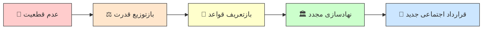

---

### 🆔 `GA-3` — timeline

> ✅ No issues detected

**Raw Source:**
```text
timeline
    title خط زمانی فازهای گذار
    section فاز صفر
        پیشاگذار : آماده‌سازی ذهنی : شکل‌گیری ائتلاف‌ها : برنامه‌ریزی اولیه
    section فاز یک
        گذار اولیه : انتقال قدرت : مدیریت بحران : حفظ نظم
    section فاز دو
        تثبیت موقت : دولت موقت : اصلاحات فوری : بازسازی اعتماد
    section فاز سه
        نهادسازی : قانون اساسی : برگزاری صندوق رأی : ساختارسازی
    section فاز فاز چهار
        تحکیم : نهادینه‌سازی : توسعه پایدار : عدالت انتقالی
```

**Rendered:**

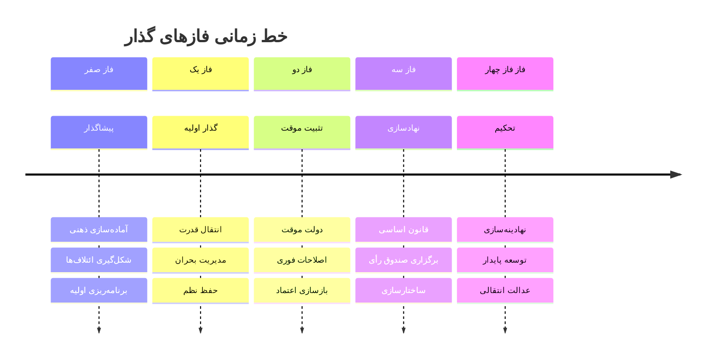

---

### 🆔 `GA-4` — pie

> ✅ No issues detected

**Raw Source:**
```text
pie title توزیع اولویت‌ها در فاز یک
    "امنیت و نظم عمومی" : 35
    "تداوم خدمات اساسی" : 25
    "ارتباطات و اطلاع‌رسانی" : 20
    "تشکیل ساختار موقت" : 15
    "دیپلماسی خارجی" : 5
```

**Rendered:**

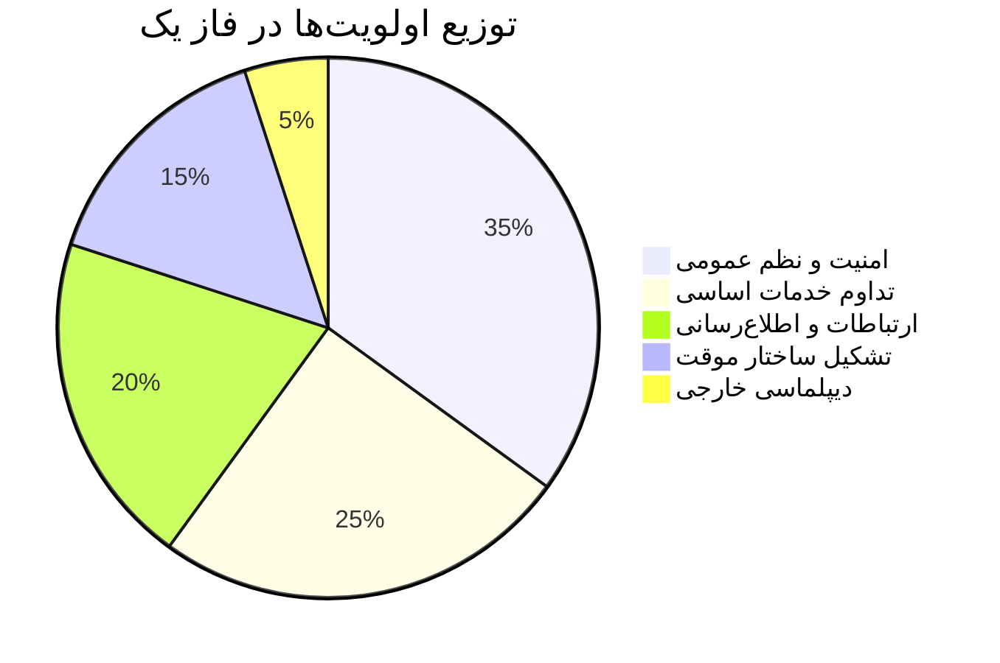

---

### 🆔 `GA-5` — flowchart

> ⚠️ Issues: CLASS C

**Raw Source:**
```text
flowchart TB
    A["🏛️ شورای عالی گذار<br/>(تصمیم‌گیری استراتژیک)"] --> B["👥 مجمع مشورتی ملی<br/>(نمایندگی اقشار)"]
    A --> C["⚖️ هیئت داوری<br/>(حل اختلاف)"]
    A --> D["📋 کابینه تکنوکرات<br/>(اجرا)"]
    A --> E["👁️ نهاد نظارت مستقل<br/>(پاسخگویی)"]

    style A fill:#4a90d9,stroke:#2c5282,color:#fff
    style B fill:#68d391,stroke:#276749,color:#fff
    style C fill:#f6ad55,stroke:#c05621,color:#fff
    style D fill:#fc8181,stroke:#c53030,color:#fff
    style E fill:#b794f4,stroke:#6b46c1,color:#fff
```

**Rendered:**

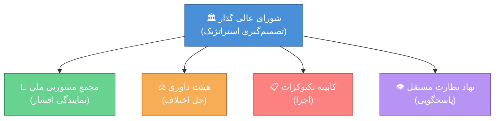

---

### 🆔 `GA-6` — flowchart

> ✅ No issues detected

**Raw Source:**
```text
flowchart LR
    subgraph "چالش‌های کوتاه‌مدت"
        A1["💸 فرار سرمایه"]
        A2["📉 کاهش تولید"]
        A3["📈 تورم"]
        A4["💼 بیکاری"]
    end

    subgraph "چالش‌های میان‌مدت"
        B1["🏦 بحران بانکی"]
        B2["💰 کسری بودجه"]
        B3["📊 بدهی خارجی"]
    end

    subgraph "چالش‌های بلندمدت"
        C1["🔧 بازسازی ساختاری"]
        C2["🌐 ادغام جهانی"]
        C3["⚡ تنوع اقتصادی"]
    end

    A1 --> B1
    A2 --> A4
    A3 --> B2
    B1 --> C1
    B3 --> C2

    style A1 fill:#ffcccc
    style A2 fill:#ffcccc
    style A3 fill:#ffcccc
    style A4 fill:#ffcccc
    style B1 fill:#ffe6cc
    style B2 fill:#ffe6cc
    style B3 fill:#ffe6cc
    style C1 fill:#ccffcc
    style C2 fill:#ccffcc
    style C3 fill:#ccffcc
```

**Rendered:**

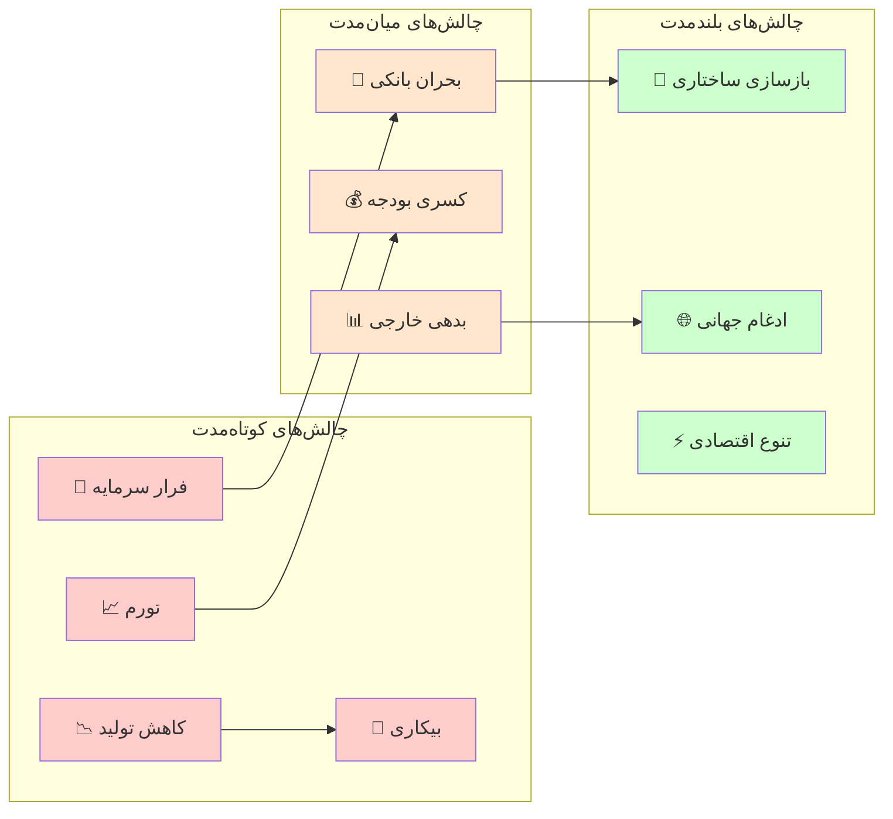

---

### 🆔 `GA-7` — flowchart

> ✅ No issues detected

**Raw Source:**
```text
flowchart LR
    A["🏛️ دولت متمرکز"] --> B["📍 تمرکززدایی اداری"]
    B --> C["🗺️ خودمختاری منطقه‌ای"]
    C --> D["🤝 فدرالیسم"]
    D --> E["🔗 کنفدراسیون"]

    style A fill:#ff6666
    style B fill:#ff9966
    style C fill:#ffcc66
    style D fill:#99ff99
    style E fill:#66ccff
```

**Rendered:**


---

### 🆔 `GA-8` — flowchart

> ✅ No issues detected

**Raw Source:**
```text
flowchart TB
    subgraph "ریسک‌های سیاسی"
        P1["🔄 بازگشت استبداد"]
        P2["💥 کودتا"]
        P3["🗳️ شکست صندوق رأی"]
        P4["⚔️ جنگ داخلی"]
    end

    subgraph "ریسک‌های اقتصادی"
        E1["💸 فروپاشی مالی"]
        E2["📈 ابرتورم"]
        E3["🚫 تحریم"]
        E4["💼 بیکاری گسترده"]
    end

    subgraph "ریسک‌های اجتماعی"
        S1["👥 شورش"]
        S2["🎭 شکاف قومی"]
        S3["🏃 مهاجرت گسترده"]
        S4["😰 بحران اعتماد"]
    end

    style P1 fill:#ffcccc
    style P2 fill:#ffcccc
    style P4 fill:#ff9999
    style E1 fill:#ffe6cc
    style E2 fill:#ffe6cc
    style S2 fill:#ffffcc
```

**Rendered:**

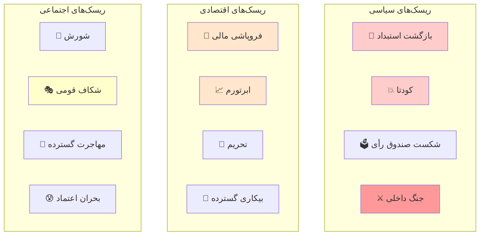

---


## 📄 Source: `fa/ارتش-و-انقلاب-ها.mdx`

### 🆔 `AR-1` — flowchart

> ⚠️ Issues: CLASS C

**Raw Source:**
```text
flowchart TD
    A["فشار بین‌المللی<br/>جنگ، رقابت"] --> B["بحران دولت"]
    B --> C["ناتوانی مالی-اداری"]
    C --> D["ضعف ارتش"]
    D --> E["فرصت برای شورش"]
    E --> F["انقلاب"]

    style A fill:#ffcccc
    style F fill:#ccffcc
```

**Rendered:**

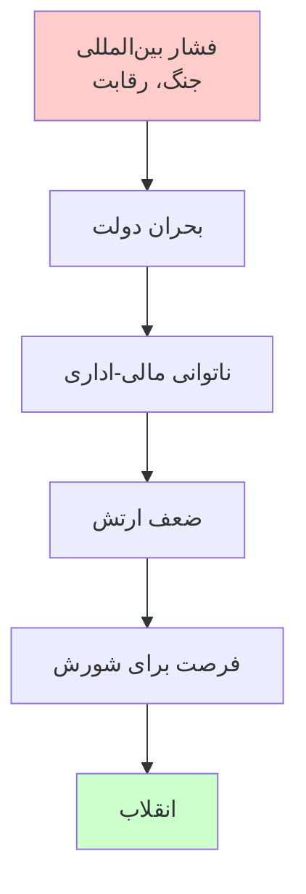

---

### 🆔 `AR-2` — flowchart

> ✅ No issues detected

**Raw Source:**
```text
flowchart TD
    A["رفتار ارتش در بحران انقلابی"] --> B["سرکوب کامل"]
    A --> C["خنثی‌سازی"]
    A --> D["انشعاب"]
    A --> E["پیوستن"]
    A --> F["کودتا"]

    B --> B1["شکست انقلاب"]
    C --> C1["موفقیت انقلاب"]
    D --> D1["جنگ داخلی"]
    E --> E1["موفقیت سریع"]
    F --> F1["حکومت نظامی"]

    style B fill:#ff6666
    style C fill:#66ff66
    style D fill:#ffff66
    style E fill:#66ffff
    style F fill:#ff66ff
```

**Rendered:**

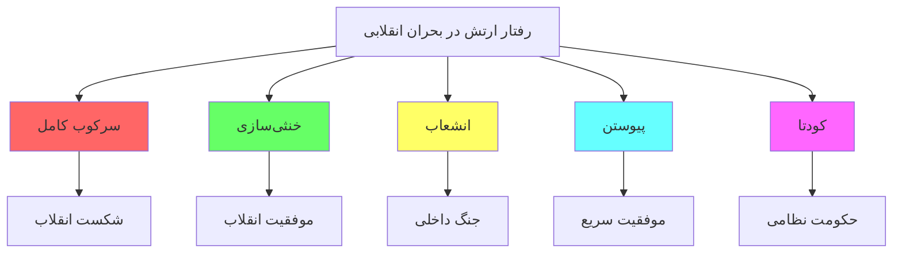

---

### 🆔 `AR-3` — flowchart

> ⚠️ Issues: CLASS C

**Raw Source:**
```text
flowchart TD
    A["نوع سربازگیری"] --> B["سربازگیری اجباری<br/>خدمت وظیفه"]
    A --> C["داوطلبانه<br/>حرفه‌ای"]
    A --> D["قومی/فرقه‌ای<br/>گزینشی"]

    B --> B1["پیوند قوی با جامعه"]
    B1 --> B2["احتمال خنثی‌سازی یا پیوستن"]

    C --> C1["جدایی از جامعه"]
    C1 --> C2["احتمال سرکوب یا کودتا"]

    D --> D1["وفاداری به گروه"]
    D1 --> D2["احتمال سرکوب شدید"]

    style B2 fill:#66ff66
    style C2 fill:#ffff66
    style D2 fill:#ff6666
```

**Rendered:**

```mermaid 
flowchart TD
    A["نوع سربازگیری"] --> B["سربازگیری اجباری<br/>خدمت وظیفه"]
    A --> C["داوطلبانه<br/>حرفه‌ای"]
    A --> D["قومی/فرقه‌ای<br/>گزینشی"]

    B --> B1["پیوند قوی با جامعه"]
    B1 --> B2["احتمال خنثی‌سازی یا پیوستن"]

    C --> C1["جدایی از جامعه"]
    C1 --> C2["احتمال سرکوب یا کودتا"]

    D --> D1["وفاداری به گروه"]
    D1 --> D2["احتمال سرکوب شدید"]

    style B2 fill:#66ff66
    style C2 fill:#ffff66
    style D2 fill:#ff6666
```

---


## 📄 Source: `fa/انقلاب-شناسی-تحلیل-جامع-انقلاب-فرانسه.mdx`

### 🆔 `FR-1` — graph

> ✅ No issues detected

**Raw Source:**
```text
graph TD
    subgraph "عوامل زمینه‌ای"
        A["🏛️ میراث تاریخی"] --> D["⚡ بحران قرن هجدهم"]
        B["📊 ساختار اجتماعی"] --> D
        C["💰 بحران اقتصادی"] --> D
        C --> E["🔥 انقلاب فرانسه"]
        D --> E
        F["🌱 جنبش روشنگری"] --> E
    end

    A -->|"فئودالیسم<br/>مطلق‌گرایی<br/>کلیسا"| G
    B -->|"نابرابری<br/>طبقات"| G
    C -->|"تورم<br/>کسری بودجه"| G

    style E fill:#ff0000,color:#fff,stroke:#333,stroke-width:3px
    style D fill:#ffaa00,color:#333
    style G fill:#eee,color:#333
```

**Rendered:**

```mermaid 
graph TD
    subgraph "عوامل زمینه‌ای"
        A["🏛️ میراث تاریخی"] --> D["⚡ بحران قرن هجدهم"]
        B["📊 ساختار اجتماعی"] --> D
        C["💰 بحران اقتصادی"] --> D
        C --> E["🔥 انقلاب فرانسه"]
        D --> E
        F["🌱 جنبش روشنگری"] --> E
    end

    A -->|"فئودالیسم<br/>مطلق‌گرایی<br/>کلیسا"| G
    B -->|"نابرابری<br/>طبقات"| G
    C -->|"تورم<br/>کسری بودجه"| G

    style E fill:#ff0000,color:#fff,stroke:#333,stroke-width:3px
    style D fill:#ffaa00,color:#333
    style G fill:#eee,color:#333
```

---

### 🆔 `FR-2` — pie

> ✅ No issues detected

**Raw Source:**
```text
pie title "سهم هزینه‌های دولت فرانسه (۱۷۸۸)"
    "هزینه‌های دربار" : 35
    "ارتش" : 25
    "بدهی خارجی" : 20
    "هزینه‌های اداری" : 15
    "خدمات عمومی" : 5
```

**Rendered:**

```mermaid 
pie title "سهم هزینه‌های دولت فرانسه (۱۷۸۸)"
    "هزینه‌های دربار" : 35
    "ارتش" : 25
    "بدهی خارجی" : 20
    "هزینه‌های اداری" : 15
    "خدمات عمومی" : 5
```

---

### 🆔 `FR-3` — timeline

> ✅ No issues detected

**Raw Source:**
```text
timeline
    title Chronologie انقلاب فرانسه
    section ۱۷۸۹ - آغاز
        ۵ مه : تشکیل طبقات
        ۱۷ ژوئن : ملت ملی
        ۲۰ ژوئن : سوگند توپیلری
        ۱۴ ژوئیه : تسخیر باستیل
    section ۱۷۸۹-۱۷۹۱ - قانون اساسی
        اوت : اعلامیه حقوق بشر
        نوامبر : الغای اشرافیت
        دسامبر : قانون اساسی
    section ۱۷۹۲ - جمهوری
        ۲۰ آوریل : اعلان جنگ به اتریش
        ۱۰ اوت : حمله به کاخ
        ۲۱ ژانویه : اعدام لویی شانزدهم
    section ۱۷۹۳-۱۷۹۴ - ترور
        ژوئن ۱۷۹۳ : حاکمیت Jakobin
        اکتبر ۱۷۹۳ : اعدام ژیروندن‌ها
        ۱۶ اکتبر : اعدام ملکه
        ۲۸ جولای ۱۷۹۴ : اعدام روبسپیر
    section ۱۷۹۵-۱۷۹۹ - پایان
        ۱۷۹۵ : قانون اساسی سوم
        ۱۷۹۹ : کودتای ناپلئون
```

**Rendered:**

```mermaid 
timeline
    title Chronologie انقلاب فرانسه
    section ۱۷۸۹ - آغاز
        ۵ مه : تشکیل طبقات
        ۱۷ ژوئن : ملت ملی
        ۲۰ ژوئن : سوگند توپیلری
        ۱۴ ژوئیه : تسخیر باستیل
    section ۱۷۸۹-۱۷۹۱ - قانون اساسی
        اوت : اعلامیه حقوق بشر
        نوامبر : الغای اشرافیت
        دسامبر : قانون اساسی
    section ۱۷۹۲ - جمهوری
        ۲۰ آوریل : اعلان جنگ به اتریش
        ۱۰ اوت : حمله به کاخ
        ۲۱ ژانویه : اعدام لویی شانزدهم
    section ۱۷۹۳-۱۷۹۴ - ترور
        ژوئن ۱۷۹۳ : حاکمیت Jakobin
        اکتبر ۱۷۹۳ : اعدام ژیروندن‌ها
        ۱۶ اکتبر : اعدام ملکه
        ۲۸ جولای ۱۷۹۴ : اعدام روبسپیر
    section ۱۷۹۵-۱۷۹۹ - پایان
        ۱۷۹۵ : قانون اساسی سوم
        ۱۷۹۹ : کودتای ناپلئون
```

---

### 🆔 `FR-4` — graph

> ⚠️ Issues: CLASS C

**Raw Source:**
```text
graph LR
    A["🔴 ژاکوبن‌ها<br/>(چپ افراطی)"] --> B["🟠 جیروندن‌ها<br/>(چپ میانه)"]
    B --> C["🟡 فایان‌ها<br/>(میانه)"]
    C --> D["🟢 راست moderate<br/>"]
    D --> E["🔵 محافظه‌کاران<br/>(ارتجاع)"]

    A -->|"رادیکال<br/>انقلابی"| F["🎯 اهداف"]
    B -->|" умеренный<br/>اصلاح‌طلب"| F
    C -->|"لیبرال<br/>میانه‌رو"| F

    style A fill:#ff4444,color:#fff
    style B fill:#ff8844,color:#fff
    style C fill:#ffcc00,color:#333
    style D fill:#44aa44,color:#fff
    style E fill:#4444ff,color:#fff
```

**Rendered:**

```mermaid 
graph LR
    A["🔴 ژاکوبن‌ها<br/>(چپ افراطی)"] --> B["🟠 جیروندن‌ها<br/>(چپ میانه)"]
    B --> C["🟡 فایان‌ها<br/>(میانه)"]
    C --> D["🟢 راست moderate<br/>"]
    D --> E["🔵 محافظه‌کاران<br/>(ارتجاع)"]

    A -->|"رادیکال<br/>انقلابی"| F["🎯 اهداف"]
    B -->|" умеренный<br/>اصلاح‌طلب"| F
    C -->|"لیبرال<br/>میانه‌رو"| F

    style A fill:#ff4444,color:#fff
    style B fill:#ff8844,color:#fff
    style C fill:#ffcc00,color:#333
    style D fill:#44aa44,color:#fff
    style E fill:#4444ff,color:#fff
```

---

### 🆔 `FR-5` — mindmap

> ✅ No issues detected

**Raw Source:**
```text
mindmap
  root(("ایدئولوژی‌های انقلاب فرانسه"))
    لیبرالیسم
      آزادی فردی
      مالکیت خصوصی
      حکومت قانون
    جمهوری‌خواهی
      حاکمیت مردم
      برابری شهروندی
      جمهوری دموکراتیک
    رادیکالیسم
      نابودی طبقات
      حاکمیت فضیلت
      ترور برای هدف
    سوسیالیسم اولیه
      مالکیت عمومی
      کمک متقابل
      عدالت اجتماعی
```

**Rendered:**

```mermaid 
mindmap
  root(("ایدئولوژی‌های انقلاب فرانسه"))
    لیبرالیسم
      آزادی فردی
      مالکیت خصوصی
      حکومت قانون
    جمهوری‌خواهی
      حاکمیت مردم
      برابری شهروندی
      جمهوری دموکراتیک
    رادیکالیسم
      نابودی طبقات
      حاکمیت فضیلت
      ترور برای هدف
    سوسیالیسم اولیه
      مالکیت عمومی
      کمک متقابل
      عدالت اجتماعی
```

---

### 🆔 `FR-6` — graph

> ⚠️ Issues: CLASS C

**Raw Source:**
```text
graph TD
    A["🌟 میراث انقلاب فرانسه"] --> B["🏛️ نهادهای مدرن"]
    A --> C["📜 مفاهیم سیاسی"]
    A --> D["⚖️ حقوق بشر"]
    A --> E["🎖️ ملی‌گرایی"]

    B --> B1["پارلمان<br/>مجلس<br/>قوه قضاییه"]
    C --> C1["آزادی، برابری<br/>برادری"]
    D --> D1["اعلامیه جهانی<br/>حقوق بشر"]
    E --> E1["هویت ملی<br/>فرانسوی"]

    style A fill:#ff0000,color:#fff,stroke:#333,stroke-width:3px
```

**Rendered:**

```mermaid 
graph TD
    A["🌟 میراث انقلاب فرانسه"] --> B["🏛️ نهادهای مدرن"]
    A --> C["📜 مفاهیم سیاسی"]
    A --> D["⚖️ حقوق بشر"]
    A --> E["🎖️ ملی‌گرایی"]

    B --> B1["پارلمان<br/>مجلس<br/>قوه قضاییه"]
    C --> C1["آزادی، برابری<br/>برادری"]
    D --> D1["اعلامیه جهانی<br/>حقوق بشر"]
    E --> E1["هویت ملی<br/>فرانسوی"]

    style A fill:#ff0000,color:#fff,stroke:#333,stroke-width:3px
```

---


## 📄 Source: `fa/انقلاب-شناسی-تحلیلی-از-انقلاب-1917-روسیه.mdx`

### 🆔 `RU-1` — graph

> ⚠️ Issues: CLASS C

**Raw Source:**
```text
graph TD
    subgraph "ساختار قدرت"
        A["👑 تزار<br/>الکساندر سوم"] --> B["دربار"]
        A --> C["ارتش"]
        A --> D["کلیسا"]
        B --> E["اشرافیت"]
        C --> E
        D --> E
        E --> F["👥 توده‌های مردم"]
        F -->|"نارضایتی"| G["🔥 انقلاب"]
    end

    style A fill:#ff0000,color:#fff
    style G fill:#ff6600,color:#fff
```

**Rendered:**

```mermaid 
graph TD
    subgraph "ساختار قدرت"
        A["👑 تزار<br/>الکساندر سوم"] --> B["دربار"]
        A --> C["ارتش"]
        A --> D["کلیسا"]
        B --> E["اشرافیت"]
        C --> E
        D --> E
        E --> F["👥 توده‌های مردم"]
        F -->|"نارضایتی"| G["🔥 انقلاب"]
    end

    style A fill:#ff0000,color:#fff
    style G fill:#ff6600,color:#fff
```

---

### 🆔 `RU-2` — pie

> ✅ No issues detected

**Raw Source:**
```text
pie title "علل انقلاب 1917"
    "جنگ جهانی اول" : 40
    "نابرابری اجتماعی" : 25
    "بحران اقتصادی" : 20
    "شکست در جنگ ژاپن" : 10
    "جنبش روشنگری" : 5
```

**Rendered:**

```mermaid 
pie title "علل انقلاب 1917"
    "جنگ جهانی اول" : 40
    "نابرابری اجتماعی" : 25
    "بحران اقتصادی" : 20
    "شکست در جنگ ژاپن" : 10
    "جنبش روشنگری" : 5
```

---

### 🆔 `RU-3` — graph

> ✅ No issues detected

**Raw Source:**
```text
graph LR
    subgraph "قدرت موازی"
        A["🏛️ دولت موقت"] --- B["⚖️ شورای نوینین"]
        B --> C["بلشویک‌ها"]
        B --> D["منشویک‌ها"]
        B --> E["اس‌آر‌ها"]
    end

    style A fill:#00aaff,color:#fff
    style B fill:#ff0000,color:#fff
```

**Rendered:**

```mermaid 
graph LR
    subgraph "قدرت موازی"
        A["🏛️ دولت موقت"] --- B["⚖️ شورای نوینین"]
        B --> C["بلشویک‌ها"]
        B --> D["منشویک‌ها"]
        B --> E["اس‌آر‌ها"]
    end

    style A fill:#00aaff,color:#fff
    style B fill:#ff0000,color:#fff
```

---

### 🆔 `RU-4` — gantt

> ✅ No issues detected

**Raw Source:**
```text
gantt
    title "انقلاب اکتبر 1917"
    dateFormat YYYY-MM-DD HH:mm
    axisFormat %H:%M

    ساعت 6 صبح    :milestone, m1, 1917-10-25 06:00, 0h
    آغاز حمله     :active, a1, 1917-10-25 09:00, 2h
    محاصره کاخ    :a2, after a1, 4h
    تصرف رادیو    :a3, 1917-10-25 10:00, 1h
    استعفای کرنسکی :milestone, m2, 1917-10-25 14:00, 0h
    اعلام پیروزی  :milestone, m3, 1917-10-25 22:00, 0h
```

**Rendered:**

```mermaid 
gantt
    title "انقلاب اکتبر 1917"
    dateFormat YYYY-MM-DD HH:mm
    axisFormat %H:%M

    ساعت 6 صبح    :milestone, m1, 1917-10-25 06:00, 0h
    آغاز حمله     :active, a1, 1917-10-25 09:00, 2h
    محاصره کاخ    :a2, after a1, 4h
    تصرف رادیو    :a3, 1917-10-25 10:00, 1h
    استعفای کرنسکی :milestone, m2, 1917-10-25 14:00, 0h
    اعلام پیروزی  :milestone, m3, 1917-10-25 22:00, 0h
```

---

### 🆔 `RU-5` — graph

> ✅ No issues detected

**Raw Source:**
```text
graph TD
    A["🇷🇺 جمهوری شوروی"] --> B["کنگره شوراها"]
    B --> C["کمیته اجرایی مرکزی"]
    C --> D["شورای کمیسارهای خلق"]
    D --> E["وزارتخانه‌ها"]

    style A fill:#ff0000,color:#fff
    style B fill:#ff4444,color:#fff
    style C fill:#ff6666,color:#fff
    style D fill:#ff8888,color:#333
```

**Rendered:**

```mermaid 
graph TD
    A["🇷🇺 جمهوری شوروی"] --> B["کنگره شوراها"]
    B --> C["کمیته اجرایی مرکزی"]
    C --> D["شورای کمیسارهای خلق"]
    D --> E["وزارتخانه‌ها"]

    style A fill:#ff0000,color:#fff
    style B fill:#ff4444,color:#fff
    style C fill:#ff6666,color:#fff
    style D fill:#ff8888,color:#333
```

---

### 🆔 `RU-6` — graph

> ⚠️ Issues: CLASS C

**Raw Source:**
```text
graph LR
    A["انقلاب 1917"] --> B["با فرانسه"]
    A --> C["با ایران 1979"]

    B -->|"تشابه"| D["خشونت<br/>سرنگونی رژیم"]
    C -->|"تشابه"| E["حکومت دینی-سیاسی"]

    B -->|"تفاوت"| F["پیروزی کارگری"]
    C -->|"تفاوت"| G["نقش روحانیت"]
```

**Rendered:**

```mermaid 
graph LR
    A["انقلاب 1917"] --> B["با فرانسه"]
    A --> C["با ایران 1979"]

    B -->|"تشابه"| D["خشونت<br/>سرنگونی رژیم"]
    C -->|"تشابه"| E["حکومت دینی-سیاسی"]

    B -->|"تفاوت"| F["پیروزی کارگری"]
    C -->|"تفاوت"| G["نقش روحانیت"]
```

---


## 📄 Source: `fa/انواع-سطوح-تغییر-سیاسی.mdx`

### 🆔 `PC-1` — graph

> ✅ No issues detected

**Raw Source:**
```text
graph LR
    A["⚙️ اصلاحات"] --> B["تغییر تدریجی"]
    A --> C["حفظ ساختار"]
    A --> D["از بالا"]

    style A fill:#00ff00,color:#fff
```

**Rendered:**

```mermaid 
graph LR
    A["⚙️ اصلاحات"] --> B["تغییر تدریجی"]
    A --> C["حفظ ساختار"]
    A --> D["از بالا"]

    style A fill:#00ff00,color:#fff
```

---

### 🆔 `PC-2` — graph

> ✅ No issues detected

**Raw Source:**
```text
graph TD
    A["🏭 نوسازی"] --> B["تغییر اقتصادی-اجتماعی"]
    A --> C["صنعتی‌سازی"]
    A --> D["شهرنشینی"]
    A --> E["آموزش همگانی"]

    style A fill:#0000ff,color:#fff
```

**Rendered:**

```mermaid 
graph TD
    A["🏭 نوسازی"] --> B["تغییر اقتصادی-اجتماعی"]
    A --> C["صنعتی‌سازی"]
    A --> D["شهرنشینی"]
    A --> E["آموزش همگانی"]

    style A fill:#0000ff,color:#fff
```

---

### 🆔 `PC-3` — graph

> ✅ No issues detected

**Raw Source:**
```text
graph LR
    A["گذار"] --> B["از بالا"]
    A --> C["از پایین"]
    A --> D["توافقی"]

    B -->|"1. رهبری نخبگان"| E["مذاکره"]
    C -->|"2. فشار توده‌ها"| E
    D -->|"3. توافق نخبگان"| E

    style A fill:#ffaa00
    style E fill:#00ff00
```

**Rendered:**

```mermaid 
graph LR
    A["گذار"] --> B["از بالا"]
    A --> C["از پایین"]
    A --> D["توافقی"]

    B -->|"1. رهبری نخبگان"| E["مذاکره"]
    C -->|"2. فشار توده‌ها"| E
    D -->|"3. توافق نخبگان"| E

    style A fill:#ffaa00
    style E fill:#00ff00
```

---

### 🆔 `PC-4` — graph

> ✅ No issues detected

**Raw Source:**
```text
graph TD
    A["🔥 انقلاب"] --> B["تغییر بنیادی"]
    A --> C["سرنگونی نظام"]
    A --> D["بازتوزیع قدرت"]
    A --> E["تغییر ارزش‌ها"]

    style A fill:#ff0000,color:#fff,stroke:#333,stroke-width:3px
```

**Rendered:**

```mermaid 
graph TD
    A["🔥 انقلاب"] --> B["تغییر بنیادی"]
    A --> C["سرنگونی نظام"]
    A --> D["بازتوزیع قدرت"]
    A --> E["تغییر ارزش‌ها"]

    style A fill:#ff0000,color:#fff,stroke:#333,stroke-width:3px
```

---

### 🆔 `PC-5` — graph

> ✅ No issues detected

**Raw Source:**
```text
graph LR
    A["💥 کودتا"] --> B["تغییر رهبری"]
    A --> C["حفظ ساختار"]
    A --> D["از داخل حکومت"]

    style A fill:#ff6600,color:#fff
```

**Rendered:**

```mermaid 
graph LR
    A["💥 کودتا"] --> B["تغییر رهبری"]
    A --> C["حفظ ساختار"]
    A --> D["از داخل حکومت"]

    style A fill:#ff6600,color:#fff
```

---

### 🆔 `PC-6` — graph

> ✅ No issues detected

**Raw Source:**
```text
graph LR
    A["🟢 اصلاح"] --> B["🔵 نوسازی"]
    B --> C["🟡 گذار"]
    C --> D["🟠 انقلاب"]
    D --> E["🔴 کودتا"]

    A -->|"تدریج"| F["رادیکال"]
    F --> E

    style A fill:#00ff00
    style B fill:#0000ff,color:#fff
    style C fill:#ffff00
    style D fill:#ffaa00
    style E fill:#ff0000,color:#fff
```

**Rendered:**

```mermaid 
graph LR
    A["🟢 اصلاح"] --> B["🔵 نوسازی"]
    B --> C["🟡 گذار"]
    C --> D["🟠 انقلاب"]
    D --> E["🔴 کودتا"]

    A -->|"تدریج"| F["رادیکال"]
    F --> E

    style A fill:#00ff00
    style B fill:#0000ff,color:#fff
    style C fill:#ffff00
    style D fill:#ffaa00
    style E fill:#ff0000,color:#fff
```

---


## 📄 Source: `fa/راست یا چپ در این میانه کجاست.mdx`

### 🆔 `را-1` — gantt

> ✅ No issues detected

**Raw Source:**
```text
gantt
    title تحول تاریخی چپ و راست
    dateFormat YYYY
    axisFormat %Y

    section 1789-1848
    سلطنت‌طلبان :1789, 59y
    جمهوری‌خواهان :1789, 59y

    section  1848-1917
    بورژوازی لیبرال :1848, 69y
    سوسیالیست‌ها :1848, 69y

    section 1917-1989
    سرمایه‌داری :1917, 72y
    کمونیسم :1917, 72y

    section 1989 - حال
    نئولیبرالیسم :1989, 37y
    چپ نو :1989, 37y
```

**Rendered:**

```mermaid 
gantt
    title تحول تاریخی چپ و راست
    dateFormat YYYY
    axisFormat %Y

    section 1789-1848
    سلطنت‌طلبان :1789, 59y
    جمهوری‌خواهان :1789, 59y

    section  1848-1917
    بورژوازی لیبرال :1848, 69y
    سوسیالیست‌ها :1848, 69y

    section 1917-1989
    سرمایه‌داری :1917, 72y
    کمونیسم :1917, 72y

    section 1989 - حال
    نئولیبرالیسم :1989, 37y
    چپ نو :1989, 37y
```

---

### 🆔 `را-2` — %%{init:

> ⚠️ Issues: CLASS C

**Raw Source:**
```text
%%{init: {'fontFamily':'Vazirmatn',"Vazir","Tahoma",sans-serif','theme':'base'}}%%
block-beta
    columns 8

    title["تحول تاریخی معنای چپ و راست"]:8

    %% سطر ۱: دوره‌های زمانی
    p1["۱۷۸۹–۱۸۴۸"]:2
    p2["۱۸۴۸–۱۹۱۷"]:2
    p3["۱۹۱۷–۱۹۸۹"]:2
    p4["۱۹۸۹–اکنون"]:2

    %% سطر ۲: موضوع هر دوره
    t1["سلطنت‌طلبان در برابر<br>جمهوری‌خواهان"]:2
    t2["مسألهٔ اجتماعی<br>و طبقاتی"]:2
    t3["جنگ سرد<br>ایدئولوژیک"]:2
    t4["جهانی‌شدن<br>و بحران هویت"]:2

    %% سطر ۳: راست و چپ
    r1["🏛️ راست"]
    l1["✊ چپ"]
    r2["🏛️ راست"]
    l2["✊ چپ"]
    r3["🏛️ راست"]
    l3["✊ چپ"]
    r4["🏛️ راست"]
    l4["✊ چپ"]

    %% سطر ۴: دیدگاه‌ها
    rv1["اشراف<br>و سلطنت"]
    lv1["ژاکوبن‌ها و<br>جمهوری‌خواهان"]
    rv2["بورژوازی لیبرال<br>+ محافظه‌کاران"]
    lv2["سوسیالیست‌ها و<br>سندیکالیست‌ها"]
    rv3["سرمایه‌داری<br>لیبرال"]
    lv3["کمونیسم +<br>سوسیال‌دموکراسی"]
    rv4["نئولیبرالیسم +<br>پوپولیسم ملی‌گرا"]
    lv4["چپ نو + عدالت<br>اجتماعی + اکولوژی"]

   %% استایل عنوان
    style title fill:none,stroke:none,color:#1a1a2e,font-size:120pt
    %% رنگ سطر ۱: دوره‌ها
    style p1 fill:#4CAF50,stroke:#388E3C,color:#fff
    style p2 fill:#2196F3,stroke:#1565C0,color:#fff
    style p3 fill:#CDDC39,stroke:#1565C0,color:#333
    style p4 fill:#2196F3,stroke:#9E9D24,color:#fff

    %% رنگ سطر ۲: موضوعات
    style t1 fill:#66BB6A,stroke:#43A047,color:#fff
    style t2 fill:#42A5F5,stroke:#1E88E5,color:#fff
    style t3 fill:#D4E157,stroke:#1E88E5,color:#333
    style t4 fill:#42A5F5,stroke:#C0CA33,color:#fff

    %% رنگ سطر ۳: راست = آبی
    style r1 fill:#1565C0,stroke:#0D47A1,color:#fff
    style r2 fill:#1565C0,stroke:#0D47A1,color:#fff
    style r3 fill:#1565C0,stroke:#0D47A1,color:#fff
    style r4 fill:#1565C0,stroke:#0D47A1,color:#fff

    %% رنگ سطر ۳: چپ = قرمز
    style l1 fill:#c62828,stroke:#b71c1c,color:#fff
    style l2 fill:#c62828,stroke:#b71c1c,color:#fff
    style l3 fill:#c62828,stroke:#b71c1c,color:#fff
    style l4 fill:#c62828,stroke:#b71c1c,color:#fff

    %% رنگ سطر ۴: دیدگاه راست = آبی روشن + فونت تیره
    style rv1 fill:#BBDEFB,stroke:#1565C0,color:#0D47A1
    style rv2 fill:#BBDEFB,stroke:#1565C0,color:#0D47A1
    style rv3 fill:#BBDEFB,stroke:#1565C0,color:#0D47A1
    style rv4 fill:#BBDEFB,stroke:#1565C0,color:#0D47A1

    %% رنگ سطر ۴: دیدگاه چپ = قرمز روشن + فونت تیره
    style lv1 fill:#FFCDD2,stroke:#c62828,color:#7f0000
    style lv2 fill:#FFCDD2,stroke:#c62828,color:#7f0000
    style lv3 fill:#FFCDD2,stroke:#c62828,color:#7f0000
    style lv4 fill:#FFCDD2,stroke:#c62828,color:#7f0000
```

**Rendered:**

```mermaid 
%%{init: {'fontFamily':'Vazirmatn',"Vazir","Tahoma",sans-serif','theme':'base'}}%%
block-beta
    columns 8

    title["تحول تاریخی معنای چپ و راست"]:8

    %% سطر ۱: دوره‌های زمانی
    p1["۱۷۸۹–۱۸۴۸"]:2
    p2["۱۸۴۸–۱۹۱۷"]:2
    p3["۱۹۱۷–۱۹۸۹"]:2
    p4["۱۹۸۹–اکنون"]:2

    %% سطر ۲: موضوع هر دوره
    t1["سلطنت‌طلبان در برابر<br>جمهوری‌خواهان"]:2
    t2["مسألهٔ اجتماعی<br>و طبقاتی"]:2
    t3["جنگ سرد<br>ایدئولوژیک"]:2
    t4["جهانی‌شدن<br>و بحران هویت"]:2

    %% سطر ۳: راست و چپ
    r1["🏛️ راست"]
    l1["✊ چپ"]
    r2["🏛️ راست"]
    l2["✊ چپ"]
    r3["🏛️ راست"]
    l3["✊ چپ"]
    r4["🏛️ راست"]
    l4["✊ چپ"]

    %% سطر ۴: دیدگاه‌ها
    rv1["اشراف<br>و سلطنت"]
    lv1["ژاکوبن‌ها و<br>جمهوری‌خواهان"]
    rv2["بورژوازی لیبرال<br>+ محافظه‌کاران"]
    lv2["سوسیالیست‌ها و<br>سندیکالیست‌ها"]
    rv3["سرمایه‌داری<br>لیبرال"]
    lv3["کمونیسم +<br>سوسیال‌دموکراسی"]
    rv4["نئولیبرالیسم +<br>پوپولیسم ملی‌گرا"]
    lv4["چپ نو + عدالت<br>اجتماعی + اکولوژی"]

   %% استایل عنوان
    style title fill:none,stroke:none,color:#1a1a2e,font-size:120pt
    %% رنگ سطر ۱: دوره‌ها
    style p1 fill:#4CAF50,stroke:#388E3C,color:#fff
    style p2 fill:#2196F3,stroke:#1565C0,color:#fff
    style p3 fill:#CDDC39,stroke:#1565C0,color:#333
    style p4 fill:#2196F3,stroke:#9E9D24,color:#fff

    %% رنگ سطر ۲: موضوعات
    style t1 fill:#66BB6A,stroke:#43A047,color:#fff
    style t2 fill:#42A5F5,stroke:#1E88E5,color:#fff
    style t3 fill:#D4E157,stroke:#1E88E5,color:#333
    style t4 fill:#42A5F5,stroke:#C0CA33,color:#fff

    %% رنگ سطر ۳: راست = آبی
    style r1 fill:#1565C0,stroke:#0D47A1,color:#fff
    style r2 fill:#1565C0,stroke:#0D47A1,color:#fff
    style r3 fill:#1565C0,stroke:#0D47A1,color:#fff
    style r4 fill:#1565C0,stroke:#0D47A1,color:#fff

    %% رنگ سطر ۳: چپ = قرمز
    style l1 fill:#c62828,stroke:#b71c1c,color:#fff
    style l2 fill:#c62828,stroke:#b71c1c,color:#fff
    style l3 fill:#c62828,stroke:#b71c1c,color:#fff
    style l4 fill:#c62828,stroke:#b71c1c,color:#fff

    %% رنگ سطر ۴: دیدگاه راست = آبی روشن + فونت تیره
    style rv1 fill:#BBDEFB,stroke:#1565C0,color:#0D47A1
    style rv2 fill:#BBDEFB,stroke:#1565C0,color:#0D47A1
    style rv3 fill:#BBDEFB,stroke:#1565C0,color:#0D47A1
    style rv4 fill:#BBDEFB,stroke:#1565C0,color:#0D47A1

    %% رنگ سطر ۴: دیدگاه چپ = قرمز روشن + فونت تیره
    style lv1 fill:#FFCDD2,stroke:#c62828,color:#7f0000
    style lv2 fill:#FFCDD2,stroke:#c62828,color:#7f0000
    style lv3 fill:#FFCDD2,stroke:#c62828,color:#7f0000
    style lv4 fill:#FFCDD2,stroke:#c62828,color:#7f0000
```

---

### 🆔 `را-3` — %%{init:

> ✅ No issues detected

**Raw Source:**
```text
%%{init: {'fontFamily':'Vazirmatn',"Vazir","Tahoma",sans-serif','theme':'base'}}%%
timeline
    title تحول تاریخی معنای چپ و راست

    section ۱۷۸۹–۱۸۴۸ (سلطنت‌طلبان در برابر جمهوری‌خواهان)
        🔴 راست : اشراف و سلطنت
        🔵 چپ : ژاکوبن‌ها و جمهوری‌خواهان

    section ۱۸۴۸–۱۹۱۷ (مسألهٔ اجتماعی و طبقاتی)
        🔴 راست : بورژوازی لیبرال
        🔵 چپ : سوسیالیست‌ها

    section ۱۹۱۷–۱۹۸۹ (جنگ سرد ایدئولوژیک)
        🔴 راست : سرمایه‌داری لیبرال
        🔵 چپ : کمونیسم + سوسیال‌دموکراسی

    section ۱۹۸۹-۲۰۲۶ (جهانی‌شدن و بحران هویت)
        🔴 راست : نئولیبرالیسم + پوپولیسم
        🔵 چپ : چپ نو + عدالت اجتماعی
```

**Rendered:**

```mermaid 
%%{init: {'fontFamily':'Vazirmatn',"Vazir","Tahoma",sans-serif','theme':'base'}}%%
timeline
    title تحول تاریخی معنای چپ و راست

    section ۱۷۸۹–۱۸۴۸ (سلطنت‌طلبان در برابر جمهوری‌خواهان)
        🔴 راست : اشراف و سلطنت
        🔵 چپ : ژاکوبن‌ها و جمهوری‌خواهان

    section ۱۸۴۸–۱۹۱۷ (مسألهٔ اجتماعی و طبقاتی)
        🔴 راست : بورژوازی لیبرال
        🔵 چپ : سوسیالیست‌ها

    section ۱۹۱۷–۱۹۸۹ (جنگ سرد ایدئولوژیک)
        🔴 راست : سرمایه‌داری لیبرال
        🔵 چپ : کمونیسم + سوسیال‌دموکراسی

    section ۱۹۸۹-۲۰۲۶ (جهانی‌شدن و بحران هویت)
        🔴 راست : نئولیبرالیسم + پوپولیسم
        🔵 چپ : چپ نو + عدالت اجتماعی
```

---

### 🆔 `را-4` — quadrantChart

> ✅ No issues detected

**Raw Source:**
```text
quadrantChart
    title "مدل دو محوری طیف سیاسی"
    x-axis "اقتصاد دولتی" --> "بازار آزاد"
    y-axis "اقتدارگرایی" --> "آزادی‌خواهی"
    quadrant-1 "لیبرتارین راست"
    quadrant-2 "چپ آزادی‌خواه"
    quadrant-3 "چپ اقتدارگرا"
    quadrant-4 "راست اقتدارگرا"
    "هایک": [0.85, 0.82]
    "فریدمن": [0.88, 0.78]
    "نوزیک": [0.90, 0.92]
    "ریگان": [0.78, 0.40]
    "تاچر": [0.82, 0.38]
    "مارکس": [0.12, 0.55]
    "لنین": [0.10, 0.15]
    "باکونین": [0.15, 0.95]
    "کروپوتکین": [0.18, 0.92]
    "رالز": [0.32, 0.72]
    "برنشتاین": [0.30, 0.68]
    "پالمه": [0.28, 0.75]
    "بیسمارک": [0.55, 0.18]
    "موسولینی": [0.50, 0.05]
```

**Rendered:**

```mermaid 
quadrantChart
    title "مدل دو محوری طیف سیاسی"
    x-axis "اقتصاد دولتی" --> "بازار آزاد"
    y-axis "اقتدارگرایی" --> "آزادی‌خواهی"
    quadrant-1 "لیبرتارین راست"
    quadrant-2 "چپ آزادی‌خواه"
    quadrant-3 "چپ اقتدارگرا"
    quadrant-4 "راست اقتدارگرا"
    "هایک": [0.85, 0.82]
    "فریدمن": [0.88, 0.78]
    "نوزیک": [0.90, 0.92]
    "ریگان": [0.78, 0.40]
    "تاچر": [0.82, 0.38]
    "مارکس": [0.12, 0.55]
    "لنین": [0.10, 0.15]
    "باکونین": [0.15, 0.95]
    "کروپوتکین": [0.18, 0.92]
    "رالز": [0.32, 0.72]
    "برنشتاین": [0.30, 0.68]
    "پالمه": [0.28, 0.75]
    "بیسمارک": [0.55, 0.18]
    "موسولینی": [0.50, 0.05]
```

---

### 🆔 `را-5` — mindmap

> ✅ No issues detected

**Raw Source:**
```text
mindmap
  root(("آرمان‌شهرهای سیاسی"))
    ::"🔵 یوتوپیاهای راست"::
      ::"محافظه‌کاری سنتی"::
        ::"نظم ارگانیک"::
        ::"سنت و مذهب"::
        ::"سلسله‌مراتب طبیعی"::
      ::"لیبرتارینیسم"::
        ::"بازار کاملاً آزاد"::
        ::"دولت حداقلی"::
        ::"خودمالکی فردی"::
      ::"نئومحافظه‌کاری"::
        ::"دموکراسی + بازار"::
        ::"ترویج فعال ارزش‌ها"::
    ::"🔴 یوتوپیاهای چپ"::
      ::"سوسیالیسم تخیلی"::
        ::"کمون‌های آرمانی"::
        ::"طراحی عقلانی جامعه"::
      ::"مارکسیسم"::
        ::"جامعهٔ بی‌طبقه"::
        ::"لغو استثمار"::
        ::"زوال دولت"::
      ::"سوسیال‌دموکراسی"::
        ::"اقتصاد مختلط"::
        ::"دولت رفاه فراگیر"::
        ::"دموکراسی اجتماعی"::
      ::"آنارشیسم"::
        ::"بدون دولت"::
        ::"خودگردانی"::
        ::"فدراسیون آزاد"::
```

**Rendered:**

```mermaid 
mindmap
  root(("آرمان‌شهرهای سیاسی"))
    ::"🔵 یوتوپیاهای راست"::
      ::"محافظه‌کاری سنتی"::
        ::"نظم ارگانیک"::
        ::"سنت و مذهب"::
        ::"سلسله‌مراتب طبیعی"::
      ::"لیبرتارینیسم"::
        ::"بازار کاملاً آزاد"::
        ::"دولت حداقلی"::
        ::"خودمالکی فردی"::
      ::"نئومحافظه‌کاری"::
        ::"دموکراسی + بازار"::
        ::"ترویج فعال ارزش‌ها"::
    ::"🔴 یوتوپیاهای چپ"::
      ::"سوسیالیسم تخیلی"::
        ::"کمون‌های آرمانی"::
        ::"طراحی عقلانی جامعه"::
      ::"مارکسیسم"::
        ::"جامعهٔ بی‌طبقه"::
        ::"لغو استثمار"::
        ::"زوال دولت"::
      ::"سوسیال‌دموکراسی"::
        ::"اقتصاد مختلط"::
        ::"دولت رفاه فراگیر"::
        ::"دموکراسی اجتماعی"::
      ::"آنارشیسم"::
        ::"بدون دولت"::
        ::"خودگردانی"::
        ::"فدراسیون آزاد"::
```

---

### 🆔 `را-6` — flowchart

> ✅ No issues detected

**Raw Source:**
```text
flowchart LR
    A["تضاد طبقاتی"] --> B["انقلاب پرولتری"]
    B --> C["دیکتاتوری پرولتاریا"]
    C --> D["لغو مالکیت خصوصی ابزار تولید"]
    D --> E["زوال تدریجی دولت"]
    E --> F["جامعهٔ کمونیستی بی‌طبقه"]

    style A fill:#E74C3C,stroke:#C0392B,color:#fff
    style B fill:#E74C3C,stroke:#C0392B,color:#fff
    style C fill:#D35400,stroke:#E67E22,color:#fff
    style D fill:#F39C12,stroke:#F1C40F,color:#fff
    style E fill:#27AE60,stroke:#2ECC71,color:#fff
    style F fill:#0F3460,stroke:#1A5276,color:#fff
```

**Rendered:**

```mermaid 
flowchart LR
    A["تضاد طبقاتی"] --> B["انقلاب پرولتری"]
    B --> C["دیکتاتوری پرولتاریا"]
    C --> D["لغو مالکیت خصوصی ابزار تولید"]
    D --> E["زوال تدریجی دولت"]
    E --> F["جامعهٔ کمونیستی بی‌طبقه"]

    style A fill:#E74C3C,stroke:#C0392B,color:#fff
    style B fill:#E74C3C,stroke:#C0392B,color:#fff
    style C fill:#D35400,stroke:#E67E22,color:#fff
    style D fill:#F39C12,stroke:#F1C40F,color:#fff
    style E fill:#27AE60,stroke:#2ECC71,color:#fff
    style F fill:#0F3460,stroke:#1A5276,color:#fff
```

---

### 🆔 `را-7` — flowchart

> ✅ No issues detected

**Raw Source:**
```text
flowchart TB
    A["آنارشیسم"] --> B["آنارشیسم متقابل‌گرا"]
    A --> C["آنارشیسم جمع‌گرایانه"]
    A --> D["آنارکو-کمونیسم"]
    A --> E["آنارکو-سندیکالیسم"]
    A --> F["آنارکو-فمینیسم"]

    B --- B1["پرودون"]
    C --- C1["باکونین"]
    D --- D1["کروپوتکین"]
    E --- E1["سورل · پلوتیه"]
    F --- F1["اِما گلدمن"]

    style A fill:#E94560,stroke:#C0392B,color:#fff,font-weight:bold
    style B fill:#F0F4F8,stroke:#E74C3C,color:#1A1A2E
    style C fill:#F0F4F8,stroke:#E74C3C,color:#1A1A2E
    style D fill:#F0F4F8,stroke:#E74C3C,color:#1A1A2E
    style E fill:#F0F4F8,stroke:#E74C3C,color:#1A1A2E
    style F fill:#F0F4F8,stroke:#E74C3C,color:#1A1A2E
    style B1 fill:#fff,stroke:#7D8A96,color:#1A1A2E
    style C1 fill:#fff,stroke:#7D8A96,color:#1A1A2E
    style D1 fill:#fff,stroke:#7D8A96,color:#1A1A2E
    style E1 fill:#fff,stroke:#7D8A96,color:#1A1A2E
    style F1 fill:#fff,stroke:#7D8A96,color:#1A1A2E
```

**Rendered:**

```mermaid 
flowchart TB
    A["آنارشیسم"] --> B["آنارشیسم متقابل‌گرا"]
    A --> C["آنارشیسم جمع‌گرایانه"]
    A --> D["آنارکو-کمونیسم"]
    A --> E["آنارکو-سندیکالیسم"]
    A --> F["آنارکو-فمینیسم"]

    B --- B1["پرودون"]
    C --- C1["باکونین"]
    D --- D1["کروپوتکین"]
    E --- E1["سورل · پلوتیه"]
    F --- F1["اِما گلدمن"]

    style A fill:#E94560,stroke:#C0392B,color:#fff,font-weight:bold
    style B fill:#F0F4F8,stroke:#E74C3C,color:#1A1A2E
    style C fill:#F0F4F8,stroke:#E74C3C,color:#1A1A2E
    style D fill:#F0F4F8,stroke:#E74C3C,color:#1A1A2E
    style E fill:#F0F4F8,stroke:#E74C3C,color:#1A1A2E
    style F fill:#F0F4F8,stroke:#E74C3C,color:#1A1A2E
    style B1 fill:#fff,stroke:#7D8A96,color:#1A1A2E
    style C1 fill:#fff,stroke:#7D8A96,color:#1A1A2E
    style D1 fill:#fff,stroke:#7D8A96,color:#1A1A2E
    style E1 fill:#fff,stroke:#7D8A96,color:#1A1A2E
    style F1 fill:#fff,stroke:#7D8A96,color:#1A1A2E
```

---

### 🆔 `را-8` — %%{init:{'theme':'base',

> ✅ No issues detected

**Raw Source:**
```text
%%{init:{'theme':'base', 'themeVariables':{'primaryColor':'#0F3460', 'secondaryColor':'#E94560'}}}%%
pie title "اولویت‌بندی ارزش‌ها در یوتوپیای هر ایدئولوژی"
    "آزادی فردی (لیبرتارینیسم)" : 35
    "نظم و سنت (محافظه‌کاری)" : 20
    "برابری اقتصادی (مارکسیسم)" : 30
    "دموکراسی اجتماعی (سوسیال‌دموکراسی)" : 25
    "خودگردانی (آنارشیسم)" : 15
```

**Rendered:**

```mermaid 
%%{init:{'theme':'base', 'themeVariables':{'primaryColor':'#0F3460', 'secondaryColor':'#E94560'}}}%%
pie title "اولویت‌بندی ارزش‌ها در یوتوپیای هر ایدئولوژی"
    "آزادی فردی (لیبرتارینیسم)" : 35
    "نظم و سنت (محافظه‌کاری)" : 20
    "برابری اقتصادی (مارکسیسم)" : 30
    "دموکراسی اجتماعی (سوسیال‌دموکراسی)" : 25
    "خودگردانی (آنارشیسم)" : 15
```

---

### 🆔 `را-9` — flowchart

> ⚠️ Issues: CLASS C

**Raw Source:**
```text
flowchart TB
    CENTER["تحلیل چندبُعدی<br />چپ و راست"] --> A["محافظه‌کاری<br />↔<br />پیشرفت‌گرایی"]
    CENTER --> B["انباشت<br />↔<br />توزیع"]
    CENTER --> C["آزادی منفی<br />↔<br />آزادی مثبت"]
    CENTER --> D["مسئولیت شخصی<br />↔<br />حمایت‌گرایی"]
    CENTER --> E["سلسله‌مراتب<br />↔<br />برابری"]

    style CENTER fill:#0F3460,stroke:#0F3460,color:#fff,font-weight:bold
    style A fill:#F0F4F8,stroke:#2E86C1,color:#1A1A2E
    style B fill:#F0F4F8,stroke:#F5A623,color:#1A1A2E
    style C fill:#F0F4F8,stroke:#E94560,color:#1A1A2E
    style D fill:#F0F4F8,stroke:#27AE60,color:#1A1A2E
    style E fill:#F0F4F8,stroke:#8E44AD,color:#1A1A2E
```

**Rendered:**

```mermaid 
flowchart TB
    CENTER["تحلیل چندبُعدی<br />چپ و راست"] --> A["محافظه‌کاری<br />↔<br />پیشرفت‌گرایی"]
    CENTER --> B["انباشت<br />↔<br />توزیع"]
    CENTER --> C["آزادی منفی<br />↔<br />آزادی مثبت"]
    CENTER --> D["مسئولیت شخصی<br />↔<br />حمایت‌گرایی"]
    CENTER --> E["سلسله‌مراتب<br />↔<br />برابری"]

    style CENTER fill:#0F3460,stroke:#0F3460,color:#fff,font-weight:bold
    style A fill:#F0F4F8,stroke:#2E86C1,color:#1A1A2E
    style B fill:#F0F4F8,stroke:#F5A623,color:#1A1A2E
    style C fill:#F0F4F8,stroke:#E94560,color:#1A1A2E
    style D fill:#F0F4F8,stroke:#27AE60,color:#1A1A2E
    style E fill:#F0F4F8,stroke:#8E44AD,color:#1A1A2E
```

---

### 🆔 `را-10` — xychart-beta

> ✅ No issues detected

**Raw Source:**
```text
xychart-beta
    title "روند نابرابری درآمد (سهم دهک بالا) در آمریکا"
    x-axis ["۱۹۲۰","۱۹۳۰","۱۹۴۰","۱۹۵۰","۱۹۶۰","۱۹۷۰","۱۹۸۰","۱۹۹۰","۲۰۰۰","۲۰۱۰","۲۰۲۰"]
    y-axis "درصد درآمد ملی (دهک بالا)" 30 --> 55
    line [48, 45, 35, 33, 33, 32, 34, 41, 47, 48, 52]
```

**Rendered:**

```mermaid 
xychart-beta
    title "روند نابرابری درآمد (سهم دهک بالا) در آمریکا"
    x-axis ["۱۹۲۰","۱۹۳۰","۱۹۴۰","۱۹۵۰","۱۹۶۰","۱۹۷۰","۱۹۸۰","۱۹۹۰","۲۰۰۰","۲۰۱۰","۲۰۲۰"]
    y-axis "درصد درآمد ملی (دهک بالا)" 30 --> 55
    line [48, 45, 35, 33, 33, 32, 34, 41, 47, 48, 52]
```

---

### 🆔 `را-11` — flowchart

> ⚠️ Issues: CLASS C

**Raw Source:**
```text
flowchart LR
    F["آزادی<br />Freedom"] --> N["آزادی منفی<br />Negative Liberty"]
    F --> P["آزادی مثبت<br />Positive Liberty"]
    F --> R["آزادی جمهوری‌خواهانه<br />Non-Domination"]

    N --> N1["عدم مداخلهٔ دیگران"]
    N --> N2["دولت حداقلی"]
    N --> N3["حقوق مدنی کلاسیک"]

    P --> P1["توانمندی واقعی فرد"]
    P --> P2["دسترسی به منابع"]
    P --> P3["دولت رفاه توانمندساز"]

    R --> R1["فقدان سلطهٔ خودسرانه"]
    R --> R2["حکومت قانون"]
    R --> R3["دموکراسی مشارکتی"]

    style F fill:#0F3460,stroke:#0F3460,color:#fff,font-weight:bold
    style N fill:#2E86C1,stroke:#2E86C1,color:#fff
    style P fill:#E74C3C,stroke:#E74C3C,color:#fff
    style R fill:#8E44AD,stroke:#8E44AD,color:#fff
    style N1 fill:#D6EAF8,stroke:#2E86C1,color:#1A1A2E
    style N2 fill:#D6EAF8,stroke:#2E86C1,color:#1A1A2E
    style N3 fill:#D6EAF8,stroke:#2E86C1,color:#1A1A2E
    style P1 fill:#FADBD8,stroke:#E74C3C,color:#1A1A2E
    style P2 fill:#FADBD8,stroke:#E74C3C,color:#1A1A2E
    style P3 fill:#FADBD8,stroke:#E74C3C,color:#1A1A2E
    style R1 fill:#E8DAEF,stroke:#8E44AD,color:#1A1A2E
    style R2 fill:#E8DAEF,stroke:#8E44AD,color:#1A1A2E
    style R3 fill:#E8DAEF,stroke:#8E44AD,color:#1A1A2E
```

**Rendered:**

```mermaid 
flowchart LR
    F["آزادی<br />Freedom"] --> N["آزادی منفی<br />Negative Liberty"]
    F --> P["آزادی مثبت<br />Positive Liberty"]
    F --> R["آزادی جمهوری‌خواهانه<br />Non-Domination"]

    N --> N1["عدم مداخلهٔ دیگران"]
    N --> N2["دولت حداقلی"]
    N --> N3["حقوق مدنی کلاسیک"]

    P --> P1["توانمندی واقعی فرد"]
    P --> P2["دسترسی به منابع"]
    P --> P3["دولت رفاه توانمندساز"]

    R --> R1["فقدان سلطهٔ خودسرانه"]
    R --> R2["حکومت قانون"]
    R --> R3["دموکراسی مشارکتی"]

    style F fill:#0F3460,stroke:#0F3460,color:#fff,font-weight:bold
    style N fill:#2E86C1,stroke:#2E86C1,color:#fff
    style P fill:#E74C3C,stroke:#E74C3C,color:#fff
    style R fill:#8E44AD,stroke:#8E44AD,color:#fff
    style N1 fill:#D6EAF8,stroke:#2E86C1,color:#1A1A2E
    style N2 fill:#D6EAF8,stroke:#2E86C1,color:#1A1A2E
    style N3 fill:#D6EAF8,stroke:#2E86C1,color:#1A1A2E
    style P1 fill:#FADBD8,stroke:#E74C3C,color:#1A1A2E
    style P2 fill:#FADBD8,stroke:#E74C3C,color:#1A1A2E
    style P3 fill:#FADBD8,stroke:#E74C3C,color:#1A1A2E
    style R1 fill:#E8DAEF,stroke:#8E44AD,color:#1A1A2E
    style R2 fill:#E8DAEF,stroke:#8E44AD,color:#1A1A2E
    style R3 fill:#E8DAEF,stroke:#8E44AD,color:#1A1A2E
```

---

### 🆔 `را-12` — flowchart

> ⚠️ Issues: CLASS C

**Raw Source:**
```text
flowchart TB
    UDHR["اعلامیهٔ جهانی حقوق بشر<br />۱۹۴۸"] --> G1
    UDHR --> G2
    UDHR --> G3

    G1["نسل اول<br />حقوق مدنی و سیاسی<br />🔵 آزادی"] --> G1a["آزادی بیان"]
    G1 --> G1b["حق رأی"]
    G1 --> G1c["دادرسی عادلانه"]
    G1 --> G1d["حق مالکیت"]

    G2["نسل دوم<br />حقوق اقتصادی و اجتماعی<br />🔴 برابری"] --> G2a["حق کار"]
    G2 --> G2b["حق آموزش"]
    G2 --> G2c["حق بهداشت"]
    G2 --> G2d["تأمین اجتماعی"]

    G3["نسل سوم<br />حقوق همبستگی<br />🟢 برادری"] --> G3a["حق صلح"]
    G3 --> G3b["حق توسعه"]
    G3 --> G3c["حق محیط زیست سالم"]

    style UDHR fill:#0F3460,stroke:#0F3460,color:#fff,font-weight:bold
    style G1 fill:#2E86C1,stroke:#2E86C1,color:#fff
    style G2 fill:#E74C3C,stroke:#E74C3C,color:#fff
    style G3 fill:#27AE60,stroke:#27AE60,color:#fff
    style G1a fill:#D6EAF8,stroke:#2E86C1,color:#1A1A2E
    style G1b fill:#D6EAF8,stroke:#2E86C1,color:#1A1A2E
    style G1c fill:#D6EAF8,stroke:#2E86C1,color:#1A1A2E
    style G1d fill:#D6EAF8,stroke:#2E86C1,color:#1A1A2E
    style G2a fill:#FADBD8,stroke:#E74C3C,color:#1A1A2E
    style G2b fill:#FADBD8,stroke:#E74C3C,color:#1A1A2E
    style G2c fill:#FADBD8,stroke:#E74C3C,color:#1A1A2E
    style G2d fill:#FADBD8,stroke:#E74C3C,color:#1A1A2E
    style G3a fill:#D5F5E3,stroke:#27AE60,color:#1A1A2E
    style G3b fill:#D5F5E3,stroke:#27AE60,color:#1A1A2E
    style G3c fill:#D5F5E3,stroke:#27AE60,color:#1A1A2E
```

**Rendered:**

```mermaid 
flowchart TB
    UDHR["اعلامیهٔ جهانی حقوق بشر<br />۱۹۴۸"] --> G1
    UDHR --> G2
    UDHR --> G3

    G1["نسل اول<br />حقوق مدنی و سیاسی<br />🔵 آزادی"] --> G1a["آزادی بیان"]
    G1 --> G1b["حق رأی"]
    G1 --> G1c["دادرسی عادلانه"]
    G1 --> G1d["حق مالکیت"]

    G2["نسل دوم<br />حقوق اقتصادی و اجتماعی<br />🔴 برابری"] --> G2a["حق کار"]
    G2 --> G2b["حق آموزش"]
    G2 --> G2c["حق بهداشت"]
    G2 --> G2d["تأمین اجتماعی"]

    G3["نسل سوم<br />حقوق همبستگی<br />🟢 برادری"] --> G3a["حق صلح"]
    G3 --> G3b["حق توسعه"]
    G3 --> G3c["حق محیط زیست سالم"]

    style UDHR fill:#0F3460,stroke:#0F3460,color:#fff,font-weight:bold
    style G1 fill:#2E86C1,stroke:#2E86C1,color:#fff
    style G2 fill:#E74C3C,stroke:#E74C3C,color:#fff
    style G3 fill:#27AE60,stroke:#27AE60,color:#fff
    style G1a fill:#D6EAF8,stroke:#2E86C1,color:#1A1A2E
    style G1b fill:#D6EAF8,stroke:#2E86C1,color:#1A1A2E
    style G1c fill:#D6EAF8,stroke:#2E86C1,color:#1A1A2E
    style G1d fill:#D6EAF8,stroke:#2E86C1,color:#1A1A2E
    style G2a fill:#FADBD8,stroke:#E74C3C,color:#1A1A2E
    style G2b fill:#FADBD8,stroke:#E74C3C,color:#1A1A2E
    style G2c fill:#FADBD8,stroke:#E74C3C,color:#1A1A2E
    style G2d fill:#FADBD8,stroke:#E74C3C,color:#1A1A2E
    style G3a fill:#D5F5E3,stroke:#27AE60,color:#1A1A2E
    style G3b fill:#D5F5E3,stroke:#27AE60,color:#1A1A2E
    style G3c fill:#D5F5E3,stroke:#27AE60,color:#1A1A2E
```

---

### 🆔 `را-13` — flowchart

> ⚠️ Issues: CLASS C

**Raw Source:**
```text
flowchart LR
    W["بلوک غرب<br />🔵 لیبرال"] <-->|"تنش"| E["بلوک شرق<br />🔴 سوسیالیست"]
    W <-->|"تنش"| S["جهان سوم<br />🟢 ضداستعمار"]
    E <-->|"تنش"| S

    W --> W1["اولویت: حقوق مدنی-سیاسی"]
    E --> E1["اولویت: حقوق اقتصادی-اجتماعی"]
    S --> S1["اولویت: خودمختاری ملل + توسعه"]

    R["نتیجه: اعلامیهٔ جهانی ۱۹۴۸<br />ترکیب هر سه"]

    W1 --> R
    E1 --> R
    S1 --> R

    style W fill:#2E86C1,stroke:#2E86C1,color:#fff
    style E fill:#E74C3C,stroke:#E74C3C,color:#fff
    style S fill:#27AE60,stroke:#27AE60,color:#fff
    style R fill:#F5A623,stroke:#F5A623,color:#fff,font-weight:bold
    style W1 fill:#D6EAF8,stroke:#2E86C1,color:#1A1A2E
    style E1 fill:#FADBD8,stroke:#E74C3C,color:#1A1A2E
    style S1 fill:#D5F5E3,stroke:#27AE60,color:#1A1A2E
```

**Rendered:**

```mermaid 
flowchart LR
    W["بلوک غرب<br />🔵 لیبرال"] <-->|"تنش"| E["بلوک شرق<br />🔴 سوسیالیست"]
    W <-->|"تنش"| S["جهان سوم<br />🟢 ضداستعمار"]
    E <-->|"تنش"| S

    W --> W1["اولویت: حقوق مدنی-سیاسی"]
    E --> E1["اولویت: حقوق اقتصادی-اجتماعی"]
    S --> S1["اولویت: خودمختاری ملل + توسعه"]

    R["نتیجه: اعلامیهٔ جهانی ۱۹۴۸<br />ترکیب هر سه"]

    W1 --> R
    E1 --> R
    S1 --> R

    style W fill:#2E86C1,stroke:#2E86C1,color:#fff
    style E fill:#E74C3C,stroke:#E74C3C,color:#fff
    style S fill:#27AE60,stroke:#27AE60,color:#fff
    style R fill:#F5A623,stroke:#F5A623,color:#fff,font-weight:bold
    style W1 fill:#D6EAF8,stroke:#2E86C1,color:#1A1A2E
    style E1 fill:#FADBD8,stroke:#E74C3C,color:#1A1A2E
    style S1 fill:#D5F5E3,stroke:#27AE60,color:#1A1A2E
```

---

### 🆔 `را-14` — pie

> ✅ No issues detected

**Raw Source:**
```text
pie title "سهم تقریبی هر سنت فکری در شکل‌گیری حقوق بشر مدرن"
    "لیبرالیسم: چارچوب حقوقی و نسل اول" : 40
    "سوسیالیسم: محتوای اجتماعی و نسل دوم" : 35
    "جنبش‌های رهایی‌بخش: شمول جهانی و نسل سوم" : 25
```

**Rendered:**

```mermaid 
pie title "سهم تقریبی هر سنت فکری در شکل‌گیری حقوق بشر مدرن"
    "لیبرالیسم: چارچوب حقوقی و نسل اول" : 40
    "سوسیالیسم: محتوای اجتماعی و نسل دوم" : 35
    "جنبش‌های رهایی‌بخش: شمول جهانی و نسل سوم" : 25
```

---

### 🆔 `را-15` — flowchart

> ⚠️ Issues: CLASS C

**Raw Source:**
```text
flowchart TB
    ROOT["فردگرایی و اومانیسم"] --> LIB["🔵 فردگرایی لیبرال"]
    ROOT --> SOC["🔴 اومانیسم سوسیالیستی"]
    ROOT --> REN["🟡 اومانیسم رنسانسی<br />(ریشهٔ مشترک)"]

    REN --> REN1["پتارک · اراسموس"]
    REN --> REN2["پیکو دلا میراندولا"]
    REN --> REN3["شأن و توانایی انسان"]

    LIB --> LIB1["فرد = واحد بنیادین"]
    LIB --> LIB2["حقوق طبیعی مقدم بر جامعه"]
    LIB --> LIB3["خودمالکی<br />Self-Ownership"]
    LIB --> LIB4["فردگرایی روش‌شناختی"]

    SOC --> SOC1["فرد = موجود اجتماعی"]
    SOC --> SOC2["رهایی از بیگانگی"]
    SOC --> SOC3["شکوفایی فردی مستلزم عدالت جمعی"]
    SOC --> SOC4["نقد فردگرایی انتزاعی"]

    style ROOT fill:#0F3460,stroke:#0F3460,color:#fff,font-weight:bold
    style LIB fill:#2E86C1,stroke:#2E86C1,color:#fff
    style SOC fill:#E74C3C,stroke:#E74C3C,color:#fff
    style REN fill:#F5A623,stroke:#F5A623,color:#fff
    style REN1 fill:#FFF8E7,stroke:#F5A623,color:#1A1A2E
    style REN2 fill:#FFF8E7,stroke:#F5A623,color:#1A1A2E
    style REN3 fill:#FFF8E7,stroke:#F5A623,color:#1A1A2E
    style LIB1 fill:#D6EAF8,stroke:#2E86C1,color:#1A1A2E
    style LIB2 fill:#D6EAF8,stroke:#2E86C1,color:#1A1A2E
    style LIB3 fill:#D6EAF8,stroke:#2E86C1,color:#1A1A2E
    style LIB4 fill:#D6EAF8,stroke:#2E86C1,color:#1A1A2E
    style SOC1 fill:#FADBD8,stroke:#E74C3C,color:#1A1A2E
    style SOC2 fill:#FADBD8,stroke:#E74C3C,color:#1A1A2E
    style SOC3 fill:#FADBD8,stroke:#E74C3C,color:#1A1A2E
    style SOC4 fill:#FADBD8,stroke:#E74C3C,color:#1A1A2E
```

**Rendered:**

```mermaid 
flowchart TB
    ROOT["فردگرایی و اومانیسم"] --> LIB["🔵 فردگرایی لیبرال"]
    ROOT --> SOC["🔴 اومانیسم سوسیالیستی"]
    ROOT --> REN["🟡 اومانیسم رنسانسی<br />(ریشهٔ مشترک)"]

    REN --> REN1["پتارک · اراسموس"]
    REN --> REN2["پیکو دلا میراندولا"]
    REN --> REN3["شأن و توانایی انسان"]

    LIB --> LIB1["فرد = واحد بنیادین"]
    LIB --> LIB2["حقوق طبیعی مقدم بر جامعه"]
    LIB --> LIB3["خودمالکی<br />Self-Ownership"]
    LIB --> LIB4["فردگرایی روش‌شناختی"]

    SOC --> SOC1["فرد = موجود اجتماعی"]
    SOC --> SOC2["رهایی از بیگانگی"]
    SOC --> SOC3["شکوفایی فردی مستلزم عدالت جمعی"]
    SOC --> SOC4["نقد فردگرایی انتزاعی"]

    style ROOT fill:#0F3460,stroke:#0F3460,color:#fff,font-weight:bold
    style LIB fill:#2E86C1,stroke:#2E86C1,color:#fff
    style SOC fill:#E74C3C,stroke:#E74C3C,color:#fff
    style REN fill:#F5A623,stroke:#F5A623,color:#fff
    style REN1 fill:#FFF8E7,stroke:#F5A623,color:#1A1A2E
    style REN2 fill:#FFF8E7,stroke:#F5A623,color:#1A1A2E
    style REN3 fill:#FFF8E7,stroke:#F5A623,color:#1A1A2E
    style LIB1 fill:#D6EAF8,stroke:#2E86C1,color:#1A1A2E
    style LIB2 fill:#D6EAF8,stroke:#2E86C1,color:#1A1A2E
    style LIB3 fill:#D6EAF8,stroke:#2E86C1,color:#1A1A2E
    style LIB4 fill:#D6EAF8,stroke:#2E86C1,color:#1A1A2E
    style SOC1 fill:#FADBD8,stroke:#E74C3C,color:#1A1A2E
    style SOC2 fill:#FADBD8,stroke:#E74C3C,color:#1A1A2E
    style SOC3 fill:#FADBD8,stroke:#E74C3C,color:#1A1A2E
    style SOC4 fill:#FADBD8,stroke:#E74C3C,color:#1A1A2E
```

---

### 🆔 `را-16` — xychart-beta

> ✅ No issues detected

**Raw Source:**
```text
xychart-beta
    title "مقایسهٔ شاخص توسعهٔ انسانی (HDI) و ضریب جینی در مدل‌های مختلف"
    x-axis ["سوئد","دانمارک","آلمان","فرانسه","بریتانیا","آمریکا","روسیه","چین"]
    y-axis "شاخص توسعه انسانی" 0.7 --> 0.96
    bar [0.947, 0.948, 0.942, 0.903, 0.929, 0.921, 0.822, 0.768]
    line [0.93, 0.94, 0.91, 0.88, 0.87, 0.80, 0.78, 0.75]
```

**Rendered:**

```mermaid 
xychart-beta
    title "مقایسهٔ شاخص توسعهٔ انسانی (HDI) و ضریب جینی در مدل‌های مختلف"
    x-axis ["سوئد","دانمارک","آلمان","فرانسه","بریتانیا","آمریکا","روسیه","چین"]
    y-axis "شاخص توسعه انسانی" 0.7 --> 0.96
    bar [0.947, 0.948, 0.942, 0.903, 0.929, 0.921, 0.822, 0.768]
    line [0.93, 0.94, 0.91, 0.88, 0.87, 0.80, 0.78, 0.75]
```

---

### 🆔 `را-17` — timeline

> ✅ No issues detected

**Raw Source:**
```text
timeline
    title "تایم‌لاین کلی: از انقلاب صنعتی تا دولت رفاه مدرن"
    section "دورهٔ بحران: ۱۷۸۰–۱۸۸۰"
      "انقلاب صنعتی" : "شرایط وحشتناک کار"
                       : "کار کودکان ۱۴ ساعته"
      "نخستین قوانین کارخانه" : "قانون کارخانه‌های انگلستان ۱۸۳۳"
                                : "ممنوعیت کار کودکان زیر ۹ سال"
    section "دورهٔ سازمان‌دهی: ۱۸۸۰–۱۹۱۴"
      "قوانین بیسمارک" : "بیمهٔ بیماری ۱۸۸۳"
                         : "بیمهٔ حوادث ۱۸۸۴"
                         : "بازنشستگی ۱۸۸۹"
      "رشد اتحادیه‌ها" : "TUC انگلستان · CGT فرانسه · AFL آمریکا"
    section "دورهٔ بحران و جنگ: ۱۹۱۴–۱۹۴۵"
      "جنگ جهانی اول" : "حق رأی زنان · قوانین کار"
      "نیو دیل روزولت" : "تأمین اجتماعی ۱۹۳۵ · حداقل دستمزد ۱۹۳۸"
      "گزارش بوریج" : "طراحی دولت رفاه بریتانیا ۱۹۴۲"
    section "عصر طلایی: ۱۹۴۵–۱۹۷۵"
      "دولت رفاه فراگیر" : "NHS بریتانیا ۱۹۴۸"
                           : "مدل نوردیک سوئد"
                           : "سکوریته سوسیال فرانسه ۱۹۴۵"
    section "واکنش نئولیبرال: ۱۹۷۵–۲۰۰۸"
      "تاچریسم و ریگانیسم" : "خصوصی‌سازی · کاهش اتحادیه‌ها"
      "راه سوم بلر" : "دولت رفاه مشروط"
    section "بحران و بازنگری: ۲۰۰۸–اکنون"
      "بحران مالی ۲۰۰۸" : "نقد نئولیبرالیسم"
      "کووید-۱۹" : "بازگشت دولت رفاه اضطراری"
```

**Rendered:**

```mermaid 
timeline
    title "تایم‌لاین کلی: از انقلاب صنعتی تا دولت رفاه مدرن"
    section "دورهٔ بحران: ۱۷۸۰–۱۸۸۰"
      "انقلاب صنعتی" : "شرایط وحشتناک کار"
                       : "کار کودکان ۱۴ ساعته"
      "نخستین قوانین کارخانه" : "قانون کارخانه‌های انگلستان ۱۸۳۳"
                                : "ممنوعیت کار کودکان زیر ۹ سال"
    section "دورهٔ سازمان‌دهی: ۱۸۸۰–۱۹۱۴"
      "قوانین بیسمارک" : "بیمهٔ بیماری ۱۸۸۳"
                         : "بیمهٔ حوادث ۱۸۸۴"
                         : "بازنشستگی ۱۸۸۹"
      "رشد اتحادیه‌ها" : "TUC انگلستان · CGT فرانسه · AFL آمریکا"
    section "دورهٔ بحران و جنگ: ۱۹۱۴–۱۹۴۵"
      "جنگ جهانی اول" : "حق رأی زنان · قوانین کار"
      "نیو دیل روزولت" : "تأمین اجتماعی ۱۹۳۵ · حداقل دستمزد ۱۹۳۸"
      "گزارش بوریج" : "طراحی دولت رفاه بریتانیا ۱۹۴۲"
    section "عصر طلایی: ۱۹۴۵–۱۹۷۵"
      "دولت رفاه فراگیر" : "NHS بریتانیا ۱۹۴۸"
                           : "مدل نوردیک سوئد"
                           : "سکوریته سوسیال فرانسه ۱۹۴۵"
    section "واکنش نئولیبرال: ۱۹۷۵–۲۰۰۸"
      "تاچریسم و ریگانیسم" : "خصوصی‌سازی · کاهش اتحادیه‌ها"
      "راه سوم بلر" : "دولت رفاه مشروط"
    section "بحران و بازنگری: ۲۰۰۸–اکنون"
      "بحران مالی ۲۰۰۸" : "نقد نئولیبرالیسم"
      "کووید-۱۹" : "بازگشت دولت رفاه اضطراری"
```

---

### 🆔 `را-18` — flowchart

> ⚠️ Issues: CLASS C

**Raw Source:**
```text
flowchart LR
    B["گزارش بوریج<br />۱۹۴۲"] --> W["نیاز<br />Want"]
    B --> D["بیماری<br />Disease"]
    B --> I["جهل<br />Ignorance"]
    B --> S["فلاکت<br />Squalor"]
    B --> ID["بیکاری<br />Idleness"]

    W --> W1["تأمین اجتماعی فراگیر<br />National Insurance Act 1946"]
    D --> D1["خدمات بهداشت ملی<br />NHS 1948"]
    I --> I1["آموزش رایگان<br />Education Act 1944"]
    S --> S1["مسکن عمومی<br />Housing Acts"]
    ID --> ID1["سیاست اشتغال کامل<br />Full Employment Policy"]

    style B fill:#0F3460,stroke:#0F3460,color:#fff,font-weight:bold
    style W fill:#E74C3C,stroke:#C0392B,color:#fff
    style D fill:#E74C3C,stroke:#C0392B,color:#fff
    style I fill:#E74C3C,stroke:#C0392B,color:#fff
    style S fill:#E74C3C,stroke:#C0392B,color:#fff
    style ID fill:#E74C3C,stroke:#C0392B,color:#fff
    style W1 fill:#FADBD8,stroke:#E74C3C,color:#1A1A2E
    style D1 fill:#FADBD8,stroke:#E74C3C,color:#1A1A2E
    style I1 fill:#FADBD8,stroke:#E74C3C,color:#1A1A2E
    style S1 fill:#FADBD8,stroke:#E74C3C,color:#1A1A2E
    style ID1 fill:#FADBD8,stroke:#E74C3C,color:#1A1A2E
```

**Rendered:**

```mermaid 
flowchart LR
    B["گزارش بوریج<br />۱۹۴۲"] --> W["نیاز<br />Want"]
    B --> D["بیماری<br />Disease"]
    B --> I["جهل<br />Ignorance"]
    B --> S["فلاکت<br />Squalor"]
    B --> ID["بیکاری<br />Idleness"]

    W --> W1["تأمین اجتماعی فراگیر<br />National Insurance Act 1946"]
    D --> D1["خدمات بهداشت ملی<br />NHS 1948"]
    I --> I1["آموزش رایگان<br />Education Act 1944"]
    S --> S1["مسکن عمومی<br />Housing Acts"]
    ID --> ID1["سیاست اشتغال کامل<br />Full Employment Policy"]

    style B fill:#0F3460,stroke:#0F3460,color:#fff,font-weight:bold
    style W fill:#E74C3C,stroke:#C0392B,color:#fff
    style D fill:#E74C3C,stroke:#C0392B,color:#fff
    style I fill:#E74C3C,stroke:#C0392B,color:#fff
    style S fill:#E74C3C,stroke:#C0392B,color:#fff
    style ID fill:#E74C3C,stroke:#C0392B,color:#fff
    style W1 fill:#FADBD8,stroke:#E74C3C,color:#1A1A2E
    style D1 fill:#FADBD8,stroke:#E74C3C,color:#1A1A2E
    style I1 fill:#FADBD8,stroke:#E74C3C,color:#1A1A2E
    style S1 fill:#FADBD8,stroke:#E74C3C,color:#1A1A2E
    style ID1 fill:#FADBD8,stroke:#E74C3C,color:#1A1A2E
```

---

### 🆔 `را-19` — flowchart

> ⚠️ Issues: CLASS C

**Raw Source:**
```text
flowchart TB
    SAP["حزب سوسیال‌دموکرات سوئد<br />SAP"] --> FOLK["خانهٔ مردم<br />Folkhemmet"]

    FOLK --> E["آموزش رایگان<br />از مهدکودک تا دانشگاه"]
    FOLK --> H["بهداشت همگانی<br />تقریباً رایگان"]
    FOLK --> S["تأمین اجتماعی فراگیر<br />بازنشستگی · بیکاری · بیماری"]
    FOLK --> L["حقوق کارگری پیشرفته<br />مرخصی والدین ۴۸۰ روز"]
    FOLK --> T["مالیات تصاعدی بالا<br />تأمین مالی خدمات"]
    FOLK --> D["دموکراسی صنعتی<br />مشارکت کارگری در مدیریت"]

    style SAP fill:#E74C3C,stroke:#C0392B,color:#fff,font-weight:bold
    style FOLK fill:#0F3460,stroke:#0F3460,color:#fff,font-weight:bold
    style E fill:#D6EAF8,stroke:#2E86C1,color:#1A1A2E
    style H fill:#D5F5E3,stroke:#27AE60,color:#1A1A2E
    style S fill:#FADBD8,stroke:#E74C3C,color:#1A1A2E
    style L fill:#FFF8E7,stroke:#F5A623,color:#1A1A2E
    style T fill:#E8DAEF,stroke:#8E44AD,color:#1A1A2E
    style D fill:#F0F4F8,stroke:#7D8A96,color:#1A1A2E
```

**Rendered:**

```mermaid 
flowchart TB
    SAP["حزب سوسیال‌دموکرات سوئد<br />SAP"] --> FOLK["خانهٔ مردم<br />Folkhemmet"]

    FOLK --> E["آموزش رایگان<br />از مهدکودک تا دانشگاه"]
    FOLK --> H["بهداشت همگانی<br />تقریباً رایگان"]
    FOLK --> S["تأمین اجتماعی فراگیر<br />بازنشستگی · بیکاری · بیماری"]
    FOLK --> L["حقوق کارگری پیشرفته<br />مرخصی والدین ۴۸۰ روز"]
    FOLK --> T["مالیات تصاعدی بالا<br />تأمین مالی خدمات"]
    FOLK --> D["دموکراسی صنعتی<br />مشارکت کارگری در مدیریت"]

    style SAP fill:#E74C3C,stroke:#C0392B,color:#fff,font-weight:bold
    style FOLK fill:#0F3460,stroke:#0F3460,color:#fff,font-weight:bold
    style E fill:#D6EAF8,stroke:#2E86C1,color:#1A1A2E
    style H fill:#D5F5E3,stroke:#27AE60,color:#1A1A2E
    style S fill:#FADBD8,stroke:#E74C3C,color:#1A1A2E
    style L fill:#FFF8E7,stroke:#F5A623,color:#1A1A2E
    style T fill:#E8DAEF,stroke:#8E44AD,color:#1A1A2E
    style D fill:#F0F4F8,stroke:#7D8A96,color:#1A1A2E
```

---

### 🆔 `را-20` — flowchart

> ⚠️ Issues: CLASS C

**Raw Source:**
```text
flowchart LR
    A["🔴 فشار چپ<br />(اتحادیه · حزب · جنبش)"] -->|"مطالبه"| B["⚖️ واکنش میانه<br />(لیبرال · مسیحی‌دموکرات)"]
    B -->|"قانون‌گذاری / سازش"| C["📜 نهادینه‌سازی<br />(دولت رفاه)"]
    D["🔵 مقاومت راست<br />(محافظه‌کار · نئولیبرال)"] -->|"کُند کردن / تعدیل"| B
    C -->|"در صورت تثبیت"| E["✅ اجماع ملی<br />(حتی راست می‌پذیرد)"]
    C -->|"در صورت ضعف چپ"| F["❌ عقب‌گرد نئولیبرال<br />(تاچر · ریگان)"]

    style A fill:#E74C3C,stroke:#C0392B,color:#fff
    style B fill:#F5A623,stroke:#E8A020,color:#fff
    style C fill:#27AE60,stroke:#1E8449,color:#fff
    style D fill:#2E86C1,stroke:#2471A3,color:#fff
    style E fill:#0F3460,stroke:#0F3460,color:#fff
    style F fill:#7D8A96,stroke:#5D6D7E,color:#fff
```

**Rendered:**

```mermaid 
flowchart LR
    A["🔴 فشار چپ<br />(اتحادیه · حزب · جنبش)"] -->|"مطالبه"| B["⚖️ واکنش میانه<br />(لیبرال · مسیحی‌دموکرات)"]
    B -->|"قانون‌گذاری / سازش"| C["📜 نهادینه‌سازی<br />(دولت رفاه)"]
    D["🔵 مقاومت راست<br />(محافظه‌کار · نئولیبرال)"] -->|"کُند کردن / تعدیل"| B
    C -->|"در صورت تثبیت"| E["✅ اجماع ملی<br />(حتی راست می‌پذیرد)"]
    C -->|"در صورت ضعف چپ"| F["❌ عقب‌گرد نئولیبرال<br />(تاچر · ریگان)"]

    style A fill:#E74C3C,stroke:#C0392B,color:#fff
    style B fill:#F5A623,stroke:#E8A020,color:#fff
    style C fill:#27AE60,stroke:#1E8449,color:#fff
    style D fill:#2E86C1,stroke:#2471A3,color:#fff
    style E fill:#0F3460,stroke:#0F3460,color:#fff
    style F fill:#7D8A96,stroke:#5D6D7E,color:#fff
```

---

### 🆔 `را-21` — xychart-beta

> ✅ No issues detected

**Raw Source:**
```text
xychart-beta
    title "مقایسهٔ هزینهٔ عمومی اجتماعی (درصد GDP) در شش کشور — ۲۰۲۲"
    x-axis ["سوئد","فرانسه","بلژیک","آلمان","بریتانیا","آمریکا"]
    y-axis "درصد GDP" 15 --> 35
    bar [26.1, 31.6, 28.9, 26.7, 20.6, 22.7]
```

**Rendered:**

```mermaid 
xychart-beta
    title "مقایسهٔ هزینهٔ عمومی اجتماعی (درصد GDP) در شش کشور — ۲۰۲۲"
    x-axis ["سوئد","فرانسه","بلژیک","آلمان","بریتانیا","آمریکا"]
    y-axis "درصد GDP" 15 --> 35
    bar [26.1, 31.6, 28.9, 26.7, 20.6, 22.7]
```

---

### 🆔 `را-22` — flowchart

> ⚠️ Issues: CLASS C

**Raw Source:**
```text
flowchart TB
    R["🔵 طیف راست"] --> R1["محافظه‌کاری سنتی<br />Traditional Conservatism"]
    R --> R2["لیبرالیسم کلاسیک<br />Classical Liberalism"]
    R --> R3["نئولیبرالیسم<br />Neoliberalism"]
    R --> R4["لیبرتارینیسم<br />Libertarianism"]
    R --> R5["نئومحافظه‌کاری<br />Neoconservatism"]
    R --> R6["راست مسیحی<br />Christian Right"]
    R --> R7["پوپولیسم راست<br />Right-Wing Populism"]
    R --> R8["راست افراطی<br />Far Right ⚠️"]

    R1 --- R1a["بِرک · دو مِستر · اوکشات · اسکروتن"]
    R2 --- R2a["لاک · اسمیت · میل (بخشاً)"]
    R3 --- R3a["هایک · فریدمن · مکتب شیکاگو"]
    R4 --- R4a["نوزیک · رند · روتبارد"]
    R5 --- R5a["کریستول · کیگان · اشتراوس"]
    R6 --- R6a["فالول · جنبش اخلاقی اکثریت"]
    R7 --- R7a["ترامپ · اوربان · لوپن"]
    R8 --- R8a["فاشیسم · نازیسم · برتری‌طلبی نژادی"]

    style R fill:#2E86C1,stroke:#2E86C1,color:#fff,font-weight:bold
    style R1 fill:#D6EAF8,stroke:#2E86C1,color:#1A1A2E
    style R2 fill:#D6EAF8,stroke:#2E86C1,color:#1A1A2E
    style R3 fill:#D6EAF8,stroke:#2E86C1,color:#1A1A2E
    style R4 fill:#D6EAF8,stroke:#2E86C1,color:#1A1A2E
    style R5 fill:#D6EAF8,stroke:#2E86C1,color:#1A1A2E
    style R6 fill:#D6EAF8,stroke:#2E86C1,color:#1A1A2E
    style R7 fill:#D6EAF8,stroke:#2E86C1,color:#1A1A2E
    style R8 fill:#F5B7B1,stroke:#E74C3C,color:#1A1A2E
    style R1a fill:#fff,stroke:#7D8A96,color:#1A1A2E
    style R2a fill:#fff,stroke:#7D8A96,color:#1A1A2E
    style R3a fill:#fff,stroke:#7D8A96,color:#1A1A2E
    style R4a fill:#fff,stroke:#7D8A96,color:#1A1A2E
    style R5a fill:#fff,stroke:#7D8A96,color:#1A1A2E
    style R6a fill:#fff,stroke:#7D8A96,color:#1A1A2E
    style R7a fill:#fff,stroke:#7D8A96,color:#1A1A2E
    style R8a fill:#fff,stroke:#E74C3C,color:#E74C3C
```

**Rendered:**

```mermaid 
flowchart TB
    R["🔵 طیف راست"] --> R1["محافظه‌کاری سنتی<br />Traditional Conservatism"]
    R --> R2["لیبرالیسم کلاسیک<br />Classical Liberalism"]
    R --> R3["نئولیبرالیسم<br />Neoliberalism"]
    R --> R4["لیبرتارینیسم<br />Libertarianism"]
    R --> R5["نئومحافظه‌کاری<br />Neoconservatism"]
    R --> R6["راست مسیحی<br />Christian Right"]
    R --> R7["پوپولیسم راست<br />Right-Wing Populism"]
    R --> R8["راست افراطی<br />Far Right ⚠️"]

    R1 --- R1a["بِرک · دو مِستر · اوکشات · اسکروتن"]
    R2 --- R2a["لاک · اسمیت · میل (بخشاً)"]
    R3 --- R3a["هایک · فریدمن · مکتب شیکاگو"]
    R4 --- R4a["نوزیک · رند · روتبارد"]
    R5 --- R5a["کریستول · کیگان · اشتراوس"]
    R6 --- R6a["فالول · جنبش اخلاقی اکثریت"]
    R7 --- R7a["ترامپ · اوربان · لوپن"]
    R8 --- R8a["فاشیسم · نازیسم · برتری‌طلبی نژادی"]

    style R fill:#2E86C1,stroke:#2E86C1,color:#fff,font-weight:bold
    style R1 fill:#D6EAF8,stroke:#2E86C1,color:#1A1A2E
    style R2 fill:#D6EAF8,stroke:#2E86C1,color:#1A1A2E
    style R3 fill:#D6EAF8,stroke:#2E86C1,color:#1A1A2E
    style R4 fill:#D6EAF8,stroke:#2E86C1,color:#1A1A2E
    style R5 fill:#D6EAF8,stroke:#2E86C1,color:#1A1A2E
    style R6 fill:#D6EAF8,stroke:#2E86C1,color:#1A1A2E
    style R7 fill:#D6EAF8,stroke:#2E86C1,color:#1A1A2E
    style R8 fill:#F5B7B1,stroke:#E74C3C,color:#1A1A2E
    style R1a fill:#fff,stroke:#7D8A96,color:#1A1A2E
    style R2a fill:#fff,stroke:#7D8A96,color:#1A1A2E
    style R3a fill:#fff,stroke:#7D8A96,color:#1A1A2E
    style R4a fill:#fff,stroke:#7D8A96,color:#1A1A2E
    style R5a fill:#fff,stroke:#7D8A96,color:#1A1A2E
    style R6a fill:#fff,stroke:#7D8A96,color:#1A1A2E
    style R7a fill:#fff,stroke:#7D8A96,color:#1A1A2E
    style R8a fill:#fff,stroke:#E74C3C,color:#E74C3C
```

---

### 🆔 `را-23` — flowchart

> ⚠️ Issues: CLASS C

**Raw Source:**
```text
flowchart TB
    L["🔴 طیف چپ"] --> L1["سوسیال‌دموکراسی<br />Social Democracy"]
    L --> L2["سوسیالیسم دموکراتیک<br />Democratic Socialism"]
    L --> L3["مارکسیسم کلاسیک<br />Classical Marxism"]
    L --> L4["مارکسیسم-لنینیسم<br />Marxism-Leninism"]
    L --> L5["تروتسکیسم<br />Trotskyism"]
    L --> L6["چپ نو<br />New Left"]
    L --> L7["آنارشیسم<br />Anarchism"]
    L --> L8["اکوسوسیالیسم<br />Eco-Socialism"]
    L --> L9["فمینیسم سوسیالیستی<br />Socialist Feminism"]

    L1 --- L1a["برنشتاین · پالمه · برانت"]
    L2 --- L2a["کوربین · سندرز · آلنده"]
    L3 --- L3a["مارکس · انگلس"]
    L4 --- L4a["لنین · استالین · مائو"]
    L5 --- L5a["تروتسکی · ماندل"]
    L6 --- L6a["مارکوزه · فوکو · دلوز"]
    L7 --- L7a["باکونین · کروپوتکین · گلدمن"]
    L8 --- L8a["گرِر · فاستر · کوول"]
    L9 --- L9a["دوبوار · فریدن · هوکس"]

    style L fill:#E74C3C,stroke:#C0392B,color:#fff,font-weight:bold
    style L1 fill:#FADBD8,stroke:#E74C3C,color:#1A1A2E
    style L2 fill:#FADBD8,stroke:#E74C3C,color:#1A1A2E
    style L3 fill:#FADBD8,stroke:#E74C3C,color:#1A1A2E
    style L4 fill:#FADBD8,stroke:#E74C3C,color:#1A1A2E
    style L5 fill:#FADBD8,stroke:#E74C3C,color:#1A1A2E
    style L6 fill:#FADBD8,stroke:#E74C3C,color:#1A1A2E
    style L7 fill:#FADBD8,stroke:#E74C3C,color:#1A1A2E
    style L8 fill:#FADBD8,stroke:#E74C3C,color:#1A1A2E
    style L9 fill:#FADBD8,stroke:#E74C3C,color:#1A1A2E
    style L1a fill:#fff,stroke:#7D8A96,color:#1A1A2E
    style L2a fill:#fff,stroke:#7D8A96,color:#1A1A2E
    style L3a fill:#fff,stroke:#7D8A96,color:#1A1A2E
    style L4a fill:#fff,stroke:#7D8A96,color:#1A1A2E
    style L5a fill:#fff,stroke:#7D8A96,color:#1A1A2E
    style L6a fill:#fff,stroke:#7D8A96,color:#1A1A2E
    style L7a fill:#fff,stroke:#7D8A96,color:#1A1A2E
    style L8a fill:#fff,stroke:#7D8A96,color:#1A1A2E
    style L9a fill:#fff,stroke:#7D8A96,color:#1A1A2E
```

**Rendered:**

```mermaid 
flowchart TB
    L["🔴 طیف چپ"] --> L1["سوسیال‌دموکراسی<br />Social Democracy"]
    L --> L2["سوسیالیسم دموکراتیک<br />Democratic Socialism"]
    L --> L3["مارکسیسم کلاسیک<br />Classical Marxism"]
    L --> L4["مارکسیسم-لنینیسم<br />Marxism-Leninism"]
    L --> L5["تروتسکیسم<br />Trotskyism"]
    L --> L6["چپ نو<br />New Left"]
    L --> L7["آنارشیسم<br />Anarchism"]
    L --> L8["اکوسوسیالیسم<br />Eco-Socialism"]
    L --> L9["فمینیسم سوسیالیستی<br />Socialist Feminism"]

    L1 --- L1a["برنشتاین · پالمه · برانت"]
    L2 --- L2a["کوربین · سندرز · آلنده"]
    L3 --- L3a["مارکس · انگلس"]
    L4 --- L4a["لنین · استالین · مائو"]
    L5 --- L5a["تروتسکی · ماندل"]
    L6 --- L6a["مارکوزه · فوکو · دلوز"]
    L7 --- L7a["باکونین · کروپوتکین · گلدمن"]
    L8 --- L8a["گرِر · فاستر · کوول"]
    L9 --- L9a["دوبوار · فریدن · هوکس"]

    style L fill:#E74C3C,stroke:#C0392B,color:#fff,font-weight:bold
    style L1 fill:#FADBD8,stroke:#E74C3C,color:#1A1A2E
    style L2 fill:#FADBD8,stroke:#E74C3C,color:#1A1A2E
    style L3 fill:#FADBD8,stroke:#E74C3C,color:#1A1A2E
    style L4 fill:#FADBD8,stroke:#E74C3C,color:#1A1A2E
    style L5 fill:#FADBD8,stroke:#E74C3C,color:#1A1A2E
    style L6 fill:#FADBD8,stroke:#E74C3C,color:#1A1A2E
    style L7 fill:#FADBD8,stroke:#E74C3C,color:#1A1A2E
    style L8 fill:#FADBD8,stroke:#E74C3C,color:#1A1A2E
    style L9 fill:#FADBD8,stroke:#E74C3C,color:#1A1A2E
    style L1a fill:#fff,stroke:#7D8A96,color:#1A1A2E
    style L2a fill:#fff,stroke:#7D8A96,color:#1A1A2E
    style L3a fill:#fff,stroke:#7D8A96,color:#1A1A2E
    style L4a fill:#fff,stroke:#7D8A96,color:#1A1A2E
    style L5a fill:#fff,stroke:#7D8A96,color:#1A1A2E
    style L6a fill:#fff,stroke:#7D8A96,color:#1A1A2E
    style L7a fill:#fff,stroke:#7D8A96,color:#1A1A2E
    style L8a fill:#fff,stroke:#7D8A96,color:#1A1A2E
    style L9a fill:#fff,stroke:#7D8A96,color:#1A1A2E
```

---

### 🆔 `را-24` — flowchart

> ⚠️ Issues: CLASS C

**Raw Source:**
```text
flowchart TB
    MAY["مه ۱۹۶۸"] --> M1["مارکسیسم نو<br />(گرامشی · لوکاچ)"]
    MAY --> M2["مکتب فرانکفورت<br />(مارکوزه · آدورنو)"]
    MAY --> M3["اگزیستانسیالیسم<br />(سارتر · دو بوار)"]
    MAY --> M4["آنارشیسم<br />(خودگردانی · ضد اقتدار)"]
    MAY --> M5["سیتواسیونیسم<br />(دوبور · انجمن بین‌الملل موقعیت‌گرا)"]
    MAY --> M6["مائوئیسم<br />(بخشی از دانشجویان)"]
    MAY --> M7["ضدجنگ ویتنام<br />(ضدامپریالیسم)"]
    MAY --> M8["فمینیسم نوین<br />(آزادی جنسی · ضد پدرسالاری)"]

    style MAY fill:#E94560,stroke:#E94560,color:#fff,font-weight:bold
    style M1 fill:#FADBD8,stroke:#E74C3C,color:#1A1A2E
    style M2 fill:#FADBD8,stroke:#E74C3C,color:#1A1A2E
    style M3 fill:#FADBD8,stroke:#E74C3C,color:#1A1A2E
    style M4 fill:#FADBD8,stroke:#E74C3C,color:#1A1A2E
    style M5 fill:#FADBD8,stroke:#E74C3C,color:#1A1A2E
    style M6 fill:#FADBD8,stroke:#E74C3C,color:#1A1A2E
    style M7 fill:#FADBD8,stroke:#E74C3C,color:#1A1A2E
    style M8 fill:#FADBD8,stroke:#E74C3C,color:#1A1A2E
```

**Rendered:**

```mermaid 
flowchart TB
    MAY["مه ۱۹۶۸"] --> M1["مارکسیسم نو<br />(گرامشی · لوکاچ)"]
    MAY --> M2["مکتب فرانکفورت<br />(مارکوزه · آدورنو)"]
    MAY --> M3["اگزیستانسیالیسم<br />(سارتر · دو بوار)"]
    MAY --> M4["آنارشیسم<br />(خودگردانی · ضد اقتدار)"]
    MAY --> M5["سیتواسیونیسم<br />(دوبور · انجمن بین‌الملل موقعیت‌گرا)"]
    MAY --> M6["مائوئیسم<br />(بخشی از دانشجویان)"]
    MAY --> M7["ضدجنگ ویتنام<br />(ضدامپریالیسم)"]
    MAY --> M8["فمینیسم نوین<br />(آزادی جنسی · ضد پدرسالاری)"]

    style MAY fill:#E94560,stroke:#E94560,color:#fff,font-weight:bold
    style M1 fill:#FADBD8,stroke:#E74C3C,color:#1A1A2E
    style M2 fill:#FADBD8,stroke:#E74C3C,color:#1A1A2E
    style M3 fill:#FADBD8,stroke:#E74C3C,color:#1A1A2E
    style M4 fill:#FADBD8,stroke:#E74C3C,color:#1A1A2E
    style M5 fill:#FADBD8,stroke:#E74C3C,color:#1A1A2E
    style M6 fill:#FADBD8,stroke:#E74C3C,color:#1A1A2E
    style M7 fill:#FADBD8,stroke:#E74C3C,color:#1A1A2E
    style M8 fill:#FADBD8,stroke:#E74C3C,color:#1A1A2E
```

---

### 🆔 `را-25` — flowchart

> ⚠️ Issues: CLASS C

**Raw Source:**
```text
flowchart TB
    TITLE["ارزیابی نهایی نقش چپ و راست<br />در شکل‌دهی جهان مدرن"] --> C1["حقوق مدنی-سیاسی"]
    TITLE --> C2["حقوق اقتصادی-اجتماعی"]
    TITLE --> C3["فردگرایی نهادینه"]
    TITLE --> C4["رهایی از تبعیض"]
    TITLE --> C5["دولت رفاه"]
    TITLE --> C6["محیط زیست"]

    C1 --> C1R["🔵 لیبرالیسم: پیش‌برنده اصلی"]
    C2 --> C2L["🔴 سوسیالیسم: پیش‌برنده اصلی"]
    C3 --> C3R["🔵 لیبرالیسم: مؤثرتر در نهادسازی"]
    C4 --> C4L["🔴 چپ: پیش‌برنده اصلی"]
    C5 --> C5L["🔴 چپ: موتور اصلی"]
    C6 --> C6L["🔴 اکولوژیسم (چپ): پیش‌برنده"]

    style TITLE fill:#0F3460,stroke:#0F3460,color:#fff,font-weight:bold
    style C1 fill:#F0F4F8,stroke:#7D8A96,color:#1A1A2E
    style C2 fill:#F0F4F8,stroke:#7D8A96,color:#1A1A2E
    style C3 fill:#F0F4F8,stroke:#7D8A96,color:#1A1A2E
    style C4 fill:#F0F4F8,stroke:#7D8A96,color:#1A1A2E
    style C5 fill:#F0F4F8,stroke:#7D8A96,color:#1A1A2E
    style C6 fill:#F0F4F8,stroke:#7D8A96,color:#1A1A2E
    style C1R fill:#D6EAF8,stroke:#2E86C1,color:#1A1A2E
    style C2L fill:#FADBD8,stroke:#E74C3C,color:#1A1A2E
    style C3R fill:#D6EAF8,stroke:#2E86C1,color:#1A1A2E
    style C4L fill:#FADBD8,stroke:#E74C3C,color:#1A1A2E
    style C5L fill:#FADBD8,stroke:#E74C3C,color:#1A1A2E
    style C6L fill:#FADBD8,stroke:#E74C3C,color:#1A1A2E
```

**Rendered:**

```mermaid 
flowchart TB
    TITLE["ارزیابی نهایی نقش چپ و راست<br />در شکل‌دهی جهان مدرن"] --> C1["حقوق مدنی-سیاسی"]
    TITLE --> C2["حقوق اقتصادی-اجتماعی"]
    TITLE --> C3["فردگرایی نهادینه"]
    TITLE --> C4["رهایی از تبعیض"]
    TITLE --> C5["دولت رفاه"]
    TITLE --> C6["محیط زیست"]

    C1 --> C1R["🔵 لیبرالیسم: پیش‌برنده اصلی"]
    C2 --> C2L["🔴 سوسیالیسم: پیش‌برنده اصلی"]
    C3 --> C3R["🔵 لیبرالیسم: مؤثرتر در نهادسازی"]
    C4 --> C4L["🔴 چپ: پیش‌برنده اصلی"]
    C5 --> C5L["🔴 چپ: موتور اصلی"]
    C6 --> C6L["🔴 اکولوژیسم (چپ): پیش‌برنده"]

    style TITLE fill:#0F3460,stroke:#0F3460,color:#fff,font-weight:bold
    style C1 fill:#F0F4F8,stroke:#7D8A96,color:#1A1A2E
    style C2 fill:#F0F4F8,stroke:#7D8A96,color:#1A1A2E
    style C3 fill:#F0F4F8,stroke:#7D8A96,color:#1A1A2E
    style C4 fill:#F0F4F8,stroke:#7D8A96,color:#1A1A2E
    style C5 fill:#F0F4F8,stroke:#7D8A96,color:#1A1A2E
    style C6 fill:#F0F4F8,stroke:#7D8A96,color:#1A1A2E
    style C1R fill:#D6EAF8,stroke:#2E86C1,color:#1A1A2E
    style C2L fill:#FADBD8,stroke:#E74C3C,color:#1A1A2E
    style C3R fill:#D6EAF8,stroke:#2E86C1,color:#1A1A2E
    style C4L fill:#FADBD8,stroke:#E74C3C,color:#1A1A2E
    style C5L fill:#FADBD8,stroke:#E74C3C,color:#1A1A2E
    style C6L fill:#FADBD8,stroke:#E74C3C,color:#1A1A2E
```

---


## 📄 Source: `fa/مروری-بر-شیوه-های-تغییر-رژیم-های-سیاسی.mdx`

### 🆔 `RG-1` — graph

> ✅ No issues detected

**Raw Source:**
```text
graph TD
    subgraph "دلایل تغییر رژیم"
        A["📉 بحران اقتصادی"] --> G["تغییر رژیم"]
        B["⚔️ شکست نظامی"] --> G
        C["👥 اعتراضات مردمی"] --> G
        D["内部的 شکاف"] --> G
        E["🌍 فشار بین‌المللی"] --> G
        F["👑 مرگ رهبر"] --> G
    end

    style G fill:#ff0000,color:#fff,stroke:#333,stroke-width:3px
```

**Rendered:**

```mermaid 
graph TD
    subgraph "دلایل تغییر رژیم"
        A["📉 بحران اقتصادی"] --> G["تغییر رژیم"]
        B["⚔️ شکست نظامی"] --> G
        C["👥 اعتراضات مردمی"] --> G
        D["内部的 شکاف"] --> G
        E["🌍 فشار بین‌المللی"] --> G
        F["👑 مرگ رهبر"] --> G
    end

    style G fill:#ff0000,color:#fff,stroke:#333,stroke-width:3px
```

---

### 🆔 `RG-2` — graph

> ✅ No issues detected

**Raw Source:**
```text
graph LR
    A["🔥 انقلاب"] --> B["خشونت بالا"]
    A --> C["تغییر بنیادین"]
    A --> D["مشارکت توده‌ای"]
    A --> E["عدم قطعیت زیاد"]
    A --> F["پیامدهای بلندمدت"]

    style A fill:#ff0000,color:#fff,stroke:#333,stroke-width:3px
```

**Rendered:**

```mermaid 
graph LR
    A["🔥 انقلاب"] --> B["خشونت بالا"]
    A --> C["تغییر بنیادین"]
    A --> D["مشارکت توده‌ای"]
    A --> E["عدم قطعیت زیاد"]
    A --> F["پیامدهای بلندمدت"]

    style A fill:#ff0000,color:#fff,stroke:#333,stroke-width:3px
```

---

### 🆔 `RG-3` — graph

> ✅ No issues detected

**Raw Source:**
```text
graph TD
    A["⚔️ جنگ داخلی"] --> B["دو یا چند گروه مسلح"]
    B --> C[" مبارزه برای کنترل دولت"]
    C --> D["یا جدایی"]

    style A fill:#8B0000,color:#fff
```

**Rendered:**

```mermaid 
graph TD
    A["⚔️ جنگ داخلی"] --> B["دو یا چند گروه مسلح"]
    B --> C[" مبارزه برای کنترل دولت"]
    C --> D["یا جدایی"]

    style A fill:#8B0000,color:#fff
```

---

### 🆔 `RG-4` — graph

> ✅ No issues detected

**Raw Source:**
```text
graph LR
    A["🕊️ انقلاب مسالمت‌آمیز"] --> B["اعتراضات"]
    A --> C["عدم همکاری مدنی"]
    A --> D["تحصن و اعتصاب"]
    A --> E["فشار اقتصادی"]
    E --> F["سازش حکومت"]

    style A fill:#00FF00,color:#000
```

**Rendered:**

```mermaid 
graph LR
    A["🕊️ انقلاب مسالمت‌آمیز"] --> B["اعتراضات"]
    A --> C["عدم همکاری مدنی"]
    A --> D["تحصن و اعتصاب"]
    A --> E["فشار اقتصادی"]
    E --> F["سازش حکومت"]

    style A fill:#00FF00,color:#000
```

---

### 🆔 `RG-5` — graph

> ✅ No issues detected

**Raw Source:**
```text
graph LR
    A["🌫️ انقلاب خاکستری"] --> B["ترکیب"]
    A --> C["عناصر مسالمت‌آمیز"]
    A --> D["عناصر خشونت‌آمیز محدود"]

    B --> E["نتیجه: تغییر"]

    style A fill:#808080,color:#fff
```

**Rendered:**

```mermaid 
graph LR
    A["🌫️ انقلاب خاکستری"] --> B["ترکیب"]
    A --> C["عناصر مسالمت‌آمیز"]
    A --> D["عناصر خشونت‌آمیز محدود"]

    B --> E["نتیجه: تغییر"]

    style A fill:#808080,color:#fff
```

---

### 🆔 `RG-6` — pie

> ✅ No issues detected

**Raw Source:**
```text
pie title "نوع گذار در کشورهای مختلف"
    "توافقی" : 35
    "از بالا" : 25
    "از پایین" : 20
    "مداخله خارجی" : 15
    "فروپاشی" : 5
```

**Rendered:**

```mermaid 
pie title "نوع گذار در کشورهای مختلف"
    "توافقی" : 35
    "از بالا" : 25
    "از پایین" : 20
    "مداخله خارجی" : 15
    "فروپاشی" : 5
```

---

### 🆔 `RG-7` — graph

> ✅ No issues detected

**Raw Source:**
```text
graph TD
    A["🎯 گذار موفق"] --> B["نخبگان موافق"]
    A --> C["نخبگان مخالف"]
    C --> D["مذاکره"]
    D --> E["توافق"]
    E --> F["اجرا"]
    B --> F

    style A fill:#00FF00,color:#000
    style F fill:#008000,color:#fff
```

**Rendered:**

```mermaid 
graph TD
    A["🎯 گذار موفق"] --> B["نخبگان موافق"]
    A --> C["نخبگان مخالف"]
    C --> D["مذاکره"]
    D --> E["توافق"]
    E --> F["اجرا"]
    B --> F

    style A fill:#00FF00,color:#000
    style F fill:#008000,color:#fff
```

---

### 🆔 `RG-8` — graph

> ✅ No issues detected

**Raw Source:**
```text
graph TD
    A["🇮🇷 الگوی پیشنهادی برای ایران"] --> B["فاز ۱: گفتگو"]
    B --> C["فاز ۲: توافق"]
    C --> D["فاز ۳: elections"]
    D --> E["فاز ۴: انتقال قدرت"]
    E --> F["فاز ۵: تثبیت"]

    style A fill:#0000FF,color:#fff
    style F fill:#008000,color:#fff
```

**Rendered:**

```mermaid 
graph TD
    A["🇮🇷 الگوی پیشنهادی برای ایران"] --> B["فاز ۱: گفتگو"]
    B --> C["فاز ۲: توافق"]
    C --> D["فاز ۳: elections"]
    D --> E["فاز ۴: انتقال قدرت"]
    E --> F["فاز ۵: تثبیت"]

    style A fill:#0000FF,color:#fff
    style F fill:#008000,color:#fff
```

---


## 📄 Source: `fa/مقایسه‌ای-انقلاب-ایران-روسیه.mdx`

### 🆔 `CM-1` — graph

> ✅ No issues detected

**Raw Source:**
```text
graph TD
    subgraph "روسیه 1917"
        A1["امپراتوری تزاری"] --> B1["جنگ جهانی اول"]
        B1 --> C1["فروپاشی"]
    end

    subgraph "ایران 1979"
        A2["سلطنت پهلوی"] --> B2["انقلاب اسلامی"]
        B2 --> C2["جمهوری اسلامی"]
    end

    style C1 fill:#ff0000,color:#fff
    style C2 fill:#0000ff,color:#fff
```

**Rendered:**

```mermaid 
graph TD
    subgraph "روسیه 1917"
        A1["امپراتوری تزاری"] --> B1["جنگ جهانی اول"]
        B1 --> C1["فروپاشی"]
    end

    subgraph "ایران 1979"
        A2["سلطنت پهلوی"] --> B2["انقلاب اسلامی"]
        B2 --> C2["جمهوری اسلامی"]
    end

    style C1 fill:#ff0000,color:#fff
    style C2 fill:#0000ff,color:#fff
```

---

### 🆔 `CM-2` — pie

> ✅ No issues detected

**Raw Source:**
```text
pie title "علل انقلاب"
    subgraph "روسیه"
        "جنگ جهانی" : 35
        "نابرابری" : 25
        "بحران اقتصادی" : 20
        "ناکارآمدی دولت" : 15
        "تبلیغات" : 5
    end
```

**Rendered:**

```mermaid 
pie title "علل انقلاب"
    subgraph "روسیه"
        "جنگ جهانی" : 35
        "نابرابری" : 25
        "بحران اقتصادی" : 20
        "ناکارآمدی دولت" : 15
        "تبلیغات" : 5
    end
```

---

### 🆔 `CM-3` — graph

> ✅ No issues detected

**Raw Source:**
```text
graph LR
    subgraph "روسیه"
        A1["لنین"] --> B1["از غرب آمده"]
        B1 --> C1["مارکسیست"]
    end

    subgraph "ایران"
        A2["خمینی"] --> B2["روحانی شیعه"]
        B2 --> C2["مستقل از غرب"]
    end

    style A1 fill:#ff0000,color:#fff
    style A2 fill:#0000ff,color:#fff
```

**Rendered:**

```mermaid 
graph LR
    subgraph "روسیه"
        A1["لنین"] --> B1["از غرب آمده"]
        B1 --> C1["مارکسیست"]
    end

    subgraph "ایران"
        A2["خمینی"] --> B2["روحانی شیعه"]
        B2 --> C2["مستقل از غرب"]
    end

    style A1 fill:#ff0000,color:#fff
    style A2 fill:#0000ff,color:#fff
```

---

### 🆔 `CM-4` — timeline

> ✅ No issues detected

**Raw Source:**
```text
timeline
    title مقایسه زمانی انقلاب‌ها
    section 🇷🇺روسیه
        1917-Feb : استعفای تزار
        1917-Oct : پیروزی بلشویک
        1918-1922 : جنگ داخلی
    section 🇮🇷ایران
        1977-1978 : اعتراضات
        1979-Jan : فرار شاه
        1979-Apr : همه‌پرسی
        1979-Dec : اشغال سفارت
```

**Rendered:**

```mermaid 
timeline
    title مقایسه زمانی انقلاب‌ها
    section 🇷🇺روسیه
        1917-Feb : استعفای تزار
        1917-Oct : پیروزی بلشویک
        1918-1922 : جنگ داخلی
    section 🇮🇷ایران
        1977-1978 : اعتراضات
        1979-Jan : فرار شاه
        1979-Apr : همه‌پرسی
        1979-Dec : اشغال سفارت
```

---

### 🆔 `CM-5` — graph

> ✅ No issues detected

**Raw Source:**
```text
graph TD
    subgraph "میراث"
        A["🌟 دستاوردها"] --> A1["آموزش همگانی"]
        A --> A2["صنعتی‌سازی"]
        A --> A3["نهضت‌های آزادی‌بخش"]

        B["⚠️ تراژدی‌ها"] --> B1["سرکوب"]
        B --> B2["گولاگ"]
        B --> B3["جنگ سرد"]

        C["📚 درس‌ها"] --> C1["قدرت مطلق فساد می‌آورد"]
        C --> C2["بدون آزادی، انقلاب ناقص است"]
    end

    style A fill:#00ff00
    style B fill:#ff0000,color:#fff
    style C fill:#ffff00
```

**Rendered:**

```mermaid 
graph TD
    subgraph "میراث"
        A["🌟 دستاوردها"] --> A1["آموزش همگانی"]
        A --> A2["صنعتی‌سازی"]
        A --> A3["نهضت‌های آزادی‌بخش"]

        B["⚠️ تراژدی‌ها"] --> B1["سرکوب"]
        B --> B2["گولاگ"]
        B --> B3["جنگ سرد"]

        C["📚 درس‌ها"] --> C1["قدرت مطلق فساد می‌آورد"]
        C --> C2["بدون آزادی، انقلاب ناقص است"]
    end

    style A fill:#00ff00
    style B fill:#ff0000,color:#fff
    style C fill:#ffff00
```

---

