import Tabs from '../../../components/Tabs.astro';
import TabItem from '../../../components/TabItem.astro';

<details>
 <summary class="no-print" style="font-weight:700;color:var(--clr-primary);cursor:pointer;margin:1.5rem 0;"> 📖 فهرست مطالب (برای کلیک) </summary>
      <nav class="toc" id="toc">
        <h2>📖 فهرست مطالب</h2>
        <ol>
 <li><a href="#sec1">بخش یکم: نگاه از بالا — نقشه‌ی شماتیک آزادی</a> <ol> <li><a href="#sec1-1">خط زمانی ۲۵۰۰ ساله</a></li> <li><a href="#sec1-2">نقشه‌ی مفهومی مکاتب</a></li> <li><a href="#sec1-3">خانواده‌های مفهومی آزادی</a></li> <li><a href="#sec1-4">ماتریس متفکران و ابعاد</a></li> <li><a href="#sec1-5">نقشه‌ی دشمنان مفهومی</a></li> </ol> </li>
          <li><a href="#sec2">بخش دوم: هفت موج تحول</a></li>
          <li><a href="#sec3">بخش سوم: آزادی در میان مکاتب و سنت‌های فکری</a></li>
          <li><a href="#sec4">بخش چهارم: تحلیل تفصیلی تعبیرسازی‌ها</a></li>
          <li><a href="#sec5">بخش پنجم: مفاهیم مجاور و مکمل</a></li>
          <li><a href="#sec6">بخش ششم: جدول آثار اصلی نظریه‌پردازان</a></li>
          <li><a href="#appA">پیوست الف: آزادی در سنت اسلامی–ایرانی</a></li>
          <li><a href="#appB">پیوست ب: نکات تحلیلی تکمیلی</a></li>
          <li><a href="#bib">کتاب‌شناسی و منابع</a></li>
        </ol>
      </nav>
    </details>

    <section id="sec1">

## ۱. نگاه از بالا — نقشه‌ی شماتیک آزادی


      <div class="info-box">
        <strong>🎯 هدف این بخش:</strong>
        پیش از ورود به جزئیات، بیایید «نقشه‌ای از آسمان» ببینیم.
        در اینجا ۲۵۰۰ سال تعبیرسازی از آزادی را به شکل بصری مرور می‌کنیم
        تا خواننده تصویر کلان را در ذهن داشته باشد.
      </div>


<h3 id="sec1-1">۱.۱ خط زمانی ۲۵۰۰ ساله</h3>


**خط زمانی تحول مفهوم آزادی از یونان باستان تا عصر مدرن اولیه**

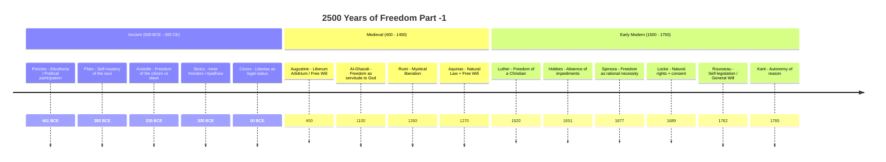

*شکل ۱ (بخش اول)–۱: خط زمانی ۲۵۰۰ ساله‌ی تحول تعبیرسازی از آزادی. هر نقطه
          نمایان‌گر لحظه‌ای کلیدی در بازتعریف مفهوم آزادی است.*


**خط زمانی تحول مفهوم آزادی از مدرن اولیه تا کنون (عصر دیجیتال)**

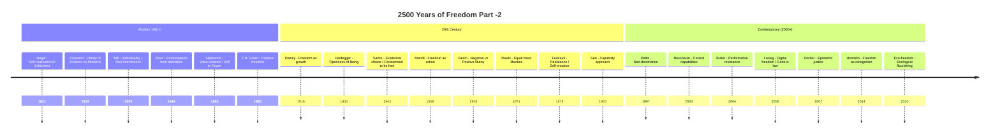

*شکل ۱ (بخش دوم) –۱: خط زمانی ۲۵۰۰ ساله‌ی تحول تعبیرسازی از آزادی. هر
          نقطه نمایان‌گر لحظه‌ای کلیدی در بازتعریف مفهوم آزادی است.*


<h3 id="sec1-2">۱.۲ نقشه‌ی مفهومی مکاتب</h3>


**نقشه‌ی ذهنی: خانواده‌های فکری تعبیرسازی از آزادی**

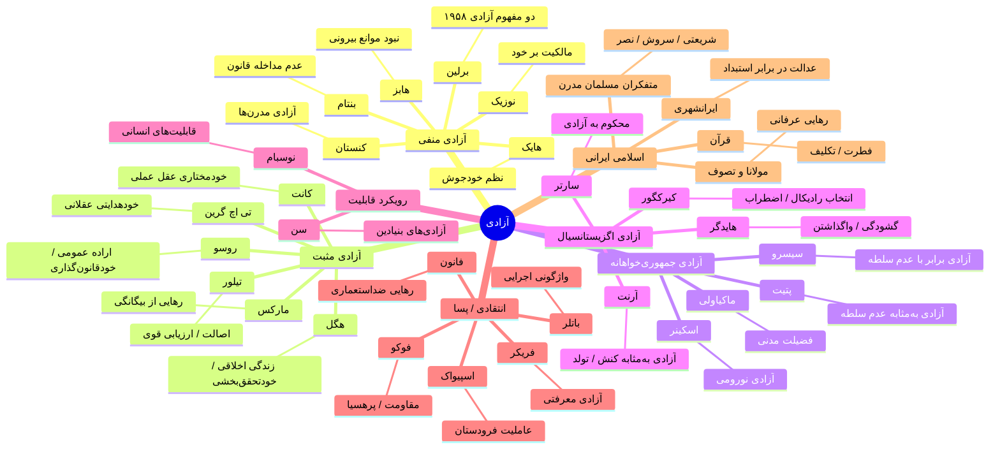

*شکل ۱–۲: نقشه‌ی ذهنی مکاتب اصلی تعبیرسازی از آزادی. هر شاخه یک
          «خانواده‌ی مفهومی» را نمایش می‌دهد.*


<h3 id="sec1-3">۱.۳ خانواده‌های مفهومی آزادی</h3>


**طبقه‌بندی خانوادگی: سه تعبیر بنیادین و شاخه‌های فرعی**

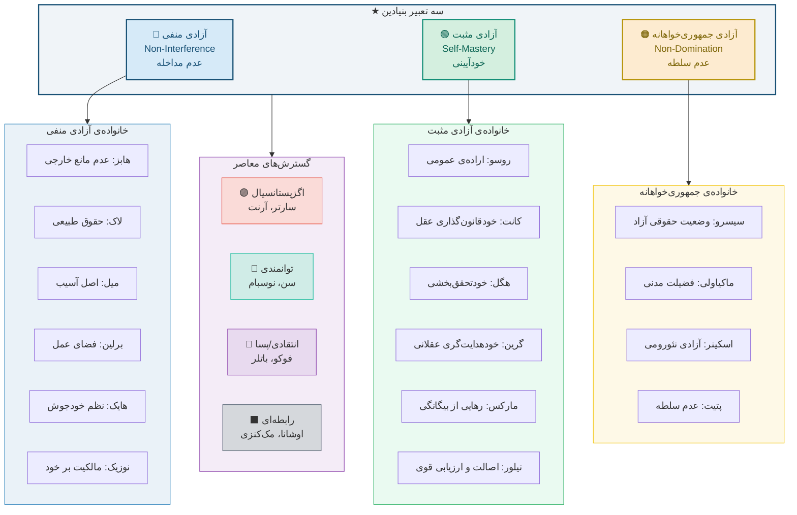

*شکل ۱–۳: طبقه‌بندی خانوادگی تعابیر آزادی. سه تعبیر بنیادین (منفی، مثبت،
          جمهوری‌خواهانه) در مرکز قرار دارند.*


<h3 id="sec1-4">۱.۴ ماتریس متفکران و ابعاد آزادی</h3>


      <div class="info-box">
        هر خانه نشان می‌دهد که آیا آن متفکر، آن بُعد از آزادی را
        <span class="badge badge-green">● پذیرفته</span>،
        <span class="badge badge-red">○ رد کرده</span>، یا
        <span class="badge badge-gold">◑ تا حدی پذیرفته</span> است.
      </div>

      <div style="overflow-x:auto;">
        <table>
 <thead> <tr> <th style="min-width:120px;">متفکر</th> <th>عدم مداخله</th> <th>خودآیینی</th> <th>عدم سلطه</th> <th>خودشکوفایی</th> <th>رهایی طبقاتی</th> <th>توانمندی</th> <th>انتخاب وجودی</th> <th>مقاومت</th> </tr> </thead>
 <tbody> <tr> <td><strong>هابز</strong></td> <td style="background:#d4efdf;text-align:center;">●</td> <td style="background:#fadbd8;text-align:center;">○</td> <td style="background:#fadbd8;text-align:center;">○</td> <td style="background:#fadbd8;text-align:center;">○</td> <td style="background:#fadbd8;text-align:center;">○</td> <td style="background:#fadbd8;text-align:center;">○</td> <td style="background:#fadbd8;text-align:center;">○</td> <td style="background:#fadbd8;text-align:center;">○</td> </tr> <tr> <td><strong>لاک</strong></td> <td style="background:#d4efdf;text-align:center;">●</td> <td style="background:#fdebd0;text-align:center;">◑</td> <td style="background:#fdebd0;text-align:center;">◑</td> <td style="background:#fadbd8;text-align:center;">○</td> <td style="background:#fadbd8;text-align:center;">○</td> <td style="background:#fadbd8;text-align:center;">○</td> <td style="background:#fadbd8;text-align:center;">○</td> <td style="background:#fdebd0;text-align:center;">◑</td> </tr> <tr> <td><strong>روسو</strong></td> <td style="background:#fadbd8;text-align:center;">○</td> <td style="background:#d4efdf;text-align:center;">●</td> <td style="background:#d4efdf;text-align:center;">●</td> <td style="background:#d4efdf;text-align:center;">●</td> <td style="background:#fdebd0;text-align:center;">◑</td> <td style="background:#fadbd8;text-align:center;">○</td> <td style="background:#fadbd8;text-align:center;">○</td> <td style="background:#fadbd8;text-align:center;">○</td> </tr> <tr> <td><strong>کانت</strong></td> <td style="background:#fdebd0;text-align:center;">◑</td> <td style="background:#d4efdf;text-align:center;">●</td> <td style="background:#fdebd0;text-align:center;">◑</td> <td style="background:#fdebd0;text-align:center;">◑</td> <td style="background:#fadbd8;text-align:center;">○</td> <td style="background:#fadbd8;text-align:center;">○</td> <td style="background:#fadbd8;text-align:center;">○</td> <td style="background:#fadbd8;text-align:center;">○</td> </tr> <tr> <td><strong>هگل</strong></td> <td style="background:#fadbd8;text-align:center;">○</td> <td style="background:#d4efdf;text-align:center;">●</td> <td style="background:#fdebd0;text-align:center;">◑</td> <td style="background:#d4efdf;text-align:center;">●</td> <td style="background:#fdebd0;text-align:center;">◑</td> <td style="background:#fadbd8;text-align:center;">○</td> <td style="background:#fadbd8;text-align:center;">○</td> <td style="background:#fadbd8;text-align:center;">○</td> </tr> <tr> <td><strong>میل</strong></td> <td style="background:#d4efdf;text-align:center;">●</td> <td style="background:#fdebd0;text-align:center;">◑</td> <td style="background:#fadbd8;text-align:center;">○</td> <td style="background:#d4efdf;text-align:center;">●</td> <td style="background:#fadbd8;text-align:center;">○</td> <td style="background:#fdebd0;text-align:center;">◑</td> <td style="background:#fadbd8;text-align:center;">○</td> <td style="background:#fadbd8;text-align:center;">○</td> </tr> <tr> <td><strong>مارکس</strong></td> <td style="background:#fadbd8;text-align:center;">○</td> <td style="background:#fdebd0;text-align:center;">◑</td> <td style="background:#d4efdf;text-align:center;">●</td> <td style="background:#d4efdf;text-align:center;">●</td> <td style="background:#d4efdf;text-align:center;">●</td> <td style="background:#fdebd0;text-align:center;">◑</td> <td style="background:#fadbd8;text-align:center;">○</td> <td style="background:#d4efdf;text-align:center;">●</td> </tr> <tr> <td><strong>سارتر</strong></td> <td style="background:#fdebd0;text-align:center;">◑</td> <td style="background:#d4efdf;text-align:center;">●</td> <td style="background:#fadbd8;text-align:center;">○</td> <td style="background:#fdebd0;text-align:center;">◑</td> <td style="background:#fdebd0;text-align:center;">◑</td> <td style="background:#fadbd8;text-align:center;">○</td> <td style="background:#d4efdf;text-align:center;">●</td> <td style="background:#d4efdf;text-align:center;">●</td> </tr> <tr> <td><strong>برلین</strong></td> <td style="background:#d4efdf;text-align:center;">●</td> <td style="background:#fadbd8;text-align:center;">○</td> <td style="background:#fdebd0;text-align:center;">◑</td> <td style="background:#fadbd8;text-align:center;">○</td> <td style="background:#fadbd8;text-align:center;">○</td> <td style="background:#fadbd8;text-align:center;">○</td> <td style="background:#fadbd8;text-align:center;">○</td> <td style="background:#fadbd8;text-align:center;">○</td> </tr> <tr> <td><strong>آرنت</strong></td> <td style="background:#fadbd8;text-align:center;">○</td> <td style="background:#fdebd0;text-align:center;">◑</td> <td style="background:#d4efdf;text-align:center;">●</td> <td style="background:#fdebd0;text-align:center;">◑</td> <td style="background:#fadbd8;text-align:center;">○</td> <td style="background:#fadbd8;text-align:center;">○</td> <td style="background:#d4efdf;text-align:center;">●</td> <td style="background:#fdebd0;text-align:center;">◑</td> </tr> <tr> <td><strong>رالز</strong></td> <td style="background:#d4efdf;text-align:center;">●</td> <td style="background:#d4efdf;text-align:center;">●</td> <td style="background:#fdebd0;text-align:center;">◑</td> <td style="background:#fdebd0;text-align:center;">◑</td> <td style="background:#fadbd8;text-align:center;">○</td> <td style="background:#fdebd0;text-align:center;">◑</td> <td style="background:#fadbd8;text-align:center;">○</td> <td style="background:#fadbd8;text-align:center;">○</td> </tr> <tr> <td><strong>سن</strong></td> <td style="background:#fdebd0;text-align:center;">◑</td> <td style="background:#d4efdf;text-align:center;">●</td> <td style="background:#d4efdf;text-align:center;">●</td> <td style="background:#d4efdf;text-align:center;">●</td> <td style="background:#fdebd0;text-align:center;">◑</td> <td style="background:#d4efdf;text-align:center;">●</td> <td style="background:#fadbd8;text-align:center;">○</td> <td style="background:#fdebd0;text-align:center;">◑</td> </tr> <tr> <td><strong>پتیت</strong></td> <td style="background:#fdebd0;text-align:center;">◑</td> <td style="background:#fdebd0;text-align:center;">◑</td> <td style="background:#d4efdf;text-align:center;">●</td> <td style="background:#fadbd8;text-align:center;">○</td> <td style="background:#fadbd8;text-align:center;">○</td> <td style="background:#fdebd0;text-align:center;">◑</td> <td style="background:#fadbd8;text-align:center;">○</td> <td style="background:#fdebd0;text-align:center;">◑</td> </tr> <tr> <td><strong>فوکو</strong></td> <td style="background:#fadbd8;text-align:center;">○</td> <td style="background:#fdebd0;text-align:center;">◑</td> <td style="background:#d4efdf;text-align:center;">●</td> <td style="background:#fdebd0;text-align:center;">◑</td> <td style="background:#fdebd0;text-align:center;">◑</td> <td style="background:#fadbd8;text-align:center;">○</td> <td style="background:#fdebd0;text-align:center;">◑</td> <td style="background:#d4efdf;text-align:center;">●</td> </tr> </tbody>
        </table>
      </div>

      <div class="info-box warning">
        <strong>💡 کلید خوانش ماتریس:</strong>
        ستون‌ها ابعاد هشت‌گانه‌ی آزادی هستند؛ سطرها متفکران اصلی.
        این ماتریس یک «عکس فوری» از موضع هر متفکر است و لزوماً پیچیدگی‌های نظریه‌ی او را بازنمی‌تاباند.
        در <a href="#sec4">بخش چهارم</a> هر موضع به تفصیل واکاوی خواهد شد.
      </div>


<h3 id="sec1-5">۱.۵ نقشه‌ی دشمنان مفهومی آزادی</h3>


 <p> هر تعبیر از آزادی در تقابل با یک «دشمن مفهومی» شکل گرفته است. نقشه‌ی زیر نشان می‌دهد که هر تعبیر چه چیزی را <em>نفی</em> می‌کند. </p>


**نقشه‌ی دشمنان مفهومی: هر تعبیر آزادی چه چیزی را نفی می‌کند؟**

```mermaid
flowchart TB
    subgraph FREEDOM["💚 تعابیر آزادی"]
        F1["عدم مداخله<br/>(هابز، میل، برلین)"]
        F2["خودآیینی<br/>(کانت، روسو)"]
        F3["عدم سلطه<br/>(پتیت، اسکینر)"]
        F4["رهایی طبقاتی<br/>(مارکس)"]
        F5["انتخاب وجودی<br/>(سارتر)"]
        F6["توانمندی<br/>(سن، نوسبام)"]
        F7["مقاومت<br/>(فوکو، باتلر)"]
        F8["کنش سیاسی<br/>(آرنت)"]
        F9["شناسایی<br/>(تیلور، هونت)"]
    end

    subgraph ENEMIES["🔴 دشمنان مفهومی"]
        E1["⛔ مداخله / اجبار<br/>Coercion"]
        E2["⛔ هترونومی / تابعیت<br/>Heteronomy"]
        E3["⛔ سلطه / اقتدار خودسرانه<br/>Domination"]
        E4["⛔ از خودبیگانگی / استثمار<br/>Alienation"]
        E5["⛔ بدایمانی / خودفریبی<br/>Bad Faith"]
        E6["⛔ محرومیت / ناتوانی<br/>Deprivation"]
        E7["⛔ انقیاد / هنجارسازی<br/>Subjection"]
        E8["⛔ بی‌جهانی / انزوا<br/>Worldlessness"]
        E9["⛔ تحقیر / نادیده‌انگاری<br/>Misrecognition"]
    end

    F1 ---|"نفی"| E1
    F2 ---|"نفی"| E2
    F3 ---|"نفی"| E3
    F4 ---|"نفی"| E4
    F5 ---|"نفی"| E5
    F6 ---|"نفی"| E6
    F7 ---|"نفی"| E7
    F8 ---|"نفی"| E8
    F9 ---|"نفی"| E9

    style FREEDOM fill:#eaf2f8,stroke:#2980b9,stroke-width:2px
    style ENEMIES fill:#fdedec,stroke:#e74c3c,stroke-width:2px
    style F1 fill:#d6eaf8,stroke:#2980b9,color:#1a5276
    style F2 fill:#d4efdf,stroke:#27ae60,color:#0e6655
    style F3 fill:#fdebd0,stroke:#f39c12,color:#7d6608
    style F4 fill:#fadbd8,stroke:#e74c3c,color:#922b21
    style F5 fill:#e8daef,stroke:#8e44ad,color:#6c3483
    style F6 fill:#d0ece7,stroke:#1abc9c,color:#0e6655
    style F7 fill:#f5eef8,stroke:#9b59b6,color:#6c3483
    style F8 fill:#fef9e7,stroke:#f1c40f,color:#7d6608
    style F9 fill:#ebf5fb,stroke:#3498db,color:#1a5276
    style E1 fill:#f9ebea,stroke:#cb4335,color:#922b21
    style E2 fill:#f9ebea,stroke:#cb4335,color:#922b21
    style E3 fill:#f9ebea,stroke:#cb4335,color:#922b21
    style E4 fill:#f9ebea,stroke:#cb4335,color:#922b21
    style E5 fill:#f9ebea,stroke:#cb4335,color:#922b21
    style E6 fill:#f9ebea,stroke:#cb4335,color:#922b21
    style E7 fill:#f9ebea,stroke:#cb4335,color:#922b21
    style E8 fill:#f9ebea,stroke:#cb4335,color:#922b21
    style E9 fill:#f9ebea,stroke:#cb4335,color:#922b21
```

*شکل ۱–۵: هر تعبیر از آزادی، «دشمن» خاص خود را دارد. شناخت این
          دشمنان برای فهم دقیق هر نظریه ضروری است.*


      <div class="card right">

#### 🔍 نکته‌ی تحلیلی: چرا «دشمن» مهم است؟

 <p> جرالد مک‌کالوم (Gerald MacCallum) در مقاله‌ی مشهور خود (۱۹۶۷) نشان داد که هر گزاره درباره‌ی آزادی دارای ساختار سه‌گانه است: <strong>X از Y آزاد است تا Z را انجام دهد</strong> — یعنی فاعل (X)، مانع (Y)، و هدف (Z). تفاوت نظریه‌ها در این است که Y و Z را چگونه تعریف می‌کنند. </p>
 <p style="font-size:.85rem;color:var(--clr-muted);"> 📚 MacCallum, G. (1967). "Negative and Positive Freedom." <em>Philosophical Review</em>, 76(3), 312–334. </p>
      </div>

    </section>


    <section id="sec2">

## ۲. هفت موج تحول در مفهوم آزادی


      <div class="info-box">
        <strong>🌊 روش‌شناسی «موج»:</strong>
        تاریخ تعبیرسازی از آزادی را به هفت «موج» تقسیم می‌کنیم.
        هر موج در پاسخ به <em>بحرانی تاریخی</em> و در <em>جدالی فکری</em> شکل گرفته
        و <em>نتایج نهادی</em> مشخصی داشته است:
        <strong>زمینه‌ها → نظریه → نتایج → نقد</strong>.
      </div>


**نمای کلی: هفت موج و جریان تحول**

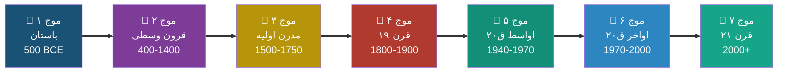


**نمودار هفت موج تحول مفهوم آزادی**

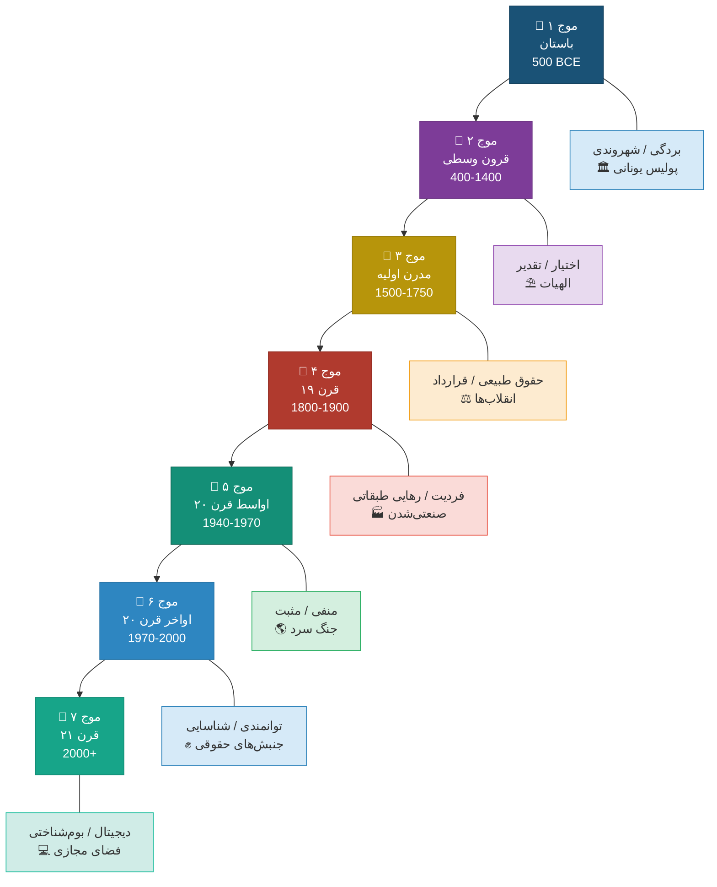

*شکل ۲–۱: (با تفصیل) هفت موج تحول مفهوم آزادی و زمینه‌های تاریخی هر موج*


      <div class="card" id="wave1" style="border-right-color:#1a5276;">


### موج اول: از بردگی تا شهروندی یونان و روم باستان • ۵۰۰ ق.م–۳۰۰ م


#### 📌 زمینه‌ی تاریخی

 <p> در یونان باستان، آزادی (<em>eleutheria</em>) پیش از آنکه مفهومی فلسفی باشد، <strong>وضعیتی اجتماعی–حقوقی</strong> بود: آزاد کسی بود که برده نبود. جنگ‌های ایران و یونان (۴۹۰–۴۷۹ ق.م) نخستین بار تمایز «آزاد/بنده» را به سطح گفتمان سیاسی آورد. هرودوت یونانیان را «آزاد» و ایرانیان را «بندگان شاه» خواند—تقابلی که بیش از واقعیت، ابزار هویت‌سازی بود (ر.ک. <a href="#appA">پیوست الف</a> برای نقد این روایت از منظر ایرانشهری). </p>


#### 📚 نظریه‌ها

        <table>
 <thead> <tr> <th>متفکر</th> <th>تعبیر آزادی</th> <th>اثر کلیدی</th> <th>گزاره‌ی محوری</th> </tr> </thead>
 <tbody> <tr> <td>ارسطو</td> <td>مشارکت سیاسی</td> <td><em>سیاست</em></td> <td>آزادی = به‌نوبت فرمان‌دادن و فرمان‌بردن (۱۳۱۷a)</td> </tr> <tr> <td>افلاطون</td> <td>خودبسندگی نفس</td> <td><em>جمهور</em> کتاب ۴</td> <td>آزادی = حکومت عقل بر شهوت و غضب</td> </tr> <tr> <td>اپیکتتوس</td> <td>آزادی درونی</td> <td><em>گفتارها</em></td> <td>آزاد کسی است که فقط به آنچه در اختیار اوست بیندیشد</td> </tr> <tr> <td>سیسرو</td> <td>وضعیت حقوقی</td> <td><em>درباره‌ی جمهوری</em></td> <td>Libertas = عدم وابستگی به اراده‌ی خودسرانه‌ی دیگری</td> </tr> </tbody>
        </table>


#### ⛔ دشمن مفهومی

 <p><span class="badge badge-red">بردگی (douleia)</span> <span class="badge badge-red">استبداد (tyrannis)</span> <span class="badge badge-red">بربریت</span></p>


#### 📈 نتایج و نقد

        <div class="card primary">
          <strong>نتایج نهادی:</strong> دموکراسی آتنی، جمهوری روم، حقوق شهروندی.<br/>
          <strong>نقد اصلی:</strong> آزادی یونانی <em>انحصاری</em> بود—بردگان، زنان، و بیگانگان محروم بودند.
          آزادی رواقی جهان‌شمول بود ولی با <em>پذیرش وضع موجود</em> و کناره‌گیری از سیاست همراه بود.
        </div>
      </div>


      <div class="card" id="wave2" style="border-right-color:#7d3c98;">


### موج دوم: اختیار و اراده قرون وسطی • ۴۰۰–۱۴۰۰ م


#### 📌 زمینه‌ی تاریخی

 <p> با ظهور مسیحیت و اسلام، پرسش از آزادی از حوزه‌ی <em>سیاسی</em> به حوزه‌ی <strong>الهیاتی و متافیزیکی</strong> منتقل شد. مسئله‌ی محوری این بود: اگر خداوند عالِم مطلق و قادر مطلق است، انسان چگونه می‌تواند <em>مختار</em> باشد؟ این پرسش در مسیحیت به مسئله‌ی <em>liberum arbitrium</em> (اختیار آزاد) و در اسلام به جدال <em>جبر و اختیار</em> (قدریه، جبریه، اشاعره، معتزله) انجامید. </p>


#### 📚 نظریه‌ها

        <table>
 <thead> <tr> <th>متفکر</th> <th>سنت</th> <th>تعبیر آزادی</th> <th>گزاره‌ی محوری</th> </tr> </thead>
 <tbody> <tr> <td>آگوستین</td> <td>مسیحی</td> <td>اختیار آزاد</td> <td>اراده آزاد است ولی به‌دلیل گناه اولیه به سوی شر تمایل دارد؛ نجات فقط با فیض الهی ممکن است</td> </tr> <tr> <td>آکویناس</td> <td>مسیحی</td> <td>قانون طبیعی + اختیار</td> <td>عقل انسان قادر به کشف قانون طبیعی است؛ آزادی = انتخاب مطابق عقل و قانون الهی</td> </tr> <tr> <td>معتزله</td> <td>اسلامی</td> <td>عدل و اختیار</td> <td>انسان خالق افعال خویش است؛ بدون اختیار، عدالت الهی بی‌معنا می‌شود</td> </tr> <tr> <td>اشاعره</td> <td>اسلامی</td> <td>کسب</td> <td>خداوند خالق فعل است؛ انسان «کاسب» فعل است (نظریه‌ی کسب)</td> </tr> <tr> <td>غزالی</td> <td>اسلامی–عرفانی</td> <td>آزادی = بندگی خدا</td> <td>آزادی حقیقی رهایی از بندگی نَفس و سلوک به‌سوی خداست</td> </tr> <tr> <td>مولانا</td> <td>عرفان اسلامی</td> <td>رهایی روح</td> <td>«من بنده‌ی آنم که آزادی دهد»—رهایی در فنای فی‌الله</td> </tr> </tbody>
        </table>


#### ⛔ دشمن مفهومی

 <p> <span class="badge badge-red">جبر (determinism)</span> <span class="badge badge-red">گناه / نَفس</span> <span class="badge badge-red">جهل و غفلت</span> </p>


#### 📈 نتایج و نقد

        <div class="card primary">
          <strong>نتایج:</strong> مفهوم <em>وجدان آزاد</em> (آزادی درونی ایمان)،
          زمینه‌سازی برای «آزادی وجدان» دوره‌ی مدرن، عرفان به‌مثابه تجربه‌ی رهایی.<br/>
          <strong>نقد:</strong> آزادی به حوزه‌ی <em>درونی/متافیزیکی</em> محدود ماند.
          نظام‌های سیاسی قرون‌وسطایی (فئودالیسم، خلافت) به‌ندرت آزادی سیاسی فراهم می‌کردند.
          عرفان با همه‌ی زیبایی‌اش، گاه به <strong>بی‌اعتنایی به ستم سیاسی</strong> منجر شد.
        </div>
      </div>


      <div class="card" id="wave3" style="border-right-color:#b7950b;">


### موج سوم: حقوق طبیعی و قرارداد اجتماعی مدرن اولیه • ۱۵۰۰–۱۷۸۹


#### 📌 زمینه‌ی تاریخی

 <p> اصلاحات دینی (لوتر، ۱۵۱۷)، جنگ‌های مذهبی اروپا، انقلاب باشکوه انگلستان (۱۶۸۸)، و عصر روشنگری بستر تحول بزرگی شدند. پرسش محوری این بود: <strong>مشروعیت حکومت از کجا می‌آید؟</strong> و <strong>حدود اقتدار دولت بر فرد کجاست؟</strong> آزادی از حوزه‌ی الهیات به حوزه‌ی <em>حقوق طبیعی و فلسفه‌ی سیاسی</em> بازگشت. </p>


#### 📚 نظریه‌ها

        <table>
 <thead> <tr> <th>متفکر</th> <th>تعبیر آزادی</th> <th>اثر کلیدی</th> <th>گزاره‌ی محوری</th> </tr> </thead>
 <tbody> <tr> <td>هابز (۱۶۵۱)</td> <td>عدم مانع خارجی</td> <td><em>لویاتان</em></td> <td>آزادی = نبودِ موانع بیرونیِ حرکت. در وضع طبیعی آزادی مطلق ولی ناامن است.</td> </tr> <tr> <td>لاک (۱۶۸۹)</td> <td>حقوق طبیعی + رضایت</td> <td><em>دو رساله در حکومت</em></td> <td>آزادی = عدم تابعیتِ اراده‌ی خودسرانه‌ی دیگری + حقوق زندگی، آزادی، و مالکیت</td> </tr> <tr> <td>اسپینوزا (۱۶۷۷)</td> <td>آزادی عقلانی</td> <td><em>اخلاق</em></td> <td>آزاد کسی است که فقط از ضرورت طبیعت خود عمل کند = شناخت عقلانی</td> </tr> <tr> <td>روسو (۱۷۶۲)</td> <td>خودقانون‌گذاری</td> <td><em>قرارداد اجتماعی</em></td> <td>«اطاعت از قانونی که خود وضع کرده‌ای، آزادی است»</td> </tr> <tr> <td>کانت (۱۷۸۵)</td> <td>خودآیینی عقل</td> <td><em>بنیاد مابعدالطبیعه‌ی اخلاق</em></td> <td>آزادی = عمل بر طبق قانونی که عقل عملی خودْ وضع می‌کند (خودآیینی)</td> </tr> </tbody>
        </table>


**جریان تأثیر و تأثر در موج سوم**

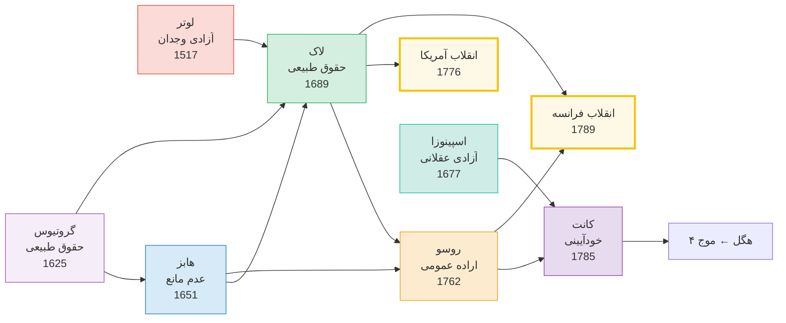

*شکل ۲–۲: شبکه‌ی تأثیر و تأثر متفکران موج سوم و پیوند آن‌ها با انقلاب‌های
            بزرگ*


#### ⛔ دشمن مفهومی

 <p> <span class="badge badge-red">استبداد مطلقه (absolutism)</span> <span class="badge badge-red">تعصب مذهبی (intolerance)</span> <span class="badge badge-red">اقتدار خودسرانه (arbitrary power)</span> </p>


#### 📈 نتایج و نقد

        <div class="card gold">
          <strong>نتایج نهادی:</strong> اعلامیه‌ی حقوق ویرجینیا (۱۷۷۶)، اعلامیه‌ی حقوق بشر و شهروند فرانسه (۱۷۸۹)، قانون
          اساسی آمریکا (Bill of Rights, ۱۷۹۱).<br/>
          <strong>تنش درونی:</strong> تقابل هابز (آزادی = عدم مانع، سازگار با دولت قوی) و لاک (آزادی = محدودیت دولت)
          هسته‌ی جدال لیبرالیسم و اقتدارگرایی شد.<br/>
          <strong>نقد:</strong> روسو و کانت آزادی را «اخلاقی» کردند و راه را برای سوءاستفاده‌ی احتمالی باز
          کردند: اگر «آزادی واقعی = اطاعت از اراده‌ی عمومی»، می‌توان کسی را «مجبور به آزاد بودن»
          کرد — هشداری که برلین دو قرن بعد جدی گرفت.
        </div>
      </div>


      <div class="card" id="wave4" style="border-right-color:#b03a2e;">


### موج چهارم: فردیت و رهایی قرن نوزدهم • ۱۸۰۰–۱۹۰۰


#### 📌 زمینه‌ی تاریخی

 <p> انقلاب صنعتی، ظهور طبقه‌ی کارگر، شهرنشینی انبوه، و استعمار اروپایی بافت جدیدی به مسئله‌ی آزادی بخشید. از یک سو، <strong>لیبرال‌ها</strong> (میل، کنستان، توکویل) نگران سلطه‌ی اکثریت و دولت بر فرد بودند؛ از سوی دیگر، <strong>سوسیالیست‌ها</strong> (مارکس، انگلس) آزادی صوری لیبرالی را «بورژوایی» و فریبکارانه می‌دانستند. بنیامین کنستان (۱۸۱۹) نخستین بار تمایز «آزادی قدما» (مشارکت سیاسی) و «آزادی متأخران» (عدم مداخله) را صورت‌بندی کرد. </p>


#### 📚 نظریه‌ها

        <table>
 <thead> <tr> <th>متفکر</th> <th>تعبیر</th> <th>اثر</th> <th>گزاره‌ی محوری</th> </tr> </thead>
 <tbody> <tr> <td>کنستان (۱۸۱۹)</td> <td>آزادی متأخران</td> <td><em>درباره آزادی قدما و متأخران</em></td> <td>آزادی مدرن = بهره‌مندی آرام از استقلال خصوصی، نه مشارکت مستقیم</td> </tr> <tr> <td>هگل (۱۸۲۱)</td> <td>خودتحقق‌بخشی</td> <td><em>فلسفه‌ی حق</em></td> <td>آزادی نه در انزوا بلکه در نهادهای اخلاقی (خانواده، جامعه مدنی، دولت) محقق می‌شود</td> </tr> <tr> <td>میل (۱۸۵۹)</td> <td>فردیت + عدم آسیب</td> <td><em>درباره‌ی آزادی</em></td> <td>تنها دلیل مشروع برای محدود کردن آزادی فرد، جلوگیری از آسیب به دیگران است</td> </tr> <tr> <td>مارکس (۱۸۴۴)</td> <td>رهایی از بیگانگی</td> <td><em>دست‌نوشته‌های اقتصادی-فلسفی</em></td> <td>آزادی بورژوایی صوری است؛ آزادی واقعی = رهایی از استثمار و ازخودبیگانگی</td> </tr> <tr> <td>نیچه (۱۸۸۶)</td> <td>خلق ارزش</td> <td><em>فراسوی نیک و بد</em></td> <td>آزادی = قدرت خلق ارزش‌های نو؛ «آزاد برای چه؟» مهم‌تر از «آزاد از چه؟»</td> </tr> <tr> <td>گرین (۱۸۸۶)</td> <td>آزادی مثبت</td> <td><em>سخنرانی درباره مبانی تعهد سیاسی</em></td> <td>آزادی = توانایی واقعی برای انجام آنچه ارزش انجام دادن دارد</td> </tr> </tbody>
        </table>


**دوگانه‌ی بزرگ قرن نوزدهم: فرد در برابر ساختار**

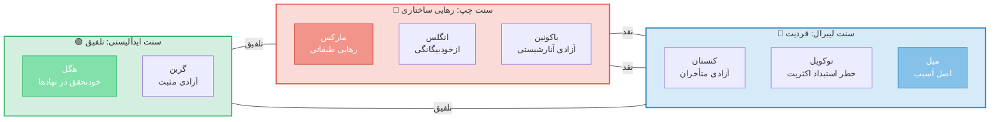

*شکل ۲–۳: تقابل بنیادین قرن نوزدهم: آزادی فردی (لیبرال) در مقابل رهایی
            ساختاری (چپ) و تلاش ایدآلیست‌ها برای تلفیق*


#### ⛔ دشمن مفهومی

 <p> <span class="badge badge-red">استبداد اکثریت (tyranny of majority)</span> <span class="badge badge-red">استثمار (exploitation)</span> <span class="badge badge-red">ازخودبیگانگی (alienation)</span> <span class="badge badge-red">یکسان‌سازی (conformity)</span> </p>


#### 📈 نتایج و نقد

        <div class="card right">
          <strong>نتایج:</strong> حق رأی عمومی (تدریجی)، قانون‌گذاری کار، نهضت‌های کارگری، لغو برده‌داری.<br/>
          <strong>تنش پایدار:</strong> آیا آزادیِ واقعی، <em>عدم مداخله</em> است (میل) یا <em>شرایط مادی رشد</em>
          (مارکس، گرین)؟ این تنش تا امروز ادامه دارد.<br/>
          <strong>نقد مارکس به لیبرال‌ها:</strong> «آزادی بورژوایی = آزادیِ مالکیت خصوصی = آزادیِ
          استثمار.»<br/>
          <strong>نقد میل به اکثریت‌گرایان:</strong> «استبداد اجتماعی ممکن است از استبداد سیاسی هم خطرناک‌تر
          باشد.»
        </div>
      </div>


      <div class="card" id="wave5" style="border-right-color:#148f77;">


### موج پنجم: آزادی منفی در برابر مثبت اواسط قرن بیستم • ۱۹۴۰–۱۹۷۰


#### 📌 زمینه‌ی تاریخی

 <p> جنگ جهانی دوم، ظهور توتالیتاریسم (فاشیسم و استالینیسم)، و آغاز جنگ سرد بحران عمیقی در اندیشه‌ی آزادی ایجاد کرد. چگونه ایدئولوژی‌هایی که مدعی «آزادی واقعی» بودند (مارکسیسم-لنینیسم، فاشیسم)، به بدترین اشکال بردگی انجامیدند؟ <strong>آیزایا برلین</strong> در سخنرانی مشهور خود (۱۹۵۸) پاسخی تأثیرگذار داد. </p>


#### 📚 نظریه‌ها

        <table>
 <thead> <tr> <th>متفکر</th> <th>تعبیر</th> <th>اثر</th> <th>گزاره‌ی محوری</th> </tr> </thead>
 <tbody> <tr> <td>برلین (۱۹۵۸)</td> <td>منفی vs مثبت</td> <td><em>دو مفهوم آزادی</em></td> <td>آزادی منفی = «آزادی از» مداخله؛ مثبت = «آزادی برای» خودحکمرانی. مثبت مستعد سوءاستفاده‌ی توتالیتر.</td> </tr> <tr> <td>سارتر (۱۹۴۳)</td> <td>انتخاب وجودی</td> <td><em>هستی و نیستی</em></td> <td>«انسان محکوم به آزادی است»—آزادی ذات آگاهی است، نه حقی اعطاشده.</td> </tr> <tr> <td>آرنت (۱۹۵۸/۱۹۶۱)</td> <td>کنش سیاسی</td> <td><em>وضع بشر</em> / <em>میان گذشته و آینده</em></td> <td>آزادی نه در فکر بلکه در <em>کنش</em> با دیگران در فضای عمومی تحقق می‌یابد.</td> </tr> <tr> <td>هایک (۱۹۶۰)</td> <td>عدم اجبار</td> <td><em>قانون اساسی آزادی</em></td> <td>آزادی = وضعیتی که شخص تابع اجبار خودسرانه‌ی دیگری نباشد.</td> </tr> <tr> <td>مک‌کالوم (۱۹۶۷)</td> <td>ساختار سه‌گانه</td> <td>مقاله‌ی <em>Negative and Positive Freedom</em></td> <td>تمایز منفی/مثبت کاذب است: هر آزادی دارای X (فاعل)، Y (مانع)، Z (هدف) است.</td> </tr> </tbody>
        </table>


**دوگانه‌ی برلین و واکنش‌ها**

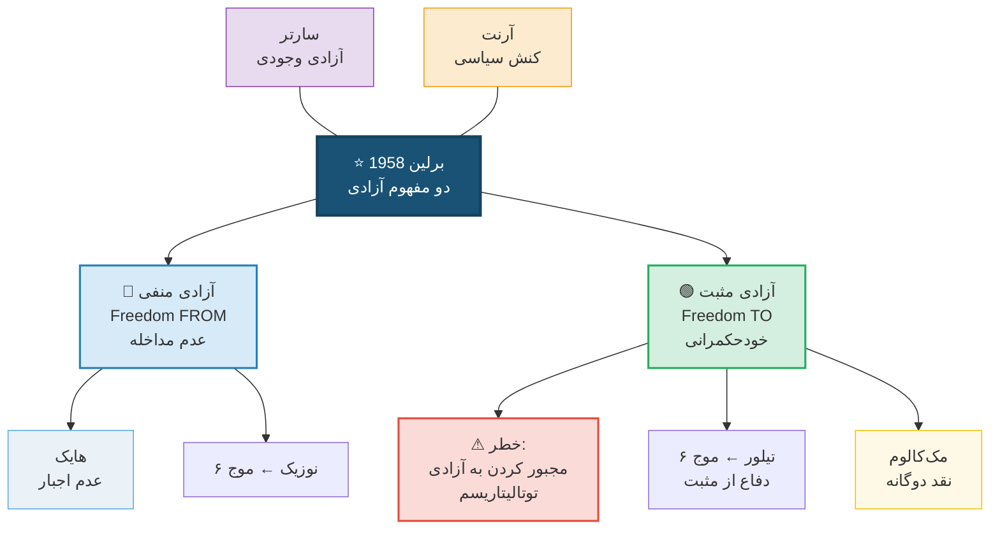

*شکل ۲–۴: تمایز برلین بین آزادی منفی و مثبت و شبکه‌ی واکنش‌ها*


#### ⛔ دشمن مفهومی

 <p> <span class="badge badge-red">توتالیتاریسم</span> <span class="badge badge-red">پدرسالاری دولتی (paternalism)</span> <span class="badge badge-red">ایدئولوژی مطلق‌انگار</span> <span class="badge badge-red">بدایمانی (bad faith)</span> </p>


#### 📈 نتایج و نقد

        <div class="card accent">
          <strong>تأثیر عظیم:</strong> تمایز برلین به «ابزار استاندارد» فلسفه‌ی سیاسی تبدیل شد و تا دهه‌ها
          بحث‌ها را قالب‌بندی کرد.<br/>
          <strong>نقدها:</strong>
          (۱) مک‌کالوم: تمایز منفی/مثبت یک طیف است، نه دوگانه؛
          (۲) تیلور: آزادی منفی نمی‌تواند ارزش‌ها را تبیین کند (مقاله‌ی «?What's Wrong with Negative
          Liberty»، ۱۹۷۹)؛
          (۳) سنت جمهوری‌خواهانه (پتیت، اسکینر): برلین «سومین مفهوم» (عدم سلطه) را نادیده گرفته.
        </div>
      </div>


      <div class="card" id="wave6" style="border-right-color:#2e86c1;">


### موج ششم: توانمندی، شناسایی، عدم سلطه اواخر قرن بیستم • ۱۹۷۰–۲۰۰۰


#### 📌 زمینه‌ی تاریخی

 <p> جنبش‌های حقوق مدنی، فمینیسم، ضداستعمار، و فروپاشی شوروی نشان دادند که نه «عدم مداخله» و نه «خودحکمرانی» به‌تنهایی کافی نیست. گروه‌هایی که رسماً آزاد بودند، عملاً از <em>سلطه</em>، <em>تحقیر</em>، و <em>محرومیت از توانمندی‌ها</em> رنج می‌بردند. سه رویکرد جدید ظاهر شد. </p>


#### 📚 سه شاخه‌ی نوظهور


        <div class="card primary">

#### الف) آزادی جمهوری‌خواهانه: عدم سلطه (Pettit, Skinner)

 <p> <strong>فیلیپ پتیت</strong> (<em>Republicanism</em>, 1997) استدلال کرد که آزادی نه عدم مداخله بلکه <strong>عدم سلطه</strong> (non-domination) است: وضعیتی که هیچ‌کس قدرت مداخله‌ی خودسرانه در زندگی شما را نداشته باشد، حتی اگر واقعاً مداخله نکند. تمایز کلیدی: <em>بنده‌ی اربابِ مهربان هم آزاد نیست</em>، زیرا ارباب <em>قدرت</em> مداخله را دارد. </p>
        </div>

        <div class="card accent">

#### ب) رویکرد توانمندی (Sen, Nussbaum)

 <p> <strong>آمارتیا سن</strong> (<em>Development as Freedom</em>, 1999) آزادی را <strong>مجموعه‌ی توانمندی‌های واقعی</strong> (substantive freedoms) تعریف کرد: آنچه یک شخص واقعاً <em>قادر به انجام و بودنش</em> است. فقر، بیماری، و بی‌سوادی حتی بدون مداخله‌ی فعال، آزادی را سلب می‌کنند. <strong>مارتا نوسبام</strong> فهرستی از ده توانمندی محوری پیشنهاد کرد. </p>
        </div>

        <div class="card gold">

#### ج) آزادی به‌مثابه شناسایی (Taylor, Honneth)

 <p> <strong>چارلز تیلور</strong> (<em>Sources of the Self</em>, 1989) و <strong>اکسل هونت</strong> (<em>The Struggle for Recognition</em>, 1995) نشان دادند که آزادی مستلزم <em>شناسایی</em> (recognition) اجتماعی است. کسی که از نظر فرهنگی نادیده انگاشته یا تحقیر شود، حتی با حقوق صوری برابر، آزاد نیست. </p>
        </div>


**سه شاخه‌ی نوظهور و نسبت آن‌ها با دوگانه‌ی برلین**

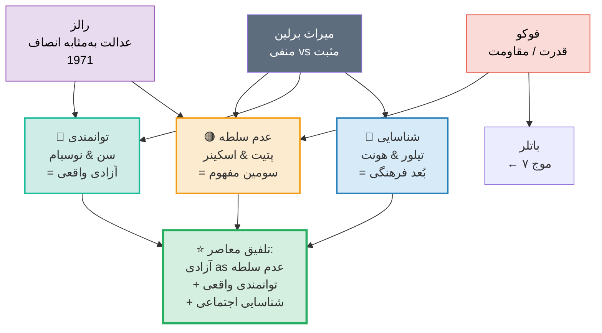

*شکل ۲–۵: سه رویکرد نوظهور و مسیر به‌سوی تلفیق معاصر*


#### ⛔ دشمن مفهومی

 <p> <span class="badge badge-red">سلطه (domination)</span> <span class="badge badge-red">محرومیت (deprivation)</span> <span class="badge badge-red">تحقیر / نادیده‌انگاری (misrecognition)</span> <span class="badge badge-red">ظلم ساختاری (structural injustice)</span> </p>
      </div>


      <div class="card" id="wave7" style="border-right-color:#17a589;">


### موج هفتم: دیجیتال، بوم‌شناختی، پسااستعماری قرن بیست‌ویکم • ۲۰۰۰+


#### 📌 زمینه‌ی تاریخی

 <p> اینترنت، هوش مصنوعی، بحران آب‌وهوا، جنبش‌های #MeToo و Black Lives Matter، و افول هژمونی غربی چشم‌اندازهای تازه‌ای گشوده‌اند. آزادی اکنون باید در قلمرو <em>دیجیتال</em>، <em>بوم‌شناختی</em>، و <em>پسااستعماری</em> نیز بازاندیشی شود. </p>


#### 📚 مسائل نوظهور

        <table>
 <thead> <tr> <th>حوزه</th> <th>متفکر/جنبش</th> <th>مسئله</th> <th>تعبیر آزادی</th> </tr> </thead>
 <tbody> <tr> <td>دیجیتال</td> <td>لسیگ، بنکلر، زوبوف</td> <td>نظارت فراگیر، الگوریتم‌ها</td> <td>آزادی = عدم کنترل الگوریتمی + حاکمیت بر داده‌ی شخصی</td> </tr> <tr> <td>بوم‌شناختی</td> <td>نظریه‌ی سبز، نِس</td> <td>بحران آب‌وهوا</td> <td>آزادی بشر بدون آزادی بوم‌شناختی (شکوفایی طبیعت) پایدار نیست</td> </tr> <tr> <td>پسااستعماری</td> <td>فانون، اسپیواک، مبمبه</td> <td>میراث استعمار</td> <td>آزادی = رهایی از ساختارهای استعماری ذهنی و مادی</td> </tr> <tr> <td>اپیستمیک</td> <td>فریکر</td> <td>بی‌عدالتی شناختی</td> <td>آزادی = توانایی شنیده‌شدن و تولید دانش</td> </tr> <tr> <td>رابطه‌ای</td> <td>اوشانا، مک‌کنزی</td> <td>خودآیینی در بافت اجتماعی</td> <td>آزادی فردی فقط در <em>روابط</em> مناسب ممکن است</td> </tr> </tbody>
        </table>


#### ⛔ دشمن مفهومی

 <p> <span class="badge badge-red">نظارت الگوریتمی (surveillance capitalism)</span> <span class="badge badge-red">بحران آب‌وهوا</span> <span class="badge badge-red">نواستعمار</span> <span class="badge badge-red">بی‌عدالتی شناختی (epistemic injustice)</span> <span class="badge badge-red">اتمیزه‌شدن اجتماعی</span> </p>


**پنج مرز نوظهور آزادی در قرن ۲۱**

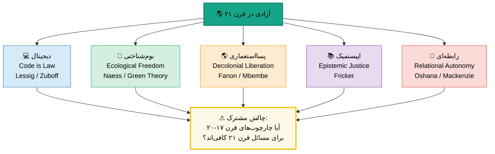

*شکل ۲–۶: پنج مرز نوظهور بازاندیشی آزادی و پرسش مشترک: آیا چارچوب‌های موجود
            کفایت می‌کنند؟*

      </div>


### جدول تطبیقی هفت موج

      <div style="overflow-x:auto;">
        <table>
 <thead> <tr> <th>موج</th> <th>دوره</th> <th>پرسش محوری</th> <th>تعبیر غالب</th> <th>دشمن اصلی</th> <th>نتیجه‌ی نهادی</th> </tr> </thead>
 <tbody> <tr style="border-right:4px solid #1a5276;"> <td><strong>۱</strong></td> <td>باستان</td> <td>چه کسی آزاد است؟</td> <td>عدم بردگی + مشارکت</td> <td>بردگی</td> <td>دموکراسی آتن</td> </tr> <tr style="border-right:4px solid #7d3c98;"> <td><strong>۲</strong></td> <td>قرون وسطی</td> <td>اراده آزاد است؟</td> <td>اختیار الهی</td> <td>جبر / گناه</td> <td>الهیات اختیار</td> </tr> <tr style="border-right:4px solid #b7950b;"> <td><strong>۳</strong></td> <td>مدرن اولیه</td> <td>حد دولت کجاست؟</td> <td>حقوق طبیعی + رضایت</td> <td>استبداد مطلقه</td> <td>انقلاب‌ها و قوانین</td> </tr> <tr style="border-right:4px solid #b03a2e;"> <td><strong>۴</strong></td> <td>قرن ۱۹</td> <td>آزادی صوری یا واقعی؟</td> <td>فردیت / رهایی طبقاتی</td> <td>استثمار + یکسان‌سازی</td> <td>جنبش‌های کارگری</td> </tr> <tr style="border-right:4px solid #148f77;"> <td><strong>۵</strong></td> <td>اواسط ق۲۰</td> <td>منفی یا مثبت؟</td> <td>منفی vs مثبت</td> <td>توتالیتاریسم</td> <td>حقوق بشر جهانی</td> </tr> <tr style="border-right:4px solid #2e86c1;"> <td><strong>۶</strong></td> <td>اواخر ق۲۰</td> <td>عدم مداخله کافی است؟</td> <td>عدم سلطه + توانمندی</td> <td>سلطه ساختاری</td> <td>توسعه‌ی انسانی</td> </tr> <tr style="border-right:4px solid #17a589;"> <td><strong>۷</strong></td> <td>قرن ۲۱</td> <td>آزادی در عصر دیجیتال؟</td> <td>دیجیتال + بوم‌شناختی</td> <td>نظارت الگوریتمی</td> <td>GDPR و جنبش‌ها</td> </tr> </tbody>
        </table>
      </div>

    </section>


    <section id="sec3">

## ۳. آزادی در میان مکاتب و سنت‌های فکری


      <div class="info-box">
        <strong>🏹 هدف این بخش:</strong>
        مفهوم آزادی فقط در آثار فیلسوفان نیست؛ در <em>جدال میان مکاتب سیاسی</em> شکل عملی
        می‌گیرد. راست، چپ، و میانه هر یک تعبیر متفاوتی دارند—و هر یک دیگری را متهم
        به «دشمنی با آزادی واقعی» می‌کنند.
      </div>


**طیف سیاسی و تعبیرهای رقیب آزادی**

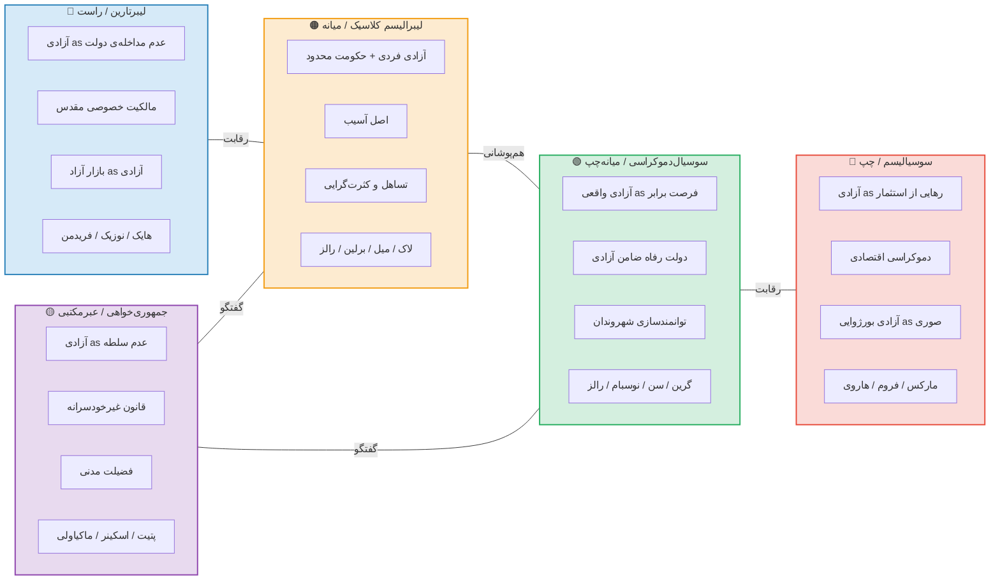

*شکل ۳–۱: پنج موضع سیاسی اصلی و تعبیر هر یک از آزادی*


<h3 id="right-section">۳.۱ راست: آزادی محافظه‌کارانه و لیبرتارین</h3>


      <div class="card primary">

#### 🔵 لیبرتارینیسم (Libertarianism)

 <p> <strong>هسته:</strong> آزادی = <em>عدم مداخله‌ی دولت</em> و <em>مالکیت مطلق بر خویشتن</em> (self-ownership). دولت فقط حق حفاظت از جان، مال، و قرارداد را دارد (دولت حداقلی). </p>
        <p><strong>متفکران کلیدی:</strong></p>
        <ul>
 <li><strong>فردریش هایک</strong> (<em>The Constitution of Liberty</em>, 1960): آزادی = نبودِ اجبار خودسرانه. بازار آزاد و نظم خودجوش بهترین ضامن آزادی‌اند. برنامه‌ریزی متمرکز، «راه بردگی» است.</li>
 <li><strong>رابرت نوزیک</strong> (<em>Anarchy, State, and Utopia</em>, 1974): هر توزیع مجددِ ثروت توسط دولت، نقض مالکیت بر خود و بنابراین نقض آزادی است.</li>
 <li><strong>میلتون فریدمن</strong> (<em>Capitalism and Freedom</em>, 1962): آزادی اقتصادی شرط لازم آزادی سیاسی است.</li>
        </ul>
 <p><strong>⛔ دشمن:</strong> <span class="badge badge-red">دولت بزرگ</span> <span class="badge badge-red">مالیات توزیعی</span> <span class="badge badge-red">سوسیالیسم</span> </p>
 <p><strong>❓ نقد اصلی (از چپ و میانه):</strong> آزادیِ صوری بدون منابع مادی بی‌معناست. فقیری که «آزاد» است ولی نان ندارد، واقعاً آزاد نیست. نوزیک حتی با بردگی داوطلبانه مشکلی ندارد—نقدی که سن و نوسبام مطرح کردند. </p>
      </div>

      <div class="card gold">

#### 🟠 محافظه‌کاری سنتی (Traditional Conservatism)

 <p> <strong>هسته:</strong> آزادی محصول <em>نظم</em>، <em>سنت</em>، و <em>نهادهای تاریخی</em> است، نه حقی انتزاعی. بدون نظم اجتماعی، آزادی به هرج‌ومرج بدل می‌شود. </p>
        <ul>
 <li><strong>ادموند برک</strong> (<em>تأملات درباره‌ی انقلاب فرانسه</em>, 1790): آزادی بدون حکمت و فضیلت، بزرگ‌ترین شرها را ممکن می‌سازد. آزادیِ انقلابی = خشونت.</li>
 <li><strong>مایکل اوکشات</strong>: آزادی در «شیوه‌ی زندگی» و عادت‌های نهادینه‌شده است، نه در اصول انتزاعی.</li>
        </ul>
 <p><strong>⛔ دشمن:</strong> <span class="badge badge-red">انقلاب</span> <span class="badge badge-red">عقل‌گرایی انتزاعی</span> <span class="badge badge-red">هرج‌ومرج</span> </p>
      </div>


<h3 id="left-section">۳.۲ چپ: آزادی رهایی‌بخش</h3>


      <div class="card right">

#### 🔴 مارکسیسم و سوسیالیسم

 <p> <strong>هسته:</strong> آزادی لیبرالی <em>صوری</em> و <em>بورژوایی</em> است. تا زمانی که روابط تولید مبتنی بر استثمار باشد، آزادی واقعی ممکن نیست. آزادی = <em>رهایی از ازخودبیگانگی</em> و <em>کنترل جمعی بر شرایط زندگی</em>. </p>
        <ul>
 <li><strong>مارکس</strong> (<em>درباره‌ی مسئله‌ی یهود</em>, 1843): «آزادی سیاسی» (حقوق شهروندی) بدون «رهایی انسانی» (تحول روابط اجتماعی) ناقص است.</li>
 <li><strong>مارکس</strong> (<em>دست‌نوشته‌های ۱۸۴۴</em>): ازخودبیگانگی چهاروجهی (از محصول، فرآیند کار، ذات نوعی، دیگران) — آزادی = رفع همه‌ی اینها.</li>
 <li><strong>اریک فروم</strong> (<em>گریز از آزادی</em>, 1941): انسان مدرن از آزادیِ مثبت (خلاقیت، عشق) فرار کرده و به آزادی منفی (انزوا) و اقتدارگرایی پناه می‌برد.</li>
 <li><strong>هربرت مارکوزه</strong> (<em>انسان تک‌ساحتی</em>, 1964): جامعه‌ی مصرفی سرمایه‌داری آزادیِ ظاهری می‌دهد ولی نیازهای کاذب تولید می‌کند—«سرکوب مازاد».</li>
        </ul>
 <p><strong>⛔ دشمن:</strong> <span class="badge badge-red">استثمار طبقاتی</span> <span class="badge badge-red">مالکیت خصوصی بر ابزار تولید</span> <span class="badge badge-red">ایدئولوژی بورژوایی</span> <span class="badge badge-red">ازخودبیگانگی</span> </p>
 <p><strong>❓ نقد (از لیبرال‌ها):</strong> تجربه‌ی تاریخی نشان داد که لغو مالکیت خصوصی بدون نهادهای دموکراتیک، به توتالیتاریسم می‌انجامد. برلین دقیقاً همین را هشدار داد: آزادی «مثبت» مارکسیستی مستعد سوءاستفاده است. </p>
      </div>

      <div class="card accent">

#### 🟢 آنارشیسم

 <p> <strong>هسته:</strong> هر شکل سلسله‌مراتب اقتدار (دولت، سرمایه، کلیسا) دشمن آزادی است. آزادی واقعی فقط در <em>خودسازمان‌دهی داوطلبانه</em> ممکن است. </p>
        <ul>
 <li><strong>باکونین:</strong> «آزادی بدون سوسیالیسم، امتیاز و بی‌عدالتی است؛ سوسیالیسم بدون آزادی، بردگی و وحشیگری.»</li>
          <li><strong>کروپوتکین:</strong> کمک متقابل (mutual aid) بستر طبیعی آزادی.</li>
        </ul>
      </div>


<h3 id="center-section">۳.۳ میانه: لیبرالیسم اجتماعی و سوسیال‌دموکراسی</h3>


      <div class="card accent">

#### 🟢 لیبرالیسم اجتماعی (Social Liberalism)

 <p> <strong>هسته:</strong> آزادی فقط عدم مداخله نیست؛ آزادی واقعی مستلزم <em>شرایط مادی و اجتماعی</em> (آموزش، بهداشت، تأمین اجتماعی) است. دولت نه‌تنها مانع آزادی نیست، بلکه می‌تواند <em>ممکن‌ساز</em> آن باشد. </p>
        <ul>
 <li><strong>تی.اچ. گرین</strong> (1886): آزادی = «قدرت یا توانایی مثبت برای انجام یا بهره‌مندی از چیزی که ارزش انجام یا بهره‌مندی دارد.»</li>
 <li><strong>جان رالز</strong> (<em>نظریه‌ی عدالت</em>, 1971): اصل اول عدالت: هر شخصی حق برابر بر گسترده‌ترین نظام آزادی‌های پایه سازگار با نظام مشابه برای دیگران دارد.</li>
 <li><strong>آمارتیا سن</strong> (<em>توسعه به‌مثابه آزادی</em>, 1999): فقر = محرومیت از آزادی. توسعه = گسترش توانمندی‌های واقعی.</li>
        </ul>
 <p><strong>⛔ دشمن:</strong> <span class="badge badge-red">فقر ساختاری</span> <span class="badge badge-red">نابرابری شدید</span> <span class="badge badge-red">محرومیت از فرصت</span> </p>
 <p><strong>❓ نقد (از راست):</strong> دولت رفاه خود به سلطه‌ی بوروکراتیک و وابستگی می‌انجامد. هایک: «دولت رفاه راهِ بردگی است.» </p>
      </div>


<h3 id="school-table">۳.۴ جدول تطبیقی بزرگ: مکاتب سیاسی و آزادی</h3>


      <div style="overflow-x:auto;">
        <table>
 <thead> <tr> <th style="min-width:130px;">بُعد مقایسه</th> <th style="background:#d6eaf8;">لیبرتارین</th> <th style="background:#fdebd0;">لیبرالیسم کلاسیک</th> <th style="background:#d4efdf;">سوسیال‌دموکراسی</th> <th style="background:#fadbd8;">سوسیالیسم/مارکسیسم</th> <th style="background:#e8daef;">جمهوری‌خواهی</th> </tr> </thead>
 <tbody> <tr> <td><strong>تعریف آزادی</strong></td> <td>عدم مداخله + مالکیت بر خود</td> <td>عدم مداخله + حقوق فردی</td> <td>توانمندی واقعی + فرصت برابر</td> <td>رهایی از استثمار و بیگانگی</td> <td>عدم سلطه</td> </tr> <tr> <td><strong>نقش دولت</strong></td> <td>حداقلی (شب‌نگهبان)</td> <td>محدود ولی ضامن حقوق</td> <td>فعال: تأمین اجتماعی و آموزش</td> <td>گذار به بی‌دولتی / دموکراسی اقتصادی</td> <td>جمهوری قانون‌مدار غیرخودسرانه</td> </tr> <tr> <td><strong>مالکیت خصوصی</strong></td> <td>مقدس و مطلق</td> <td>حق بنیادین ولی قابل تنظیم</td> <td>مشروط به عدالت توزیعی</td> <td>الغا یا اشتراکی‌سازی ابزار تولید</td> <td>مشروط به عدم سلطه</td> </tr> <tr> <td><strong>نابرابری اقتصادی</strong></td> <td>طبیعی و مشروع</td> <td>قابل تحمل اگر فرصت برابر باشد</td> <td>مجاز فقط اگر به نفع محروم‌ترین‌ها باشد (رالز)</td> <td>ریشه‌ی بی‌آزادی</td> <td>تهدید بالقوه‌ی سلطه</td> </tr> <tr> <td><strong>دشمن اصلی آزادی</strong></td> <td>دولت بزرگ</td> <td>استبداد + اکثریت‌گرایی</td> <td>فقر + نابرابری ساختاری</td> <td>سرمایه‌داری + استثمار</td> <td>قدرت خودسرانه</td> </tr> <tr> <td><strong>نماینده‌ی اصلی</strong></td> <td>هایک، نوزیک</td> <td>لاک، میل، برلین</td> <td>رالز، سن، نوسبام</td> <td>مارکس، مارکوزه</td> <td>پتیت، اسکینر</td> </tr> <tr> <td><strong>شعار نمونه</strong></td> <td>«دولت، خودت را کنار بکش!»</td> <td>«تا به دیگری آسیب نزنی آزادی»</td> <td>«آزادی بدون عدالت توهم است»</td> <td>«رهایی از زنجیرها!»</td> <td>«بنده‌ی هیچ‌کس نبودن»</td> </tr> </tbody>
        </table>
      </div>


### ۳.۵ سه جدال کلیدی بین مکاتب


**سه جدال بنیادین درباره‌ی آزادی**

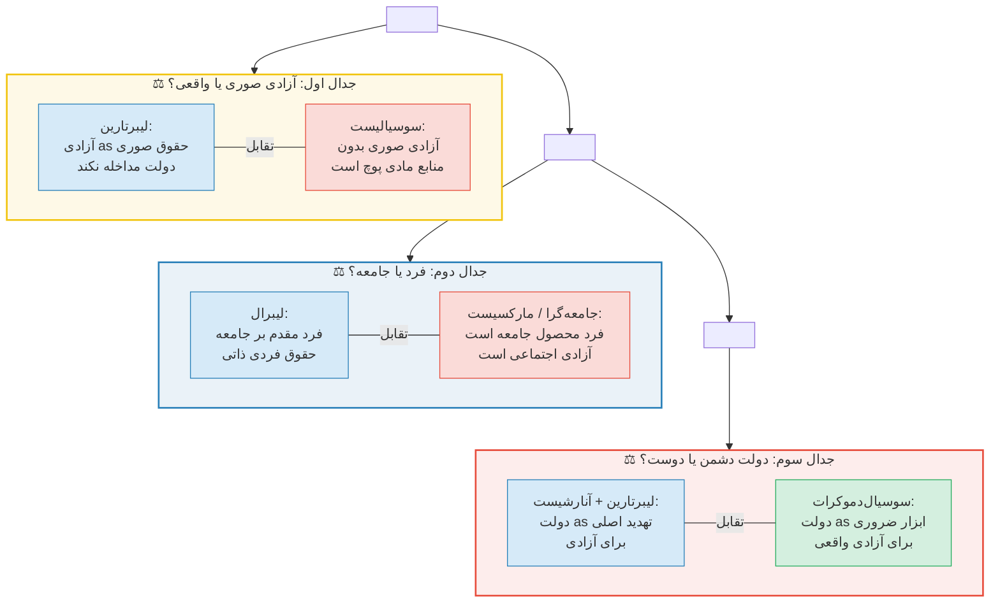

*شکل ۳–۲: سه جدال بنیادین که هر بحث سیاسی درباره‌ی آزادی به یکی از آنها
          بازمی‌گردد*


      <div class="card gold">

#### 💡 نتیجه‌ی تحلیلی

 <p> هر مکتب سیاسی بخشی از حقیقت آزادی را می‌بیند: <strong>راست</strong> اهمیت عدم مداخله و حریم خصوصی را می‌فهمد؛ <strong>چپ</strong> اهمیت شرایط مادی و ساختاری را؛ <strong>میانه</strong> تلاش می‌کند بین این دو توازن برقرار کند؛ و <strong>جمهوری‌خواهان</strong> به بُعد سلطه و قدرت توجه دارند که هم راست و هم چپ ممکن است نادیده بگیرند. همان‌طور که <strong>آمارتیا سن</strong> (1999) استدلال کرد: «آزادی‌های مختلف به یکدیگر وابسته‌اند»—آزادی سیاسی، اقتصادی، اجتماعی، و فرهنگی همه ضروری‌اند. </p>
      </div>

    </section>

    <section id="sec4">

## ۴. تحلیل تفصیلی تعبیرسازی‌های آزادی


      <div class="info-box warning">
        <strong>📚 سطح این بخش: آکادمیک</strong> —
        از این‌جا به بعد، بحث با دقت مفهومی بیشتر، ارجاع مستقیم به متون اصلی،
        و تحلیل ساختار منطقی هر نظریه پیش می‌رود.
      </div>


<h3 id="sec4-1">۴.۱ آزادی منفی: از هابز تا برلین</h3>


#### ۴.۱.۱ صورت‌بندی هابزی

 <p> توماس هابز در <em>لویاتان</em> (1651) نخستین تعریف دقیق و ماتریالیستی از آزادی را عرضه کرد: «آزادی، به معنای دقیق کلمه، نبودِ مانع‌های بیرونیِ حرکت است» (Leviathan, II.xxi). در این تعریف: </p>
      <ul>
        <li><strong>فاعل آزادی:</strong> هر جسم متحرک (نه فقط انسان)—حتی آب آزاد است اگر مانعی نداشته باشد.</li>
        <li><strong>مانع:</strong> فقط موانع <em>بیرونی و فیزیکی</em>. ترس و جهل مانع آزادی نیستند.</li>
        <li><strong>هدف:</strong> هر حرکتی—هیچ ارزش‌گذاری درباره‌ی کیفیت عمل وجود ندارد.</li>
      </ul>
 <p> نکته‌ی مهم: هابز آزادی را با <em>اقتدار مطلقِ حاکم</em> سازگار می‌دانست. حاکم فضای عظیمی از زندگی خصوصی را آزاد می‌گذارد («سکوت قانون») و تنها در حفظ نظم مداخله می‌کند. این سازگاری آزادی با اقتدار، محل انتقاد شدید لاک و سنت جمهوری‌خواهانه قرار گرفت. </p>


#### ۴.۱.۲ تحول لاکی

 <p> جان لاک در <em>رساله‌ی دوم درباره‌ی حکومت</em> (1689) آزادی را بازتعریف کرد: «آزادی انسان‌ها تحت حکومت، آن است که قاعده‌ی ثابتی برای زیستن داشته باشند که مشترک بین همه‌ی اعضای آن جامعه باشد… و تابع اراده‌ی متغیر، نامعلوم، و خودسرانه‌ی شخص دیگری نباشند» (II.iv.22). </p>
 <p> تفاوت‌های کلیدی لاک با هابز: </p>
      <table>
 <thead> <tr> <th>بُعد</th> <th>هابز</th> <th>لاک</th> </tr> </thead>
 <tbody> <tr> <td>ماهیت مانع</td> <td>فقط فیزیکی</td> <td>فیزیکی + حقوقی (اراده‌ی خودسرانه)</td> </tr> <tr> <td>وضع طبیعی</td> <td>جنگ همه علیه همه</td> <td>صلح نسبی + حقوق طبیعی</td> </tr> <tr> <td>رابطه با دولت</td> <td>تسلیم به حاکم مطلق</td> <td>رضایت + حق مقاومت</td> </tr> <tr> <td>مالکیت</td> <td>امتیاز حاکم</td> <td>حق طبیعی پیشاسیاسی</td> </tr> </tbody>
      </table>


#### ۴.۱.۳ صورت‌بندی برلین

 <p> آیزایا برلین در سخنرانی مشهور «دو مفهوم آزادی» (1958) تعریف کلاسیک آزادی منفی را ارائه داد: </p>
      <blockquote style="border-right:4px solid var(--clr-primary); padding:1rem 1.5rem; background:var(--clr-highlight); border-radius:0 var(--radius) var(--radius) 0; margin:1rem 0; font-style:italic;">
        «من به آن معنا آزادم که هیچ انسانی یا هیچ گروهی از انسان‌ها در کار من
        دخالت نمی‌کنند. آزادی سیاسی به این معناست: فضایی که در آن یک شخص بتواند
        بدون ممانعت دیگران عمل کند.»

      </blockquote>
 <p> عناصر ساختاری تعریف برلین: </p>
      <ul>
        <li><strong>فاعل:</strong> فرد انسانی (نه گروه، نه طبقه، نه ملت).</li>
        <li><strong>مانع:</strong> مداخله‌ی <em>عمدی</em> انسان‌های دیگر (نه فقر، نه طبیعت، نه ناتوانی).</li>
        <li><strong>هدف:</strong> هر چیزی که فرد بخواهد انجام دهد—بدون ارزش‌داوری.</li>
      </ul>

      <div class="card right">

#### ⚠ هشدار برلین: خطر آزادی مثبت

 <p> برلین استدلال کرد که آزادی «مثبت» (خودحکمرانی) در دست ایدئولوگ‌ها به ابزار سرکوب تبدیل شده: اگر «خودِ واقعی» شما عقلانی/طبقاتی/ملی تعریف شود، می‌توان شما را «به‌زور آزاد» کرد. روسو، هگل، و مارکس هر سه زمینه‌ساز این خطر بوده‌اند. این تحلیل ریشه‌ای در تجربه‌ی برلین از <em>توتالیتاریسم شوروی</em> و <em>فاشیسم</em> داشت. </p>
      </div>


#### ۴.۱.۴ نقدهای وارد بر آزادی منفی


**نقشه‌ی نقدهای وارد بر آزادی منفی**

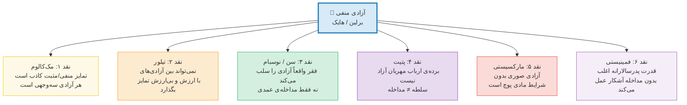

*شکل ۴–۱: شش نقد اصلی بر آزادی منفی*


<h3 id="sec4-2">۴.۲ آزادی مثبت: از روسو تا تیلور</h3>


#### ۴.۲.۱ بنیاد روسویی

 <p> ژان-ژاک روسو در <em>قرارداد اجتماعی</em> (1762) مشهورترین صورت‌بندی آزادی مثبت را عرضه کرد: «اطاعت از قانونی که خود برای خویش وضع کرده‌ای، آزادی است» (I.viii). آزادی نه غیابِ قانون بلکه <em>حضور قانونِ خودوضع</em> است. این فرمول سه نتیجه داشت: </p>
      <ol>
        <li><strong>آزادی اخلاقی</strong> بالاتر از آزادی طبیعی است (رام‌کردن امیال).</li>
        <li><strong>اراده‌ی عمومی</strong> (volonté générale) قانون‌گذار است، نه اراده‌ی فردی.</li>
 <li>کسی که از اراده‌ی عمومی سرپیچی کند، می‌تواند «<strong>مجبور به آزاد بودن</strong>» شود (forcé d'être libre).</li>
      </ol>


#### ۴.۲.۲ خودآیینی کانتی

 <p> ایمانوئل کانت در <em>بنیاد مابعدالطبیعه‌ی اخلاق</em> (1785) و <em>نقد عقل عملی</em> (1788) آزادی را به <strong>خودآیینی عقل عملی</strong> تعریف کرد. اراده‌ی آزاد = اراده‌ای که تحت قانون اخلاقی‌ای قرار دارد که خودْ آن را از طریق عقل وضع کرده است. تفاوت با روسو: قانون‌گذار نه اراده‌ی عمومی بلکه <em>عقل عملی جهان‌شمول</em> است. </p>
      <blockquote style="border-right:4px solid var(--clr-secondary); padding:1rem 1.5rem; background:#eafaf1; border-radius:0 var(--radius) var(--radius) 0; margin:1rem 0; font-style:italic;">
        «خودآیینی اراده، اصل یگانه‌ی همه‌ی قوانین اخلاقی و تکالیف متناظر با آنهاست.»

      </blockquote>


#### ۴.۲.۳ خودتحقق‌بخشی هگلی

 <p> گئورگ ویلهلم فریدریش هگل در <em>فلسفه‌ی حق</em> (1821) استدلال کرد که آزادیِ انتزاعی (من هر چه بخواهم انجام می‌دهم) سطحی‌ترین شکل آزادی است. آزادیِ واقعی = <strong>خودتحقق‌بخشی در نهادهای اخلاقی عینی</strong> (<em>Sittlichkeit</em>): خانواده، جامعه‌ی مدنی، و دولت. من در <em>شناخته‌شدن</em> توسط دیگران و در مشارکت در نهادهای عقلانی به آزادی دست می‌یابم. </p>
 <p> <strong>تفاوت کلیدی:</strong> برای هگل، دولت (عقلانی) نه دشمن آزادی بلکه <em>تحقق‌بخش</em> آن است—نقطه‌مقابل کامل لیبرتارینیسم. </p>


#### ۴.۲.۴ دفاع معاصر تیلور

 <p> چارلز تیلور در مقاله‌ی مهم «?What's Wrong with Negative Liberty» (1979) استدلال کرد که آزادیِ صرفاً منفی (= تعداد درهای بازِ پیشِ رو) نمی‌تواند تبیین کند چرا ما آزادی بیان را از آزادی چراغ‌راهنمایی <em>مهم‌تر</em> می‌دانیم. آزادی مستلزم <strong>ارزیابی قوی</strong> (strong evaluation) است: توانایی تشخیص اینکه کدام خواست‌ها ارزشمندترند. این همان آزادی مثبت است—بدون خطر توتالیتری که برلین هشدار داده بود، زیرا تیلور آن را نه به دولت بلکه به <em>فرآیند اصالتِ فردی</em> گره می‌زند. </p>


**تطور آزادی مثبت: از روسو تا تیلور**

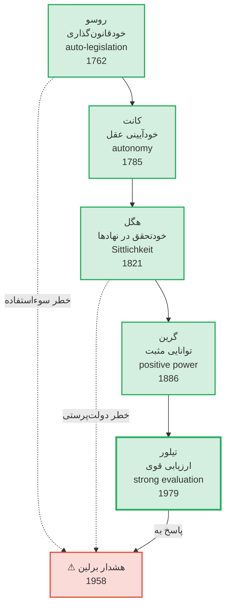

*شکل ۴–۲: خط سیر آزادی مثبت و تنش پایدار آن با هشدار برلین*


<h3 id="sec4-3">۴.۳ آزادی جمهوری‌خواهانه: عدم سلطه</h3>


#### ۴.۳.۱ بازکشف سنت جمهوری‌خواهانه

 <p> از اواخر دهه‌ی ۱۹۸۰، مورخان اندیشه‌ی سیاسی (به‌ویژه <strong>کوئنتین اسکینر</strong> و <strong>جان پاکاک</strong>) نشان دادند که پیش از لیبرالیسم، سنت جمهوری‌خواهانه‌ای از آزادی وجود داشته که نه «عدم مداخله» بوده نه «خودحکمرانی» بلکه <strong>عدم سلطه</strong> (non-domination). </p>


#### ۴.۳.۲ صورت‌بندی پتیت

 <p> <strong>فیلیپ پتیت</strong> (<em>Republicanism: A Theory of Freedom and Government</em>, 1997) سومین مفهوم آزادی را صورت‌بندی نظام‌مند کرد: </p>
      <blockquote style="border-right:4px solid var(--clr-gold); padding:1rem 1.5rem; background:#fef9e7; border-radius:0 var(--radius) var(--radius) 0; margin:1rem 0; font-style:italic;">
        «شخص آزاد است اگر و فقط اگر هیچ فاعل دیگری قدرت مداخله‌ی خودسرانه
        در انتخاب‌های او را نداشته باشد—حتی اگر واقعاً مداخله نکند.»

      </blockquote>
      <p>تفاوت کلیدی با برلین (عدم مداخله):</p>
      <table>
 <thead> <tr> <th>وضعیت</th> <th>برلین (عدم مداخله)</th> <th>پتیت (عدم سلطه)</th> </tr> </thead>
 <tbody> <tr> <td>ارباب مهربان که هرگز مداخله نمی‌کند</td> <td style="background:#d4efdf;">✅ برده آزاد است (مداخله‌ای نیست)</td> <td style="background:#fadbd8;">❌ برده آزاد نیست (ارباب قدرت مداخله دارد)</td> </tr> <tr> <td>قانون عادلانه که مداخله می‌کند (مثلاً مالیات)</td> <td style="background:#fadbd8;">❌ آزادی کاهش یافته (مداخله هست)</td> <td style="background:#d4efdf;">✅ آزادی حفظ شده (مداخله خودسرانه نیست)</td> </tr> </tbody>
      </table>


<h3 id="sec4-4">۴.۴ آزادی اگزیستانسیالیستی</h3>


#### ۴.۴.۱ سارتر: محکوم به آزادی

 <p> ژان-پل سارتر در <em>هستی و نیستی</em> (1943) رادیکال‌ترین تعریف آزادی را ارائه داد: آزادی نه حقی است که اعطا یا سلب شود، بلکه <strong>ساختار هستی‌شناختی آگاهی</strong> است. آگاهی انسانی («هستیِ-برای-خود») ذاتاً «نیست‌ساز» (néantisant) است: همواره می‌تواند از وضع موجود فاصله بگیرد و آن را نفی کند. </p>
      <blockquote style="border-right:4px solid #8e44ad; padding:1rem 1.5rem; background:#f4ecf7; border-radius:0 var(--radius) var(--radius) 0; margin:1rem 0; font-style:italic;">
        «انسان محکوم به آزادی است. محکوم، زیرا خود را نیافریده؛
        و آزاد، زیرا پس از آنکه به جهان افکنده شد، مسئول همه‌ی کارهایی است که انجام می‌دهد.»

      </blockquote>


#### ۴.۴.۲ آرنت: آزادی به‌مثابه کنش

 <p> هانا آرنت در <em>وضع بشر</em> (1958) و مقاله‌ی «آزادی چیست؟» (<em>میان گذشته و آینده</em>, 1961) آزادی را نه در <em>اراده</em> یا <em>فکر</em> بلکه در <strong>کنش</strong> (action) یافت: توانایی آغاز کردن چیزی نو در فضای عمومیِ مشترک با دیگران. آزادی = <strong>تولد دوباره</strong> (natality)—ظرفیت بشری برای شروع. </p>
 <p> <strong>تفاوت با سارتر:</strong> برای سارتر آزادی فردی و هستی‌شناختی است؛ برای آرنت <em>سیاسی و بین‌الاذهانی</em>. آزادی فقط در «بودن با دیگران» در فضای عمومی ممکن است. </p>


<h3 id="sec4-5">۴.۵ آزادی مارکسیستی: رهایی و ازخودبیگانگی</h3>


 <p> مارکس هرگز نظریه‌ی منسجمی درباره‌ی آزادی ننوشت، اما مفهوم آزادی در سراسر آثارش حاضر است. می‌توان سه لایه را تشخیص داد: </p>

      <div class="card right">

#### لایه‌ی اول: نقد آزادی بورژوایی (۱۸۴۳)

 <p> در <em>درباره‌ی مسئله‌ی یهود</em>، مارکس بین «رهایی سیاسی» (political emancipation = حقوق شهروندی) و «رهایی انسانی» (human emancipation = تحول واقعی روابط اجتماعی) تمایز نهاد. حقوق بشر لیبرالی، حقوق «انسان خودپرست جامعه‌ی بورژوایی» است. </p>
      </div>

      <div class="card right">

#### لایه‌ی دوم: ازخودبیگانگی (۱۸۴۴)

 <p> در <em>دست‌نوشته‌های اقتصادی-فلسفی</em>، ازخودبیگانگی چهاروجهی: </p>
        <ol>
          <li>بیگانگی از <strong>محصول</strong> کار (متعلق به سرمایه‌دار).</li>
          <li>بیگانگی از <strong>فرآیند</strong> کار (تکراری، بی‌معنا).</li>
          <li>بیگانگی از <strong>ذات نوعی</strong> (Gattungswesen — خلاقیت ذاتی انسان).</li>
          <li>بیگانگی از <strong>دیگر انسان‌ها</strong> (رقابت به‌جای همکاری).</li>
        </ol>
        <p>آزادی = رفع هر چهار وجه ازخودبیگانگی.</p>
      </div>

      <div class="card right">

#### لایه‌ی سوم: قلمرو آزادی (۱۸۹۴)

 <p> در جلد سوم <em>سرمایه</em>: «قلمرو آزادی واقعی فقط آنجا آغاز می‌شود که کاری که توسط ضرورت و ملاحظات دنیوی تعیین می‌شود، پایان یابد» — یعنی فراتر از کار ضروری، در اوقات فراغت و خلاقیت. </p>
      </div>


<h3 id="sec4-6">۴.۶ آزادی فمینیستی و پسااستعماری</h3>


#### ۴.۶.۱ نقد فمینیستی

 <p> نظریه‌پردازان فمینیست نشان دادند که تمام تعابیر سنتی آزادی بر مدل <em>مرد سفیدپوست مالک</em> مبتنی بوده‌اند. <strong>کارول پیتمن</strong> (<em>The Sexual Contract</em>, 1988) استدلال کرد که «قرارداد اجتماعی» لاک و روسو یک «قرارداد جنسی» پنهان را در خود دارد که سلطه‌ی مردان بر زنان را طبیعی جلوه می‌دهد. </p>
 <p> <strong>رویکرد خودآیینی رابطه‌ای</strong> (Relational Autonomy): <strong>مارینا اوشانا</strong> و <strong>کارولین مک‌کنزی</strong> استدلال کردند که خودآیینی نه صفت <em>فرد منزوی</em> بلکه محصول <em>روابط اجتماعی</em> است. زنی که در شبکه‌ی روابط پدرسالارانه زندگی می‌کند، حتی بدون مداخله‌ی آشکار، خودآیین نیست. </p>


#### ۴.۶.۲ رویکرد پسااستعماری

 <p> <strong>فرانتس فانون</strong> (<em>دوزخیان زمین</em>, 1961) آزادی را <strong>رهایی همزمان مادی و روانی</strong> از استعمار دانست. استعمار فقط سرزمین را اشغال نمی‌کند؛ <em>ذهن</em> و <em>هویت</em> مستعمَر را نیز تسخیر می‌کند. آزادی مستلزم «خلق انسان نو» است. </p>
      <blockquote style="border-right:4px solid var(--clr-accent); padding:1rem 1.5rem; background:#fdedec; border-radius:0 var(--radius) var(--radius) 0; margin:1rem 0; font-style:italic;">
        «استعمارزدایی همیشه پدیده‌ای خشن است…
        استعمارزدایی واقعاً خلق انسان‌های نو است.»

      </blockquote>

 <p> <strong>گایاتری اسپیواک</strong> («آیا فرودست می‌تواند سخن بگوید؟», 1988) پرسید: حتی پس از استقلال سیاسی، آیا فرودستان (subaltern) واقعاً «صدا» دارند؟ آزادی مستلزم <em>عاملیت شناختی</em> (epistemic agency) است: توانایی سخن‌گفتن و شنیده‌شدن در ساختارهای دانش. </p>

 <p> <strong>آشیل مبمبه</strong> (<em>Necropolitics</em>, 2003) مفهوم «نکروسیاست» (سیاست مرگ) را معرفی کرد: در جهان پسااستعماری، حاکمیت نه فقط بر زندگی بلکه بر <em>مرگ</em> اِعمال می‌شود. آزادی در برابر نکروسیاست = حق زیستن. </p>


**نقشه‌ی تعابیر فمینیستی و پسااستعماری آزادی**

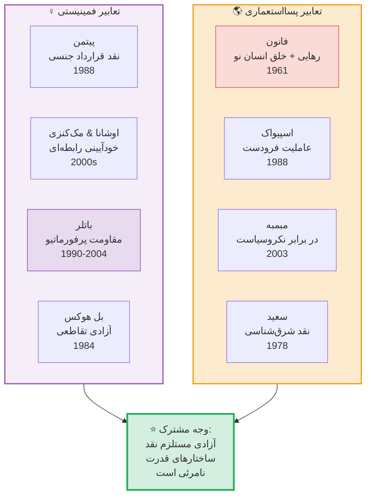

*شکل ۴–۳: تعابیر فمینیستی و پسااستعماری و وجه مشترک آنها: نقد قدرت نامرئی*


<h3 id="sec4-7">۴.۷ رویکرد توانمندی: سن و نوسبام</h3>


#### ۴.۷.۱ آمارتیا سن: توسعه به‌مثابه آزادی

 <p> آمارتیا سن در <em>Development as Freedom</em> (1999) استدلال کرد که آزادی هم <strong>هدف نهایی</strong> و هم <strong>ابزار اصلی</strong> توسعه است. آزادی = مجموعه‌ی <strong>توانمندی‌ها</strong> (capabilities) و <strong>عملکردها</strong> (functionings) که شخص واقعاً در دسترس دارد. </p>
      <p>سن پنج نوع آزادی ابزاری را شناسایی کرد:</p>
      <table>
 <thead> <tr> <th>#</th> <th>نوع آزادی ابزاری</th> <th>توضیح</th> </tr> </thead>
 <tbody> <tr> <td>۱</td> <td>آزادی‌های سیاسی</td> <td>حق رأی، آزادی بیان، مطبوعات</td> </tr> <tr> <td>۲</td> <td>تسهیلات اقتصادی</td> <td>دسترسی به بازار، اعتبار، اشتغال</td> </tr> <tr> <td>۳</td> <td>فرصت‌های اجتماعی</td> <td>آموزش، بهداشت</td> </tr> <tr> <td>۴</td> <td>تضمین‌های شفافیت</td> <td>اعتماد، صداقت، ضد فساد</td> </tr> <tr> <td>۵</td> <td>امنیت حمایتی</td> <td>شبکه‌های تأمین اجتماعی</td> </tr> </tbody>
      </table>


#### ۴.۷.۲ مارتا نوسبام: ده توانمندی محوری

 <p> نوسبام (<em>Women and Human Development</em>, 2000) فهرستی از ده توانمندی محوری پیشنهاد کرد که هر حکومت عادلی باید تضمین کند: </p>
      <table>
 <thead> <tr> <th>#</th> <th>توانمندی</th> <th>توضیح مختصر</th> </tr> </thead>
 <tbody> <tr> <td>۱</td> <td>زندگی</td> <td>زیستن تا پایان عمر طبیعی</td> </tr> <tr> <td>۲</td> <td>سلامت جسمانی</td> <td>بهداشت، تغذیه، مسکن</td> </tr> <tr> <td>۳</td> <td>تمامیت جسمانی</td> <td>امنیت از خشونت، آزادی جنسی</td> </tr> <tr> <td>۴</td> <td>حواس، تخیل، اندیشه</td> <td>آموزش، آزادی بیان و دین</td> </tr> <tr> <td>۵</td> <td>عواطف</td> <td>دلبستگی، عشق، غم بدون ترس</td> </tr> <tr> <td>۶</td> <td>عقل عملی</td> <td>تصور خیر و برنامه‌ریزی زندگی</td> </tr> <tr> <td>۷</td> <td>وابستگی اجتماعی</td> <td>زیستن با دیگران، عزت نفس</td> </tr> <tr> <td>۸</td> <td>سایر گونه‌ها</td> <td>رابطه با طبیعت و حیوانات</td> </tr> <tr> <td>۹</td> <td>بازی</td> <td>خنده، تفریح، فراغت</td> </tr> <tr> <td>۱۰</td> <td>کنترل بر محیط</td> <td>مشارکت سیاسی + مالکیت</td> </tr> </tbody>
      </table>

      <div class="card accent">

#### 💡 اهمیت رویکرد توانمندی

 <p> رویکرد توانمندی <strong>پلی</strong> بین آزادی منفی و مثبت می‌زند: هم حقوق فردی (عدم مداخله) را می‌پذیرد و هم شرایط مادی و اجتماعی (توانمندسازی) را ضروری می‌داند. از این رو، به <em>شاخص توسعه‌ی انسانی</em> (HDI) سازمان ملل بدل شد و تأثیر عملی عظیمی داشت. </p>
      </div>


<h3 id="sec4-8">۴.۸ مقایسه‌ی تحلیلی و منطقی</h3>


 <p> اکنون می‌توانیم هفت تعبیر اصلی را بر اساس معیارهای تحلیلی مقایسه کنیم. از ساختار سه‌گانه‌ی مک‌کالوم (X از Y آزاد است تا Z) به‌عنوان چارچوب استفاده می‌کنیم: </p>

      <div style="overflow-x:auto;">
        <table>
 <thead> <tr> <th style="min-width:120px;">تعبیر</th> <th>X (فاعل)</th> <th>Y (مانع/دشمن)</th> <th>Z (هدف)</th> <th>سطح تحلیل</th> <th>انسان‌شناسی زیربنایی</th> </tr> </thead>
 <tbody> <tr style="background:#eaf2f8;"> <td><strong>منفی (برلین)</strong></td> <td>فرد</td> <td>مداخله‌ی عمدی دیگران</td> <td>هر عملی</td> <td>سیاسی</td> <td>فرد عقلانی خودبسنده</td> </tr> <tr style="background:#eafaf1;"> <td><strong>مثبت (کانت/تیلور)</strong></td> <td>خودِ عقلانی/اصیل</td> <td>امیال غیرعقلانی، فریب</td> <td>زندگی اصیل/اخلاقی</td> <td>اخلاقی-روانی</td> <td>انسان دوپاره (عقل/میل)</td> </tr> <tr style="background:#fef9e7;"> <td><strong>جمهوری‌خواهانه (پتیت)</strong></td> <td>شهروند</td> <td>قدرت خودسرانه (سلطه)</td> <td>زیستن بدون ترس</td> <td>نهادی-حقوقی</td> <td>انسان آسیب‌پذیر در روابط قدرت</td> </tr> <tr style="background:#fdedec;"> <td><strong>مارکسیستی</strong></td> <td>طبقه‌ی کارگر / نوع بشر</td> <td>استثمار، ازخودبیگانگی</td> <td>خلاقیت آزاد، رشد همه‌جانبه</td> <td>اقتصادی-ساختاری</td> <td>انسان = موجود خلاق کارورز</td> </tr> <tr style="background:#f4ecf7;"> <td><strong>اگزیستانسیال (سارتر)</strong></td> <td>آگاهی (pour-soi)</td> <td>بدایمانی، شیءوارگی</td> <td>انتخاب اصیل</td> <td>هستی‌شناختی</td> <td>انسان = آگاهی بدون ذات</td> </tr> <tr style="background:#d0ece7;"> <td><strong>توانمندی (سن)</strong></td> <td>هر شخص</td> <td>محرومیت، فقر، تبعیض</td> <td>عملکردهای ارزشمند</td> <td>چندبُعدی</td> <td>انسان = عامل فعال نیازمند شرایط</td> </tr> <tr style="background:#f5eef8;"> <td><strong>انتقادی/پسا (فوکو)</strong></td> <td>سوژه‌ی تاریخی</td> <td>انقیاد، هنجارسازی</td> <td>خودآفرینی، پَرِّزیا</td> <td>تبارشناختی</td> <td>سوژه = محصول/مقاومت‌کننده‌ی قدرت</td> </tr> </tbody>
        </table>
      </div>


**مقایسه‌ی رادار: هفت تعبیر بر اساس پنج معیار**

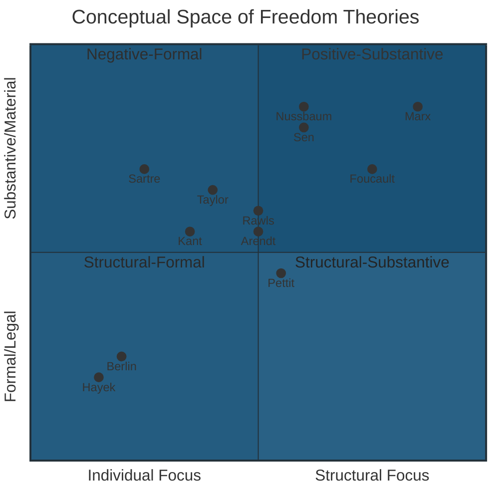

*شکل ۴–۴: فضای مفهومی نظریه‌های آزادی. محور افقی: تمرکز فردی ← ساختاری. محور
          عمودی: صوری/حقوقی ← مادی/واقعی.*


    </section>

    <section id="sec5">

## ۵. مفاهیم مجاور و مکمل آزادی


      <div class="info-box">
        آزادی هرگز به‌تنهایی فهمیده نمی‌شود. مجموعه‌ای از مفاهیم مجاور وجود دارند
        که بدون توجه به آن‌ها، تحلیل آزادی ناقص می‌ماند.
      </div>


**نقشه‌ی مفهومی: آزادی و مفاهیم مجاور**

<Tabs>
  <TabItem label="نقشه فارسی">


  </TabItem>
  <TabItem label="English Map">

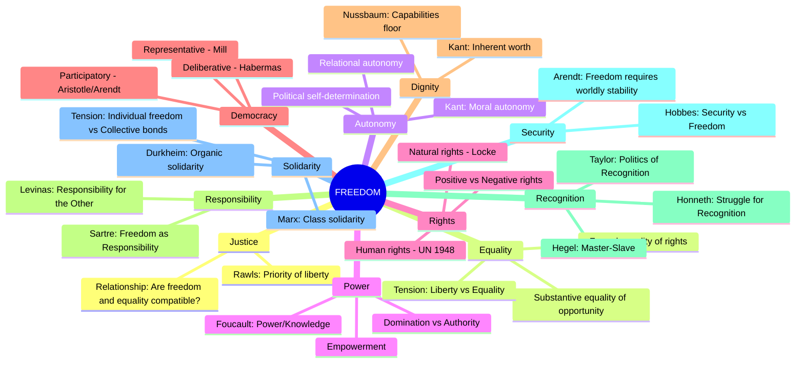

  </TabItem>
</Tabs>

*شکل ۵–۱: نقشه‌ی ذهنی مفاهیم مجاور و مکمل آزادی*


### ۵.۱ فهرست تشریحی مفاهیم مجاور


      <div class="card primary">

#### ⚖ عدالت (Justice)

 <p> <strong>پرسش محوری:</strong> آیا آزادی و عدالت همیشه سازگارند؟ <strong>رالز</strong> (1971) استدلال کرد که «اصل اول» عدالت تقدم آزادی‌های پایه بر عدالت توزیعی است—ولی آزادی بدون حداقلی از عدالت توزیعی بی‌معناست (اصل تفاوت). <strong>نوزیک</strong> در مقابل: هر توزیعی که نتیجه‌ی مبادله‌ی آزادانه باشد عادلانه است. <strong>سن</strong>: عدالت = گسترش توانمندی‌ها = آزادی. عدالت و آزادی یکی‌اند. </p>
      </div>

      <div class="card accent">

#### ⚖ برابری (Equality)

 <p> <strong>تنش کلاسیک:</strong> آیا آزادی و برابری تضاد دارند؟ <strong>راست:</strong> برابری‌سازی اجباری، آزادی را نقض می‌کند (هایک). <strong>چپ:</strong> نابرابری شدید خود نفی آزادی است (مارکس). <strong>میانه:</strong> برابری فرصت (نه نتیجه) با آزادی سازگار است (رالز). <strong>سن:</strong> «برابری چه چیزی؟»—باید در توانمندی‌ها برابری خواست. </p>
      </div>

      <div class="card gold">

#### ⚖ خودآیینی (Autonomy)

 <p> مفهومی نزدیک‌تر از عدالت به آزادی. خودآیینی = <em>خودقانون‌گذاری</em>. تفاوت ظریف: آزادی ممکن است بیرونی باشد (نبودِ مانع) ولی خودآیینی همیشه <em>درونی</em> است (حکومت عقل بر میل). خودآیینی رابطه‌ای (مک‌کنزی) نشان داد که خودآیینی فردی محصول شرایط اجتماعی مناسب است. </p>
      </div>

      <div class="card right">

#### ⚖ قدرت (Power)

 <p> <strong>فوکو:</strong> قدرت نه فقط سرکوب‌گر بلکه <em>تولیدکننده</em> است—سوژه‌ها را می‌سازد. آزادی نه «بیرون» قدرت بلکه <em>در درون</em> روابط قدرت و به‌شکل مقاومت ممکن است. <strong>لوکس</strong> (<em>Power: A Radical View</em>, 1974/2005): بُعد سوم قدرت = شکل‌دهی به خواست‌ها. اگر خواست‌های شما توسط قدرت شکل گرفته، عدم مداخله کافی نیست. </p>
      </div>

      <div class="card primary">

#### ⚖ حقوق (Rights)

 <p> آزادی و حقوق گاه یکی انگاشته می‌شوند ولی تفاوت مهمی دارند. حقوق = <em>ادعاهای قانونی/اخلاقی</em> علیه دیگران. آزادی = <em>وضعیتِ</em> فاعل. حق آزادی بیان = ادعای من علیه دولت که مداخله نکند. اما ممکن است حقی داشته باشم و هنوز آزاد نباشم (مثلاً حق کار دارم ولی کاری نیست). </p>
      </div>

      <div class="card accent">

#### ⚖ دموکراسی (Democracy)

 <p> آیا دموکراسی شرط آزادی است یا برعکس؟ <strong>آرنت:</strong> آزادی فقط در مشارکت سیاسی ممکن است (دموکراسی شرط). <strong>برلین:</strong> لزوماً نه—دموکراسی ممکن است به استبداد اکثریت بینجامد. <strong>هابرماس:</strong> دموکراسی مشورتی = تحقق «آزادی ارتباطی». </p>
      </div>

      <div class="card gold">

#### ⚖ کرامت (Dignity)

 <p> <strong>کانت:</strong> انسان غایت‌فی‌ذاته است و کرامت ذاتی دارد. کرامت <em>بنیاد</em> آزادی است: چون انسان کرامت دارد، باید آزاد باشد. ماده‌ی ۱ اعلامیه‌ی جهانی حقوق بشر (۱۹۴۸): «تمام افراد بشر آزاد و با کرامت و حقوق برابر زاده می‌شوند.» </p>
      </div>

      <div class="card right">

#### ⚖ مسئولیت (Responsibility)

 <p> <strong>سارتر:</strong> آزادی و مسئولیت دو روی یک سکه‌اند. <strong>لویناس:</strong> مسئولیت نامتناهی در برابر «دیگری» حتی پیش از آزادی می‌آید—اخلاق مقدم بر هستی‌شناسی است. <strong>یوناس:</strong> مسئولیت در برابر نسل‌های آینده حدّ آزادی کنونی ماست. </p>
      </div>

      <div class="card primary">

#### ⚖ شناسایی (Recognition)

 <p> <strong>هگل:</strong> دیالکتیک ارباب-بنده نشان‌دهنده‌ی نیاز متقابل به شناسایی. <strong>تیلور:</strong> «سیاست شناسایی»—هویت‌ها باید به رسمیت شناخته شوند. <strong>هونت:</strong> سه حوزه‌ی شناسایی: عشق، حقوق، و ارج‌گذاری اجتماعی. بدون شناسایی، آزادی ناقص است. </p>
      </div>

      <div class="card accent">

#### ⚖ امنیت (Security)

 <p> <strong>هابز:</strong> امنیت مقدم بر آزادی است—بدون امنیت، آزادی بی‌معناست. <strong>برلین:</strong> امنیت و آزادی ممکن است تعارض داشته باشند. بحث‌های پس از ۱۱ سپتامبر: چقدر آزادی را می‌توان به‌نام امنیت قربانی کرد؟ </p>
      </div>

      <div class="card gold">

#### ⚖ همبستگی (Solidarity)

 <p> آیا آزادی فردی با همبستگی جمعی سازگار است؟ <strong>مارکس:</strong> همبستگی طبقاتی شرط رهایی. <strong>دورکیم:</strong> همبستگی ارگانیک (تقسیم کار) بستر آزادی مدرن. <strong>رورتی:</strong> همبستگی نه بر اصول جهان‌شمول بلکه بر «حساسیت به درد دیگران» بنا شود. </p>
      </div>

    </section>

    <section id="sec6">

## ۶. جدول آثار اصلی نظریه‌پردازان


      <div class="info-box">
        جدول زیر برای مطالعه‌ی بیشتر و تحقیق عمیق‌تر تهیه شده است.
        آثار به ترتیب تاریخی مرتب شده‌اند.
      </div>

      <div style="overflow-x:auto;">
        <table>
 <thead> <tr> <th style="min-width:110px;">نظریه‌پرداز</th> <th style="min-width:200px;">اثر اصلی</th> <th>سال</th> <th>تعبیر آزادی</th> <th>زبان اصلی</th> </tr> </thead>
 <tbody> <tr> <td>افلاطون</td> <td><em>Politeia</em> (جمهور)</td> <td>~380 ق.م</td> <td>خودبسندگی نفس</td> <td>یونانی</td> </tr> <tr> <td>ارسطو</td> <td><em>Politics</em> (سیاست)</td> <td>~335 ق.م</td> <td>مشارکت سیاسی</td> <td>یونانی</td> </tr> <tr> <td>اپیکتتوس</td> <td><em>Discourses</em> (گفتارها)</td> <td>~108 م</td> <td>آزادی درونی</td> <td>یونانی</td> </tr> <tr> <td>آگوستین</td> <td><em>De Libero Arbitrio</em></td> <td>395</td> <td>اختیار آزاد</td> <td>لاتین</td> </tr> <tr> <td>غزالی</td> <td><em>احیاء علوم‌الدین</em></td> <td>~1100</td> <td>بندگی خدا = آزادی</td> <td>عربی</td> </tr> <tr> <td>آکویناس</td> <td><em>Summa Theologiae</em></td> <td>1265-74</td> <td>قانون طبیعی + اختیار</td> <td>لاتین</td> </tr> <tr> <td>هابز</td> <td><em>Leviathan</em></td> <td>1651</td> <td>عدم مانع خارجی</td> <td>انگلیسی</td> </tr> <tr> <td>اسپینوزا</td> <td><em>Ethica</em></td> <td>1677</td> <td>آزادی عقلانی</td> <td>لاتین</td> </tr> <tr> <td>لاک</td> <td><em>Two Treatises of Government</em></td> <td>1689</td> <td>حقوق طبیعی + رضایت</td> <td>انگلیسی</td> </tr> <tr> <td>روسو</td> <td><em>Du Contrat Social</em></td> <td>1762</td> <td>خودقانون‌گذاری</td> <td>فرانسوی</td> </tr> <tr> <td>کانت</td> <td><em>Grundlegung zur Metaphysik der Sitten</em></td> <td>1785</td> <td>خودآیینی عقل عملی</td> <td>آلمانی</td> </tr> <tr> <td>کنستان</td> <td><em>De la liberté des Anciens…</em></td> <td>1819</td> <td>آزادی متأخران</td> <td>فرانسوی</td> </tr> <tr> <td>هگل</td> <td><em>Grundlinien der Philosophie des Rechts</em></td> <td>1821</td> <td>خودتحقق‌بخشی در Sittlichkeit</td> <td>آلمانی</td> </tr> <tr> <td>مارکس</td> <td><em>Ökonomisch-philosophische Manuskripte</em></td> <td>1844</td> <td>رهایی از ازخودبیگانگی</td> <td>آلمانی</td> </tr> <tr> <td>میل</td> <td><em>On Liberty</em></td> <td>1859</td> <td>فردیت + عدم آسیب</td> <td>انگلیسی</td> </tr> <tr> <td>نیچه</td> <td><em>Jenseits von Gut und Böse</em></td> <td>1886</td> <td>خلق ارزش</td> <td>آلمانی</td> </tr> <tr> <td>گرین</td> <td><em>Lectures on Political Obligation</em></td> <td>1886</td> <td>آزادی مثبت</td> <td>انگلیسی</td> </tr> <tr> <td>فروم</td> <td><em>Escape from Freedom</em></td> <td>1941</td> <td>آزادی مثبت vs گریز</td> <td>انگلیسی</td> </tr> <tr> <td>سارتر</td> <td><em>L'Être et le Néant</em></td> <td>1943</td> <td>انتخاب وجودی</td> <td>فرانسوی</td> </tr> <tr> <td>آرنت</td> <td><em>The Human Condition</em></td> <td>1958</td> <td>کنش سیاسی</td> <td>انگلیسی</td> </tr> <tr> <td>برلین</td> <td><em>Two Concepts of Liberty</em></td> <td>1958</td> <td>منفی vs مثبت</td> <td>انگلیسی</td> </tr> <tr> <td>هایک</td> <td><em>The Constitution of Liberty</em></td> <td>1960</td> <td>عدم اجبار</td> <td>انگلیسی</td> </tr> <tr> <td>فانون</td> <td><em>Les Damnés de la Terre</em></td> <td>1961</td> <td>رهایی استعماری</td> <td>فرانسوی</td> </tr> <tr> <td>مارکوزه</td> <td><em>One-Dimensional Man</em></td> <td>1964</td> <td>رهایی از سرکوب مازاد</td> <td>انگلیسی</td> </tr> <tr> <td>مک‌کالوم</td> <td><em>Negative and Positive Freedom</em></td> <td>1967</td> <td>ساختار سه‌گانه</td> <td>انگلیسی</td> </tr> <tr> <td>رالز</td> <td><em>A Theory of Justice</em></td> <td>1971</td> <td>آزادی‌های پایه‌ی برابر</td> <td>انگلیسی</td> </tr> <tr> <td>نوزیک</td> <td><em>Anarchy, State, and Utopia</em></td> <td>1974</td> <td>مالکیت بر خود</td> <td>انگلیسی</td> </tr> <tr> <td>فوکو</td> <td><em>Surveiller et Punir</em></td> <td>1975</td> <td>مقاومت / خودآفرینی</td> <td>فرانسوی</td> </tr> <tr> <td>تیلور</td> <td><em>What's Wrong with Negative Liberty?</em></td> <td>1979</td> <td>ارزیابی قوی</td> <td>انگلیسی</td> </tr> <tr> <td>اسپیواک</td> <td><em>Can the Subaltern Speak?</em></td> <td>1988</td> <td>عاملیت فرودست</td> <td>انگلیسی</td> </tr> <tr> <td>پتیت</td> <td><em>Republicanism</em></td> <td>1997</td> <td>عدم سلطه</td> <td>انگلیسی</td> </tr> <tr> <td>سن</td> <td><em>Development as Freedom</em></td> <td>1999</td> <td>توانمندی واقعی</td> <td>انگلیسی</td> </tr> <tr> <td>نوسبام</td> <td><em>Women and Human Development</em></td> <td>2000</td> <td>ده توانمندی محوری</td> <td>انگلیسی</td> </tr> <tr> <td>فریکر</td> <td><em>Epistemic Injustice</em></td> <td>2007</td> <td>عدالت شناختی</td> <td>انگلیسی</td> </tr> <tr> <td>هونت</td> <td><em>Freedom's Right</em></td> <td>2014</td> <td>شناسایی متقابل</td> <td>آلمانی</td> </tr> <tr> <td>لسیگ</td> <td><em>Code: Version 2.0</em></td> <td>2006</td> <td>آزادی دیجیتال</td> <td>انگلیسی</td> </tr> </tbody>
        </table>
      </div>

    </section>
    <section id="appA">

## الف. پیوست الف: آزادی در سنت اسلامی–ایرانی


      <div class="info-box warning">
        <strong>📘 درباره‌ی این پیوست:</strong>
        سنت اسلامی–ایرانی تجربه‌ی متمایز و غنی‌ای از اندیشه‌ی آزادی دارد
        که در روایت‌های رایج غربی اغلب نادیده گرفته می‌شود.
        این پیوست سه محور را بررسی می‌کند:
        (۱) ایرانشهر و مسئله‌ی آزادی پیش از اسلام؛
        (۲) آزادی در کلام و فلسفه‌ی اسلامی؛
        (۳) آزادی در عرفان اسلامی–ایرانی؛
        (۴) متفکران معاصر مسلمان.
      </div>


### الف.۱ ایرانشهر: عدالت در برابر استبداد (نه بردگی در برابر آزادی)


 <p> روایت یونانی (هرودوت) ایرانیان را «بردگان شاه» و یونانیان را «آزاد» معرفی کرد. اما این روایت بیش از آنکه توصیف واقعیت باشد، <strong>ابزار هویت‌سازی یونانی</strong> بود. پژوهش‌های جدید (Briant, 2002; Wiesehöfer, 2001) نشان می‌دهند که: </p>

      <div class="card gold">

#### ⚖ تقابل ایرانشهری: عدالت vs ستم (نه آزادی vs بردگی)

        <ul>
 <li>در اندیشه‌ی ایرانشهری، مفهوم محوری نه <em>آزادی</em> (eleutheria) بلکه <strong>عدالت</strong> (<em>aša / dād</em>) در برابر <strong>ستم</strong> (<em>druj / bīdād</em>) بود.</li>
 <li><strong>کوروش بزرگ</strong> (منشور کوروش، ~539 ق.م): آزادی دینی، بازگرداندن مردمان تبعیدشده، ممنوعیت بیگاری — اینها ذیل <em>عدالت شاهانه</em> قرار داشتند نه «حقوق طبیعی».</li>
 <li><strong>داریوش بزرگ</strong> (کتیبه‌ی بیستون): «من دوستدار دروغ نبودم… من ستم نکردم» — شاه خود را مجری <em>arta</em> (نظم کیهانی/عدالت) معرفی می‌کند.</li>
 <li>در <strong>اندرزنامه‌ها</strong> (خسرو انوشیروان، تنسر)، شاه <em>نگهبان عدالت</em> است و حکومت مشروطه به <em>دین و عدل</em> نه به «رضایت مردم».</li>
        </ul>
      </div>

      <div class="card primary">

#### 📌 تفاوت کلیدی با یونان

        <table>
 <thead> <tr> <th>بُعد</th> <th>یونان باستان</th> <th>ایرانشهر</th> </tr> </thead>
 <tbody> <tr> <td>مفهوم محوری</td> <td>آزادی (eleutheria)</td> <td>عدالت (arta / dād)</td> </tr> <tr> <td>ضدّ مفهوم</td> <td>بردگی (douleia)</td> <td>ستم (druj / bīdād)</td> </tr> <tr> <td>مشروعیت حکومت</td> <td>مشارکت شهروندان</td> <td>عدالت شاهانه + فرّه ایزدی</td> </tr> <tr> <td>بردگی</td> <td>نهاد مرکزی اقتصاد</td> <td>کمتر رایج؛ بیگاری محدودتر</td> </tr> <tr> <td>فرد vs اجتماع</td> <td>شهروند-فرد آزاد</td> <td>تبعه‌ی نظام عادلانه</td> </tr> </tbody>
        </table>
 <p style="font-size:.85rem; color:var(--clr-muted);"> منابع: Briant, P. (2002). <em>From Cyrus to Alexander</em>; Wiesehöfer, J. (2001). <em>Ancient Persia</em>. </p>
      </div>

      <div class="info-box danger">
        <strong>⚠ نکته‌ی انتقادی:</strong>
        ایده‌آلیزه‌کردن ایرانشهر نادرست است. نظام هخامنشی هم شکل‌هایی از <em>سلطه</em>
        (بر سرزمین‌های فتح‌شده)، <em>سلسله‌مراتب</em> (طبقاتی)، و <em>بردگی محدود</em> داشت.
        تفاوت با یونان در <em>نوع</em> سلطه و <em>زبان</em> توجیه آن بود، نه در نبود سلطه.
      </div>


### الف.۲ آزادی در کلام و فلسفه‌ی اسلامی


**نقشه‌ی مفهومی: جدال جبر و اختیار در اسلام**

```mermaid
flowchart TB
    QURAN["📖 قرآن\nآیات اختیار + آیات مشیت الهی\nتنش بنیادین"]

    QURAN --> QADARIYYA["قدریه\nانسان خالق فعل خویش\nمعبد الجهنی / غیلان"]
    QURAN --> JABRIYYA["جبریه\nهمه چیز از خداست\nجهم بن صفوان"]

    QADARIYYA --> MUTAZILA["🟢 معتزله\nعدل + اختیار\nواصل بن عطا\nابوالهذیل"]
    JABRIYYA --> ASHARI["🔵 اشاعره\nکسب / acquisition\nابوالحسن اشعری"]

    MUTAZILA --> MOD_REF["🟠 اصلاح‌طلبان\nمحمد عبده\nرشید رضا"]
    ASHARI --> TRAD["🟠 سنت‌گرایان\nغزالی\nتفتازانی"]

    QURAN --> SHIA["🟣 شیعه\nامر بین الامرین\nنه جبر نه تفویض\nامام صادق"]
    QURAN --> SUFI["⭐ عرفان\nآزادی as فنا\nبایزید / حلاج / مولانا"]

    style QURAN fill:#1a5276,color:#fff,stroke-width:3px
    style MUTAZILA fill:#d4efdf,stroke:#27ae60,stroke-width:2px
    style ASHARI fill:#d6eaf8,stroke:#2980b9,stroke-width:2px
    style SHIA fill:#d0ece7,stroke:#1abc9c,stroke-width:2px
    style SUFI fill:#fef9e7,stroke:#f1c40f,stroke-width:2px
    style QADARIYYA fill:#eafaf1,stroke:#27ae60
    style JABRIYYA fill:#eaf2f8,stroke:#2980b9
```

*شکل الف–۱: نقشه‌ی جدال جبر و اختیار در اسلام و مواضع اصلی*


#### الف.۲.۱ معتزله: عدالت الهی مستلزم اختیار انسان

 <p> معتزله (قرن ۲–۳ هجری / ۸–۹ میلادی) استدلال کردند: اگر خداوند <em>عادل</em> (اصل عدل) است، باید انسان <em>مختار</em> باشد. پاداش و کیفر بدون اختیار بی‌معناست. پس انسان <strong>خالق افعال خویش</strong> است (<em>khalq al-afʻāl</em>). این موضع نزدیک‌ترین موضع اسلامی به «آزادی اراده» در سنت غربی است. </p>


#### الف.۲.۲ اشاعره: نظریه‌ی کسب

 <p> ابوالحسن اشعری (م. ۹۳۶) راه سومی پیشنهاد کرد: خداوند <em>خالق</em> فعل است ولی انسان <em>کاسب</em> (كاسب) آن. فعل مخلوق خداست ولی انسان آن را «کسب» می‌کند. این نظریه تلاشی برای حفظ هم <em>قدرت مطلق خدا</em> و هم <em>مسئولیت انسان</em> بود، اگرچه منتقدان (معتزله، فلاسفه) آن را «جبر پنهان» نامیدند. </p>


#### الف.۲.۳ شیعه: امر بین الامرین

 <p> منسوب به امام جعفر صادق: <strong>«لا جبر و لا تفویض بل امر بین الامرین»</strong> — نه جبر محض و نه واگذاری مطلق، بلکه امری میان این دو. این موضع نوعی <em>سازگارگرایی</em> (compatibilism) اسلامی است: انسان در چارچوب مشیت الهی <em>مختار</em> است. </p>


#### الف.۲.۴ فلاسفه‌ی اسلامی

      <table>
 <thead> <tr> <th>فیلسوف</th> <th>موضع</th> <th>نسبت با آزادی</th> </tr> </thead>
 <tbody> <tr> <td>فارابی (م. ۹۵۰)</td> <td>مدینه‌ی فاضله</td> <td>آزادی = زیستن در نظام عقلانی حاکم فیلسوف. نزدیک به افلاطون.</td> </tr> <tr> <td>ابن‌سینا (م. ۱۰۳۷)</td> <td>ضرورت‌گرایی</td> <td>همه چیز از واجب‌الوجود به ضرورت صادر می‌شود. آزادی = شناخت ضرورت (نزدیک به اسپینوزا).</td> </tr> <tr> <td>ابن‌رشد (م. ۱۱۹۸)</td> <td>اختیار ارسطویی</td> <td>انسان فعل خود را اختیار می‌کند ولی در چارچوب علل طبیعی.</td> </tr> <tr> <td>ملاصدرا (م. ۱۶۴۰)</td> <td>حرکت جوهری</td> <td>نفس انسان در سلوک معنوی «حرکت جوهری» می‌کند و به آزادی وجودی دست می‌یابد.</td> </tr> </tbody>
      </table>


### الف.۳ آزادی در عرفان اسلامی–ایرانی


 <p> عرفان اسلامی رادیکال‌ترین تعبیر آزادی را در سنت اسلامی عرضه کرد: <strong>آزادی = رهایی از بندِ «من»</strong>. نَفس (ego) بزرگ‌ترین زندان است و فنای در خدا (fanāʼ fī Allāh) عالی‌ترین آزادی. </p>

      <div class="card gold">

#### ⭐ مولانا: بنده‌ی آنم که آزادی دهد

        <blockquote style="font-style:italic; border-right:3px solid var(--clr-gold); padding:1rem;">
          «ای خنک آن‌را که ذاتش بنده بود / پیش سلطان دلش زنده بود»<br/>
          «هر که را دل از هوا آزاد شد / سوی جانان رفت و دلداد شد»

        </blockquote>
 <p> در عرفان مولانا، سه سطح آزادی: (۱) <strong>آزادی از</strong> بند دنیا (زهد)؛ (۲) <strong>آزادی از</strong> بند نَفس (فنا)؛ (۳) <strong>آزادی در</strong> خدا (بقا بعد الفنا = عالی‌ترین آزادی). </p>
      </div>

      <div class="card primary">

#### 📌 مقایسه: آزادی عرفانی vs آزادی سیاسی

        <table>
 <thead> <tr> <th>بُعد</th> <th>آزادی عرفانی</th> <th>آزادی سیاسی (مدرن)</th> </tr> </thead>
 <tbody> <tr> <td>دشمن</td> <td>نَفس / هوی</td> <td>دولت / سلطه / استثمار</td> </tr> <tr> <td>هدف</td> <td>وصال / فنا</td> <td>خودمختاری / حقوق</td> </tr> <tr> <td>فاعل</td> <td>سالک / عارف</td> <td>شهروند / فرد</td> </tr> <tr> <td>ابزار</td> <td>ریاضت / عشق / ذکر</td> <td>قانون / نهاد / مبارزه</td> </tr> <tr> <td>رابطه با قدرت سیاسی</td> <td>اغلب بی‌اعتنا یا تسلیم</td> <td>نقد و محدودسازی قدرت</td> </tr> </tbody>
        </table>
 <p> <strong>⚠ نقد:</strong> آزادی عرفانی با همه‌ی عمق و زیبایی‌اش، اغلب به <em>بی‌اعتنایی به ظلم سیاسی</em> منجر شده—نقدی که شریعتی مطرح کرد. </p>
      </div>


### الف.۴ متفکران معاصر مسلمان و آزادی


      <table>
 <thead> <tr> <th>متفکر</th> <th>تعبیر آزادی</th> <th>اثر کلیدی</th> <th>موضع</th> </tr> </thead>
 <tbody> <tr> <td>علی شریعتی (م. ۱۹۷۷)</td> <td>آزادی = رهایی‌بخشی اسلامی</td> <td><em>آزادی، آزادی</em></td> <td>ترکیب مارکسیسم و اسلام: آزادی = مبارزه با استبداد، استعمار، و استحمار (تحمیق). تفاوت آزادی لیبرال (بورژوایی) و آزادی انقلابی (اسلامی).</td> </tr> <tr> <td>عبدالکریم سروش (متولد ۱۹۴۵)</td> <td>آزادی = شرط ایمان اصیل</td> <td><em>قبض و بسط تئوریک شریعت</em></td> <td>ایمان بدون آزادی «تقلیدی» و بی‌ارزش است. دین‌داری آزادانه = اسلام دموکراتیک. تفکیک ذاتیات و عرضیات دین.</td> </tr> <tr> <td>حسین نصر (متولد ۱۹۳۳)</td> <td>آزادی = زیستن مطابق فطرت</td> <td><em>The Heart of Islam</em></td> <td>آزادی مدرن = بی‌ریشگی و بحران معنا. آزادی اصیل = زیستن مطابق فطرت الهی و سنت مقدس.</td> </tr> <tr> <td>محمد ارکون (م. ۲۰۱۰)</td> <td>آزادی = نقد عقل اسلامی</td> <td><em>Pour une critique de la raison islamique</em></td> <td>عقل اسلامی تاریخی تحجّر یافته؛ آزادی مستلزم نقد تبارشناختی و بازگشایی «نیندیشیده‌ها» (impensé) است.</td> </tr> <tr> <td>نصر حامد ابوزید (م. ۲۰۱۰)</td> <td>آزادی = تأویل آزاد متن</td> <td><em>نقد الخطاب الدینی</em></td> <td>متن قرآن محصول فرهنگ است و باید تأویل شود. آزادی اندیشه شرط اصلاح دینی.</td> </tr> <tr> <td>فاطمه مرنیسی (م. ۲۰۱۵)</td> <td>آزادی زنان در اسلام</td> <td><em>The Veil and the Male Elite</em></td> <td>اسلام اولیه آزادی‌بخش بود؛ پدرسالاری بعداً تحمیل شد. بازخوانی فمینیستی منابع اسلامی.</td> </tr> </tbody>
      </table>


**طیف متفکران معاصر مسلمان درباره‌ی آزادی**

```mermaid
flowchart LR
    subgraph TRAD_P["🔵 سنت‌گرا"]
        NASR["نصر\nآزادی as فطرت\nنقد مدرنیته"]
    end
    subgraph REF_P["🟢 اصلاح‌طلب"]
        SOROUSH["سروش\nایمان آزادانه\nدموکراسی دینی"]
        ARKOUN["ارکون\nنقد عقل اسلامی"]
        ABUZAYD["ابوزید\nتأویل آزاد"]
        MERNISSI["مرنیسی\nفمینیسم اسلامی"]
    end
    subgraph REV_P["🔴 انقلابی"]
        SHARIATI["شریعتی\nرهایی‌بخشی\nضد استبداد+استعمار+استحمار"]
    end

    TRAD_P ---|"نقد"| REF_P
    REF_P ---|"نقد"| REV_P
    REV_P ---|"نقد"| TRAD_P

    style TRAD_P fill:#d6eaf8,stroke:#2980b9,stroke-width:2px
    style REF_P fill:#d4efdf,stroke:#27ae60,stroke-width:2px
    style REV_P fill:#fadbd8,stroke:#e74c3c,stroke-width:2px
```

*شکل الف–۲: سه جریان اصلی اندیشه‌ی آزادی در جهان اسلام معاصر*


      <div class="card right">

#### 🔍 تحلیل: سه‌گانه‌ی شریعتی

 <p> شریعتی سه دشمن آزادی را شناسایی کرد: <strong>استبداد</strong> (سلطه‌ی سیاسی)، <strong>استعمار</strong> (سلطه‌ی بیرونی)، و <strong>استحمار</strong> (سلطه‌ی فرهنگی/شناختی). این سه‌گانه نزدیکی جالبی با تحلیل‌های معاصر دارد: </p>
        <table>
 <thead> <tr> <th>دشمن (شریعتی)</th> <th>معادل معاصر</th> <th>نظریه‌پرداز غربی نزدیک</th> </tr> </thead>
 <tbody> <tr> <td>استبداد</td> <td>Domination (سلطه)</td> <td>پتیت: عدم سلطه</td> </tr> <tr> <td>استعمار</td> <td>Colonialism</td> <td>فانون: رهایی‌بخشی</td> </tr> <tr> <td>استحمار</td> <td>Epistemic Injustice / Ideology</td> <td>فریکر: بی‌عدالتی شناختی / مارکوزه: نیازهای کاذب</td> </tr> </tbody>
        </table>
      </div>

    </section>

    <section id="appB">

## ب. پیوست ب: نکات تحلیلی تکمیلی


### ب.۱ هر تعبیر از آزادی حامل یک انسان‌شناسی است


 <p> در پسِ هر نظریه‌ی آزادی، تصویری از «انسان» نهفته است. این تصویرها بنیاد نظریه را شکل می‌دهند و تفاوت‌های نظری را توضیح می‌دهند: </p>

      <div style="overflow-x:auto;">
        <table>
 <thead> <tr> <th>تعبیر آزادی</th> <th>انسان‌شناسی زیربنایی</th> <th>توضیح</th> </tr> </thead>
 <tbody> <tr style="background:#eaf2f8;"> <td><strong>منفی (هابز/برلین)</strong></td> <td>فرد خودبسنده‌ی عقلانی</td> <td>انسان = اتم مستقل با ترجیحات مُعیّن. نیازی به جامعه برای هویت‌یابی ندارد. فقط به «فضا» نیاز دارد.</td> </tr> <tr style="background:#eafaf1;"> <td><strong>مثبت (کانت)</strong></td> <td>انسان دوپاره: عقل vs میل</td> <td>انسان هم عقلانی و هم حیوانی. آزادی = پیروزی «خودِ بالاتر» عقلانی بر «خودِ پایین‌تر» حیوانی.</td> </tr> <tr style="background:#fef9e7;"> <td><strong>هگلی</strong></td> <td>انسان اجتماعی-تاریخی</td> <td>انسان در انزوا هیچ نیست؛ هویت و آزادی‌اش محصول شناسایی متقابل در نهادهاست.</td> </tr> <tr style="background:#fdedec;"> <td><strong>مارکسیستی</strong></td> <td>انسان = موجود خلاق کارورز (homo faber)</td> <td>ذات انسان = خلاقیتِ تولیدی. کار بیگانه‌شده این ذات را می‌کُشد.</td> </tr> <tr style="background:#f4ecf7;"> <td><strong>اگزیستانسیال (سارتر)</strong></td> <td>انسان = آگاهی بدون ذات</td> <td>«وجود مقدم بر ماهیت.» انسان ابتدا هست، سپس خود را می‌سازد. هیچ طبیعت ثابتی وجود ندارد. </td> </tr> <tr style="background:#d0ece7;"> <td><strong>توانمندی (سن)</strong></td> <td>عامل فعال نیازمند شرایط</td> <td>انسان = عامل (agent) که برای شکوفایی به شرایط مادی و اجتماعی نیاز دارد. نه خودبسنده نه منفعل.</td> </tr> <tr style="background:#f5eef8;"> <td><strong>فوکویی</strong></td> <td>سوژه = محصول قدرت</td> <td>«سوژه» خود ساخته‌ی شبکه‌های قدرت/دانش است. آزادی = مقاومت و خودآفرینی درون همان شبکه‌ها. </td> </tr> <tr style="background:#fef5e7;"> <td><strong>عرفانی (مولانا)</strong></td> <td>انسان = روحِ اسیر در تن</td> <td>آزادی = بازگشت روح به اصل خویش. نَفس = زندان؛ فنا = رهایی.</td> </tr> </tbody>
        </table>
      </div>

      <div class="card gold">

#### 💡 چرا انسان‌شناسی مهم است؟

 <p> دلیل اینکه لیبرتارین و مارکسیست نمی‌توانند با هم توافق کنند، نه فقط اختلاف در <em>سیاست</em> بلکه اختلاف در <em>تصویر انسان</em> است. اگر انسان «اتم مستقل» باشد، عدم مداخله کافی است. اگر «موجود اجتماعی» باشد، شرایط اجتماعی ضروری‌اند. بحث‌های سیاسی بدون روشن‌کردن پیش‌فرض‌های انسان‌شناختی، بی‌ثمر می‌مانند. </p>
      </div>


### ب.۲ تنش‌های ساختاری در مفهوم آزادی


 <p> پنج تنش ساختاری وجود دارد که در <em>هر</em> بحث درباره‌ی آزادی ظاهر می‌شوند: </p>


**پنج تنش ساختاری بنیادین**

```mermaid
flowchart TB
    subgraph T1["تنش ۱: فرد ↔ جامعه"]
        T1A["فرد مقدم است\nلیبرالیسم"]
        T1B["جامعه مقدم است\nجامعه‌گرایی / مارکسیسم"]
        T1A <--->|"تنش"| T1B
    end
    subgraph T2["تنش ۲: منفی ↔ مثبت"]
        T2A["آزادیِ از\nعدم مداخله"]
        T2B["آزادیِ برای\nخودتحقق‌بخشی"]
        T2A <--->|"تنش"| T2B
    end
    subgraph T3["تنش ۳: صوری ↔ واقعی"]
        T3A["حقوق صوری\nبرابری در قانون"]
        T3B["شرایط مادی\nتوانمندی واقعی"]
        T3A <--->|"تنش"| T3B
    end
    subgraph T4["تنش ۴: سیاسی ↔ متافیزیکی"]
        T4A["آزادی as مفهوم سیاسی\nنهادی، حقوقی"]
        T4B["آزادی as مفهوم وجودی\nهستی‌شناختی، معنوی"]
        T4A <--->|"تنش"| T4B
    end
    subgraph T5["تنش ۵: جهان‌شمول ↔ زمینه‌مند"]
        T5A["آزادی جهان‌شمول\nحقوق بشر"]
        T5B["آزادی فرهنگی\nبافتار محلی"]
        T5A <--->|"تنش"| T5B
    end

    style T1 fill:#eaf2f8,stroke:#2980b9,stroke-width:2px
    style T2 fill:#eafaf1,stroke:#27ae60,stroke-width:2px
    style T3 fill:#fef9e7,stroke:#f1c40f,stroke-width:2px
    style T4 fill:#f4ecf7,stroke:#8e44ad,stroke-width:2px
    style T5 fill:#fdedec,stroke:#e74c3c,stroke-width:2px
```

*شکل ب–۱: پنج تنش ساختاری بنیادین که هر بحث آزادی به یکی از آنها بازمی‌گردد*


      <div class="card accent">

#### 💡 نتیجه‌ی روش‌شناختی

 <p> این تنش‌ها <em>حل‌ناشدنی</em> (irresolvable) نیستند ولی <em>حل‌نشده</em> باقی مانده‌اند. هر نظریه‌ی آزادی ناگزیر موضعی در قبال هر پنج تنش می‌گیرد. آگاهی از این تنش‌ها به ما کمک می‌کند بفهمیم چرا توافق نهایی دشوار است و چرا <strong>کثرت‌گرایی مفهومی</strong> (conceptual pluralism) — همان‌طور که برلین و سن استدلال کردند — شاید بهترین پاسخ باشد: آزادی مفهومی <em>ذاتاً چندوجهی</em> است و هیچ تعبیر واحدی کل آن را پوشش نمی‌دهد. </p>
      </div>


### ب.۳ بحث‌های زنده‌ی امروز


      <table>
 <thead> <tr> <th>بحث</th> <th>طرفین</th> <th>پرسش محوری</th> </tr> </thead>
 <tbody> <tr> <td>آزادی بیان و سخن نفرت</td> <td>لیبرال‌های کلاسیک vs منتقدان ساختاری</td> <td>آیا سخن نفرت آزادی بیان است یا ابزار سلطه؟</td> </tr> <tr> <td>آزادی دیجیتال</td> <td>آزادی‌خواهان اینترنت vs دولت‌ها و شرکت‌ها</td> <td>آیا الگوریتم‌ها آزادی ما را نقض می‌کنند؟</td> </tr> <tr> <td>آزادی مذهبی vs حقوق اقلیت‌ها</td> <td>محافظه‌کاران دینی vs فعالان حقوق LGBT+</td> <td>حد آزادی دینی در برابر عدم تبعیض کجاست؟</td> </tr> <tr> <td>آزادی فردی vs بحران آب‌وهوا</td> <td>لیبرتارین‌ها vs محیط‌زیست‌گراها</td> <td>آیا می‌توان آزادی مصرف را به‌نام نسل‌های آینده محدود کرد؟</td> </tr> <tr> <td>واکسن اجباری و سلامت عمومی</td> <td>آزادی فردی vs مسئولیت جمعی</td> <td>حد مشروع اجبار دولتی برای سلامت عمومی؟</td> </tr> <tr> <td>هوش مصنوعی و خودآیینی</td> <td>فلاسفه‌ی فناوری vs صنعت AI</td> <td>آیا AI تصمیم‌گیری انسانی را تضعیف می‌کند؟</td> </tr> </tbody>
      </table>

    </section>

    <section id="bib">

## 📚. کتاب‌شناسی و منابع

      <details >
        <summary>📖 منابع اولیه (آثار اصلی نظریه‌پردازان)</summary>
        <div style="font-size:.9rem; line-height:2.2;">
          <ol>
            <li>Aristotle. <em>Politics</em>. Trans. C.D.C. Reeve. Indianapolis: Hackett, 1998.</li>
            <li>Plato. <em>Republic</em>. Trans. G.M.A. Grube, rev. C.D.C. Reeve. Indianapolis: Hackett, 1992.</li>
            <li>Epictetus. <em>Discourses and Selected Writings</em>. Trans. R. Dobbin. London: Penguin, 2008.</li>
            <li>Augustine. <em>On Free Choice of the Will</em>. Trans. T. Williams. Indianapolis: Hackett, 1993.</li>
            <li>Aquinas, T. <em>Summa Theologiae</em>. Various editions.</li>
            <li>Hobbes, T. <em>Leviathan</em> [1651]. Ed. R. Tuck. Cambridge: CUP, 1996.</li>
            <li>Spinoza, B. <em>Ethics</em> [1677]. Trans. E. Curley. London: Penguin, 1996.</li>
            <li>Locke, J. <em>Two Treatises of Government</em> [1689]. Ed. P. Laslett. Cambridge: CUP, 1988.</li>
            <li>Rousseau, J.-J. <em>The Social Contract</em> [1762]. Trans. M. Cranston. London: Penguin, 1968.</li>
 <li>Kant, I. <em>Groundwork of the Metaphysics of Morals</em> [1785]. Trans. M. Gregor. Cambridge: CUP, 1997.</li>
            <li>Kant, I. <em>Critique of Practical Reason</em> [1788]. Trans. M. Gregor. Cambridge: CUP, 1997.</li>
 <li>Constant, B. “The Liberty of the Ancients Compared with that of the Moderns” [1819]. In <em>Political Writings</em>, ed. B. Fontana. Cambridge: CUP, 1988.</li>
 <li>Hegel, G.W.F. <em>Elements of the Philosophy of Right</em> [1821]. Ed. A. Wood. Cambridge: CUP, 1991. </li>
 <li>Marx, K. <em>Economic and Philosophic Manuscripts of 1844</em>. Trans. M. Milligan. New York: Dover, 2007.</li>
 <li>Marx, K. “On the Jewish Question” [1843]. In <em>Early Writings</em>. London: Penguin, 1992. </li>
            <li>Mill, J.S. <em>On Liberty</em> [1859]. Ed. E. Rapaport. Indianapolis: Hackett, 1978.</li>
            <li>Nietzsche, F. <em>Beyond Good and Evil</em> [1886]. Trans. W. Kaufmann. New York: Vintage, 1989.</li>
 <li>Green, T.H. <em>Lectures on the Principles of Political Obligation</em> [1886]. Cambridge: CUP, 1986. </li>
            <li>Fromm, E. <em>Escape from Freedom</em>. New York: Farrar & Rinehart, 1941.</li>
 <li>Sartre, J.-P. <em>Being and Nothingness</em> [1943]. Trans. H. Barnes. New York: Washington Square, 1992.</li>
 <li>Sartre, J.-P. <em>Existentialism Is a Humanism</em> [1946]. Trans. C. Macomber. New Haven: Yale UP, 2007.</li>
            <li>Arendt, H. <em>The Human Condition</em>. Chicago: University of Chicago Press, 1958.</li>
 <li>Arendt, H. “What Is Freedom?” In <em>Between Past and Future</em>. New York: Penguin, 1961. </li>
 <li>Berlin, I. “Two Concepts of Liberty” [1958]. In <em>Liberty</em>, ed. H. Hardy. Oxford: OUP, 2002.</li>
            <li>Hayek, F.A. <em>The Constitution of Liberty</em>. Chicago: University of Chicago Press, 1960.</li>
            <li>Fanon, F. <em>The Wretched of the Earth</em> [1961]. Trans. R. Philcox. New York: Grove, 2004.</li>
            <li>Marcuse, H. <em>One-Dimensional Man</em>. Boston: Beacon Press, 1964.</li>
            <li>Rawls, J. <em>A Theory of Justice</em>. Cambridge, MA: Harvard UP, 1971. Rev. ed. 1999.</li>
            <li>Nozick, R. <em>Anarchy, State, and Utopia</em>. New York: Basic Books, 1974.</li>
            <li>Foucault, M. <em>Discipline and Punish</em> [1975]. Trans. A. Sheridan. New York: Vintage, 1995.</li>
            <li>Pettit, P. <em>Republicanism: A Theory of Freedom and Government</em>. Oxford: OUP, 1997.</li>
            <li>Sen, A. <em>Development as Freedom</em>. New York: Knopf, 1999.</li>
            <li>Nussbaum, M. <em>Women and Human Development</em>. Cambridge: CUP, 2000.</li>
            <li>Fricker, M. <em>Epistemic Injustice</em>. Oxford: OUP, 2007.</li>
            <li>Honneth, A. <em>Freedom’s Right</em> [2011]. Trans. J. Ganahl. New York: Columbia UP, 2014.</li>
            <li>Lessig, L. <em>Code: Version 2.0</em>. New York: Basic Books, 2006.</li>
          </ol>
        </div>
      </details>

      <details>
        <summary>📚 منابع ثانویه و تحلیلی</summary>
        <div style="font-size:.9rem; line-height:2.2;">
          <ol start="37">
 <li>MacCallum, G. “Negative and Positive Freedom.” <em>Philosophical Review</em> 76, no. 3 (1967): 312–334.</li>
 <li>Taylor, C. “What’s Wrong with Negative Liberty?” In <em>Philosophy and the Human Sciences</em>. Cambridge: CUP, 1985 [1979].</li>
            <li>Skinner, Q. <em>Liberty Before Liberalism</em>. Cambridge: CUP, 1998.</li>
            <li>Carter, I. <em>A Measure of Freedom</em>. Oxford: OUP, 1999.</li>
            <li>Pettit, P. <em>A Theory of Freedom</em>. Oxford: OUP, 2001.</li>
            <li>Taylor, C. <em>Sources of the Self</em>. Cambridge, MA: Harvard UP, 1989.</li>
 <li>Honneth, A. <em>The Struggle for Recognition</em> [1992]. Trans. J. Anderson. Cambridge: Polity, 1995. </li>
            <li>Pateman, C. <em>The Sexual Contract</em>. Stanford: Stanford UP, 1988.</li>
            <li>Mackenzie, C. & Stoljar, N. (eds.). <em>Relational Autonomy</em>. Oxford: OUP, 2000.</li>
            <li>Oshana, M. <em>Personal Autonomy in Society</em>. Aldershot: Ashgate, 2006.</li>
 <li>Spivak, G.C. “Can the Subaltern Speak?” In <em>Marxism and the Interpretation of Culture</em>, eds. Nelson & Grossberg. Urbana: UI Press, 1988.</li>
            <li>Mbembe, A. “Necropolitics.” <em>Public Culture</em> 15, no. 1 (2003): 11–40.</li>
            <li>Zuboff, S. <em>The Age of Surveillance Capitalism</em>. New York: PublicAffairs, 2019.</li>
            <li>Lukes, S. <em>Power: A Radical View</em>. 2nd ed. Basingstoke: Palgrave, 2005.</li>
            <li>Friedman, M. <em>Capitalism and Freedom</em>. Chicago: University of Chicago Press, 1962.</li>
            <li>Habermas, J. <em>Between Facts and Norms</em> [1992]. Trans. W. Rehg. Cambridge: MIT Press, 1996.</li>
            <li>Butler, J. <em>Undoing Gender</em>. New York: Routledge, 2004.</li>
          </ol>
        </div>
      </details>

      <details>
        <summary>📚 منابع فارسی و اسلامی</summary>
        <div style="font-size:.9rem; line-height:2.2;">
          <ol start="54">
            <li>غزالی، محمد. <em>احیاء علوم‌الدین</em>. بیروت: دار المعرفه.</li>
            <li>مولوی، جلال‌الدین محمد. <em>مثنوی معنوی</em>. تصحیح نیکلسون.</li>
            <li>شریعتی، علی. <em>آزادی، آزادی</em>. مجموعه آثار ۲۰. تهران: الهام.</li>
            <li>سروش، عبدالکریم. <em>قبض و بسط تئوریک شریعت</em>. تهران: صراط، ۱۳۷۰.</li>
            <li>نصر، سیدحسین. <em>The Heart of Islam</em>. New York: HarperOne, 2002.</li>
            <li>ارکون، محمد. <em>Pour une critique de la raison islamique</em>. Paris: Maisonneuve, 1984.</li>
            <li>ابوزید، نصر حامد. <em>نقد الخطاب الدینی</em>. قاهره: سینا، ۱۹۹۴.</li>
 <li>مرنیسی، فاطمه. <em>The Veil and the Male Elite</em>. Trans. M.J. Lakeland. New York: Basic Books, 1991. </li>
 <li>Briant, P. <em>From Cyrus to Alexander: A History of the Persian Empire</em>. Winona Lake: Eisenbrauns, 2002.</li>
            <li>Wiesehöfer, J. <em>Ancient Persia from 550 BC to 650 AD</em>. London: I.B. Tauris, 2001.</li>
            <li>طباطبایی، سیدجواد. <em>زوال اندیشه‌ی سیاسی در ایران</em>. تهران: کویر.</li>
            <li>طباطبایی، سیدجواد. <em>دیباچه‌ای بر نظریه‌ی انحطاط ایران</em>. تهران: نگاه معاصر.</li>
          </ol>
        </div>
      </details>

    </section>
