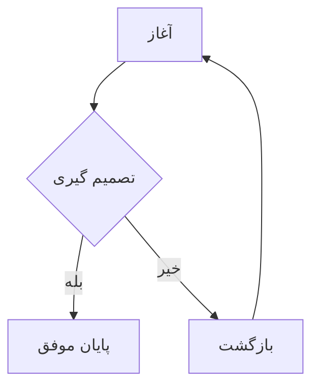
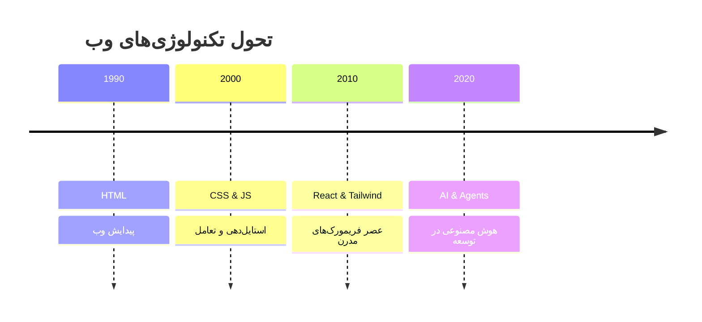
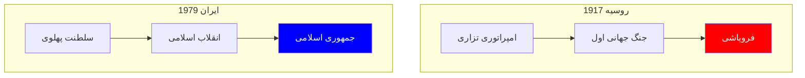

# مقایسه استایل‌های نمودار

این صفحه برای تست و مقایسه نحوه نمایش نمودارها در سناریوهای مختلف ایجاد شده است. هدف این است که ببینیم کدام حالت برای مقالات شما مناسب‌تر و تمیزتر است.

---

## ۱. حالت فعلی (Manual Wrapper)
در این حالت شما به صورت دستی از `
` استفاده کرده‌اید.
*   **مشکل:** اگر نمودار بزرگ باشد، به دلیل ویژگی‌های Flexbox ممکن است بی‌دلیل کوچک شود.
*   **کدنویسی:** شلوغ و تکراری.

---

## ۲. حالت پیشنهادی (Clean System - Automatic)
در این حالت هیچ تگ اضافی دور نمودار نیست. سیستم به طور خودکار آن را مرکزچین کرده و فواصل (Margins) را رعایت می‌کند.
*   **مزیت:** کد بسیار تمیز، نمایش پایدار در موبایل، و استفاده حداکثری از فضای مقاله.
*   **کدنویسی:** فقط بلاک کد معمولی.

---

## ۳. تست نمودار پیچیده و تعاملی
نمودارهایی که عرض زیادی دارند (مثل Timeline) اکنون با تولبار جدید ما قابل کنترل هستند. می‌توانید روی آن‌ها زوم کنید یا جابجا شوید.

---

## نتیجه‌گیری
پیشنهاد من استفاده از **حالت ۲** است. این حالت باعث می‌شود مقالات شما در آینده اگر تم یا ساختار سایت عوض شود، بدون تغییر کد، همیشه درست نمایش داده شوند.
