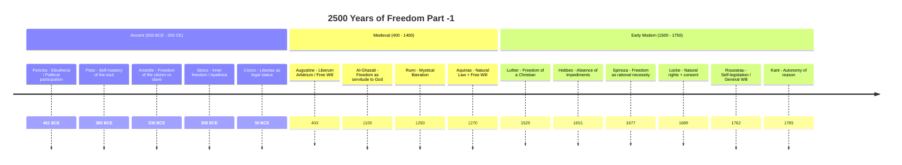
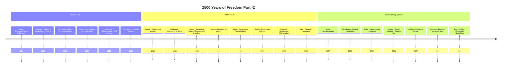
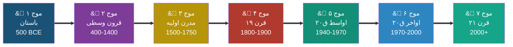
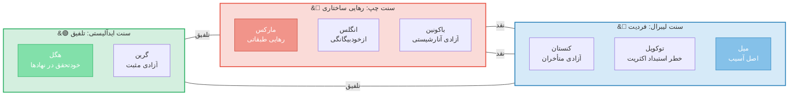
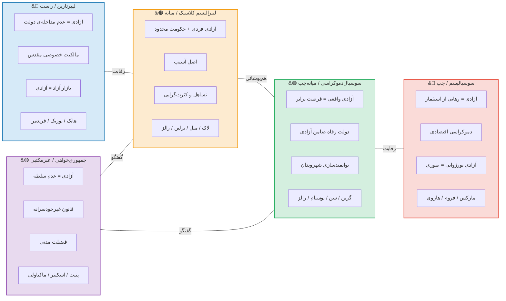

<div dir="rtl" lang="fa">
&#123;/*DOCTYPE html*/&#125;
<html lang="fa" dir="rtl">
<head>
<meta charset="UTF-8"/>
<meta name="viewport" content="width=device-width, initial-scale=1.0"/>
<title>آزادی به مثابه... | مهدی سالم | ۲۰۲۶</title>

&#123;/* Fonts */&#125;
<link rel="preconnect" href="https://fonts.googleapis.com"/>
<link href="https://fonts.googleapis.com/css2?family=Vazirmatn:wght@300;400;500;700;900&display=swap" rel="stylesheet"/>

&#123;/* Mermaid */&#125;


</head>
<body>

&#123;/* ═══════════════════ PAGE HEADER ═══════════════════ */&#125;
<header class="page-header">
  <h1>آزادی به مثابه&hellip;</h1>
  <div class="subtitle">جغرافیای مفهومی، تاریخ تعبیرسازی، و تحلیل انتقادی</div>
  <div class="meta">
    تهیه و تنظیم: <strong>مهدی سالم</strong> &nbsp;|&nbsp;
    ۲۲ فوریه ۲۰۲۶ &bull; ۳ اسفند ۱۴۰۴ &nbsp;|&nbsp;
    مقاله‌ی پژوهشی&ndash;تحلیلی
  </div>
</header>

<main class="container">

&#123;/* ═══════════════════ TOC ═══════════════════ */&#125;
 <details>
<summary class="no-print">&#128214; فهرست مطالب (برای کلیک) </summary>
<nav class="toc" id="toc">
  <h2>&#128214; فهرست مطالب</h2>
  <ol>
    <li>
    <a href="#sec1">بخش یکم: نگاه از بالا &mdash; نقشهی شماتیک آزادی</a>
      <ol>
        <li><a href="#sec1-1">خط زمانی ۲۵۰۰ ساله</a></li>
        <li><a href="#sec1-2">نقشهی مفهومی مکاتب</a></li>
        <li><a href="#sec1-3">خانواده‌های مفهومی آزادی</a></li>
        <li><a href="#sec1-4">ماتریس متفکران و ابعاد</a></li>
        <li><a href="#sec1-5">نقشه‌ی دشمنان مفهومی</a></li>
      </ol>
    </li>
    <li><a href="#sec2">بخش دوم: هفت موج تحول</a></li>
    <li><a href="#sec3">بخش سوم: آزادی در میان مکاتب و سنت‌های فکری</a></li>
    <li><a href="#sec4">بخش چهارم: تحلیل تفصیلی تعبیرسازی‌ها</a></li>
    <li><a href="#sec5">بخش پنجم: مفاهیم مجاور و مکمل</a></li>
    <li><a href="#sec6">بخش ششم: جدول آثار اصلی نظریه‌پردازان</a></li>
    <li><a href="#appA">پیوست الف: آزادی در سنت اسلامی&ndash;ایرانی</a></li>
    <li><a href="#appB">پیوست ب: نکات تحلیلی تکمیلی</a></li>
    <li><a href="#bib">کتاب‌شناسی و منابع</a></li>
  </ol>
</nav>
 </details>
&#123;/* ═══════════════════ SECTION 1 ═══════════════════ */&#125;
<section id="sec1">
<h2 class="section-title"><span class="num">۱</span> نگاه از بالا &mdash; نقشه‌ی شماتیک آزادی</h2>

<div class="info-box">
  <strong>&#127919; هدف این بخش:</strong>
  پیش از ورود به جزئیات، بیایید &laquo;نقشه‌ای از آسمان&raquo; ببینیم.
  در اینجا ۲۵۰۰ سال تعبیرسازی از آزادی را به شکل بصری مرور می‌کنیم
  تا خواننده تصویر کلان را در ذهن داشته باشد.
</div>

&#123;/* ─── 1.1 Timeline ─── */&#125;
<h3 id="sec1-1">۱.۱ خط زمانی ۲۵۰۰ ساله</h3>
  
**خط زمانی تحول مفهوم آزادی از یونان باستان  تا عصر مدرن اولیه**

  


  
<figcaption>شکل ۱ (بخش اول)&ndash;۱: خط زمانی ۲۵۰۰ ساله&zwnj;ی تحول تعبیرسازی از آزادی. هر نقطه نمایان‌گر لحظه‌ای کلیدی در بازتعریف مفهوم آزادی است.</figcaption>

</div>


  
**خط زمانی تحول مفهوم آزادی از مدرن اولیه تا کنون (عصر دیجیتال)**

  


  
<figcaption>شکل ۱ (بخش دوم) &ndash;۱: خط زمانی ۲۵۰۰ ساله&zwnj;ی تحول تعبیرسازی از آزادی. هر نقطه نمایان‌گر لحظه‌ای کلیدی در بازتعریف مفهوم آزادی است.</figcaption>

</div>
&#123;/* ─── 1.2 Mind Map of Schools ─── */&#125;
<h3 id="sec1-2">۱.۲ نقشه‌ی مفهومی مکاتب</h3>


  
**نقشه‌ی ذهنی: خانواده‌های فکری تعبیرسازی از آزادی**

  
```mermaid
mindmap
  root((FREEDOM)):::rootNode

    Negative Liberty:::branchNeg
      Hobbes:::nodeNeg
        Absence of external impediments:::textNeg
      Bentham:::nodeNeg
        Non-interference by law:::textNeg
      Constant:::nodeNeg
        Liberty of the Moderns:::textNeg
      Berlin:::nodeNeg
        Two Concepts of Liberty, 1958:::textNeg
      Hayek:::nodeNeg
        Spontaneous order:::textNeg
      Nozick:::nodeNeg
        Self-ownership:::textNeg

    Positive Liberty:::branchPos
      Rousseau:::nodePos
        General Will / Self-legislation:::textPos
      Kant:::nodePos
        Autonomy of practical reason:::textPos
      Hegel:::nodePos
        Ethical life / Self-realization:::textPos
      T.H. Green:::nodePos
        Rational self-direction:::textPos
      Taylor:::nodePos
        Authenticity / Strong evaluation:::textPos
      Marx:::nodePos
        Emancipation from alienation:::textPos

    Republican Liberty:::branchRep
      Cicero:::nodeRep
        Libertas = non-domination:::textRep
      Machiavelli:::nodeRep
        Civic virtue:::textRep
      Skinner:::nodeRep
        Neo-Roman liberty:::textRep
      Pettit:::nodeRep
        Freedom as non-domination:::textRep

    Existential Liberty:::branchEx
      Kierkegaard:::nodeEx
        Radical choice / Anxiety:::textEx
      Heidegger:::nodeEx
        Openness / Letting-be:::textEx
      Sartre:::nodeEx
        Condemned to be free:::textEx
      Arendt:::nodeEx
        Freedom as action / Natality:::textEx

    Capability Approach:::branchCap
      Sen:::nodeCap
        Substantive freedoms:::textCap
      Nussbaum:::nodeCap
        Human capabilities:::textCap

    Critical / Post:::branchCrit
      Foucault:::nodeCrit
        Resistance / Parrhesia:::textCrit
      Butler:::nodeCrit
        Performative subversion:::textCrit
      Fanon:::nodeCrit
        Decolonial liberation:::textCrit
      Spivak:::nodeCrit
        Subaltern agency:::textCrit
      Fricker:::nodeCrit
        Epistemic freedom:::textCrit

    Islamic-Iranian:::branchIr
      Quran:::nodeIr
        Fitrah / Taklif:::textIr
      Rumi-Sufism:::nodeIr
        Mystical liberation:::textIr
      Iranshahri:::nodeIr
        Justice vs despotism:::textIr
      Modern Muslim Thinkers:::nodeIr
        Shariati / Soroush / Nasr:::textIr
```

  
<figcaption>شکل ۱&ndash;۲: نقشه‌ی ذهنی مکاتب اصلی تعبیرسازی از آزادی. هر شاخه یک &laquo;خانواده‌ی مفهومی&raquo; را نمایش می‌دهد.</figcaption>

</div>

&#123;/* ─── 1.3 Family Classification ─── */&#125;
<h3 id="sec1-3">۱.۳ خانواده‌های مفهومی آزادی</h3>


  
**طبقه‌بندی خانوادگی: سه تعبیر بنیادین و شاخه‌های فرعی**

  
```mermaid
flowchart TB
    subgraph CORE["&#9733; سه تعبیر بنیادین"]
        direction TB
        NEG["&#128309; آزادی منفی<br/>Non-Interference<br/>عدم مداخله"]
        POS["&#128994; آزادی مثبت<br/>Self-Mastery<br/>خودآیینی"]
        REP["&#128992; آزادی جمهوری‌خواهانه<br/>Non-Domination<br/>عدم سلطه"]
    end

    subgraph NEG_FAM["خانواده‌ی آزادی منفی"]
        N1["هابز: عدم مانع خارجی"]
        N2["لاک: حقوق طبیعی"]
        N3["میل: اصل آسیب"]
        N4["برلین: فضای عمل"]
        N5["هایک: نظم خودجوش"]
        N6["نوزیک: مالکیت بر خود"]
    end

    subgraph POS_FAM["خانواده‌ی آزادی مثبت"]
        P1["روسو: اراده‌ی عمومی"]
        P2["کانت: خودقانون‌گذاری عقل"]
        P3["هگل: خودتحقق‌بخشی"]
        P4["گرین: خودهدایت‌گری عقلانی"]
        P5["مارکس: رهایی از بیگانگی"]
        P6["تیلور: اصالت و ارزیابی قوی"]
    end

    subgraph REP_FAM["خانواده‌ی جمهوری‌خواهانه"]
        R1["سیسرو: وضعیت حقوقی آزاد"]
        R2["ماکیاولی: فضیلت مدنی"]
        R3["اسکینر: آزادی نئورومی"]
        R4["پتیت: عدم سلطه"]
    end

    subgraph EXT["گسترش‌های معاصر"]
        E1["&#128995; اگزیستانسیال<br/>سارتر، آرنت"]
        E2["&#128311; توانمندی<br/>سن، نوسبام"]
        E3["&#128312; انتقادی/پسا<br/>فوکو، باتلر"]
        E4["&#11035; رابطه‌ای<br/>اوشانا، مک‌کنزی"]
    end

    NEG */} NEG_FAM
    POS */} POS_FAM
    REP */} REP_FAM
    CORE */} EXT

    style CORE fill:#f0f4f8,stroke:#1a5276,stroke-width:2px
    style NEG fill:#d6eaf8,stroke:#1a5276,stroke-width:2px,color:#1a5276
    style POS fill:#d4efdf,stroke:#148f77,stroke-width:2px,color:#0e6655
    style REP fill:#fdebd0,stroke:#b7950b,stroke-width:2px,color:#7d6608
    style NEG_FAM fill:#eaf2f8,stroke:#2980b9
    style POS_FAM fill:#eafaf1,stroke:#27ae60
    style REP_FAM fill:#fef9e7,stroke:#f1c40f
    style EXT fill:#f4ecf7,stroke:#8e44ad
    style E1 fill:#fadbd8,stroke:#e74c3c
    style E2 fill:#d0ece7,stroke:#1abc9c
    style E3 fill:#e8daef,stroke:#8e44ad
    style E4 fill:#d5d8dc,stroke:#566573
```

  
<figcaption>شکل ۱&ndash;۳: طبقه‌بندی خانوادگی تعابیر آزادی. سه تعبیر بنیادین (منفی، مثبت، جمهوری‌خواهانه) در مرکز قرار دارند.</figcaption>

</div>

&#123;/* ─── 1.4 Thinker × Dimension Matrix ─── */&#125;
<h3 id="sec1-4">۱.۴ ماتریس متفکران و ابعاد آزادی</h3>

<div class="info-box">
  هر خانه نشان می‌دهد که آیا آن متفکر، آن بُعد از آزادی را
  <span class="badge badge-green">&#9679; پذیرفته</span>،
  <span class="badge badge-red">&#9675; رد کرده</span>، یا
  <span class="badge badge-gold">&#9681; تا حدی پذیرفته</span> است.
</div>

<div>
<table>
<thead>
<tr>
  <th>متفکر</th>
  <th>عدم مداخله</th>
  <th>خودآیینی</th>
  <th>عدم سلطه</th>
  <th>خودشکوفایی</th>
  <th>رهایی طبقاتی</th>
  <th>توانمندی</th>
  <th>انتخاب وجودی</th>
  <th>مقاومت</th>
</tr>
</thead>
<tbody>
<tr>
  <td><strong>هابز</strong></td>
  <td>&#9679;</td>
  <td>&#9675;</td>
  <td>&#9675;</td>
  <td>&#9675;</td>
  <td>&#9675;</td>
  <td>&#9675;</td>
  <td>&#9675;</td>
  <td>&#9675;</td>
</tr>
<tr>
  <td><strong>لاک</strong></td>
  <td>&#9679;</td>
  <td>&#9681;</td>
  <td>&#9681;</td>
  <td>&#9675;</td>
  <td>&#9675;</td>
  <td>&#9675;</td>
  <td>&#9675;</td>
  <td>&#9681;</td>
</tr>
<tr>
  <td><strong>روسو</strong></td>
  <td>&#9675;</td>
  <td>&#9679;</td>
  <td>&#9679;</td>
  <td>&#9679;</td>
  <td>&#9681;</td>
  <td>&#9675;</td>
  <td>&#9675;</td>
  <td>&#9675;</td>
</tr>
<tr>
  <td><strong>کانت</strong></td>
  <td>&#9681;</td>
  <td>&#9679;</td>
  <td>&#9681;</td>
  <td>&#9681;</td>
  <td>&#9675;</td>
  <td>&#9675;</td>
  <td>&#9675;</td>
  <td>&#9675;</td>
</tr>
<tr>
  <td><strong>هگل</strong></td>
  <td>&#9675;</td>
  <td>&#9679;</td>
  <td>&#9681;</td>
  <td>&#9679;</td>
  <td>&#9681;</td>
  <td>&#9675;</td>
  <td>&#9675;</td>
  <td>&#9675;</td>
</tr>
<tr>
  <td><strong>میل</strong></td>
  <td>&#9679;</td>
  <td>&#9681;</td>
  <td>&#9675;</td>
  <td>&#9679;</td>
  <td>&#9675;</td>
  <td>&#9681;</td>
  <td>&#9675;</td>
  <td>&#9675;</td>
</tr>
<tr>
  <td><strong>مارکس</strong></td>
  <td>&#9675;</td>
  <td>&#9681;</td>
  <td>&#9679;</td>
  <td>&#9679;</td>
  <td>&#9679;</td>
  <td>&#9681;</td>
  <td>&#9675;</td>
  <td>&#9679;</td>
</tr>
<tr>
  <td><strong>سارتر</strong></td>
  <td>&#9681;</td>
  <td>&#9679;</td>
  <td>&#9675;</td>
  <td>&#9681;</td>
  <td>&#9681;</td>
  <td>&#9675;</td>
  <td>&#9679;</td>
  <td>&#9679;</td>
</tr>
<tr>
  <td><strong>برلین</strong></td>
  <td>&#9679;</td>
  <td>&#9675;</td>
  <td>&#9681;</td>
  <td>&#9675;</td>
  <td>&#9675;</td>
  <td>&#9675;</td>
  <td>&#9675;</td>
  <td>&#9675;</td>
</tr>
<tr>
  <td><strong>آرنت</strong></td>
  <td>&#9675;</td>
  <td>&#9681;</td>
  <td>&#9679;</td>
  <td>&#9681;</td>
  <td>&#9675;</td>
  <td>&#9675;</td>
  <td>&#9679;</td>
  <td>&#9681;</td>
</tr>
<tr>
  <td><strong>رالز</strong></td>
  <td>&#9679;</td>
  <td>&#9679;</td>
  <td>&#9681;</td>
  <td>&#9681;</td>
  <td>&#9675;</td>
  <td>&#9681;</td>
  <td>&#9675;</td>
  <td>&#9675;</td>
</tr>
<tr>
  <td><strong>سن</strong></td>
  <td>&#9681;</td>
  <td>&#9679;</td>
  <td>&#9679;</td>
  <td>&#9679;</td>
  <td>&#9681;</td>
  <td>&#9679;</td>
  <td>&#9675;</td>
  <td>&#9681;</td>
</tr>
<tr>
  <td><strong>پتیت</strong></td>
  <td>&#9681;</td>
  <td>&#9681;</td>
  <td>&#9679;</td>
  <td>&#9675;</td>
  <td>&#9675;</td>
  <td>&#9681;</td>
  <td>&#9675;</td>
  <td>&#9681;</td>
</tr>
<tr>
  <td><strong>فوکو</strong></td>
  <td>&#9675;</td>
  <td>&#9681;</td>
  <td>&#9679;</td>
  <td>&#9681;</td>
  <td>&#9681;</td>
  <td>&#9675;</td>
  <td>&#9681;</td>
  <td>&#9679;</td>
</tr>
</tbody>
</table>
</div>

<div class="info-box warning">
  <strong>&#128161; کلید خوانش ماتریس:</strong>
  ستون‌ها ابعاد هشت‌گانه‌ی آزادی هستند؛ سطرها متفکران اصلی.
  این ماتریس یک &laquo;عکس فوری&raquo; از موضع هر متفکر است و لزوماً پیچیدگی‌های نظریه‌ی او را بازنمی‌تاباند.
  در <a href="#sec4">بخش چهارم</a> هر موضع به تفصیل واکاوی خواهد شد.
</div>

&#123;/* ─── 1.5 Conceptual Enemies ─── */&#125;
<h3 id="sec1-5">۱.۵ نقشه‌ی دشمنان مفهومی آزادی</h3>

<p>
  هر تعبیر از آزادی در تقابل با یک &laquo;دشمن مفهومی&raquo; شکل گرفته است.
  نقشه‌ی زیر نشان می‌دهد که هر تعبیر چه چیزی را <em>نفی</em> می‌کند.
</p>


  
**نقشه‌ی دشمنان مفهومی: هر تعبیر آزادی چه چیزی را نفی می‌کند؟**

```mermaid
flowchart TB
    subgraph FREEDOM["&#128154; تعابیر آزادی"]
        F1["عدم مداخله<br/>(هابز، میل، برلین)"]
        F2["خودآیینی<br/>(کانت، روسو)"]
        F3["عدم سلطه<br/>(پتیت، اسکینر)"]
        F4["رهایی طبقاتی<br/>(مارکس)"]
        F5["انتخاب وجودی<br/>(سارتر)"]
        F6["توانمندی<br/>(سن، نوسبام)"]
        F7["مقاومت<br/>(فوکو، باتلر)"]
        F8["کنش سیاسی<br/>(آرنت)"]
        F9["شناسایی<br/>(تیلور، هونت)"]
    end

    subgraph ENEMIES["&#128308; دشمنان مفهومی"]
        E1["&#9940; مداخله / اجبار<br/>Coercion"]
        E2["&#9940; هترونومی / تابعیت<br/>Heteronomy"]
        E3["&#9940; سلطه / اقتدار خودسرانه<br/>Domination"]
        E4["&#9940; از خودبیگانگی / استثمار<br/>Alienation"]
        E5["&#9940; بدایمانی / خودفریبی<br/>Bad Faith"]
        E6["&#9940; محرومیت / ناتوانی<br/>Deprivation"]
        E7["&#9940; انقیاد / هنجارسازی<br/>Subjection"]
        E8["&#9940; بی‌جهانی / انزوا<br/>Worldlessness"]
        E9["&#9940; تحقیر / نادیده‌انگاری<br/>Misrecognition"]
    end

    F1 ---|"نفی"| E1
    F2 ---|"نفی"| E2
    F3 ---|"نفی"| E3
    F4 ---|"نفی"| E4
    F5 ---|"نفی"| E5
    F6 ---|"نفی"| E6
    F7 ---|"نفی"| E7
    F8 ---|"نفی"| E8
    F9 ---|"نفی"| E9

    style FREEDOM fill:#eaf2f8,stroke:#2980b9,stroke-width:2px
    style ENEMIES fill:#fdedec,stroke:#e74c3c,stroke-width:2px
    style F1 fill:#d6eaf8,stroke:#2980b9,color:#1a5276
    style F2 fill:#d4efdf,stroke:#27ae60,color:#0e6655
    style F3 fill:#fdebd0,stroke:#f39c12,color:#7d6608
    style F4 fill:#fadbd8,stroke:#e74c3c,color:#922b21
    style F5 fill:#e8daef,stroke:#8e44ad,color:#6c3483
    style F6 fill:#d0ece7,stroke:#1abc9c,color:#0e6655
    style F7 fill:#f5eef8,stroke:#9b59b6,color:#6c3483
    style F8 fill:#fef9e7,stroke:#f1c40f,color:#7d6608
    style F9 fill:#ebf5fb,stroke:#3498db,color:#1a5276
    style E1 fill:#f9ebea,stroke:#cb4335,color:#922b21
    style E2 fill:#f9ebea,stroke:#cb4335,color:#922b21
    style E3 fill:#f9ebea,stroke:#cb4335,color:#922b21
    style E4 fill:#f9ebea,stroke:#cb4335,color:#922b21
    style E5 fill:#f9ebea,stroke:#cb4335,color:#922b21
    style E6 fill:#f9ebea,stroke:#cb4335,color:#922b21
    style E7 fill:#f9ebea,stroke:#cb4335,color:#922b21
    style E8 fill:#f9ebea,stroke:#cb4335,color:#922b21
    style E9 fill:#f9ebea,stroke:#cb4335,color:#922b21
```

  


  
<figcaption>شکل ۱&ndash;۵: هر تعبیر از آزادی، &laquo;دشمن&raquo; خاص خود را دارد. شناخت این دشمنان برای فهم دقیق هر نظریه ضروری است.</figcaption>

</div>

<div class="card accent-right">
  <h4>&#128269; نکته‌ی تحلیلی: چرا &laquo;دشمن&raquo; مهم است؟</h4>
  <p>
    جرالد مک‌کالوم (Gerald MacCallum) در مقاله‌ی مشهور خود (۱۹۶۷) نشان داد که
    هر گزاره درباره‌ی آزادی دارای ساختار سه‌گانه است:
    <strong>X از Y آزاد است تا Z را انجام دهد</strong>
    &mdash; یعنی فاعل (X)، مانع (Y)، و هدف (Z).
    تفاوت نظریه‌ها در این است که Y و Z را چگونه تعریف می‌کنند.
  </p>
  <p>
    &#128218; MacCallum, G. (1967). "Negative and Positive Freedom."
    <em>Philosophical Review</em>, 76(3), 312&ndash;334.
  </p>
</div>

</section>


&#123;/* ═══════════════════ SECTION 2 ═══════════════════ */&#125;
<section id="sec2">
<h2 class="section-title"><span class="num">۲</span> هفت موج تحول در مفهوم آزادی</h2>

<div class="info-box">
  <strong>&#127754; روش‌شناسی &laquo;موج&raquo;:</strong>
  تاریخ تعبیرسازی از آزادی را به هفت &laquo;موج&raquo; تقسیم می‌کنیم.
  هر موج در پاسخ به <em>بحرانی تاریخی</em> و در <em>جدالی فکری</em> شکل گرفته
  و <em>نتایج نهادی</em> مشخصی داشته است:
  <strong>زمینه‌ها &rarr; نظریه &rarr; نتایج &rarr; نقد</strong>.
</div>


  
**نمای کلی: هفت موج و جریان تحول**

  


</div>


  
**نمودار هفت موج تحول مفهوم آزادی**

  
```mermaid
flowchart TB
    W1["&#127754; موج ۱<br/>باستان<br/>500 BCE"]
    W2["&#127754; موج ۲<br/>قرون وسطی<br/>400-1400"]
    W3["&#127754; موج ۳<br/>مدرن اولیه<br/>1500-1750"]
    W4["&#127754; موج ۴<br/>قرن ۱۹<br/>1800-1900"]
    W5["&#127754; موج ۵<br/>اواسط قرن ۲۰<br/>1940-1970"]
    W6["&#127754; موج ۶<br/>اواخر قرن ۲۰<br/>1970-2000"]
    W7["&#127754; موج ۷<br/>قرن ۲۱<br/>2000+"]

    W1 */} W2 */} W3 */} W4 */} W5 */} W6 */} W7

    W1 --- C1["بردگی / شهروندی<br/>&#127963; پولیس یونانی"]
    W2 --- C2["اختیار / تقدیر<br/>&#9969; الهیات"]
    W3 --- C3["حقوق طبیعی / قرارداد<br/>&#9878; انقلاب‌ها"]
    W4 --- C4["فردیت / رهایی طبقاتی<br/>&#127981; صنعتی‌شدن"]
    W5 --- C5["منفی / مثبت<br/>&#127758; جنگ سرد"]
    W6 --- C6["توانمندی / شناسایی<br/>&#9994; جنبش‌های حقوقی"]
    W7 --- C7["دیجیتال / بوم‌شناختی<br/>&#128187; فضای مجازی"]

    style W1 fill:#1a5276,color:#fff,stroke:#154360
    style W2 fill:#7d3c98,color:#fff,stroke:#6c3483
    style W3 fill:#b7950b,color:#fff,stroke:#9a7d0a
    style W4 fill:#b03a2e,color:#fff,stroke:#922b21
    style W5 fill:#148f77,color:#fff,stroke:#0e6655
    style W6 fill:#2e86c1,color:#fff,stroke:#2874a6
    style W7 fill:#17a589,color:#fff,stroke:#138d75
    style C1 fill:#d6eaf8,stroke:#2980b9
    style C2 fill:#e8daef,stroke:#8e44ad
    style C3 fill:#fdebd0,stroke:#f39c12
    style C4 fill:#fadbd8,stroke:#e74c3c
    style C5 fill:#d4efdf,stroke:#27ae60
    style C6 fill:#d6eaf8,stroke:#2980b9
    style C7 fill:#d0ece7,stroke:#1abc9c
```

  
<figcaption>شکل ۲&ndash;۱:  (با تفصیل) هفت موج تحول مفهوم آزادی و زمینه‌های تاریخی هر موج</figcaption>

</div>
&#123;/* ════════ WAVE 1 ════════ */&#125;
<div class="wave-card" id="wave1">
  <div class="wave-num">۱</div>
  <h3>موج اول: از بردگی تا شهروندی <span class="badge badge-blue">یونان و روم باستان &#8226; ۵۰۰ ق.م&ndash;۳۰۰ م</span></h3>

  <h4>&#128204; زمینه‌ی تاریخی</h4>
  <p>
    در یونان باستان، آزادی (<em>eleutheria</em>) پیش از آنکه مفهومی فلسفی باشد،
    <strong>وضعیتی اجتماعی&ndash;حقوقی</strong> بود: آزاد کسی بود که برده نبود.
    جنگ‌های ایران و یونان (۴۹۰&ndash;۴۷۹ ق.م) نخستین بار تمایز &laquo;آزاد/بنده&raquo; را
    به سطح گفتمان سیاسی آورد. هرودوت یونانیان را &laquo;آزاد&raquo; و ایرانیان را
    &laquo;بندگان شاه&raquo; خواند&mdash;تقابلی که بیش از واقعیت، ابزار هویت‌سازی بود
    (ر.ک. <a href="#appA">پیوست الف</a> برای نقد این روایت از منظر ایرانشهری).
  </p>

  <h4>&#128218; نظریه‌ها</h4>
  <table>
    <thead><tr><th>متفکر</th><th>تعبیر آزادی</th><th>اثر کلیدی</th><th>گزاره‌ی محوری</th></tr></thead>
    <tbody>
      <tr><td>ارسطو</td><td>مشارکت سیاسی</td><td><em>سیاست</em></td><td>آزادی = به‌نوبت فرمان‌دادن و فرمان‌بردن (۱۳۱۷a)</td></tr>
      <tr><td>افلاطون</td><td>خودبسندگی نفس</td><td><em>جمهور</em> کتاب ۴</td><td>آزادی = حکومت عقل بر شهوت و غضب</td></tr>
      <tr><td>اپیکتتوس</td><td>آزادی درونی</td><td><em>گفتارها</em></td><td>آزاد کسی است که فقط به آنچه در اختیار اوست بیندیشد</td></tr>
      <tr><td>سیسرو</td><td>وضعیت حقوقی</td><td><em>درباره‌ی جمهوری</em></td><td>Libertas = عدم وابستگی به اراده‌ی خودسرانه‌ی دیگری</td></tr>
    </tbody>
  </table>

  <h4>&#9940; دشمن مفهومی</h4>
  <p><span class="badge badge-red">بردگی (douleia)</span> <span class="badge badge-red">استبداد (tyrannis)</span> <span class="badge badge-red">بربریت</span></p>

  <h4>&#128200; نتایج و نقد</h4>
  <div class="card accent-primary">
    <strong>نتایج نهادی:</strong> دموکراسی آتنی، جمهوری روم، حقوق شهروندی.<br/>
    <strong>نقد اصلی:</strong> آزادی یونانی <em>انحصاری</em> بود&mdash;بردگان، زنان، و بیگانگان محروم بودند.
    آزادی رواقی جهان‌شمول بود ولی با <em>پذیرش وضع موجود</em> و کناره‌گیری از سیاست همراه بود.
  </div>
</div>

&#123;/* ════════ WAVE 2 ════════ */&#125;
<div class="wave-card" id="wave2">
  <div class="wave-num">۲</div>
  <h3>موج دوم: اختیار و اراده <span class="badge badge-purple">قرون وسطی &#8226; ۴۰۰&ndash;۱۴۰۰ م</span></h3>

  <h4>&#128204; زمینه‌ی تاریخی</h4>
  <p>
    با ظهور مسیحیت و اسلام، پرسش از آزادی از حوزه‌ی <em>سیاسی</em> به حوزه‌ی
    <strong>الهیاتی و متافیزیکی</strong> منتقل شد. مسئله‌ی محوری این بود:
    اگر خداوند عالِم مطلق و قادر مطلق است، انسان چگونه می‌تواند <em>مختار</em> باشد؟
    این پرسش در مسیحیت به مسئله‌ی <em>liberum arbitrium</em> (اختیار آزاد) و
    در اسلام به جدال <em>جبر و اختیار</em> (قدریه، جبریه، اشاعره، معتزله) انجامید.
  </p>

  <h4>&#128218; نظریه‌ها</h4>
  <table>
    <thead><tr><th>متفکر</th><th>سنت</th><th>تعبیر آزادی</th><th>گزاره‌ی محوری</th></tr></thead>
    <tbody>
      <tr><td>آگوستین</td><td>مسیحی</td><td>اختیار آزاد</td><td>اراده آزاد است ولی به‌دلیل گناه اولیه به سوی شر تمایل دارد؛ نجات فقط با فیض الهی ممکن است</td></tr>
      <tr><td>آکویناس</td><td>مسیحی</td><td>قانون طبیعی + اختیار</td><td>عقل انسان قادر به کشف قانون طبیعی است؛ آزادی = انتخاب مطابق عقل و قانون الهی</td></tr>
      <tr><td>معتزله</td><td>اسلامی</td><td>عدل و اختیار</td><td>انسان خالق افعال خویش است؛ بدون اختیار، عدالت الهی بی‌معنا می‌شود</td></tr>
      <tr><td>اشاعره</td><td>اسلامی</td><td>کسب</td><td>خداوند خالق فعل است؛ انسان &laquo;کاسب&raquo; فعل است (نظریه‌ی کسب)</td></tr>
      <tr><td>غزالی</td><td>اسلامی&ndash;عرفانی</td><td>آزادی = بندگی خدا</td><td>آزادی حقیقی رهایی از بندگی نَفس و سلوک به‌سوی خداست</td></tr>
      <tr><td>مولانا</td><td>عرفان اسلامی</td><td>رهایی روح</td><td>&laquo;من بنده‌ی آنم که آزادی دهد&raquo;&mdash;رهایی در فنای فی‌الله</td></tr>
    </tbody>
  </table>

  <h4>&#9940; دشمن مفهومی</h4>
  <p>
    <span class="badge badge-red">جبر (determinism)</span>
    <span class="badge badge-red">گناه / نَفس</span>
    <span class="badge badge-red">جهل و غفلت</span>
  </p>

  <h4>&#128200; نتایج و نقد</h4>
  <div class="card accent-primary">
    <strong>نتایج:</strong> مفهوم <em>وجدان آزاد</em> (آزادی درونی ایمان)،
    زمینه‌سازی برای &laquo;آزادی وجدان&raquo; دوره‌ی مدرن، عرفان به‌مثابه تجربه‌ی رهایی.<br/>
    <strong>نقد:</strong> آزادی به حوزه‌ی <em>درونی/متافیزیکی</em> محدود ماند.
    نظام‌های سیاسی قرون‌وسطایی (فئودالیسم، خلافت) به‌ندرت آزادی سیاسی فراهم می‌کردند.
    عرفان با همه‌ی زیبایی‌اش، گاه به <strong>بی‌اعتنایی به ستم سیاسی</strong> منجر شد.
  </div>
</div>

&#123;/* ════════ WAVE 3 ════════ */&#125;
<div class="wave-card" id="wave3">
  <div class="wave-num">۳</div>
  <h3>موج سوم: حقوق طبیعی و قرارداد اجتماعی <span class="badge badge-gold">مدرن اولیه &#8226; ۱۵۰۰&ndash;۱۷۸۹</span></h3>

  <h4>&#128204; زمینه‌ی تاریخی</h4>
  <p>
    اصلاحات دینی (لوتر، ۱۵۱۷)، جنگ‌های مذهبی اروپا، انقلاب باشکوه انگلستان (۱۶۸۸)،
    و عصر روشنگری بستر تحول بزرگی شدند. پرسش محوری این بود:
    <strong>مشروعیت حکومت از کجا می‌آید؟</strong> و <strong>حدود اقتدار دولت بر فرد کجاست؟</strong>
    آزادی از حوزه‌ی الهیات به حوزه‌ی <em>حقوق طبیعی و فلسفه‌ی سیاسی</em> بازگشت.
  </p>

  <h4>&#128218; نظریه‌ها</h4>
  <table>
    <thead><tr><th>متفکر</th><th>تعبیر آزادی</th><th>اثر کلیدی</th><th>گزاره‌ی محوری</th></tr></thead>
    <tbody>
      <tr><td>هابز (۱۶۵۱)</td><td>عدم مانع خارجی</td><td><em>لویاتان</em></td><td>آزادی = نبودِ موانع بیرونیِ حرکت. در وضع طبیعی آزادی مطلق ولی ناامن است.</td></tr>
      <tr><td>لاک (۱۶۸۹)</td><td>حقوق طبیعی + رضایت</td><td><em>دو رساله در حکومت</em></td><td>آزادی = عدم تابعیتِ اراده‌ی خودسرانه‌ی دیگری + حقوق زندگی، آزادی، و مالکیت</td></tr>
      <tr><td>اسپینوزا (۱۶۷۷)</td><td>آزادی عقلانی</td><td><em>اخلاق</em></td><td>آزاد کسی است که فقط از ضرورت طبیعت خود عمل کند = شناخت عقلانی</td></tr>
      <tr><td>روسو (۱۷۶۲)</td><td>خودقانون‌گذاری</td><td><em>قرارداد اجتماعی</em></td><td>&laquo;اطاعت از قانونی که خود وضع کرده‌ای، آزادی است&raquo;</td></tr>
      <tr><td>کانت (۱۷۸۵)</td><td>خودآیینی عقل</td><td><em>بنیاد مابعدالطبیعه‌ی اخلاق</em></td><td>آزادی = عمل بر طبق قانونی که عقل عملی خودْ وضع می‌کند (خودآیینی)</td></tr>
    </tbody>
  </table>

  

    
**جریان تأثیر و تأثر در موج سوم**

    
```mermaid
flowchart LR
    LUTHER["لوتر\nآزادی وجدان\n1517"] */} LOCKE
    GROTIUS["گروتیوس\nحقوق طبیعی\n1625"] */} HOBBES
    GROTIUS */} LOCKE

    HOBBES["هابز\nعدم مانع\n1651"] */} LOCKE["لاک\nحقوق طبیعی\n1689"]
    HOBBES */} ROUSSEAU

    LOCKE */} ROUSSEAU["روسو\nاراده عمومی\n1762"]
    LOCKE */} AMER["انقلاب آمریکا\n1776"]

    SPINOZA["اسپینوزا\nآزادی عقلانی\n1677"] */} KANT

    ROUSSEAU */} KANT["کانت\nخودآیینی\n1785"]
    ROUSSEAU */} FRENCH["انقلاب فرانسه\n1789"]

    LOCKE */} FRENCH
    KANT */} HEGEL["هگل ← موج ۴"]

    style HOBBES fill:#d6eaf8,stroke:#2980b9
    style LOCKE fill:#d4efdf,stroke:#27ae60
    style ROUSSEAU fill:#fdebd0,stroke:#f39c12
    style KANT fill:#e8daef,stroke:#8e44ad
    style SPINOZA fill:#d0ece7,stroke:#1abc9c
    style LUTHER fill:#fadbd8,stroke:#e74c3c
    style GROTIUS fill:#f5eef8,stroke:#9b59b6
    style AMER fill:#fef9e7,stroke:#f1c40f,stroke-width:3px
    style FRENCH fill:#fef9e7,stroke:#f1c40f,stroke-width:3px
```

    
<figcaption>شکل ۲&ndash;۲: شبکه‌ی تأثیر و تأثر متفکران موج سوم و پیوند آن‌ها با انقلاب‌های بزرگ</figcaption>

  </div>

  <h4>&#9940; دشمن مفهومی</h4>
  <p>
    <span class="badge badge-red">استبداد مطلقه (absolutism)</span>
    <span class="badge badge-red">تعصب مذهبی (intolerance)</span>
    <span class="badge badge-red">اقتدار خودسرانه (arbitrary power)</span>
  </p>

  <h4>&#128200; نتایج و نقد</h4>
  <div class="card accent-gold">
    <strong>نتایج نهادی:</strong> اعلامیه‌ی حقوق ویرجینیا (۱۷۷۶)، اعلامیه‌ی حقوق بشر و شهروند فرانسه (۱۷۸۹)، قانون اساسی آمریکا (Bill of Rights, ۱۷۹۱).<br/>
    <strong>تنش درونی:</strong> تقابل هابز (آزادی = عدم مانع، سازگار با دولت قوی) و لاک (آزادی = محدودیت دولت) هسته‌ی جدال لیبرالیسم و اقتدارگرایی شد.<br/>
    <strong>نقد:</strong> روسو و کانت آزادی را &laquo;اخلاقی&raquo; کردند و راه را برای سوءاستفاده‌ی احتمالی باز کردند: اگر &laquo;آزادی واقعی = اطاعت از اراده‌ی عمومی&raquo;، می‌توان کسی را &laquo;مجبور به آزاد بودن&raquo; کرد &mdash; هشداری که برلین دو قرن بعد جدی گرفت.
  </div>
</div>

&#123;/* ════════ WAVE 4 ════════ */&#125;
<div class="wave-card" id="wave4">
  <div class="wave-num">۴</div>
  <h3>موج چهارم: فردیت و رهایی <span class="badge badge-red">قرن نوزدهم &#8226; ۱۸۰۰&ndash;۱۹۰۰</span></h3>

  <h4>&#128204; زمینه‌ی تاریخی</h4>
  <p>
    انقلاب صنعتی، ظهور طبقه‌ی کارگر، شهرنشینی انبوه، و استعمار اروپایی
    بافت جدیدی به مسئله‌ی آزادی بخشید. از یک سو، <strong>لیبرال‌ها</strong> (میل، کنستان، توکویل)
    نگران سلطه‌ی اکثریت و دولت بر فرد بودند؛ از سوی دیگر، <strong>سوسیالیست‌ها</strong> (مارکس، انگلس)
    آزادی صوری لیبرالی را &laquo;بورژوایی&raquo; و فریبکارانه می‌دانستند.
    بنیامین کنستان (۱۸۱۹) نخستین بار تمایز &laquo;آزادی قدما&raquo; (مشارکت سیاسی) و
    &laquo;آزادی متأخران&raquo; (عدم مداخله) را صورت‌بندی کرد.
  </p>

  <h4>&#128218; نظریه‌ها</h4>
  <table>
    <thead><tr><th>متفکر</th><th>تعبیر</th><th>اثر</th><th>گزاره‌ی محوری</th></tr></thead>
    <tbody>
      <tr><td>کنستان (۱۸۱۹)</td><td>آزادی متأخران</td><td><em>درباره آزادی قدما و متأخران</em></td><td>آزادی مدرن = بهره‌مندی آرام از استقلال خصوصی، نه مشارکت مستقیم</td></tr>
      <tr><td>هگل (۱۸۲۱)</td><td>خودتحقق‌بخشی</td><td><em>فلسفه‌ی حق</em></td><td>آزادی نه در انزوا بلکه در نهادهای اخلاقی (خانواده، جامعه مدنی، دولت) محقق می‌شود</td></tr>
      <tr><td>میل (۱۸۵۹)</td><td>فردیت + عدم آسیب</td><td><em>درباره‌ی آزادی</em></td><td>تنها دلیل مشروع برای محدود کردن آزادی فرد، جلوگیری از آسیب به دیگران است</td></tr>
      <tr><td>مارکس (۱۸۴۴)</td><td>رهایی از بیگانگی</td><td><em>دست‌نوشته‌های اقتصادی-فلسفی</em></td><td>آزادی بورژوایی صوری است؛ آزادی واقعی = رهایی از استثمار و ازخودبیگانگی</td></tr>
      <tr><td>نیچه (۱۸۸۶)</td><td>خلق ارزش</td><td><em>فراسوی نیک و بد</em></td><td>آزادی = قدرت خلق ارزش‌های نو؛ &laquo;آزاد برای چه؟&raquo; مهم‌تر از &laquo;آزاد از چه؟&raquo;</td></tr>
      <tr><td>گرین (۱۸۸۶)</td><td>آزادی مثبت</td><td><em>سخنرانی درباره مبانی تعهد سیاسی</em></td><td>آزادی = توانایی واقعی برای انجام آنچه ارزش انجام دادن دارد</td></tr>
    </tbody>
  </table>

  

    
**دوگانه‌ی بزرگ قرن نوزدهم: فرد در برابر ساختار**

    


    
<figcaption>شکل ۲&ndash;۳: تقابل بنیادین قرن نوزدهم: آزادی فردی (لیبرال) در مقابل رهایی ساختاری (چپ) و تلاش ایدآلیست‌ها برای تلفیق</figcaption>

  </div>

  <h4>&#9940; دشمن مفهومی</h4>
  <p>
    <span class="badge badge-red">استبداد اکثریت (tyranny of majority)</span>
    <span class="badge badge-red">استثمار (exploitation)</span>
    <span class="badge badge-red">ازخودبیگانگی (alienation)</span>
    <span class="badge badge-red">یکسان‌سازی (conformity)</span>
  </p>

  <h4>&#128200; نتایج و نقد</h4>
  <div class="card accent-right">
    <strong>نتایج:</strong> حق رأی عمومی (تدریجی)، قانون‌گذاری کار، نهضت‌های کارگری، لغو برده‌داری.<br/>
    <strong>تنش پایدار:</strong> آیا آزادیِ واقعی، <em>عدم مداخله</em> است (میل) یا <em>شرایط مادی رشد</em> (مارکس، گرین)؟ این تنش تا امروز ادامه دارد.<br/>
    <strong>نقد مارکس به لیبرال‌ها:</strong> &laquo;آزادی بورژوایی = آزادیِ مالکیت خصوصی = آزادیِ استثمار.&raquo;<br/>
    <strong>نقد میل به اکثریت‌گرایان:</strong> &laquo;استبداد اجتماعی ممکن است از استبداد سیاسی هم خطرناک‌تر باشد.&raquo;
  </div>
</div>

&#123;/* ════════ WAVE 5 ════════ */&#125;
<div class="wave-card" id="wave5">
  <div class="wave-num">۵</div>
  <h3>موج پنجم: آزادی منفی در برابر مثبت <span class="badge badge-green">اواسط قرن بیستم &#8226; ۱۹۴۰&ndash;۱۹۷۰</span></h3>

  <h4>&#128204; زمینه‌ی تاریخی</h4>
  <p>
    جنگ جهانی دوم، ظهور توتالیتاریسم (فاشیسم و استالینیسم)، و آغاز جنگ سرد
    بحران عمیقی در اندیشه‌ی آزادی ایجاد کرد. چگونه ایدئولوژی‌هایی که مدعی
    &laquo;آزادی واقعی&raquo; بودند (مارکسیسم-لنینیسم، فاشیسم)، به بدترین اشکال بردگی انجامیدند؟
    <strong>آیزایا برلین</strong> در سخنرانی مشهور خود (۱۹۵۸) پاسخی تأثیرگذار داد.
  </p>

  <h4>&#128218; نظریه‌ها</h4>
  <table>
    <thead><tr><th>متفکر</th><th>تعبیر</th><th>اثر</th><th>گزاره‌ی محوری</th></tr></thead>
    <tbody>
      <tr><td>برلین (۱۹۵۸)</td><td>منفی vs مثبت</td><td><em>دو مفهوم آزادی</em></td><td>آزادی منفی = &laquo;آزادی از&raquo; مداخله؛ مثبت = &laquo;آزادی برای&raquo; خودحکمرانی. مثبت مستعد سوءاستفاده‌ی توتالیتر.</td></tr>
      <tr><td>سارتر (۱۹۴۳)</td><td>انتخاب وجودی</td><td><em>هستی و نیستی</em></td><td>&laquo;انسان محکوم به آزادی است&raquo;&mdash;آزادی ذات آگاهی است، نه حقی اعطاشده.</td></tr>
      <tr><td>آرنت (۱۹۵۸/۱۹۶۱)</td><td>کنش سیاسی</td><td><em>وضع بشر</em> / <em>میان گذشته و آینده</em></td><td>آزادی نه در فکر بلکه در <em>کنش</em> با دیگران در فضای عمومی تحقق می‌یابد.</td></tr>
      <tr><td>هایک (۱۹۶۰)</td><td>عدم اجبار</td><td><em>قانون اساسی آزادی</em></td><td>آزادی = وضعیتی که شخص تابع اجبار خودسرانه‌ی دیگری نباشد.</td></tr>
      <tr><td>مک‌کالوم (۱۹۶۷)</td><td>ساختار سه‌گانه</td><td>مقاله‌ی <em>Negative and Positive Freedom</em></td><td>تمایز منفی/مثبت کاذب است: هر آزادی دارای X (فاعل)، Y (مانع)، Z (هدف) است.</td></tr>
    </tbody>
  </table>

  

    
**دوگانه‌ی برلین و واکنش‌ها**

    
```mermaid
flowchart TB
    BERLIN["&#11088; برلین 1958\nدو مفهوم آزادی"]

    BERLIN */} NEG["&#128309; آزادی منفی\nFreedom FROM\nعدم مداخله"]
    BERLIN */} POS["&#128994; آزادی مثبت\nFreedom TO\nخودحکمرانی"]

    POS */} DANGER["&#9888; خطر:\nمجبور کردن به آزادی\nتوتالیتاریسم"]

    NEG */} HAYEK["هایک\nعدم اجبار"]
    NEG */} NOZICK2["نوزیک ← موج ۶"]

    POS */} TAYLOR2["تیلور ← موج ۶\nدفاع از مثبت"]
    POS */} MACCALLUM["مک‌کالوم\nنقد دوگانه"]

    SARTRE["سارتر\nآزادی وجودی"] --- BERLIN
    ARENDT["آرنت\nکنش سیاسی"] --- BERLIN

    style BERLIN fill:#1a5276,color:#fff,stroke:#154360,stroke-width:3px
    style NEG fill:#d6eaf8,stroke:#2980b9,stroke-width:2px
    style POS fill:#d4efdf,stroke:#27ae60,stroke-width:2px
    style DANGER fill:#fadbd8,stroke:#e74c3c,stroke-width:2px
    style HAYEK fill:#eaf2f8,stroke:#5dade2
    style SARTRE fill:#e8daef,stroke:#8e44ad
    style ARENDT fill:#fdebd0,stroke:#f39c12
    style MACCALLUM fill:#fef9e7,stroke:#f1c40f
```

    
<figcaption>شکل ۲&ndash;۴: تمایز برلین بین آزادی منفی و مثبت و شبکه‌ی واکنش‌ها</figcaption>

  </div>

  <h4>&#9940; دشمن مفهومی</h4>
  <p>
    <span class="badge badge-red">توتالیتاریسم</span>
    <span class="badge badge-red">پدرسالاری دولتی (paternalism)</span>
    <span class="badge badge-red">ایدئولوژی مطلق‌انگار</span>
    <span class="badge badge-red">بدایمانی (bad faith)</span>
  </p>

  <h4>&#128200; نتایج و نقد</h4>
  <div class="card accent-green">
    <strong>تأثیر عظیم:</strong> تمایز برلین به &laquo;ابزار استاندارد&raquo; فلسفه‌ی سیاسی تبدیل شد و تا دهه‌ها بحث‌ها را قالب‌بندی کرد.<br/>
    <strong>نقدها:</strong>
    (۱) مک‌کالوم: تمایز منفی/مثبت یک طیف است، نه دوگانه؛
    (۲) تیلور: آزادی منفی نمی‌تواند ارزش‌ها را تبیین کند (مقاله‌ی &laquo;?What's Wrong with Negative Liberty&raquo;، ۱۹۷۹)؛
    (۳) سنت جمهوری‌خواهانه (پتیت، اسکینر): برلین &laquo;سومین مفهوم&raquo; (عدم سلطه) را نادیده گرفته.
  </div>
</div>

&#123;/* ════════ WAVE 6 ════════ */&#125;
<div class="wave-card" id="wave6">
  <div class="wave-num">۶</div>
  <h3>موج ششم: توانمندی، شناسایی، عدم سلطه <span class="badge badge-blue">اواخر قرن بیستم &#8226; ۱۹۷۰&ndash;۲۰۰۰</span></h3>

  <h4>&#128204; زمینه‌ی تاریخی</h4>
  <p>
    جنبش‌های حقوق مدنی، فمینیسم، ضداستعمار، و فروپاشی شوروی
    نشان دادند که نه &laquo;عدم مداخله&raquo; و نه &laquo;خودحکمرانی&raquo; به‌تنهایی کافی نیست.
    گروه‌هایی که رسماً آزاد بودند، عملاً از <em>سلطه</em>، <em>تحقیر</em>،
    و <em>محرومیت از توانمندی‌ها</em> رنج می‌بردند. سه رویکرد جدید ظاهر شد.
  </p>

  <h4>&#128218; سه شاخه‌ی نوظهور</h4>

  <div class="card accent-primary">
    <h4>الف) آزادی جمهوری‌خواهانه: عدم سلطه (Pettit, Skinner)</h4>
    <p>
      <strong>فیلیپ پتیت</strong> (<em>Republicanism</em>, 1997) استدلال کرد که آزادی نه عدم مداخله بلکه
      <strong>عدم سلطه</strong> (non-domination) است: وضعیتی که هیچ‌کس قدرت مداخله‌ی
      خودسرانه در زندگی شما را نداشته باشد، حتی اگر واقعاً مداخله نکند.
      تمایز کلیدی: <em>بنده‌ی اربابِ مهربان هم آزاد نیست</em>، زیرا ارباب
      <em>قدرت</em> مداخله را دارد.
    </p>
  </div>

  <div class="card accent-green">
    <h4>ب) رویکرد توانمندی (Sen, Nussbaum)</h4>
    <p>
      <strong>آمارتیا سن</strong> (<em>Development as Freedom</em>, 1999) آزادی را
      <strong>مجموعه‌ی توانمندی‌های واقعی</strong> (substantive freedoms) تعریف کرد:
      آنچه یک شخص واقعاً <em>قادر به انجام و بودنش</em> است.
      فقر، بیماری، و بی‌سوادی حتی بدون مداخله‌ی فعال، آزادی را سلب می‌کنند.
      <strong>مارتا نوسبام</strong> فهرستی از ده توانمندی محوری پیشنهاد کرد.
    </p>
  </div>

  <div class="card accent-gold">
    <h4>ج) آزادی به‌مثابه شناسایی (Taylor, Honneth)</h4>
    <p>
      <strong>چارلز تیلور</strong> (<em>Sources of the Self</em>, 1989) و
      <strong>اکسل هونت</strong> (<em>The Struggle for Recognition</em>, 1995)
      نشان دادند که آزادی مستلزم <em>شناسایی</em> (recognition) اجتماعی است.
      کسی که از نظر فرهنگی نادیده انگاشته یا تحقیر شود، حتی با حقوق صوری برابر، آزاد نیست.
    </p>
  </div>

  

    
**سه شاخه‌ی نوظهور و نسبت آن‌ها با دوگانه‌ی برلین**

    
```mermaid
flowchart TB
    BERLIN_LEGACY["میراث برلین\nمنفی vs مثبت"]

    BERLIN_LEGACY */} REP_NEW["&#128992; عدم سلطه\nپتیت & اسکینر\n= سومین مفهوم"]
    BERLIN_LEGACY */} CAP["&#128311; توانمندی\nسن & نوسبام\n= آزادی واقعی"]
    BERLIN_LEGACY */} REC["&#128154; شناسایی\nتیلور & هونت\n= بُعد فرهنگی"]

    REP_NEW */} SYNTH["&#11088; تلفیق معاصر:\nآزادی = عدم سلطه\n+ توانمندی واقعی\n+ شناسایی اجتماعی"]
    CAP */} SYNTH
    REC */} SYNTH

    RAWLS["رالز\nعدالت به‌مثابه انصاف\n1971"] */} CAP
    RAWLS */} REP_NEW

    FOUCAULT["فوکو\nقدرت / مقاومت"] */} REP_NEW
    FOUCAULT */} BUTLER_NEW["باتلر\n← موج ۷"]

    style BERLIN_LEGACY fill:#5d6d7e,color:#fff
    style REP_NEW fill:#fdebd0,stroke:#f39c12,stroke-width:2px
    style CAP fill:#d0ece7,stroke:#1abc9c,stroke-width:2px
    style REC fill:#d6eaf8,stroke:#2980b9,stroke-width:2px
    style SYNTH fill:#d4efdf,stroke:#27ae60,stroke-width:3px
    style RAWLS fill:#e8daef,color:#000,stroke:#8e44ad
    style FOUCAULT fill:#fadbd8,color:#000,stroke:#e74c3c
```

    
<figcaption>شکل ۲&ndash;۵: سه رویکرد نوظهور و مسیر به‌سوی تلفیق معاصر</figcaption>

  </div>

  <h4>&#9940; دشمن مفهومی</h4>
  <p>
    <span class="badge badge-red">سلطه (domination)</span>
    <span class="badge badge-red">محرومیت (deprivation)</span>
    <span class="badge badge-red">تحقیر / نادیده‌انگاری (misrecognition)</span>
    <span class="badge badge-red">ظلم ساختاری (structural injustice)</span>
  </p>
</div>

&#123;/* ════════ WAVE 7 ════════ */&#125;
<div class="wave-card" id="wave7">
  <div class="wave-num">۷</div>
  <h3>موج هفتم: دیجیتال، بوم‌شناختی، پسااستعماری <span class="badge badge-green">قرن بیست‌ویکم &#8226; ۲۰۰۰+</span></h3>

  <h4>&#128204; زمینه‌ی تاریخی</h4>
  <p>
    اینترنت، هوش مصنوعی، بحران آب‌وهوا، جنبش‌های #MeToo و Black Lives Matter،
    و افول هژمونی غربی چشم‌اندازهای تازه‌ای گشوده‌اند.
    آزادی اکنون باید در قلمرو <em>دیجیتال</em>، <em>بوم‌شناختی</em>، و
    <em>پسااستعماری</em> نیز بازاندیشی شود.
  </p>

  <h4>&#128218; مسائل نوظهور</h4>
  <table>
    <thead><tr><th>حوزه</th><th>متفکر/جنبش</th><th>مسئله</th><th>تعبیر آزادی</th></tr></thead>
    <tbody>
      <tr><td>دیجیتال</td><td>لسیگ، بنکلر، زوبوف</td><td>نظارت فراگیر، الگوریتم‌ها</td><td>آزادی = عدم کنترل الگوریتمی + حاکمیت بر داده‌ی شخصی</td></tr>
      <tr><td>بوم‌شناختی</td><td>نظریه‌ی سبز، نِس</td><td>بحران آب‌وهوا</td><td>آزادی بشر بدون آزادی بوم‌شناختی (شکوفایی طبیعت) پایدار نیست</td></tr>
      <tr><td>پسااستعماری</td><td>فانون، اسپیواک، مبمبه</td><td>میراث استعمار</td><td>آزادی = رهایی از ساختارهای استعماری ذهنی و مادی</td></tr>
      <tr><td>اپیستمیک</td><td>فریکر</td><td>بی‌عدالتی شناختی</td><td>آزادی = توانایی شنیده‌شدن و تولید دانش</td></tr>
      <tr><td>رابطه‌ای</td><td>اوشانا، مک‌کنزی</td><td>خودآیینی در بافت اجتماعی</td><td>آزادی فردی فقط در <em>روابط</em> مناسب ممکن است</td></tr>
    </tbody>
  </table>

  <h4>&#9940; دشمن مفهومی</h4>
  <p>
    <span class="badge badge-red">نظارت الگوریتمی (surveillance capitalism)</span>
    <span class="badge badge-red">بحران آب‌وهوا</span>
    <span class="badge badge-red">نواستعمار</span>
    <span class="badge badge-red">بی‌عدالتی شناختی (epistemic injustice)</span>
    <span class="badge badge-red">اتمیزه‌شدن اجتماعی</span>
  </p>

  

    
**پنج مرز نوظهور آزادی در قرن ۲۱**

    
```mermaid
flowchart TB
    CENTER_21["&#127758; آزادی در قرن ۲۱"]

    CENTER_21 */} DIG["&#128187; دیجیتال\nCode is Law\nLessig / Zuboff"]
    CENTER_21 */} ECO["&#127793; بوم‌شناختی\nEcological Freedom\nNaess / Green Theory"]
    CENTER_21 */} POST["&#127758; پسااستعماری\nDecolonial Liberation\nFanon / Mbembe"]
    CENTER_21 */} EPIST["&#128218; اپیستمیک\nEpistemic Justice\nFricker"]
    CENTER_21 */} REL["&#129309; رابطه‌ای\nRelational Autonomy\nOshana / Mackenzie"]

    DIG */} CHALLENGE["&#9888; چالش مشترک:\nآیا چارچوب‌های قرن ۱۷-۲۰\nبرای مسائل قرن ۲۱ کافی‌اند؟"]
    ECO */} CHALLENGE
    POST */} CHALLENGE
    EPIST */} CHALLENGE
    REL */} CHALLENGE

    style CENTER_21 fill:#17a589,color:#000,stroke:#138d75,stroke-width:3px
    style DIG fill:#d6eaf8,color:#000,stroke:#2980b9
    style ECO fill:#d4efdf,color:#000,stroke:#27ae60
    style POST fill:#fdebd0,color:#000,stroke:#f39c12
    style EPIST fill:#e8daef,color:#000,stroke:#8e44ad
    style REL fill:#fadbd8,color:#000,stroke:#e74c3c
    style CHALLENGE fill:#fef9e7,color:#000,stroke:#f1c40f,stroke-width:3px
```

    
<figcaption>شکل ۲&ndash;۶: پنج مرز نوظهور بازاندیشی آزادی و پرسش مشترک: آیا چارچوب‌های موجود کفایت می‌کنند؟</figcaption>

  </div>
</div>

&#123;/* خلاصه‌ی تطبیقی هفت موج */&#125;
<h3>جدول تطبیقی هفت موج</h3>
<div>
<table>
<thead>
<tr>
  <th>موج</th><th>دوره</th><th>پرسش محوری</th><th>تعبیر غالب</th><th>دشمن اصلی</th><th>نتیجه‌ی نهادی</th>
</tr>
</thead>
<tbody>
<tr>
  <td><strong>۱</strong></td><td>باستان</td><td>چه کسی آزاد است؟</td><td>عدم بردگی + مشارکت</td><td>بردگی</td><td>دموکراسی آتن</td>
</tr>
<tr>
  <td><strong>۲</strong></td><td>قرون وسطی</td><td>اراده آزاد است؟</td><td>اختیار الهی</td><td>جبر / گناه</td><td>الهیات اختیار</td>
</tr>
<tr>
  <td><strong>۳</strong></td><td>مدرن اولیه</td><td>حد دولت کجاست؟</td><td>حقوق طبیعی + رضایت</td><td>استبداد مطلقه</td><td>انقلاب‌ها و قوانین</td>
</tr>
<tr>
  <td><strong>۴</strong></td><td>قرن ۱۹</td><td>آزادی صوری یا واقعی؟</td><td>فردیت / رهایی طبقاتی</td><td>استثمار + یکسان‌سازی</td><td>جنبش‌های کارگری</td>
</tr>
<tr>
  <td><strong>۵</strong></td><td>اواسط ق۲۰</td><td>منفی یا مثبت؟</td><td>منفی vs مثبت</td><td>توتالیتاریسم</td><td>حقوق بشر جهانی</td>
</tr>
<tr>
  <td><strong>۶</strong></td><td>اواخر ق۲۰</td><td>عدم مداخله کافی است؟</td><td>عدم سلطه + توانمندی</td><td>سلطه ساختاری</td><td>توسعه‌ی انسانی</td>
</tr>
<tr>
  <td><strong>۷</strong></td><td>قرن ۲۱</td><td>آزادی در عصر دیجیتال؟</td><td>دیجیتال + بوم‌شناختی</td><td>نظارت الگوریتمی</td><td>GDPR و جنبش‌ها</td>
</tr>
</tbody>
</table>
</div>

</section>


&#123;/* ═══════════════════ SECTION 3 ═══════════════════ */&#125;
<section id="sec3">
<h2 class="section-title"><span class="num">۳</span> آزادی در میان مکاتب و سنت‌های فکری</h2>

<div class="info-box">
  <strong>&#127993; هدف این بخش:</strong>
  مفهوم آزادی فقط در آثار فیلسوفان نیست؛ در <em>جدال میان مکاتب سیاسی</em> شکل عملی
  می‌گیرد. راست، چپ، و میانه هر یک تعبیر متفاوتی دارند&mdash;و هر یک دیگری را متهم
  به &laquo;دشمنی با آزادی واقعی&raquo; می‌کنند.
</div>


  
**طیف سیاسی و تعبیرهای رقیب آزادی**

  


  
<figcaption>شکل ۳&ndash;۱: پنج موضع سیاسی اصلی و تعبیر هر یک از آزادی</figcaption>

</div>

&#123;/* ──── 3.1 RIGHT ──── */&#125;
<h3 id="right-section">۳.۱ راست: آزادی محافظه‌کارانه و لیبرتارین</h3>

<div class="card accent-primary">
  <h4>&#128309; لیبرتارینیسم (Libertarianism)</h4>
  <p>
    <strong>هسته:</strong> آزادی = <em>عدم مداخله‌ی دولت</em> و <em>مالکیت مطلق بر خویشتن</em>
    (self-ownership). دولت فقط حق حفاظت از جان، مال، و قرارداد را دارد (دولت حداقلی).
  </p>
  <p><strong>متفکران کلیدی:</strong></p>
  <ul>
    <li><strong>فردریش هایک</strong> (<em>The Constitution of Liberty</em>, 1960): آزادی = نبودِ اجبار خودسرانه. بازار آزاد و نظم خودجوش بهترین ضامن آزادی‌اند. برنامه‌ریزی متمرکز، &laquo;راه بردگی&raquo; است.</li>
    <li><strong>رابرت نوزیک</strong> (<em>Anarchy, State, and Utopia</em>, 1974): هر توزیع مجددِ ثروت توسط دولت، نقض مالکیت بر خود و بنابراین نقض آزادی است.</li>
    <li><strong>میلتون فریدمن</strong> (<em>Capitalism and Freedom</em>, 1962): آزادی اقتصادی شرط لازم آزادی سیاسی است.</li>
  </ul>
  <p><strong>&#9940; دشمن:</strong>
    <span class="badge badge-red">دولت بزرگ</span>
    <span class="badge badge-red">مالیات توزیعی</span>
    <span class="badge badge-red">سوسیالیسم</span>
  </p>
  <p><strong>&#10067; نقد اصلی (از چپ و میانه):</strong>
    آزادیِ صوری بدون منابع مادی بی‌معناست. فقیری که &laquo;آزاد&raquo; است ولی نان ندارد، واقعاً آزاد نیست.
    نوزیک حتی با بردگی داوطلبانه مشکلی ندارد&mdash;نقدی که سن و نوسبام مطرح کردند.
  </p>
</div>

<div class="card accent-gold">
  <h4>&#128992; محافظه‌کاری سنتی (Traditional Conservatism)</h4>
  <p>
    <strong>هسته:</strong> آزادی محصول <em>نظم</em>، <em>سنت</em>، و <em>نهادهای تاریخی</em> است،
    نه حقی انتزاعی. بدون نظم اجتماعی، آزادی به هرج‌ومرج بدل می‌شود.
  </p>
  <ul>
    <li><strong>ادموند برک</strong> (<em>تأملات درباره‌ی انقلاب فرانسه</em>, 1790): آزادی بدون حکمت و فضیلت، بزرگ‌ترین شرها را ممکن می‌سازد. آزادیِ انقلابی = خشونت.</li>
    <li><strong>مایکل اوکشات</strong>: آزادی در &laquo;شیوه‌ی زندگی&raquo; و عادت‌های نهادینه‌شده است، نه در اصول انتزاعی.</li>
  </ul>
  <p><strong>&#9940; دشمن:</strong>
    <span class="badge badge-red">انقلاب</span>
    <span class="badge badge-red">عقل‌گرایی انتزاعی</span>
    <span class="badge badge-red">هرج‌ومرج</span>
  </p>
</div>

&#123;/* ──── 3.2 LEFT ──── */&#125;
<h3 id="left-section">۳.۲ چپ: آزادی رهایی‌بخش</h3>

<div class="card accent-right">
  <h4>&#128308; مارکسیسم و سوسیالیسم</h4>
  <p>
    <strong>هسته:</strong> آزادی لیبرالی <em>صوری</em> و <em>بورژوایی</em> است.
    تا زمانی که روابط تولید مبتنی بر استثمار باشد، آزادی واقعی ممکن نیست.
    آزادی = <em>رهایی از ازخودبیگانگی</em> و <em>کنترل جمعی بر شرایط زندگی</em>.
  </p>
  <ul>
    <li><strong>مارکس</strong> (<em>درباره‌ی مسئله‌ی یهود</em>, 1843): &laquo;آزادی سیاسی&raquo; (حقوق شهروندی) بدون &laquo;رهایی انسانی&raquo; (تحول روابط اجتماعی) ناقص است.</li>
    <li><strong>مارکس</strong> (<em>دست‌نوشته‌های ۱۸۴۴</em>): ازخودبیگانگی چهاروجهی (از محصول، فرآیند کار، ذات نوعی، دیگران) &mdash; آزادی = رفع همه‌ی اینها.</li>
    <li><strong>اریک فروم</strong> (<em>گریز از آزادی</em>, 1941): انسان مدرن از آزادیِ مثبت (خلاقیت، عشق) فرار کرده و به آزادی منفی (انزوا) و اقتدارگرایی پناه می‌برد.</li>
    <li><strong>هربرت مارکوزه</strong> (<em>انسان تک‌ساحتی</em>, 1964): جامعه‌ی مصرفی سرمایه‌داری آزادیِ ظاهری می‌دهد ولی نیازهای کاذب تولید می‌کند&mdash;&laquo;سرکوب مازاد&raquo;.</li>
  </ul>
  <p><strong>&#9940; دشمن:</strong>
    <span class="badge badge-red">استثمار طبقاتی</span>
    <span class="badge badge-red">مالکیت خصوصی بر ابزار تولید</span>
    <span class="badge badge-red">ایدئولوژی بورژوایی</span>
    <span class="badge badge-red">ازخودبیگانگی</span>
  </p>
  <p><strong>&#10067; نقد (از لیبرال‌ها):</strong>
    تجربه‌ی تاریخی نشان داد که لغو مالکیت خصوصی بدون نهادهای دموکراتیک، به توتالیتاریسم می‌انجامد.
    برلین دقیقاً همین را هشدار داد: آزادی &laquo;مثبت&raquo; مارکسیستی مستعد سوءاستفاده است.
  </p>
</div>

<div class="card accent-green">
  <h4>&#128994; آنارشیسم</h4>
  <p>
    <strong>هسته:</strong> هر شکل سلسله‌مراتب اقتدار (دولت، سرمایه، کلیسا) دشمن آزادی است.
    آزادی واقعی فقط در <em>خودسازمان‌دهی داوطلبانه</em> ممکن است.
  </p>
  <ul>
    <li><strong>باکونین:</strong> &laquo;آزادی بدون سوسیالیسم، امتیاز و بی‌عدالتی است؛ سوسیالیسم بدون آزادی، بردگی و وحشیگری.&raquo;</li>
    <li><strong>کروپوتکین:</strong> کمک متقابل (mutual aid) بستر طبیعی آزادی.</li>
  </ul>
</div>

&#123;/* ──── 3.3 CENTER ──── */&#125;
<h3 id="center-section">۳.۳ میانه: لیبرالیسم اجتماعی و سوسیال‌دموکراسی</h3>

<div class="card accent-green">
  <h4>&#128994; لیبرالیسم اجتماعی (Social Liberalism)</h4>
  <p>
    <strong>هسته:</strong> آزادی فقط عدم مداخله نیست؛ آزادی واقعی مستلزم
    <em>شرایط مادی و اجتماعی</em> (آموزش، بهداشت، تأمین اجتماعی) است.
    دولت نه‌تنها مانع آزادی نیست، بلکه می‌تواند <em>ممکن‌ساز</em> آن باشد.
  </p>
  <ul>
    <li><strong>تی.اچ. گرین</strong> (1886): آزادی = &laquo;قدرت یا توانایی مثبت برای انجام یا بهره‌مندی از چیزی که ارزش انجام یا بهره‌مندی دارد.&raquo;</li>
    <li><strong>جان رالز</strong> (<em>نظریه‌ی عدالت</em>, 1971): اصل اول عدالت: هر شخصی حق برابر بر گسترده‌ترین نظام آزادی‌های پایه سازگار با نظام مشابه برای دیگران دارد.</li>
    <li><strong>آمارتیا سن</strong> (<em>توسعه به‌مثابه آزادی</em>, 1999): فقر = محرومیت از آزادی. توسعه = گسترش توانمندی‌های واقعی.</li>
  </ul>
  <p><strong>&#9940; دشمن:</strong>
    <span class="badge badge-red">فقر ساختاری</span>
    <span class="badge badge-red">نابرابری شدید</span>
    <span class="badge badge-red">محرومیت از فرصت</span>
  </p>
  <p><strong>&#10067; نقد (از راست):</strong>
    دولت رفاه خود به سلطه‌ی بوروکراتیک و وابستگی می‌انجامد. هایک: &laquo;دولت رفاه راهِ بردگی است.&raquo;
  </p>
</div>

&#123;/* ──── 3.4 Comparative Table ──── */&#125;
<h3 id="school-table">۳.۴ جدول تطبیقی بزرگ: مکاتب سیاسی و آزادی</h3>

<div>
<table>
<thead>
<tr>
  <th>بُعد مقایسه</th>
  <th>لیبرتارین</th>
  <th>لیبرالیسم کلاسیک</th>
  <th>سوسیال‌دموکراسی</th>
  <th>سوسیالیسم/مارکسیسم</th>
  <th>جمهوری‌خواهی</th>
</tr>
</thead>
<tbody>
<tr>
  <td><strong>تعریف آزادی</strong></td>
  <td>عدم مداخله + مالکیت بر خود</td>
  <td>عدم مداخله + حقوق فردی</td>
  <td>توانمندی واقعی + فرصت برابر</td>
  <td>رهایی از استثمار و بیگانگی</td>
  <td>عدم سلطه</td>
</tr>
<tr>
  <td><strong>نقش دولت</strong></td>
  <td>حداقلی (شب‌نگهبان)</td>
  <td>محدود ولی ضامن حقوق</td>
  <td>فعال: تأمین اجتماعی و آموزش</td>
  <td>گذار به بی‌دولتی / دموکراسی اقتصادی</td>
  <td>جمهوری قانون‌مدار غیرخودسرانه</td>
</tr>
<tr>
  <td><strong>مالکیت خصوصی</strong></td>
  <td>مقدس و مطلق</td>
  <td>حق بنیادین ولی قابل تنظیم</td>
  <td>مشروط به عدالت توزیعی</td>
  <td>الغا یا اشتراکی‌سازی ابزار تولید</td>
  <td>مشروط به عدم سلطه</td>
</tr>
<tr>
  <td><strong>نابرابری اقتصادی</strong></td>
  <td>طبیعی و مشروع</td>
  <td>قابل تحمل اگر فرصت برابر باشد</td>
  <td>مجاز فقط اگر به نفع محروم‌ترین‌ها باشد (رالز)</td>
  <td>ریشه‌ی بی‌آزادی</td>
  <td>تهدید بالقوه‌ی سلطه</td>
</tr>
<tr>
  <td><strong>دشمن اصلی آزادی</strong></td>
  <td>دولت بزرگ</td>
  <td>استبداد + اکثریت‌گرایی</td>
  <td>فقر + نابرابری ساختاری</td>
  <td>سرمایه‌داری + استثمار</td>
  <td>قدرت خودسرانه</td>
</tr>
<tr>
  <td><strong>نماینده‌ی اصلی</strong></td>
  <td>هایک، نوزیک</td>
  <td>لاک، میل، برلین</td>
  <td>رالز، سن، نوسبام</td>
  <td>مارکس، مارکوزه</td>
  <td>پتیت، اسکینر</td>
</tr>
<tr>
  <td><strong>شعار نمونه</strong></td>
  <td>&laquo;دولت، خودت را کنار بکش!&raquo;</td>
  <td>&laquo;تا به دیگری آسیب نزنی آزادی&raquo;</td>
  <td>&laquo;آزادی بدون عدالت توهم است&raquo;</td>
  <td>&laquo;رهایی از زنجیرها!&raquo;</td>
  <td>&laquo;بنده‌ی هیچ‌کس نبودن&raquo;</td>
</tr>
</tbody>
</table>
</div>

&#123;/* ──── 3.5 Key Debates ──── */&#125;
<h3>۳.۵ سه جدال کلیدی بین مکاتب</h3>


  
**سه جدال بنیادین درباره‌ی آزادی**


```mermaid
flowchart TB

%% نودهای نامرئی برای چیدن عمودی ساب‌گراف‌ها
A0[" "]:::hidden */} A1[" "]:::hidden */} A2[" "]:::hidden

%% --------- جدال اول ----------
subgraph D1["&#9878; جدال اول: آزادی صوری یا واقعی؟"]
    D1A["لیبرتارین:<br>آزادی = حقوق صوری<br>دولت مداخله نکند"]
    D1B["سوسیالیست:<br>آزادی صوری بدون<br>منابع مادی پوچ است"]
    D1A ---|"تقابل"| D1B
end

%% --------- جدال دوم ----------
subgraph D2["&#9878; جدال دوم: فرد یا جامعه؟"]
    D2A["لیبرال:<br>فرد مقدم بر جامعه<br>حقوق فردی ذاتی"]
    D2B["جامعه‌گرا / مارکسیست:<br>فرد محصول جامعه است<br>آزادی اجتماعی است"]
    D2A ---|"تقابل"| D2B
end

%% --------- جدال سوم ----------
subgraph D3["&#9878; جدال سوم: دولت دشمن یا دوست؟"]
    D3A["لیبرتارین + آنارشیست:<br>دولت = تهدید اصلی<br>برای آزادی"]
    D3B["سوسیال‌دموکرات:<br>دولت = ابزار ضروری<br>برای آزادی واقعی"]
    D3A ---|"تقابل"| D3B
end

%% زنجیرهٔ عمودی برای قرار دادن D1, D2, D3 زیر هم
A0 */} D1
A1 */} D2
A2 */} D3

%% استایل‌ها
classDef hidden fill:none,stroke:none;

style D1 fill:#fef9e7,stroke:#f1c40f,stroke-width:2px
style D2 fill:#eaf2f8,stroke:#2980b9,stroke-width:2px
style D3 fill:#fdedec,stroke:#e74c3c,stroke-width:2px
style D1A fill:#d6eaf8,stroke:#2980b9
style D1B fill:#fadbd8,stroke:#e74c3c
style D2A fill:#d6eaf8,stroke:#2980b9
style D2B fill:#fadbd8,stroke:#e74c3c
style D3A fill:#d6eaf8,stroke:#2980b9
style D3B fill:#d4efdf,stroke:#27ae60
```


  
<figcaption>شکل ۳&ndash;۲: سه جدال بنیادین که هر بحث سیاسی درباره‌ی آزادی به یکی از آنها بازمی‌گردد</figcaption>

</div>

<div class="card accent-gold">
  <h4>&#128161; نتیجه‌ی تحلیلی</h4>
  <p>
    هر مکتب سیاسی بخشی از حقیقت آزادی را می‌بیند:
    <strong>راست</strong> اهمیت عدم مداخله و حریم خصوصی را می‌فهمد؛
    <strong>چپ</strong> اهمیت شرایط مادی و ساختاری را؛
    <strong>میانه</strong> تلاش می‌کند بین این دو توازن برقرار کند؛
    و <strong>جمهوری‌خواهان</strong> به بُعد سلطه و قدرت توجه دارند
    که هم راست و هم چپ ممکن است نادیده بگیرند.
    همان‌طور که <strong>آمارتیا سن</strong> (1999) استدلال کرد:
    &laquo;آزادی‌های مختلف به یکدیگر وابسته‌اند&raquo;&mdash;آزادی سیاسی، اقتصادی،
    اجتماعی، و فرهنگی همه ضروری‌اند.
  </p>
</div>

</section>
</div>

