# 📘 پیش‌نویس الگوی جامع مدیریت دوره گذار

## راهنمای علمی-عملی برای حصول ثبات و پیشگیری از بی‌نظمی

---

# فهرست مطالب

```
📑 فهرست کلی سند
├── بخش اول: مبانی نظری و چارچوب مفهومی
├── بخش دوم: فازشناسی دوره گذار
├── بخش سوم: ابعاد چندگانه مدیریت گذار
├── بخش چهارم: مدیریت تنوع و انسجام
├── بخش پنجم: تحلیل ریسک و مدیریت بحران
├── بخش ششم: ارتباطات و اعتمادسازی
├── بخش هفتم: نقشه راه اجرایی
├── بخش هشتم: نظام پایش و ارزیابی
├── بخش نهم: تجربیات تطبیقی
└── بخش دهم: جمع‌بندی و توصیه‌های کلیدی
```

---

# 🎯 خلاصه اجرایی (Executive Summary)

> **هدف این سند:** ارائه یک چارچوب جامع، علمی و عملیاتی برای مدیریت موفق دوره‌های گذار سیاسی-اجتماعی، با هدف حفظ ثبات، جلوگیری از خلأ قدرت، و ایجاد اطمینان در میان آحاد جامعه.
> 

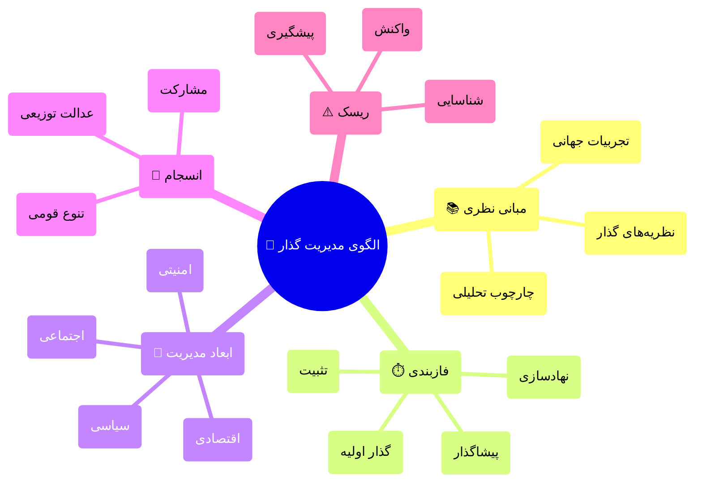

### پیام کلیدی به مخاطبان

| مخاطب | پیام اصلی |
| --- | --- |
| **عامه مردم** | 🏠 گذار یک فرآیند طبیعی است؛ با برنامه‌ریزی و مشارکت همگانی، آینده‌ای روشن‌تر در انتظار است |
| **نخبگان** | 🎓 نقش شما در طراحی و هدایت فرآیند گذار حیاتی است؛ این فرصت تاریخی را دریابید |
| **سیاست‌گذاران** | 📋 الگوهای موفق وجود دارد؛ با تکیه بر علم و تجربه، می‌توان مسیر را هموار کرد |
| **جامعه بین‌الملل** | 🌍 همراهی و حمایت سازنده، منافع مشترک را تأمین می‌کند |

---

# بخش اول: مبانی نظری و چارچوب مفهومی

## ۱.۱ تعریف دوره گذار

> **تعریف علمی دوره گذار (Transition Period):**
دوره‌ای از تحول سیاسی-اجتماعی که طی آن یک نظام سیاسی از وضعیت موجود به وضعیت جدید حرکت می‌کند. این دوره با عدم قطعیت، بازتوزیع قدرت، و بازتعریف قواعد بازی مشخص می‌شود.
— *O’Donnell & Schmitter (1986); Linz & Stepan (1996)*
> 

### ویژگی‌های ذاتی دوره گذار

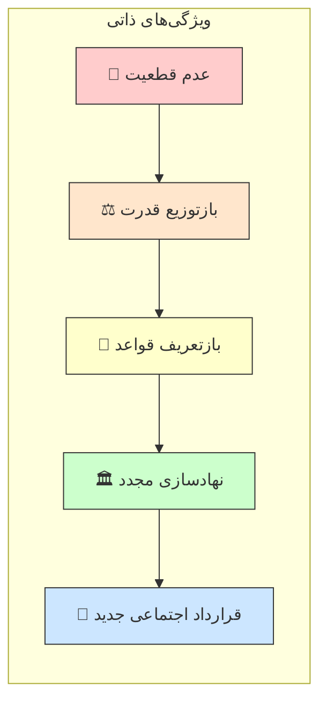

## ۱.۲ چارچوب نظری یکپارچه

### نظریه‌های بنیادین گذار

| نظریه | نظریه‌پرداز اصلی | محور تحلیل | کاربرد در مدل ما |
| --- | --- | --- | --- |
| **گذار دموکراتیک** | O’Donnell, Schmitter | نقش نخبگان و پیمان‌ها | طراحی میزگردهای ملی |
| **موج‌های دموکراتیزاسیون** | Huntington | الگوهای جهانی | درس‌گیری تطبیقی |
| **تثبیت دموکراسی** | Linz, Stepan | نهادسازی | فاز تحکیم |
| **عدالت انتقالی** | Teitel | مواجهه با گذشته | سازوکارهای آشتی ملی |
| **اقتصاد سیاسی گذار** | Przeworski | توازن اصلاحات | مدیریت اقتصادی |
| **جامعه‌شناسی انقلاب** | Skocpol, Goldstone | علل ساختاری | تحلیل زمینه‌ای |

### مدل تحلیلی ترکیبی

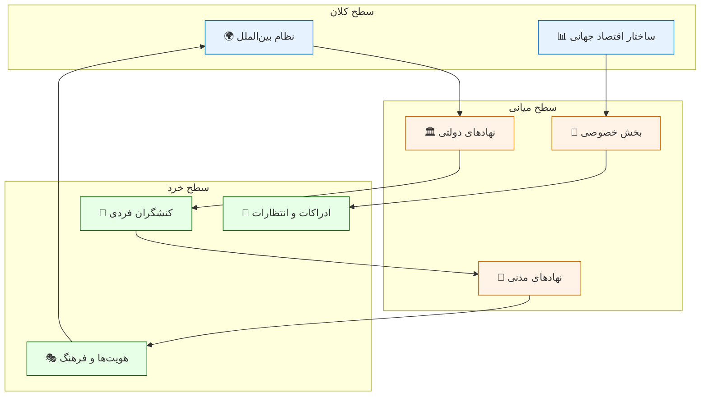

## ۱.۳ پیش‌شرط‌های گذار موفق

### چهار ستون گذار پایدار

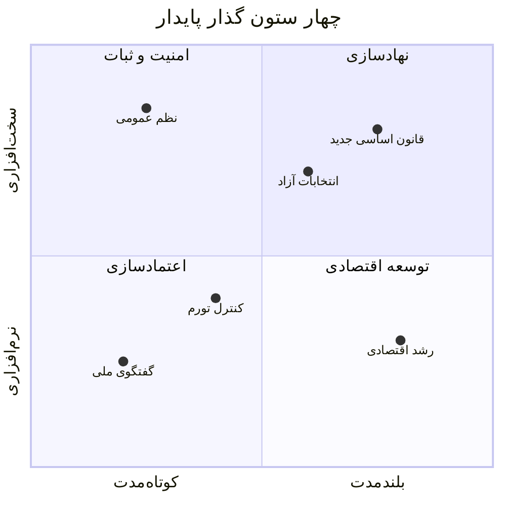

> **نکته کلیدی:** موفقیت گذار نیازمند توازن هم‌زمان در هر چهار ربع است. تمرکز صرف بر یک بعد، سایر ابعاد را تضعیف می‌کند.
> 

---

# بخش دوم: فازشناسی دوره گذار

## ۲.۱ مدل پنج‌فازی گذار

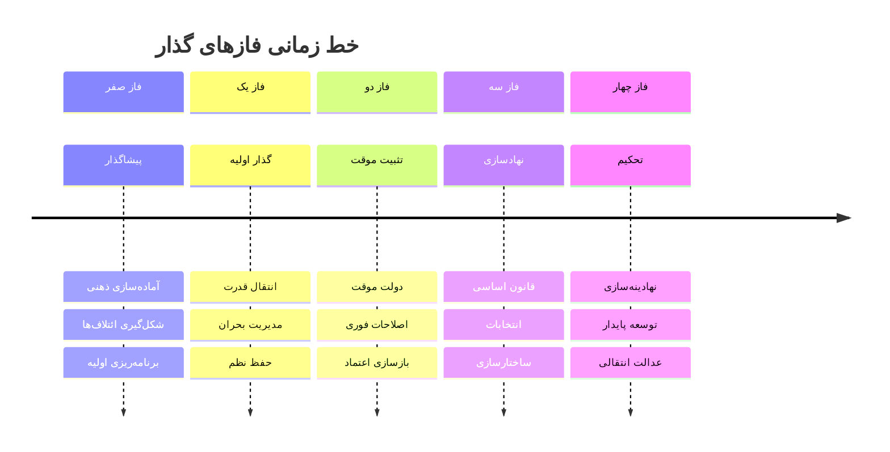

## ۲.۲ جزئیات هر فاز

### 🔵 فاز صفر: پیشاگذار (Pre-Transition)

**مدت تقریبی:** متغیر (ماه‌ها تا سال‌ها)

| بُعد | اقدامات کلیدی | شاخص موفقیت |
| --- | --- | --- |
| **فکری** | تولید گفتمان جایگزین، ترویج ارزش‌های دموکراتیک | میزان پذیرش عمومی ایده‌های جدید |
| **سازمانی** | شکل‌گیری ائتلاف‌های اصلاح‌طلب، شبکه‌سازی نخبگان | تعداد و تنوع ائتلاف‌ها |
| **برنامه‌ای** | تدوین نقشه راه، سناریونویسی | وجود برنامه‌های مدون |
| **ارتباطی** | ایجاد کانال‌های ارتباطی، دیپلماسی عمومی | سطح هماهنگی میان بازیگران |

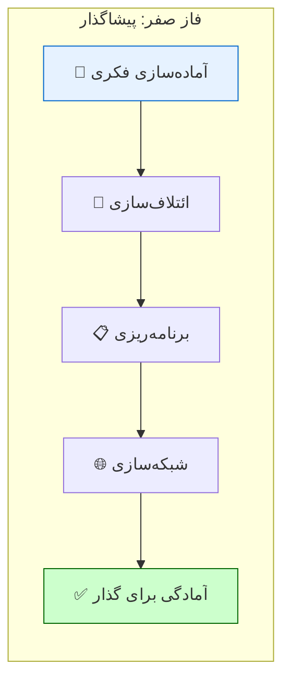

### 🟢 فاز یک: گذار اولیه (Initial Transition)

**مدت تقریبی:** ۱ تا ۶ ماه

> **⚠️ این حساس‌ترین فاز است.** بیشترین احتمال شکست و بازگشت در این مرحله وجود دارد.
> 

### اولویت‌های فاز یک

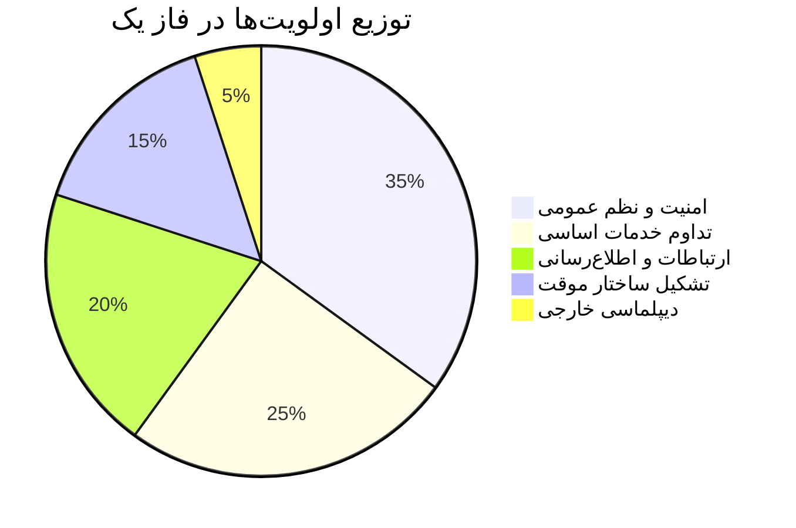

### ماتریس اقدامات فوری

| اولویت | اقدام | مسئول | زمان‌بندی | ریسک عدم انجام |
| --- | --- | --- | --- | --- |
| **۱** | استقرار نظم و امنیت | نیروهای امنیتی منضبط | فوری (۰-۷۲ ساعت) | هرج و مرج، غارت |
| **۲** | تداوم خدمات حیاتی | وزارتخانه‌های خدماتی | فوری (۰-۴۸ ساعت) | بحران انسانی |
| **۳** | اطلاع‌رسانی شفاف | تیم ارتباطات | مداوم | شایعه، وحشت |
| **۴** | تشکیل شورای موقت | نمایندگان ائتلاف | ۱-۷ روز | خلأ قدرت |
| **۵** | تماس با بین‌الملل | تیم دیپلماسی | ۱-۳ روز | انزوا، تحریم |

### 🟡 فاز دو: تثبیت موقت (Interim Stabilization)

**مدت تقریبی:** ۶ تا ۱۸ ماه

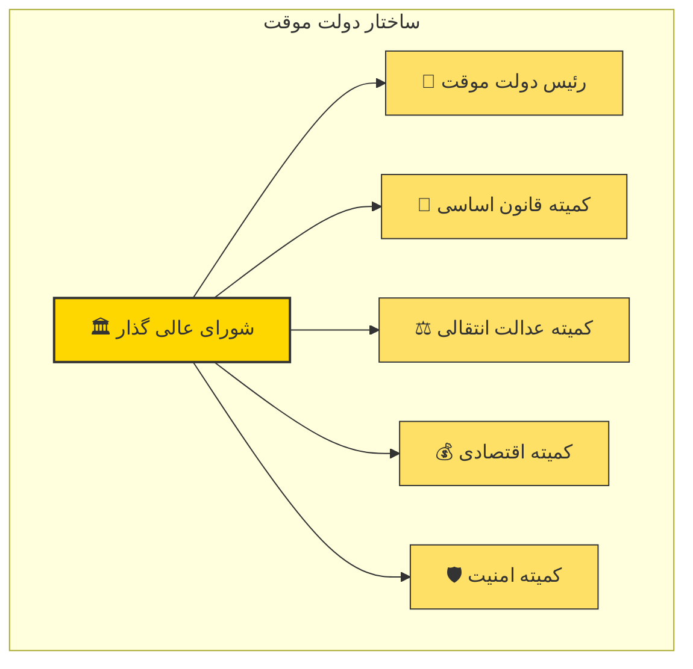

### اصول حاکم بر دولت موقت

1. **فراگیری (Inclusiveness):** نمایندگی حداکثری گروه‌های مختلف
2. **محدودیت زمانی:** تعهد قاطع به برگزاری انتخابات در موعد مقرر
3. **شفافیت:** گزارش‌دهی منظم به مردم
4. **خویشتن‌داری:** پرهیز از تصمیمات غیرقابل برگشت
5. **پاسخگویی:** سازوکارهای نظارتی مشخص

### 🟠 فاز سه: نهادسازی (Institution Building)

**مدت تقریبی:** ۱۸ ماه تا ۳ سال

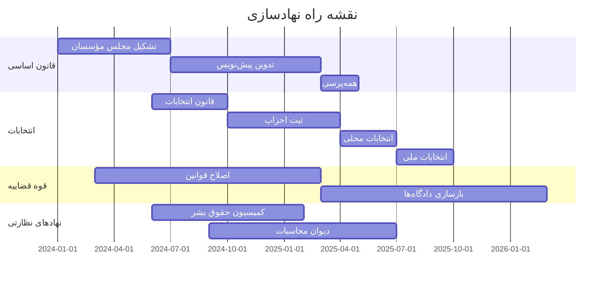

### 🔴 فاز چهار: تحکیم (Consolidation)

**مدت تقریبی:** ۳ تا ۱۰ سال

> **تعریف تحکیم دموکراتیک:**
زمانی که دموکراسی «تنها بازی ممکن در شهر» شود — یعنی هیچ گروه مهمی خارج از چارچوب دموکراتیک به دنبال قدرت نباشد.
— *Linz & Stepan (1996)*
> 

### شاخص‌های تحکیم

| بُعد | شاخص | معیار موفقیت |
| --- | --- | --- |
| **رفتاری** | عدم تلاش معنادار برای براندازی | صفر کودتا یا شورش |
| **نگرشی** | حمایت عمومی از دموکراسی | >70% در نظرسنجی‌ها |
| **قانونی** | پذیرش قواعد بازی | انتقال مسالمت‌آمیز قدرت |
| **نهادی** | استقلال نهادها | امتیاز بالا در شاخص‌های بین‌المللی |

## ۲.۳ روابط بین‌فازی و بازخوردها

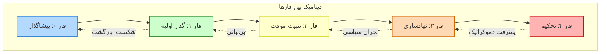

### عوامل تسهیل‌کننده و بازدارنده بین فازها

| گذار از → به | تسهیل‌کننده‌ها | بازدارنده‌ها |
| --- | --- | --- |
| فاز ۰ → ۱ | ائتلاف گسترده، برنامه روشن، حمایت بین‌المللی | تفرقه نخبگان، سرکوب شدید، مداخله خارجی |
| فاز ۱ → ۲ | انضباط نیروهای امنیتی، تداوم خدمات | شورش، فروپاشی اقتصادی، خشونت قومی |
| فاز ۲ → ۳ | توافق بر سر قواعد بازی، منابع مالی | اختلافات حل‌نشده، فساد گسترده |
| فاز ۳ → ۴ | انتخابات آزاد، رشد اقتصادی | کودتا، بحران اقتصادی، پوپولیسم |

---

# بخش سوم: ابعاد چندگانه مدیریت گذار

## ۳.۱ بُعد سیاسی

### ساختار قدرت در دوره گذار

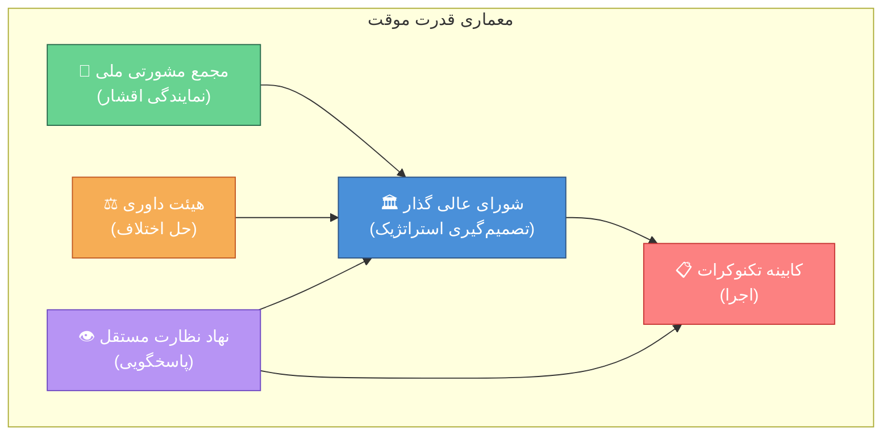

### اصول تفکیک و توازن قدرت

| اصل | توضیح | سازوکار اجرایی |
| --- | --- | --- |
| **تفکیک موقت/دائم** | تمایز بین نهادهای موقت و آتی | قانون چارچوب گذار |
| **چرخش رهبری** | پیشگیری از تمرکز قدرت | ریاست دوره‌ای شورا |
| **حق وتوی اقلیت** | حمایت از گروه‌های کوچک‌تر | آستانه‌های تصمیم‌گیری |
| **نظارت چندلایه** | جلوگیری از سوءاستفاده | نهادهای نظارتی موازی |

## ۳.۲ بُعد اقتصادی

### چالش‌های اقتصادی دوره گذار

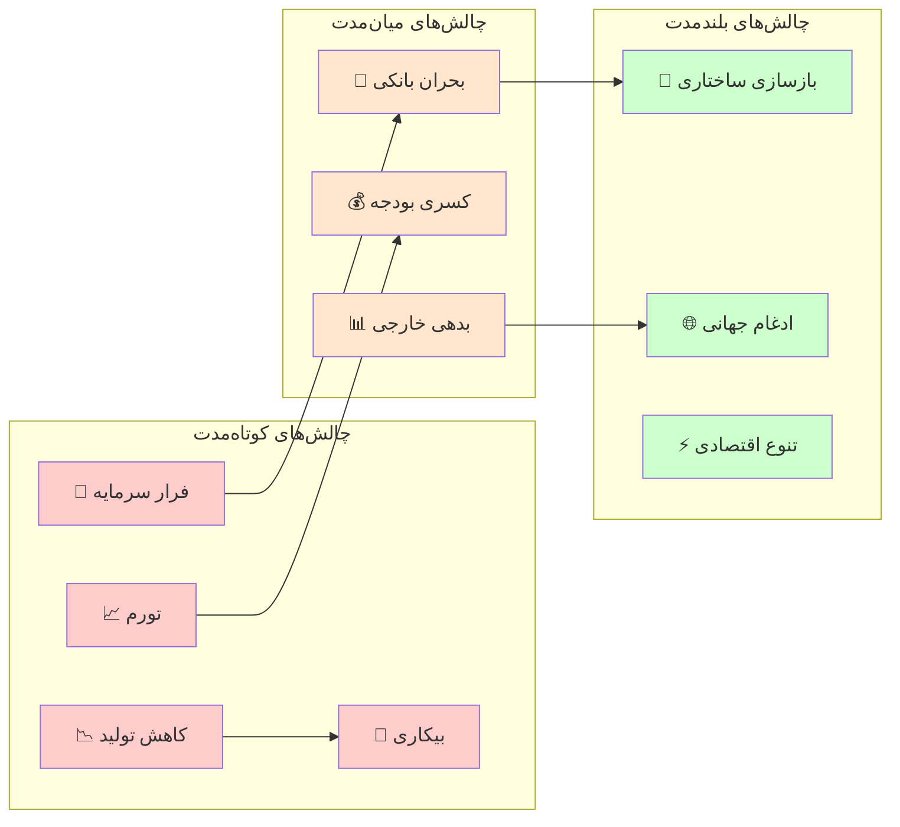

### بسته سیاستی اقتصادی فوری

| اولویت | سیاست | هدف | ابزار |
| --- | --- | --- | --- |
| **۱** | ثبات پولی | مهار تورم | سیاست پولی انقباضی، ثبات ارز |
| **۲** | شبکه ایمنی | حمایت از آسیب‌پذیران | یارانه هدفمند، بیمه بیکاری |
| **۳** | تداوم کسب‌وکار | حفظ اشتغال | تسهیلات اضطراری، معافیت مالیاتی |
| **۴** | جذب سرمایه | بازگرداندن اعتماد | تضمین‌های قانونی، شفافیت |
| **۵** | بازسازی مالی | پایداری بودجه | اصلاح مالیاتی، کاهش هزینه‌های غیرضروری |

### مدل «J-Curve» در اقتصاد گذار

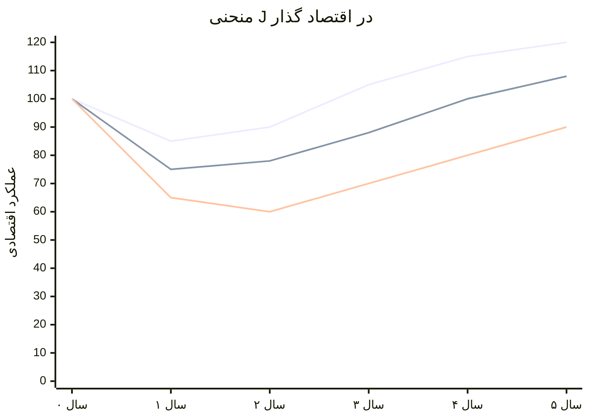

> **⚠️ هشدار مهم:** انتظارات عمومی باید مدیریت شود. کاهش موقت رفاه در سال‌های اول محتمل است، اما با سیاست‌های درست، بهبود پایدار حاصل می‌شود.
> 

## ۳.۳ بُعد اجتماعی

### مدیریت انتظارات و اعتماد عمومی

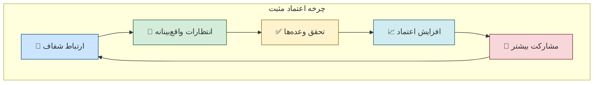

### لایه‌بندی اجتماعی و اولویت‌های هر گروه

| گروه اجتماعی | نگرانی اصلی | نیاز فوری | سازوکار پاسخ |
| --- | --- | --- | --- |
| **طبقه متوسط شهری** | ثبات شغلی، آینده فرزندان | امنیت اقتصادی | تضمین حقوق مالکیت، آموزش |
| **طبقه کارگر** | معیشت، اشتغال | حمایت مالی فوری | شبکه ایمنی، کارهای عمومی |
| **کشاورزان و روستاییان** | قیمت محصولات، آب | ثبات بازار | یارانه کشاورزی، زیرساخت |
| **زنان** | برابری، امنیت | حضور در تصمیم‌گیری | سهمیه، قوانین حمایتی |
| **جوانان** | آینده، شغل، آزادی | فرصت‌های جدید | آموزش، کارآفرینی |
| **اقلیت‌ها** | به‌رسمیت‌شناسی، امنیت | نمایندگی | قوانین ضدتبعیض |
| **بازنشستگان** | مستمری، بهداشت | امنیت درآمد | تضمین پرداخت‌ها |

## ۳.۴ بُعد امنیتی

### اصل‌الاصول: انحصار مشروع خشونت

> **اصل وبری:** دولت نهادی است که انحصار استفاده مشروع از زور را در یک قلمرو مشخص دارد. بدون این انحصار، دولت وجود ندارد.
— *Max Weber*
> 

### اصلاح بخش امنیتی (Security Sector Reform)

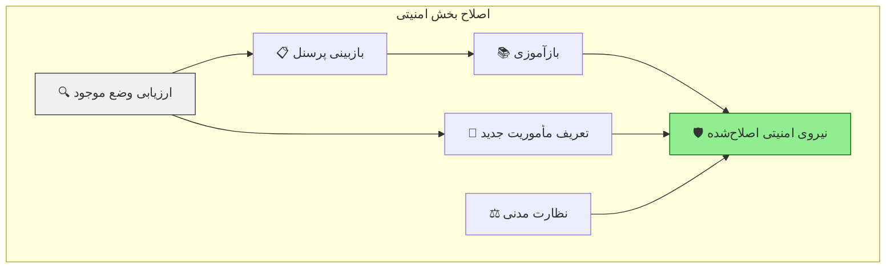

### ماتریس تهدیدات امنیتی دوره گذار

| تهدید | احتمال | شدت | استراتژی مقابله |
| --- | --- | --- | --- |
| **کودتای نظامی** | متوسط | بحرانی | کنترل مدنی، تصفیه محدود |
| **شورش‌های قومی** | بالا | بالا | گفتگو، خودمختاری |
| **تروریسم** | متوسط | بالا | اطلاعات، همکاری بین‌المللی |
| **جرایم سازمان‌یافته** | بالا | متوسط | تقویت پلیس، قضا |
| **مداخله خارجی** | متوسط | بحرانی | دیپلماسی، بازدارندگی |
| **ناآرامی‌های شهری** | بالا | متوسط | پلیس ضدشورش، مذاکره |

---

# بخش چهارم: مدیریت تنوع و انسجام

## ۴.۱ چارچوب مفهومی تنوع-انسجام

> **پارادوکس گذار:** چگونه می‌توان هم تنوع را به رسمیت شناخت و هم انسجام ملی را حفظ کرد؟
> 

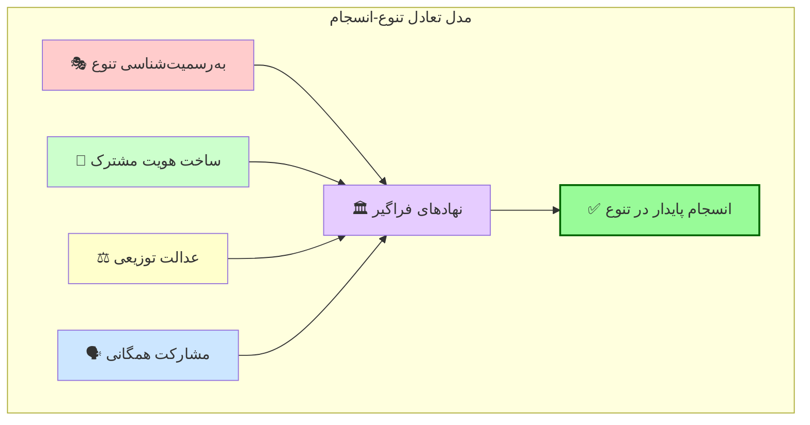

## ۴.۲ مدیریت تنوع قومی

### نقشه گروه‌های قومی و مطالبات

| گروه قومی | درصد جمعیت | مطالبه اصلی | سطح رضایت فعلی | اولویت پاسخ |
| --- | --- | --- | --- | --- |
| گروه اکثریت | ~۵۰٪ | حفظ یکپارچگی | متوسط | نهادسازی فراگیر |
| گروه A | ~۲۰٪ | خودمختاری فرهنگی | پایین | زبان، آموزش |
| گروه B | ~۱۵٪ | توسعه منطقه‌ای | پایین | سرمایه‌گذاری |
| گروه C | ~۱۰٪ | نمایندگی سیاسی | متوسط | سهمیه‌بندی |
| سایر | ~۵٪ | به‌رسمیت‌شناسی | پایین | قوانین حمایتی |

### طیف گزینه‌های ساختاری

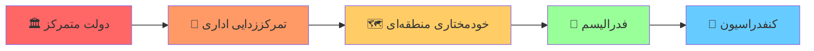

### اصول مدیریت تنوع (بدون فروپاشی)

1. **خودمختاری متقارن:** همه مناطق حقوق برابر داشته باشند
2. **نمایندگی تضمین‌شده:** سهمیه در نهادهای ملی
3. **برابری منابع:** توزیع عادلانه بودجه ملی
4. **هویت چندلایه:** هویت قومی + هویت ملی
5. **خطوط قرمز روشن:** تجزیه‌طلبی خشونت‌آمیز غیرقابل قبول

### سازوکار گفتگوی بین‌قومی

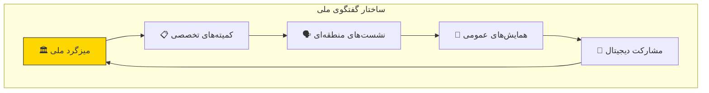

## ۴.۳ عدالت انتقالی و آشتی ملی

### چهار ستون عدالت انتقالی

| ستون | هدف | سازوکار | مثال موفق |
| --- | --- | --- | --- |
| **حقیقت‌یابی** | آشکارسازی گذشته | کمیسیون حقیقت | آفریقای جنوبی |
| **عدالت** | محاکمه عاملان | دادگاه‌ها | آرژانتین |
| **جبران خسارت** | ترمیم قربانیان | غرامت، اعاده حیثیت | شیلی |
| **تضمین عدم تکرار** | اصلاحات نهادی | بازبینی قوانین | آلمان |

### تعادل بین عدالت و ثبات

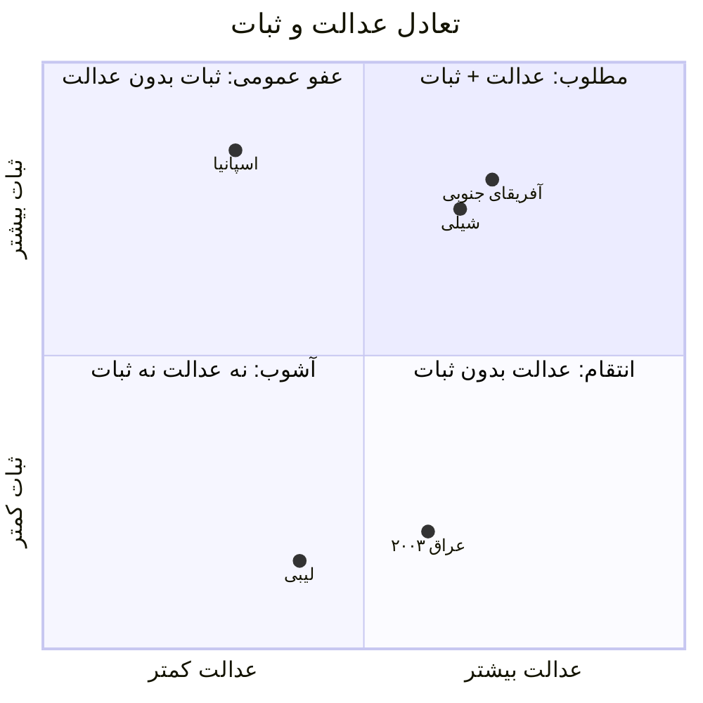

---

# بخش پنجم: تحلیل ریسک و مدیریت بحران

## ۵.۱ نقشه ریسک‌های دوره گذار

```mermaid

```

```mermaid
---
title: ریسک‌های دوره گذار
---
flowchart TB
    subgraph political ["🔴 ریسک‌های سیاسی"]
        direction TB
        P1["بازگشت استبداد"]
        P2["کودتا"]
        P3["شکست انتخابات"]
        P4["جنگ داخلی"]
    end

    subgraph economic ["🟠 ریسک‌های اقتصادی"]
        direction TB
        E1["فروپاشی مالی"]
        E2["ابرتورم"]
        E3["تحریم"]
        E4["بیکاری گسترده"]
    end

    subgraph social ["🟡 ریسک‌های اجتماعی"]
        direction TB
        S1["شورش"]
        S2["شکاف قومی"]
        S3["مهاجرت گسترده"]
        S4["بحران اعتماد"]
    end

    subgraph foreign ["🔵 ریسک‌های خارجی"]
        direction TB
        F1["مداخله نظامی"]
        F2["جنگ اقتصادی"]
        F3["جنگ رسانه‌ای"]
        F4["خرابکاری"]
    end

    style political fill:#ffe6e6,stroke:#cc0000
    style economic fill:#fff2e6,stroke:#cc6600
    style social fill:#ffffcc,stroke:#cccc00
    style foreign fill:#e6f2ff,stroke:#0066cc
```

```mermaid
flowchart TB
    subgraph "ریسک‌های سیاسی"
            direction TB
        P1["🔄 بازگشت استبداد"]
        P2["💥 کودتا"]
        P3["🗳️ شکست انتخابات"]
        P4["⚔️ جنگ داخلی"]
    end

    subgraph "ریسک‌های اقتصادی"
            direction TB
        E1["💸 فروپاشی مالی"]
        E2["📈 ابرتورم"]
        E3["🚫 تحریم"]
        E4["💼 بیکاری گسترده"]
    end

    subgraph "ریسک‌های اجتماعی"
            direction TB
        S1["👥 شورش"]
        S2["🎭 شکاف قومی"]
        S3["🏃 مهاجرت گسترده"]
        S4["😰 بحران اعتماد"]
    end

    subgraph "ریسک‌های خارجی"
            direction TB
        F1["🌍 مداخله نظامی"]
        F2["💰 جنگ اقتصادی"]
        F3["📢 جنگ رسانه‌ای"]
        F4["🕵️ خرابکاری"]
    end

    style P1 fill:#ffcccc
    style P2 fill:#ffcccc
    style P4 fill:#ff9999
    style E1 fill:#ffe6cc
    style E2 fill:#ffe6cc
    style S2 fill:#ffffcc
    style F1 fill:#cce6ff
```

## ۵.۲ ماتریس ارزیابی ریسک

| ریسک | احتمال | تأثیر | امتیاز ریسک | اولویت |
| --- | --- | --- | --- | --- |
| کودتای نظامی | ۳/۵ | ۵/۵ | **۱۵** | 🔴 بحرانی |
| ابرتورم | ۴/۵ | ۴/۵ | **۱۶** | 🔴 بحرانی |
| شورش قومی | ۳/۵ | ۴/۵ | **۱۲** | 🟠 بالا |
| مداخله خارجی | ۲/۵ | ۵/۵ | **۱۰** | 🟠 بالا |
| شکست انتخابات | ۳/۵ | ۳/۵ | **۹** | 🟡 متوسط |
| بحران اعتماد | ۴/۵ | ۳/۵ | **۱۲** | 🟠 بالا |
| مهاجرت نخبگان | ۴/۵ | ۲/۵ | **۸** | 🟡 متوسط |

## ۵.۳ پروتکل‌های مدیریت بحران

### ساختار مدیریت بحران

```mermaid
---
title: ساختار مدیریت بحران
---
flowchart LR
    subgraph "سیستم هشدار زودهنگام"
            direction LR
        A["📊 پایش شاخص‌ها"]
        B["🚨 تشخیص انحراف"]
        C["📢 هشدار"]
    end

    subgraph "واکنش سریع"
            direction LR
        D["🎯 تیم بحران"]
        E["📋 پروتکل اجرا"]
        F["🔧 مداخله"]
    end

    subgraph "بازیابی"
            direction LR
        G["📈 ارزیابی"]
        H["🔄 اصلاح"]
        I["✅ عادی‌سازی"]
    end

    A --> B --> C --> D --> E --> F --> G --> H --> I
    I -.-> A

    style C fill:#ffcc00,stroke:#333
    style D fill:#ff6666,stroke:#333
    style I fill:#66cc66,stroke:#333
```

### برنامه‌های احتمالی (Contingency Plans)

| سناریو | محرک | واکنش فوری | مسئول | منابع مورد نیاز |
| --- | --- | --- | --- | --- |
| **کودتا** | حرکت نظامی | بسیج مردمی، فشار بین‌المللی | شورای گذار | رسانه، ارتباطات |
| **بحران مالی** | سقوط ۲۰٪ ارز | کنترل سرمایه، کمک بین‌المللی | بانک مرکزی | ذخایر ارزی |
| **شورش** | خشونت گسترده | منع آمدوشد، مذاکره | وزارت کشور | نیروی انتظامی |
| **مداخله خارجی** | تهدید نظامی | دیپلماسی، بسیج دفاعی | وزارت خارجه | ارتش |

## ۵.۴ شاخص‌های هشدار زودهنگام

```mermaid
xychart-beta
    title "داشبورد پایش ریسک (نمونه)"
    x-axis ["هفته ۱", "هفته ۲", "هفته ۳", "هفته ۴", "هفته ۵", "هفته ۶"]
    y-axis "سطح ریسک" 0 --> 100
    line "امنیتی" [30, 35, 45, 55, 50, 40]
    line "اقتصادی" [40, 50, 60, 65, 55, 45]
    line "اجتماعی" [25, 30, 40, 50, 45, 35]
    line "آستانه هشدار" [60, 60, 60, 60, 60, 60]
```

| شاخص | منبع داده | آستانه هشدار | فرکانس پایش |
| --- | --- | --- | --- |
| نرخ تورم ماهانه | بانک مرکزی | >۱۰٪ | هفتگی |
| شاخص نارضایتی | نظرسنجی | >۶۰٪ | ماهانه |
| تعداد اعتراضات | گزارش پلیس | >۱۰۰/هفته | روزانه |
| نرخ ارز | بازار | نوسان >۵٪/روز | لحظه‌ای |
| فعالیت نظامی غیرعادی | اطلاعات | هرگونه حرکت | لحظه‌ای |

---

# بخش ششم: ارتباطات و اعتمادسازی

## ۶.۱ استراتژی ارتباطات ملی

> **اصل کلیدی:** در دوره گذار، خلأ اطلاعاتی سریع‌تر از خلأ قدرت به بی‌ثباتی منجر می‌شود. ارتباطات شفاف، پیوسته و صادقانه حیاتی است.
> 

### چارچوب ارتباطات استراتژیک

```mermaid
flowchart TB
    subgraph "پیام‌های کلیدی"
        M1["🎯 ما برنامه داریم"]
        M2["🛡️ امنیت تأمین است"]
        M3["⏱️ این موقتی است"]
        M4["🤝 همه شامل‌اند"]
        M5["📈 آینده روشن است"]
    end

    subgraph "کانال‌ها"
        C1["📺 تلویزیون ملی"]
        C2["📻 رادیو"]
        C3["📱 شبکه‌های اجتماعی"]
        C4["📰 مطبوعات"]
        C5["🗣️ سخنرانی مستقیم"]
        C6["🏘️ شبکه محلی"]
    end

    subgraph "مخاطبان"
        A1["👥 عموم مردم"]
        A2["🎓 نخبگان"]
        A3["💼 بخش خصوصی"]
        A4["🌍 جامعه بین‌الملل"]
        A5["👮 نیروهای امنیتی"]
    end

    M1 --> C1
    M2 --> C2
    M3 --> C3
    M4 --> C4
    M5 --> C5

    C1 --> A1
    C3 --> A1
    C4 --> A2
    C5 --> A3
```

### تقویم ارتباطی

| رویداد | فرکانس | مخاطب اصلی | مسئول | قالب |
| --- | --- | --- | --- | --- |
| پیام ویدیویی رهبران | روزانه (فاز ۱) | عموم | سخنگو | ویدیو ۵ دقیقه |
| کنفرانس مطبوعاتی | هفتگی | رسانه‌ها | کابینه | زنده |
| گزارش پیشرفت | دوهفتگی | همه | دفتر گذار | سند + اینفوگرافیک |
| جلسات شهری | ماهانه | محلی | استانداران | حضوری |
| نشست بین‌المللی | ماهانه | دیپلمات‌ها | وزیر خارجه | رسمی |

## ۶.۲ مقابله با اطلاعات نادرست

```mermaid
flowchart LR
    subgraph "زنجیره مقابله با دروغ‌پراکنی"
        A["🔍 شناسایی"] --> B["✅ راستی‌آزمایی"]
        B --> C["📢 پاسخ سریع"]
        C --> D["📊 انتشار حقیقت"]
        D --> E["📈 پایش تأثیر"]
    end

    style A fill:#ffcccc
    style B fill:#ffe6cc
    style C fill:#ffffcc
    style D fill:#ccffcc
    style E fill:#cce6ff
```

### راهنمای مقابله با شایعات

| نوع شایعه | مثال | استراتژی پاسخ | سرعت پاسخ |
| --- | --- | --- | --- |
| **امنیتی** | “کودتا شد” | تکذیب رسمی + تصویر | <۱ ساعت |
| **اقتصادی** | “بانک‌ها ورشکست شدند” | بیانیه بانک مرکزی | <۲ ساعت |
| **سیاسی** | “رهبران فرار کردند” | حضور زنده | <۳۰ دقیقه |
| **اجتماعی** | “درگیری قومی” | گزارش میدانی | <۲ ساعت |

## ۶.۳ نقش نخبگان و متخصصان

### شبکه مشاوران و متخصصان

```mermaid
flowchart TB
    subgraph "شورای مشورتی نخبگان"
        A["🎓 دانشگاهیان"]
        B["💼 مدیران صنعت"]
        C["⚖️ حقوقدانان"]
        D["🏥 متخصصان بهداشت"]
        E["🔧 مهندسان"]
        F["🎨 هنرمندان"]
        G["📿 رهبران دینی"]
        H["🌍 ایرانیان خارج کشور"]
    end

    subgraph "سازوکار مشارکت"
        I["📋 کمیته‌های تخصصی"]
        J["💬 مشاوره آنلاین"]
        K["📝 ارائه پیشنهاد"]
        L["🔍 نظارت"]
    end

    A --> I
    B --> I
    C --> I
    D --> J
    E --> J
    F --> K
    G --> K
    H --> L

    style A fill:#e6f3ff
    style H fill:#e6f3ff
```

### نقش‌های تعریف‌شده برای نخبگان

| گروه | نقش اصلی | سازوکار مشارکت | مشوق‌ها |
| --- | --- | --- | --- |
| **اساتید دانشگاه** | مشاوره، آموزش | کمیته‌های تخصصی | اعتبار، بودجه پژوهشی |
| **پزشکان** | مدیریت بهداشت | وزارت بهداشت | منابع، احترام |
| **مهندسان** | بازسازی زیرساخت | پروژه‌های ملی | قرارداد، مشارکت |
| **وکلا** | تدوین قوانین | کمیته قانون اساسی | نفوذ، شهرت |
| **کارآفرینان** | احیای اقتصاد | شورای اقتصادی | تسهیلات، فرصت |
| **دیاسپورا** | پل ارتباطی، سرمایه | دفاتر خارجی | بازگشت، سرمایه‌گذاری |

## ۶.۴ ایجاد امید واقع‌بینانه

### مدل «امید مبتنی بر شواهد»

```mermaid
flowchart TB
    A["📊 ارائه واقعیت‌ها<br/>(شفافیت)"]
    B["📈 نشان دادن پیشرفت<br/>(دستاوردهای کوچک)"]
    C["🗺️ ترسیم آینده<br/>(چشم‌انداز)"]
    D["🤝 مشارکت‌دادن<br/>(احساس مالکیت)"]
    E["🎯 امید پایدار"]

    A --> E
    B --> E
    C --> E
    D --> E

    style E fill:#90EE90,stroke:#006400,stroke-width:3px
```

### پیام‌های امیدبخش (نمونه)

> **برای عموم:**
«ما می‌دانیم این روزها سخت است. اما تاریخ نشان می‌دهد ملت‌هایی که از این مسیر گذشته‌اند، امروز آزادتر و مرفه‌ترند. با هم می‌توانیم.»
> 

> **برای جوانان:**
«این کشور متعلق به شماست. آینده‌ای که می‌سازیم، برای شماست. صدای شما شنیده می‌شود.»
> 

> **برای اقلیت‌ها:**
«در کشور جدید، هیچ‌کس شهروند درجه دو نیست. تنوع ما، ثروت ماست.»
> 

---

# بخش هفتم: نقشه راه اجرایی

## ۷.۱ نقشه راه کلان

```mermaid
gantt
    title نقشه راه اجرایی دوره گذار
    dateFormat  YYYY-MM
    axisFormat  %Y-%m

    section فاز ۱: گذار اولیه
    تأمین امنیت و نظم          :crit, f1a, 2024-01, 2M
    تشکیل شورای گذار          :crit, f1b, 2024-01, 1M
    تداوم خدمات اساسی         :f1c, 2024-01, 3M
    ارتباطات بحران            :f1d, 2024-01, 6M

    section فاز ۲: تثبیت موقت
    دولت موقت                 :f2a, 2024-03, 12M
    اصلاحات اقتصادی فوری      :f2b, 2024-04, 10M
    گفتگوی ملی                :f2c, 2024-05, 8M
    کمیسیون حقیقت‌یاب         :f2d, 2024-06, 18M

    section فاز ۳: نهادسازی
    مجلس مؤسسان              :f3a, 2024-09, 6M
    تدوین قانون اساسی         :crit, f3b, 2025-03, 8M
    همه‌پرسی قانون اساسی      :milestone, f3c, 2025-11, 1M
    قانون انتخابات            :f3d, 2025-06, 4M
    انتخابات محلی             :f3e, 2025-12, 3M
    انتخابات ملی              :crit, f3f, 2026-03, 3M

    section فاز ۴: تحکیم
    انتقال به دولت منتخب      :milestone, f4a, 2026-06, 1M
    اصلاحات ساختاری           :f4b, 2026-07, 24M
    توسعه اقتصادی پایدار      :f4c, 2026-09, 36M
    عدالت انتقالی             :f4d, 2026-06, 48M
```

## ۷.۲ جزئیات اجرایی هر فاز

### 📋 فاز یک: ۱۰۰ روز اول

```mermaid
flowchart TB
    subgraph "روزهای ۱-۷: بقا"
        A1["🛡️ تأمین امنیت نقاط کلیدی"]
        A2["📢 اولین پیام به ملت"]
        A3["🏛️ تشکیل شورای اضطراری"]
        A4["💡 تداوم برق، آب، گاز"]
        A5["🏥 فعال نگه داشتن بیمارستان‌ها"]
    end

    subgraph "روزهای ۸-۳۰: تثبیت"
        B1["👥 تشکیل کابینه موقت"]
        B2["💰 تثبیت سیستم بانکی"]
        B3["🌍 شناسایی بین‌المللی"]
        B4["📋 ارزیابی وضعیت"]
        B5["🤝 آغاز گفتگوها"]
    end

    subgraph "روزهای ۳۱-۱۰۰: ساختارسازی"
        C1["📜 منشور گذار"]
        C2["⚖️ اصلاح قوانین فوری"]
        C3["📊 برنامه اقتصادی"]
        C4["🗣️ نشست‌های عمومی"]
        C5["🎯 تعیین تقویم گذار"]
    end

    A1 --> B1 --> C1
    A2 --> B3 --> C4
    A3 --> B4 --> C2

    style A1 fill:#ff9999
    style B1 fill:#ffcc99
    style C1 fill:#99ff99
```

### چک‌لیست ۱۰۰ روز اول

| هفته | اقدامات کلیدی | مسئول | وضعیت |
| --- | --- | --- | --- |
| **۱** | ☐ تأمین امنیت پایتخت | فرمانده امنیتی | — |
|  | ☐ اولین سخنرانی ملی | رئیس شورا | — |
|  | ☐ تماس با سفارتخانه‌ها | وزیر خارجه موقت | — |
| **۲** | ☐ بازگشایی بانک‌ها | رئیس بانک مرکزی | — |
|  | ☐ معرفی کابینه | رئیس شورا | — |
|  | ☐ فعال‌سازی رسانه ملی | سخنگو | — |
| **۳-۴** | ☐ ارزیابی مالی کشور | وزیر اقتصاد | — |
|  | ☐ گزارش امنیتی جامع | وزیر کشور | — |
|  | ☐ نقشه راه مقدماتی | دفتر برنامه‌ریزی | — |
| **۵-۸** | ☐ آغاز گفتگوی ملی | دبیرخانه گفتگو | — |
|  | ☐ اصلاحات قانونی فوری | وزیر دادگستری | — |
|  | ☐ برنامه حمایت معیشتی | وزیر رفاه | — |
| **۹-۱۴** | ☐ انتشار منشور گذار | شورای گذار | — |
|  | ☐ تقویم انتخابات | کمیسیون انتخابات | — |
|  | ☐ گزارش ۱۰۰ روزه به ملت | رئیس شورا | — |

### 📋 فاز دو: تثبیت موقت (۶-۱۸ ماه)

### ساختار دولت موقت

```mermaid
flowchart TB
    subgraph "ساختار حکمرانی موقت"
        A["🏛️ شورای عالی گذار<br/>(۱۵-۲۱ نفر)"]

        subgraph "قوه مجریه موقت"
            B1["👤 نخست‌وزیر موقت"]
            B2["💼 کابینه تکنوکرات<br/>(۱۵-۲۰ وزیر)"]
        end

        subgraph "نهادهای نظارتی"
            C1["⚖️ دیوان عالی موقت"]
            C2["👁️ کمیسیون نظارت"]
            C3["📊 دیوان محاسبات"]
        end

        subgraph "نهادهای مشورتی"
            D1["🗣️ مجمع مشورتی ملی<br/>(۱۰۰-۲۰۰ نفر)"]
            D2["🎓 شورای مشاوران"]
        end

        A --> B1
        B1 --> B2
        A --> C1
        A --> C2
        A --> C3
        D1 --> A
        D2 --> B1
    end

    style A fill:#4a90d9,color:#fff
    style B1 fill:#68d391,color:#fff
```

### معیارهای انتخاب اعضای شورای گذار

| معیار | توضیح | وزن |
| --- | --- | --- |
| **تخصص و شایستگی** | سابقه مدیریتی، تحصیلات | ۳۰٪ |
| **پذیرش عمومی** | اعتماد مردمی، شهرت نیک | ۲۵٪ |
| **نمایندگی** | قومیت، جنسیت، منطقه | ۲۰٪ |
| **استقلال** | عدم وابستگی به رژیم قبلی | ۱۵٪ |
| **تعهد به دموکراسی** | سوابق، اظهارات | ۱۰٪ |

### 📋 فاز سه: نهادسازی (۱۸ ماه - ۳ سال)

### فرآیند تدوین قانون اساسی

```mermaid
flowchart LR
    subgraph "مراحل تدوین قانون اساسی"
        A["📣 فراخوان عمومی<br/>(۲ ماه)"]
        B["🗳️ انتخاب مجلس مؤسسان<br/>(۲ ماه)"]
        C["✍️ تدوین پیش‌نویس<br/>(۶ ماه)"]
        D["🗣️ بحث عمومی<br/>(۳ ماه)"]
        E["📝 بازنگری<br/>(۲ ماه)"]
        F["🗳️ همه‌پرسی<br/>(۱ ماه)"]
        G["📜 اعلام رسمی"]
    end

    A --> B --> C --> D --> E --> F --> G
    D -.->|"بازخورد"| C

    style F fill:#ffd700,stroke:#333
    style G fill:#90EE90,stroke:#006400
```

### اصول کلیدی قانون اساسی جدید (پیشنهادی)

| اصل | محتوا | دلیل |
| --- | --- | --- |
| **حاکمیت مردم** | منشأ همه قدرت‌ها مردم | مشروعیت دموکراتیک |
| **تفکیک قوا** | استقلال سه قوه | پیشگیری از استبداد |
| **حقوق بنیادین** | منشور حقوق غیرقابل تعلیق | حمایت از شهروندان |
| **کثرت‌گرایی** | به رسمیت شناختن تنوع | انسجام ملی |
| **عدم تمرکز** | اختیارات محلی | کارآمدی، مشارکت |
| **پاسخگویی** | سازوکارهای نظارتی | مبارزه با فساد |
| **صلح‌طلبی** | منع جنگ تهاجمی | امنیت منطقه‌ای |

### 📋 فاز چهار: تحکیم (۳-۱۰ سال)

```mermaid
flowchart TB
    subgraph "ستون‌های تحکیم"
        A["🏛️ نهادینه‌سازی<br/>دموکراسی"]
        B["💰 توسعه<br/>اقتصادی"]
        C["⚖️ عدالت<br/>اجتماعی"]
        D["🌍 ادغام<br/>بین‌المللی"]
        E["🎭 بازسازی<br/>فرهنگی"]
    end

    subgraph "شاخص‌های موفقیت"
        F["انتقال مسالمت‌آمیز قدرت"]
        G["رشد اقتصادی پایدار"]
        H["کاهش نابرابری"]
        I["عضویت در نهادهای بین‌المللی"]
        J["آشتی ملی"]
    end

    A --> F
    B --> G
    C --> H
    D --> I
    E --> J

    style A fill:#cce5ff
    style B fill:#d4edda
    style C fill:#fff3cd
    style D fill:#cff4fc
    style E fill:#f8d7da
```

## ۷.۳ بودجه‌ریزی دوره گذار

### برآورد منابع مالی مورد نیاز

```mermaid
%%{init: {'theme':'base', 'themeVariables': {
  'pie1':'#DC143C',
  'pie2':'#4169E1', 
  'pie3':'#32CD32',
  'pie4':'#FFD700',
  'pie5':'#9370DB',
  'pie6':'#20B2AA',
  'pie7':'#FF8C00',
  'pieOuterStrokeWidth':'2px',
  'pieStrokeColor':'#fff',
  'pieSectionTextSize':'16px',
  'pieLegendTextSize':'14px',
  'pieTitleTextSize':'20px'
}}}%%
pie showData
    title "📊  % توزیع بودجه دوره گذار"
    "🛡️ امنیت و دفاع" : 25
    "⚡ خدمات اساسی" : 20
    "🤝 شبکه ایمنی اجتماعی" : 18
    "🏗️ زیرساخت" : 15
    "🏛️ نهادسازی" : 10
    "📚 آموزش و فرهنگ" : 7
    "📋 اداره گذار" : 5
```

### منابع تأمین مالی

| منبع | درصد تقریبی | ریسک‌ها | استراتژی |
| --- | --- | --- | --- |
| **درآمدهای داخلی** | ۴۰-۵۰٪ | کاهش در کوتاه‌مدت | اصلاح مالیاتی |
| **دارایی‌های بازپس‌گرفته** | ۱۰-۲۰٪ | طولانی بودن فرآیند | همکاری بین‌المللی |
| **کمک‌های بین‌المللی** | ۱۵-۲۵٪ | شرطی بودن | دیپلماسی فعال |
| **وام‌های بین‌المللی** | ۱۰-۱۵٪ | بدهی آینده | مذاکره شرایط |
| **سرمایه‌گذاری خارجی** | ۵-۱۰٪ | نیاز به ثبات | تضمین‌های قانونی |

---

# بخش هشتم: نظام پایش و ارزیابی

## ۸.۱ چارچوب پایش

```mermaid
flowchart TB
    subgraph "سیستم پایش یکپارچه"
        A["📊 جمع‌آوری داده"]
        B["🔍 تحلیل"]
        C["📈 گزارش‌دهی"]
        D["🎯 تصمیم‌گیری"]
        E["🔧 اصلاح مسیر"]

        A --> B --> C --> D --> E --> A
    end

    subgraph "منابع داده"
        F1["📋 گزارش‌های دولتی"]
        F2["📊 نظرسنجی‌ها"]
        F3["🌍 گزارش‌های بین‌المللی"]
        F4["📱 داده‌های دیجیتال"]
        F5["👁️ ناظران مستقل"]
    end

    F1 --> A
    F2 --> A
    F3 --> A
    F4 --> A
    F5 --> A

    style D fill:#ffd700,stroke:#333
```

## ۸.۲ شاخص‌های کلیدی عملکرد (KPIs)

### شاخص‌های امنیتی

| شاخص | واحد | هدف فاز ۱ | هدف فاز ۲ | هدف فاز ۳ |
| --- | --- | --- | --- | --- |
| نرخ جرم | در ۱۰۰,۰۰۰ | <۵۰۰ | <۳۰۰ | <۲۰۰ |
| اعتراضات خشونت‌آمیز | تعداد/ماه | <۲۰ | <۵ | ~۰ |
| کنترل مرزها | درصد | >۸۰٪ | >۹۰٪ | >۹۵٪ |
| احساس امنیت | نظرسنجی | >۵۰٪ | >۷۰٪ | >۸۵٪ |

### شاخص‌های اقتصادی

| شاخص | واحد | هدف فاز ۱ | هدف فاز ۲ | هدف فاز ۳ |
| --- | --- | --- | --- | --- |
| تورم ماهانه | درصد | <۵٪ | <۲٪ | <۱٪ |
| نرخ بیکاری | درصد | <۲۵٪ | <۱۵٪ | <۱۰٪ |
| رشد GDP | درصد | >-۵٪ | >۰٪ | >۳٪ |
| ذخایر ارزی | ماه واردات | >۳ | >۶ | >۹ |

### شاخص‌های سیاسی

| شاخص | واحد | هدف فاز ۱ | هدف فاز ۲ | هدف فاز ۳ |
| --- | --- | --- | --- | --- |
| آزادی بیان | شاخص ۰-۱۰۰ | >۴۰ | >۶۰ | >۷۵ |
| مشارکت انتخاباتی | درصد | — | — | >۶۰٪ |
| اعتماد به نهادها | نظرسنجی | >۳۰٪ | >۵۰٪ | >۶۵٪ |
| نمایندگی زنان | درصد | >۲۰٪ | >۲۵٪ | >۳۰٪ |

### شاخص‌های اجتماعی

| شاخص | واحد | هدف فاز ۱ | هدف فاز ۲ | هدف فاز ۳ |
| --- | --- | --- | --- | --- |
| دسترسی به آموزش | درصد | >۹۰٪ | >۹۵٪ | >۹۸٪ |
| دسترسی به بهداشت | درصد | >۸۵٪ | >۹۰٪ | >۹۵٪ |
| فقر مطلق | درصد | <۲۰٪ | <۱۰٪ | <۵٪ |
| انسجام اجتماعی | شاخص | >۴۰ | >۵۵ | >۷۰ |

## ۸.۳ داشبورد پایش

```mermaid
xychart-beta
    title "داشبورد شاخص‌های کلیدی (نمونه)"
    x-axis ["ماه ۱", "ماه ۳", "ماه ۶", "ماه ۹", "ماه ۱۲", "ماه ۱۸"]
    y-axis "امتیاز (۰-۱۰۰)" 0 --> 100
    line "امنیت" [35, 45, 55, 60, 68, 75]
    line "اقتصاد" [30, 35, 40, 50, 55, 62]
    line "سیاسی" [25, 40, 50, 58, 65, 72]
    line "اجتماعی" [40, 45, 52, 58, 63, 70]
    line "هدف" [60, 60, 60, 60, 60, 60]
```

## ۸.۴ نظام گزارش‌دهی

### تقویم گزارش‌دهی

| نوع گزارش | فرکانس | مخاطب | مسئول |
| --- | --- | --- | --- |
| گزارش روزانه امنیتی | روزانه | شورای گذار | وزیر کشور |
| گزارش هفتگی وضعیت | هفتگی | کابینه | دفتر نخست‌وزیر |
| گزارش ماهانه به ملت | ماهانه | عموم | سخنگو |
| گزارش فصلی پیشرفت | فصلی | همه | دفتر برنامه‌ریزی |
| گزارش سالانه جامع | سالانه | بین‌الملل، مردم | شورای گذار |

### قالب گزارش ماهانه به ملت

```
📊 گزارش ماهانه دوره گذار
━━━━━━━━━━━━━━━━━━━━━━━━━━

📅 ماه: [شماره ماه]
📍 فاز: [شماره فاز]

✅ دستاوردها:
• [دستاورد ۱]
• [دستاورد ۲]
• [دستاورد ۳]

⚠️ چالش‌ها:
• [چالش ۱]
• [چالش ۲]

📈 شاخص‌های کلیدی:
• امنیت: [عدد]% [↑/↓]
• اقتصاد: [عدد]% [↑/↓]
• اعتماد عمومی: [عدد]% [↑/↓]

🎯 برنامه ماه آینده:
• [اقدام ۱]
• [اقدام ۲]

💬 پیام به ملت:
[متن کوتاه امیدبخش]
```

---

# بخش نهم: تجربیات تطبیقی

## ۹.۱ تحلیل تطبیقی گذارهای موفق

### جدول مقایسه‌ای

| کشور | سال | مدت گذار | عوامل موفقیت | درس‌های کلیدی |
| --- | --- | --- | --- | --- |
| **اسپانیا** | ۱۹۷۵-۱۹۸۲ | ۷ سال | پیمان مونکلوا، نقش پادشاه، اجماع نخبگان | مصالحه بهتر از تقابل |
| **لهستان** | ۱۹۸۹-۱۹۹۱ | ۲ سال | میزگرد، همبستگی، حمایت غرب | جامعه مدنی قوی |
| **آفریقای جنوبی** | ۱۹۹۰-۱۹۹۴ | ۴ سال | رهبری ماندلا، کمیسیون حقیقت | آشتی بدون فراموشی |
| **شیلی** | ۱۹۸۸-۱۹۹۰ | ۲ سال | همه‌پرسی، ائتلاف گسترده | تدریج بهتر از انقلاب |
| **تونس** | ۲۰۱۱-۲۰۱۴ | ۳ سال | چهارگانه گفتگو، قانون اساسی | گفتگوی ملی حیاتی |
| **کره جنوبی** | ۱۹۸۷-۱۹۹۲ | ۵ سال | فشار مردمی، رشد اقتصادی | توسعه اقتصادی کمک‌کننده |

### نمودار مقایسه‌ای

```mermaid
xychart-beta
    title "مقایسه طول دوره گذار در کشورهای مختلف (سال)"
    x-axis ["اسپانیا", "لهستان", "آفریقای جنوبی", "شیلی", "تونس", "کره جنوبی"]
    y-axis "سال" 0 --> 10
    bar [7, 2, 4, 2, 3, 5]
```

## ۹.۲ مطالعه موردی: اسپانیا

### پیمان مونکلوا (۱۹۷۷)

> **پیمان مونکلوا** نمونه‌ای درخشان از اجماع ملی است که در آن احزاب چپ و راست، اتحادیه‌ها و کارفرمایان، برای عبور از بحران اقتصادی و سیاسی، بر سر یک بسته اصلاحات توافق کردند.
> 

```mermaid
flowchart TB
    subgraph "عناصر پیمان مونکلوا"
        A["💰 اصلاحات اقتصادی<br/>(مهار تورم)"]
        B["⚖️ اصلاحات سیاسی<br/>(دموکراتیزاسیون)"]
        C["👷 اصلاحات کارگری<br/>(حقوق اتحادیه‌ها)"]
        D["🏛️ اصلاحات نهادی<br/>(قانون اساسی)"]
    end

    subgraph "امضاکنندگان"
        E["🔵 راست میانه"]
        F["🔴 حزب سوسیالیست"]
        G["🟡 حزب کمونیست"]
        H["💼 کارفرمایان"]
        I["👷 اتحادیه‌ها"]
    end

    E --> A
    F --> B
    G --> C
    H --> A
    I --> C

    A --> J["✅ گذار موفق"]
    B --> J
    C --> J
    D --> J

    style J fill:#90EE90,stroke:#006400,stroke-width:2px
```

### درس‌های اسپانیا برای ما

| درس | توضیح | کاربرد |
| --- | --- | --- |
| **فراموشی مصلحتی** | تمرکز بر آینده نه گذشته | عدالت انتقالی تدریجی |
| **نقش نماد وحدت** | پادشاه به عنوان داور | شخصیت فراجناحی |
| **اجماع نخبگان** | توافق قبل از رقابت | میزگرد ملی |
| **تدریج** | اصلاحات مرحله‌ای | پرهیز از شوک |

## ۹.۳ مطالعه موردی: آفریقای جنوبی

### کمیسیون حقیقت و آشتی (TRC)

```mermaid
flowchart LR
    subgraph "فرآیند TRC"
        A["🔍 جمع‌آوری شهادت‌ها"]
        B["📝 ثبت جرایم"]
        C["🗣️ شنیدن قربانیان"]
        D["⚖️ بررسی درخواست عفو"]
        E["📜 گزارش نهایی"]
        F["🤝 آشتی ملی"]
    end

    A --> B --> C --> D --> E --> F

    style F fill:#90EE90,stroke:#006400
```

### درس‌های آفریقای جنوبی

| درس | توضیح | کاربرد |
| --- | --- | --- |
| **حقیقت پیش از عدالت** | اول بدانیم چه شد | کمیسیون حقیقت‌یاب |
| **عفو مشروط** | عفو در ازای اعتراف کامل | ساز و کار مشابه |
| **رهبری اخلاقی** | نقش ماندلا | نماد بخشش |
| **نمایندگی** | مشارکت همه در فرآیند | فراگیری |

## ۹.۴ مطالعه موردی: تونس

### چهارگانه گفتگوی ملی تونس (برنده نوبل صلح ۲۰۱۵)

```mermaid
flowchart TB
    subgraph "چهارگانه گفتگوی ملی"
        A["🏛️ اتحادیه کارگری<br/>(UGTT)"]
        B["💼 اتحادیه کارفرمایان<br/>(UTICA)"]
        C["⚖️ انجمن وکلا"]
        D["🏥 انجمن حقوق بشر"]
    end

    subgraph "دستاورد"
        E["🗣️ گفتگوی ملی"]
        F["📜 قانون اساسی جدید"]
        G["🗳️ انتخابات آزاد"]
        H["🏆 جایزه صلح نوبل"]
    end

    A --> E
    B --> E
    C --> E
    D --> E
    E --> F --> G --> H

    style H fill:#ffd700,stroke:#333
```

### درس‌های تونس

| درس | توضیح | کاربرد |
| --- | --- | --- |
| **نقش جامعه مدنی** | نه دولت، نه احزاب | تقویت نهادهای مدنی |
| **میانجیگری** | طرف سوم بی‌طرف | شورای میانجی |
| **مصالحه** | عقب‌نشینی متقابل | انعطاف همه طرف‌ها |
| **زمان‌بندی** | فشار در لحظه مناسب | تشخیص فرصت |

## ۹.۵ درس‌گیری از شکست‌ها

### جدول تجربیات ناموفق

| کشور | سال | علت شکست | درس |
| --- | --- | --- | --- |
| **لیبی** | ۲۰۱۱ | خلأ قدرت، شکاف قبیله‌ای، مداخله خارجی | برنامه‌ریزی قبل از سقوط |
| **عراق** | ۲۰۰۳ | انحلال ارتش، اشغال، سهمیه‌بندی قومی | حفظ نهادها، خودی‌سازی |
| **یمن** | ۲۰۱۱ | مداخله خارجی، شکاف‌های عمیق | توافق ملی واقعی |
| **مصر** | ۲۰۱۱ | کودتای نظامی، تقابل اسلام‌گرا/سکولار | کنترل مدنی بر ارتش |
| **سوریه** | ۲۰۱۱ | خشونت، مداخله چندجانبه | اجتناب از نظامی شدن |

### عوامل مشترک شکست

```mermaid
flowchart TB
    subgraph "عوامل شکست گذار"
        A["🔫 نظامی شدن مخالفت"]
        B["🌍 مداخله خارجی مخرب"]
        C["💔 شکاف‌های عمیق"]
        D["🏛️ فروپاشی نهادها"]
        E["📋 فقدان برنامه"]
        F["👑 رهبری ضعیف/فاسد"]
    end

    A --> G["❌ شکست گذار"]
    B --> G
    C --> G
    D --> G
    E --> G
    F --> G

    style G fill:#ff6666,stroke:#cc0000,stroke-width:2px
```

---

# بخش دهم: جمع‌بندی و توصیه‌های کلیدی

## ۱۰.۱ ده اصل طلایی مدیریت گذار

```mermaid
---
title: ده اصل طلایی مدیریت گذار
---
%%{init: {'theme':'default'}}%%
mindmap
  root(("🎯 ده اصل طلایی"))
    ::icon(fa fa-star)
    ("🔴 ۱. برنامه‌ریزی")
      ["قبل از گذار آماده باش 📝"]
    ("🟠 ۲. فراگیری")
      ["همه را شامل کن 🤝"]
    ("🟡 ۳. تدریج")
      ["گام به گام پیش برو 👣"]
    ("🟢 ۴. شفافیت")
      ["همه چیز را بگو 💬"]
    ("🔵 ۵. انعطاف")
      ["آماده تغییر باش 🔄"]
    ("🟣 ۶. عدالت")
      ["منصفانه رفتار کن ⚖️"]
    ("🟤 ۷. صبر")
      ["عجله نکن ⏰"]
    ("⚫ ۸. نهادسازی")
      ["ساختار بساز 🏗️"]
    ("⚪ ۹. امید")
      ["آینده را ترسیم کن 🌈"]
    ("💛 ۱۰. یادگیری")
      ["از دیگران بیاموز 📖"]
```

### تفصیل اصول

| اصل | توضیح | اقدام عملی |
| --- | --- | --- |
| **۱. برنامه‌ریزی** | گذار موفق از پیش طراحی می‌شود | تدوین نقشه راه قبل از شروع |
| **۲. فراگیری** | طرد کردن = بی‌ثباتی | نمایندگی همه گروه‌ها |
| **۳. تدریج** | شوک درمانی خطرناک است | اصلاحات مرحله‌ای |
| **۴. شفافیت** | خلأ اطلاعاتی = شایعه | ارتباطات مداوم |
| **۵. انعطاف** | برنامه قابل تغییر است | بازنگری دوره‌ای |
| **۶. عدالت** | بی‌عدالتی = انفجار | توازن در توزیع |
| **۷. صبر** | دموکراسی زمان می‌برد | مدیریت انتظارات |
| **۸. نهادسازی** | افراد می‌روند، نهادها می‌مانند | تمرکز بر ساختارها |
| **۹. امید** | ناامیدی = رادیکالیزه شدن | چشم‌انداز روشن |
| **۱۰. یادگیری** | چرخ را دوباره اختراع نکن | مطالعه تجربیات |

## ۱۰.۲ پیام‌های نهایی به گروه‌های کلیدی

### 🏠 پیام به عموم مردم

> **هم‌وطنان عزیز،**
> 
> 
> دوره گذار همیشه دشوار است، اما این دشواری موقتی است. تاریخ نشان می‌دهد ملت‌هایی که با صبر و همبستگی از این مسیر گذشته‌اند، امروز آزادتر، مرفه‌تر و سربلندترند.
> 
> **شما تنها نیستید.** برنامه‌ای وجود دارد. مسیر مشخص است. هر روز یک قدم به آینده بهتر نزدیک‌تر می‌شویم.
> 
> **از شما می‌خواهیم:**
> - صبور باشید 🕰️
> - هوشیار باشید و به شایعات اعتنا نکنید 📵
> - در فرآیندها مشارکت کنید 🗳️
> - به همسایه‌تان کمک کنید 🤝
> - امیدوار بمانید 🌅
> 

### 🎓 پیام به نخبگان و متخصصان

> **همکاران ارجمند،**
> 
> 
> شما ستون فقرات بازسازی هستید. دانش، تجربه و اعتبار شما در این برهه تاریخی ارزشمندتر از همیشه است.
> 
> **نقش شما:**
> - **اساتید:** آموزش ارزش‌های دموکراتیک، تحقیق و مشاوره
> - **پزشکان:** تداوم خدمات بهداشتی، مدیریت بحران
> - **مهندسان:** بازسازی زیرساخت‌ها
> - **حقوقدانان:** تدوین قوانین جدید
> - **هنرمندان:** ترویج امید و وحدت
> - **کارآفرینان:** حفظ اشتغال و خلق فرصت
> 
> **کانال‌های مشارکت:**
> - شورای مشاوران تخصصی
> - کمیته‌های قانون اساسی
> - پروژه‌های بازسازی ملی
> 

### 🌍 پیام به ایرانیان خارج از کشور (دیاسپورا)

> **هم‌وطنان گرامی،**
> 
> 
> شما پلی هستید میان ایران و جهان. تجربیات، ارتباطات و منابع شما می‌تواند نقش تعیین‌کننده‌ای در موفقیت گذار داشته باشد.
> 
> **چگونه کمک کنید:**
> - **دیپلماسی عمومی:** ارتباط با نمایندگان کشورهای میزبان
> - **انتقال دانش:** تجربیات دموکراسی‌های توسعه‌یافته
> - **سرمایه‌گذاری:** فرصت‌های اقتصادی پس از گذار
> - **حمایت خانوادگی:** کمک مالی و روحی به خانواده‌ها
> - **آماده‌سازی بازگشت:** برنامه‌ریزی برای مشارکت حضوری
> 
> **دفاتر ارتباطی در شهرهای کلیدی آماده همکاری با شماست.**
> 

### 🌐 پیام به جامعه بین‌المللی

> **To the International Community,**
> 
> 
> We are committed to a peaceful, democratic transition. We seek partnership, not patronage.
> 
> **What we need:**
> - Recognition and diplomatic support
> - Technical assistance for institution-building
> - Economic cooperation, not sanctions
> - Respect for our sovereignty and self-determination
> 
> **What we offer:**
> - A stable, democratic partner in a volatile region
> - Economic opportunities in a large market
> - Cooperation on shared challenges: environment, terrorism, migration
> - A model for peaceful transition in the Middle East
> 
> **Together, we can build a better future.**
> 

## ۱۰.۳ چشم‌انداز ۱۰ ساله

```mermaid
timeline
    title چشم‌انداز ایران ۲۰۳۵
    section سال ۱-۲
        گذار و تثبیت : امنیت برقرار
                      : دولت موقت مستقر
                      : گفتگوی ملی آغاز
    section سال ۳-۴
        نهادسازی : قانون اساسی جدید
                 : انتخابات آزاد
                 : دولت منتخب
    section سال ۵-۷
        بازسازی : رشد اقتصادی آغاز
               : زیرساخت‌ها بهبود
               : عضویت در نهادهای بین‌المللی
    section سال ۸-۱۰
        شکوفایی : دموکراسی تثبیت شده
                : اقتصاد پویا
                : جامعه آزاد و عادلانه
```

### شاخص‌های چشم‌انداز ۲۰۳۵

| شاخص | وضعیت فعلی | هدف ۲۰۳۵ |
| --- | --- | --- |
| شاخص دموکراسی | ~۲ (استبدادی) | >۷ (دموکراسی معیوب/کامل) |
| درآمد سرانه | ~$۵,۰۰۰ | >$۱۵,۰۰۰ |  |
| شاخص توسعه انسانی | ~۰.۷۸ | >۰.۸۵ |
| آزادی مطبوعات | رتبه >۱۷۰ | رتبه <۱۰۰ |
| شاخص فساد | رتبه >۱۴۰ | رتبه <۸۰ |
| نابرابری (جینی) | ~۰.۴۰ | <۰.۳۵ |

## ۱۰.۴ نتیجه‌گیری

```mermaid
flowchart TB
    subgraph "مسیر پیش رو"
        A["📍 امروز<br/>عدم قطعیت"]
        B["🛤️ دوره گذار<br/>چالش + فرصت"]
        C["🎯 فردا<br/>ثبات و آزادی"]
    end

    A -->|"برنامه‌ریزی"| B
    B -->|"اجرا"| C

    subgraph "پیش‌نیازها"
        D["🤝 وحدت"]
        E["📋 برنامه"]
        F["⏱️ صبر"]
        G["🎯 امید"]
    end

    D --> B
    E --> B
    F --> B
    G --> B

    style A fill:#ffcccc,stroke:#cc0000
    style B fill:#ffffcc,stroke:#cccc00
    style C fill:#ccffcc,stroke:#006600,stroke-width:3px
```

---

# 📚 منابع و مراجع

## منابع اصلی

### کتاب‌ها

1. **O’Donnell, G., & Schmitter, P.** (1986). *Transitions from Authoritarian Rule: Tentative Conclusions about Uncertain Democracies*. Johns Hopkins University Press.
2. **Linz, J., & Stepan, A.** (1996). *Problems of Democratic Transition and Consolidation*. Johns Hopkins University Press.
3. **Huntington, S.** (1991). *The Third Wave: Democratization in the Late Twentieth Century*. University of Oklahoma Press.
4. **Diamond, L.** (1999). *Developing Democracy: Toward Consolidation*. Johns Hopkins University Press.
5. **Przeworski, A.** (1991). *Democracy and the Market: Political and Economic Reforms in Eastern Europe and Latin America*. Cambridge University Press.
6. **Teitel, R.** (2000). *Transitional Justice*. Oxford University Press.

### مقالات

1. **Carothers, T.** (2002). “The End of the Transition Paradigm.” *Journal of Democracy*, 13(1), 5-21.
2. **Levitsky, S., & Way, L.** (2010). *Competitive Authoritarianism: Hybrid Regimes After the Cold War*. Cambridge University Press.

### گزارش‌های بین‌المللی

1. **Freedom House.** (Annual). *Freedom in the World Report*.
2. **The Economist Intelligence Unit.** (Annual). *Democracy Index*.
3. **World Bank.** (Various). *World Development Indicators*.
4. **United Nations Development Programme.** (Various). *Human Development Report*.

### منابع تخصصی عدالت انتقالی

1. **International Center for Transitional Justice (ICTJ).** Various Publications. www.ictj.org
2. **Truth and Reconciliation Commission of South Africa.** (1998). *Final Report*.

---

# ضمائم

## ضمیمه ۱: چک‌لیست اقدامات فوری

```
☐ تأمین امنیت نقاط حیاتی
☐ اولین پیام به ملت
☐ تداوم خدمات اساسی
☐ تشکیل شورای اضطراری
☐ تماس با سفارتخانه‌ها
☐ تثبیت سیستم بانکی
☐ فعال‌سازی رسانه ملی
☐ ارزیابی وضعیت مالی
☐ آغاز گفتگوی ملی
☐ انتشار منشور گذار
```

## ضمیمه ۲: الگوی منشور گذار

```markdown
# منشور ملی دوره گذار

## مقدمه
[بیان اهداف و ارزش‌های مشترک]

## فصل اول: اصول بنیادین
-حاکمیت مردم
-حقوق بشر
-برابری شهروندان
-کثرت‌گرایی

## فصل دوم: ساختار موقت حکمرانی
-شورای گذار
-دولت موقت
-نهادهای نظارتی

## فصل سوم: تقویم گذار
-فازبندی
-موعدهای کلیدی
-انتخابات

## فصل چهارم: حقوق و آزادی‌ها
-آزادی بیان
-آزادی تجمع
-آزادی مطبوعات

## فصل پنجم: عدالت انتقالی
-کمیسیون حقیقت
-جبران خسارت
-اصلاحات نهادی

## امضاکنندگان
[نمایندگان همه گروه‌ها]
```

## ضمیمه ۳: شماره‌های تماس و کانال‌های ارتباطی

```
📞 خط اضطراری: ۱۱۰
📞 سوالات عمومی: ۱۳۰
📧 ایمیل: info@transition.gov
🌐 وبسایت: www.transition.gov
📱 پیام‌رسان: @TransitionOffice
📻 رادیو ملی: FM 90.0
📺 تلویزیون: شبکه یک
```

---

# 📋 واژه‌نامه

| اصطلاح | تعریف |
| --- | --- |
| **گذار (Transition)** | فرآیند تغییر از یک نظام سیاسی به نظام دیگر |
| **تحکیم (Consolidation)** | مرحله‌ای که دموکراسی نهادینه و پایدار می‌شود |
| **عدالت انتقالی** | مجموعه سازوکارها برای مواجهه با نقض حقوق در گذشته |
| **قانون اساسی** | سند بنیادین تعیین‌کننده ساختار حکومت و حقوق شهروندان |
| **همه‌پرسی** | رأی‌گیری مستقیم مردم درباره موضوعی خاص |
| **مجلس مؤسسان** | نهاد منتخب برای تدوین قانون اساسی جدید |
| **شورای گذار** | نهاد موقت تصمیم‌گیری در دوره انتقالی |
| **کمیسیون حقیقت** | نهاد بررسی‌کننده جرایم حقوق بشری گذشته |
| **تمرکززدایی** | انتقال اختیارات از مرکز به مناطق |
| **فدرالیسم** | نظام سیاسی با تقسیم قدرت میان مرکز و ایالات |

---

## 🌅 پیام پایانی

**گذار سخت است، اما ممکن.**

**ملت‌های بسیاری این مسیر را طی کرده‌اند.**

**ما هم می‌توانیم.**

---

*این سند یک راهنمای زنده است و با پیشرفت فرآیند گذار، به‌روزرسانی خواهد شد.*

**نسخه ۱.۰ | تاریخ تدوین: [تاریخ]**

---

> **حق نشر:** این سند برای استفاده عمومی منتشر شده و نقل و استفاده از آن با ذکر منبع آزاد است.
>
