# 📘 الگوی جامع مدیریت دوره گذار

## راهنمای علمی-عملی برای حصول ثبات و پیشگیری از بی‌نظمی

---

## فهرست مطالب

📚 فهرست کامل مطالب

| بخش | موضوع |
| --- | --- |
| اول | مبانی نظری و چارچوب مفهومی |
| دوم | فازشناسی دوره گذار |
| سوم | ابعاد چندگانه مدیریت گذار |
| چهارم | مدیریت تنوع و انسجام |
| پنجم | تحلیل ریسک و مدیریت بحران |
| ششم | ارتباطات و اعتمادسازی |
| هفتم | نقشه راه اجرایی |
| هشتم | نظام پایش و ارزیابی |
| نهم | تجربیات تطبیقی |
| دهم | جمع‌بندی و توصیه‌های کلیدی |

---

# 🎯 خلاصه اجرایی

> **هدف این سند:** ارائه یک چارچوب جامع، علمی و عملیاتی برای مدیریت موفق دوره‌های گذار سیاسی-اجتماعی، با هدف حفظ ثبات، جلوگیری از خلأ قدرت، و ایجاد اطمینان در میان آحاد جامعه.

```mermaid
mindmap
  root(("🎯 الگوی مدیریت گذار"))
    ("📚 مبانی نظری")
      ("نظریه‌های گذار")
      ("تجربیات جهانی")
      ("چارچوب تحلیلی")
    ("⏱️ فازبندی")
      ("پیشاگذار")
      ("گذار اولیه")
      ("تثبیت")
      ("نهادسازی")
    ("🔧 ابعاد مدیریت")
      ("سیاسی")
      ("اقتصادی")
      ("اجتماعی")
      ("امنیتی")
    ("🤝 انسجام")
      ("تنوع قومی")
      ("عدالت توزیعی")
      ("مشارکت")
    ("⚠️ ریسک")
      ("شناسایی")
      ("پیشگیری")
      ("واکنش")
```

---

# بخش اول: مبانی نظری و چارچوب مفهومی

## ۱.۱ تعریف دوره گذار

> **تعریف علمی دوره گذار (Transition Period):**
دوره‌ای از تحول سیاسی-اجتماعی که طی آن یک نظام سیاسی از وضعیت موجود به وضعیت جدید حرکت می‌کند. این دوره با عدم قطعیت، بازتوزیع قدرت، و بازتعریف قواعد بازی مشخص می‌شود.
— *O'Donnell & Schmitter (1986); Linz & Stepan (1996)*

### ویژگی‌های ذاتی دوره گذار

```mermaid
flowchart LR
    A["🔄 عدم قطعیت"] --> B["⚖️ بازتوزیع قدرت"]
    B --> C["📜 بازتعریف قواعد"]
    C --> D["🏛️ نهادسازی مجدد"]
    D --> E["🤝 قرارداد اجتماعی جدید"]

    style A fill:#ffcccc,stroke:#333
    style B fill:#ffe6cc,stroke:#333
    style C fill:#ffffcc,stroke:#333
    style D fill:#ccffcc,stroke:#333
    style E fill:#cce6ff,stroke:#333
```

## ۱.۲ چارچوب نظری یکپارچه

### نظریه‌های بنیادین گذار

| نظریه | نظریه‌پرداز اصلی | محور تحلیل | کاربرد در مدل ما |
| --- | --- | --- | --- |
| **گذار دموکراتیک** | O'Donnell, Schmitter | نقش نخبگان و پیمان‌ها | طراحی میزگردهای ملی |
| **موج‌های دموکراتیزاسیون** | Huntington | الگوهای جهانی | درس‌گیری تطبیقی |
| **تثبیت دموکراسی** | Linz, Stepan | نهادسازی | فاز تحکیم |
| **عدالت انتقالی** | Teitel | مواجهه با گذشته | سازوکارهای آشتی ملی |
| **اقتصاد سیاسی گذار** | Przeworski | توازن اصلاحات | مدیریت اقتصادی |
| **جامعه‌شناسی انقلاب** | Skocpol, Goldstone | علل ساختاری | تحلیل زمینه‌ای |

---

# بخش دوم: فازشناسی دوره گذار

## ۲.۱ مدل پنج‌فازی گذار

```mermaid
timeline
    title خط زمانی فازهای گذار
    section فاز صفر
        پیشاگذار : آماده‌سازی ذهنی
                 : شکل‌گیری ائتلاف‌ها
                 : برنامه‌ریزی اولیه
    section فاز یک
        گذار اولیه : انتقال قدرت
                   : مدیریت بحران
                   : حفظ نظم
    section فاز دو
        تثبیت موقت : دولت موقت
                   : اصلاحات فوری
                   : بازسازی اعتماد
    section فاز سه
        نهادسازی : قانون اساسی
                 : برگزاری صندوق رأی
                 : ساختارسازی
    section فاز چهار
        تحکیم : نهادینه‌سازی
              : توسعه پایدار
              : عدالت انتقالی
```

## ۲.۲ جزئیات هر فاز

### 🔵 فاز صفر: پیشاگذار (Pre-Transition)

**مدت تقریبی:** متغیر (ماه‌ها تا سال‌ها)

| بُعد | اقدامات کلیدی | شاخص موفقیت |
| --- | --- | --- |
| **فکری** | تولید گفتمان جایگزین، ترویج ارزش‌های دموکراتیک | میزان پذیرش عمومی ایده‌های جدید |
| **سازمانی** | شکل‌گیری ائتلاف‌های اصلاح‌طلب، شبکه‌سازی نخبگان | تعداد و تنوع ائتلاف‌ها |
| **برنامه‌ای** | تدوین نقشه راه، سناریونویسی | وجود برنامه‌های مدون |
| **ارتباطی** | ایجاد کانال‌های ارتباطی، دیپلماسی عمومی | سطح هماهنگی میان بازیگران |

### 🟢 فاز یک: گذار اولیه (Initial Transition)

**مدت تقریبی:** ۱ تا ۶ ماه

> **⚠️ این حساس‌ترین فاز است.** بیشترین احتمال شکست و بازگشت در این مرحله وجود دارد.

### اولویت‌های فاز یک

```mermaid
pie title توزیع اولویت‌ها در فاز یک
    "امنیت و نظم عمومی" : 35
    "تداوم خدمات اساسی" : 25
    "ارتباطات و اطلاع‌رسانی" : 20
    "تشکیل ساختار موقت" : 15
    "دیپلماسی خارجی" : 5
```

### 🟡 فاز دو: تثبیت موقت (Interim Stabilization)

**مدت تقریبی:** ۶ تا ۱۸ ماه

### اصول حاکم بر دولت موقت

1. **فراگیری (Inclusiveness):** نمایندگی حداکثری گروه‌های مختلف
2. **محدودیت زمانی:** تعهد قاطع به برگزاری صندوق رأی در موعد مقرر
3. **شفافیت:** گزارش‌دهی منظم به مردم
4. **خویشتن‌داری:** پرهیز از تصمیمات غیرقابل برگشت
5. **پاسخگویی:** سازوکارهای نظارتی مشخص

### 🟠 فاز سه: نهادسازی (Institution Building)

**مدت تقریبی:** ۱۸ ماه تا ۳ سال

### 🔴 فاز چهار: تحکیم (Consolidation)

**مدت تقریبی:** ۳ تا ۱۰ سال

> **تعریف تحکیم دموکراتیک:**
زمانی که دموکراسی «تنها بازی ممکن در شهر» شود — یعنی هیچ گروه مهمی خارج از چارچوب دموکراتیک به دنبال قدرت نباشد.
— *Linz & Stepan (1996)*

---

# بخش سوم: ابعاد چندگانه مدیریت گذار

## ۳.۱ بُعد سیاسی

### ساختار قدرت در دوره گذار

```mermaid
flowchart TB
    A["🏛️ شورای عالی گذار<br/>(تصمیم‌گیری استراتژیک)"] --> B["👥 مجمع مشورتی ملی<br/>(نمایندگی اقشار)"]
    A --> C["⚖️ هیئت داوری<br/>(حل اختلاف)"]
    A --> D["📋 کابینه تکنوکرات<br/>(اجرا)"]
    A --> E["👁️ نهاد نظارت مستقل<br/>(پاسخگویی)"]

    style A fill:#4a90d9,stroke:#2c5282,color:#fff
    style B fill:#68d391,stroke:#276749,color:#fff
    style C fill:#f6ad55,stroke:#c05621,color:#fff
    style D fill:#fc8181,stroke:#c53030,color:#fff
    style E fill:#b794f4,stroke:#6b46c1,color:#fff
```

## ۳.۲ بُعد اقتصادی

### چالش‌های اقتصادی دوره گذار

```mermaid
flowchart LR
    subgraph "چالش‌های کوتاه‌مدت"
        A1["💸 فرار سرمایه"]
        A2["📉 کاهش تولید"]
        A3["📈 تورم"]
        A4["💼 بیکاری"]
    end

    subgraph "چالش‌های میان‌مدت"
        B1["🏦 بحران بانکی"]
        B2["💰 کسری بودجه"]
        B3["📊 بدهی خارجی"]
    end

    subgraph "چالش‌های بلندمدت"
        C1["🔧 بازسازی ساختاری"]
        C2["🌐 ادغام جهانی"]
        C3["⚡ تنوع اقتصادی"]
    end

    A1 --> B1
    A2 --> A4
    A3 --> B2
    B1 --> C1
    B3 --> C2

    style A1 fill:#ffcccc
    style A2 fill:#ffcccc
    style A3 fill:#ffcccc
    style A4 fill:#ffcccc
    style B1 fill:#ffe6cc
    style B2 fill:#ffe6cc
    style B3 fill:#ffe6cc
    style C1 fill:#ccffcc
    style C2 fill:#ccffcc
    style C3 fill:#ccffcc
```

---

# بخش چهارم: مدیریت تنوع و انسجام

## ۴.۱ طیف گزینه‌های ساختاری

## ۴.۲ چهار ستون عدالت انتقالی

| ستون | هدف | سازوکار | مثال موفق |
| --- | --- | --- | --- |
| **حقیقت‌یابی** | آشکارسازی گذشته | کمیسیون حقیقت | آفریقای جنوبی |
| **عدالت** | محاکمه عاملان | دادگاه‌ها | آرژانتین |
| **جبران خسارت** | ترمیم قربانیان | غرامت، اعاده حیثیت | شیلی |
| **تضمین عدم تکرار** | اصلاحات نهادی | بازبینی قوانین | آلمان |

---

# بخش پنجم: تحلیل ریسک و مدیریت بحران

## ۵.۱ نقشه ریسک‌های دوره گذار

```mermaid
flowchart TB
    subgraph "ریسک‌های سیاسی"
        P1["🔄 بازگشت استبداد"]
        P2["💥 کودتا"]
        P3["🗳️ شکست صندوق رأی"]
        P4["⚔️ جنگ داخلی"]
    end

    subgraph "ریسک‌های اقتصادی"
        E1["💸 فروپاشی مالی"]
        E2["📈 ابرتورم"]
        E3["🚫 تحریم"]
        E4["💼 بیکاری گسترده"]
    end

    subgraph "ریسک‌های اجتماعی"
        S1["👥 شورش"]
        S2["🎭 شکاف قومی"]
        S3["🏃 مهاجرت گسترده"]
        S4["😰 بحران اعتماد"]
    end

    style P1 fill:#ffcccc
    style P2 fill:#ffcccc
    style P4 fill:#ff9999
    style E1 fill:#ffe6cc
    style E2 fill:#ffe6cc
    style S2 fill:#ffffcc
```

---

# بخش ششم: ارتباطات و اعتمادسازی

## ۶.۱ استراتژی ارتباطات ملی

> **اصل کلیدی:** در دوره گذار، خلأ اطلاعاتی سریع‌تر از خلأ قدرت به بی‌ثباتی منجر می‌شود. ارتباطات شفاف، پیوسته و صادقانه حیاتی است.

---

# بخش هفتم: نقشه راه اجرایی

## ۷.۱ چک‌لیست ۱۰۰ روز اول

| هفته | اقدامات کلیدی | مسئول |
| --- | --- | --- |
| **۱** | ☐ تأمین امنیت پایتخت | فرمانده امنیتی |
|  | ☐ اولین سخنرانی ملی | رئیس شورا |
| **۲** | ☐ بازگشایی بانک‌ها | رئیس بانک مرکزی |
|  | ☐ معرفی کابینه | رئیس شورا |
| **۳-۴** | ☐ ارزیابی مالی کشور | وزیر اقتصاد |
|  | ☐ نقشه راه مقدماتی | دفتر برنامه‌ریزی |
| **۵-۸** | ☐ آغاز گفتگوی ملی | دبیرخانه گفتگو |
|  | ☐ برنامه حمایت معیشتی | وزیر رفاه |
| **۹-۱۴** | ☐ انتشار منشور گذار | شورای گذار |
|  | ☐ تقویم صندوق رأی | کمیسیون صندوق رأی |

---

# بخش هشتم: نظام پایش و ارزیابی

## ۸.۱ شاخص‌های کلیدی عملکرد (KPIs)

### شاخص‌های امنیتی

| شاخص | واحد | هدف فاز ۱ | هدف فاز ۲ | هدف فاز ۳ |
| --- | --- | --- | --- | --- |
| نرخ جرم | در ۱۰۰,۰۰۰ | &lt;۵۰۰ | &lt;۳۰۰ | &lt;۲۰۰ |
| اعتراضات خشونت‌آمیز | تعداد/ماه | &lt;۲۰ | &lt;۵ | ~۰ |
| احساس امنیت | نظرسنجی | >۵۰٪ | >۷۰٪ | >۸۵٪ |

### شاخص‌های اقتصادی

| شاخص | واحد | هدف فاز ۱ | هدف فاز ۲ | هدف فاز ۳ |
| --- | --- | --- | --- | --- |
| تورم ماهانه | درصد | &lt;۵٪ | &lt;۲٪ | &lt;۱٪ |
| نرخ بیکاری | درصد | &lt;۲۵٪ | &lt;۱۵٪ | &lt;۱۰٪ |
| رشد GDP | درصد | >-۵٪ | >۰٪ | >۳٪ |

---

# بخش نهم: تجربیات تطبیقی

## ۹.۱ تحلیل تطبیقی گذارهای موفق

### جدول مقایسه‌ای

| کشور | سال | مدت گذار | عوامل موفقیت | درس‌های کلیدی |
| --- | --- | --- | --- | --- |
| **اسپانیا** | ۱۹۷۵-۱۹۸۲ | ۷ سال | پیمان مونکلوا، نقش پادشاه، اجماع نخبگان | مصالحه بهتر از تقابل |
| **لهستان** | ۱۹۸۹-۱۹۹۱ | ۲ سال | میزگرد، همبستگی، حمایت غرب | جامعه مدنی قوی |
| **آفریقای جنوبی** | ۱۹۹۰-۱۹۹۴ | ۴ سال | رهبری ماندلا، کمیسیون حقیقت | آشتی بدون فراموشی |
| **شیلی** | ۱۹۸۸-۱۹۹۰ | ۲ سال | همه‌پرسی، ائتلاف گسترده | تدریج بهتر از انقلاب |
| **تونس** | ۲۰۱۱-۲۰۱۴ | ۳ سال | چهارگانه گفتگو، قانون اساسی | گفتگوی ملی حیاتی |

---

# بخش دهم: جمع‌بندی و توصیه‌های کلیدی

## ۱۰.۱ ده اصل طلایی مدیریت گذار

| اصل | توضیح | اقدام عملی |
| --- | --- | --- |
| **۱. برنامه‌ریزی** | گذار موفق از پیش طراحی می‌شود | تدوین نقشه راه قبل از شروع |
| **۲. فراگیری** | طرد کردن = بی‌ثباتی | نمایندگی همه گروه‌ها |
| **۳. تدریج** | شوک درمانی خطرناک است | اصلاحات مرحله‌ای |
| **۴. شفافیت** | خلأ اطلاعاتی = شایعه | ارتباطات مداوم |
| **۵. انعطاف** | برنامه قابل تغییر است | بازنگری دوره‌ای |
| **۶. عدالت** | بی‌عدالتی = انفجار | توازن در توزیع |
| **۷. صبر** | دموکراسی زمان می‌برد | مدیریت انتظارات |
| **۸. نهادسازی** | افراد می‌روند، نهادها می‌مانند | تمرکز بر ساختارها |
| **۹. امید** | ناامیدی = رادیکالیزه شدن | چشم‌انداز روشن |
| **۱۰. یادگیری** | چرخ را دوباره اختراع نکن | مطالعه تجربیات |

---

> **«گذار سخت است، اما ممکن. ملت‌های بسیاری این مسیر را طی کرده‌اند. ما هم می‌توانیم.»**

---

# منابع و مراجع

## منابع اصلی

1. **O'Donnell, G., & Schmitter, P.** (1986). *Transitions from Authoritarian Rule*. Johns Hopkins University Press.
2. **Linz, J., & Stepan, A.** (1996). *Problems of Democratic Transition and Consolidation*. Johns Hopkins University Press.
3. **Huntington, S.** (1991). *The Third Wave*. University of Oklahoma Press.
4. **Diamond, L.** (1999). *Developing Democracy*. Johns Hopkins University Press.
5. **Przeworski, A.** (1991). *Democracy and the Market*. Cambridge University Press.
6. **Teitel, R.** (2000). *Transitional Justice*. Oxford University Press.
