# نقش ارتش در انقلاب‌ها: مطالعه‌ی تطبیقی جامع

---

## خلاصه‌ی اجرایی

نقش ارتش در سرنوشت انقلاب‌ها **تعیین‌کننده** است. بدون **خنثی‌سازی، شکاف، یا پیوستن** نیروهای مسلح، هیچ انقلابی موفق نشده است. این مطالعه با بررسی ۱۵ انقلاب تاریخ مدرن، الگوهای رفتار نظامی را تحلیل می‌کند.

> **«هیچ حکومتی بدون از دست دادن کنترل بر ابزار خشونت سازمان‌یافته سقوط نکرده است.»**
— تدا اسکاچپول، ۱۹۷۹
> 

---

## فهرست مطالب

| بخش | موضوع |
| --- | --- |
| اول | چارچوب نظری |
| دوم | گونه‌شناسی رفتار نظامی |
| سوم | عوامل تعیین‌کننده‌ی رفتار ارتش |
| چهارم | مطالعات موردی (۱۵ انقلاب) |
| پنجم | تحلیل تطبیقی |
| ششم | الگوها و نتیجه‌گیری |

---

# بخش اول: چارچوب نظری

## ۱.۱ تعریف مفاهیم کلیدی

### انقلاب

| نظریه‌پرداز | تعریف |
| --- | --- |
| **اسکاچپول** | تغییر سریع و بنیادین در ساختار دولت و طبقاتی جامعه |
| **تیلی** | انتقال قدرت از طریق تهدید یا استفاده از خشونت |
| **هانتینگتون** | فروپاشی نظم موجود و بازسازی نظم جدید |
| **گلدستون** | بحران دولت + بسیج نخبگان + بسیج توده‌ای |

### ارتش و نیروهای مسلح

| نوع | تعریف | نمونه |
| --- | --- | --- |
| **ارتش منظم** | نیروی نظامی حرفه‌ای دولت | همه‌ی کشورها |
| **گارد ملی/انقلابی** | نیروی موازی وفادار به رهبر | سپاه ایران، گارد سوریه |
| **پلیس و نیروی امنیتی** | کنترل داخلی | ساواک، استازی |
| **شبه‌نظامیان** | نیروی غیررسمی | شبیحه، بسیج |

---

## ۱.۲ نظریه‌های کلاسیک

### نظریه‌ی اسکاچپول

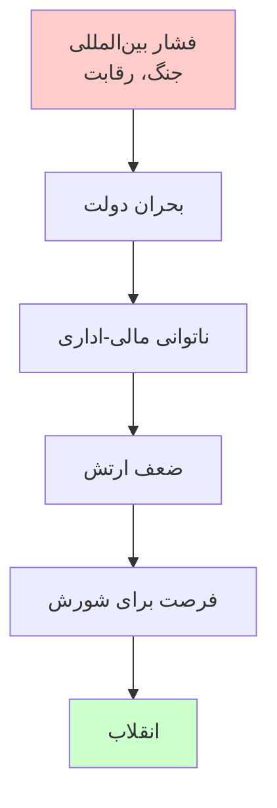

### نظریه‌ی هانتینگتون

| معادله | توضیح |
| --- | --- |
| **ثبات = نهادمندی / مشارکت** | اگر مشارکت بیش از ظرفیت نهادی رشد کند → بی‌ثباتی |
| **نقش ارتش** | نهاد جایگزین یا ابزار سرکوب |
| **پیش‌بینی** | در جوامع در حال توسعه، ارتش یا سرکوب می‌کند یا کودتا می‌کند |

### نظریه‌ی تیلی: مدل سیاست‌ستیزانه

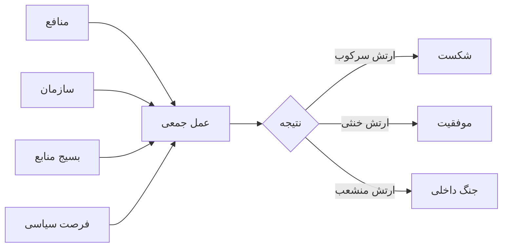

---

## ۱.۳ مدل تحلیلی این مطالعه

### سه سطح تحلیل

| سطح | متغیرها | سؤال کلیدی |
| --- | --- | --- |
| **ساختاری** | ترکیب طبقاتی/قومی، رابطه‌ی ارتش-جامعه | ارتش از چه گروه‌هایی تشکیل شده؟ |
| **سازمانی** | منافع نهادی، انسجام، فرماندهی | منافع ارتش چیست؟ |
| **فردی** | انگیزه‌ی سربازان، پیوند با معترضان | سربازان چه می‌خواهند؟ |

### مدل علّی

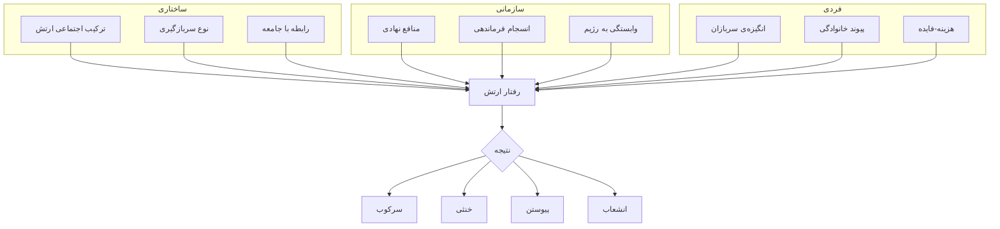

---

---

# بخش دوم: گونه‌شناسی رفتار نظامی

## ۲.۱ پنج الگوی اصلی رفتار ارتش

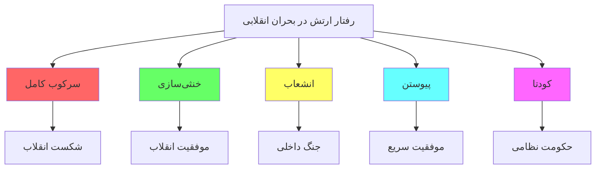

---

## ۲.۲ تشریح هر الگو

### الگوی ۱: سرکوب کامل

| ویژگی | توضیح |
| --- | --- |
| **تعریف** | ارتش کاملاً و مؤثر از رژیم دفاع می‌کند |
| **پیش‌شرط** | وفاداری بالا، انسجام، منابع کافی |
| **نتیجه** | شکست انقلاب |
| **هزینه** | خشونت بالا، مشروعیت پایین |

**نمونه‌های تاریخی:**

| نمونه | سال | توضیح |
| --- | --- | --- |
| چین (تیانانمن) | ۱۹۸۹ | سرکوب کامل، ۳۰۰-۳۰۰۰ کشته |
| بحرین | ۲۰۱۱ | سرکوب با کمک عربستان |
| ازبکستان (آندیجان) | ۲۰۰۵ | کشتار ۷۰۰+ نفر |
| میانمار | ۱۹۸۸، ۲۰۲۱ | سرکوب مکرر |

---

### الگوی ۲: خنثی‌سازی

| ویژگی | توضیح |
| --- | --- |
| **تعریف** | ارتش از سرکوب خودداری می‌کند |
| **پیش‌شرط** | فشار افکار عمومی، تردید در پیروزی |
| **نتیجه** | سقوط رژیم بدون جنگ داخلی |
| **مزیت** | کمترین خشونت |

**نمونه‌های تاریخی:**

| نمونه | سال | توضیح |
| --- | --- | --- |
| ایران | ۱۹۷۹ | اعلام بی‌طرفی ۱۱ بهمن |
| فیلیپین | ۱۹۸۶ | امتناع از سرکوب |
| تونس | ۲۰۱۱ | ارتش از بن‌علی حمایت نکرد |
| آلمان شرقی | ۱۹۸۹ | عدم سرکوب |

---

### الگوی ۳: انشعاب

| ویژگی | توضیح |
| --- | --- |
| **تعریف** | بخشی از ارتش می‌پیوندد، بخشی وفادار می‌ماند |
| **پیش‌شرط** | شکاف‌های درونی (قومی، طبقاتی، نسلی) |
| **نتیجه** | جنگ داخلی |
| **هزینه** | خشونت بسیار بالا |

**نمونه‌های تاریخی:**

| نمونه | سال | توضیح |
| --- | --- | --- |
| روسیه | ۱۹۱۷-۲۱ | ارتش سرخ vs سفید |
| اسپانیا | ۱۹۳۶ | جنگ داخلی ۳ ساله |
| لیبی | ۲۰۱۱ | انشعاب → مداخله‌ی ناتو |
| سوریه | ۲۰۱۱+ | انشعاب محدود + جنگ داخلی |
| یمن | ۲۰۱۱+ | انشعاب گسترده |

---

### الگوی ۴: پیوستن فعال

| ویژگی | توضیح |
| --- | --- |
| **تعریف** | ارتش فعالانه به انقلاب می‌پیوندد |
| **پیش‌شرط** | نارضایتی عمیق در ارتش |
| **نتیجه** | موفقیت سریع |
| **ریسک** | نظامی شدن انقلاب |

**نمونه‌های تاریخی:**

| نمونه | سال | توضیح |
| --- | --- | --- |
| روسیه (فوریه) | ۱۹۱۷ | شورش هنگ‌ها |
| پرتغال | ۱۹۷۴ | کودتای افسران جوان |
| اتیوپی | ۱۹۷۴ | شورش نظامی |
| رومانی | ۱۹۸۹ | پیوستن در لحظه‌ی آخر |

---

### الگوی ۵: کودتا / «سرقت» انقلاب

| ویژگی | توضیح |
| --- | --- |
| **تعریف** | ارتش قدرت را برای خود می‌گیرد |
| **پیش‌شرط** | ضعف نیروهای مدنی |
| **نتیجه** | حکومت نظامی |
| **ریسک** | استبداد جدید |

**نمونه‌های تاریخی:**

| نمونه | سال | توضیح |
| --- | --- | --- |
| مصر | ۲۰۱۳ | کودتای سیسی علیه مرسی |
| الجزایر | ۱۹۹۲ | لغو انتخابات |
| سودان | ۲۰۱۹، ۲۰۲۱ | کودتاهای مکرر |
| میانمار | ۲۰۲۱ | کودتای ارتش |

---

## ۲.۳ ماتریس جامع رفتار-نتیجه

| رفتار ارتش | نتیجه برای انقلاب | نتیجه برای رژیم | نتیجه برای ارتش | سطح خشونت | نمونه |
| --- | --- | --- | --- | --- | --- |
| **سرکوب کامل** | شکست | بقا | حفظ موقعیت | بسیار بالا | چین ۱۹۸۹ |
| **خنثی‌سازی** | موفقیت | سقوط | حفظ نسبی | پایین | ایران ۱۹۷۹ |
| **انشعاب** | نامعلوم | احتمالاً سقوط | تجزیه | بسیار بالا | لیبی ۲۰۱۱ |
| **پیوستن** | موفقیت قطعی | سقوط | ارتقا | پایین-متوسط | پرتغال ۱۹۷۴ |
| **کودتا** | ربوده شدن | سقوط | قدرت مطلق | متغیر | مصر ۲۰۱۳ |

---

---

# بخش سوم: عوامل تعیین‌کننده‌ی رفتار ارتش

## ۳.۱ عوامل ساختاری

### ۳.۱.۱ نوع سربازگیری

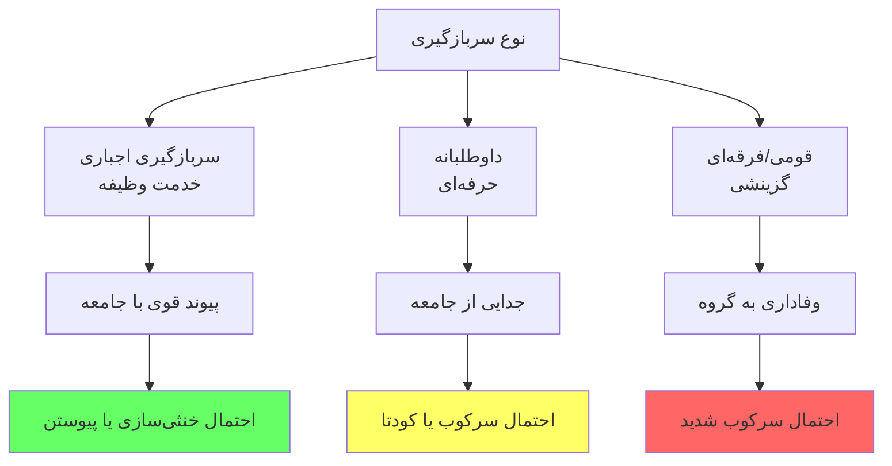

### جدول تفصیلی

| نوع | ویژگی | رفتار محتمل | نمونه |
| --- | --- | --- | --- |
| **وظیفه‌ای** | سربازان از همه‌ی طبقات | خنثی/پیوستن | ایران، روسیه، تونس |
| **حرفه‌ای** | جدا از جامعه، وفادار به نهاد | سرکوب/کودتا | شیلی، آرژانتین |
| **قومی** | از یک قوم/فرقه | سرکوب شدید | سوریه (علوی)، بحرین |
| **ایدئولوژیک** | گزینش بر اساس ایدئولوژی | سرکوب کامل | چین، کره شمالی |

---

### ۳.۱.۲ رابطه‌ی ارتش-حکومت

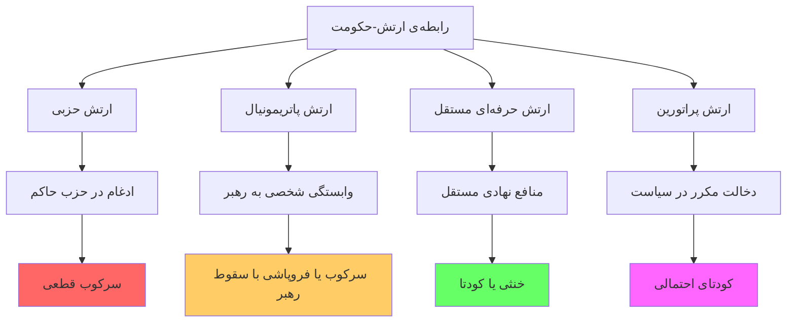

### جدول انواع رابطه‌ی ارتش-حکومت

| نوع رابطه | ویژگی | وفاداری به | رفتار محتمل | نمونه |
| --- | --- | --- | --- | --- |
| **حزبی** | ادغام کامل در حزب | حزب/ایدئولوژی | سرکوب کامل | چین، کوبا، شوروی |
| **پاتریمونیال** | وابسته به شخص رهبر | رهبر | سرکوب یا فروپاشی | لیبی قذافی، عراق صدام |
| **حرفه‌ای** | مستقل، غیرسیاسی | نهاد/ملت | خنثی یا کودتا | تونس، ترکیه |
| **پراتورین** | مداخله‌گر در سیاست | منافع خود | کودتا | پاکستان، مصر |
| **انقلابی** | موازی با ارتش | انقلاب/رهبر | سرکوب داخلی | سپاه ایران |

---

### ۳.۱.۳ ساختار دوگانه‌ی نظامی

بسیاری از رژیم‌های اقتدارگرا **نیروی موازی** در کنار ارتش ایجاد می‌کنند:

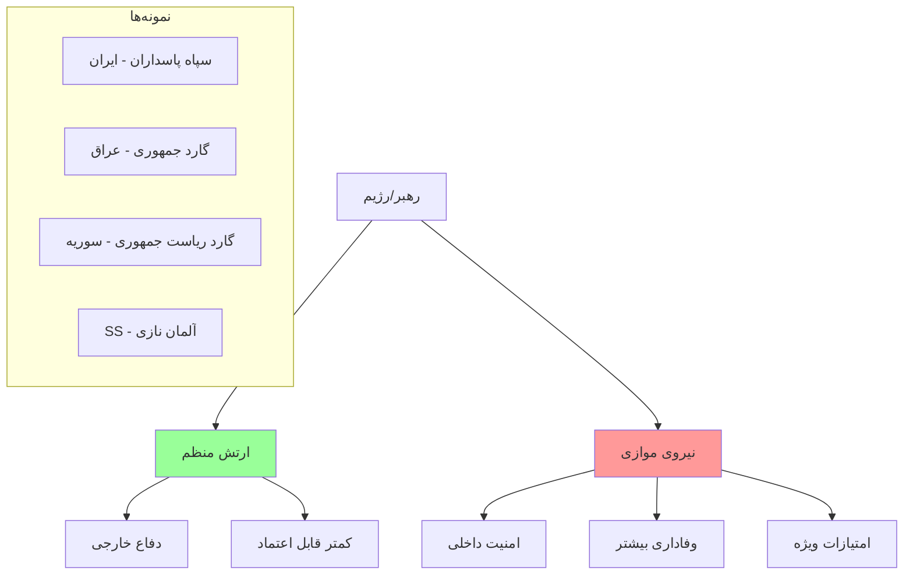

### جدول نیروهای موازی

| کشور | نیروی موازی | ارتش منظم | نتیجه در بحران |
| --- | --- | --- | --- |
| **ایران** | سپاه پاسداران | ارتش | سپاه سرکوب کرد، ارتش خنثی |
| **عراق (صدام)** | گارد جمهوری | ارتش | گارد وفادار تا آخر |
| **سوریه** | گارد + فرقه‌ی چهارم | ارتش | ارتش منشعب شد، گارد وفادار |
| **لیبی** | کتائب امنیه | ارتش | هر دو منشعب شدند |
| **رومانی** | سکوریتاته | ارتش | ارتش پیوست، سکوریتاته سرکوب کرد |

---

## ۳.۲ عوامل سازمانی

### ۳.۲.۱ منافع نهادی ارتش

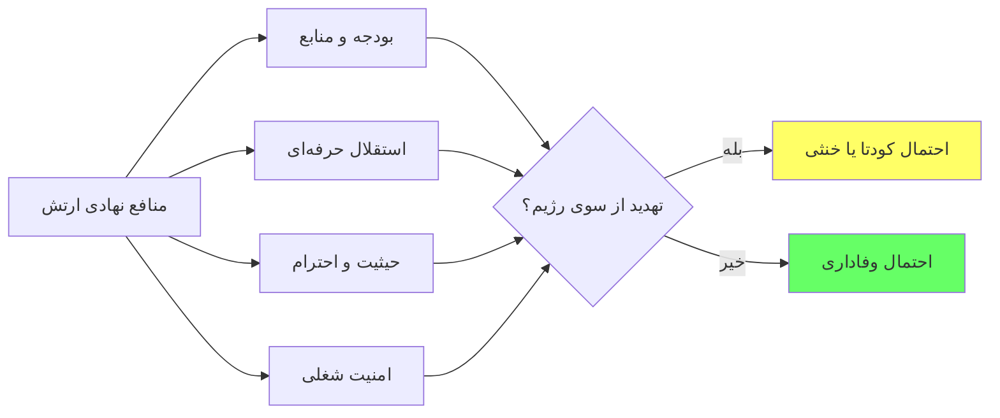

### جدول منافع و رفتار

| وضعیت منافع | رابطه با رژیم | رفتار محتمل | نمونه |
| --- | --- | --- | --- |
| **منافع تأمین** | وابستگی متقابل | سرکوب/وفاداری | چین، مصر |
| **منافع تهدید شده** | تنش | کودتا یا خنثی | ترکیه، پرتغال |
| **منافع در خطر با سقوط رژیم** | وابستگی کامل | سرکوب شدید | سوریه |
| **منافع مستقل از رژیم** | استقلال | خنثی | تونس |

---

### ۳.۲.۲ انسجام سازمانی

| سطح انسجام | ویژگی | رفتار محتمل |
| --- | --- | --- |
| **انسجام بالا** | فرماندهی متحد، بدون شکاف | سرکوب یکپارچه یا خنثی یکپارچه |
| **انسجام متوسط** | اختلافات قابل مدیریت | رفتار متغیر |
| **انسجام پایین** | شکاف‌های عمیق | انشعاب، جنگ داخلی |

### عوامل شکاف در ارتش

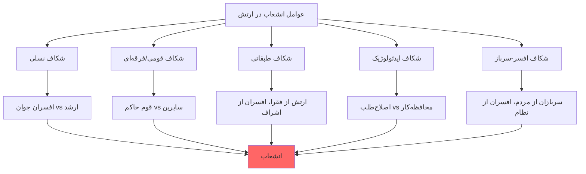

---

## ۳.۳ عوامل فردی

### ۳.۳.۱ انگیزه‌های سربازان و افسران

| عامل | توضیح | تأثیر بر رفتار |
| --- | --- | --- |
| **پیوند خانوادگی** | خانواده در میان معترضان | تمایل به خنثی/پیوستن |
| **هویت قومی/مذهبی** | تعلق به گروه معترض یا حاکم | تعیین‌کننده‌ی جهت‌گیری |
| **منافع اقتصادی** | حقوق، مزایا، فساد | وفاداری به منبع درآمد |
| **ترس از مجازات** | عدالت انتقالی | تمایل به سرکوب تا آخر |
| **باور ایدئولوژیک** | اعتقاد به رژیم | وفاداری ایدئولوژیک |

### ۳.۳.۲ محاسبه‌ی هزینه-فایده

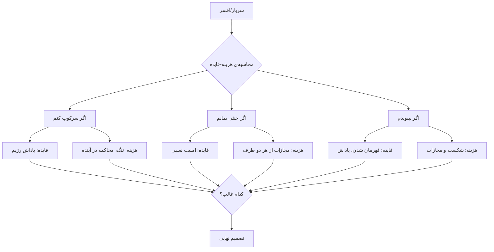

---

## ۳.۴ عوامل زمینه‌ای و موقعیتی

### ۳.۴.۱ ویژگی‌های جنبش انقلابی

| ویژگی جنبش | تأثیر بر ارتش |
| --- | --- |
| **تعداد معترضان** | بیشتر = سخت‌تر سرکوب |
| **پراکندگی جغرافیایی** | گسترده‌تر = سخت‌تر کنترل |
| **ترکیب اجتماعی** | اگر خانواده‌ی سربازان باشند = خنثی‌سازی |
| **استراتژی جنبش** | خشونت‌پرهیزی = سخت‌تر توجیه سرکوب |
| **شعارها** | «ارتش با ماست» = فشار روانی |

### ۳.۴.۲ فشار بین‌المللی

| نوع فشار | تأثیر |
| --- | --- |
| **تحریم** | ضعف اقتصادی رژیم |
| **محکومیت** | کاهش مشروعیت |
| **تهدید محاکمه** | ترس افسران از سرکوب |
| **حمایت از انقلابیون** | تقویت روحیه |
| **مداخله‌ی نظامی** | تغییر موازنه |

---

---

# بخش چهارم: مطالعات موردی

## ۴.۱ نمای کلی ۱۵ انقلاب

| # | انقلاب | سال | رفتار ارتش | نتیجه |
| --- | --- | --- | --- | --- |
| ۱ | آمریکا | ۱۷۷۵-۸۳ | تشکیل ارتش جدید | موفقیت |
| ۲ | فرانسه | ۱۷۸۹ | انشعاب + پیوستن | موفقیت → بی‌ثباتی |
| ۳ | روسیه (فوریه) | ۱۹۱۷ | پیوستن | موفقیت |
| ۴ | روسیه (اکتبر) | ۱۹۱۷ | خنثی/ضعیف | موفقیت |
| ۵ | آلمان | ۱۹۱۸ | شورش | موفقیت |
| ۶ | چین | ۱۹۴۹ | ارتش انقلابی | موفقیت |
| ۷ | کوبا | ۱۹۵۹ | فروپاشی | موفقیت |
| ۸ | ایران | ۱۹۷۹ | خنثی‌سازی | موفقیت |
| ۹ | فیلیپین | ۱۹۸۶ | خنثی + انشعاب | موفقیت |
| ۱۰ | چین (تیانانمن) | ۱۹۸۹ | سرکوب | شکست |
| ۱۱ | رومانی | ۱۹۸۹ | پیوستن | موفقیت |
| ۱۲ | تونس | ۲۰۱۱ | خنثی | موفقیت |
| ۱۳ | مصر | ۲۰۱۱ | کودتا | «سرقت» |
| ۱۴ | لیبی | ۲۰۱۱ | انشعاب | جنگ داخلی |
| ۱۵ | سوریه | ۲۰۱۱ | سرکوب + انشعاب | جنگ داخلی |

---

## ۴.۲ مطالعات موردی تفصیلی

### مورد ۱: انقلاب فرانسه (۱۷۸۹)

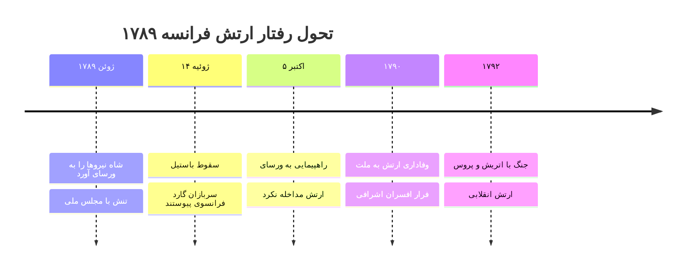

**عوامل رفتار ارتش فرانسه:**

| عامل | وضعیت | تأثیر |
| --- | --- | --- |
| ترکیب | سربازان از طبقات پایین، افسران اشراف | شکاف طبقاتی |
| اقتصاد | حقوق پایین، شرایط بد | نارضایتی |
| ایدئولوژی | نفوذ روشنگری | همدلی با انقلاب |
| فرماندهی | تردید، فرار اشراف | ضعف کنترل |

**نتیجه:** انشعاب → پیوستن بخش بزرگ → تشکیل ارتش انقلابی

---

### مورد ۲: انقلاب روسیه - فوریه ۱۹۱۷

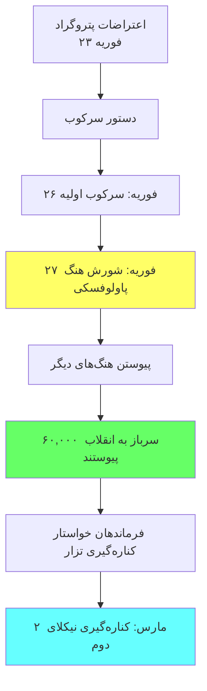

**عوامل پیوستن ارتش:**

| عامل | توضیح |
| --- | --- |
| **جنگ** | خستگی از ۳ سال جنگ، ۱.۷ میلیون کشته |
| **سربازگیری** | سربازان از دهقانان و کارگران |
| **شرایط** | غذا و تجهیزات ناکافی |
| **افسران** | بسیاری کشته شده، جایگزین‌ها بی‌تجربه |
| **پیوند با شهر** | پادگان‌ها در پتروگراد |

---

### مورد ۳: انقلاب ایران (۱۹۷۹)

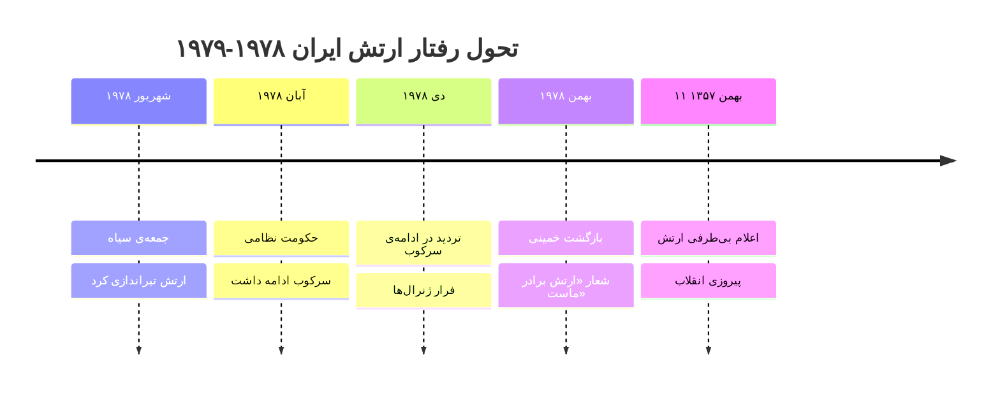

**ساختار نیروهای مسلح ایران:**

| نیرو | تعداد | وفاداری | رفتار نهایی |
| --- | --- | --- | --- |
| **ارتش** | ~۴۱۵,۰۰۰ | متوسط | خنثی/فروپاشی |
| **ژاندارمری** | ~۷۰,۰۰۰ | پایین | خنثی |
| **شهربانی** | ~۴۰,۰۰۰ | پایین | فروپاشی |
| **ساواک** | ~۵,۰۰۰ | بالا | سرکوب تا آخر |
| **گارد جاویدان** | ~۸,۰۰۰ | بسیار بالا | سرکوب تا آخر |

**عوامل خنثی‌سازی:**

| عامل | توضیح |
| --- | --- |
| **سربازان وظیفه** | از خانواده‌های انقلابی |
| **استراتژی خمینی** | «ارتش برادر ماست»، «گل به جای گلوله» |
| **فشار آمریکا** | مأموریت هویزر |
| **فرار شاه** | بلاتکلیفی فرماندهان |
| **حجم اعتراضات** | میلیون‌ها نفر |

---

### مورد ۴: چین - تیانانمن (۱۹۸۹)

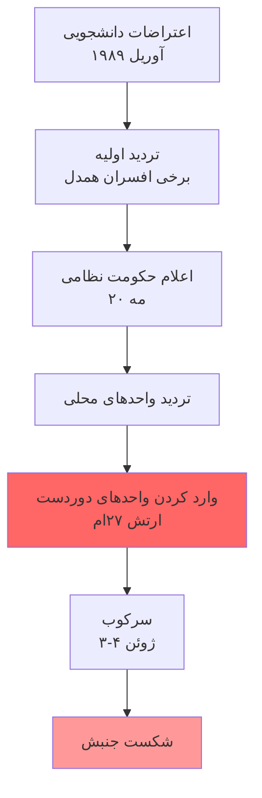

**چرا ارتش سرکوب کرد؟**

| عامل | توضیح |
| --- | --- |
| **ارتش حزبی** | ادغام کامل در حزب کمونیست |
| **جداسازی** | سربازان از روستاهای دور |
| **ایدئولوژی** | آموزش ضد «آشوب بورژوایی» |
| **فرماندهی** | دنگ شیائوپینگ کنترل کامل داشت |
| **واحدهای دوردست** | بدون پیوند با معترضان پکن |
| **سانسور** | سربازان ندانستند چه می‌کنند |

---

### مورد ۵: تونس (۲۰۱۱)

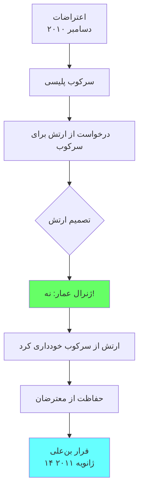

**چرا ارتش تونس خنثی ماند؟**

| عامل | توضیح |
| --- | --- |
| **حرفه‌ای‌گری** | ارتش غیرسیاسی |
| **منافع مستقل** | تحت حاشیه توسط بن‌علی |
| **رقابت با پلیس** | نارضایتی از امتیازات پلیس |
| **ژنرال عمار** | رهبری اخلاقی |
| **سربازگیری ملی** | پیوند با جامعه |

---

### مورد ۶: مصر (۲۰۱۱-۲۰۱۳)

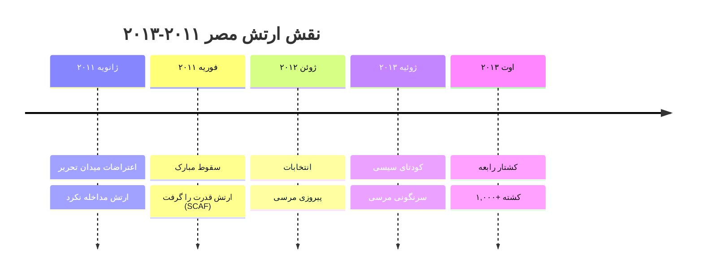

**الگوی «سرقت» انقلاب:**

| مرحله | اقدام ارتش | هدف واقعی |
| --- | --- | --- |
| ۱ | خنثی‌سازی | حفظ نظام بدون مبارک |
| ۲ | شورای نظامی | کنترل گذار |
| ۳ | انتخابات | مشروعیت‌سازی |
| ۴ | کودتا | بازپس‌گیری قدرت |
| ۵ | سرکوب | تثبیت |

---

### مورد ۷: سوریه (۲۰۱۱+)

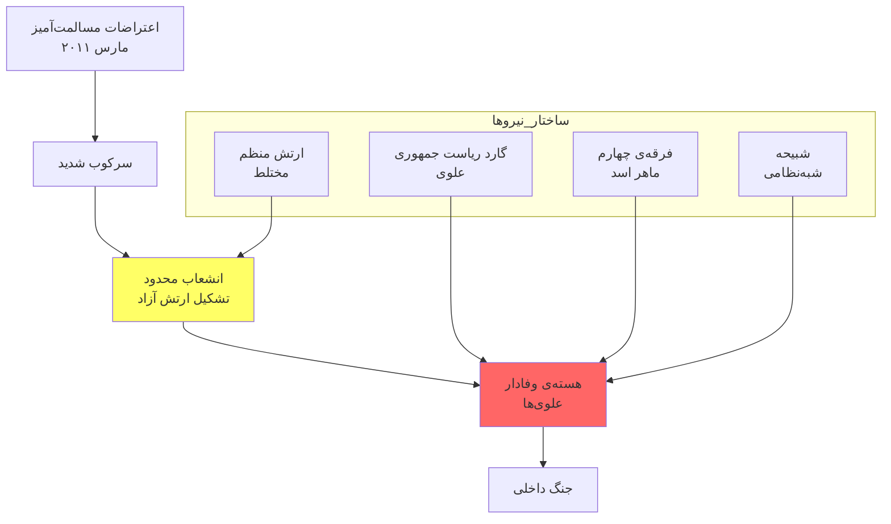

**چرا ارتش سوریه سرکوب کرد؟**

| عامل | توضیح |
| --- | --- |
| **ترکیب فرقه‌ای** | افسران ارشد علوی |
| **سرنوشت مشترک** | علوی‌ها می‌دانستند با سقوط اسد چه می‌شود |
| **نیروهای موازی** | گارد و فرقه‌ی چهارم |
| **کمک خارجی** | روسیه، ایران، حزب‌الله |
| **ترس** | انتقام سنی‌ها |

---

---

# بخش پنجم: تحلیل تطبیقی

## ۵.۱ ماتریس مقایسه‌ای ۱۵ انقلاب

| انقلاب | نوع سربازگیری | رابطه ارتش-رژیم | نیروی موازی | رفتار ارتش | نتیجه‌ی انقلاب |
| --- | --- | --- | --- | --- | --- |
| فرانسه ۱۷۸۹ | وظیفه | سنتی-اشرافی | خیر | انشعاب+پیوستن | موفقیت |
| روسیه ۱۹۱۷ | وظیفه | سنتی | خیر | پیوستن | موفقیت |
| چین ۱۹۴۹ | انقلابی | - | - | ارتش انقلابی | موفقیت |
| کوبا ۱۹۵۹ | حرفه‌ای | پاتریمونیال | خیر | فروپاشی | موفقیت |
| **ایران ۱۹۷۹** | **وظیفه** | **پاتریمونیال** | **محدود** | **خنثی** | **موفقیت** |
| فیلیپین ۱۹۸۶ | حرفه‌ای | پاتریمونیال | خیر | خنثی+انشعاب | موفقیت |
| چین ۱۹۸۹ | وظیفه | حزبی | خیر | سرکوب | شکست |
| رومانی ۱۹۸۹ | وظیفه | حزبی | سکوریتاته | پیوستن | موفقیت |
| تونس ۲۰۱۱ | وظیفه | حرفه‌ای-مستقل | خیر | خنثی | موفقیت |
| مصر ۲۰۱۱ | وظیفه | پراتورین | خیر | کودتا | سرقت |
| لیبی ۲۰۱۱ | مختلط | پاتریمونیال | کتائب | انشعاب | جنگ داخلی |
| سوریه ۲۰۱۱ | وظیفه | فرقه‌ای | گارد | سرکوب+انشعاب | جنگ داخلی |
| یمن ۲۰۱۱ | قبیله‌ای | پاتریمونیال | گارد | انشعاب | جنگ داخلی |
| بحرین ۲۰۱۱ | خارجی | فرقه‌ای | خیر | سرکوب | شکست |
| سودان ۲۰۱۹ | حرفه‌ای | پراتورین | RSF | کودتا+انشعاب | بی‌ثباتی |

---

## ۵.۲ الگوهای آماری

### توزیع رفتار ارتش در ۱۵ انقلاب

| رفتار | تعداد | درصد | نتیجه‌ی غالب |
| --- | --- | --- | --- |
| **سرکوب کامل** | ۲ | ۱۳٪ | شکست انقلاب |
| **خنثی‌سازی** | ۳ | ۲۰٪ | موفقیت انقلاب |
| **پیوستن** | ۳ | ۲۰٪ | موفقیت سریع |
| **انشعاب** | ۴ | ۲۷٪ | جنگ داخلی |
| **کودتا** | ۳ | ۲۰٪ | سرقت/بی‌ثباتی |

### همبستگی عوامل با رفتار

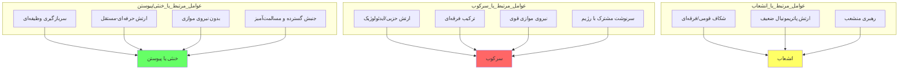

---

## ۵.۳ مقایسه‌ی دو مسیر: ایران vs سوریه

### چرا ایران ۱۹۷۹ موفق شد، سوریه ۲۰۱۱ نه؟

| عامل | ایران ۱۹۷۹ | سوریه ۲۰۱۱ |
| --- | --- | --- |
| **ترکیب ارتش** | ملی، بدون انحصار قومی | علوی‌ها در رأس |
| **سرنوشت مشترک** | خیر | بله (علوی‌ها با اسد) |
| **نیروی موازی** | ضعیف (گارد جاویدان) | قوی (گارد، فرقه‌ی ۴) |
| **شاه** | مردد، ترک کشور | اسد: جنگ تا آخر |
| **کمک خارجی به رژیم** | نه | بله (روسیه، ایران) |
| **حجم جنبش** | میلیونی | صدهاهزار |
| **استراتژی جنبش** | مسالمت‌آمیز | مسلحانه شد |

### نمودار علّی مقایسه‌ای

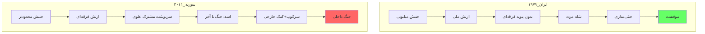

---

## ۵.۴ نقش عامل خارجی

| انقلاب | کمک خارجی به رژیم | کمک خارجی به انقلاب | تأثیر |
| --- | --- | --- | --- |
| آمریکا ۱۷۷۶ | بریتانیا | فرانسه | تعیین‌کننده |
| ایران ۱۹۷۹ | آمریکا (مردد) | - | محدود |
| لیبی ۲۰۱۱ | - | ناتو | تعیین‌کننده |
| سوریه ۲۰۱۱ | روسیه، ایران | محدود | حفظ رژیم |
| بحرین ۲۰۱۱ | عربستان (نظامی) | - | شکست انقلاب |

---

---

# بخش ششم: نتیجه‌گیری و الگوها

## ۶.۱ قوانین کلی

### قانون اول: شرط لازم

> **«موفقیت انقلاب مستلزم خنثی‌سازی، انشعاب، یا پیوستن نیروهای مسلح است. هیچ انقلابی با سرکوب کامل نظامی موفق نشده است.»**
> 

### قانون دوم: ترکیب تعیین‌کننده است

> **«ارتش‌هایی که از همان طبقات/اقوام معترضان هستند، کمتر سرکوب می‌کنند.»**
> 

### قانون سوم: سرنوشت مشترک

> **«اگر سرنوشت ارتش با سرنوشت رژیم گره خورده باشد، سرکوب محتمل‌تر است.»**
> 

### قانون چهارم: نیروی موازی

> **«وجود نیروی موازی وفادار، شانس موفقیت انقلاب را کاهش می‌دهد.»**
> 

### قانون پنجم: استراتژی جنبش

> **«خشونت‌پرهیزی، سرکوب را سخت‌تر توجیه می‌کند و احتمال خنثی‌سازی را افزایش می‌دهد.»**
> 

---

## ۶.۲ مدل پیش‌بینی

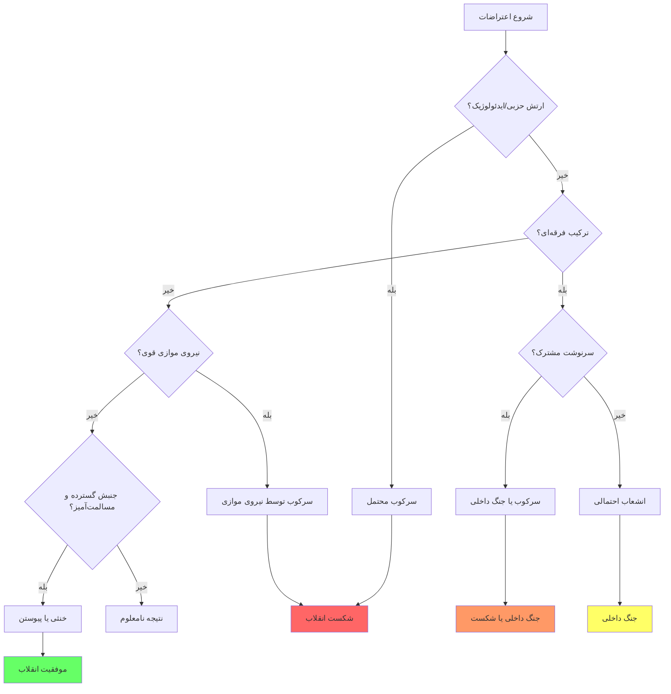

---

## ۶.۳ توصیه‌ها

### برای جنبش‌های انقلابی

| توصیه | توضیح |
| --- | --- |
| **شعار «ارتش برادر ماست»** | فشار روانی برای خنثی‌سازی |
| **خشونت‌پرهیزی** | سخت‌تر کردن توجیه سرکوب |
| **بسیج خانواده‌های سربازان** | تقویت پیوند |
| **جذب افسران ناراضی** | ایجاد شکاف |
| **گسترش جغرافیایی** | غیرممکن کردن سرکوب کامل |

### برای تحلیل‌گران

| سؤال کلیدی | اهمیت |
| --- | --- |
| ارتش از چه طبقه/قومی است؟ | پیش‌بینی همدلی |
| نیروی موازی وجود دارد؟ | پیش‌بینی سرکوب |
| سرنوشت ارتش با رژیم گره خورده؟ | پیش‌بینی وفاداری |
| جنبش چقدر گسترده است؟ | پیش‌بینی هزینه‌ی سرکوب |
| فشار بین‌المللی چیست؟ | پیش‌بینی محاسبه‌ی افسران |

---

## ۶.۴ محدودیت‌های مطالعه

| محدودیت | توضیح |
| --- | --- |
| **تعداد موارد** | ۱۵ مورد برای تعمیم کافی نیست |
| **متغیرهای مداخله‌گر** | عوامل زیادی غیرقابل کنترل |
| **داده‌های ناقص** | اطلاعات درونی ارتش‌ها محدود |
| **تغییرات تاریخی** | الگوهای قرن ۲۱ ممکن است متفاوت باشد |

---

## ۶.۵ پیشنهادات پژوهشی

| موضوع | سؤال |
| --- | --- |
| نقش فناوری | شبکه‌های اجتماعی چگونه بر رفتار ارتش تأثیر می‌گذارد؟ |
| نقش عدالت انتقالی | وعده‌ی عفو چقدر مؤثر است؟ |
| مقایسه‌ی نیروهای موازی | کدام مدل مؤثرتر است؟ |
| نقش افکار عمومی جهانی | فشار بین‌المللی چقدر مهم است؟ |

---

---

# منابع

## منابع اصلی

| نویسنده | اثر | سال |
| --- | --- | --- |
| **Skocpol, Theda** | *States and Social Revolutions* | ۱۹۷۹ |
| **Tilly, Charles** | *From Mobilization to Revolution* | ۱۹۷۸ |
| **Huntington, Samuel** | *Political Order in Changing Societies* | ۱۹۶۸ |
| **Goldstone, Jack** | *Revolution and Rebellion in the Early Modern World* | ۱۹۹۱ |
| **Bellin, Eva** | *Reconsidering the Robustness of Authoritarianism* | ۲۰۱۲ |
| **Nepstad, Sharon* | *Nonviolent Revolutions* | ۲۰۱۱ |
| **Lee, Terence** | *Defect or Defend: Military Responses to Popular Protests* | ۲۰۱۵ |
| **Albrecht, Holger** | *Armies and Insurgencies in the Arab Spring* | ۲۰۱۵ |

## منابع فارسی

| نویسنده | اثر |
| --- | --- |
| آبراهامیان، یرواند | *ایران بین دو انقلاب* |
| فوران، جان | *مقاومت شکننده* |
| کاتوزیان، همایون | *اقتصاد سیاسی ایران* |

---

> **«ارتش نمی‌تواند یک ملت را برای همیشه سرکوب کند. یا باید بپیوندد، یا باید کنار برود، یا باید در جنگ داخلی نابود شود.»**
> 

---
