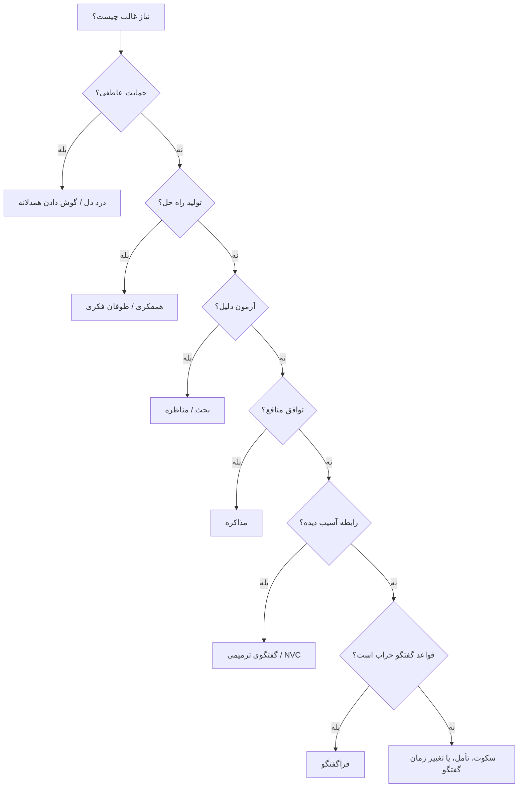

# جغرافیای مفهومی گفتگو

## چکیده

گفتگو فقط «حرف‌زدن» نیست. گفتگو یک میدان زنده است که در آن **معنا، رابطه، قدرت، حقیقت، احساس، هویت، فرهنگ و کنش** هم‌زمان ساخته و بازسازی می‌شوند. یک جمله می‌تواند صرفاً خبری باشد، اما می‌تواند وعده بدهد، تهدید کند، آشتی دهد، تحقیر کند، آموزش دهد، افشا کند، التیام ببخشد یا رابطه‌ای را پایان دهد.

این مقاله یک چارچوب جامع برای فهم گفتگو ارائه می‌کند:

- گفتگو چیست و چه تفاوتی با سخنرانی، بحث، مناظره، مذاکره و درد دل دارد؟
- هر گفتگو را با چه ابعادی باید تحلیل کرد؟
- گونه‌های اصلی گفتگو کدام‌اند؟
- در موقعیت‌های مختلف زندگی، کدام نوع گفتگو مناسب‌تر است؟
- چه نظریه‌هایی درباره گفتگو وجود دارد؟
- چگونه می‌توان گفتگو را مؤثر، اخلاقی و سازنده کرد؟
- چه آسیب‌ها، خطاها و مغالطاتی گفتگو را از مسیر خارج می‌کنند؟
- آزادی بیان چه نسبتی با گفتگو دارد، و چه محدودیت‌هایی نه برای نابودی آزادی، بلکه برای امکان‌پذیر شدن خود آزادی لازم‌اند؟

<aside>
<strong>ایده مرکزی:</strong> گفتگوی خوب یعنی انتخاب «قالب درست» برای «نیاز واقعی» در «موقعیت مشخص»، با حفظ حقیقت، رابطه، امنیت و امکان ترمیم.
</aside>

---

## ۱. گفتگو چیست؟

در فارسی، واژه‌هایی مانند **سخن، گفتار، صحبت، مکالمه، بحث، مباحثه، مناظره، مذاکره، درد دل، مشاوره، خطابه، محاجّه و دیالوگ** گاه به‌جای هم به کار می‌روند، اما از نظر تحلیلی یکسان نیستند.

### تعریف پیشنهادی

**گفتگو** فرایندی ارتباطی است که در آن دو یا چند کنشگر، از راه زبان یا نشانه، برای ساختن یا تغییر دادن فهم، رابطه، تصمیم، احساس یا واقعیت اجتماعی با یکدیگر وارد تعامل می‌شوند.

این تعریف چند نکته دارد:

1. گفتگو فقط کلامی نیست؛ سکوت، نگاه، ژست، نوشتار، تصویر و حتی تأخیر در پاسخ نیز می‌تواند بخشی از گفتگو باشد.
2. گفتگو همیشه بی‌طرف نیست؛ قدرت، نابرابری، ترس، جایگاه اجتماعی و سرمایه فرهنگی در آن اثر می‌گذارند.
3. گفتگو فقط انتقال اطلاعات نیست؛ گفتار می‌تواند «کنش» انجام دهد. نظریه کنش گفتاری آستین و سرل دقیقاً بر همین نکته تأکید دارد که زبان فقط واقعیت را توصیف نمی‌کند، بلکه کارهایی مانند وعده‌دادن، عذرخواهی، دستور دادن، اعلام کردن و متعهد شدن را انجام می‌دهد. ([plato.stanford.edu](https://plato.stanford.edu/archives/fall2020/entries/speech-acts/))
4. گفتگو می‌تواند سالم، نیمه‌سالم یا آسیب‌زا باشد.

---

## ۲. سه لایه اصلی هر گفتگو

هر گفتگو را می‌توان از سه لایه دید:

| لایه | پرسش اصلی | مثال |
|---|---|---|
| لایه معنا | درباره چه چیزی حرف می‌زنیم؟ | حقیقت، مسئله، خاطره، نیاز، تصمیم |
| لایه رابطه | با چه نسبتی حرف می‌زنیم؟ | دوست، والد، رئیس، استاد، پزشک، شهروند |
| لایه کنش | با این حرف چه کاری انجام می‌دهیم؟ | اقناع، تهدید، دعوت، التیام، تعهد، اعتراض |

### نمونه

جمله‌ی «باید بیشتر مسئولیت‌پذیر باشی» بسته به موقعیت می‌تواند این‌ها باشد:

- نصیحت والد به فرزند
- بازخورد مدیر به کارمند
- حمله عاطفی همسر به همسر
- تشخیص درمانگر در جلسه مشاوره
- کنایه در یک گفتگوی دوستانه
- تلاش برای کنترل دیگری

پس معنای گفتگو فقط در واژه‌ها نیست؛ در **موقعیت** است.

---

## ۳. ابعاد تشخیص موقعیت گفتگو

برای فهم هر گفتگو، باید آن را روی چند محور تحلیل کرد.

## ۳.۱ تعداد طرفین

| نوع | توضیح | نمونه |
|---|---|---|
| یک‌جانبه | یک گوینده و مخاطب منفعل یا غایب | سخنرانی، پادکست تک‌نفره، دعا، اعتراف |
| دوجانبه | دو طرف فعال | مصاحبه، مشاوره، مکالمه، مذاکره |
| چندجانبه | چند نفر با نقش‌های مختلف | جلسه، پنل، شورای خانوادگی |
| جمعی | گروه به‌مثابه یک میدان گفتگویی | حلقه یادگیری، طوفان فکری، گفتگوی بوهمی |

## ۳.۲ نیت گفتگو

| نیت | هدف | مثال |
|---|---|---|
| رقابتی | غلبه، دفاع، شکست دادن استدلال طرف مقابل | مناظره سیاسی، دادگاه |
| مشارکتی | ساختن فهم یا راه‌حل مشترک | همفکری، طراحی تیمی |
| ترمیمی | بازسازی رابطه آسیب‌دیده | عذرخواهی، گفتگوی پس از تعارض |
| درمانی | فهم احساس، نیاز و رنج | مشاوره، روان‌درمانی |
| آیینی | پیوند با امر قدسی یا جمعی | دعا، مناجات، مباهله، ذکر |
| آموزشی | انتقال و ساختن دانش | تدریس گفتگویی، منتورینگ |

## ۳.۳ رسمیت

رسمیت بر لحن، واژگان، نوبت‌گیری، انتظارها و پیامدها اثر می‌گذارد.

| سطح | نمونه |
|---|---|
| بسیار غیررسمی | گپ دوستانه، شوخی |
| نیمه‌رسمی | جلسه کاری، گفتگوی خانوادگی مهم |
| رسمی | مصاحبه شغلی، مذاکره قراردادی |
| بسیار رسمی | دادگاه، دیپلماسی، مناظره دانشگاهی |

## ۳.۴ رسانه

| رسانه | ویژگی | خطر رایج |
|---|---|---|
| حضوری | غنی از نشانه‌های بدن و لحن | فشار هیجانی |
| تلفنی | لحن هست، بدن نیست | سوءبرداشت از سکوت |
| پیام متنی | قابل تأمل و ثبت‌شدنی | خشکی، سوءتفاهم، اسکرین‌شات |
| ایمیل | رسمی و مستند | سردی یا طولانی‌شدن |
| ویدئو | نیمه‌حضوری | خستگی شناختی |
| شبکه اجتماعی | عمومی، سریع، نمایشی | قطبی‌شدن و اجرای هویتی |
| نامه | کند، عمیق، ناهمزمان | تأخیر در ترمیم سوءتفاهم |

## ۳.۵ رابطه قدرت

| رابطه | مثال | ملاحظه اخلاقی |
|---|---|---|
| متقارن | دوست با دوست، همکار با همکار | رعایت نوبت و احترام متقابل |
| نامتقارن نرم | استاد ـ دانشجو، والد ـ فرزند | مراقبت از سوءاستفاده از مقام |
| نامتقارن سخت | قاضی ـ متهم، رئیس ـ کارمند | شفافیت، حق پاسخ، امنیت روانی |
| پنهان | مشهور ـ ناشناس، اکثریت ـ اقلیت | خطر خاموش‌شدن صدای ضعیف‌تر |

## ۳.۶ عمق

| سطح | توضیح | نمونه |
|---|---|---|
| سطحی | حفظ تماس اجتماعی | احوالپرسی |
| کاربردی | حل کار مشخص | هماهنگی پروژه |
| عاطفی | بیان احساس و نیاز | درد دل |
| تفسیری | فهم معنا و روایت | گفتگوی خانوادگی عمیق |
| فلسفی | پرسش از حقیقت، عدالت، زندگی | گفتگوی سقراطی |
| وجودی | مرگ، ایمان، رنج، عشق، گناه | مناجات، گفتگوی درمانی عمیق |

---

## ۴. گونه‌شناسی گفتگو

## ۴.۱ سکوت معنادار

سکوت همیشه نبود گفتگو نیست. گاهی سکوت خود نوعی گفتار است.

### کاربردها

- احترام
- تأمل
- سوگواری
- حضور درمانی
- عبادت
- پرهیز از تشدید تعارض

### نمونه‌های معروف

- یک دقیقه سکوت در مراسم سوگواری عمومی
- سکوت درمانگر پس از بیان یک خاطره سنگین
- سکوت عارفانه در سنت‌های مراقبه‌ای

### آسیب

سکوت می‌تواند به **قهر خاموش** تبدیل شود؛ یعنی سکوت نه برای فهم، بلکه برای تنبیه عاطفی به کار رود.

### مهارت لازم

- نام‌گذاری سکوت: «می‌خواهم چند لحظه فکر کنم.»
- زمان‌بندی: «الان نمی‌توانم ادامه بدهم؛ امشب برمی‌گردم.»
- مرزبندی: «سکوت من برای تنبیه تو نیست.»

---

## ۴.۲ مونولوگ، سخنرانی و خطابه

مونولوگ یا تک‌گویی شکلی از گفتار است که در آن یک طرف بیشتر گوینده است و طرف دیگر شنونده.

### کاربردها

- آموزش
- خطابه سیاسی
- وعظ
- روایت‌گری
- پادکست
- ارائه دانشگاهی

### نمونه‌های معروف

- خطابه‌های سیاسی و اجتماعی رهبران جنبش‌ها
- سخنرانی‌های TED
- خطبه‌های دینی
- روایت‌گری شفاهی در فرهنگ‌های سنتی

### شاخص موفقیت

- وضوح پیام
- ساختار روایی
- ارتباط با مخاطب
- حفظ توجه
- دعوت به تأمل یا عمل

### آسیب

- تبدیل شدن به وعظ تحقیرآمیز
- حذف امکان پرسش
- القای اقتدار بدون پاسخگویی
- خودنمایی گوینده

---

## ۴.۳ مکالمه روزمره

مکالمه روزمره رایج‌ترین شکل گفتگوست. هدف آن الزاماً حل مسئله نیست؛ گاهی فقط حفظ پیوند اجتماعی است.

### موقعیت‌ها

- احوالپرسی
- گپ کاری
- گفتگوی همسایگی
- پیام‌های کوتاه دوستانه

### مهارت‌ها

- توجه به نشانه‌های خستگی
- رعایت نوبت
- پرهیز از پرسش‌های مزاحم
- شناخت سطح صمیمیت

### آسیب

- فضولی
- غیبت
- شوخی تحقیرآمیز
- طولانی‌کردن بی‌ملاحظه

---

## ۴.۴ بحث و مباحثه

بحث زمانی رخ می‌دهد که طرفین درباره یک مسئله اختلاف یا ابهام دارند و می‌خواهند آن را روشن کنند.

### هدف

- روشن‌کردن نقاط اختلاف
- آزمون دلیل‌ها
- تصحیح فهم
- رسیدن به موضع دقیق‌تر

### قواعد

1. ادعا را از شخص جدا کن.
2. پیش از نقد، موضع طرف مقابل را درست بازگو کن.
3. از مثال و دلیل استفاده کن.
4. اگر موضعت تغییر کرد، آن را ضعف ندان.
5. بحث را با مناظره یا جنگ کلامی اشتباه نگیر.

### نمونه‌های معروف

- گفت‌وگوهای سقراطی در آثار افلاطون
- مباحثات علمی در سمینارهای دانشگاهی
- جلسات نقد کتاب
- Peer Review در جامعه علمی

### آسیب

- جدل بی‌ثمر
- تکرار موضع بدون شنیدن
- حمله شخصی
- مغالطه کاه‌مرد

---

## ۴.۵ مناظره

مناظره گونه‌ای رسمی‌تر و رقابتی‌تر از بحث است. در مناظره معمولاً مخاطب سوم، داور یا افکار عمومی وجود دارد.

### هدف

- اقناع مخاطب
- آزمودن استدلال‌ها
- مقایسه مواضع
- تصمیم‌سازی عمومی

### نمونه‌های معروف

مناظره تلویزیونی کندی و نیکسون در سال ۱۹۶۰ از نمونه‌های مشهور نقش رسانه در سیاست مدرن است؛ کتابخانه کندی این مناظره را نخستین مناظره تلویزیونی ریاست‌جمهوری آمریکا میان نامزدهای اصلی معرفی می‌کند و به مخاطبان بسیار گسترده آن اشاره دارد. ([jfklibrary.org](https://www.jfklibrary.org/asset-viewer/debate?utm_source=openai))

### قواعد سالم

- زمان برابر
- موضوع مشخص
- داوری یا مدیریت بی‌طرف
- امکان پاسخ
- منع حمله شخصی
- تفکیک ادعا، دلیل و شاهد

### آسیب

مناظره به‌راحتی به **جنگ کلامی** تبدیل می‌شود؛ یعنی هدف از حقیقت‌جویی به شکست‌دادن شخص تغییر می‌کند.

---

## ۴.۶ مذاکره

مذاکره گفتگویی است برای رسیدن به توافق در جایی که منافع، منابع، زمان، مسئولیت یا تصمیم‌ها باید تنظیم شوند.

### موقعیت‌ها

- قرارداد کاری
- تقسیم مسئولیت خانوادگی
- مذاکره سیاسی
- خرید و فروش
- حل اختلاف سازمانی

### نمونه معروف

توافقات کمپ دیوید در سال ۱۹۷۸، با نقش‌آفرینی جیمی کارتر، انور سادات و مناخم بگین، از نمونه‌های مشهور مذاکره سیاسی و دیپلماتیک در قرن بیستم است. ([britannica.com](https://www.britannica.com/event/Camp-David-Accords?utm_source=openai))

### قواعد

1. موضع را از منفعت جدا کن.
2. گزینه‌های متعدد بساز.
3. حداقل جایگزین قابل قبول خود را بشناس.
4. طرف مقابل را تحقیر نکن.
5. توافق را مکتوب و قابل سنجش کن.

### آسیب

- باج‌گیری
- اجبار پنهان
- فرسایش طرف مقابل
- بازی با اطلاعات
- توافقی که یکی از طرفین واقعاً اختیار رد آن را ندارد

---

## ۴.۷ مشاوره و کوچینگ

مشاوره گفتگویی است که در آن یک فرد برای فهم بهتر مسئله، احساس، انتخاب یا مسیر رشد خود از دیگری کمک می‌گیرد.

### تفاوت مشاوره و کوچینگ

| مشاوره | کوچینگ |
|---|---|
| بیشتر بر رنج، تعارض، ابهام یا مشکل تمرکز دارد | بیشتر بر هدف، عملکرد و رشد تمرکز دارد |
| ممکن است درمانی یا حمایتی باشد | معمولاً آینده‌محور و اقدام‌محور است |
| نیازمند مرزهای اخلاقی جدی است | نیازمند قرارداد هدف و پیگیری است |

### قواعد

- شنیدن پیش از راهکار
- پرسش باز
- حفظ محرمانگی
- پرهیز از قضاوت
- احترام به اختیار مراجع

### آسیب

- نسخه‌پیچی
- وابسته‌سازی
- سوءاستفاده از اعتماد
- عبور از صلاحیت حرفه‌ای

---

## ۴.۸ درد دل و گفتگوی همدلانه

درد دل گفتگویی است که هدف اصلی آن حل مسئله فوری نیست، بلکه دیده‌شدن، شنیده‌شدن و سبک‌شدن عاطفی است.

### جمله کلیدی

وقتی کسی درد دل می‌کند، معمولاً اول به این نیاز دارد:

> «می‌فهمم چقدر سخت بوده.»

نه این:

> «خب راه‌حلش اینه که...»

### قواعد

1. اول بازتاب، بعد تحلیل.
2. احساس را معتبر بدان، حتی اگر با تفسیر موافق نیستی.
3. اجازه بگیر: «دوست داری فقط گوش بدهم یا نظر هم بدهم؟»
4. غایب‌کوبی را تشویق نکن.
5. محرمانگی را رعایت کن.

### آسیب

- تبدیل به غیبت
- بازتولید قربانی‌بودن
- وابستگی عاطفی یک‌طرفه
- خالی‌کردن هیجان بدون مسئولیت‌پذیری

---

## ۴.۹ گفتگوی ترمیمی

گفتگوی ترمیمی زمانی لازم است که رابطه آسیب دیده، اعتماد شکسته یا رنجی ایجاد شده است.

### کاربردها

- پس از خیانت، دروغ یا بی‌توجهی
- اختلاف خانوادگی
- تعارض کاری
- خطای سازمانی
- آشتی اجتماعی

### نمونه معروف

کمیسیون حقیقت و آشتی آفریقای جنوبی نمونه‌ای شناخته‌شده از تلاش نهادی برای مواجهه با حقیقت، شنیدن رنج و حرکت به سوی آشتی پس از خشونت و آپارتاید است. وبگاه رسمی این کمیسیون آن را بخشی از مسیر کشور به سوی حقوق بشر و دموکراسی معرفی می‌کند. ([justice.gov.za](https://www.justice.gov.za/TRC/index.html?utm_source=openai))

### ساختار پیشنهادی

1. چه اتفاقی افتاد؟
2. چه اثری بر تو گذاشت؟
3. من چه مسئولیتی دارم؟
4. چه نیازی آسیب دید؟
5. چه چیزی برای ترمیم لازم است؟
6. از این به بعد چه تعهدی می‌دهیم؟

### آسیب

- عذرخواهی نمایشی
- فشار برای بخشش
- بازخواست تحقیرآمیز
- نادیده‌گرفتن عدم توازن قدرت

---

## ۴.۱۰ طوفان فکری و همفکری

طوفان فکری گفتگویی است برای تولید ایده‌های متعدد پیش از داوری.

### قواعد

- در مرحله تولید، نقد نکن.
- ایده خام را نکُش.
- کمیت مهم است.
- ترکیب ایده‌ها مجاز است.
- پس از تولید، مرحله ارزیابی جداگانه داشته باش.

### کاربردها

- طراحی محصول
- حل مسئله سازمانی
- آموزش خلاق
- برنامه‌ریزی اجتماعی

### آسیب

- گروه‌اندیشی
- سلطه افراد پرحرف
- ترس از ایده نامتعارف
- تبدیل جلسه به نقد زودهنگام

---

## ۴.۱۱ فراگفتگو

فراگفتگو یعنی گفتگو درباره خود گفتگو.

### چه زمانی لازم است؟

- وقتی مدام دعوا تکرار می‌شود
- وقتی طرفین درباره موضوع حرف می‌زنند اما مسئله اصلی قواعد گفتگوست
- وقتی یکی احساس می‌کند شنیده نمی‌شود
- وقتی قالب گفتگو غلط انتخاب شده است
- وقتی رسانه مناسب نیست

### مثال

به‌جای ادامه بحث درباره «چه کسی مقصر است»، می‌توان گفت:

> «به نظرم ما داریم همدیگر را قطع می‌کنیم و از موضوع اصلی دور می‌شویم. بیایید اول درباره روش حرف‌زدنمان توافق کنیم.»

### آسیب

- تحلیل‌زدگی
- فرار از موضوع اصلی
- تبدیل هر احساس به بحث فرایندی
- خسته‌کردن رابطه

---

## ۵. لایه ایرانی ـ اسلامی گفتگو

در سنت ایرانی ـ اسلامی، گفتگو صرفاً تکنیک ارتباطی نیست؛ با **ادب، حقیقت، سلوک، مرجعیت، آیین، شعر، تفسیر و حضور** پیوند دارد.

| گونه | تعریف | ارزش | آسیب |
|---|---|---|---|
| محاجّه قرآنی | گفتگوی استدلالی، دعوتی و تمثیلی | حقیقت‌جویی | جدل بی‌ثمر |
| مناظره حوزوی | تقریر، اشکال، پاسخ، نقض و ابرام | دقت مفهومی | غلبه‌طلبی لفظی |
| مباهله | واگذاری داوری نهایی به امر قدسی | تعهد وجودی | نمایش تهدیدآمیز |
| مناجات | گفتگوی یک‌جانبه اما رابطه‌مند با خدا | پاکسازی درون | تکرار بی‌حضور |
| ذکر و حلقه عرفانی | هم‌آوایی، حضور، سکوت و ریتم جمعی | هم‌نفسی | هیجان بی‌معنا |
| مراد ـ مرید | گفتگوی تربیتی در رابطه نامتقارن | تربیت باطنی | اطاعت کورکورانه |
| رسائل و مکاتبات | گفتگوی ناهمزمان و تأملی | عمق و آهستگی | ابهام بی‌اصلاح فوری |
| شطحیات | گفتار پارادوکسیکال عارفانه | گشودن افق | بدفهمی یا خودنمایی |

---

## ۶. گفتگو در دوره‌ها و موقعیت‌های مختلف زندگی

## ۶.۱ کودکی

| موقعیت | نوع گفتگوی مناسب | خطر |
|---|---|---|
| آموزش نظم | گفتگوی ساده، تکراری، مهربان | تحقیر |
| ترس و گریه | همدلی و نام‌گذاری احساس | نصیحت زودهنگام |
| کنجکاوی | پرسش و پاسخ اکتشافی | خاموش‌کردن پرسش |
| خطا | گفتگوی ترمیمی ساده | شرم‌سازی |

### جمله مفید

> «می‌فهمم ناراحتی. بیا ببینیم چه شد و دفعه بعد چه کار می‌توانیم بکنیم.»

---

## ۶.۲ نوجوانی

| موقعیت | نوع گفتگو | نکته |
|---|---|---|
| استقلال‌خواهی | مذاکره مرزها | مرز بدون تحقیر |
| بحران هویت | گفتگوی عمیق | شنیدن بدون بازجویی |
| تعارض خانوادگی | فراگفتگو | توافق بر قواعد |
| انتخاب رشته یا مسیر | کوچینگ | پرسش باز |

### خطر

نوجوان اگر گفتگو را بازجویی تجربه کند، به سکوت دفاعی یا پنهان‌کاری می‌رود.

---

## ۶.۳ دوستی

| موقعیت | نوع گفتگو |
|---|---|
| حمایت | درد دل |
| اختلاف | گفتگوی ترمیمی |
| تصمیم مشترک | مذاکره سبک |
| رشد مشترک | گفتگوی تأملی |

### خطر

- غیبت به نام درد دل
- فرسودگی شنونده
- شوخی‌های تحقیرآمیز
- مرزهای مبهم

---

## ۶.۴ رابطه عاطفی و ازدواج

| موقعیت | نوع گفتگوی مناسب | نکته |
|---|---|---|
| برنامه‌ریزی مالی | مذاکره | شفافیت عددی |
| رنجش | گفتگوی ترمیمی | سرزنش را به نیاز ترجمه کن |
| صمیمیت | گفتگوی عمیق | حضور بی‌دفاع |
| تعارض تکراری | فراگفتگو | الگو را ببین، نه فقط محتوا |
| تصمیم بزرگ | گفتگوی تصمیم‌محور | معیارها را مکتوب کن |

### جمله مفید

> «وقتی این اتفاق افتاد، من احساس تنهایی کردم، چون نیاز داشتم بدانم با هم هستیم. می‌توانیم درباره شیوه هماهنگی‌مان حرف بزنیم؟»

این جمله به الگوی ارتباط بدون خشونت نزدیک است؛ در NVC معمولاً چهار مؤلفه مشاهده، احساس، نیاز و درخواست مطرح می‌شود. ([nonviolentcommunication.com](https://www.nonviolentcommunication.com/pdf_files/4_components_of_NVC.pdf?utm_source=openai))

---

## ۶.۵ محیط کار

| موقعیت | نوع گفتگو | شاخص موفقیت |
|---|---|---|
| جلسه تصمیم | گفتگوی هدف‌محور | تصمیم روشن |
| بازخورد عملکرد | گفتگوی بازخوردی | رفتار قابل اصلاح |
| اختلاف تیمی | میانجی‌گری | توافق عملی |
| نوآوری | طوفان فکری | ایده‌های متنوع |
| مذاکره حقوق | مذاکره | توافق منصفانه |
| بحران سازمانی | گفتگوی شفاف | اعتماد و مسئولیت‌پذیری |

### خطرهای رایج

- جلسه بی‌دستور
- سلطه مدیر
- موافقت ظاهری
- سکوت کارکنان از ترس پیامد
- بازخورد مبهم و شخصی

---

## ۶.۶ دانشگاه و علم

| موقعیت | نوع گفتگو |
|---|---|
| کلاس | گفتگوی آموزشی |
| سمینار | بحث علمی |
| دفاع پایان‌نامه | مناظره علمی کنترل‌شده |
| مقاله | Peer Review |
| همکاری پژوهشی | همفکری ساختاریافته |

### ارزش اصلی

در علم، گفتگو باید امکان خطاپذیری، نقد و اصلاح را حفظ کند.

---

## ۶.۷ سیاست و شهروندی

| موقعیت | نوع گفتگو |
|---|---|
| انتخابات | مناظره عمومی |
| قانون‌گذاری | گفتگوی نهادی |
| اعتراض | بیان عمومی و مطالبه‌گری |
| منازعه اجتماعی | گفتگوی ملی یا میانجی‌گری |
| رسانه | گفتگوی عمومی مسئولانه |

### خطر

- قطبی‌شدن
- پروپاگاندا
- برچسب‌زنی
- حذف صدای اقلیت
- تبدیل گفتگو به نمایش وفاداری گروهی

---

## ۶.۸ فضای دیجیتال و شبکه اجتماعی

فضای دیجیتال گفتگو را سریع‌تر، عمومی‌تر، نمایشی‌تر و ماندگارتر می‌کند.

### ویژگی‌ها

- مخاطب نامرئی
- اسکرین‌شات‌پذیری
- سرعت واکنش
- الگوریتم‌های تقویت خشم
- پاداش اجتماعی برای تندی
- فقدان لحن و بدن

### راهکار

1. پیش از پاسخ مکث کن.
2. متن را با بدترین لحن ممکن خوانده ندان.
3. اگر موضوع حساس است، رسانه را تغییر بده.
4. بحث عمومی را با ترمیم خصوصی اشتباه نگیر.
5. هر چیزی که قابل توضیح حضوری نیست، در توییت یا کامنت ننویس.

---

## ۷. نظریه‌ها و نگرش‌های مهم درباره گفتگو

## ۷.۱ بوبر: رابطه من ـ تو

مارتین بوبر گفتگوی اصیل را در نسبت «من ـ تو» می‌بیند؛ یعنی دیگری را نه ابزار، نه شیء و نه مسئله، بلکه حضوری زنده و غیرقابل تقلیل تجربه کنیم. منابع فلسفی بوبر نشان می‌دهند که آثار او از عرفان یهودی تا فلسفه اجتماعی، تعلیم و تربیت و انسان‌شناسی فلسفی گسترده است. ([plato.stanford.edu](https://plato.stanford.edu/entries/buber/?utm_source=openai))

### کاربرد

- رابطه درمانی
- تعلیم و تربیت
- گفتگوی معنوی
- عشق و دوستی
- اخلاق مراقبت

### خطر

اگر ساده‌سازی شود، ممکن است گفتگو را بیش از حد رمانتیک کند و نابرابری قدرت را نادیده بگیرد.

---

## ۷.۲ هابرماس: کنش ارتباطی

هابرماس گفتگو را بخشی از عقلانیت ارتباطی می‌فهمد؛ یعنی انسان‌ها می‌توانند از راه دلیل، تفاهم و گفتگوی آزاد، هماهنگی اجتماعی بسازند. در معرفی فلسفه هابرماس در دانشنامه فلسفه استنفورد، کنش ارتباطی شکلی از هماهنگی اجتماعی دانسته می‌شود که با امکان توافق عقلانی پیوند دارد. ([plato.stanford.edu](https://plato.stanford.edu/archives/fall2019/entries/habermas/?utm_source=openai))

### کاربرد

- دموکراسی
- فضای عمومی
- اخلاق گفتگویی
- نقد قدرت
- گفتگوی نهادی

### خطر

اگر شرایط واقعی قدرت، رسانه، پول، ترس و نابرابری دیده نشود، ایده گفتگوی عقلانی بیش از حد ایدئال می‌شود.

---

## ۷.۳ بوهم: گفتگوی تعلیقی و جمعی

دیوید بوهم گفتگو را روشی برای مشاهده جریان فکر جمعی می‌دانست. در معرفی گفتگوی بوهمی بر تعلیق داوری، گوش‌دادن و مشاهده پیش‌فرض‌های فرهنگی تأکید شده است. ([bohmdialogue.org](https://www.bohmdialogue.org/?utm_source=openai))

### کاربرد

- گروه‌های یادگیری
- سازمان‌ها
- تعارضات عمیق
- گفتگوی بین‌فرهنگی
- خودآگاهی جمعی

### خطر

- بی‌ساختاری
- مبهم‌ماندن خروجی
- فرار از تصمیم
- مناسب نبودن برای بحران‌های فوری

---

## ۷.۴ گرایس: اصل همکاری

پل گرایس نشان داد که فهم مکالمه فقط از معنای لغوی جمله نمی‌آید، بلکه شنونده بر اساس فرض همکاری، نیت گوینده و قواعد ضمنی معنا را استنباط می‌کند. اصل همکاری گرایس و چهار مقوله کمیت، کیفیت، ربط و شیوه از پایه‌های مهم پراگماتیک مکالمه‌اند. ([plato.stanford.edu](https://plato.stanford.edu/archives/spr2017/entries/grice/))

### چهار اصل کاربردی

| اصل | پرسش |
|---|---|
| کمیت | آیا به اندازه کافی و نه بیش از حد گفته‌ام؟ |
| کیفیت | آیا چیزی می‌گویم که برایش دلیل دارم؟ |
| ربط | آیا حرفم به موضوع مربوط است؟ |
| شیوه | آیا روشن، منظم و قابل فهم حرف می‌زنم؟ |

### خطر

این اصول را نباید به نسخه مکانیکی ادب تبدیل کرد؛ زمینه فرهنگی و قدرت همیشه مهم است.

---

## ۷.۵ نظریه کنش گفتاری: آستین و سرل

نظریه کنش گفتاری نشان می‌دهد که زبان فقط برای توصیف نیست؛ با زبان کار انجام می‌دهیم. دانشنامه فلسفه استنفورد نیز بر اثرگذاری این نظریه در فلسفه، زبان‌شناسی، روان‌شناسی، نظریه حقوق، هوش مصنوعی و حوزه‌های دیگر تأکید می‌کند. ([plato.stanford.edu](https://plato.stanford.edu/archives/fall2020/entries/speech-acts/))

### نمونه‌ها

| جمله | کنش |
|---|---|
| «قول می‌دهم.» | تعهد |
| «متأسفم.» | عذرخواهی |
| «اخراجی.» | اعمال قدرت نهادی |
| «قبول دارم.» | پذیرش |
| «اعتراض دارم.» | چالش رسمی |

### کاربرد

- حقوق
- سیاست
- روابط سازمانی
- آموزش
- هوش مصنوعی مکالمه‌ای

---

## ۷.۶ ارتباط بدون خشونت

ارتباط بدون خشونت یا NVC، که با نام مارشال روزنبرگ شناخته می‌شود، بر تفکیک مشاهده از قضاوت، بیان احساس، شناخت نیاز و طرح درخواست مشخص تأکید دارد. منابع آموزشی NVC معمولاً این چهار مؤلفه را به صورت Observation, Feeling, Need, Request معرفی می‌کنند. ([nonviolentcommunication.com](https://www.nonviolentcommunication.com/pdf_files/4_components_of_NVC.pdf?utm_source=openai))

### فرمول ساده

> وقتی [مشاهده بی‌قضاوت] را می‌بینم/می‌شنوم، احساس [احساس] می‌کنم، چون نیاز به [نیاز] دارم. آیا مایلی [درخواست مشخص]؟

### مثال

> وقتی دیشب بدون اطلاع دیر آمدی، نگران و تنها شدم، چون نیاز به اطمینان و هماهنگی دارم. آیا می‌توانیم توافق کنیم اگر بیشتر از نیم ساعت دیر شد، پیام بدهیم؟

### خطر

- مصنوعی‌شدن
- استفاده ابزاری برای کنترل دیگری
- تبدیل احساس به تکنیک
- نادیده‌گرفتن خشونت ساختاری

---

## ۸. آزادی بیان و گفتگو

آزادی بیان شرط مهم گفتگوی اجتماعی است. اگر مردم نتوانند نظر، نقد، اعتراض، پرسش و تجربه خود را بیان کنند، گفتگو به نمایش اطاعت تبدیل می‌شود.

## ۸.۱ آزادی بیان به‌مثابه شرط گفتگو

ماده ۱۹ اعلامیه جهانی حقوق بشر حق آزادی عقیده و بیان را شامل آزادی داشتن عقیده بدون مداخله و جست‌وجو، دریافت و انتشار اطلاعات و افکار از هر رسانه و بدون مرز می‌داند. ([un.org](https://www.un.org/en/universal-declaration-human-rights/?utm_source=openai))

در سنت حقوق اساسی آمریکا نیز متمم اول قانون اساسی، دولت را از تصویب قوانینی که آزادی بیان یا مطبوعات را محدود کند منع می‌کند. متن رسمی Constitution Annotated در Congress.gov همین عبارت را درباره منع abridging freedom of speech or of the press آورده است. ([constitution.congress.gov](https://constitution.congress.gov/constitution/amendment-1/?utm_source=openai))

اما آزادی بیان فقط یک حق فردی نیست؛ زیربنای گفتگوی عمومی، نقد قدرت، اصلاح خطا، تولید دانش و زندگی دموکراتیک است.

## ۸.۲ چرا آزادی بیان بدون محدودیت‌های امکان‌ساز، خودش را نابود می‌کند؟

یک سوءفهم رایج این است که هر محدودیتی بر گفتار، ضد آزادی است. اما برخی محدودیت‌ها می‌توانند **شرط امکان آزادی بیان دیگران** باشند.

### مثال

اگر در یک جلسه، فردی با فریاد، تهدید یا تحقیر اجازه حرف‌زدن به دیگران ندهد، حذف موقت آن رفتار الزاماً سانسور نیست؛ ممکن است شرط لازم برای شنیده‌شدن بقیه باشد.

### محدودیت‌های امکان‌ساز

| محدودیت | چرا ممکن است آزادی را ممکن کند؟ |
|---|---|
| منع تهدید | بدون امنیت، افراد ضعیف‌تر سکوت می‌کنند |
| منع افترا و تخریب حیثیت | بدون حداقل حفاظت، گفتگو به ترور شخصیت تبدیل می‌شود |
| حفظ حریم خصوصی | بدون حریم، افشاگری و باج‌گیری جای گفتگو را می‌گیرد |
| منع آزار سازمان‌یافته | حمله جمعی صدای فرد را خاموش می‌کند |
| قواعد نوبت‌گیری | بدون نوبت، پرقدرت‌ها فضا را تصاحب می‌کنند |
| شفافیت مالکیت رسانه | بدون شفافیت، پروپاگاندا خود را گفتگوی آزاد جا می‌زند |
| دسترسی برابر به تریبون | آزادی صوری بدون امکان شنیده‌شدن کافی نیست |

میثاق بین‌المللی حقوق مدنی و سیاسی نیز در ماده ۱۹ آزادی بیان را به رسمیت می‌شناسد، اما اعمال آن را همراه با وظایف و مسئولیت‌ها می‌داند و امکان محدودیت‌های قانونی و ضروری برای احترام به حقوق یا حیثیت دیگران و نیز حفاظت از امنیت ملی، نظم عمومی، سلامت یا اخلاق عمومی را مطرح می‌کند. تفسیر عمومی شماره ۳۴ کمیته حقوق بشر نیز آزادی بیان را برای شفافیت و پاسخگویی اساسی می‌داند. ([docstore.ohchr.org](https://docstore.ohchr.org/SelfServices/FilesHandler.ashx?enc=qSioB1pxIj%2BpYfPuaprgWB1pTbyOHPZJE3qT%2FTiZ%2FZa6aXEFtQRUEpmhhNzeaceZf8Ns4v%2BzzOYtsIaZGTWcvg%3D%3D&utm_source=openai))

<aside>
<strong>یادداشت حقوقی:</strong> این بخش تحلیل عمومی و فلسفی است، نه مشاوره حقوقی. قوانین آزادی بیان در نظام‌های حقوقی مختلف متفاوت‌اند.
</aside>

## ۸.۳ چهار مدل رابطه گفتگو و آزادی بیان

| مدل | تعریف | خطر |
|---|---|---|
| مدل بازار ایده‌ها | حقیقت از رقابت آزاد ایده‌ها بیرون می‌آید | نادیده‌گرفتن قدرت و سرمایه رسانه‌ای |
| مدل کرامت | بیان باید با شأن انسانی سازگار باشد | تبدیل کرامت به ابزار سانسور |
| مدل دموکراتیک | آزادی بیان شرط مشارکت سیاسی است | کاهش گفتگو به سیاست رسمی |
| مدل ترمیمی | بیان باید امکان ترمیم رابطه و جامعه را حفظ کند | فشار بر قربانی برای آشتی زودهنگام |

## ۸.۴ آزادی بیان و مسئولیت شنیدن

آزادی بیان فقط حق گفتن نیست؛ جامعه آزاد به ظرفیت شنیدن نیز نیاز دارد.

### بدون شنیدن چه می‌شود؟

- حقیقت به فریاد تبدیل می‌شود.
- اعتراض به نمایش خشم تقلیل می‌یابد.
- رسانه به میدان قبیله‌ها تبدیل می‌شود.
- گفتگو جای خود را به سیگنال‌دهی هویتی می‌دهد.

### اصل پیشنهادی

> حق بیان بدون امکان شنیده‌شدن، آزادی ناقص است؛ و حق شنیده‌شدن بدون حق نقد، اقتدارگرایی نرم است.

---

## ۹. آسیب‌شناسی گفتگو

## ۹.۱ نقشه انحرافات

| صورت سالم | صورت آسیب‌دیده | سازوکار آسیب | ترمیم |
|---|---|---|---|
| گفتگو | مونولوگ موازی | هر طرف فقط نوبت حرف خود را انتظار می‌کشد | بازتاب شنیده‌ها |
| مناظره | جنگ کلامی | هدف شکست شخص می‌شود | قواعد داوری |
| مذاکره | باج‌گیری | اختیار واقعی حذف می‌شود | بازگشت به گزینه‌های جایگزین |
| مشاوره | نسخه‌پیچی | شنیدن جای خود را به کنترل می‌دهد | پرسش باز |
| درد دل | غیبت | تخلیه هیجان با تخریب غایب | مرزبندی اخلاقی |
| طوفان فکری | گروه‌اندیشی | هماهنگی ظاهری جای تنوع ایده را می‌گیرد | نقش منتقد |
| سکوت | قهر خاموش | سکوت به تنبیه عاطفی تبدیل می‌شود | نام‌گذاری نیاز |
| فراگفتگو | تحلیل‌زدگی | گفتگو درباره گفتگو جای خود گفتگو را می‌گیرد | بازگشت به موضوع |

---

## ۹.۲ مغالطات و خطاهای رایج

| خطا | تعریف | مثال |
|---|---|---|
| کاه‌مرد | تحریف موضع طرف مقابل برای حمله آسان‌تر | «تو می‌گویی هیچ قانونی لازم نیست» در حالی که او از اصلاح قانون حرف زده |
| حمله شخصی | نقد شخص به جای نقد ادعا | «تو خودت سواد نداری» |
| دوراهی کاذب | محدود کردن مسئله به دو گزینه | «یا با مایی یا دشمنی» |
| شیب لغزنده | بزرگ‌نمایی زنجیره پیامدهای بی‌دلیل | «اگر این را بپذیریم، فردا همه‌چیز فرو می‌پاشد» |
| تغییر زمین بازی | جابه‌جایی معیار پس از پاسخ | «خب این دلیل کافی نیست؛ یک چیز دیگر بگو» |
| مسموم‌کردن چاه | بی‌اعتبارکردن طرف پیش از شنیدن | «این‌ها همه مزدورند» |
| توسل به اکثریت | درست‌دانستن چیزی چون خیلی‌ها باور دارند | «همه همین را می‌گویند» |
| توسل به اقتدار | جایگزینی دلیل با مقام | «فلانی گفته، پس درست است» |
| توافق‌نمایی | پنهان‌کردن اختلاف واقعی پشت لبخند | «همه موافقیم» در حالی که کسی جرئت مخالفت ندارد |
| گازلایتینگ | تردیدآفرینی در ادراک و حافظه طرف مقابل | «تو زیادی حساسی؛ اصلاً چنین چیزی نگفتم» |
| مهرطلبی گفتگویی | قربانی کردن صداقت برای صلح ظاهری | «باشه هرچی تو بگی» در حالی که خشم پنهان می‌ماند |

---

## ۱۰. راهکارهای مؤثر بودن گفتگو

## ۱۰.۱ پیش از گفتگو

### پرسش‌های آماده‌سازی

1. هدف من چیست؟
2. نیاز واقعی من چیست؟
3. طرف مقابل چه نیازی ممکن است داشته باشد؟
4. آیا الان زمان مناسبی است؟
5. آیا رسانه مناسب است؟
6. آیا رابطه قدرت نابرابر است؟
7. اگر گفتگو خوب پیش رفت، خروجی آن چیست؟
8. اگر بد پیش رفت، چطور متوقفش می‌کنم؟

## ۱۰.۲ هنگام گفتگو

### ده اصل عملی

1. با هدف شروع کن.
2. زمینه را روشن کن.
3. از «من» حرف بزن، نه از برچسب‌زدن به «تو».
4. پیش از پاسخ، شنیده‌ها را بازتاب بده.
5. پرسش باز بپرس.
6. ادعا را از شخص جدا کن.
7. احساس را از تفسیر جدا کن.
8. زمان و نوبت را رعایت کن.
9. اگر هیجان بالا رفت، مکث کن.
10. در پایان، گام بعدی را روشن کن.

## ۱۰.۳ پس از گفتگو

| پرسش | اهمیت |
|---|---|
| چه چیزی روشن شد؟ | سنجش فهم |
| چه چیزی حل نشد؟ | جلوگیری از توهم توافق |
| رابطه بهتر شد یا بدتر؟ | سنجش اثر عاطفی |
| چه تعهدی دادیم؟ | تبدیل گفتگو به عمل |
| آیا نیاز به پیگیری هست؟ | پایداری نتیجه |

---

## ۱۱. فلوچارت انتخاب نوع گفتگو

---

## ۱۲. نمونه‌های مشهور و آموزشی برای هر گونه

| گونه | نمونه معروف یا آموزشی | نکته تحلیلی |
|---|---|---|
| سکوت معنادار | سکوت در آیین‌های سوگواری | سکوت می‌تواند حامل احترام باشد |
| سخنرانی | خطابه‌های سیاسی و دینی | قدرت روایت و عاطفه |
| گفتگوی فلسفی | گفت‌وگوهای سقراطی | پرسش به‌جای القای پاسخ |
| مناظره سیاسی | کندی ـ نیکسون ۱۹۶۰ | رسانه شکل دریافت پیام را تغییر می‌دهد ([jfklibrary.org](https://www.jfklibrary.org/asset-viewer/debate?utm_source=openai)) |
| مذاکره دیپلماتیک | کمپ دیوید ۱۹۷۸ | تفکیک موضع و منفعت حیاتی است ([britannica.com](https://www.britannica.com/event/Camp-David-Accords?utm_source=openai)) |
| گفتگوی ترمیمی | کمیسیون حقیقت و آشتی آفریقای جنوبی | حقیقت‌گویی و آشتی در سطح جمعی ([justice.gov.za](https://www.justice.gov.za/TRC/index.html?utm_source=openai)) |
| گفتگوی درمانی | روان‌درمانی فردی | امنیت و محرمانگی شرط عمق است |
| گفتگوی معنوی | مناجات، ذکر، اعتراف | مخاطب ممکن است انسان، خدا یا وجدان باشد |
| گفتگوی علمی | داوری همتا | نقد باید از شخص جدا شود |
| فراگفتگو | گفتگوی زوج درباره شیوه دعوا کردن | فرایند، خود موضوع می‌شود |
| گفتگوی دیجیتال | کامنت، ایمیل، شبکه اجتماعی | سرعت و ابهام لحن خطر را بالا می‌برد |

---

## ۱۳. جدول جامع انتخاب قالب بر اساس موقعیت

| موقعیت | قالب مناسب | پرهیز از |
|---|---|---|
| کسی گریه می‌کند | درد دل و همدلی | تحلیل فوری |
| زوج‌ها بر سر پول اختلاف دارند | مذاکره + گفتگوی ترمیمی | سرزنش |
| تیم ایده ندارد | طوفان فکری | نقد زودهنگام |
| تصمیم حقوقی یا قراردادی لازم است | مذاکره رسمی | توافق شفاهی مبهم |
| دانشجو نظریه‌ای را نمی‌فهمد | گفتگوی آموزشی | تحقیر |
| خانواده مدام دعوای تکراری دارد | فراگفتگو | بحث دوباره همان محتوا |
| شهروندان با سیاستی مخالف‌اند | گفتگوی عمومی و اعتراض مدنی | خشونت و برچسب‌زنی |
| کارمند بازخورد می‌خواهد | گفتگوی بازخوردی | کلی‌گویی |
| رابطه پس از دروغ آسیب دیده | گفتگوی ترمیمی | درخواست بخشش فوری |
| دو گروه فرهنگی سوءتفاهم دارند | گفتگوی بین‌فرهنگی | فرض جهان‌شمولی آداب خود |
| فرد در بحران وجودی است | گفتگوی عمیق یا درمانی | ساده‌سازی و شعار |
| اختلاف علمی وجود دارد | بحث مستند و Peer Review | حمله شخصی |

---

## ۱۴. شاخص‌های موفقیت گفتگو

یک گفتگو موفق است اگر دست‌کم یکی از این‌ها رخ دهد:

1. فهم دقیق‌تر شود.
2. اختلاف روشن‌تر شود.
3. رابطه امن‌تر شود.
4. تصمیم عملی‌تر شود.
5. احساس دیده شود.
6. خطا پذیرفته شود.
7. مسئولیت مشخص شود.
8. گزینه‌های تازه تولید شود.
9. امکان ادامه گفتگو باقی بماند.
10. طرف ضعیف‌تر نیز امکان بیان داشته باشد.

---

## ۱۵. نشانه‌های شکست گفتگو

- تکرار جمله‌ها بدون شنیدن
- قطع‌کردن مداوم
- کنایه و تحقیر
- تغییر موضوع
- دفاع فوری
- خشم نمایشی
- سکوت تنبیهی
- توافق ظاهری
- خروج ناگهانی
- خستگی و بی‌حسی
- احساس ناامنی
- تبدیل مسئله به شخصیت

---

## ۱۶. پروتکل ترمیم گفتگو

وقتی گفتگو خراب شد:

1. **توقف:** «الان داریم تند می‌شویم.»
2. **نام‌گذاری آسیب:** «به نظرم داریم به هم برچسب می‌زنیم.»
3. **بازتعریف هدف:** «هدفم بردن بحث نیست؛ می‌خواهم بفهمیم چه شد.»
4. **بازگشت به قواعد:** «یکی‌یکی حرف بزنیم.»
5. **بازتاب:** «پس تو می‌گویی احساس کردی نادیده گرفته شدی.»
6. **درخواست مشخص:** «می‌توانی یک مثال بزنی؟»
7. **توافق کوچک:** «فعلاً درباره زمان‌بندی تصمیم بگیریم.»
8. **پیگیری:** «فردا دوباره بررسی کنیم.»

---

## ۱۷. جمع‌بندی نهایی

گفتگو یک مهارت ساده نیست؛ یک **زیست‌جهان** است. در هر گفتگو، انسان‌ها فقط اطلاعات ردوبدل نمی‌کنند؛ آن‌ها خود، دیگری، حقیقت، رابطه، قدرت و آینده را شکل می‌دهند.

بنابراین برای گفتگوی خوب باید بدانیم:

- اکنون با چه نوع موقعیتی روبه‌رو هستیم؟
- نیاز غالب چیست؟
- چه نوع گفتگو مناسب‌تر است؟
- چه کسی قدرت بیشتری دارد؟
- آیا امنیت روانی وجود دارد؟
- آیا آزادی بیان واقعی وجود دارد؟
- آیا محدودیت‌های لازم برای شنیده‌شدن همه رعایت شده؟
- آیا امکان ترمیم باقی مانده است؟

### فرمول نهایی

> گفتگوی مؤثر = نیاز درست + قالب مناسب + قواعد روشن + شنیدن فعال + مسئولیت اخلاقی + امکان ترمیم

و شاید مهم‌ترین اصل این باشد:

> هر گفتگویی که امکان بازگشت، اصلاح، عذرخواهی و فهم دوباره را از بین ببرد، حتی اگر از نظر لفظی آزاد باشد، از نظر انسانی فقیر است.

