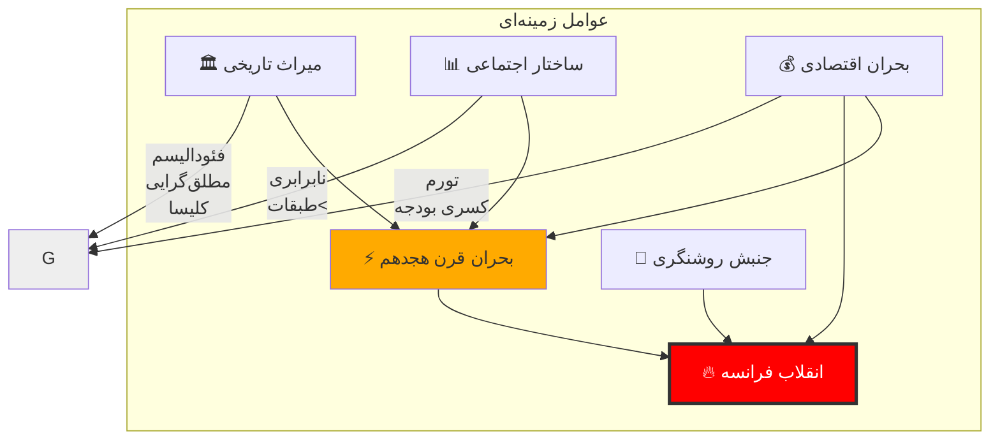
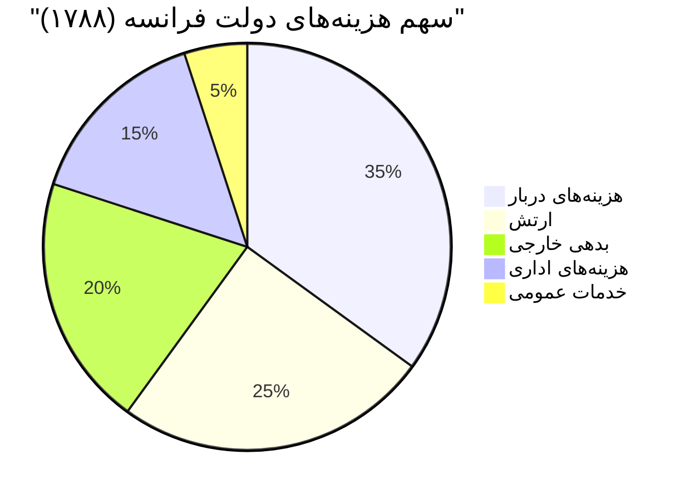
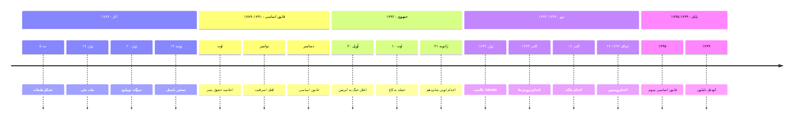
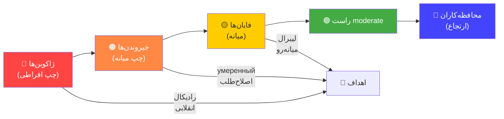
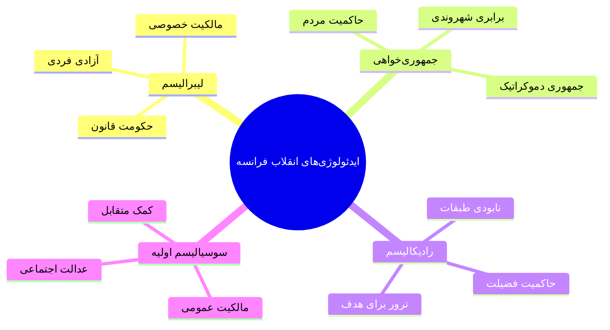
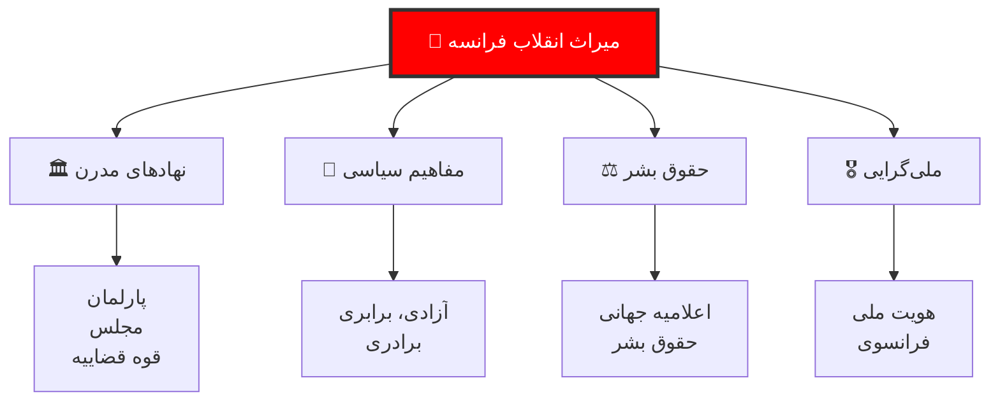

# انقلاب فرانسه: تحلیل جامع و چندبعدی

> *«انقلاب فرانسه مانند تمام انقلاب‌ها، هم نتیجه علل خاص و هم مبدأ علل عام بود.»*
> — الکسیس دو توکویل

---

## فهرست مطالب

📚 فهرست کامل مطالب (کلیک کنید)

| بخش | موضوع | صفحه |
|------|-------|-------|
| اول | پیش‌زمینه و علل انقلاب | ۱ |
| دوم | مراحل ده‌گانه انقلاب | ۲ |
| سوم | بازیگران و جناح‌ها | ۳ |
| چهارم | ایدئولوژی‌های انقلابی | ۴ |
| پنجم | مقایسه با انقلاب‌های دیگر | ۵ |
| ششم | Lessons و پیامدها | ۶ |

---

## بخش اول: پیش‌زمینه و علل انقلاب

### ۱.۱ بستر تاریخی

### ۱.۲ ساختار اجتماعی فرانسه قدیم

| طبقه | جمعیت | سهم از درآمد | وضعیت |
|------|--------|--------------|--------|
| **نجبا** | ۱٪ | ۲۵٪ | معاف از مالیات، امتیازات ویژه |
| **کلیسا** | ۰.۵٪ | ۱۵٪ | عشره، مالیات معاف |
| **طبقه متوسط شهری** | ۱۵٪ | ۳۰٪ | تجار، صنعتگران، وکلا |
| **دهقانان و فقرا** | ۸۳.۵٪ | ۳۰٪ | مالیات سنگین، حق رarioster |

### ۱.۳ بحران مالی

---

## بخش دوم: مراحل ده‌گانه انقلاب

### ۲.۱ جدول زمانی انقلاب

### ۲.۲ رویدادهای کلیدی

📜 تسخیر باستیل - ۱۴ ژوئیه ۱۷۸۹

### تسخیر باستیل

باستیل نماد قدرت مطلقه و سرکوب بود. حدود ۷۰۰ زندانی داشت (عمدتاً زندانیان سیاسی). شهروندان پاریس با حمله به این زندان، نماد استبداد را سرنگون کردند.

**پیامد:**
- آزادی زندانیان سیاسی
- نماد پیروزی مردم بر استبداد
- روز ملی فرانسه

📜 اعدام لویی شانزدهم - ۲۱ ژانویه ۱۷۹۳

### اعدام پادشاه

برای اولین بار در تاریخ اروپا، یک پادشاه با حکم دادگاه اعدام شد. این رویداد نشان داد که حتی مقدس‌ترین نهادها (پادشاهی الهی) قابل محاکمه‌اند.

**آرا:**
- ۳۶۱ رای موافق اعدام
- ۲۶ رای مخالف
- ۳۴ رای ممتنع

**پیامد:**
- پایان پادشاهی مطلقه
- تبدیل به جمهوری
- جنگ با کشورهای همسایه

---

## بخش سوم: بازیگران و جناح‌ها

### ۳.۱ طیف سیاسی انقلاب

### ۳.۲ رهبران کلیدی

| نام | جناح | نقش | سرنوشت |
|-----|-------|------|--------|
| **میشله روبسپیر** | ژاکوبین | رهبر کمیته نجات عمومی | اعدام ۱۷۹۴ |
| **ژان پل مارات** | ژاکوبین | روزنامه‌نگار انقلابی | ترور ۱۷۹۳ |
| **ژیروندن‌ها** | گروه میانه | سیاستمداران | اعدام ۱۷۹۳ |
| **لائوآنیون** | فایان | رهبر نظامی | اعدام ۱۷۹۳ |

### ۳.۳ مقایسه گروه‌ها

| معیار | ژاکوبین‌ها | جیروندن‌ها | فایان‌ها |
|-------|------------|------------|----------|
| **دیدگاه** | جمهوری‌خواه-radical | جمهوری‌خواه-میانه | سلطنت‌طلب مشروطه |
| **طبقه** | متوسط شهری، دهقانان | تجار، مالکان | اشراف، ثروتمندان |
| **تاکتیک** | ترور | اصلاح تدریجی | مذاکره |
| **نقطه پایان** | virtue و ترور | آزادی و مالکیت | قانون و نظم |

---

## بخش چهارم: ایدئولوژی‌های انقلابی

### ۴.۱ اعلامیه حقوق بشر و شهروند (۱۷۸۹)

### اصول بنیادین اعلامیه

> **ماده ۱:** انسان‌ها آزاد و از نظر حقوق برابر زاده می‌شوند.
>
> **ماده ۲:** هدف هر حکومتی حفظ حقوق طبیعی انسان است: آزادی، مالکیت، امنیت و مقاومت در برابر ستم.
>
> **ماده ۴:** آزادی یعنی بتواند هر کاری که به دیگران آسیب نمی‌زند انجام دهد.
>
> **ماده ۱۷:** مالکیت حق مقدس و محترم است.

### ۴.۲ ایدئولوژی‌های اصلی

---

## بخش پنجم: مقایسه با انقلاب‌های دیگر

### ۵.۱ جدول مقایسه‌ای

| معیار | فرانسه (۱۷۸۹) | آمریکا (۱۷۷۶) | روسیه (۱۹۱۷) | ایران (۱۹۷۹) |
|-------|---------------|-----------------|--------------|---------------|
| **محركه اصلی** | نابرابری اجتماعی | استعمار انگلیس | طبقاتی-اقتصادی | ضد استبداد دینی |
| **رهبری** | روشنگران و نجبا | تجار و زمینداران | بلشویک‌ها | روحانیت شیعه |
| **خشونت** | متوسط-بالا | پایین | بسیار بالا | متوسط |
| **نتیجه** | امپراتوری ناپلئون | دموکراسی فدرال | اتحاد جماهیر شوروی | جمهوری اسلامی |
| **مدت** | ۱۰ سال | ۵ سال | ۷۴ سال | تا امروز |

### ۵.۲ تشابهات و تفاوت‌ها

#### ✅ تشابهات

- **شعار برابری:** هر چهار انقلاب با شعار برابری آغاز شدند
- **نهادسازی:** همگی قوانین اساسی جدید نوشتند
- **مقاومت:** همگی با مقاومت نیروهای محافظه‌کار مواجه شدند

#### ❌ تفاوت‌ها

- **رهبری:** در فرانسه روشنگران، در ایران روحانیت
- **خشونت:** فرانسه کمتر از روسیه، بیشتر از آمریکا
- **پایان:** فرانسه به امپراتوری، ایران به جمهوری رسید

---

## بخش ششم: Lessons و پیامدها

### ۶.۱ Lessons برای انقلاب‌های بعدی

| Lesson | توضیح | نمونه |
|--------|--------|-------|
| **۱. مسئله ارتش** | بدون کنترل ارتش، انقلاب شکست می‌خورد | فرانسه: ارتش به انقلاب پیوست |
| **۲. مسئله خشونت** | خشونت بیش از حد، انقلاب را به استبداد تبدیل می‌کند | روبسپیر → ترور → ضدانقلاب |
| **۳. مسئله قانون** | بدون قانون اساسی و نهادها، chaos می‌شود | فرانسه: ۳ قانون اساسی در ۱۰ سال |
| **۴. مسئله اقتصاد** | بدون حل مسائل اقتصادی، انقلاب تهدید می‌شود | تورم → نارضایتی |

### ۶.۲ میراث انقلاب فرانسه

---

## جمع‌بندی نهایی

### Lessons کلیدی انقلاب فرانسه

| درس | توضیح |
|-----|--------|
| **آزادی بدون قانون = هرج و مرج** | روبسپیر نشان داد که آزادی بدون محدودیت به ترور تبدیل می‌شود |
| **انقلابیون خود به مستبد تبدیل می‌شوند** | تاریخ نشان داده که قدرت مطلق فساد می‌آورد |
| **تدریج بهتر از radical است** | فرانسه با عجله ۱۰ سال جنگید، آمریکا با صبر ۲۰۰ سال ثبات دارد |
| **اقتصاد پایه است** | بدون نان و کار، انقلاب به Counter-Revolution می‌افتد |

> **نتیجه نهایی:** انقلاب فرانسه هم موفق بود و هم شکست خورد. موفق در نابودی فئودالیسم و ایجاد مفاهیم جدید؛ شکست‌خورده در ایجاد ثبات و دموکراسی پایدار.

---

## منابع

### منابع اصلی

| نویسنده | اثر | سال |
|---------|------|-----|
| **Alexis de Tocqueville** | *L'Ancien Régime et la Révolution* | ۱۸۵۶ |
| **Albert Soboul** | *Histoire de la Révolution française* | ۱۹۶۲ |
| **François Furet** | *Dictionnaire de la Révolution française* | ۱۹۸۸ |
| **Simon Schama** | *Citizens* | ۱۹۸۹ |

### منابع فارسی

- نجف‌زاده، احمد. *تاریخ انقلاب فرانسه*. تهران: امیرکبیر.
- مختاری، محسن. *انقلاب و modernity*. تهران: نی.
