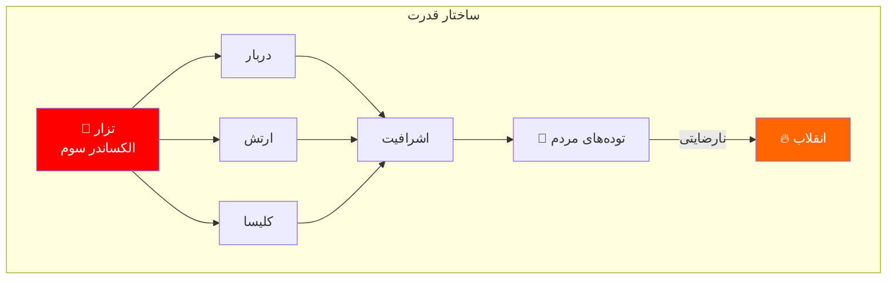
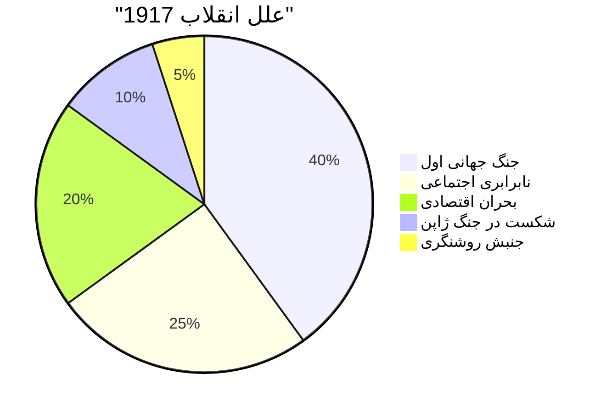
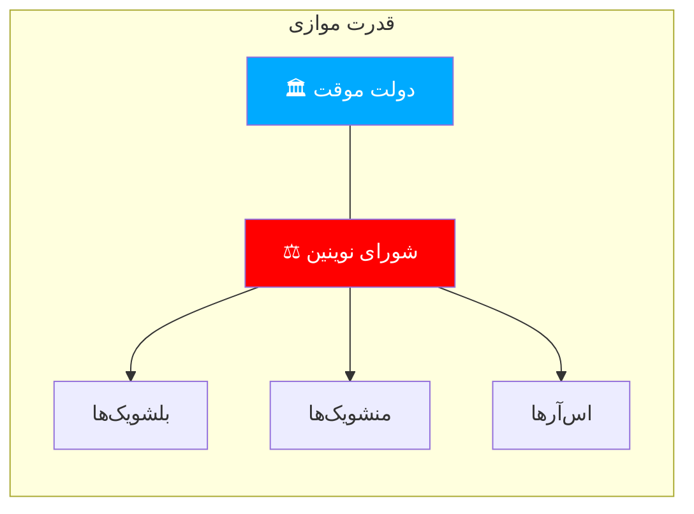
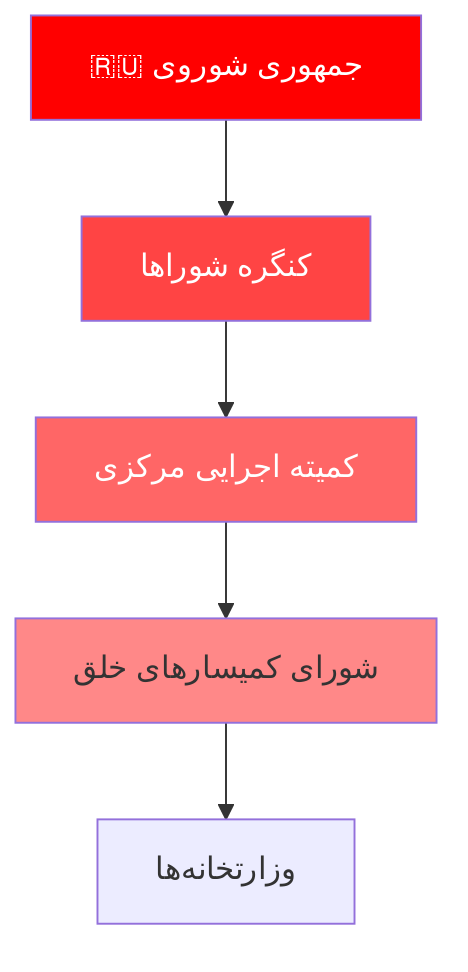
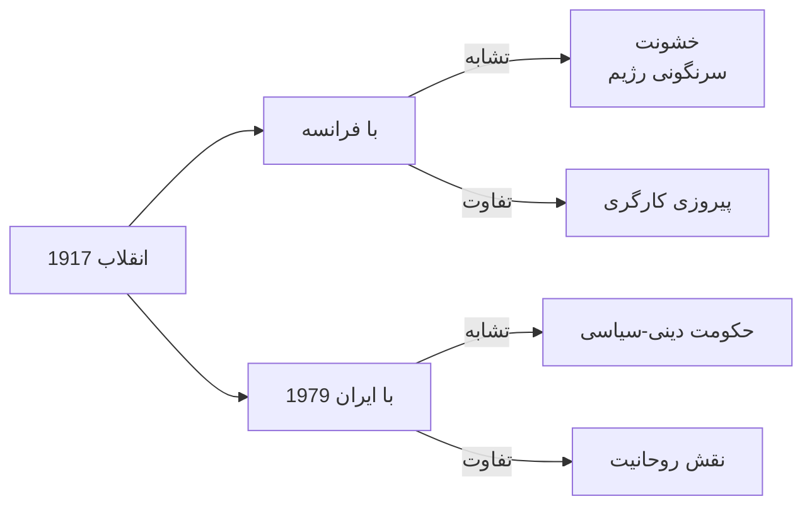

# انقلاب روسیه 1917: تحلیل جامع چندبعدی

> *«کارگران و سربازان پتروگراد پس از صدور فرمان دوم سلاح‌های خود را به زمین نگذاشتند...»*
> — اعلامیه شورای پتروگراد

---

## فهرست مطالب

📚 فهرست کامل مطالب

| بخش | موضوع |
|------|-------|
| اول | بستر تاریخی و علل انقلاب |
| دوم | انقلاب فوریه: فروپاشی تزاریسم |
| سوم | دوره دوگانگی قدرت |
| چهارم | انقلاب اکتبر: پیروزی بلشویک |
| پنجم | رهبران و سازمان‌ها |
| ششم | مقایسه با انقلاب‌های دیگر |
| هفتم | Lessons و میراث |

---

## بخش اول: بستر تاریخی و علل انقلاب

### ۱.۱ ساختار سیاسی-اجتماعی روسیه تزاری

### ۱.۲ آمار و ارقام

| شاخص | وضعیت |
|------|--------|
| جمعیت | ۱۶۷ میلیون |
| صنعتی‌شدن | ۲۰٪ اروپا |
| سواد | ۲۱٪ |
| کارگران صنعتی | ۳ میلیون |
| دهقانان | ۱۲۰ میلیون |

### ۱.۳ علل انقلاب

---

## بخش دوم: انقلاب فوریه

### ۲.۱ رویدادهای کلیدی

📅Timeline انقلاب فوریه

| تاریخ | رویداد |
|--------|---------|
| ۲۳ فوریه | اعتصاب زنان در روز جهانی زن |
| ۲۵ فوریه | اعتصاب عمومی |
| ۲۶ فوریه | تیراندازی به معترضان |
| ۲۷ فوریه | شورش ارتش |
| ۲ مارس | استعفای تزار |
| ۲ مارس | تشکیل دولت موقت |

### ۲.۲ چرا تزار سقوط کرد؟

| عامل | توضیح |
|------|--------|
| **شکست نظامی** | میلیون‌ها کشته در جنگ جهانی |
| **بحران اقتصادی** | کمبود نان، تورم |
| **فرار ارتش** | سربازان به معترضان پیوستند |
| ** absence رهبری** | تزار بدون حامی ماند |

---

## بخش سوم: دوره دوگانگی قدرت

### ۳.۱ نهادهای موازی

### ۳.۲ احزاب اصلی

| حزب | ایدئولوژی | نمایندگی |
|------|------------|----------|
| **بلشویک** | سوسیالیسم مارکسیستی | کارگران، سربازان |
| **منشویک** | سوسیالیسم میانه‌رو | طبقه متوسط |
| **اس‌آر** | سوسیالیسم دهقانی | دهقانان |
| **کدت** | لیبرالیسم | تجار،اشراف |

---

## بخش چهارم: انقلاب اکتبر

### ۴.۱ حمله به کاخ زمستانی

```mermaid
gantt
    title "انقلاب اکتبر 1917"
    dateFormat HH:mm
    axisFormat %H:%M
    
    ساعت ۶ صبح    :milestone, m1, 1917-10-25 06:00, 0h
    آغاز حمله     :active, a1, 1917-10-25 09:00, 2h
    محاصره کاخ    :a2, after a1, 4h
    تصرف رادیو   :a3, 1917-10-25 10:00, 1h
    استعفای کرنسکی :milestone, m2, 1917-10-25 14:00, 0h
    اعلام پیروزی :milestone, m3, 1917-10-25 22:00, 0h
```

### ۴.۲ چرا بلشویک‌ها پیروز شدند؟

#### ✅ عوامل پیروزی

- **لenasLenin:** بازگشت به موقع
- **تضاد کار:** «همه قدرت به شوراها!»
- **حمایت ارتش:** سربازان پیوستند
- **سازمان:** تشکیلات قوی

#### ❌ ضعف رقبا

- **منشویک‌ها:** بی‌تجربگی سیاسی
- **اس‌آرها:** تفرقه داخلی
- **دولت موقت:** عدم اجماع

---

## بخش پنجم: رهبران و سازمان‌ها

### ۵.۱ رهبران کلیدی

| نام | نقش | سرنوشت |
|-----|-----|--------|
| **لenasLenin** | رهبر بلشویک | مرگ ۱۹۲۴ |
| **تروتسکی** | کمیسیار خلق | ترور ۱۹۴۰ |
| **استالین** | دبیر کل | مرگ ۱۹۵۳ |
| **کرنسکی** | نخست‌وزیر | تبعید |

### ۵.۲ ساختار حکومت شوروی

---

## بخش ششم: مقایسه با انقلاب‌های دیگر

### ۶.۱ جدول تطبیقی

| معیار | فوریه ۱۹۱۷ | اکتبر ۱۹۱۷ | فرانسه ۱۷۸۹ |
|-------|-------------|--------------|--------------|
| **محركه** | ضد جنگ | سوسیالیستی | ضد فئودال |
| **رهبری** | لیبرال | بلشویک | روشنگران |
| **خشونت** | کم | متوسط | زیاد |
| **نتیجه** | جمهوری | دولت کارگری | امپراتوری |

### ۶.۲ تشابهات و تفاوت‌ها

---

## بخش هفتم: Lessons و میراث

### ۷.۱ درس‌های کلیدی

| درس | توضیح |
|-----|--------|
| **۱. نقش ارتش** | بدون پیوستن ارتش، انقلاب ناقص می‌ماند |
| **۲. رهبری** | لenasLenin با بازگشت به‌موقع، مسیر را تغییر داد |
| **۳. سازمان** | بلشویک‌ها تشکیلات قوی داشتند |
| **۴. بحران** | جنگ، بحران ایجاد کرد؛ انقلاب پاسخ داد |

### ۷.۲ میراث انقلاب

🌟 دستاوردها و تراژدی‌ها

#### دستاوردها
- برابری طبقاتی
- سوادآموزی همگانی
- صنعتی‌شدن سریع
- حقوق زنان

#### تراژدی‌ها
- ۲۰ میلیون کشته
- گولاگ و سرکوب
- کمونیسم و فاشیسم
- جنگ سرد

---

## جمع‌بندی

> **نتیجه نهایی:** انقلاب 1917روسیه نشان داد که:
> 1. جنگ می‌تواند انقلاب را بسازد
> 2. سازمان قوی + رهبری هوشمند = پیروزی
> 3. انقلاب‌های سوسیالیستی می‌توانند به استبداد منجر شوند
> 4. میراث انقلاب تا دهه‌ها ادامه دارد

---

## منابع

### منابع اصلی

- **Trotsky, Leon.** *History of the Russian Revolution*
- **Service, Robert.** *Lenin: A Biography*
- **Figes, Orlando.** *A People's Tragedy*

### منابع فارسی

- کاتوزیان، همایون. *تاریخ اتحاد شوروی*
- مختاری، مسعود. *انقلاب اکتبر*
