# 📚 انواع سطوح تغییر و اصلاح در رژیم‌های سیاسی
---

# فهرست مطالب

```
📑 ساختار این تحلیل
├── بخش ۱: چارچوب مفهومی تغییر سیاسی
├── بخش ۲: طیف سطوح تغییر (از سطحی تا عمیق)
├── بخش ۳: تغییر ماهیت (Denaturation) - تحلیل ویژه
├── بخش ۴: مقایسه تطبیقی سطوح
├── بخش ۵: دینامیک‌ها و روابط بین سطوح
└── بخش ۶: مثال‌های تاریخی و معاصر
```

---

# بخش ۱: چارچوب مفهومی تغییر سیاسی

## ۱.۱ تعریف تغییر سیاسی

> **تغییر سیاسی (Political Change):**
هرگونه دگرگونی در توزیع قدرت، ساختارهای حکمرانی، قواعد بازی سیاسی، یا رابطه دولت-جامعه که می‌تواند از اصلاحات جزئی تا انقلاب بنیادین را شامل شود.
> 

## ۱.۲ لایه‌های یک نظام سیاسی

برای درک سطوح تغییر، ابتدا باید لایه‌های یک نظام سیاسی را بشناسیم:

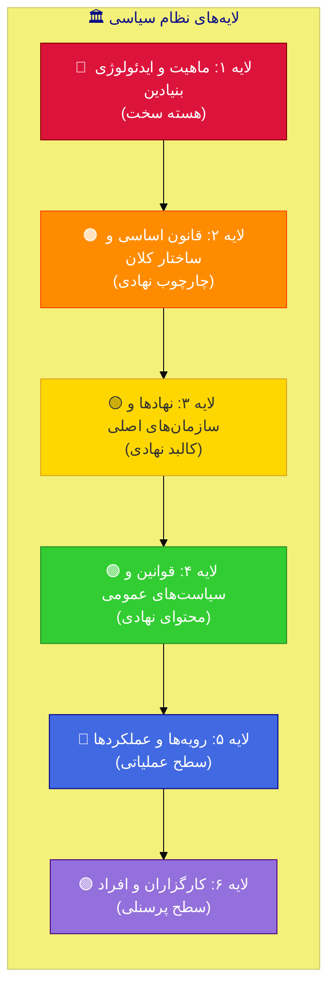

## ۱.۳ جدول توصیف لایه‌ها

| لایه | نام | محتوا | مثال | میزان پایداری |
| --- | --- | --- | --- | --- |
| **۱** | ماهیت/ایدئولوژی | فلسفه سیاسی بنیادین، منبع مشروعیت | دموکراتیک، تئوکراتیک، کمونیستی | ⬛⬛⬛⬛⬛ بسیار پایدار |
| **۲** | قانون اساسی | ساختار کلان قدرت، حقوق بنیادین | جمهوری، فدرال، متمرکز | ⬛⬛⬛⬛ پایدار |
| **۳** | نهادها | سازمان‌های اصلی حکومتی | مجلس، دادگاه، ارتش | ⬛⬛⬛ نسبتاً پایدار |
| **۴** | قوانین | قوانین عادی، سیاست‌ها | قانون انتخابات، مالیات | ⬛⬛ قابل تغییر |
| **۵** | رویه‌ها | نحوه اجرای قوانین | آیین‌نامه‌ها، بخش‌نامه‌ها | ⬛ سیال |
| **۶** | افراد | کارگزاران و مقامات | رئیس‌جمهور، وزرا | سیال‌ترین |

---

# بخش ۲: طیف سطوح تغییر سیاسی

## ۲.۱ نمای کلی طیف تغییر

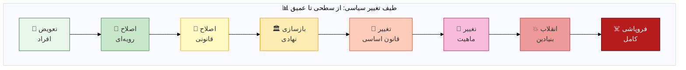

---

## 🔵 سطح ۱: تعویض پرسنلی (Personnel Change)

### تعریف

> تغییر در افراد و کارگزاران بدون تغییر در ساختارها، قوانین یا رویه‌ها.
> 

### ویژگی‌ها

| جنبه | توضیح |
| --- | --- |
| **عمق** | سطحی‌ترین سطح تغییر |
| **سرعت** | سریع (روزها تا هفته‌ها) |
| **برگشت‌پذیری** | کاملاً برگشت‌پذیر |
| **ریسک** | حداقل |
| **نیاز به اجماع** | کم |

### انواع

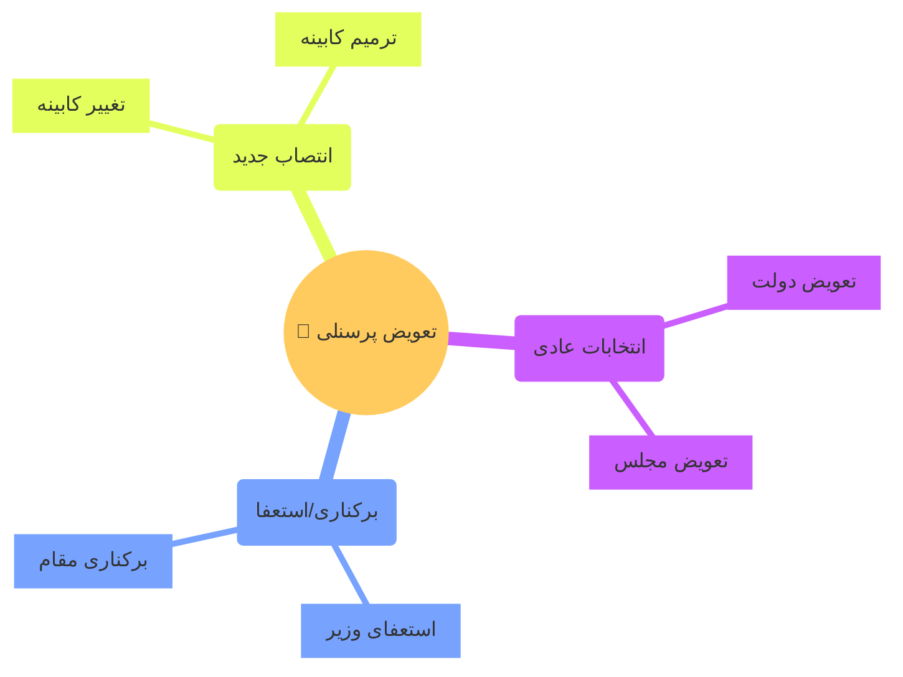

### مثال‌ها

- انتخابات ریاست‌جمهوری در یک دموکراسی باثبات
- تعویض نخست‌وزیر در نظام پارلمانی
- ترمیم کابینه

---

## 🟢 سطح ۲: اصلاح رویه‌ای (Procedural Reform)

### تعریف

> تغییر در نحوه اجرای قوانین موجود بدون تغییر در خود قوانین.
> 

### ویژگی‌ها

| جنبه | توضیح |
| --- | --- |
| **عمق** | سطحی |
| **سرعت** | نسبتاً سریع (هفته‌ها تا ماه‌ها) |
| **برگشت‌پذیری** | برگشت‌پذیر |
| **ریسک** | پایین |
| **نیاز به اجماع** | متوسط-پایین |

### حوزه‌ها

| حوزه | مثال |
| --- | --- |
| **اداری** | تغییر آیین‌نامه‌های اجرایی |
| **قضایی** | تغییر رویه‌های دادرسی |
| **انتخاباتی** | تغییر شیوه رأی‌گیری |
| **اقتصادی** | تغییر رویه‌های بانکی |

### مثال‌ها

- الکترونیکی کردن خدمات دولتی
- تغییر ساعات کاری ادارات
- ساده‌سازی فرآیندهای بوروکراتیک

---

## 🟡 سطح ۳: اصلاح قانونی (Legislative Reform)

### تعریف

> تغییر در قوانین عادی از طریق فرآیندهای قانونگذاری معمول، بدون تغییر در قانون اساسی.
> 

### ویژگی‌ها

| جنبه | توضیح |
| --- | --- |
| **عمق** | متوسط |
| **سرعت** | متوسط (ماه‌ها) |
| **برگشت‌پذیری** | برگشت‌پذیر با قانون جدید |
| **ریسک** | متوسط-پایین |
| **نیاز به اجماع** | متوسط (اکثریت پارلمانی) |

### انواع اصلاحات قانونی

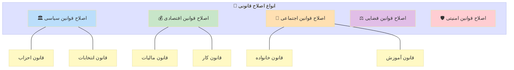

### مثال‌ها

- اصلاح قانون انتخابات
- تصویب قانون آزادی اطلاعات
- اصلاح قانون کار

---

## 🟠 سطح ۴: بازسازی نهادی (Institutional Restructuring)

### تعریف

> ایجاد، انحلال، یا تغییر اساسی در ساختار و مأموریت نهادهای اصلی حکومتی.
> 

### ویژگی‌ها

| جنبه | توضیح |
| --- | --- |
| **عمق** | نسبتاً عمیق |
| **سرعت** | کند (سال‌ها) |
| **برگشت‌پذیری** | دشوار |
| **ریسک** | متوسط-بالا |
| **نیاز به اجماع** | بالا |

### انواع بازسازی نهادی

| نوع | توضیح | مثال |
| --- | --- | --- |
| **ایجاد نهاد جدید** | تأسیس سازمان‌های جدید | ایجاد دادگاه قانون اساسی |
| **انحلال نهاد** | حذف سازمان‌های موجود | انحلال پلیس مخفی |
| **ادغام** | ترکیب چند نهاد | ادغام وزارتخانه‌ها |
| **تفکیک** | تجزیه یک نهاد | تفکیک قوا |
| **بازتعریف مأموریت** | تغییر اهداف نهاد | غیرسیاسی کردن ارتش |

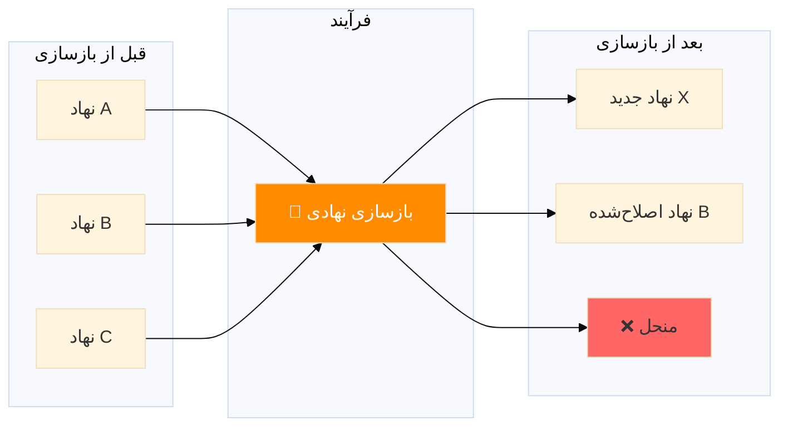

### مثال‌ها

- ایجاد بانک مرکزی مستقل
- تأسیس کمیسیون مستقل انتخابات
- اصلاح ساختار ارتش

---

## 🔴 سطح ۵: تغییر قانون اساسی (Constitutional Change)

### تعریف

> اصلاح یا بازنویسی قانون اساسی که چارچوب کلان حکمرانی را تعیین می‌کند.
> 

### ویژگی‌ها

| جنبه | توضیح |
| --- | --- |
| **عمق** | عمیق |
| **سرعت** | کند (سال‌ها) |
| **برگشت‌پذیری** | بسیار دشوار |
| **ریسک** | بالا |
| **نیاز به اجماع** | بسیار بالا (معمولاً اکثریت خاص + همه‌پرسی) |

### انواع تغییر قانون اساسی

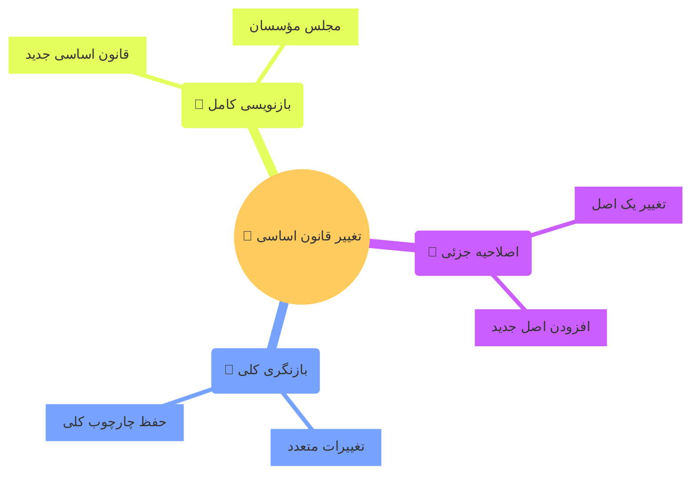

### مقایسه انواع

| نوع | عمق تغییر | روش معمول | مثال |
| --- | --- | --- | --- |
| **اصلاحیه** | کم | رأی پارلمان + همه‌پرسی | اصلاحیه‌های قانون اساسی آمریکا |
| **بازنگری** | متوسط | کمیسیون ویژه + پارلمان | بازنگری قانون اساسی فرانسه ۲۰۰۸ |
| **بازنویسی** | زیاد | مجلس مؤسسان + همه‌پرسی | قانون اساسی آفریقای جنوبی ۱۹۹۶ |

### مثال‌ها

- تغییر از نظام ریاستی به پارلمانی
- افزودن منشور حقوق بشر
- تغییر ساختار فدرالی/متمرکز

---

## 🟣 سطح ۶: تغییر ماهیت (Denaturation) ⚠️ بخش ویژه

### این بخش را در قسمت ۳ به تفصیل بررسی می‌کنیم.

---

## ⚫ سطح ۷: انقلاب بنیادین (Fundamental Revolution)

### تعریف

> تغییر سریع، بنیادین و اغلب خشونت‌آمیز در کل نظام سیاسی، شامل تغییر ماهیت، ساختار، نهادها و کارگزاران.
> 

### ویژگی‌ها

| جنبه | توضیح |
| --- | --- |
| **عمق** | تمام لایه‌ها |
| **سرعت** | سریع در سقوط، کند در بازسازی |
| **برگشت‌پذیری** | بسیار دشوار (نیاز به انقلاب متقابل) |
| **ریسک** | بسیار بالا |
| **نیاز به اجماع** | پیش از انقلاب: بسیج توده‌ای؛ پس از آن: متغیر |

### عناصر تشکیل‌دهنده انقلاب


### طبقه‌بندی انقلاب‌ها

| نوع | ویژگی | مثال |
| --- | --- | --- |
| **انقلاب سیاسی** | تغییر ساختار قدرت | انقلاب کبیر فرانسه |
| **انقلاب اجتماعی** | تغییر ساختار طبقاتی | انقلاب روسیه ۱۹۱۷ |
| **انقلاب ایدئولوژیک** | تغییر نظام ارزشی | انقلاب اسلامی ایران |
| **انقلاب مخملین** | تغییر مسالمت‌آمیز | انقلاب مخملی چکسلواکی |

---

## ☠️ سطح ۸: فروپاشی کامل (State Collapse)

### تعریف

> از بین رفتن کامل ظرفیت دولت برای اعمال حاکمیت، بدون جایگزینی منظم. این وضعیت با هرج‌ومرج، خلأ قدرت و اغلب خشونت گسترده همراه است.
> 

### ویژگی‌ها

| جنبه | توضیح |
| --- | --- |
| **عمق** | فراتر از تغییر — نابودی |
| **سرعت** | می‌تواند سریع یا تدریجی باشد |
| **برگشت‌پذیری** | نیاز به بازسازی کامل |
| **ریسک** | فاجعه‌بار |
| **نیاز به اجماع** | بی‌معنی (فقدان نظم) |

### شاخص‌های فروپاشی

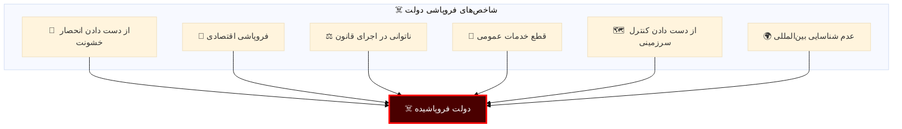

### مثال‌ها

- سومالی (۱۹۹۱-۲۰۱۲)
- لیبی پس از ۲۰۱۱
- یمن
- افغانستان در دوره‌هایی

---

# بخش ۳: تغییر ماهیت (Denaturation) — تحلیل ویژه

## ۳.۱ مفهوم‌شناسی

### ریشه‌شناسی

واژه **Denaturation** در علوم طبیعی (شیمی و زیست‌شناسی) به معنای تغییر در ساختار و عملکرد یک مولکول (مثل پروتئین) بدون تغییر در ترکیب شیمیایی آن است.

> **استعاره سیاسی:**
همان‌طور که یک پروتئین می‌تواند شکل و عملکردش را از دست بدهد بدون اینکه اتم‌هایش تغییر کند، یک نظام سیاسی نیز می‌تواند **ماهیت واقعی** خود را از دست بدهد در حالی که **ظواهر نهادی** حفظ شده باشد.
> 

### تعریف دقیق در علوم سیاسی

> **تغییر ماهیت سیاسی (Political Denaturation):**
فرآیندی که طی آن یک نظام سیاسی، **جوهر و ذات اصلی** خود را از دست می‌دهد یا به دست می‌آورد، در حالی که ممکن است **ساختارها و نهادهای ظاهری** تا حد زیادی حفظ شوند. این تغییر می‌تواند به سمت **دموکراتیزاسیون** (کسب ماهیت دموکراتیک) یا **استبدادی شدن** (از دست دادن ماهیت دموکراتیک) باشد.
> 

## ۳.۲ تمایز کلیدی: تغییر ماهیت vs. سایر سطوح

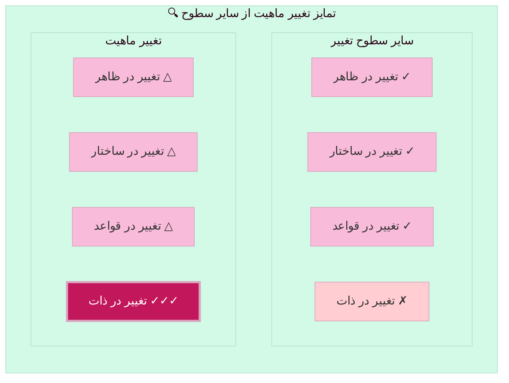

## ۳.۳ دو جهت تغییر ماهیت

### جهت ۱: استبدادی شدن (Authoritarian Denaturation)

> تبدیل تدریجی یک دموکراسی به نظام استبدادی با حفظ نمای ظاهری دموکراتیک.
> 


### مثال‌ها

| کشور | دوره | ویژگی |
| --- | --- | --- |
| **مجارستان** | ۲۰۱۰-حال | تضعیف تدریجی نهادها توسط اوربان |
| **ترکیه** | ۲۰۱۳-حال | تمرکز قدرت در ریاست‌جمهوری |
| **ونزوئلا** | ۱۹۹۹-حال | از دموکراسی به استبداد انتخاباتی |
| **روسیه** | ۲۰۰۰-حال | دموکراسی هدایت‌شده/کنترل‌شده |

### جهت ۲: دموکراتیزاسیون تدریجی (Democratic Denaturation)

> تبدیل تدریجی یک نظام استبدادی به دموکراسی واقعی، گاه با حفظ ظواهر سابق.
> 


### مثال‌ها

| کشور | دوره | ویژگی |
| --- | --- | --- |
| **تایوان** | ۱۹۸۷-۱۹۹۶ | گذار از حزب واحد به دموکراسی |
| **اسپانیا** | ۱۹۷۵-۱۹۸۲ | گذار پس از فرانکو |
| **کره جنوبی** | ۱۹۸۷-۱۹۹۲ | از نظامی به دموکراتیک |
| **شیلی** | ۱۹۸۸-۱۹۹۰ | پایان دوره پینوشه |

## ۳.۴ عناصر ماهیت یک نظام سیاسی

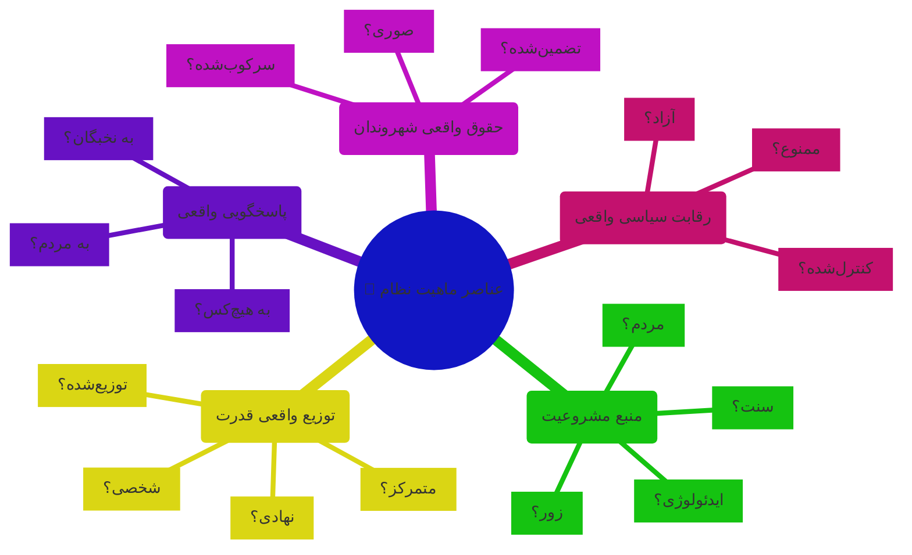

## ۳.۵ شاخص‌های تغییر ماهیت

### جدول شاخص‌ها

| شاخص | دموکراسی واقعی | استبداد با نقاب دموکراسی | استبداد آشکار |
| --- | --- | --- | --- |
| **انتخابات** | آزاد، منصفانه، رقابتی | برگزار می‌شود ولی مهندسی‌شده | نمایشی یا ممنوع |
| **رسانه** | آزاد و متنوع | ظاهراً آزاد، عملاً کنترل‌شده | کاملاً دولتی |
| **قضا** | مستقل | تحت فشار یا کنترل | ابزار سرکوب |
| **مخالفان** | فعال و قانونی | آزار، زندان با بهانه | سرکوب آشکار |
| **جامعه مدنی** | قوی و مستقل | تحت فشار، NGOهای دولتی | سرکوب‌شده |
| **حاکمیت قانون** | برابری همه در برابر قانون | قانون ابزار قدرت | قانون = اراده رهبر |

### نمودار مقایسه‌ای

```mermaid
%%{init: {'theme':'base'}}%%
xychart-beta
    title "مقایسه شاخص‌های ماهیت دموکراتیک"
    x-axis ["آزادی انتخابات", "آزادی رسانه", "استقلال قضا", "حقوق مخالفان", "جامعه مدنی"]
    y-axis "امتیاز (۰-۱۰۰)" 0 --> 100
    bar "دموکراسی واقعی" [90, 85, 88, 92, 87]
    bar "استبداد با نقاب" [60, 40, 35, 25, 30]
    bar "استبداد آشکار" [10, 5, 8, 5, 10]
```

## ۳.۶ مکانیزم‌های تغییر ماهیت

### استبدادی شدن: چگونه دموکراسی‌ها می‌میرند

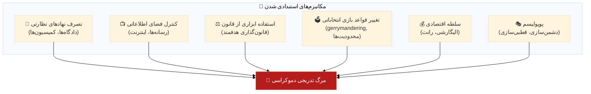

> **منبع کلیدی:** کتاب «چگونه دموکراسی‌ها می‌میرند» نوشته لویتسکی و زیبلات (۲۰۱۸)
> 
> 
> *“دموکراسی‌های امروز دیگر با کودتای نظامی نمی‌میرند، بلکه در صندوق رأی و با دست منتخبین مردم کشته می‌شوند.”*
> 

## ۳.۷ تفاوت تغییر ماهیت با انقلاب

| جنبه | تغییر ماهیت | انقلاب |
| --- | --- | --- |
| **سرعت** | تدریجی (سال‌ها/دهه‌ها) | سریع (ماه‌ها) |
| **ظواهر** | اغلب حفظ می‌شوند | کاملاً تغییر می‌کنند |
| **خشونت** | معمولاً کم | اغلب زیاد |
| **آگاهی عمومی** | کم (مثل قورباغه در آب گرم) | زیاد |
| **مشروعیت ظاهری** | حفظ می‌شود | نیاز به بازسازی دارد |
| **قابلیت تشخیص** | دشوار (در لحظه) | آشکار |

### استعاره قورباغه در آب گرم 🐸

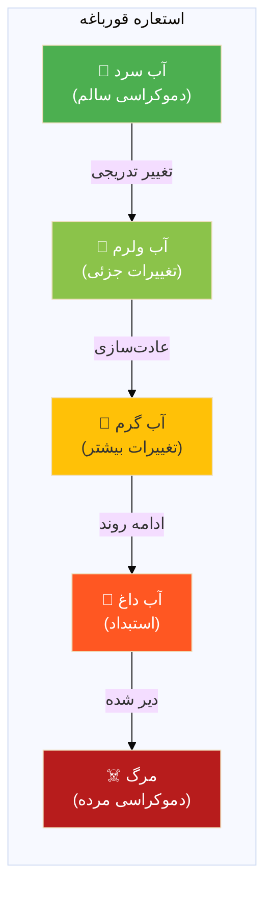

---

# بخش ۴: جدول مقایسه‌ای جامع سطوح تغییر

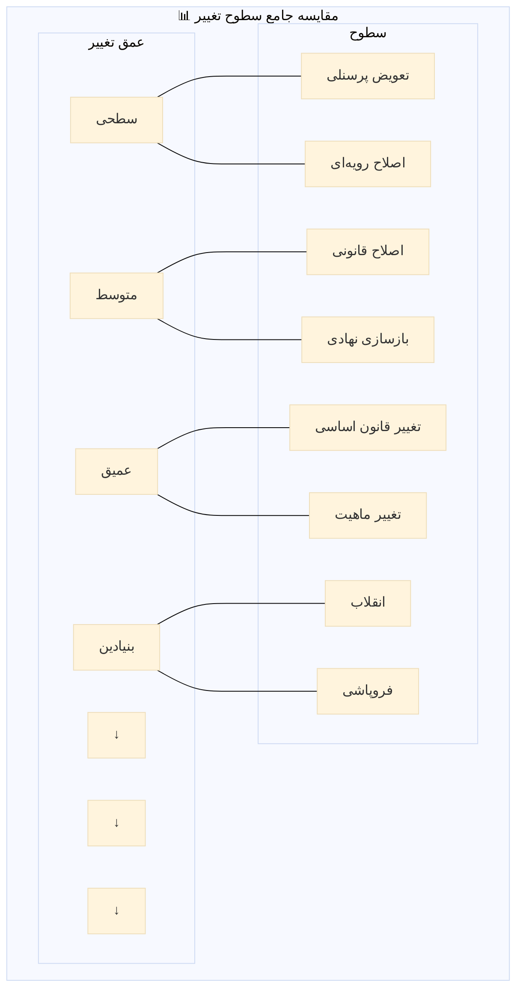

## جدول مقایسه‌ای کامل

| سطح | عمق | سرعت | برگشت‌پذیری | ریسک | نیاز به اجماع | لایه هدف |
| --- | --- | --- | --- | --- | --- | --- |
| **۱. تعویض پرسنلی** | ⬜⬜⬜⬜⬜ | روزها | ✅✅✅ | ⬜ | ⬜ | افراد |
| **۲. اصلاح رویه‌ای** | ⬜⬜⬜⬜⬛ | هفته‌ها | ✅✅✅ | ⬜ | ⬜⬛ | رویه‌ها |
| **۳. اصلاح قانونی** | ⬜⬜⬜⬛⬛ | ماه‌ها | ✅✅ | ⬜⬛ | ⬛⬛ | قوانین |
| **۴. بازسازی نهادی** | ⬜⬜⬛⬛⬛ | سال‌ها | ✅ | ⬛⬛ | ⬛⬛⬛ | نهادها |
| **۵. تغییر قانون اساسی** | ⬜⬛⬛⬛⬛ | سال‌ها | ❌ | ⬛⬛⬛ | ⬛⬛⬛⬛ | چارچوب |
| **۶. تغییر ماهیت** | ⬛⬛⬛⬛⬛ | دهه‌ها | ❌❌ | ⬛⬛⬛⬛ | متغیر | ذات |
| **۷. انقلاب** | ⬛⬛⬛⬛⬛ | ماه‌ها | ❌❌ | ⬛⬛⬛⬛⬛ | بسیج توده | همه |
| **۸. فروپاشی** | 💀 | متغیر | 💀 | 💀 | — | همه |

---

# بخش ۵: دینامیک‌ها و روابط بین سطوح

## ۵.۱ مسیرهای ممکن تغییر

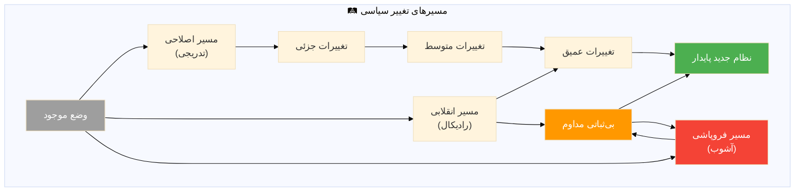

## ۵.۲ اثرات متقابل سطوح

### اثر آبشاری (Cascade Effect)


### اثر تجمعی (Cumulative Effect)

تغییرات کوچک و پیاپی می‌توانند به تغییر ماهیت منجر شوند:


---

# بخش ۶: نتیجه‌گیری و کاربرد عملی

## ۶.۱ خلاصه سطوح

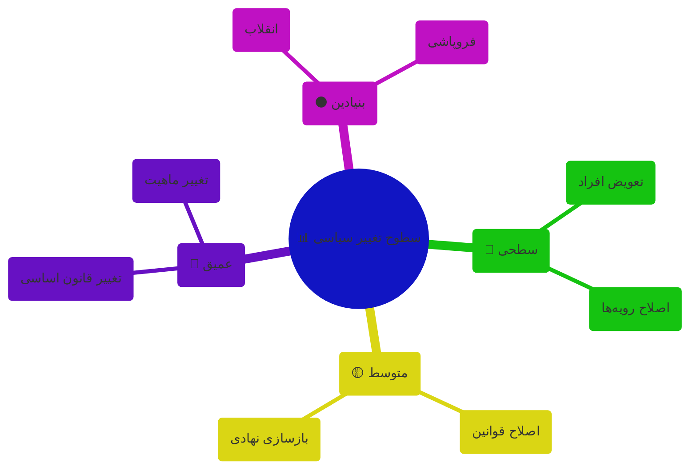

## ۶.۲ پاسخ به سوال شما درباره تغییر ماهیت

> **بله، تغییر ماهیت (Denaturation) یک سطح واقعی و مهم از تغییر سیاسی است.**
> 

### ویژگی‌های منحصربه‌فرد آن:

| ویژگی | توضیح |
| --- | --- |
| **۱. تغییر در ذات نه ظاهر** | ساختارها و نهادها ممکن است باقی بمانند ولی عملکرد واقعی‌شان تغییر کند |
| **۲. تدریجی بودن** | برخلاف انقلاب، این فرآیند آهسته و گاه نامحسوس است |
| **۳. دوسویه بودن** | می‌تواند به سمت دموکراتیک شدن یا استبدادی شدن باشد |
| **۴. دشواری تشخیص** | در لحظه وقوع، سخت قابل تشخیص است |
| **۵. اهمیت استراتژیک** | فهم این سطح برای حفظ دموکراسی یا گذار به آن حیاتی است |

## ۶.۳ منابع برای مطالعه بیشتر

| منبع | نویسنده | موضوع |
| --- | --- | --- |
| *How Democracies Die* | Levitsky & Ziblatt | استبدادی شدن دموکراسی‌ها |
| *The Third Wave* | Huntington | امواج دموکراتیزاسیون |
| *Transitions from Authoritarian Rule* | O’Donnell & Schmitter | نظریه گذار |
| *Competitive Authoritarianism* | Levitsky & Way | رژیم‌های هیبریدی |
| *The Origins of Political Order* | Fukuyama | توسعه سیاسی |

---

> **💡 نکته نهایی:**
درک سطوح مختلف تغییر سیاسی، به‌ویژه مفهوم «تغییر ماهیت»، برای تحلیل دقیق‌تر فرآیندهای سیاسی و طراحی استراتژی‌های مؤثر برای حفظ یا ایجاد دموکراسی ضروری است. این سطح از تحلیل، فراتر از توجه صرف به ظواهر نهادی می‌رود و به «جوهر» و «ذات» واقعی نظام سیاسی توجه می‌کند.
>