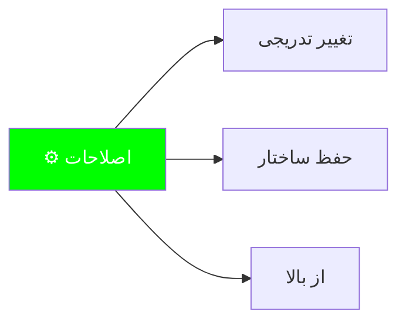
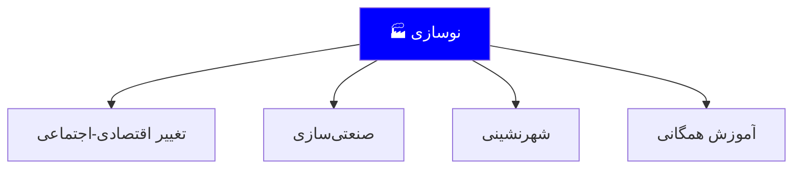
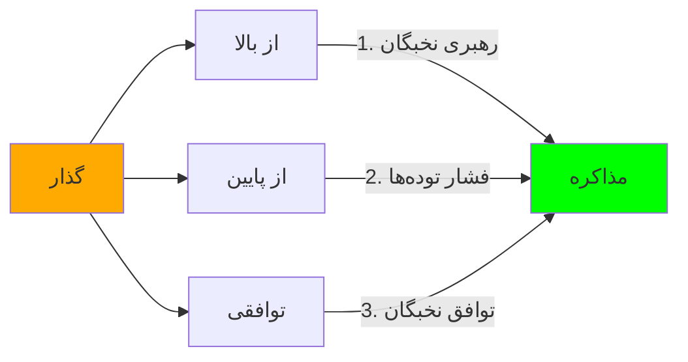
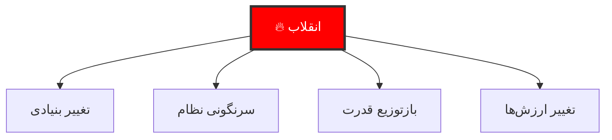
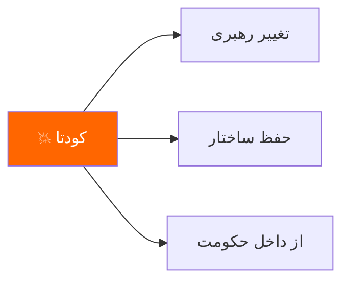
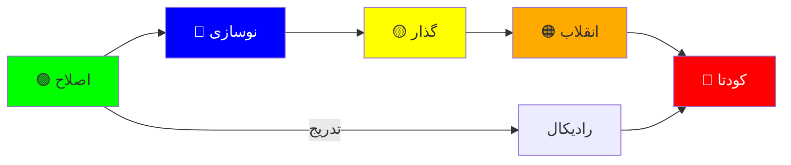

# انواع سطوح تغییر سیاسی

> *«تغییر سیاسی یک طیف است؛ از تغییر تدریجی تا انقلاب_radical»*

---

## فهرست مطالب

📚 فهرست کامل مطالب

| سطح | نوع | ویژگی |
|-----|-----|---------|
| اول | اصلاحات | تغییر تدریجی |
| دوم | نوسازی | مدرنیزاسیون |
| سوم | گذار | انتقال قدرت |
| چهارم | انقلاب | تغییر بنیادی |
| پنجم | کودتا | جایگزینی رهبر |

---

## سطح اول: اصلاحات (Reform)

### تعریف و ویژگی‌ها

### ویژگی‌ها

| ویژگی | توضیح |
|--------|--------|
| سرعت | آهسته و گام‌به‌گام |
| وسعت | محدود به بخشی از نظام |
| جهت | اصلاح‌طلبانه |
| رهبری | نخبگان حاکم |
| خشونت | کم یا صفر |

### نمونه‌های تاریخی

- **بریتانیا:** اصلاحات پارلمانی ۱۸۳۲
- **ایران:** اصلاحات ارضی ۱۳۴۰
- **ترکیه:** اصلاحات آتاتورک

---

## سطح دوم: نوسازی (Modernization)

### تعریف و ویژگی‌ها

### تفاوت با اصلاحات

| معیار | اصلاحات | نوسازی |
|-------|----------|---------|
| تمرکز | سیاسی | اقتصادی-اجتماعی |
| مقیاس | نهادی | جامع |
| زمان | کوتاه‌مدت | بلندمدت |
| نتیجه | دموکراسی | توسعه |

### نمونه‌ها

- **ژاپن:** نوسازی میجی (۱۸۶۸)
- **کره جنوبی:** توسعه اقتصادی ۱۹۶۰-۱۹۹۰
- **چین:** اصلاحات دنگ شیائوپینگ

---

## سطح سوم: گذار (Transition)

### تعریف

**گذار سیاسی** فرآیندی است که طی آن یک نظام سیاسی به نظام دیگری تبدیل می‌شود. این تغییر می‌تواند از استبداد به دموکراسی، یا برعکس باشد.

### انواع گذار

### ویژگی‌های گذار موفق

| ویژگی | توضیح |
|--------|--------|
| توافق نخبگان | اجماع بر سر قواعد بازی |
| خشونت‌پرهیزی | عدم استفاده از زور |
| تدریجی بودن | گام‌به‌گام نه شوک |
| نهادسازی | ایجاد ساختارهای جدید |

### نمونه‌های موفق

- **اسپانیا:** گذار فرانکو به دموکراسی (۱۹۷۵-۱۹۸۲)
- **برزیل:** گذار نظامی به مدنی (۱۹۸۵)
- **تایوان:** گذار کواومینتانگ (۱۹۸۶-۲۰۰۰)

---

## سطح چهارم: انقلاب (Revolution)

### تعریف

### انواع انقلاب

| نوع | توضیح | نمونه |
|-----|--------|-------|
| **سیاسی** | تغییر حکومت | انقلاب ۱۹۰۵ روسیه |
| **اجتماعی** | تغییر ساختار طبقاتی | انقلاب فرانسه |
| **اقتصادی** | تغییر نظام مالکیت | انقلاب کمونیستی |
| **فرهنگی** | تغییر ارزش‌ها | انقلاب فرهنگی چین |

### ویژگی‌های انقلاب

| ویژگی | توضیح |
|--------|--------|
| سرعت | سریع و رادیکال |
| وسعت | جامع و فراگیر |
| خشونت | بالا |
| عدم قطعیت | زیاد |
| پیامدها | بلندمدت |

---

## سطح پنجم: کودتا (Coup)

### تعریف

### انواع کودتا

| نوع | توضیح |
|-----|--------|
| **نظامی** | توسط ارتش |
| **سرهنگی** | توسط افسران |
| **Palace** | توسط نخبگان |
| **Preventive** | پیشگیرانه |

### تفاوت با انقلاب

| معیار | کودتا | انقلاب |
|-------|-------|--------|
| وسعت تغییر | محدود | گسترده |
| خشونت | متوسط | بالا |
| زمان | کوتاه | بلند |
| مشارکت مردم | کم | زیاد |
| حفظ نهادها | بله | خیر |

### نمونه‌ها

- **ترکیه:** کودتاهای متعدد (۱۹۶۰، ۱۹۷۱، ۱۹۸۰)
- **شیلی:** کودتای پینوشه (۱۹۷۳)
- **یونان:** کودتای سرهنگ‌ها (۱۹۶۷)

---

## مقایسه کلی

### جدول تطبیقی

| معیار | اصلاح | نوسازی | گذار | انقلاب | کودتا |
|-------|--------|--------|------|--------|-------|
| **سرعت** | آهسته | متوسط | متوسط | سریع | بسیار سریع |
| **وسعت** | محدود | گسترده | متوسط | کامل | محدود |
| **خشونت** | کم | کم | کم-متوسط | زیاد | متوسط |
| **حفظ نهادها** | بله | частично | معمولاً | خیر | معمولاً بله |
| **مشارکت مردم** | کم | متوسط | زیاد | بسیار زیاد | کم |

### نمودار طیفی

---

## نتیجه‌گیری

### کدام نوع تغییر بهتر است؟

| شرایط | نوع توصیه‌شده |
|--------|--------------|
| جامعه با ثبات، نخبگان همکار | اصلاح از بالا |
| فشار اجتماعی بالا، نخبگان مقاوم | گذار توافقی |
| بحران اقتصادی-اجتماعی عمیق | انقلاب |
| شکاف در حاکمیت | کودتا |
| نیاز به تغییر فرهنگی | نوسازی بلندمدت |

> **نکته کلیدی:** هیچ نوع تغییری مطلقاً خوب یا بد نیست. انتخاب نوع تغییر بستگی به:
> 1. وضعیت موجود
> 2. ظرفیت نخبگان
> 3. آمادگی جامعه
> 4. شرایط بین‌المللی

---

## منابع

- هانتینگتون، ساموئل. *political Order in Changing Societies*
- لیپهارت، آرند. *The Politics of Accommodation*
- اودانل، گیلرمو و شmitter، فیلیپ. *Transitions from Authoritarian Rule*
