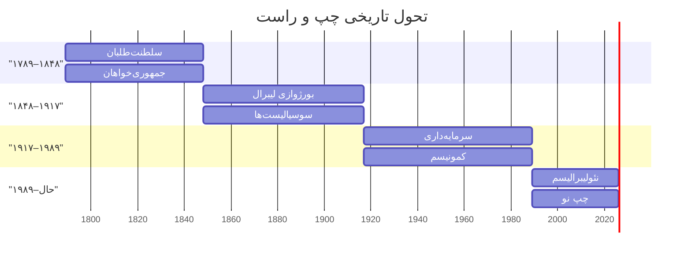
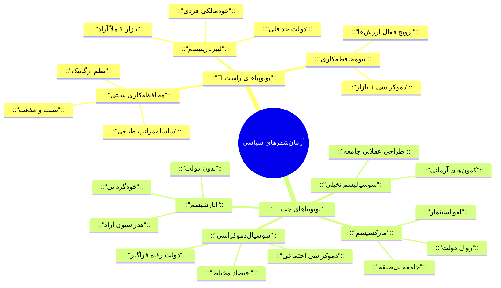
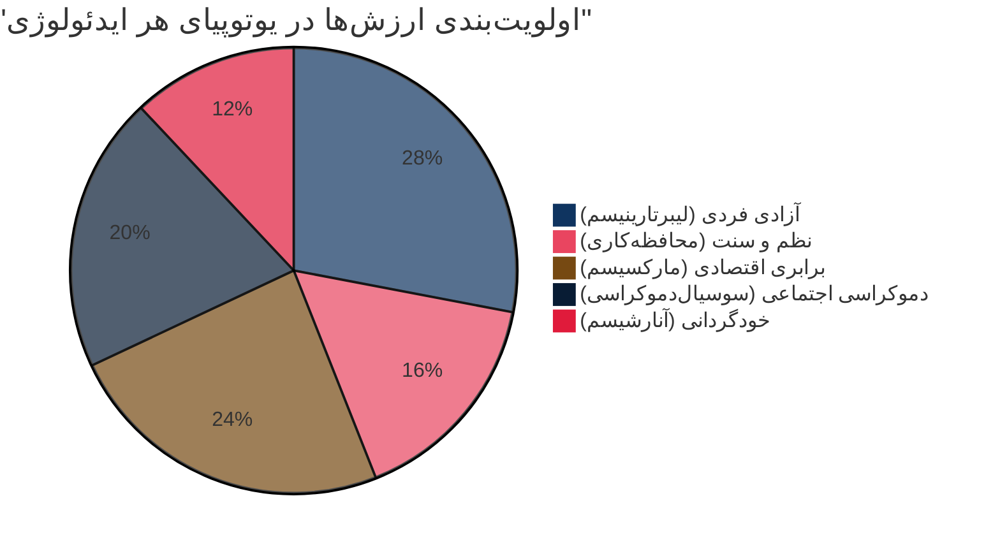
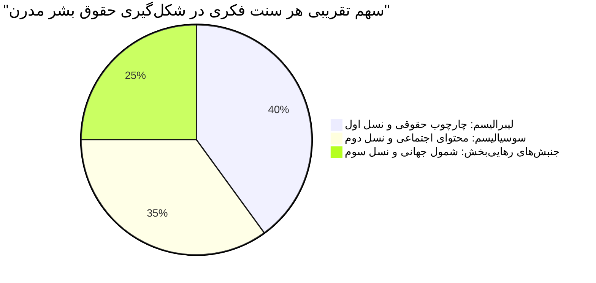

  
  <p className="subtitle">
    تحقیقی جامع در باب ایدئولوژی‌ها، دغدغه‌ها، زیرگروه‌ها، نظریه‌پردازان و پیامدهای عملی دو سنت بزرگ فکری مدرن
  </p>
  <p className="meta">
    تاریخ تدوین: ۲۰۲۵ · نسخهٔ ۱.۰ · فرمت: گزارش تحقیقاتی چندسطحی
  </p>

<div className="container">

<nav className="toc" id="toc">
  <h2>📑 فهرست مطالب</h2>
  <ol>
    <li>
      <a href="#ch1">مقدمه و چارچوب نظری</a>
      <ul className="sub">
        <li><a href="#s1-1">ریشه‌شناسی تاریخی دوگانهٔ چپ–راست</a></li>
        <li><a href="#s1-2">مدل‌های چندبُعدی طیف سیاسی</a></li>
        <li><a href="#s1-3">آیا دوگانهٔ چپ–راست هنوز معتبر است؟</a></li>
      </ul>
    </li>
    <li>
      <a href="#ch2">آرمان‌شهرها و یوتوپیاهای تصویرشده</a>
      <ul className="sub">
        <li><a href="#s2-1">یوتوپیاهای راست</a></li>
        <li><a href="#s2-2">یوتوپیاهای چپ</a></li>
        <li><a href="#s2-3">جدول تطبیقی آرمان‌شهرها</a></li>
      </ul>
    </li>
    <li>
      <a href="#ch3">تحلیل چندبُعدی: دغدغه‌ها و زاویه‌ها</a>
      <ul className="sub">
        <li><a href="#s3-1">محافظه‌کاری در برابر پیشرفت‌گرایی</a></li>
        <li><a href="#s3-2">انباشت در برابر توزیع</a></li>
        <li><a href="#s3-3">دو مفهوم آزادی</a></li>
        <li><a href="#s3-4">حمایت‌گرایی در برابر مسئولیت شخصی</a></li>
        <li><a href="#s3-5">تبعیض و برتری در برابر برابری</a></li>
      </ul>
    </li>
    <li>
      <a href="#ch4">حقوق بشر و ارزش‌های جهان‌شمول</a>
      <ul className="sub">
        <li><a href="#s4-1">سه نسل حقوق بشر</a></li>
        <li><a href="#s4-2">اعلامیهٔ جهانی ۱۹۴۸: ائتلاف ایدئولوژیک</a></li>
        <li><a href="#s4-3">ارزیابی: کدام پررنگ‌تر بود؟</a></li>
      </ul>
    </li>
    <li>
      <a href="#ch5">فردگرایی و اومانیسم</a>
      <ul className="sub">
        <li><a href="#s5-1">فردگرایی لیبرال</a></li>
        <li><a href="#s5-2">اومانیسم سوسیالیستی</a></li>
        <li><a href="#s5-3">شکاف نظری و عملی</a></li>
      </ul>
    </li>
    <li>
      <a href="#ch6">حقوق کارگری و دولت رفاه: خطوط سیر تاریخی</a>
      <ul className="sub">
        <li><a href="#s6-1">انگلستان</a></li>
        <li><a href="#s6-2">فرانسه</a></li>
        <li><a href="#s6-3">آمریکا</a></li>
        <li><a href="#s6-4">سوئد و مدل نوردیک</a></li>
        <li><a href="#s6-5">بلژیک و آلمان</a></li>
        <li><a href="#s6-6">تحلیل تطبیقی نقش‌ها</a></li>
      </ul>
    </li>
    <li>
      <a href="#ch7">زیرگروه‌های چپ و راست و نظریه‌پردازان</a>
      <ul className="sub">
        <li><a href="#s7-1">زیرگروه‌های راست</a></li>
        <li><a href="#s7-2">زیرگروه‌های چپ</a></li>
        <li><a href="#s7-3">جداول شناسنامه‌ای نظریه‌پردازان</a></li>
      </ul>
    </li>
    <li>
      <a href="#ch8">جنبش‌های بزرگ اجتماعی</a>
      <ul className="sub">
        <li><a href="#s8-1">مه ۱۹۶۸</a></li>
        <li><a href="#s8-2">جنبش حقوق مدنی آمریکا</a></li>
        <li><a href="#s8-3">سایر جنبش‌ها</a></li>
      </ul>
    </li>
    <li>
      <a href="#ch9">نتیجه‌گیری و ترکیب نهایی</a>
    </li>
  </ol>
</nav>

<div className="chapter-divider"><span>فصل اول</span></div>
<h2 className="chapter" id="ch1">۱. مقدمه و چارچوب نظری</h2>

<h3 className="section" id="s1-1">۱.۱ ریشه‌شناسی تاریخی دوگانهٔ چپ–راست</h3>

<p>
  واژه‌های «چپ» <em>(Gauche)</em> و «راست» <em>(Droite)</em> در ادبیات سیاسی مدرن ریشه در 
  <strong>مجلس ملی مؤسسان فرانسه</strong> <em>(Assemblée nationale constituante)</em> دارند.
  در تابستان ۱۷۸۹، پس از سقوط باستیل، نمایندگان مجلس هنگام رأی‌گیری دربارهٔ حق وتوی شاه 
  به دو دسته تقسیم شدند:
</p>

<div className="compare-grid">
  <div className="col right-col">
    <h4>🔵 سمت راست رئیس مجلس</h4>
    <p>
      نمایندگان هوادار <strong>حفظ حق وتوی مطلق شاه</strong>. اینان عمدتاً اشراف، روحانیون
      و بورژوازی بزرگ بودند که از تغییرات رادیکال هراس داشتند و خواهان حفظ نظم موجود یا 
      اصلاح بسیار تدریجی بودند.
    </p>
    <span className="tag right">محافظه‌کار</span>
    <span className="tag right">سلطنت‌طلب</span>
  </div>
  <div className="col left-col">
    <h4>🔴 سمت چپ رئیس مجلس</h4>
    <p>
      نمایندگان هوادار <strong>حاکمیت ملت و محدودسازی قدرت شاه</strong>. ترکیبی از بورژوازی 
      متوسط و کوچک، حقوقدانان و روشنفکرانی که الهام‌بخششان اندیشه‌های روشنگری (روسو، ولتر، 
      مونتسکیو) بود.
    </p>
    <span className="tag left">انقلابی</span>
    <span className="tag left">جمهوری‌خواه</span>
  </div>
</div>

<blockquote>
  «نشستن در سمت راست یا چپ رئیس مجلس به نمادی ایدئولوژیک تبدیل شد 
  که معنایش از آن جغرافیای نشیمن‌گاهی بسی فراتر رفت و تا امروز ادامه دارد.»
  <cite>— مارسل گوشه، <em>La droite et la gauche</em>، ۱۹۹۲</cite>
</blockquote>

<p>
  مهم است توجه کنیم که این تقسیم‌بندی اولیه صرفاً دربارهٔ <strong>حدود قدرت شاه</strong> بود.
  اما به‌سرعت بار معنایی گسترده‌تری یافت. در طول دو قرن بعد، محتوای این دوگانه چهار بار 
  اساساً دگرگون شد:
</p>

<div className="mermaid-wrapper">





</div>

<div className="mermaid-wrapper">


```mermaid
timeline
    title "تحول تاریخی معنای چپ و راست"
    section "دورهٔ ۱: ۱۷۸۹–۱۸۴۸"
      "سلطنت‌طلبان در برابر جمهوری‌خواهان" : "راست = اشراف و سلطنت"
                                              : "چپ = ژاکوبن‌ها و جمهوری‌خواهان"
    section "دورهٔ ۲: ۱۸۴۸–۱۹۱۷"
      "مسألهٔ اجتماعی و طبقاتی" : "راست = بورژوازی لیبرال + محافظه‌کاران"
                                  : "چپ = سوسیالیست‌ها و سندیکالیست‌ها"
    section "دورهٔ ۳: ۱۹۱۷–۱۹۸۹"
      "جنگ سرد ایدئولوژیک" : "راست = سرمایه‌داری لیبرال"
                             : "چپ = کمونیسم + سوسیال‌دموکراسی"
    section "دورهٔ ۴: ۱۹۸۹–اکنون"
      "جهانی‌شدن و بحران هویت" : "راست = نئولیبرالیسم + پوپولیسم ملی‌گرا"
                                 : "چپ = چپ نو + عدالت اجتماعی + اکولوژی"
```


<p className="caption">نمودار ۱ – تحول تاریخی محتوای دوگانهٔ چپ–راست از ۱۷۸۹ تاکنون</p>
</div>

<h3 className="section" id="s1-2">۱.۲ مدل‌های چندبُعدی طیف سیاسی</h3>

<p>
  طیف سیاسی چپ–راست در واقعیت <strong>تک‌بُعدی</strong> نیست. پژوهشگران مدل‌های متعددی 
  پیشنهاد کرده‌اند تا پیچیدگی‌های ایدئولوژیک را بهتر بازنمایی کنند:
</p>

<div className="mermaid-wrapper">


```mermaid
quadrantChart
    title "مدل دو محوری طیف سیاسی"
    x-axis "اقتصاد دولتی" --&gt; "بازار آزاد"
    y-axis "اقتدارگرایی" --&gt; "آزادی‌خواهی"
    quadrant-1 "لیبرتارین راست"
    quadrant-2 "چپ آزادی‌خواه"
    quadrant-3 "چپ اقتدارگرا"
    quadrant-4 "راست اقتدارگرا"
    "هایک": [0.85, 0.82]
    "فریدمن": [0.88, 0.78]
    "نوزیک": [0.90, 0.92]
    "ریگان": [0.78, 0.40]
    "تاچر": [0.82, 0.38]
    "مارکس": [0.12, 0.55]
    "لنین": [0.10, 0.15]
    "باکونین": [0.15, 0.95]
    "کروپوتکین": [0.18, 0.92]
    "رالز": [0.32, 0.72]
    "برنشتاین": [0.30, 0.68]
    "پالمه": [0.28, 0.75]
    "بیسمارک": [0.55, 0.18]
    "موسولینی": [0.50, 0.05]
```


<p className="caption">نمودار ۲ – جایگاه تقریبی نظریه‌پردازان در مدل دو محوری</p>
</div>

<p>
  مدل سه‌بُعدی توسعه‌یافته، بُعد <strong>اجتماعی-فرهنگی</strong> را نیز به دو بُعد اقتصادی 
  و سیاسی اضافه می‌کند:
</p>

<div className="table-wrapper">
<table>
  <thead>
    <tr>
      <th>بُعد</th>
      <th style="color:#FF9999">قطب چپ</th>
      <th style="color:#99CCFF">قطب راست</th>
    </tr>
  </thead>
  <tbody>
    <tr>
      <td><strong>اقتصادی</strong></td>
      <td>مداخلهٔ دولت · توزیع · مالکیت اجتماعی</td>
      <td>بازار آزاد · مالکیت خصوصی · رقابت</td>
    </tr>
    <tr>
      <td><strong>اجتماعی-فرهنگی</strong></td>
      <td>چندفرهنگی · سکولاریسم · حقوق اقلیت‌ها</td>
      <td>سنت‌گرایی · ارزش‌های خانواده · ملی‌گرایی</td>
    </tr>
    <tr>
      <td><strong>سیاسی-حکومتی</strong></td>
      <td>دموکراسی مشارکتی · عدم تمرکز</td>
      <td>نظم · امنیت · اقتدار مرکزی</td>
    </tr>
  </tbody>
</table>
</div>

<h3 className="section" id="s1-3">۱.۳ آیا دوگانهٔ چپ–راست هنوز معتبر است؟</h3>

<p>
  این پرسش از دههٔ ۱۹۹۰ به‌ویژه پس از فروپاشی شوروی مطرح شده است. 
  چهار موضع اصلی وجود دارد:
</p>

<div className="table-wrapper">
<table>
  <thead>
    <tr>
      <th>اندیشمند</th>
      <th>موضع</th>
      <th>اثر کلیدی</th>
      <th>استدلال</th>
    </tr>
  </thead>
  <tbody>
    <tr>
      <td><strong>نوربرتو بوبیو</strong></td>
      <td><span className="tag accent">دفاع از اعتبار</span></td>
      <td><em>Left and Right</em> (۱۹۹۶)</td>
      <td>محور برابری/نابرابری همچنان مسألهٔ بنیادین سیاست است</td>
    </tr>
    <tr>
      <td><strong>شانتال موف</strong></td>
      <td><span className="tag accent">دفاع از اعتبار</span></td>
      <td><em>On the Political</em> (۲۰۰۵)</td>
      <td>حذف این تمایز به «پسا-سیاست» و نفی مبارزهٔ دموکراتیک می‌انجامد</td>
    </tr>
    <tr>
      <td><strong>آنتونی گیدنز</strong></td>
      <td><span className="tag neutral">تردید</span></td>
      <td><em>Beyond Left and Right</em> (۱۹۹۴)</td>
      <td>در عصر «سیاست زندگی» دوگانهٔ سنتی ناکافی است؛ راه سوم لازم است</td>
    </tr>
    <tr>
      <td><strong>فرانسیس فوکویاما</strong></td>
      <td><span className="tag neutral">تردید (با بازنگری بعدی)</span></td>
      <td><em>The End of History</em> (۱۹۹۲)</td>
      <td>پیروزی نهایی لیبرال‌دموکراسی — اما بعداً بازنگری کرد</td>
    </tr>
  </tbody>
</table>
</div>

<div className="insight">
  <h4>یافتهٔ کلیدی</h4>
  <p>
    با وجود پیچیدگی‌های جدید (بحران اقلیمی، هویت‌های چندلایه، فناوری)، دو محور
    <strong>برابری/نابرابری</strong> و <strong>حفظ/تغییر نظم</strong> همچنان دوگانهٔ چپ–راست 
    را معنادار نگه می‌دارند. آنچه تغییر کرده <strong>محتوا و مصادیق</strong> است، 
    نه <strong>منطق ساختاری</strong> تمایز.
  </p>
</div>

<div className="chapter-divider"><span>فصل دوم</span></div>
<h2 className="chapter" id="ch2">۲. آرمان‌شهرها و یوتوپیاهای تصویرشده</h2>

<p>
  هر ایدئولوژی سیاسی، آگاهانه یا ناآگاهانه، تصویری از <strong>جامعهٔ مطلوب</strong> ارائه 
  می‌دهد — جامعه‌ای که اگر اصول آن ایدئولوژی به‌طور کامل پیاده شود، تحقق خواهد یافت. 
  این «آرمان‌شهر» <em>(Utopia)</em> ممکن است صریحاً بیان شده باشد (مانند <em>یوتوپیای</em> 
  تامس مور) یا به‌صورت ضمنی در سیاست‌های پیشنهادی نهفته باشد.
</p>

<div className="mermaid-wrapper">





<p className="caption">نمودار ۳ – نقشهٔ ذهنی آرمان‌شهرهای اصلی طیف سیاسی</p>
</div>

<h3 className="section" id="s2-1">۲.۱ یوتوپیاهای راست</h3>

<h4 className="subsection">محافظه‌کاری سنتی</h4>

<div className="card right">
  <h4>🔵 تصویر آرمانی</h4>
  <p>
    جامعه‌ای <strong>ارگانیک</strong> و <strong>سلسله‌مراتبی</strong>، مبتنی بر سنت، مذهب، 
    خانواده و اجتماعات محلی. هر فرد جایگاه طبیعی خود را می‌شناسد. نظم اجتماعی نه از طریق 
    مهندسی عقلانی بلکه از طریق تداوم عُرف و نهادهای تاریخی حفظ می‌شود. تغییر تدریجی و 
    ارگانیک مطلوب است؛ انقلاب، ویرانگر.
  </p>
</div>

<div className="table-wrapper">
<table>
  <thead>
    <tr>
      <th>نظریه‌پرداز</th>
      <th>اثر اصلی</th>
      <th>سال</th>
      <th>ایدهٔ محوری</th>
    </tr>
  </thead>
  <tbody>
    <tr>
      <td><strong>ادموند بِرک</strong><br /><small>Edmund Burke</small></td>
      <td><em>تأملاتی دربارهٔ انقلاب فرانسه</em></td>
      <td><span className="badge era">۱۷۹۰</span></td>
      <td>خرد جمعی نسل‌ها برتر از عقل انتزاعی فرد؛ اصلاح تدریجی به‌جای انقلاب</td>
    </tr>
    <tr>
      <td><strong>ژوزف دو مِستر</strong><br /><small>Joseph de Maistre</small></td>
      <td><em>ملاحظات دربارهٔ فرانسه</em></td>
      <td><span className="badge era">۱۷۹۶</span></td>
      <td>نظم الهی؛ ضرورت اقتدار سلطنتی و پاپی برای جلوگیری از هرج‌ومرج</td>
    </tr>
    <tr>
      <td><strong>مایکل اوکشات</strong><br /><small>Michael Oakeshott</small></td>
      <td><em>عقل‌گرایی در سیاست</em></td>
      <td><span className="badge era">۱۹۶۲</span></td>
      <td>سیاست «هنر ناوبری» است نه مهندسی مقصدمحور؛ دانش عملی بر نظری برتری دارد</td>
    </tr>
    <tr>
      <td><strong>راجر اسکروتن</strong><br /><small>Roger Scruton</small></td>
      <td><em>معنای محافظه‌کاری</em></td>
      <td><span className="badge era">۱۹۸۰</span></td>
      <td>وفاداری به نهادها، زیبایی‌شناسی نظم، اجتماع محلی به‌عنوان خانهٔ معنوی</td>
    </tr>
  </tbody>
</table>
</div>

<blockquote>
  «جامعه قراردادی است میان مردگان، زندگان و هنوز به‌دنیا نیامدگان.»
  <cite>— ادموند بِرک، <em>تأملاتی دربارهٔ انقلاب فرانسه</em>، ۱۷۹۰</cite>
</blockquote>

<h4 className="subsection">لیبرالیسم کلاسیک و لیبرتارینیسم</h4>

<div className="card right">
  <h4>🔵 تصویر آرمانی</h4>
  <p>
    جامعه‌ای از <strong>افراد آزاد و خودمختار</strong> که در <strong>بازار آزاد</strong> مبادله 
    می‌کنند. دولت به حداقل وظایف (امنیت، اجرای قراردادها، دفاع) محدود است. «دست نامرئی» 
    بازار بهترین تخصیص منابع را ایجاد می‌کند. مالکیت خصوصی مقدس و حقوق فردی تخطی‌ناپذیر است.
  </p>
</div>

<div className="table-wrapper">
<table>
  <thead>
    <tr>
      <th>نظریه‌پرداز</th>
      <th>اثر اصلی</th>
      <th>سال</th>
      <th>ایدهٔ محوری</th>
    </tr>
  </thead>
  <tbody>
    <tr>
      <td><strong>جان لاک</strong><br /><small>John Locke</small></td>
      <td><em>رسالهٔ دوم حکومت</em></td>
      <td><span className="badge era">۱۶۸۹</span></td>
      <td>حقوق طبیعی جان، آزادی و مالکیت مقدم بر دولت‌اند</td>
    </tr>
    <tr>
      <td><strong>آدام اسمیت</strong><br /><small>Adam Smith</small></td>
      <td><em>ثروت ملل</em></td>
      <td><span className="badge era">۱۷۷۶</span></td>
      <td>بازار آزاد، تقسیم کار و «دست نامرئی» بهترین تخصیص‌دهندهٔ منابع</td>
    </tr>
    <tr>
      <td><strong>فردریش هایک</strong><br /><small>F. A. Hayek</small></td>
      <td><em>راه بردگی</em></td>
      <td><span className="badge era">۱۹۴۴</span></td>
      <td>هرگونه برنامه‌ریزی مرکزی اقتصاد سرانجام به توتالیتاریسم می‌انجامد</td>
    </tr>
    <tr>
      <td><strong>میلتون فریدمن</strong><br /><small>Milton Friedman</small></td>
      <td><em>سرمایه‌داری و آزادی</em></td>
      <td><span className="badge era">۱۹۶۲</span></td>
      <td>آزادی اقتصادی پیش‌شرط ضروری آزادی سیاسی است</td>
    </tr>
    <tr>
      <td><strong>رابرت نوزیک</strong><br /><small>Robert Nozick</small></td>
      <td><em>آنارشی، دولت و یوتوپیا</em></td>
      <td><span className="badge era">۱۹۷۴</span></td>
      <td>فقط «دولت حداقلی» قابل توجیه است؛ هر بازتوزیع اجباری ناقض حقوق فردی</td>
    </tr>
    <tr>
      <td><strong>آین رند</strong><br /><small>Ayn Rand</small></td>
      <td><em>اطلس شانه بالا انداخت</em></td>
      <td><span className="badge era">۱۹۵۷</span></td>
      <td>اخلاق خودخواهی عقلانی؛ لایسه‌فِر مطلق؛ ایثار اخلاقاً مذموم</td>
    </tr>
  </tbody>
</table>
</div>

<blockquote>
  «دولتی که قدرت دادنِ همه‌چیز را دارد، قدرت گرفتنِ همه‌چیز را نیز دارد.»
  <cite>— میلتون فریدمن</cite>
</blockquote>

<h4 className="subsection">نئومحافظه‌کاری</h4>

<div className="card right">
  <h4>🔵 تصویر آرمانی</h4>
  <p>
    <strong>دموکراسی لیبرال</strong> مبتنی بر بازار آزاد در داخل، و <strong>ترویج فعال</strong> 
    (حتی نظامی) ارزش‌های دموکراتیک در خارج. ترکیبی از محافظه‌کاری فرهنگی، اقتصاد بازار 
    و سیاست خارجی مداخله‌گرایانه. شهروندان فضیلت‌مند و میهن‌دوست، نهادهای مدنی قوی 
    و آمریکا (یا غرب) به‌عنوان «شهری بر فراز تپه».
  </p>
  <p>
    <span className="badge person">ایروینگ کریستول</span>
    <span className="badge person">ویلیام کریستول</span>
    <span className="badge person">رابرت کیگان</span>
    <span className="badge person">لئو اشتراوس (الهام‌بخش فلسفی)</span>
  </p>
</div>

<h3 className="section" id="s2-2">۲.۲ یوتوپیاهای چپ</h3>

<h4 className="subsection">سوسیالیسم تخیلی</h4>

<div className="card left">
  <h4>🔴 تصویر آرمانی</h4>
  <p>
    جوامع کوچک مبتنی بر <strong>مالکیت اشتراکی</strong>، کار مشترک و زندگی هماهنگ. 
    حذف فقر از طریق <strong>طراحی عقلانی جامعه</strong>. سعادت از طریق محیط مناسب، 
    نه انقلاب خشونت‌آمیز.
  </p>
</div>

<div className="table-wrapper">
<table>
  <thead>
    <tr>
      <th>نظریه‌پرداز</th>
      <th>طرح آرمانی</th>
      <th>ویژگی اصلی</th>
    </tr>
  </thead>
  <tbody>
    <tr>
      <td><strong>سن‌سیمون</strong><br /><small>Saint-Simon</small></td>
      <td>جامعهٔ صنعتی مدیریت‌شده توسط دانشمندان و مهندسان</td>
      <td>تکنوکراسی آرمانی · پایان جنگ · «بهره‌برداری از طبیعت به‌جای انسان»</td>
    </tr>
    <tr>
      <td><strong>شارل فوریه</strong><br /><small>Charles Fourier</small></td>
      <td>فالانستِرها <em>(Phalanstères)</em></td>
      <td>اجتماعات ~۱۶۰۰ نفری · کار جذاب و متنوع · آزادی عاطفی و جنسی</td>
    </tr>
    <tr>
      <td><strong>رابرت اوئن</strong><br /><small>Robert Owen</small></td>
      <td>نیو هارمونی <em>(New Harmony)</em></td>
      <td>کارخانهٔ نمونه · آموزش همگانی · کاهش ساعات کار · محیط انسانی</td>
    </tr>
  </tbody>
</table>
</div>

<h4 className="subsection">مارکسیسم</h4>

<div className="card left">
  <h4>🔴 تصویر آرمانی</h4>
  <p>
    جامعهٔ <strong>کمونیستی بی‌طبقه</strong>، بی‌دولت و بدون استثمار. پایان 
    <strong>بیگانگی</strong> <em>(Alienation)</em>: کارگر دیگر از محصول کار، فرآیند تولید، 
    همنوعان و ذات انسانی‌اش جدا نیست. «رشد آزادانهٔ هر فرد شرط رشد آزادانهٔ همه» است.
  </p>
  <p style="font-size:1.1rem; font-weight:600; color:var(--left-color); margin-top:12px;">
    «از هر کس به‌اندازهٔ توانش، به هر کس به‌اندازهٔ نیازش.»
  </p>
</div>

<div className="mermaid-wrapper">


```mermaid
flowchart LR
    A["تضاد طبقاتی"] --&gt; B["انقلاب پرولتری"]
    B --&gt; C["دیکتاتوری پرولتاریا"]
    C --&gt; D["لغو مالکیت خصوصی ابزار تولید"]
    D --&gt; E["زوال تدریجی دولت"]
    E --&gt; F["جامعهٔ کمونیستی بی‌طبقه"]

    style A fill:#E74C3C,stroke:#C0392B,color:#fff
    style B fill:#E74C3C,stroke:#C0392B,color:#fff
    style C fill:#D35400,stroke:#E67E22,color:#fff
    style D fill:#F39C12,stroke:#F1C40F,color:#fff
    style E fill:#27AE60,stroke:#2ECC71,color:#fff
    style F fill:#0F3460,stroke:#1A5276,color:#fff
```


<p className="caption">نمودار ۴ – منطق تاریخی مارکسیسم: از تضاد طبقاتی تا جامعهٔ بی‌طبقه</p>
</div>

<div className="table-wrapper">
<table>
  <thead>
    <tr>
      <th>نظریه‌پرداز</th>
      <th>اثر اصلی</th>
      <th>سال</th>
      <th>ایدهٔ محوری</th>
    </tr>
  </thead>
  <tbody>
    <tr>
      <td><strong>کارل مارکس</strong></td>
      <td><em>سرمایه</em> · <em>مانیفست کمونیست</em></td>
      <td><span className="badge era">۱۸۴۸–۱۸۶۷</span></td>
      <td>ماتریالیسم تاریخی · مبارزهٔ طبقاتی · لغو مالکیت خصوصی ابزار تولید</td>
    </tr>
    <tr>
      <td><strong>لنین</strong></td>
      <td><em>دولت و انقلاب</em></td>
      <td><span className="badge era">۱۹۱۷</span></td>
      <td>حزب پیشتاز · دیکتاتوری پرولتاریا · امپریالیسم بالاترین مرحلهٔ سرمایه‌داری</td>
    </tr>
    <tr>
      <td><strong>آنتونیو گرامشی</strong></td>
      <td><em>دفترهای زندان</em></td>
      <td><span className="badge era">۱۹۲۹–۱۹۳۵</span></td>
      <td>هژمونی فرهنگی · روشنفکر ارگانیک · جنگ موضعی در برابر جنگ مانوری</td>
    </tr>
    <tr>
      <td><strong>هربرت مارکوزه</strong></td>
      <td><em>انسان تک‌ساحتی</em></td>
      <td><span className="badge era">۱۹۶۴</span></td>
      <td>نقد جامعهٔ مصرفی · سرکوب مازاد · پتانسیل انقلابی حاشیه‌نشینان و دانشجویان</td>
    </tr>
  </tbody>
</table>
</div>

<blockquote>
  «فیلسوفان تاکنون جهان را به شیوه‌های گوناگون تفسیر کرده‌اند؛ 
  مسأله اما بر سرِ تغییر دادن آن است.»
  <cite>— کارل مارکس، تِز یازدهم دربارهٔ فوئرباخ، ۱۸۴۵</cite>
</blockquote>

<h4 className="subsection">سوسیال‌دموکراسی</h4>

<div className="card left">
  <h4>🔴 تصویر آرمانی</h4>
  <p>
    <strong>اقتصاد مختلط</strong> با بازار رقابتی اما تنظیم‌شده. <strong>دولت رفاه فراگیر</strong>: 
    آموزش و بهداشت رایگان، تأمین اجتماعی همگانی، حداقل دستمزد شایسته. توزیع عادلانهٔ 
    فرصت‌ها و — تا حدی — نتایج، از طریق مالیات تصاعدی و خدمات عمومی. 
    <strong>دموکراسی</strong> نه فقط سیاسی بلکه اقتصادی و اجتماعی: حق مشارکت کارگران 
    در تصمیم‌گیری‌های محل کار.
  </p>
</div>

<div className="table-wrapper">
<table>
  <thead>
    <tr>
      <th>نظریه‌پرداز / فعال</th>
      <th>کشور</th>
      <th>سهم اصلی</th>
    </tr>
  </thead>
  <tbody>
    <tr>
      <td><strong>ادوارد برنشتاین</strong></td>
      <td>آلمان</td>
      <td>نقد انقلاب‌گرایی؛ «هدف هیچ، جنبش همه‌چیز» · اصلاح تدریجی (<em>Evolutionary Socialism</em>, ۱۸۹۹)</td>
    </tr>
    <tr>
      <td><strong>اولوف پالمه</strong></td>
      <td>سوئد</td>
      <td>عملی‌سازی دولت رفاه نوردیک · سیاست برابری‌طلبانه در عمل</td>
    </tr>
    <tr>
      <td><strong>جان رالز</strong></td>
      <td>آمریکا</td>
      <td><em>نظریهٔ عدالت</em> (۱۹۷۱): عدالت به‌مثابهٔ انصاف · «اصل تفاوت» · پردهٔ جهل</td>
    </tr>
    <tr>
      <td><strong>گونار میردال</strong></td>
      <td>سوئد</td>
      <td>نظریهٔ اقتصادی دولت رفاه · تحلیل نابرابری نژادی آمریکا</td>
    </tr>
  </tbody>
</table>
</div>

<h4 className="subsection">آنارشیسم</h4>

<div className="card left">
  <h4>🔴 تصویر آرمانی</h4>
  <p>
    جامعه‌ای <strong>بدون دولت</strong> و بدون هرگونه سلسله‌مراتب اجباری. فدراسیون 
    آزادانهٔ کمون‌ها و شوراهای محلی. <strong>کمک متقابل</strong> <em>(Mutual Aid)</em> 
    به‌جای رقابت. خودگردانی در همهٔ سطوح.
  </p>
</div>

<div className="mermaid-wrapper">


```mermaid
flowchart TB
    A["آنارشیسم"] --&gt; B["آنارشیسم متقابل‌گرا"]
    A --&gt; C["آنارشیسم جمع‌گرایانه"]
    A --&gt; D["آنارکو-کمونیسم"]
    A --&gt; E["آنارکو-سندیکالیسم"]
    A --&gt; F["آنارکو-فمینیسم"]

    B --- B1["پرودون"]
    C --- C1["باکونین"]
    D --- D1["کروپوتکین"]
    E --- E1["سورل · پلوتیه"]
    F --- F1["اِما گلدمن"]

    style A fill:#E94560,stroke:#C0392B,color:#fff,font-weight:bold
    style B fill:#F0F4F8,stroke:#E74C3C,color:#1A1A2E
    style C fill:#F0F4F8,stroke:#E74C3C,color:#1A1A2E
    style D fill:#F0F4F8,stroke:#E74C3C,color:#1A1A2E
    style E fill:#F0F4F8,stroke:#E74C3C,color:#1A1A2E
    style F fill:#F0F4F8,stroke:#E74C3C,color:#1A1A2E
    style B1 fill:#fff,stroke:#7D8A96,color:#1A1A2E
    style C1 fill:#fff,stroke:#7D8A96,color:#1A1A2E
    style D1 fill:#fff,stroke:#7D8A96,color:#1A1A2E
    style E1 fill:#fff,stroke:#7D8A96,color:#1A1A2E
    style F1 fill:#fff,stroke:#7D8A96,color:#1A1A2E
```


<p className="caption">نمودار ۵ – شاخه‌های اصلی آنارشیسم و نمایندگان کلیدی</p>
</div>

<blockquote>
  «آزادی بدون سوسیالیسم استثمار و بی‌عدالتی است؛ 
  سوسیالیسم بدون آزادی بردگی و وحشیگری.»
  <cite>— میخائیل باکونین</cite>
</blockquote>

<h3 className="section" id="s2-3">۲.۳ جدول تطبیقی بزرگ آرمان‌شهرها</h3>

<div className="table-wrapper">
<table>
  <thead>
    <tr>
      <th>بُعد</th>
      <th style="background:#2E86C1">محافظه‌کاری سنتی</th>
      <th style="background:#2E86C1">لیبرتارینیسم</th>
      <th style="background:#8E44AD">سوسیال‌دموکراسی</th>
      <th style="background:#E74C3C">مارکسیسم</th>
      <th style="background:#E74C3C">آنارشیسم</th>
    </tr>
  </thead>
  <tbody>
    <tr>
      <td><strong>واحد بنیادین</strong></td>
      <td>اجتماع / نهاد</td>
      <td>فرد</td>
      <td>شهروند</td>
      <td>طبقه</td>
      <td>فرد-در-اجتماع</td>
    </tr>
    <tr>
      <td><strong>مالکیت</strong></td>
      <td>خصوصی + موقوفه</td>
      <td>خصوصی مطلق</td>
      <td>مختلط</td>
      <td>اجتماعی/دولتی</td>
      <td>اشتراکی</td>
    </tr>
    
    <tr>
      <td><strong>دولت</strong></td>
      <td>قوی ولی محدود به سنت</td>
      <td>حداقلی (شب‌نگهبان)</td>
      <td>فعال و رفاهی</td>
      <td>گذرا (زوال تدریجی)</td>
      <td>حذف کامل</td>
    </tr>
    <tr>
      <td><strong>بازار</strong></td>
      <td>آزاد با مسئولیت اخلاقی</td>
      <td>کاملاً آزاد</td>
      <td>تنظیم‌شده</td>
      <td>حذف (برنامه‌ریزی مرکزی)</td>
      <td>تعاونی / متقابل</td>
    </tr>
    <tr>
      <td><strong>نگاه به برابری</strong></td>
      <td>نابرابری طبیعی و مطلوب</td>
      <td>برابری حقوقی؛ نابرابری اقتصادی مجاز</td>
      <td>برابری فرصت + کاهش نابرابری نتیجه</td>
      <td>برابری کامل مادی</td>
      <td>برابری در آزادی</td>
    </tr>
    <tr>
      <td><strong>مفهوم آزادی</strong></td>
      <td>آزادی در چارچوب نظم</td>
      <td>آزادی منفی (عدم مداخله)</td>
      <td>آزادی مثبت + منفی</td>
      <td>آزادی واقعی پس از لغو استثمار</td>
      <td>خودگردانی کامل</td>
    </tr>
    <tr>
      <td><strong>موتور تغییر</strong></td>
      <td>تکامل تدریجی ارگانیک</td>
      <td>رقابت بازار</td>
      <td>اصلاح دموکراتیک</td>
      <td>انقلاب طبقاتی</td>
      <td>اقدام مستقیم و خودسازمان‌دهی</td>
    </tr>
    <tr>
      <td><strong>نمونهٔ تاریخی نزدیک</strong></td>
      <td>انگلستان ویکتوریایی</td>
      <td>هنگ‌کنگ دههٔ ۱۹۷۰</td>
      <td>سوئد ۱۹۵۰–۱۹۸۰</td>
      <td>شوروی (ادعایی)</td>
      <td>کاتالونیا ۱۹۳۶–۱۹۳۹</td>
    </tr>
    <tr>
      <td><strong>نقطه‌ضعف تاریخی</strong></td>
      <td>تقدیس نابرابری و سنت‌های ظالمانه</td>
      <td>نابرابری فاحش · بحران‌های مالی</td>
      <td>بوروکراسی · کاهش انگیزه (ادعایی)</td>
      <td>توتالیتاریسم · سرکوب فردیت</td>
      <td>ناپایداری · آسیب‌پذیری نظامی</td>
    </tr>
  </tbody>
</table>
</div>

<div className="mermaid-wrapper">





<p className="caption">نمودار ۶ – توزیع تقریبی اولویت ارزشی در یوتوپیای هر ایدئولوژی</p>
</div>

<div className="chapter-divider"><span>فصل سوم</span></div>
<h2 className="chapter" id="ch3">۳. تحلیل چندبُعدی: دغدغه‌ها و زاویه‌ها</h2>

<p>
  در این فصل، پنج محور بنیادینی را که چپ و راست را از یکدیگر متمایز می‌سازند 
  تحلیل می‌کنیم. هر محور نه‌تنها یک «بُعد» نظری بلکه یک <strong>میدان نبرد عملی</strong> 
  در سیاست‌گذاری واقعی است.
</p>

<div className="mermaid-wrapper">


```mermaid
flowchart TB
    CENTER["تحلیل چندبُعدی<br />چپ و راست"] --&gt; A["محافظه‌کاری<br />↔<br />پیشرفت‌گرایی"]
    CENTER --&gt; B["انباشت<br />↔<br />توزیع"]
    CENTER --&gt; C["آزادی منفی<br />↔<br />آزادی مثبت"]
    CENTER --&gt; D["مسئولیت شخصی<br />↔<br />حمایت‌گرایی"]
    CENTER --&gt; E["سلسله‌مراتب<br />↔<br />برابری"]

    style CENTER fill:#0F3460,stroke:#0F3460,color:#fff,font-weight:bold
    style A fill:#F0F4F8,stroke:#2E86C1,color:#1A1A2E
    style B fill:#F0F4F8,stroke:#F5A623,color:#1A1A2E
    style C fill:#F0F4F8,stroke:#E94560,color:#1A1A2E
    style D fill:#F0F4F8,stroke:#27AE60,color:#1A1A2E
    style E fill:#F0F4F8,stroke:#8E44AD,color:#1A1A2E
```


<p className="caption">نمودار ۷ – پنج محور بنیادین تمایز چپ و راست</p>
</div>

<h3 className="section" id="s3-1">۳.۱ محافظه‌کاری در برابر پیشرفت‌گرایی</h3>

<div className="compare-grid">
  <div className="col right-col">
    <h4>🔵 محافظه‌کاری (غالباً راست)</h4>
    <p><strong>مبنای انسان‌شناختی:</strong> انسان ذاتاً ناقص و خطاپذیر است. نهادهای موجود 
    حاصل <strong>خرد انباشتهٔ نسل‌ها</strong>ست و نباید به‌سادگی کنار گذاشته شوند.</p>
    <ul>
      <li><strong>بِرک:</strong> خرد جمعی بر عقل انتزاعی فرد برتری دارد</li>
      <li><strong>اوکشات:</strong> تجربه بر نظریه، دانش عملی بر دانش فنی</li>
      <li><strong>اسکروتن:</strong> نهادها «خانه»اند نه «ابزار» — نباید مدام بازطراحی شوند</li>
    </ul>
    
    <p><strong>پیامد عملی:</strong></p>
    <ul>
      <li>مقاومت در برابر تغییرات سریع و رادیکال</li>
      <li>ترجیح اصلاح تدریجی بر انقلاب</li>
      <li>تأکید بر «آنچه هست و کار کرده» به‌جای «آنچه باید باشد»</li>
      <li>احترام به حقوق عرفی <em>(Common Law)</em> بیش از قانون‌گذاری عقلانی</li>
    </ul>
    <span className="tag right">بِرک</span>
    <span className="tag right">اوکشات</span>
    <span className="tag right">اسکروتن</span>
    <span className="tag right">دو مِستر</span>
  </div>

  <div className="col left-col">
    <h4>🔴 پیشرفت‌گرایی (غالباً چپ)</h4>
    <p><strong>مبنای انسان‌شناختی:</strong> انسان قابلیت بهبود و تعالی دارد. 
    <strong>ساختارهای اجتماعی</strong> — نه طبیعت انسان — عامل اصلی بدبختی، فقر و ظلم‌اند. 
    بنابراین تغییر ساختارها هم ممکن و هم ضروری است.</p>
    <ul>
      <li><strong>روسو:</strong> انسان طبیعتاً نیک است؛ جامعه او را فاسد کرده</li>
      <li><strong>کندورسه:</strong> تاریخ = پیشرفت تدریجی عقل و آزادی</li>
      <li><strong>مارکس:</strong> تاریخ = مبارزهٔ طبقاتی به‌سوی رهایی نهایی</li>
      <li><strong>دیویی:</strong> دموکراسی = آزمایشگاه دائمی اصلاحات</li>
    </ul>
    <p><strong>پیامد عملی:</strong></p>
    <ul>
      <li>تلاش برای اصلاحات ساختاری و نهادی</li>
      <li>قانون‌گذاری فعال برای عدالت اجتماعی</li>
      <li>باور به امکان طراحی عقلانی جامعهٔ بهتر</li>
      <li>گاه آمادگی برای انقلاب (در شاخهٔ رادیکال)</li>
    </ul>
    <span className="tag left">روسو</span>
    <span className="tag left">مارکس</span>
    <span className="tag left">دیویی</span>
    <span className="tag left">کندورسه</span>
  </div>
</div>

<h4 className="subsection">پیچیدگی‌ها و استثناهای مهم</h4>

<p>
  تقابل محافظه‌کاری–پیشرفت‌گرایی همیشه با تقابل راست–چپ منطبق نیست. 
  نمونه‌های زیر این پیچیدگی را نشان می‌دهند:
</p>

<div className="table-wrapper">
<table>
  <thead>
    <tr>
      <th>نمونه</th>
      <th>طیف رسمی</th>
      <th>رفتار واقعی</th>
      <th>توضیح</th>
    </tr>
  </thead>
  <tbody>
    <tr>
      <td><strong>بیسمارک</strong> (آلمان، ۱۸۸۰)</td>
      <td><span className="tag right">راست محافظه‌کار</span></td>
      <td><span className="tag accent">اصلاح‌گر اجتماعی</span></td>
      <td>بنیادگذار نخستین بیمه‌های اجتماعی مدرن (بیماری ۱۸۸۳، حوادث ۱۸۸۴، بازنشستگی ۱۸۸۹) — با انگیزهٔ مهار جنبش سوسیالیستی</td>
    </tr>
    <tr>
      <td><strong>دیزرائیلی</strong> (بریتانیا، ۱۸۷۰)</td>
      <td><span className="tag right">راست محافظه‌کار</span></td>
      <td><span className="tag accent">اصلاح‌گر اجتماعی</span></td>
      <td>محافظه‌کاری «یک ملتی» <em>(One-Nation)</em>: اصلاحات بهداشتی و مسکن از بالا برای حفظ وحدت ملی</td>
    </tr>
    <tr>
      <td><strong>استالین</strong> (شوروی، ۱۹۳۰)</td>
      <td><span className="tag left">چپ انقلابی</span></td>
      <td><span className="tag neutral">محافظه‌کار عملی</span></td>
      <td>«سوسیالیسم در یک کشور»، احیای ملی‌گرایی روسی، سلسله‌مراتب شدید حزبی</td>
    </tr>
    <tr>
      <td><strong>نئومحافظه‌کاران آمریکایی</strong></td>
      <td><span className="tag right">راست</span></td>
      <td><span className="tag accent">انقلابی در سیاست خارجی</span></td>
      <td>خواهان تغییر رادیکال نظم خاورمیانه — پارادوکس «محافظه‌کاری انقلابی»</td>
    </tr>
  </tbody>
</table>
</div>

<div className="insight">
  <h4>یافتهٔ کلیدی</h4>
  <p>
    محافظه‌کاری و پیشرفت‌گرایی <strong>نه ذاتاً اخلاقی و نه ذاتاً غیراخلاقی</strong>‌اند. 
    ارزش هر کدام به <strong>محتوای آنچه حفظ یا تغییر می‌شود</strong> بستگی دارد. 
    حفظ نهادهای دموکراتیک ارزشمند است؛ حفظ نهادهای تبعیض‌آمیز ناپسند. 
    تغییر به‌سوی عدالت مطلوب است؛ تغییر بدون تدبیر ویرانگر.
  </p>
</div>

<h3 className="section" id="s3-2">۳.۲ انباشت در برابر توزیع</h3>

<div className="compare-grid">
  <div className="col right-col">
    <h4>🔵 منطق انباشت (غالباً راست)</h4>
    <p>ثروت ابتدا باید <strong>تولید</strong> شود تا بتوان آن را توزیع کرد. سرمایه‌گذاری، 
    نوآوری و کارآفرینی نیازمند <strong>انگیزه‌های مادی</strong> (سود، مالکیت) هستند. 
    نابرابری اقتصادی نه‌تنها اجتناب‌ناپذیر بلکه <strong>محرک رشد</strong> است.</p>
    <p><strong>نظریهٔ کلیدی:</strong> «تراوش به پایین» <em>(Trickle-down)</em> — 
    رشد اقتصادی در بالا سرانجام به همهٔ لایه‌ها سود می‌رساند.</p>
    <blockquote style="font-size:0.9rem;">
      «کیک را ابتدا باید بزرگ‌تر کرد، سپس تقسیم.»
      <cite>— استعارهٔ رایج اقتصاد عرضه‌محور</cite>
    </blockquote>
    <span className="tag right">اسمیت</span>
    <span className="tag right">هایک</span>
    <span className="tag right">فریدمن</span>
    <span className="tag right">لَفِر</span>
  </div>

  <div className="col left-col">
    <h4>🔴 منطق توزیع (غالباً چپ)</h4>
    <p>انباشت بدون توزیع عادلانه به <strong>تمرکز قدرت</strong>، فقر گسترده و 
    بی‌ثباتی اجتماعی می‌انجامد. توزیع عادلانه خود <strong>محرک رشد</strong> است 
    (از طریق افزایش تقاضای مؤثر).</p>
    <p><strong>نظریهٔ کلیدی:</strong> اقتصاد کینزی — تقاضای مؤثر موتور اقتصاد است؛ 
    توزیع درآمد به نفع طبقات پایین تقاضا و رشد را افزایش می‌دهد.</p>
    <blockquote style="font-size:0.9rem;">
      «نابرابری افراطی نه فقط غیراخلاقی بلکه ناکارآمد اقتصادی است.»
      <cite>— جوزف استیگلیتز، <em>بهای نابرابری</em>، ۲۰۱۲</cite>
    </blockquote>
    <span className="tag left">کینز</span>
    <span className="tag left">استیگلیتز</span>
    <span className="tag left">پیکتی</span>
    <span className="tag left">رالز</span>
  </div>
</div>

<h4 className="subsection">مقایسهٔ سیاست‌های عملی</h4>

<div className="table-wrapper">
<table>
  <thead>
    <tr>
      <th>ابزار سیاست‌گذاری</th>
      <th style="background:#2E86C1">دیدگاه راست</th>
      <th style="background:#E74C3C">دیدگاه چپ</th>
    </tr>
  </thead>
  <tbody>
    <tr>
      <td><strong>مالیات تصاعدی</strong></td>
      <td>مانع سرمایه‌گذاری · مجازات موفقیت</td>
      <td>ابزار اصلی عدالت و تأمین خدمات عمومی</td>
    </tr>
    <tr>
      <td><strong>حداقل دستمزد</strong></td>
      <td>اختلال در بازار کار · افزایش بیکاری</td>
      <td>حق بنیادین کارگر · تضمین زندگی شایسته</td>
    </tr>
    <tr>
      <td><strong>ضریب جینی بالا</strong></td>
      <td>طبیعی و انگیزه‌بخش · بازتاب تفاوت تلاش</td>
      <td>نشانهٔ بی‌عدالتی ساختاری · تهدید دموکراسی</td>
    </tr>
    <tr>
      <td><strong>مالکیت عمومی</strong></td>
      <td>ناکارآمد · رانت‌زا · ضد نوآوری</td>
      <td>ابزار کنترل دموکراتیک بر منابع استراتژیک</td>
    </tr>
    <tr>
      <td><strong>خصوصی‌سازی</strong></td>
      <td>افزایش کارآیی · کاهش بوروکراسی</td>
      <td>انتقال ثروت عمومی به نخبگان · کاهش دسترسی</td>
    </tr>
  </tbody>
</table>
</div>

<h4 className="subsection">شواهد تجربی: داده‌ها چه می‌گویند؟</h4>

<div className="card accent">
  <h4>📊 یافته‌های کلیدی پژوهشی</h4>
  <p>بر اساس داده‌های <strong>OECD</strong>، <strong>بانک جهانی</strong> و تحقیقات 
  <strong>توما پیکتی</strong> (<em>سرمایه در قرن بیست‌ویکم</em>، ۲۰۱۳):</p>
  <ul>
    <li>کشورهای با توزیع برابرتر (نوردیک) هم رشد اقتصادی پایدار و هم شاخص‌های رفاهی 
    بالاتری دارند <em>(UNDP Human Development Report, 2020)</em></li>
    <li>دورهٔ ۱۹۴۵–۱۹۷۵ («سی سال شکوهمند») همزمان با <strong>بالاترین مالیات‌ها</strong> 
    و <strong>پایین‌ترین نابرابری</strong> و <strong>بالاترین رشد</strong> بود</li>
    <li>نابرابری شدید پس از ۱۹۸۰ (عصر نئولیبرال) با <strong>کاهش رشد بهره‌وری</strong> 
    و <strong>افزایش بی‌ثباتی مالی</strong> همراه بوده (بحران ۲۰۰۸)</li>
    <li><strong>نرخ بالای مالیات بر ثروت</strong> در دورهٔ ۱۹۵۰–۱۹۸۰ مانع رشد نشد 
    بلکه با رشد بی‌سابقه همراه بود (پیکتی، ۲۰۱۳: فصل ۱۴)</li>
  </ul>
</div>

<div className="mermaid-wrapper">


```mermaid
xychart-beta
    title "روند نابرابری درآمد (سهم دهک بالا) در آمریکا"
    x-axis ["۱۹۲۰","۱۹۳۰","۱۹۴۰","۱۹۵۰","۱۹۶۰","۱۹۷۰","۱۹۸۰","۱۹۹۰","۲۰۰۰","۲۰۱۰","۲۰۲۰"]
    y-axis "درصد درآمد ملی (دهک بالا)" 30 --&gt; 55
    line [48, 45, 35, 33, 33, 32, 34, 41, 47, 48, 52]
```


<p className="caption">نمودار ۸ – روند U شکل نابرابری در آمریکا: کاهش در عصر نیو دیل و دولت رفاه، افزایش مجدد در عصر نئولیبرال (بر اساس داده‌های پیکتی و سائز)</p>
</div>

<h3 className="section" id="s3-3">۳.۳ دو مفهوم آزادی (و یک سوم)</h3>

<p>
  مفهوم <strong>آزادی</strong> <em>(Liberty/Freedom)</em> شاید اصلی‌ترین میدان نبرد فلسفی 
  میان چپ و راست باشد. هر دو طرف مدعی دفاع از آزادی‌اند، اما تعریف‌شان از آزادی 
  بنیاداً متفاوت است.
</p>

<div className="mermaid-wrapper">


```mermaid
flowchart LR
    F["آزادی<br />Freedom"] --&gt; N["آزادی منفی<br />Negative Liberty"]
    F --&gt; P["آزادی مثبت<br />Positive Liberty"]
    F --&gt; R["آزادی جمهوری‌خواهانه<br />Non-Domination"]

    N --&gt; N1["عدم مداخلهٔ دیگران"]
    N --&gt; N2["دولت حداقلی"]
    N --&gt; N3["حقوق مدنی کلاسیک"]

    P --&gt; P1["توانمندی واقعی فرد"]
    P --&gt; P2["دسترسی به منابع"]
    P --&gt; P3["دولت رفاه توانمندساز"]

    R --&gt; R1["فقدان سلطهٔ خودسرانه"]
    R --&gt; R2["حکومت قانون"]
    R --&gt; R3["دموکراسی مشارکتی"]

    style F fill:#0F3460,stroke:#0F3460,color:#fff,font-weight:bold
    style N fill:#2E86C1,stroke:#2E86C1,color:#fff
    style P fill:#E74C3C,stroke:#E74C3C,color:#fff
    style R fill:#8E44AD,stroke:#8E44AD,color:#fff
    style N1 fill:#D6EAF8,stroke:#2E86C1,color:#1A1A2E
    style N2 fill:#D6EAF8,stroke:#2E86C1,color:#1A1A2E
    style N3 fill:#D6EAF8,stroke:#2E86C1,color:#1A1A2E
    style P1 fill:#FADBD8,stroke:#E74C3C,color:#1A1A2E
    style P2 fill:#FADBD8,stroke:#E74C3C,color:#1A1A2E
    style P3 fill:#FADBD8,stroke:#E74C3C,color:#1A1A2E
    style R1 fill:#E8DAEF,stroke:#8E44AD,color:#1A1A2E
    style R2 fill:#E8DAEF,stroke:#8E44AD,color:#1A1A2E
    style R3 fill:#E8DAEF,stroke:#8E44AD,color:#1A1A2E
```


<p className="caption">نمودار ۹ – سه مفهوم بنیادین آزادی و لوازم هرکدام</p>
</div>

<div className="compare-grid">
  <div className="col right-col">
    <h4>🔵 آزادی منفی (عدم مداخله)</h4>
    <p><strong>تعریف (آیزایا برلین، ۱۹۵۸):</strong> من آزادم تا آنجا که دیگران — به‌ویژه 
    دولت — در کارم دخالت نکنند. آزادی = فقدان موانع بیرونی.</p>
    <blockquote style="font-size:0.9rem;">
      «آزادی به‌معنای فقدان اجبار از سوی دیگران است.»
      <cite>— هایک، <em>قانون اساسی آزادی</em>، ۱۹۶۰</cite>
    </blockquote>
    <p><strong>دشمن اصلی:</strong> دولت بزرگ، مالیات بالا، مقررات‌گذاری</p>
    <p><strong>نسخهٔ سیاسی:</strong> دولت حداقلی، بازار آزاد، مالکیت خصوصی مقدس</p>
    <span className="tag right">لاک</span>
    <span className="tag right">هایک</span>
    <span className="tag right">نوزیک</span>
    <span className="tag right">برلین (بخشاً)</span>
  </div>

  <div className="col left-col">
    <h4>🔴 آزادی مثبت (توانمندسازی)</h4>
    <p><strong>تعریف (برلین + سِن + مارکس):</strong> آزادی یعنی <strong>توانایی واقعی</strong> 
    فرد برای تحقق امکانات زندگی‌اش. فقیری که قانوناً آزاد است اما نه نان دارد 
    نه سرپناه، <strong>واقعاً آزاد نیست</strong>.</p>
    <blockquote style="font-size:0.9rem;">
      «توسعه یعنی گسترش قابلیت‌ها — آنچه فرد واقعاً می‌تواند باشد و انجام دهد.»
      <cite>— آمارتیا سن، <em>توسعه به‌مثابهٔ آزادی</em>، ۱۹۹۹</cite>
    </blockquote>
    <p><strong>دشمن اصلی:</strong> فقر، جهل، بیماری، تبعیض ساختاری</p>
    <p><strong>نسخهٔ سیاسی:</strong> دولت رفاه، آموزش رایگان، بهداشت همگانی</p>
    <span className="tag left">مارکس</span>
    <span className="tag left">سِن</span>
    <span className="tag left">رالز</span>
    <span className="tag left">نوسبام</span>
  </div>
</div>

<div className="card accent">
  <h4>🟣 آزادی سوم: عدم سلطه (فیلیپ پتیت)</h4>
  <p><strong>تعریف:</strong> آزادی نه صرفاً فقدان مداخله، بلکه فقدان <strong>ظرفیت</strong> 
  مداخلهٔ خودسرانه. حتی اگر اربابی مهربان هرگز مداخله نکند، صرف <strong>توانایی 
  او</strong> برای مداخلهٔ خودسرانه، بردگی است.</p>
  <p><strong>مرجع:</strong> پتیت، <em>Republicanism: A Theory of Freedom and Government</em>، ۱۹۹۷</p>
  <p><strong>نسخهٔ سیاسی:</strong> حکومت قانون قوی، نظارت دموکراتیک بر همهٔ قدرت‌ها 
  (دولتی <strong>و</strong> خصوصی)، قوانین ضد انحصار</p>
  <span className="tag accent">پتیت</span>
  <span className="tag accent">اسکینر</span>
  <span className="tag accent">ماکیاولی (سنت جمهوری‌خواهی)</span>
</div>

<h4 className="subsection">جدول تطبیقی سه مفهوم آزادی</h4>

<div className="table-wrapper">
<table>
  <thead>
    <tr>
      <th>بُعد</th>
      <th style="background:#2E86C1">آزادی منفی</th>
      <th style="background:#E74C3C">آزادی مثبت</th>
      <th style="background:#8E44AD">آزادی عدم سلطه</th>
    </tr>
  </thead>
  <tbody>
    <tr>
      <td><strong>تعریف</strong></td>
      <td>فقدان مانع بیرونی</td>
      <td>توانایی خودتحقق‌بخشی</td>
      <td>فقدان ظرفیت مداخلهٔ خودسرانه</td>
    </tr>
    <tr>
      <td><strong>دشمن</strong></td>
      <td>دولت مداخله‌گر</td>
      <td>فقر · جهل · بیماری</td>
      <td>قدرت خودسرانه (دولتی یا خصوصی)</td>
    </tr>
    <tr>
      <td><strong>نسخهٔ سیاسی</strong></td>
      <td>دولت حداقلی</td>
      <td>دولت رفاه توانمندساز</td>
      <td>دولت مشروطهٔ پاسخ‌گو</td>
    </tr>
    <tr>
      <td><strong>نقطه‌ضعف</strong></td>
      <td>نادیده‌گیری سلطهٔ اقتصادی خصوصی</td>
      <td>خطر پدرسالاری دولتی</td>
      <td>پیچیدگی نهادی بالا</td>
    </tr>
    <tr>
      <td><strong>خوانش سیاسی غالب</strong></td>
      <td>راست لیبرال</td>
      <td>چپ</td>
      <td>فرا-طیفی (اغلب چپ‌میانه)</td>
    </tr>
  </tbody>
</table>
</div>

<h3 className="section" id="s3-4">۳.۴ حمایت‌گرایی در برابر مسئولیت شخصی</h3>

<div className="compare-grid">
  <div className="col left-col">
    <h4>🔴 منطق حمایت‌گرایی اجتماعی (غالباً چپ)</h4>
    <ul>
      <li>جامعه <strong>مسئول رفاه همهٔ اعضایش</strong> است</li>
      <li>شکست فردی اغلب محصول <strong>ساختارهای ناعادلانه</strong> است: فقر نسلی، 
      تبعیض نژادی/جنسیتی، فقدان فرصت آموزشی</li>
      <li>دولت باید <strong>شبکهٔ ایمنی اجتماعی</strong> فراهم کند: بیمه، آموزش، بهداشت، مسکن</li>
      <li><strong>سرمایه‌گذاری اجتماعی</strong> بازگشت اقتصادی دارد: کودک تغذیه‌شده و 
      آموزش‌دیده، شهروند مولد آینده است</li>
    </ul>
  </div>

  <div className="col right-col">
    <h4>🔵 منطق مسئولیت شخصی (غالباً راست)</h4>
    <ul>
      <li>هر فرد <strong>مسئول زندگی و انتخاب‌های خود</strong> است</li>
      <li>حمایت‌گرایی دولتی <strong>وابستگی</strong> ایجاد می‌کند و انگیزهٔ کار و تلاش 
      را تضعیف می‌کند <em>(Moral Hazard)</em></li>
      <li>خیریه باید <strong>داوطلبانه</strong> باشد نه اجباری از طریق مالیات</li>
      <li>رقابت و <strong>پیامدهای طبیعی</strong> انتخاب‌ها بهترین آموزگار است</li>
    </ul>
  </div>
</div>

<h4 className="subsection">مواضع ترکیبی و میانه</h4>

<div className="table-wrapper">
<table>
  <thead>
    <tr>
      <th>موضع میانه</th>
      <th>توضیح</th>
      <th>نمایندهٔ نظری</th>
      <th>نمونهٔ عملی</th>
    </tr>
  </thead>
  <tbody>
    <tr>
      <td><strong>لیبرتارین پدرسالار</strong><br /><em>Libertarian Paternalism</em></td>
      <td>طراحی «معماری انتخاب» به‌نحوی که افراد آزادانه تصمیم‌های بهتری بگیرند 
      <em>(Nudge)</em> — بدون اجبار</td>
      <td>تالر و سانستاین (۲۰۰۸)</td>
      <td>ثبت‌نام خودکار در صندوق بازنشستگی با حق انصراف</td>
    </tr>
    <tr>
      <td><strong>محافظه‌کاری دلسوز</strong><br /><em>Compassionate Conservatism</em></td>
      <td>حمایت محدود دولتی + نقش محوری نهادهای مدنی و مذهبی</td>
      <td>مروین اوالسکی</td>
      <td>برنامه‌های بوش (ادعایی) برای «ابتکارات مبتنی بر ایمان»</td>
    </tr>
    <tr>
      <td><strong>راه سوم</strong><br /><em>Third Way</em></td>
      <td>ترکیب مسئولیت فردی با حمایت دولتی <strong>مشروط</strong>: 
      «بدون حقوق بدون مسئولیت»</td>
      <td>گیدنز (۱۹۹۸)</td>
      <td>سیاست‌های بلر در بریتانیا: <em>New Deal for Young People</em></td>
    </tr>
  </tbody>
</table>
</div>

<h3 className="section" id="s3-5">۳.۵ تبعیض و برتری در برابر برابری و عدم تبعیض</h3>

<p>
  پرسش از <strong>برابری</strong> — چه کسانی برابرند، در چه چیزی، و تا چه حد — 
  شاید بنیادی‌ترین خط تمایز چپ و راست باشد (بوبیو، ۱۹۹۶).
</p>

<h4 className="subsection">نگرش‌های راست به برابری</h4>

<div className="table-wrapper">
<table>
  <thead>
    <tr>
      <th>زیرگروه راست</th>
      <th>موضع دربارهٔ برابری</th>
      <th>استدلال</th>
    </tr>
  </thead>
  <tbody>
    <tr>
      <td><strong>محافظه‌کاری سنتی</strong></td>
      <td>نابرابری طبیعی و کارکردی</td>
      <td>سلسله‌مراتب لازمهٔ نظم؛ اما وظیفهٔ اخلاقی طبقات بالا نسبت به پایین 
      <em>(noblesse oblige)</em></td>
    </tr>
    <tr>
      <td><strong>لیبرالیسم کلاسیک</strong></td>
      <td>برابری حقوقی و رویه‌ای <em>(Equality of Opportunity)</em></td>
      <td>نابرابری نتایج پذیرفتنی مادامی که «قواعد بازی» برابر باشد</td>
    </tr>
    <tr>
      <td><strong>نئولیبرالیسم</strong></td>
      <td>نابرابری بازتاب تفاوت استعداد و تلاش</td>
      <td>بازتوزیع اجباری ناکارآمد و ناعادلانه</td>
    </tr>
    <tr>
      <td><strong>راست افراطی</strong></td>
      <td>نابرابری ذاتی نژادها/فرهنگ‌ها</td>
      <td>⚠️ برتری‌طلبی؛ تبعیض به‌مثابهٔ سیاست — مردود اخلاقاً و حقوقاً</td>
    </tr>
  </tbody>
</table>
</div>

<h4 className="subsection">نگرش‌های چپ به برابری</h4>

<div className="table-wrapper">
<table>
  <thead>
    <tr>
      <th>زیرگروه چپ</th>
      <th>موضع دربارهٔ برابری</th>
      <th>استدلال</th>
    </tr>
  </thead>
  <tbody>
    <tr>
      <td><strong>سوسیال‌دموکراسی</strong></td>
      <td>برابری فرصت + کاهش نابرابری نتایج</td>
      <td>بازتوزیع از طریق مالیات و خدمات عمومی</td>
    </tr>
    <tr>
      <td><strong>مارکسیسم</strong></td>
      <td>نابرابری طبقاتی ریشهٔ همهٔ تبعیض‌ها</td>
      <td>باید ساختاری حل شود: لغو مالکیت خصوصی ابزار تولید</td>
    </tr>
    <tr>
      <td><strong>فمینیسم چپ</strong></td>
      <td>تقاطع‌گرایی <em>(Intersectionality)</em></td>
      <td>نابرابری جنسیتی با نابرابری طبقاتی و نژادی در‌هم‌تنیده 
      (کرنشاو، ۱۹۸۹)</td>
    </tr>
    <tr>
      <td><strong>ضدنژادپرستی ساختاری</strong></td>
      <td>نژادپرستی نهادی نه فقط فردی</td>
      <td>سیاست‌های تبعیض مثبت، اصلاح نهادها</td>
    </tr>
    <tr>
      <td><strong>آنارشیسم</strong></td>
      <td>لغو هر سلسله‌مراتب اجباری</td>
      <td>نه فقط نابرابری اقتصادی بلکه هر قدرت تحمیلی باید حذف شود</td>
    </tr>
  </tbody>
</table>
</div>

<h4 className="subsection">تایم‌لاین تاریخی مبارزه با تبعیض و سهم هر طیف</h4>

<div className="timeline">
  <div className="timeline-item mixed-event">
    <div className="timeline-date">۱۷۸۹</div>
    <div className="timeline-text">
      <strong>اعلامیهٔ حقوق بشر و شهروند</strong> (فرانسه) — 
      <span className="tag left">چپ انقلابی</span> <span className="tag right">لیبرال‌ها</span>
      <br />«انسان‌ها آزاد و برابر در حقوق زاده می‌شوند» — اما فقط مردان سفیدپوست مالک!
    </div>
  </div>

  <div className="timeline-item mixed-event">
    <div className="timeline-date">۱۸۳۳</div>
    <div className="timeline-text">
      <strong>لغو بردگی در امپراتوری بریتانیا</strong> — 
      <span className="tag right">لیبرال‌ها</span> <span className="tag neutral">اوانجلیست‌ها</span>
      <br />ائتلاف ویلیام ویلبرفورس (محافظه‌کار مذهبی) با لیبرال‌ها
    </div>
  </div>

  <div className="timeline-item left-event">
    <div className="timeline-date">۱۸۴۸</div>
    <div className="timeline-text">
      <strong>لغو بردگی در مستعمرات فرانسه</strong> — 
      <span className="tag left">جمهوری دوم</span>
      <br />به‌پیشنهاد ویکتور شولشر (چپ جمهوری‌خواه)
    </div>
  </div>

  <div className="timeline-item left-event">
    <div className="timeline-date">۱۸۹۳</div>
    <div className="timeline-text">
      <strong>حق رأی زنان در نیوزیلند</strong> — نخستین کشور جهان — 
      <span className="tag left">جنبش سافراژت</span>
    </div>
  </div>

  <div className="timeline-item mixed-event">
    <div className="timeline-date">۱۹۲۰</div>
    <div className="timeline-text">
      <strong>متمم ۱۹ قانون اساسی آمریکا: حق رأی زنان</strong> — 
      <span className="tag left">فمینیست‌ها</span> <span className="tag accent">پیشرفت‌گرایان هر دو حزب</span>
    </div>
  </div>

  <div className="timeline-item mixed-event">
    <div className="timeline-date">۱۹۴۸</div>
    <div className="timeline-text">
      <strong>اعلامیهٔ جهانی حقوق بشر</strong> — ائتلاف بین‌المللی
      <span className="tag left">سوسیالیست‌ها</span> 
      <span className="tag right">لیبرال‌ها</span> 
      <span className="tag neutral">مسیحی‌دموکرات‌ها</span>
    </div>
  </div>

  <div className="timeline-item left-event">
    <div className="timeline-date">۱۹۵۴–۱۹۶۸</div>
    <div className="timeline-text">
      <strong>جنبش حقوق مدنی آمریکا</strong> — 
      <span className="tag left">چپ</span> <span className="tag accent">لیبرال‌های میانه</span>
      <br />مارتین لوتر کینگ: ترکیب الهیات اجتماعی + سوسیال‌دموکراسی + مبارزهٔ غیرخشونت‌آمیز
    </div>
  </div>

  <div className="timeline-item left-event">
    <div className="timeline-date">۱۹۹۴</div>
    <div className="timeline-text">
      <strong>پایان آپارتاید در آفریقای جنوبی</strong> — 
      <span className="tag left">ANC</span> <span className="tag accent">فشار بین‌المللی چپ و لیبرال</span>
    </div>
  </div>

  <div className="timeline-item left-event">
    <div className="timeline-date">۲۰۱۵</div>
    <div className="timeline-text">
      <strong>قانونی شدن ازدواج همجنس‌گرایان در آمریکا</strong> — 
      <span className="tag left">چپ</span> <span className="tag accent">لیبرال‌ها</span>
      <br />مقاومت اصلی از سوی <span className="tag right">راست مذهبی</span>
    </div>
  </div>
</div>

<h4 className="subsection">خلاصهٔ چندبُعدی فصل ۳</h4>

<div className="table-wrapper">
<table>
  <thead>
    <tr>
      <th>محور</th>
      <th style="background:#2E86C1">موضع غالب راست</th>
      <th style="background:#E74C3C">موضع غالب چپ</th>
      <th style="background:#7D8A96">نقطهٔ تنش اصلی</th>
    </tr>
  </thead>
  <tbody>
    <tr>
      <td><strong>تغییر</strong></td>
      <td>تدریجی · حفظ</td>
      <td>ساختاری · اصلاحی تا انقلابی</td>
      <td>سرعت و عمق تغییر</td>
    </tr>
    <tr>
      <td><strong>اقتصاد</strong></td>
      <td>انباشت · بازار · مالکیت خصوصی</td>
      <td>توزیع · تنظیم · مالکیت مختلط/اجتماعی</td>
      <td>عدالت توزیعی در برابر کارآیی</td>
    </tr>
    <tr>
      <td><strong>آزادی</strong></td>
      <td>منفی (عدم مداخله)</td>
      <td>مثبت (توانمندسازی)</td>
      <td>دولت: دشمن یا ابزار آزادی؟</td>
    </tr>
    <tr>
      <td><strong>مسئولیت</strong></td>
      <td>فردی</td>
      <td>اجتماعی / ساختاری</td>
      <td>فقر: تقصیر فرد یا تقصیر سیستم؟</td>
    </tr>
    <tr>
      <td><strong>برابری</strong></td>
      <td>حقوقی / رویه‌ای</td>
      <td>اقتصادی / اجتماعی / واقعی</td>
      <td>برابری فرصت کافی است یا برابری نتیجه هم لازم؟</td>
    </tr>
  </tbody>
</table>
</div>

<div className="chapter-divider"><span>فصل چهارم</span></div>
<h2 className="chapter" id="ch4">۴. حقوق بشر و ارزش‌های جهان‌شمول</h2>

<h3 className="section" id="s4-1">۴.۱ سه نسل حقوق بشر و خاستگاه ایدئولوژیک</h3>

<p>
  چارچوب «سه نسل حقوق بشر» (Karel Vasak, 1977) یکی از مفیدترین ابزارها 
  برای فهم مشارکت ایدئولوژی‌های گوناگون در شکل‌گیری حقوق بشر مدرن است. 
  هر نسل ریشه در یک سنت فکری متفاوت دارد:
</p>

<div className="mermaid-wrapper">


```mermaid
flowchart TB
    UDHR["اعلامیهٔ جهانی حقوق بشر<br />۱۹۴۸"] --&gt; G1
    UDHR --&gt; G2
    UDHR --&gt; G3

    G1["نسل اول<br />حقوق مدنی و سیاسی<br />🔵 آزادی"] --&gt; G1a["آزادی بیان"]
    G1 --&gt; G1b["حق رأی"]
    G1 --&gt; G1c["دادرسی عادلانه"]
    G1 --&gt; G1d["حق مالکیت"]

    G2["نسل دوم<br />حقوق اقتصادی و اجتماعی<br />🔴 برابری"] --&gt; G2a["حق کار"]
    G2 --&gt; G2b["حق آموزش"]
    G2 --&gt; G2c["حق بهداشت"]
    G2 --&gt; G2d["تأمین اجتماعی"]

    G3["نسل سوم<br />حقوق همبستگی<br />🟢 برادری"] --&gt; G3a["حق صلح"]
    G3 --&gt; G3b["حق توسعه"]
    G3 --&gt; G3c["حق محیط زیست سالم"]

    style UDHR fill:#0F3460,stroke:#0F3460,color:#fff,font-weight:bold
    style G1 fill:#2E86C1,stroke:#2E86C1,color:#fff
    style G2 fill:#E74C3C,stroke:#E74C3C,color:#fff
    style G3 fill:#27AE60,stroke:#27AE60,color:#fff
    style G1a fill:#D6EAF8,stroke:#2E86C1,color:#1A1A2E
    style G1b fill:#D6EAF8,stroke:#2E86C1,color:#1A1A2E
    style G1c fill:#D6EAF8,stroke:#2E86C1,color:#1A1A2E
    style G1d fill:#D6EAF8,stroke:#2E86C1,color:#1A1A2E
    style G2a fill:#FADBD8,stroke:#E74C3C,color:#1A1A2E
    style G2b fill:#FADBD8,stroke:#E74C3C,color:#1A1A2E
    style G2c fill:#FADBD8,stroke:#E74C3C,color:#1A1A2E
    style G2d fill:#FADBD8,stroke:#E74C3C,color:#1A1A2E
    style G3a fill:#D5F5E3,stroke:#27AE60,color:#1A1A2E
    style G3b fill:#D5F5E3,stroke:#27AE60,color:#1A1A2E
    style G3c fill:#D5F5E3,stroke:#27AE60,color:#1A1A2E
```


<p className="caption">نمودار ۱۰ – سه نسل حقوق بشر: از آزادی تا همبستگی</p>
</div>

<div className="table-wrapper">
<table>
  <thead>
    <tr>
      <th>نسل</th>
      <th>حقوق</th>
      <th>ارزش محوری</th>
      <th>خاستگاه ایدئولوژیک</th>
      <th>سند کلیدی</th>
    </tr>
  </thead>
  <tbody>
    <tr>
      <td><strong>نسل اول</strong></td>
      <td>مدنی و سیاسی</td>
      <td>آزادی</td>
      <td><span className="tag right">لیبرالیسم</span></td>
      <td>اعلامیهٔ حقوق ۱۷۸۹ · Bill of Rights ۱۷۹۱</td>
    </tr>
    <tr>
      <td><strong>نسل دوم</strong></td>
      <td>اقتصادی، اجتماعی، فرهنگی</td>
      <td>برابری</td>
      <td><span className="tag left">سوسیالیسم / سوسیال‌دموکراسی</span></td>
      <td>قانون اساسی وایمار ۱۹۱۹ · اعلامیهٔ جهانی ۱۹۴۸ (مواد ۲۲–۲۷)</td>
    </tr>
    <tr>
      <td><strong>نسل سوم</strong></td>
      <td>همبستگی: صلح، توسعه، محیط زیست</td>
      <td>برادری</td>
      <td><span className="tag left">جنبش‌های ضداستعماری</span> <span className="tag accent">اکولوژیسم</span></td>
      <td>منشور آفریقایی ۱۹۸۱ · اعلامیهٔ ریو ۱۹۹۲</td>
    </tr>
  </tbody>
</table>
</div>

<h3 className="section" id="s4-2">۴.۲ اعلامیهٔ جهانی حقوق بشر ۱۹۴۸: ائتلاف ایدئولوژیک</h3>

<h4 className="subsection">بازیگران کلیدی و گرایش‌های فکری آنها</h4>

<div className="table-wrapper">
<table>
  <thead>
    <tr>
      <th>شخصیت</th>
      <th>کشور</th>
      <th>گرایش فکری</th>
      <th>سهم اصلی در اعلامیه</th>
    </tr>
  </thead>
  <tbody>
    <tr>
      <td><strong>النور روزولت</strong></td>
      <td>آمریکا</td>
      <td><span className="tag left">لیبرال-پیشرفت‌گرا</span></td>
      <td>ریاست کمیتهٔ تدوین · پیگیری سیاسی و دیپلماتیک</td>
    </tr>
    <tr>
      <td><strong>رنه کاسن</strong></td>
      <td>فرانسه</td>
      <td><span className="tag left">لیبرال-سوسیالیست</span></td>
      <td>معمار حقوقی اصلی متن · ساختار مواد</td>
    </tr>
    <tr>
      <td><strong>شارل مالیک</strong></td>
      <td>لبنان</td>
      <td><span className="tag right">لیبرال-مسیحی</span></td>
      <td>تأکید بر حقوق فردی و کرامت ذاتی انسان</td>
    </tr>
    <tr>
      <td><strong>پنگ‌چون چانگ</strong></td>
      <td>چین</td>
      <td><span className="tag accent">کنفوسیوسی-لیبرال</span></td>
      <td>تأکید بر جهان‌شمولی فراغربی · مفهوم «رِن» (انسانیت)</td>
    </tr>
    <tr>
      <td><strong>هانسا مهتا</strong></td>
      <td>هند</td>
      <td><span className="tag left">فمینیست-ناسیونالیست</span></td>
      <td>تغییر «all men» به «all human beings» در مادهٔ ۱</td>
    </tr>
    <tr>
      <td><strong>نمایندگان شوروی</strong></td>
      <td>شوروی</td>
      <td><span className="tag left">مارکسیست-لنینیست</span></td>
      <td>فشار برای گنجاندن حقوق اقتصادی-اجتماعی</td>
    </tr>
  </tbody>
</table>
</div>

<h4 className="subsection">نقشهٔ تنش‌های ایدئولوژیک در تدوین</h4>

<div className="mermaid-wrapper">


```mermaid
flowchart LR
    W["بلوک غرب<br />🔵 لیبرال"] &lt;--&gt;|"تنش"| E["بلوک شرق<br />🔴 سوسیالیست"]
    W &lt;--&gt;|"تنش"| S["جهان سوم<br />🟢 ضداستعمار"]
    E &lt;--&gt;|"تنش"| S

    W --&gt; W1["اولویت: حقوق مدنی-سیاسی"]
    E --&gt; E1["اولویت: حقوق اقتصادی-اجتماعی"]
    S --&gt; S1["اولویت: خودمختاری ملل + توسعه"]

    R["نتیجه: اعلامیهٔ جهانی ۱۹۴۸<br />ترکیب هر سه"] 

    W1 --&gt; R
    E1 --&gt; R
    S1 --&gt; R

    style W fill:#2E86C1,stroke:#2E86C1,color:#fff
    style E fill:#E74C3C,stroke:#E74C3C,color:#fff
    style S fill:#27AE60,stroke:#27AE60,color:#fff
    style R fill:#F5A623,stroke:#F5A623,color:#fff,font-weight:bold
    style W1 fill:#D6EAF8,stroke:#2E86C1,color:#1A1A2E
    style E1 fill:#FADBD8,stroke:#E74C3C,color:#1A1A2E
    style S1 fill:#D5F5E3,stroke:#27AE60,color:#1A1A2E
```


<p className="caption">نمودار ۱۱ – تنش‌های سه‌جانبه در تدوین اعلامیهٔ جهانی و نتیجهٔ ترکیبی</p>
</div>

<h3 className="section" id="s4-3">۴.۳ ارزیابی: کدام پررنگ‌تر بود؟</h3>

<div className="card accent">
  <h4>⚖️ حکم نهایی</h4>
  <p>حقوق بشر مدرن محصول <strong>ائتلاف ناهمگون</strong> سه سنت فکری است:</p>
  <ul>
    <li><strong>لیبرالیسم</strong> <span className="tag right">میانه–راست</span> 
    → <strong>بنیان حقوقی</strong> را گذاشت: زبان حقوق فردی، حکومت قانون، تفکیک قوا</li>
    <li><strong>سوسیالیسم</strong> <span className="tag left">چپ</span> 
    → <strong>محتوای اجتماعی</strong> را افزود: حق کار، آموزش، بهداشت، تأمین اجتماعی</li>
    <li><strong>جنبش‌های ضداستعماری و رهایی‌بخش</strong> <span className="tag accent">جهان سوم</span> 
    → <strong>شمول جهانی</strong> را تضمین کردند: جهان‌شمولی واقعی نه فقط اروپامحور</li>
  </ul>
    
    <p style="font-weight:700; color: var(--section); margin-top:16px;">
      حذف هر کدام از این سه پایه، اعلامیه را ناقص و ناکارآمد می‌کرد. 
      لیبرالیسم <strong>استخوان‌بندی</strong> را ساخت، سوسیالیسم <strong>گوشت</strong> را بر آن نشاند، 
      و جنبش‌های رهایی‌بخش <strong>خون</strong> در رگ‌هایش دواندند تا پیکره‌ای زنده و جهانی شود.
    </p>
</div>

<div className="mermaid-wrapper">





<p className="caption">نمودار ۱۲ – سهم تقریبی سه سنت فکری در شکل‌گیری مجموعهٔ حقوق بشر مدرن</p>
</div>

<h4 className="subsection">مقایسهٔ تفصیلی نقش‌ها: پررنگ‌تر، تکمیل‌کننده، یا مقاومت‌کننده؟</h4>

<div className="table-wrapper">
<table>
  <thead>
    <tr>
      <th>حوزهٔ حقوقی</th>
      <th>پیش‌بَرنده اصلی</th>
      <th>تکمیل‌کننده</th>
      <th>مقاومت‌کننده / کُندکننده</th>
    </tr>
  </thead>
  <tbody>
    <tr>
      <td><strong>آزادی بیان و وجدان</strong></td>
      <td><span className="tag right">لیبرالیسم</span></td>
      <td><span className="tag left">چپ دموکراتیک</span></td>
      <td><span className="tag neutral">محافظه‌کاری مذهبی · چپ اقتدارگرا</span></td>
    </tr>
    <tr>
      <td><strong>حق رأی همگانی</strong></td>
      <td><span className="tag left">جنبش کارگری · سافراژت‌ها</span></td>
      <td><span className="tag right">لیبرال‌های مترقی</span></td>
      <td><span className="tag right">محافظه‌کاران سنتی</span></td>
    </tr>
    <tr>
      <td><strong>حق کار و تأمین اجتماعی</strong></td>
      <td><span className="tag left">سوسیالیسم · سندیکاها</span></td>
      <td><span className="tag right">محافظه‌کاران پدرسالار (بیسمارک)</span></td>
      <td><span className="tag right">لیبرتارین‌ها · نئولیبرال‌ها</span></td>
    </tr>
    <tr>
      <td><strong>لغو تبعیض نژادی</strong></td>
      <td><span className="tag left">چپ · جنبش‌های رهایی‌بخش</span></td>
      <td><span className="tag right">لیبرال‌ها</span></td>
      <td><span className="tag right">راست نژادپرست · استعمارطلبان</span></td>
    </tr>
    <tr>
      <td><strong>برابری جنسیتی</strong></td>
      <td><span className="tag left">فمینیسم (چپ و لیبرال)</span></td>
      <td><span className="tag accent">لیبرال‌فمینیسم</span></td>
      <td><span className="tag right">محافظه‌کاری سنتی · بنیادگرایی مذهبی</span></td>
    </tr>
    <tr>
      <td><strong>حقوق زیست‌محیطی</strong></td>
      <td><span className="tag left">اکولوژیسم · چپ نو</span></td>
      <td><span className="tag accent">محافظه‌کاری سبز (اقلیت)</span></td>
      <td><span className="tag right">نئولیبرالیسم · صنایع فسیلی</span></td>
    </tr>
    <tr>
      <td><strong>حق مالکیت خصوصی</strong></td>
      <td><span className="tag right">لیبرالیسم</span></td>
      <td><span className="tag left">سوسیال‌دموکراسی (با محدودیت‌ها)</span></td>
      <td><span className="tag left">مارکسیسم · آنارشیسم</span></td>
    </tr>
  </tbody>
</table>
</div>

<div className="chapter-divider"><span>فصل پنجم</span></div>
<h2 className="chapter" id="ch5">۵. فردگرایی و اومانیسم</h2>

<p>
  هم چپ و هم راست مدعی دفاع از «فرد» و «انسانیت» هستند — اما 
  تعریف‌شان از فرد، شرایط شکوفایی او، و رابطه‌اش با جمع بنیاداً متفاوت است. 
  این فصل دو سنت اصلی فردگرایی و اومانیسم را مقایسه می‌کند.
</p>

<div className="mermaid-wrapper">


```mermaid
flowchart TB
    ROOT["فردگرایی و اومانیسم"] --&gt; LIB["🔵 فردگرایی لیبرال"]
    ROOT --&gt; SOC["🔴 اومانیسم سوسیالیستی"]
    ROOT --&gt; REN["🟡 اومانیسم رنسانسی<br />(ریشهٔ مشترک)"]

    REN --&gt; REN1["پتارک · اراسموس"]
    REN --&gt; REN2["پیکو دلا میراندولا"]
    REN --&gt; REN3["شأن و توانایی انسان"]

    LIB --&gt; LIB1["فرد = واحد بنیادین"]
    LIB --&gt; LIB2["حقوق طبیعی مقدم بر جامعه"]
    LIB --&gt; LIB3["خودمالکی<br />Self-Ownership"]
    LIB --&gt; LIB4["فردگرایی روش‌شناختی"]

    SOC --&gt; SOC1["فرد = موجود اجتماعی"]
    SOC --&gt; SOC2["رهایی از بیگانگی"]
    SOC --&gt; SOC3["شکوفایی فردی مستلزم عدالت جمعی"]
    SOC --&gt; SOC4["نقد فردگرایی انتزاعی"]

    style ROOT fill:#0F3460,stroke:#0F3460,color:#fff,font-weight:bold
    style LIB fill:#2E86C1,stroke:#2E86C1,color:#fff
    style SOC fill:#E74C3C,stroke:#E74C3C,color:#fff
    style REN fill:#F5A623,stroke:#F5A623,color:#fff
    style REN1 fill:#FFF8E7,stroke:#F5A623,color:#1A1A2E
    style REN2 fill:#FFF8E7,stroke:#F5A623,color:#1A1A2E
    style REN3 fill:#FFF8E7,stroke:#F5A623,color:#1A1A2E
    style LIB1 fill:#D6EAF8,stroke:#2E86C1,color:#1A1A2E
    style LIB2 fill:#D6EAF8,stroke:#2E86C1,color:#1A1A2E
    style LIB3 fill:#D6EAF8,stroke:#2E86C1,color:#1A1A2E
    style LIB4 fill:#D6EAF8,stroke:#2E86C1,color:#1A1A2E
    style SOC1 fill:#FADBD8,stroke:#E74C3C,color:#1A1A2E
    style SOC2 fill:#FADBD8,stroke:#E74C3C,color:#1A1A2E
    style SOC3 fill:#FADBD8,stroke:#E74C3C,color:#1A1A2E
    style SOC4 fill:#FADBD8,stroke:#E74C3C,color:#1A1A2E
```


<p className="caption">نمودار ۱۳ – دو سنت فردگرایی/اومانیسم و ریشهٔ مشترک رنسانسی</p>
</div>

<h3 className="section" id="s5-1">۵.۱ فردگرایی لیبرال (بیشتر راست کلاسیک)</h3>

<div className="card right">
  <h4>🔵 مبانی</h4>
  <ul>
    <li><strong>فرد به‌عنوان واحد بنیادین تحلیل:</strong> جامعه مجموعه‌ای از افراد است 
    نه یک ارگانیسم مستقل — «چیزی به‌نام جامعه وجود ندارد» (تاچر، ۱۹۸۷)</li>
    <li><strong>حقوق طبیعی فردی:</strong> مقدم بر دولت و جامعه؛ دولت برای حفظ آنها تأسیس شده</li>
    <li><strong>خودمالکی <em>(Self-Ownership)</em>:</strong> فرد مالک بدن و نیروی کار خود 
    است (لاک → نوزیک)</li>
    <li><strong>فردگرایی روش‌شناختی:</strong> پدیده‌های اجتماعی باید از طریق 
    کنش‌های فردی تبیین شوند (هایک، وِبِر)</li>
  </ul>
</div>

<blockquote>
  «بر بدن و ذهن خود، فرد حاکم مطلق است.»
  <cite>— جان استوارت میل، <em>دربارهٔ آزادی</em>، ۱۸۵۹</cite>
</blockquote>

<div className="table-wrapper">
<table>
  <thead>
    <tr>
      <th>نظریه‌پرداز</th>
      <th>سهم در فردگرایی لیبرال</th>
      <th>اثر کلیدی</th>
    </tr>
  </thead>
  <tbody>
    <tr>
      <td><strong>جان لاک</strong></td>
      <td>حقوق طبیعی فرد مقدم بر دولت</td>
      <td><em>رسالهٔ دوم حکومت</em> (۱۶۸۹)</td>
    </tr>
    <tr>
      <td><strong>جان استوارت میل</strong></td>
      <td>اصل آزادی: حوزهٔ خصوصی فرد مصون از مداخله</td>
      <td><em>دربارهٔ آزادی</em> (۱۸۵۹)</td>
    </tr>
    <tr>
      <td><strong>رابرت نوزیک</strong></td>
      <td>خودمالکی مطلق · بازتوزیع = بردگی جزئی</td>
      <td><em>آنارشی، دولت و یوتوپیا</em> (۱۹۷۴)</td>
    </tr>
    <tr>
      <td><strong>آین رند</strong></td>
      <td>فردگرایی اخلاقی رادیکال · خودخواهی عقلانی به‌عنوان فضیلت</td>
      <td><em>فضیلت خودخواهی</em> (۱۹۶۴)</td>
    </tr>
  </tbody>
</table>
</div>

<h3 className="section" id="s5-2">۵.۲ اومانیسم سوسیالیستی (چپ)</h3>

<div className="card left">
  <h4>🔴 مبانی</h4>
  <ul>
    <li><strong>فرد = موجود اجتماعی:</strong> انسان در خلأ رشد نمی‌کند. فردیت محصول 
    روابط اجتماعی و شرایط مادی است — «ذات انسان مجموعهٔ روابط اجتماعی است» (مارکس، تِز ۶ دربارهٔ فوئرباخ)</li>
    <li><strong>نقد بیگانگی:</strong> در سرمایه‌داری، کارگر از محصول کارش، فرآیند تولید، 
    همنوعان و ذات انسانی‌اش بیگانه می‌شود. رهایی واقعی = پایان بیگانگی</li>
    <li><strong>فردگرایی صوری ≠ فردگرایی واقعی:</strong> فقیری که «حق» دارد اما 
    «امکان» ندارد، واقعاً فرد آزاد نیست</li>
    <li><strong>رشد فردی مستلزم عدالت جمعی:</strong> «رشد آزادانهٔ هر فرد شرط رشد 
    آزادانهٔ همه» (مانیفست کمونیست، ۱۸۴۸)</li>
  </ul>
</div>

<div className="table-wrapper">
<table>
  <thead>
    <tr>
      <th>نظریه‌پرداز</th>
      <th>مفهوم کلیدی</th>
      <th>اثر</th>
    </tr>
  </thead>
  <tbody>
    <tr>
      <td><strong>مارکس جوان</strong></td>
      <td>بیگانگی <em>(Alienation)</em>: کارگر از ۴ بُعد بیگانه می‌شود</td>
      <td><em>دست‌نوشته‌های اقتصادی-فلسفی</em> (۱۸۴۴)</td>
    </tr>
    <tr>
      <td><strong>اریک فروم</strong></td>
      <td>مارکسیسم اومانیستی · نقد «داشتن» در برابر «بودن»</td>
      <td><em>مفهوم انسان نزد مارکس</em> (۱۹۶۱) · <em>داشتن یا بودن</em> (۱۹۷۶)</td>
    </tr>
    <tr>
      <td><strong>ژان-پل سارتر</strong></td>
      <td>آزادی رادیکال · مسئولیت · تعهد <em>(Engagement)</em></td>
      <td><em>اگزیستانسیالیسم اومانیسمی است</em> (۱۹۴۶)</td>
    </tr>
    <tr>
      <td><strong>پائولو فریره</strong></td>
      <td>اومانیسم رهایی‌بخش از طریق آموزش انتقادی · «آگاهی‌بخشی»</td>
      <td><em>آموزش ستمدیدگان</em> (۱۹۶۸)</td>
    </tr>
    <tr>
      <td><strong>مکتب فرانکفورت</strong></td>
      <td>نقد عقلانیت ابزاری · صنعت فرهنگ = بیگانگی نوین</td>
      <td>هورکهایمر و آدورنو: <em>دیالکتیک روشنگری</em> (۱۹۴۴)<br />
      مارکوزه: <em>انسان تک‌ساحتی</em> (۱۹۶۴)</td>
    </tr>
  </tbody>
</table>
</div>

<blockquote>
  «ای آدم، تو را نه آسمانی قرار دادم و نه زمینی، نه فانی و نه جاودانه، 
  تا خود صانع و مجسمهٔ خویش باشی.»
  <cite>— پیکو دلا میراندولا، <em>دربارهٔ شأن انسان</em>، ۱۴۸۶ — ریشهٔ مشترک هر دو سنت</cite>
</blockquote>

<h3 className="section" id="s5-3">۵.۳ شکاف نظری و عملی</h3>

<div className="table-wrapper">
<table>
  <thead>
    <tr>
      <th>سطح تحلیل</th>
      <th style="background:#2E86C1">فردگرایی لیبرال (راست)</th>
      <th style="background:#E74C3C">اومانیسم سوسیالیستی (چپ)</th>
    </tr>
  </thead>
  <tbody>
    <tr>
      <td><strong>در سطح نظری</strong></td>
      <td>فرد = هدف غایی · حقوق فردی مقدس و تخطی‌ناپذیر</td>
      <td>فرد = موجود اجتماعی · رشد فردی مستلزم عدالت جمعی 
      — ادعای عمیق‌تر دربارهٔ رهایی</td>
    </tr>
    
    <tr>
      <td><strong>در عمل — موفقیت‌ها</strong></td>
      <td>حقوق مدنی نهادینه · حکومت قانون · آزادی اقتصادی · 
      حفاظت از اقلیت‌ها در برابر اکثریت</td>
      <td>دولت رفاه · آموزش همگانی · حقوق کارگری · 
      کاهش نابرابری در «سی سال شکوهمند» ۱۹۴۵–۱۹۷۵ · 
      جنبش‌های رهایی‌بخش</td>
    </tr>
    <tr>
      <td><strong>در عمل — شکست‌ها</strong></td>
      <td>نابرابری فاحش · بحران‌های مالی مکرر · تخریب محیط زیست · 
      «آزادی» صوری بدون محتوای مادی برای فقرا</td>
      <td>تجربهٔ شوروی و مائویی: سرکوب وحشیانهٔ فرد به‌نام جمع · 
      گولاگ · انقلاب فرهنگی · ناکارآمدی اقتصادی</td>
    </tr>
    <tr>
      <td><strong>کدام مؤثرتر بود؟</strong></td>
      <td>در <strong>حمایت نهادی</strong> از حقوق فردی موفق‌تر: 
      دادگاه‌ها، قانون اساسی، آزادی مطبوعات</td>
      <td>در <strong>طرح مسأله</strong> و آگاهی‌بخشی عمیق‌تر: 
      بیگانگی، استثمار، ساختارهای پنهان سلطه</td>
    </tr>
  </tbody>
</table>
</div>

<div className="insight">
  <h4>ترکیب نهایی: سوسیال‌دموکراسی به‌عنوان موفق‌ترین سنتز عملی</h4>
  <p>
    <strong>سوسیال‌دموکراسی</strong> (چپ میانه) در عمل موفق‌ترین ترکیب را نشان داده: 
    حفظ <strong>حقوق فردی لیبرال</strong> (آزادی بیان، حکومت قانون، انتخابات آزاد) 
    + تحقق <strong>عدالت اجتماعی</strong> (دولت رفاه، آموزش رایگان، بهداشت همگانی). 
    کشورهای نوردیک (سوئد، دانمارک، نروژ، فنلاند) بهترین نمونهٔ تاریخی این ترکیب‌اند: 
    بالاترین شاخص‌های آزادی فردی <strong>و</strong> پایین‌ترین نابرابری اقتصادی.
  </p>
</div>

<div className="mermaid-wrapper">


```mermaid
xychart-beta
    title "مقایسهٔ شاخص توسعهٔ انسانی (HDI) و ضریب جینی در مدل‌های مختلف"
    x-axis ["سوئد","دانمارک","آلمان","فرانسه","بریتانیا","آمریکا","روسیه","چین"]
    y-axis "شاخص توسعه انسانی" 0.7 --&gt; 0.96
    bar [0.947, 0.948, 0.942, 0.903, 0.929, 0.921, 0.822, 0.768]
    line [0.93, 0.94, 0.91, 0.88, 0.87, 0.80, 0.78, 0.75]
```


<p className="caption">نمودار ۱۴ – مدل‌های سوسیال‌دموکراتیک نوردیک بالاترین HDI را با پایین‌ترین نابرابری ترکیب کرده‌اند (UNDP, 2023)</p>
</div>

<div className="chapter-divider"><span>فصل ششم</span></div>
<h2 className="chapter" id="ch6">۶. حقوق کارگری، رفاه عمومی و دولت رفاه: خطوط سیر تاریخی</h2>

<p>
  این فصل — مفصل‌ترین فصل تحقیق — خط سیر تاریخی شکل‌گیری حقوق کارگری و دولت رفاه 
  را در شش کشور کلیدی بررسی و مقایسه می‌کند. پرسش اصلی: <strong>کدام نیروی ایدئولوژیک 
  پیش‌برنده، تکمیل‌کننده، کُندکننده یا پس‌زنندهٔ هر دستاورد رفاهی بود؟</strong>
</p>

<div className="mermaid-wrapper">


```mermaid
timeline
    title "تایم‌لاین کلی: از انقلاب صنعتی تا دولت رفاه مدرن"
    section "دورهٔ بحران: ۱۷۸۰–۱۸۸۰"
      "انقلاب صنعتی" : "شرایط وحشتناک کار"
                       : "کار کودکان ۱۴ ساعته"
      "نخستین قوانین کارخانه" : "قانون کارخانه‌های انگلستان ۱۸۳۳"
                                : "ممنوعیت کار کودکان زیر ۹ سال"
    section "دورهٔ سازمان‌دهی: ۱۸۸۰–۱۹۱۴"
      "قوانین بیسمارک" : "بیمهٔ بیماری ۱۸۸۳"
                         : "بیمهٔ حوادث ۱۸۸۴"
                         : "بازنشستگی ۱۸۸۹"
      "رشد اتحادیه‌ها" : "TUC انگلستان · CGT فرانسه · AFL آمریکا"
    section "دورهٔ بحران و جنگ: ۱۹۱۴–۱۹۴۵"
      "جنگ جهانی اول" : "حق رأی زنان · قوانین کار"
      "نیو دیل روزولت" : "تأمین اجتماعی ۱۹۳۵ · حداقل دستمزد ۱۹۳۸"
      "گزارش بوریج" : "طراحی دولت رفاه بریتانیا ۱۹۴۲"
    section "عصر طلایی: ۱۹۴۵–۱۹۷۵"
      "دولت رفاه فراگیر" : "NHS بریتانیا ۱۹۴۸"
                           : "مدل نوردیک سوئد"
                           : "سکوریته سوسیال فرانسه ۱۹۴۵"
    section "واکنش نئولیبرال: ۱۹۷۵–۲۰۰۸"
      "تاچریسم و ریگانیسم" : "خصوصی‌سازی · کاهش اتحادیه‌ها"
      "راه سوم بلر" : "دولت رفاه مشروط"
    section "بحران و بازنگری: ۲۰۰۸–اکنون"
      "بحران مالی ۲۰۰۸" : "نقد نئولیبرالیسم"
      "کووید-۱۹" : "بازگشت دولت رفاه اضطراری"
```


<p className="caption">نمودار ۱۵ – تایم‌لاین کلی تکامل حقوق کارگری و دولت رفاه از ۱۷۸۰ تا ۲۰۲۳</p>
</div>

<h3 className="section" id="s6-1">۶.۱ انگلستان: از کارخانه‌های منچستر تا NHS</h3>

<h4 className="subsection">فاز ۱: انقلاب صنعتی و بحران اجتماعی (۱۷۸۰–۱۸۴۰)</h4>

<p>
  انگلستان زادگاه انقلاب صنعتی و در نتیجه نخستین صحنهٔ رویارویی با 
  <strong>مسألهٔ اجتماعی</strong> <em>(Social Question)</em> بود. شرایط کار وحشتناک بود:
</p>

<div className="card" style="border-top-color: #7D8A96;">
  <h4>📋 شرایط کار در انگلستان اوایل قرن ۱۹</h4>
  <ul>
    <li>ساعات کار: <strong>۱۴ تا ۱۶ ساعت</strong> روزانه، ۶ تا ۷ روز هفته</li>
    <li>کار کودکان: از سن <strong>۵–۶ سالگی</strong> در معادن و کارخانه‌ها</li>
    <li>ایمنی: عملاً <strong>صفر</strong> — آمار تلفات مخفی</li>
    <li>دستمزد: در حد <strong>بقا</strong> — زیر خط فقر</li>
    <li>مسکن: <strong>زاغه‌نشینی</strong> صنعتی — تراکم، بیماری، مرگ‌ومیر بالا</li>
    <li>حق سازمان‌دهی: <strong>ممنوع</strong> — قوانین ترکیب <em>(Combination Acts, 1799)</em></li>
  </ul>
</div>

<h4 className="subsection">فاز ۲: نخستین اصلاحات (۱۸۳۳–۱۸۶۷)</h4>

<div className="timeline">
  <div className="timeline-item mixed-event">
    <div className="timeline-date">۱۸۳۳</div>
    <div className="timeline-text">
      <strong>قانون کارخانه‌ها <em>(Factory Act)</em></strong><br />
      ممنوعیت کار کودکان زیر ۹ سال · محدودیت ساعات کار کودکان<br />
      <strong>پیش‌برنده:</strong> <span className="tag accent">ائتلاف اوانجلیست‌ها + رادیکال‌ها</span><br />
      <strong>مقاومت‌کننده:</strong> <span className="tag right">لیبرال‌های لایسه‌فِر (مکتب منچستر)</span>
    </div>
  </div>
  <div className="timeline-item left-event">
    <div className="timeline-date">۱۸۳۸–۱۸۵۷</div>
    <div className="timeline-text">
      <strong>جنبش چارتیست‌ها <em>(Chartism)</em></strong><br />
      نخستین جنبش کارگری سازمان‌یافتهٔ تاریخ · مطالبات: حق رأی همگانی مردان، 
      رأی‌گیری مخفی، حذف شرط مالکیت برای نمایندگی<br />
      <strong>ماهیت:</strong> <span className="tag left">چپ دموکراتیک-کارگری</span><br />
      <strong>نتیجهٔ فوری:</strong> شکست — اما تمام مطالباتش تا ۱۹۱۸ محقق شد!
    </div>
  </div>
  <div className="timeline-item right-event">
    <div className="timeline-date">۱۸۶۷</div>
    <div className="timeline-text">
      <strong>قانون اصلاحات دوم <em>(Second Reform Act)</em></strong><br />
      گسترش حق رأی به بخشی از طبقهٔ کارگر شهری<br />
      <strong>اقدام‌کننده:</strong> <span className="tag right">دیزرائیلی (محافظه‌کار)</span> — 
      با انگیزهٔ جذب رأی کارگران و پیشدستی بر لیبرال‌ها!
    </div>
  </div>
</div>

<h4 className="subsection">فاز ۳: اصلاحات لیبرال و تولد حزب کارگر (۱۹۰۰–۱۹۱۴)</h4>

<div className="timeline">
  <div className="timeline-item left-event">
    <div className="timeline-date">۱۹۰۰</div>
    <div className="timeline-text">
      <strong>تأسیس کمیتهٔ نمایندگی کارگران</strong> (بعداً حزب کارگر)<br />
      ائتلاف اتحادیه‌ها + فابیان‌ها + سوسیالیست‌ها<br />
      <span className="tag left">چپ دموکراتیک</span>
    </div>
  </div>
  <div className="timeline-item mixed-event">
    <div className="timeline-date">۱۹۰۶–۱۹۱۴</div>
    <div className="timeline-text">
      <strong>اصلاحات لیبرال بزرگ <em>(Liberal Welfare Reforms)</em></strong><br />
      لوید جورج و چرچیل (جوان): غذای رایگان مدارس (۱۹۰۶) · بازنشستگی دولتی (۱۹۰۸) · 
      بیمهٔ ملی (۱۹۱۱) · بورس کار (۱۹۰۹)<br />
      <strong>پیش‌برنده:</strong> <span className="tag accent">لیبرال‌های اجتماعی (نیو لیبرالیسم)</span><br />
      <strong>فشار از پایین:</strong> <span className="tag left">حزب کارگر نوپا + اتحادیه‌ها</span><br />
      <strong>مقاومت:</strong> <span className="tag right">محافظه‌کاران + مجلس اعیان</span>
    </div>
  </div>
</div>

<div className="insight">
  <h4>نکتهٔ تحلیلی مهم</h4>
  <p>
    اصلاحات ۱۹۰۶–۱۹۱۱ نمونهٔ بارز <strong>دینامیزم پیش‌برنده-واکنشی</strong> است: 
    لیبرال‌ها اصلاحات را اجرا کردند، اما <strong>بدون فشار جنبش کارگری و تهدید 
    حزب کارگر</strong>، انگیزه‌ای برای این اصلاحات نداشتند. فشار چپ → واکنش میانه → 
    مقاومت راست → سازش و پیشرفت.
  </p>
</div>

<h4 className="subsection">فاز ۴: گزارش بوریج و دولت رفاه (۱۹۴۲–۱۹۵۱)</h4>

<div className="card left">
  <h4>🔴 نقطهٔ عطف: گزارش بوریج (۱۹۴۲)</h4>
  <p>
    <strong>سر ویلیام بوریج</strong> <em>(William Beveridge)</em> — لیبرال اجتماعی — 
    در بحبوحهٔ جنگ جهانی دوم گزارشی منتشر کرد که طرح «دولت رفاه از 
    <strong>گهواره تا گور</strong>» را ارائه داد. پنج «غول بزرگ» که باید شکست داده شوند:
  </p>
  <ol>
    <li><strong>نیاز</strong> <em>(Want)</em> → تأمین اجتماعی فراگیر</li>
    <li><strong>بیماری</strong> <em>(Disease)</em> → خدمات بهداشتی ملی (NHS)</li>
    <li><strong>جهل</strong> <em>(Ignorance)</em> → آموزش رایگان</li>
    <li><strong>فلاکت</strong> <em>(Squalor)</em> → مسکن عمومی</li>
    <li><strong>بیکاری</strong> <em>(Idleness)</em> → سیاست اشتغال کامل</li>
  </ol>
</div>

<div className="mermaid-wrapper">


```mermaid
flowchart LR
    B["گزارش بوریج<br />۱۹۴۲"] --&gt; W["نیاز<br />Want"]
    B --&gt; D["بیماری<br />Disease"]
    B --&gt; I["جهل<br />Ignorance"]
    B --&gt; S["فلاکت<br />Squalor"]
    B --&gt; ID["بیکاری<br />Idleness"]

    W --&gt; W1["تأمین اجتماعی فراگیر<br />National Insurance Act 1946"]
    D --&gt; D1["خدمات بهداشت ملی<br />NHS 1948"]
    I --&gt; I1["آموزش رایگان<br />Education Act 1944"]
    S --&gt; S1["مسکن عمومی<br />Housing Acts"]
    ID --&gt; ID1["سیاست اشتغال کامل<br />Full Employment Policy"]

    style B fill:#0F3460,stroke:#0F3460,color:#fff,font-weight:bold
    style W fill:#E74C3C,stroke:#C0392B,color:#fff
    style D fill:#E74C3C,stroke:#C0392B,color:#fff
    style I fill:#E74C3C,stroke:#C0392B,color:#fff
    style S fill:#E74C3C,stroke:#C0392B,color:#fff
    style ID fill:#E74C3C,stroke:#C0392B,color:#fff
    style W1 fill:#FADBD8,stroke:#E74C3C,color:#1A1A2E
    style D1 fill:#FADBD8,stroke:#E74C3C,color:#1A1A2E
    style I1 fill:#FADBD8,stroke:#E74C3C,color:#1A1A2E
    style S1 fill:#FADBD8,stroke:#E74C3C,color:#1A1A2E
    style ID1 fill:#FADBD8,stroke:#E74C3C,color:#1A1A2E
```


<p className="caption">نمودار ۱۶ – پنج «غول بزرگ» بوریج و پاسخ‌های نهادی دولت رفاه بریتانیا</p>
</div>

<div className="timeline">
  <div className="timeline-item left-event">
    <div className="timeline-date">۱۹۴۵–۱۹۵۱</div>
    <div className="timeline-text">
      <strong>دولت کِلِمنت اتلی (حزب کارگر)</strong><br />
      پیاده‌سازی کامل طرح بوریج: تأسیس NHS (۱۹۴۸) · ملی‌سازی معادن، راه‌آهن، فولاد · 
      بیمهٔ ملی فراگیر · مسکن عمومی انبوه<br />
      <strong>پیش‌برنده:</strong> <span className="tag left">حزب کارگر + اتحادیه‌ها</span><br />
      <strong>تکمیل‌کننده:</strong> <span className="tag accent">اجماع ملی پس از جنگ (محافظه‌کاران هم پذیرفتند)</span>
    </div>
  </div>
</div>

<h4 className="subsection">فاز ۵: واکنش تاچریستی (۱۹۷۹–۱۹۹۰)</h4>

<div className="card right">
  <h4>🔵 انقلاب نئولیبرال تاچر</h4>
  <p>
    مارگارت تاچر با شعار <em>«There Is No Alternative» (TINA)</em> برنامهٔ گسترده‌ای 
    از خصوصی‌سازی، ضدِّ اتحادیه‌گرایی و کاهش دولت رفاه اجرا کرد:
  </p>
  <ul>
    <li>خصوصی‌سازی: British Telecom, British Gas, British Airways, فولاد, آب, برق</li>
    <li>شکست اعتصاب معدنچیان (۱۹۸۴–۱۹۸۵) — نقطهٔ عطف در تضعیف اتحادیه‌ها</li>
    <li>کاهش مالیات بر درآمدهای بالا از ۸۳٪ به ۴۰٪</li>
    <li>فروش مسکن عمومی <em>(Right to Buy)</em></li>
    <li>«چیزی به‌نام جامعه وجود ندارد. فقط مردان و زنان فردی هستند و خانواده‌هایشان.» (۱۹۸۷)</li>
  </ul>
</div>

<h4 className="subsection">فاز ۶: راه سوم بلر و پس از آن (۱۹۹۷–اکنون)</h4>

<div className="timeline">
  <div className="timeline-item mixed-event">
    <div className="timeline-date">۱۹۹۷–۲۰۰۷</div>
    <div className="timeline-text">
      <strong>تونی بلر و «نوکارگری» <em>(New Labour)</em></strong><br />
      پذیرش اقتصاد بازار + بازسازی خدمات عمومی · حداقل دستمزد ملی (۱۹۹۹) · 
      اعتبار مالیاتی کودکان · سرمایه‌گذاری در NHS و آموزش<br />
      <span className="tag accent">راه سوم</span>: ترکیب مسئولیت فردی + حمایت دولتی مشروط
    </div>
  </div>
  <div className="timeline-item right-event">
    <div className="timeline-date">۲۰۱۰–۲۰۱۹</div>
    <div className="timeline-text">
      <strong>ریاضت اقتصادی <em>(Austerity)</em> — دولت محافظه‌کار</strong><br />
      کاهش شدید بودجهٔ خدمات عمومی · افزایش فقر کودکان · 
      بحران بی‌خانمانی · بانک‌های غذایی<br />
      <span className="tag right">محافظه‌کاران</span>: ریاضت ضروری برای «اصلاح دفاتر مالی»
    </div>
  </div>
</div>

<h3 className="section" id="s6-2">۶.۲ فرانسه: از کمون پاریس تا سکوریته سوسیال</h3>

<div className="timeline">
  <div className="timeline-item left-event">
    <div className="timeline-date">۱۸۷۱</div>
    <div className="timeline-text">
      <strong>کمون پاریس</strong><br />
      نخستین حکومت کارگری تاریخ (۷۲ روز): جدایی دین از دولت · آموزش رایگان · 
      حق رأی زنان (تلاش) · کنترل کارگری بر کارگاه‌ها · سرکوب خونین<br />
      <span className="tag left">چپ انقلابی</span>
    </div>
  </div>
  <div className="timeline-item mixed-event">
    <div className="timeline-date">۱۸۸۴</div>
    <div className="timeline-text">
      <strong>قانون والدِک-روسو: آزادی اتحادیه‌ها</strong><br />
      <span className="tag left">جمهوری‌خواهان رادیکال</span>
    </div>
  </div>
  <div className="timeline-item left-event">
    <div className="timeline-date">۱۸۹۵</div>
    <div className="timeline-text">
      <strong>تأسیس CGT (کنفدراسیون عمومی کار)</strong><br />
      <span className="tag left">سندیکالیسم انقلابی</span>
    </div>
  </div>
  <div className="timeline-item left-event">
    <div className="timeline-date">۱۹۳۶</div>
    <div className="timeline-text">
      <strong>قراردادهای ماتینیون — دولت جبههٔ مردمی (لئون بلوم)</strong><br />
      دستاوردها: <strong>هفتهٔ ۴۰ ساعته</strong> · <strong>مرخصی سالانهٔ ۲ هفته‌ای با حقوق</strong> · 
      افزایش دستمزد ۷–۱۵٪ · قراردادهای جمعی<br />
      <strong>پیش‌برنده:</strong> <span className="tag left">ائتلاف سوسیالیست‌ها + کمونیست‌ها + رادیکال‌ها</span><br />
      <strong>فشار از پایین:</strong> اعتصاب عمومی ۲ میلیون کارگر
    </div>
  </div>
  <div className="timeline-item left-event">
    <div className="timeline-date">۱۹۴۵–۱۹۴۶</div>
    <div className="timeline-text">
      <strong>تأسیس سکوریته سوسیال <em>(Sécurité sociale)</em></strong><br />
      طراح: <strong>پی‌یر لاروک</strong> · الهام از بوریج + سنت فرانسوی تعاون متقابل<br />
      بیمهٔ بیماری · بازنشستگی · حوادث کار · کمک‌هزینهٔ خانواده<br />
      <strong>پیش‌برنده:</strong> <span className="tag left">CGT + حزب کمونیست + سوسیالیست‌ها</span><br />
      <strong>تکمیل‌کننده:</strong> <span className="tag accent">گلیست‌ها (دو گل) + MRP مسیحی‌دموکرات</span>
    </div>
  </div>
  <div className="timeline-item left-event">
    <div className="timeline-date">۱۹۶۸</div>
    <div className="timeline-text">
      <strong>مه ۱۹۶۸ و قراردادهای گرنل</strong><br />
      اعتصاب عمومی ۱۰ میلیون کارگر: افزایش ۳۵٪ حداقل دستمزد · افزایش عمومی ۱۰٪ · 
      تقویت حقوق سندیکایی<br />
      <span className="tag left">چپ + جنبش دانشجویی</span>
    </div>
  </div>
  <div className="timeline-item left-event">
    <div className="timeline-date">۱۹۸۱–۱۹۸۳</div>
    <div className="timeline-text">
      <strong>دولت میتران (سوسیالیست)</strong><br />
      هفتهٔ ۳۹ ساعته · مرخصی ۵ هفته‌ای · بازنشستگی در ۶۰ سالگی · ملی‌سازی‌ها · 
      سپس «چرخش ریاضتی» ۱۹۸۳<br />
      <span className="tag left">حزب سوسیالیست</span>
    </div>
  </div>
  <div className="timeline-item left-event">
    <div className="timeline-date">۲۰۰۰</div>
    <div className="timeline-text">
      <strong>هفتهٔ ۳۵ ساعته (قانون اوبری)</strong><br />
      <span className="tag left">دولت ژوسپن (سوسیالیست)</span><br />
      <strong>مقاومت:</strong> <span className="tag right">کارفرمایان (MEDEF) + راست</span>
    </div>
  </div>
</div>

<h3 className="section" id="s6-3">۶.۳ آمریکا: استثنای آمریکایی</h3>

<p>
  آمریکا از نظر دولت رفاه یک <strong>«استثنا»</strong> <em>(American Exceptionalism)</em> 
  در میان دموکراسی‌های پیشرفته است: دولت رفاه دیرتر، محدودتر و شکننده‌تر. 
  <strong>چرا؟</strong> ترکیبی از فردگرایی عمیق فرهنگی، فقدان حزب سوسیالیست قوی، 
  شکاف نژادی و نظام سیاسی غیرمتمرکز.
</p>

<div className="timeline">
  <div className="timeline-item left-event">
    <div className="timeline-date">۱۸۸۶</div>
    <div className="timeline-text">
      <strong>شورش هی‌مارکت (شیکاگو) و ریشهٔ روز جهانی کارگر</strong><br />
      مطالبهٔ روز کار ۸ ساعته · سرکوب · اعدام رهبران آنارشیست<br />
      <span className="tag left">آنارشیست‌ها + اتحادیه‌ها</span>
    </div>
  </div>
  <div className="timeline-item mixed-event">
    <div className="timeline-date">۱۹۰۰–۱۹۲۰</div>
    <div className="timeline-text">
      <strong>عصر ترقی‌خواهی <em>(Progressive Era)</em></strong><br />
      اصلاحات محدود: ممنوعیت کار کودکان (ایالتی) · قوانین ایمنی · ضد انحصار<br />
      <strong>پیش‌برنده:</strong> <span className="tag accent">ائتلاف فرا-حزبی ترقی‌خواهان</span><br />
      <strong>تئودور روزولت</strong> (جمهوری‌خواه!) و <strong>وودرو ویلسون</strong> (دموکرات)
    </div>
  </div>
  <div className="timeline-item left-event">
    <div className="timeline-date">۱۹۳۳–۱۹۳۹</div>
    <div className="timeline-text">
      <strong>نیو دیل (New Deal) — فرانکلین روزولت</strong><br />
      <strong>بزرگ‌ترین نقطهٔ عطف</strong> رفاهی آمریکا:
      <ul>
        <li>قانون تأمین اجتماعی <em>(Social Security Act, 1935)</em>: بازنشستگی + بیمهٔ بیکاری</li>
        <li>قانون روابط کار ملی <em>(Wagner Act, 1935)</em>: حق اتحادیه و چانه‌زنی جمعی</li>
        <li>قانون استانداردهای کار منصفانه <em>(FLSA, 1938)</em>: حداقل دستمزد + حداکثر ۴۰ ساعت کار</li>
        <li>برنامه‌های اشتغال عمومی: WPA, CCC</li>
      </ul>
      <strong>پیش‌برنده:</strong> <span className="tag left">اتحادیه‌ها (CIO) + چپ دموکرات</span><br />
      <strong>مقاومت:</strong> <span className="tag right">جمهوری‌خواهان محافظه‌کار + دادگاه عالی (ابتدا)</span>
    </div>
  </div>
  <div className="timeline-item left-event">
    <div className="timeline-date">۱۹۶۴–۱۹۶۵</div>
    <div className="timeline-text">
      <strong>جامعهٔ بزرگ <em>(Great Society)</em> — لیندون جانسون</strong><br />
      Medicare (بیمهٔ سالمندان) · Medicaid (بیمهٔ فقرا) · قانون حقوق مدنی · 
      قانون حق رأی · جنگ با فقر<br />
      <span className="tag left">دموکرات‌های لیبرال + جنبش حقوق مدنی</span>
    </div>
  </div>
  <div className="timeline-item right-event">
    <div className="timeline-date">۱۹۸۱–۱۹۸۹</div>
    <div className="timeline-text">
      <strong>انقلاب ریگان <em>(Reagan Revolution)</em></strong><br />
      کاهش مالیات بالاترین نرخ از ۷۰٪ به ۲۸٪ · ضربه به اتحادیه‌ها 
      (شکست اعتصاب کنترلرهای هوایی PATCO, 1981) · مقررات‌زدایی · 
      کاهش برنامه‌های رفاهی<br />
      <span className="tag right">نئولیبرالیسم + محافظه‌کاری مذهبی</span>
    </div>
  </div>
  <div className="timeline-item mixed-event">
    <div className="timeline-date">۲۰۱۰</div>
    <div className="timeline-text">
      <strong>قانون مراقبت مقرون‌به‌صرفه <em>(ACA / Obamacare)</em></strong><br />
      گسترش بیمهٔ سلامت به ~۲۰ میلیون نفر · اما نه بیمهٔ همگانی<br />
      <span className="tag left">دموکرات‌ها</span> · مقاومت شدید <span className="tag right">جمهوری‌خواهان</span>
    </div>
  </div>
</div>

<div className="insight">
  <h4>چرا آمریکا دولت رفاه ضعیف‌تری دارد؟</h4>
  <p>دلایل متعددی در ادبیات ذکر شده (Lipset, 1996; Alesina &amp; Glaeser, 2004):</p>
  <ul>
    <li><strong>فردگرایی عمیق فرهنگی:</strong> «رؤیای آمریکایی» — هر کسی با تلاش موفق می‌شود</li>
    <li><strong>شکاف نژادی:</strong> نخبگان سفیدپوست از تصویر «رفاه = کمک به سیاه‌پوستان» 
    برای مقاومت در برابر دولت رفاه استفاده کردند (Gilens, 1999)</li>
    <li><strong>فقدان حزب سوسیالیست قوی:</strong> نظام دوحزبی + سرکوب چپ (مک‌کارتیسم)</li>
    <li><strong>نظام فدرال:</strong> مقاومت ایالت‌های جنوبی در برابر سیاست‌های فدرال</li>
    <li><strong>قدرت لابی‌های بازرگانی:</strong> تأثیر بی‌نظیر ثروت بر سیاست</li>
  </ul>
</div>

<h3 className="section" id="s6-4">۶.۴ سوئد و مدل نوردیک: آرمان‌شهر سوسیال‌دموکراتیک؟</h3>

<p>
  سوئد نزدیک‌ترین تجربهٔ تاریخی به «یوتوپیای سوسیال‌دموکراتیک» است. 
  حزب سوسیال‌دموکرات سوئد <em>(SAP)</em> از ۱۹۳۲ تا ۱۹۷۶ بدون وقفه حکومت کرد 
  و <strong>«خانهٔ مردم»</strong> <em>(Folkhemmet)</em> را ساخت.
</p>

<div className="mermaid-wrapper">


```mermaid
flowchart TB
    SAP["حزب سوسیال‌دموکرات سوئد<br />SAP"] --&gt; FOLK["خانهٔ مردم<br />Folkhemmet"]
    
    FOLK --&gt; E["آموزش رایگان<br />از مهدکودک تا دانشگاه"]
    FOLK --&gt; H["بهداشت همگانی<br />تقریباً رایگان"]
    FOLK --&gt; S["تأمین اجتماعی فراگیر<br />بازنشستگی · بیکاری · بیماری"]
    FOLK --&gt; L["حقوق کارگری پیشرفته<br />مرخصی والدین ۴۸۰ روز"]
    FOLK --&gt; T["مالیات تصاعدی بالا<br />تأمین مالی خدمات"]
    FOLK --&gt; D["دموکراسی صنعتی<br />مشارکت کارگری در مدیریت"]

    style SAP fill:#E74C3C,stroke:#C0392B,color:#fff,font-weight:bold
    style FOLK fill:#0F3460,stroke:#0F3460,color:#fff,font-weight:bold
    style E fill:#D6EAF8,stroke:#2E86C1,color:#1A1A2E
    style H fill:#D5F5E3,stroke:#27AE60,color:#1A1A2E
    style S fill:#FADBD8,stroke:#E74C3C,color:#1A1A2E
    style L fill:#FFF8E7,stroke:#F5A623,color:#1A1A2E
    style T fill:#E8DAEF,stroke:#8E44AD,color:#1A1A2E
    style D fill:#F0F4F8,stroke:#7D8A96,color:#1A1A2E
```


<p className="caption">نمودار ۱۷ – ارکان مدل «خانهٔ مردم» سوئد</p>
</div>

<div className="table-wrapper">
<table>
  <thead>
    <tr>
      <th>ویژگی</th>
      <th>مدل سوئدی (نوردیک)</th>
      <th>مقایسه با آمریکا</th>
    </tr>
  </thead>
  <tbody>
    <tr>
      <td><strong>مرخصی والدین</strong></td>
      <td>۴۸۰ روز (با حقوق ۸۰٪) — تقسیم بین پدر و مادر</td>
      <td>۰ روز فدرال تضمین‌شده (تنها FMLA: ۱۲ هفته بدون حقوق)</td>
    </tr>
    <tr>
      <td><strong>بهداشت</strong></td>
      <td>همگانی، عمدتاً رایگان، تأمین‌شده از مالیات</td>
      <td>مبتنی بر بیمهٔ خصوصی · ~۲۷ میلیون بدون بیمه (۲۰۲۲)</td>
    </tr>
    <tr>
      <td><strong>آموزش عالی</strong></td>
      <td>رایگان + وام تحصیلی ارزان</td>
      <td>میانگین بدهی دانشجویی: ~$۳۷,۰۰۰</td>
    </tr>
    <tr>
      <td><strong>ضریب جینی</strong></td>
      <td>~۰.۲۸ (از پایین‌ترین جهان)</td>
      <td>~۰.۳۹ (بالاترین در OECD)</td>
    </tr>
    <tr>
      <td><strong>عضویت اتحادیه</strong></td>
      <td>~۶۷٪ (۲۰۲۲)</td>
      <td>~۱۰٪ (۲۰۲۲)</td>
    </tr>
    <tr>
      <td><strong>فقر کودکان</strong></td>
      <td>~۹٪</td>
      <td>~۱۷٪</td>
    </tr>
  </tbody>
</table>
</div>

<div className="insight">
  <h4>رمز موفقیت مدل نوردیک</h4>
  <p>
    مدل نوردیک بر سه پایه استوار است: (۱) <strong>اتحادیه‌های قوی</strong> که چانه‌زنی متمرکز انجام می‌دهند؛ 
    (۲) <strong>دولت رفاه فراگیر</strong> (universalist) نه هدفمند (means-tested) — همه از خدمات بهره‌مند می‌شوند، 
    نه فقط فقرا — این وفاداری طبقهٔ متوسط را تضمین می‌کند؛ 
    (۳) <strong>بازار کار انعطاف‌پذیر</strong> با ایمنی بالا <em>(Flexicurity)</em>. 
    نتیجه: رشد اقتصادی پایدار <strong>همراه با</strong> برابری — نقض ادعای راست که این دو ناسازگارند.
  </p>
</div>

<h3 className="section" id="s6-5">۶.۵ بلژیک و آلمان: مدل بیسمارکی و ارکان‌گرایی</h3>

<h4 className="subsection">آلمان: زادگاه تأمین اجتماعی مدرن</h4>

<div className="timeline">
  <div className="timeline-item right-event">
    <div className="timeline-date">۱۸۸۳–۱۸۸۹</div>
    <div className="timeline-text">
      <strong>قوانین بیمهٔ اجتماعی بیسمارک</strong><br />
      <em>اولین سیستم بیمهٔ اجتماعی دولتی مدرن در جهان:</em>
      <ul>
        <li>بیمهٔ بیماری (۱۸۸۳)</li>
        <li>بیمهٔ حوادث کار (۱۸۸۴)</li>
        <li>بیمهٔ بازنشستگی و ازکارافتادگی (۱۸۸۹)</li>
      </ul>
      <strong>اقدام‌کننده:</strong> <span className="tag right">بیسمارک (محافظه‌کار)</span><br />
      <strong>انگیزه:</strong> مهار جنبش سوسیال‌دموکراسی — «اگر من رفاه ندهم، سوسیالیست‌ها انقلاب می‌کنند»<br />
      <strong>پارادوکس:</strong> اصلاحاتِ <span className="tag right">راست محافظه‌کار</span> تحت فشار <span className="tag left">چپ سوسیال‌دموکرات</span>
    </div>
  </div>
  <div className="timeline-item left-event">
    <div className="timeline-date">۱۹۱۸–۱۹۱۹</div>
    <div className="timeline-text">
      <strong>جمهوری وایمار</strong><br />
      روز کار ۸ ساعته · حق رأی زنان · حقوق اجتماعی در قانون اساسی · شوراهای کارگری<br />
      <span className="tag left">SPD سوسیال‌دموکرات</span>
    </div>
  </div>
  <div className="timeline-item mixed-event">
    <div className="timeline-date">۱۹۴۹–۱۹۶۶</div>
    <div className="timeline-text">
      <strong>«اقتصاد بازار اجتماعی» <em>(Soziale Marktwirtschaft)</em></strong><br />
      مدل آلمان غربی: بازار آزاد + دولت رفاه قوی + مشارکت‌گرایی اجتماعی 
      <em>(Mitbestimmung = حق مشارکت کارگران در هیئت‌مدیره)</em><br />
      <strong>طراح:</strong> <span className="tag right">لودویگ ارهارد (CDU)</span><br />
      <strong>اما با فشار و همکاری:</strong> <span className="tag left">SPD + اتحادیه‌های قوی (DGB)</span>
    </div>
  </div>
</div>

<h4 className="subsection">بلژیک: ارکان‌گرایی و سازش اجتماعی</h4>

<div className="card accent">
  <h4>🟡 مدل بلژیکی</h4>
  <p>
    بلژیک نمونهٔ بارز <strong>«ارکان‌گرایی»</strong> <em>(Pillarization / Verzuiling)</em> است: 
    جامعه به سه «ستون» تقسیم شده بود — کاتولیک، سوسیالیست و لیبرال — هر کدام با 
    اتحادیه‌ها، مدارس، بیمارستان‌ها، روزنامه‌ها و صندوق‌های بیمهٔ خودش.
  </p>
  <ul>
    <li><strong>۱۹۴۴:</strong> «پیمان اجتماعی» <em>(Sociaal Pact)</em> — توافق سه‌جانبهٔ 
    کارگران، کارفرمایان و دولت برای ساختن دولت رفاه پس از جنگ</li>
    <li><strong>تأمین اجتماعی:</strong> مبتنی بر بیمهٔ اجباری (مدل بیسمارکی) + عناصر فراگیر</li>
    <li><strong>مشاوره‌گرایی:</strong> <em>(Concertation sociale)</em> — تصمیم‌گیری سه‌جانبه 
    دولت-کارگر-کارفرما</li>
  </ul>
</div>

<h3 className="section" id="s6-6">۶.۶ تحلیل تطبیقی: سهم هر نیروی ایدئولوژیک</h3>

<div className="table-wrapper">
<table>
  <thead>
    <tr>
      <th>نقش</th>
      <th>چپ (سوسیالیست/سوسیال‌دموکرات)</th>
      <th>میانه (لیبرال اجتماعی / مسیحی‌دموکرات)</th>
      <th>راست (محافظه‌کار / نئولیبرال)</th>
    </tr>
  </thead>
  <tbody>
    <tr>
      <td><strong style="color:var(--left-color);">پیش‌بَرنده</strong></td>
      <td>تقریباً در <strong>همهٔ</strong> موارد نیروی اصلی پیش‌برنده بوده: 
      حق رأی کارگران · اتحادیه‌ها · ۸ ساعت کار · حداقل دستمزد · مرخصی · 
      بازنشستگی · بیمهٔ سلامت · آموزش رایگان</td>
      <td>در برخی موارد پیش‌برنده: اصلاحات لیبرال ۱۹۰۶–۱۹۱۱ انگلستان · 
      اقتصاد بازار اجتماعی آلمان</td>
      <td>به‌ندرت پیش‌برنده: استثنای بیسمارک (با انگیزهٔ مهار چپ)</td>
    </tr>
    <tr>
      <td><strong style="color:var(--accent);">تکمیل‌کننده / تعدیل‌کننده</strong></td>
      <td>گاه تعدیل‌کنندهٔ زیاده‌روی‌های خود: برنشتاین اصلاح‌طلبی را جایگزین 
      انقلاب‌گرایی کرد</td>
      <td><strong>نقش اصلی:</strong> نهادینه‌سازی حقوقی و مدیریتی دستاوردهای چپ · 
      ایجاد سازش و ائتلاف · حفظ بازار + رفاه</td>
      <td>محافظه‌کاری «یک ملتی» (دیزرائیلی، مکمیلن): پذیرش اجماع رفاهی 
      پس از جنگ · حفظ NHS و تأمین اجتماعی</td>
    </tr>
    <tr>
      <td><strong style="color:var(--right-color);">کُندکننده / پس‌زننده</strong></td>
      <td>چپ اقتدارگرا (شوروی): سرکوب حقوق مدنی به‌نام حقوق اجتماعی — 
      بدنام کردن کل پروژهٔ چپ</td>
      <td>گاه کُندکننده: بلر «سقف» رفاه را پایین نگه داشت</td>
      <td><strong>نقش اصلی:</strong> مقاومت سیستماتیک در برابر تقریباً هر 
      اصلاح رفاهی · تاچریسم و ریگانیسم: عقب‌گرد فعال</td>
    </tr>
  </tbody>
</table>
</div>

<div className="mermaid-wrapper">


```mermaid
flowchart LR
    A["🔴 فشار چپ<br />(اتحادیه · حزب · جنبش)"] --&gt;|"مطالبه"| B["⚖️ واکنش میانه<br />(لیبرال · مسیحی‌دموکرات)"]
    B --&gt;|"قانون‌گذاری / سازش"| C["📜 نهادینه‌سازی<br />(دولت رفاه)"]
    D["🔵 مقاومت راست<br />(محافظه‌کار · نئولیبرال)"] --&gt;|"کُند کردن / تعدیل"| B
    C --&gt;|"در صورت تثبیت"| E["✅ اجماع ملی<br />(حتی راست می‌پذیرد)"]
    C --&gt;|"در صورت ضعف چپ"| F["❌ عقب‌گرد نئولیبرال<br />(تاچر · ریگان)"]

    style A fill:#E74C3C,stroke:#C0392B,color:#fff
    style B fill:#F5A623,stroke:#E8A020,color:#fff
    style C fill:#27AE60,stroke:#1E8449,color:#fff
    style D fill:#2E86C1,stroke:#2471A3,color:#fff
    style E fill:#0F3460,stroke:#0F3460,color:#fff
    style F fill:#7D8A96,stroke:#5D6D7E,color:#fff
```


<p className="caption">نمودار ۱۸ – دینامیزم کلی شکل‌گیری دولت رفاه: فشار چپ → واکنش میانه → مقاومت راست → نتیجهٔ نهایی</p>
</div>

<div className="insight">
  <h4>حکم تاریخی فصل ۶</h4>
    
    <p>
    در <strong>هر شش کشور</strong> بررسی‌شده، الگوی کلی مشابه است: <strong>چپ</strong> 
    (سوسیالیست‌ها، اتحادیه‌ها، جنبش‌های کارگری) نیروی اصلی <strong>پیش‌برنده</strong> بوده؛ 
    <strong>میانه</strong> (لیبرال‌های اجتماعی، مسیحی‌دموکرات‌ها) نقش <strong>تکمیل‌کننده و نهادینه‌ساز</strong> 
    داشته؛ و <strong>راست</strong> (محافظه‌کاران، نئولیبرال‌ها) عمدتاً نقش <strong>کُندکننده و 
    گاه پس‌زننده</strong> ایفا کرده — مگر در موارد استثنایی که فشار چپ آن‌قدر قوی بوده 
    که راست برای بقای خود اصلاحات را پذیرفته (بیسمارک) یا اجماع ملی شکل گرفته 
    و راست هم آن را پذیرفته (اجماع پس از جنگ در بریتانیا).
  </p>
  <p>
    <strong>بدون فشار چپ، هیچ دولت رفاهی در هیچ‌کجای جهان ساخته نمی‌شد.</strong> 
    اما بدون مشارکت میانه و حتی پذیرش نهایی بخشی از راست، این دستاوردها 
    نهادینه و پایدار نمی‌ماندند. این دینامیزم سه‌وجهی — فشار، سازش، مقاومت — 
    موتور تاریخ اجتماعی مدرن است.
  </p>
</div>

<div className="mermaid-wrapper">


```mermaid
xychart-beta
    title "مقایسهٔ هزینهٔ عمومی اجتماعی (درصد GDP) در شش کشور — ۲۰۲۲"
    x-axis ["سوئد","فرانسه","بلژیک","آلمان","بریتانیا","آمریکا"]
    y-axis "درصد GDP" 15 --&gt; 35
    bar [26.1, 31.6, 28.9, 26.7, 20.6, 22.7]
```


<p className="caption">نمودار ۱۹ – هزینهٔ عمومی اجتماعی بر حسب درصد GDP: فرانسه و بلژیک بالاترین، آمریکا و بریتانیا پایین‌ترین (OECD Social Expenditure Database, 2022)</p>
</div>

<div className="chapter-divider"><span>فصل هفتم</span></div>
<h2 className="chapter" id="ch7">۷. زیرگروه‌های چپ و راست و نظریه‌پردازان</h2>

<h3 className="section" id="s7-1">۷.۱ زیرگروه‌های راست</h3>

<div className="mermaid-wrapper">


```mermaid
flowchart TB
    R["🔵 طیف راست"] --&gt; R1["محافظه‌کاری سنتی<br />Traditional Conservatism"]
    R --&gt; R2["لیبرالیسم کلاسیک<br />Classical Liberalism"]
    R --&gt; R3["نئولیبرالیسم<br />Neoliberalism"]
    R --&gt; R4["لیبرتارینیسم<br />Libertarianism"]
    R --&gt; R5["نئومحافظه‌کاری<br />Neoconservatism"]
    R --&gt; R6["راست مسیحی<br />Christian Right"]
    R --&gt; R7["پوپولیسم راست<br />Right-Wing Populism"]
    R --&gt; R8["راست افراطی<br />Far Right ⚠️"]

    R1 --- R1a["بِرک · دو مِستر · اوکشات · اسکروتن"]
    R2 --- R2a["لاک · اسمیت · میل (بخشاً)"]
    R3 --- R3a["هایک · فریدمن · مکتب شیکاگو"]
    R4 --- R4a["نوزیک · رند · روتبارد"]
    R5 --- R5a["کریستول · کیگان · اشتراوس"]
    R6 --- R6a["فالول · جنبش اخلاقی اکثریت"]
    R7 --- R7a["ترامپ · اوربان · لوپن"]
    R8 --- R8a["فاشیسم · نازیسم · برتری‌طلبی نژادی"]

    style R fill:#2E86C1,stroke:#2E86C1,color:#fff,font-weight:bold
    style R1 fill:#D6EAF8,stroke:#2E86C1,color:#1A1A2E
    style R2 fill:#D6EAF8,stroke:#2E86C1,color:#1A1A2E
    style R3 fill:#D6EAF8,stroke:#2E86C1,color:#1A1A2E
    style R4 fill:#D6EAF8,stroke:#2E86C1,color:#1A1A2E
    style R5 fill:#D6EAF8,stroke:#2E86C1,color:#1A1A2E
    style R6 fill:#D6EAF8,stroke:#2E86C1,color:#1A1A2E
    style R7 fill:#D6EAF8,stroke:#2E86C1,color:#1A1A2E
    style R8 fill:#F5B7B1,stroke:#E74C3C,color:#1A1A2E
    style R1a fill:#fff,stroke:#7D8A96,color:#1A1A2E
    style R2a fill:#fff,stroke:#7D8A96,color:#1A1A2E
    style R3a fill:#fff,stroke:#7D8A96,color:#1A1A2E
    style R4a fill:#fff,stroke:#7D8A96,color:#1A1A2E
    style R5a fill:#fff,stroke:#7D8A96,color:#1A1A2E
    style R6a fill:#fff,stroke:#7D8A96,color:#1A1A2E
    style R7a fill:#fff,stroke:#7D8A96,color:#1A1A2E
    style R8a fill:#fff,stroke:#E74C3C,color:#E74C3C
```


<p className="caption">نمودار ۲۰ – زیرگروه‌های اصلی طیف راست و نمایندگان کلیدی</p>
</div>

<div className="table-wrapper">
<table>
  <thead>
    <tr>
      <th>زیرگروه</th>
      <th>داعیهٔ اصلی</th>
      <th>نگاه به دولت</th>
      <th>نگاه به بازار</th>
      <th>نگاه به سنت</th>
    </tr>
  </thead>
  <tbody>
    <tr>
      <td><strong>محافظه‌کاری سنتی</strong></td>
      <td>حفظ نظم ارگانیک · خرد نسل‌ها · اصلاح تدریجی</td>
      <td>قوی ولی محدود به سنت</td>
      <td>مثبت ولی ثانویه نسبت به نظم اجتماعی</td>
      <td>محوری و مقدس</td>
    </tr>
    <tr>
      <td><strong>لیبرالیسم کلاسیک</strong></td>
      <td>حقوق فردی · آزادی · مالکیت</td>
      <td>حداقلی (حمایت از حقوق و قراردادها)</td>
      <td>محوری: دست نامرئی</td>
      <td>خنثی یا نقاد</td>
    </tr>
    <tr>
      <td><strong>نئولیبرالیسم</strong></td>
      <td>بازار آزاد راه‌حل همه‌چیز · خصوصی‌سازی · مقررات‌زدایی</td>
      <td>حامی بازار ولی نه ضعیف — استفاده از قدرت دولت برای تحمیل بازار</td>
      <td>محوری: رقابت = آزادی</td>
      <td>بی‌تفاوت (عمدتاً)</td>
    </tr>
    <tr>
      <td><strong>لیبرتارینیسم</strong></td>
      <td>آزادی فردی مطلق · خودمالکی · ضد هرگونه اجبار دولتی</td>
      <td>حداقلی مطلق یا حتی صفر (آنارکو-سرمایه‌داری)</td>
      <td>تنها نظم مشروع</td>
      <td>بی‌تفاوت — فرد خود تصمیم می‌گیرد</td>
    </tr>
    <tr>
      <td><strong>نئومحافظه‌کاری</strong></td>
      <td>ترویج دموکراسی · قدرت نظامی · ارزش‌های غربی</td>
      <td>قوی در سیاست خارجی · محدود در داخل</td>
      <td>مثبت</td>
      <td>ارزش‌های یهودی-مسیحی</td>
    </tr>
    <tr>
      <td><strong>پوپولیسم راست</strong></td>
      <td>«مردم واقعی» در برابر «نخبگان فاسد» · ضد مهاجرت · ملی‌گرایی</td>
      <td>حمایت‌گر اقتصادی ملی</td>
      <td>مختلط: حمایت از کسب‌وکار ملی ولی ضد جهانی‌شدن</td>
      <td>محوری: هویت ملی</td>
    </tr>
    <tr>
      <td><strong>راست افراطی ⚠️</strong></td>
      <td>همگنی نژادی/فرهنگی · اقتدارگرایی · برتری‌طلبی</td>
      <td>دولت قوی اقتدارگرا</td>
      <td>ابزاری: در خدمت ملت</td>
      <td>بازسازی‌شدهٔ سنت قومی</td>
    </tr>
  </tbody>
</table>
</div>

<h3 className="section" id="s7-2">۷.۲ زیرگروه‌های چپ</h3>

<div className="mermaid-wrapper">


```mermaid
flowchart TB
    L["🔴 طیف چپ"] --&gt; L1["سوسیال‌دموکراسی<br />Social Democracy"]
    L --&gt; L2["سوسیالیسم دموکراتیک<br />Democratic Socialism"]
    L --&gt; L3["مارکسیسم کلاسیک<br />Classical Marxism"]
    L --&gt; L4["مارکسیسم-لنینیسم<br />Marxism-Leninism"]
    L --&gt; L5["تروتسکیسم<br />Trotskyism"]
    L --&gt; L6["چپ نو<br />New Left"]
    L --&gt; L7["آنارشیسم<br />Anarchism"]
    L --&gt; L8["اکوسوسیالیسم<br />Eco-Socialism"]
    L --&gt; L9["فمینیسم سوسیالیستی<br />Socialist Feminism"]

    L1 --- L1a["برنشتاین · پالمه · برانت"]
    L2 --- L2a["کوربین · سندرز · آلنده"]
    L3 --- L3a["مارکس · انگلس"]
    L4 --- L4a["لنین · استالین · مائو"]
    L5 --- L5a["تروتسکی · ماندل"]
    L6 --- L6a["مارکوزه · فوکو · دلوز"]
    L7 --- L7a["باکونین · کروپوتکین · گلدمن"]
    L8 --- L8a["گرِر · فاستر · کوول"]
    L9 --- L9a["دوبوار · فریدن · هوکس"]

    style L fill:#E74C3C,stroke:#C0392B,color:#fff,font-weight:bold
    style L1 fill:#FADBD8,stroke:#E74C3C,color:#1A1A2E
    style L2 fill:#FADBD8,stroke:#E74C3C,color:#1A1A2E
    style L3 fill:#FADBD8,stroke:#E74C3C,color:#1A1A2E
    style L4 fill:#FADBD8,stroke:#E74C3C,color:#1A1A2E
    style L5 fill:#FADBD8,stroke:#E74C3C,color:#1A1A2E
    style L6 fill:#FADBD8,stroke:#E74C3C,color:#1A1A2E
    style L7 fill:#FADBD8,stroke:#E74C3C,color:#1A1A2E
    style L8 fill:#FADBD8,stroke:#E74C3C,color:#1A1A2E
    style L9 fill:#FADBD8,stroke:#E74C3C,color:#1A1A2E
    style L1a fill:#fff,stroke:#7D8A96,color:#1A1A2E
    style L2a fill:#fff,stroke:#7D8A96,color:#1A1A2E
    style L3a fill:#fff,stroke:#7D8A96,color:#1A1A2E
    style L4a fill:#fff,stroke:#7D8A96,color:#1A1A2E
    style L5a fill:#fff,stroke:#7D8A96,color:#1A1A2E
    style L6a fill:#fff,stroke:#7D8A96,color:#1A1A2E
    style L7a fill:#fff,stroke:#7D8A96,color:#1A1A2E
    style L8a fill:#fff,stroke:#7D8A96,color:#1A1A2E
    style L9a fill:#fff,stroke:#7D8A96,color:#1A1A2E
```


<p className="caption">نمودار ۲۱ – زیرگروه‌های اصلی طیف چپ و نمایندگان کلیدی</p>
</div>

<div className="table-wrapper">
<table>
  <thead>
    <tr>
      <th>زیرگروه</th>
      <th>داعیهٔ اصلی</th>
      <th>روش تغییر</th>
      <th>نگاه به دولت</th>
      <th>نگاه به دموکراسی</th>
    </tr>
  </thead>
  <tbody>
    <tr>
      <td><strong>سوسیال‌دموکراسی</strong></td>
      <td>عدالت اجتماعی در چارچوب سرمایه‌داری تنظیم‌شده</td>
      <td>اصلاح تدریجی از طریق انتخابات و قانون‌گذاری</td>
      <td>ابزار اصلی تحقق عدالت (دولت رفاه)</td>
      <td>پارلمانی + اجتماعی + صنعتی</td>
    </tr>
    <tr>
      <td><strong>سوسیالیسم دموکراتیک</strong></td>
      <td>تحول ساختاری فراتر از سرمایه‌داری — مالکیت اجتماعی ابزار تولید</td>
      <td>اصلاح رادیکال دموکراتیک</td>
      <td>ابزار گذار + دموکراتیزه‌شدن عمیق</td>
      <td>مشارکتی و مستقیم</td>
    </tr>
    <tr>
      <td><strong>مارکسیسم کلاسیک</strong></td>
      <td>لغو مالکیت خصوصی ابزار تولید · جامعهٔ بی‌طبقه</td>
      <td>انقلاب پرولتری</td>
      <td>ابزار طبقاتی → باید زوال یابد</td>
      <td>دموکراسی بورژوایی ≠ دموکراسی واقعی</td>
    </tr>
    <tr>
      <td><strong>مارکسیسم-لنینیسم</strong></td>
      <td>حزب پیشتاز رهبری انقلاب و گذار</td>
      <td>انقلاب + دیکتاتوری پرولتاریا</td>
      <td>حزب-دولت (عملاً توتالیتر)</td>
      <td>دموکراسی «خلقی» (عملاً تک‌حزبی)</td>
    </tr>
    <tr>
      <td><strong>تروتسکیسم</strong></td>
      <td>انقلاب مداوم و جهانی · ضد بوروکراسی استالینی</td>
      <td>انقلاب بین‌المللی</td>
      <td>شوراهای کارگری نه دولت بوروکراتیک</td>
      <td>شورایی</td>
    </tr>
    <tr>
      <td><strong>چپ نو <em>(New Left)</em></strong></td>
      <td>رهایی فرهنگی + اقتصادی · نقد مصرف‌گرایی · هویت · ضد اقتدار</td>
      <td>جنبش‌های اجتماعی · نقد فرهنگی</td>
      <td>شکاکیت هم به دولت سرمایه‌داری هم به دولت کمونیستی</td>
      <td>مشارکتی · مستقیم · ضد نمایندگی صوری</td>
    </tr>
    <tr>
      <td><strong>آنارشیسم</strong></td>
      <td>لغو همهٔ سلسله‌مراتب‌های اجباری</td>
      <td>اقدام مستقیم · خودسازمان‌دهی</td>
      <td>حذف کامل</td>
      <td>خودگردانی کامل · فدراسیون افقی</td>
    </tr>
    <tr>
      <td><strong>اکوسوسیالیسم</strong></td>
      <td>بحران اقلیمی ریشه در سرمایه‌داری دارد · عدالت زیست‌محیطی</td>
      <td>تحول ساختاری اقتصاد + اکولوژی</td>
      <td>ابزار گذار اکولوژیک عادلانه</td>
      <td>مشارکتی و محلی</td>
    </tr>
  </tbody>
</table>
</div>

<h3 className="section" id="s7-3">۷.۳ جداول شناسنامه‌ای نظریه‌پردازان کلیدی</h3>

<h4 className="subsection">نظریه‌پردازان کلیدی راست</h4>

<div className="table-wrapper">
<table>
  <thead>
    <tr>
      <th>نام</th>
      <th>زندگی</th>
      <th>زیرگروه</th>
      <th>اثر اصلی</th>
      <th>ایدهٔ محوری</th>
      <th>تأثیر عملی</th>
    </tr>
  </thead>
  <tbody>
    <tr>
      <td><strong>ادموند بِرک</strong></td>
      <td>۱۷۲۹–۱۷۹۷</td>
      <td><span className="tag right">محافظه‌کاری</span></td>
      <td><em>تأملات</em> (۱۷۹۰)</td>
      <td>خرد جمعی نسل‌ها · ضد انقلاب فرانسه</td>
      <td>بنیادگذار محافظه‌کاری مدرن · تأثیر بر حزب محافظه‌کار بریتانیا</td>
    </tr>
    <tr>
      <td><strong>آدام اسمیت</strong></td>
      <td>۱۷۲۳–۱۷۹۰</td>
      <td><span className="tag right">لیبرالیسم کلاسیک</span></td>
      <td><em>ثروت ملل</em> (۱۷۷۶)</td>
      <td>دست نامرئی · تقسیم کار · بازار آزاد</td>
      <td>پدر اقتصاد مدرن · مرجع هر مدافع بازار آزاد</td>
    </tr>
    <tr>
      <td><strong>فردریش هایک</strong></td>
      <td>۱۸۹۹–۱۹۹۲</td>
      <td><span className="tag right">نئولیبرالیسم</span></td>
      <td><em>راه بردگی</em> (۱۹۴۴)</td>
      <td>برنامه‌ریزی مرکزی = توتالیتاریسم · نظم خودجوش</td>
      <td>الهام‌بخش تاچر و ریگان · نوبل اقتصاد ۱۹۷۴</td>
    </tr>
    <tr>
      <td><strong>میلتون فریدمن</strong></td>
      <td>۱۹۱۲–۲۰۰۶</td>
      <td><span className="tag right">نئولیبرالیسم / مکتب شیکاگو</span></td>
      <td><em>سرمایه‌داری و آزادی</em> (۱۹۶۲)</td>
      <td>پول‌گرایی · مقررات‌زدایی · شناور کردن نرخ ارز</td>
      <td>مشاور ریگان · تأثیر بر شیلی (پینوشه) · نوبل ۱۹۷۶</td>
    </tr>
    <tr>
      <td><strong>رابرت نوزیک</strong></td>
      <td>۱۹۳۸–۲۰۰۲</td>
      <td><span className="tag right">لیبرتارینیسم</span></td>
      <td><em>آنارشی، دولت و یوتوپیا</em> (۱۹۷۴)</td>
      <td>دولت حداقلی · خودمالکی · بازتوزیع = بردگی جزئی</td>
      <td>پاسخ فلسفی به رالز · مرجع لیبرتارین‌ها</td>
    </tr>
    <tr>
      <td><strong>مارگارت تاچر</strong></td>
      <td>۱۹۲۵–۲۰۱۳</td>
      <td><span className="tag right">نئولیبرالیسم عملی</span></td>
      <td>سیاست‌گذاری (نه نظریه‌پردازی)</td>
      <td>TINA · خصوصی‌سازی · شکست اتحادیه‌ها</td>
      <td>دگرگونی بریتانیا · الگوی جهانی نئولیبرال</td>
    </tr>
  </tbody>
</table>
</div>

<h4 className="subsection">نظریه‌پردازان کلیدی چپ</h4>

<div className="table-wrapper">
<table>
  <thead>
    <tr>
      <th>نام</th>
      <th>زندگی</th>
      <th>زیرگروه</th>
      <th>اثر اصلی</th>
      <th>ایدهٔ محوری</th>
      <th>تأثیر عملی</th>
    </tr>
  </thead>
  <tbody>
    <tr>
      <td><strong>کارل مارکس</strong></td>
      <td>۱۸۱۸–۱۸۸۳</td>
      <td><span className="tag left">مارکسیسم</span></td>
      <td><em>سرمایه</em> · <em>مانیفست</em></td>
      <td>ماتریالیسم تاریخی · مبارزهٔ طبقاتی · بیگانگی</td>
      <td>تأثیرگذارترین متفکر چپ تاریخ · الهام‌بخش انقلاب‌ها و اصلاحات</td>
    </tr>
    <tr>
      <td><strong>ادوارد برنشتاین</strong></td>
      <td>۱۸۵۰–۱۹۳۲</td>
      <td><span className="tag left">سوسیال‌دموکراسی</span></td>
      <td><em>سوسیالیسم تکاملی</em> (۱۸۹۹)</td>
      <td>اصلاح تدریجی بر انقلاب · دموکراسی هم هدف هم ابزار</td>
      <td>بنیادگذار نظری سوسیال‌دموکراسی مدرن</td>
    </tr>
    <tr>
      <td><strong>آنتونیو گرامشی</strong></td>
      <td>۱۸۹۱–۱۹۳۷</td>
      <td><span className="tag left">مارکسیسم نو</span></td>
      <td><em>دفترهای زندان</em></td>
      <td>هژمونی فرهنگی · روشنفکر ارگانیک · جنگ موضعی</td>
      <td>تأثیر عظیم بر چپ نو · مطالعات فرهنگی · پسااستعمارگرایی</td>
    </tr>
    <tr>
      <td><strong>هربرت مارکوزه</strong></td>
      <td>۱۸۹۸–۱۹۷۹</td>
      <td><span className="tag left">چپ نو / فرانکفورت</span></td>
      <td><em>انسان تک‌ساحتی</em> (۱۹۶۴)</td>
      <td>نقد جامعهٔ مصرفی · «امتناع بزرگ» · انقلابی‌بودن حاشیه‌نشینان</td>
      <td>«پدر معنوی» جنبش مه ۱۹۶۸ · تأثیر بر جنبش‌های دانشجویی</td>
    </tr>
    <tr>
      <td><strong>جان رالز</strong></td>
      <td>۱۹۲۱–۲۰۰۲</td>
      <td><span className="tag left">لیبرالیسم اجتماعی / سوسیال‌دموکراسی فلسفی</span></td>
      <td><em>نظریهٔ عدالت</em> (۱۹۷۱)</td>
      <td>عدالت به‌مثابهٔ انصاف · پردهٔ جهل · اصل تفاوت</td>
      <td>مهم‌ترین فیلسوف سیاسی قرن ۲۰ · مبنای نظری دولت رفاه</td>
    </tr>
    <tr>
      <td><strong>سیمون دو بوار</strong></td>
      <td>۱۹۰۸–۱۹۸۶</td>
      <td><span className="tag left">فمینیسم سوسیالیستی / اگزیستانسیالیسم</span></td>
      <td><em>جنس دوم</em> (۱۹۴۹)</td>
      <td>«زن زاده نمی‌شود بلکه ساخته می‌شود» · ساختار اجتماعی جنسیت</td>
      <td>مادر فمینیسم موج دوم</td>
    </tr>
    <tr>
      <td><strong>توما پیکتی</strong></td>
      <td>۱۹۷۱–</td>
      <td><span className="tag left">سوسیال‌دموکراسی / نئومارکسیسم تحلیلی</span></td>
      <td><em>سرمایه در قرن ۲۱</em> (۲۰۱۳)</td>
      <td>r &gt; g : بازده سرمایه از رشد اقتصادی بیشتر = نابرابری فزاینده</td>
      <td>احیای بحث نابرابری در اقتصاد جریان اصلی</td>
    </tr>
  </tbody>
</table>
</div>

<div className="chapter-divider"><span>فصل هشتم</span></div>
<h2 className="chapter" id="ch8">۸. جنبش‌های بزرگ اجتماعی و ریشه‌های ایدئولوژیک</h2>

<h3 className="section" id="s8-1">۸.۱ مه ۱۹۶۸: «زیر سنگ‌فرش، ساحل است»</h3>

<p>
  جنبش مه ۱۹۶۸ فرانسه — و هم‌زمان جنبش‌های مشابه در آلمان، ایتالیا، آمریکا، مکزیک و ژاپن — 
  یکی از مهم‌ترین رویدادهای فرهنگی-سیاسی قرن بیستم بود. ریشه‌های ایدئولوژیک آن 
  <strong>چندلایه</strong> و عمدتاً <strong>چپ</strong> بود:
</p>

<div className="mermaid-wrapper">


```mermaid
flowchart TB
    MAY["مه ۱۹۶۸"] --&gt; M1["مارکسیسم نو<br />(گرامشی · لوکاچ)"]
    MAY --&gt; M2["مکتب فرانکفورت<br />(مارکوزه · آدورنو)"]
    MAY --&gt; M3["اگزیستانسیالیسم<br />(سارتر · دو بوار)"]
    MAY --&gt; M4["آنارشیسم<br />(خودگردانی · ضد اقتدار)"]
    MAY --&gt; M5["سیتواسیونیسم<br />(دوبور · انجمن بین‌الملل موقعیت‌گرا)"]
    MAY --&gt; M6["مائوئیسم<br />(بخشی از دانشجویان)"]
    MAY --&gt; M7["ضدجنگ ویتنام<br />(ضدامپریالیسم)"]
    MAY --&gt; M8["فمینیسم نوین<br />(آزادی جنسی · ضد پدرسالاری)"]

    style MAY fill:#E94560,stroke:#E94560,color:#fff,font-weight:bold
    style M1 fill:#FADBD8,stroke:#E74C3C,color:#1A1A2E
    style M2 fill:#FADBD8,stroke:#E74C3C,color:#1A1A2E
    style M3 fill:#FADBD8,stroke:#E74C3C,color:#1A1A2E
    style M4 fill:#FADBD8,stroke:#E74C3C,color:#1A1A2E
    style M5 fill:#FADBD8,stroke:#E74C3C,color:#1A1A2E
    style M6 fill:#FADBD8,stroke:#E74C3C,color:#1A1A2E
    style M7 fill:#FADBD8,stroke:#E74C3C,color:#1A1A2E
    style M8 fill:#FADBD8,stroke:#E74C3C,color:#1A1A2E
```


<p className="caption">نمودار ۲۲ – ریشه‌های ایدئولوژیک چندلایهٔ جنبش مه ۱۹۶۸</p>
</div>

<div className="table-wrapper">
<table>
  <thead>
    <tr>
      <th>بُعد</th>
      <th>توضیح</th>
      <th>ریشهٔ ایدئولوژیک</th>
    </tr>
  </thead>
  <tbody>
    <tr>
      <td><strong>ضدِّ سرمایه‌داری مصرفی</strong></td>
      <td>نقد «جامعهٔ نمایش» و مصرف‌گرایی به‌عنوان بیگانگی نوین</td>
      <td><span className="tag left">مارکوزه · دوبور · مکتب فرانکفورت</span></td>
    </tr>
    <tr>
      <td><strong>ضدِّ اقتدارگرایی</strong></td>
      <td>نقد هر شکل اقتدار: دولت، دانشگاه، خانواده، حزب (حتی حزب کمونیست!)</td>
      <td><span className="tag left">آنارشیسم · سیتواسیونیسم · فوکو</span></td>
    </tr>
    <tr>
      <td><strong>آزادی جنسی و فرهنگی</strong></td>
      <td>ضدِّ اخلاق بورژوایی · آزادی بدن · کمون‌های زندگی</td>
      <td><span className="tag left">ویلهلم رایش · فمینیسم · ضدِّ فرهنگ</span></td>
    </tr>
    <tr>
      <td><strong>همبستگی بین‌المللی</strong></td>
      <td>ضد جنگ ویتنام · حمایت از مبارزات رهایی‌بخش جهان سوم</td>
      <td><span className="tag left">ضدامپریالیسم · چه‌گوارا · فانون</span></td>
    </tr>
    <tr>
      <td><strong>دموکراسی مشارکتی</strong></td>
      <td>خودگردانی دانشجویی · شوراهای کارگری · ضد بوروکراسی</td>
      <td><span className="tag left">آنارشیسم · شورایی‌گری · رزا لوکزامبورگ</span></td>
    </tr>
  </tbody>
</table>
</div>

<div className="insight">
  <h4>تأثیرات مه ۶۸: کوتاه‌مدت شکست، بلندمدت پیروزی</h4>
  <p>
    مه ۱۹۶۸ در کوتاه‌مدت <strong>شکست سیاسی</strong> خورد (دو گل انتخابات را برد). 
    اما در بلندمدت <strong>فرهنگ غرب را متحول</strong> کرد: آزادی جنسی، فمینیسم، 
    حقوق اقلیت‌ها، اکولوژی، نقد اقتدار، دموکراسی مشارکتی. ریشهٔ ایدئولوژیک 
    <strong>تمام‌ اینها چپ</strong> بود — هرچند نه چپ کلاسیک حزبی بلکه <strong>«چپ نو»</strong>.
  </p>
</div>

<h3 className="section" id="s8-2">۸.۲ جنبش حقوق مدنی آمریکا (۱۹۵۴–۱۹۶۸)</h3>

<div className="table-wrapper">
<table>
  <thead>
    <tr>
      <th>ریشهٔ فکری</th>
      <th>نماینده</th>
      <th>سهم</th>
    </tr>
  </thead>
  <tbody>
    <tr>
      <td><strong>الهیات اجتماعی مسیحی</strong></td>
      <td>مارتین لوتر کینگ</td>
      <td>چارچوب اخلاقی و بسیج توده‌ای از طریق کلیسا</td>
    </tr>
    <tr>
      <td><strong>سوسیال‌دموکراسی</strong></td>
      <td>بَیارد راستین · ای. فیلیپ رندولف</td>
      <td>مطالبات اقتصادی (اشتغال، دستمزد، رفاه) در کنار حقوق مدنی</td>
    </tr>
    <tr>
      <td><strong>مبارزهٔ غیرخشونت‌آمیز (گاندی)</strong></td>
      <td>کینگ · SNCC اولیه</td>
      <td>تاکتیک عملی: نافرمانی مدنی</td>
    </tr>
    <tr>
      <td><strong>ملی‌گرایی سیاه</strong></td>
      <td>مالکم ایکس · پلنگان سیاه</td>
      <td>خودمختاری جامعهٔ سیاه · نقد لیبرالیسم سفید · رادیکالیسم</td>
    </tr>
    <tr>
      <td><strong>لیبرالیسم</strong></td>
      <td>بخشی از دموکرات‌ها · ACLU</td>
      <td>چارچوب حقوق قانونی و قانون اساسی</td>
    </tr>
    <tr>
      <td><strong>مارکسیسم</strong></td>
      <td>W.E.B. Du Bois · آنجلا دیویس</td>
      <td>تحلیل ساختاری نژادپرستی به‌عنوان ابزار سرمایه‌داری</td>
    </tr>
  </tbody>
</table>
</div>

<blockquote>
  «بی‌عدالتی در هر نقطه تهدیدی علیه عدالت در همه‌جاست.»
  <cite>— مارتین لوتر کینگ، <em>نامه از زندان بیرمنگام</em>، ۱۹۶۳</cite>
</blockquote>

<h3 className="section" id="s8-3">۸.۳ سایر جنبش‌های بزرگ</h3>

<div className="table-wrapper">
<table>
  <thead>
    <tr>
      <th>جنبش</th>
      <th>دوره</th>
      <th>ریشهٔ ایدئولوژیک غالب</th>
      <th>دستاوردها</th>
    </tr>
  </thead>
  <tbody>
    <tr>
      <td><strong>فمینیسم موج دوم</strong></td>
      <td>۱۹۶۰–۱۹۸۰</td>
      <td><span className="tag left">چپ</span> + <span className="tag accent">لیبرال‌فمینیسم</span></td>
      <td>برابری حقوقی · حق طلاق · سقط جنین · ضدِّ خشونت خانگی · ورود به بازار کار</td>
    </tr>
    <tr>
      <td><strong>جنبش ضدجنگ ویتنام</strong></td>
      <td>۱۹۶۴–۱۹۷۳</td>
      <td><span className="tag left">چپ نو</span> · <span className="tag left">ضدامپریالیسم</span></td>
      <td>پایان جنگ · تغییر فرهنگ سیاسی آمریکا · تقویت جنبش‌های صلح</td>
    </tr>
    <tr>
      <td><strong>جنبش محیط‌زیست</strong></td>
      <td>۱۹۷۰–اکنون</td>
      <td><span className="tag left">اکولوژیسم</span> · <span className="tag accent">لیبرال سبز</span></td>
      <td>قوانین حفاظت · پروتکل کیوتو · توافق پاریس · احزاب سبز</td>
    </tr>
    <tr>
      <td><strong>جنبش LGBTQ+</strong></td>
      <td>۱۹۶۹–اکنون</td>
      <td><span className="tag left">چپ</span> + <span className="tag accent">لیبرال حقوقی</span></td>
      <td>جرم‌زدایی · قوانین ضدتبعیض · ازدواج برابر · حقوق ترنس</td>
    </tr>
    <tr>
      <td><strong>ضدِّ جهانی‌شدن / عدالت جهانی</strong></td>
      <td>۱۹۹۹–اکنون</td>
      <td><span className="tag left">چپ</span> · <span className="tag left">آنارشیسم</span></td>
      <td>نقد WTO · مجمع جهانی اجتماعی · تأثیر بر سیاست‌های تجاری</td>
    </tr>
    <tr>
      <td><strong>اشغال وال‌استریت</strong></td>
      <td>۲۰۱۱</td>
      <td><span className="tag left">چپ نو</span> · <span className="tag left">آنارشیسم</span></td>
      <td>تغییر گفتمان: «ما ۹۹ درصدیم» · احیای بحث نابرابری</td>
    </tr>
  </tbody>
</table>
</div>

<div className="insight">
  <h4>الگوی ثابت تاریخی</h4>
  <p>
    <strong>تقریباً همهٔ جنبش‌های بزرگ اجتماعی قرن‌های ۱۹ و ۲۰</strong> ریشه در 
    <strong>چپ</strong> (به معنای وسیع: سوسیالیسم، آنارشیسم، فمینیسم، ضداستعمارگرایی، اکولوژیسم) 
    داشته‌اند. راست عمدتاً نقش <strong>واکنشی</strong> داشته: یا مقاومت و سپس پذیرش تدریجی 
    (مثل حق رأی زنان) یا بسیج ضدِّ جنبشی (مثل واکنش محافظه‌کارانه به مه ۶۸ یا 
    «جنگ فرهنگی» آمریکا). <strong>استثنای مهم:</strong> جنبش‌های ملی‌گرایانه و هویتی 
    که گاه توسط راست رهبری شده‌اند.
  </p>
</div>

<div className="chapter-divider"><span>فصل نهم</span></div>
<h2 className="chapter" id="ch9">۹. نتیجه‌گیری و ترکیب نهایی</h2>

<h3 className="section">۹.۱ خلاصهٔ اجرایی</h3>

<div className="card accent">
  <h4>📋 ده یافتهٔ کلیدی</h4>
  <ol style="line-height: 2.4;">
    <li><strong>دوگانهٔ چپ–راست هنوز معتبر است</strong> — محورهای برابری/نابرابری و 
    حفظ/تغییر همچنان بنیادی‌اند</li>
    
    <li><strong>هر طیف آرمان‌شهر متفاوتی دارد:</strong> راست = نظم طبیعی و بازار آزاد؛ 
    چپ = برابری و رهایی از استثمار</li>
    
    <li><strong>آزادی یکی نیست:</strong> راست آزادی را «عدم مداخله»، چپ آن را «توانمندسازی واقعی» 
    و جمهوری‌خواهان «عدم سلطه» تعریف می‌کنند</li>
    
    <li><strong>حقوق بشر محصول ائتلاف سه‌گانه:</strong> لیبرالیسم (چارچوب حقوقی) + 
    سوسیالیسم (محتوای اجتماعی) + جنبش‌های رهایی‌بخش (شمول جهانی)</li>
    
    <li><strong>در فردگرایی/اومانیسم</strong> لیبرالیسم در نهادسازی و چپ در طرح مسأله مؤثرتر بوده</li>
    
    <li><strong>چپ موتور اصلی هر اصلاح رفاهی بوده</strong> — از روز کار ۸ ساعته تا 
    مرخصی والدین. میانه نهادینه‌ساز و راست عمدتاً مقاومت‌کننده بوده</li>
    
    <li><strong>مدل نوردیک (سوسیال‌دموکراسی)</strong> موفق‌ترین ترکیب عملی آزادی و 
    برابری را ارائه داده</li>
    
    <li><strong>تجربهٔ کمونیستی اقتدارگرا شکست خورد</strong> — اما دولت رفاه 
    دموکراتیک (نسخهٔ سوسیال‌دموکراتیک) موفق بوده</li>
    
    <li><strong>تقریباً همهٔ جنبش‌های بزرگ اجتماعی ریشهٔ چپ دارند</strong> — 
    از کارگری تا فمینیسم و محیط‌زیست</li>
    
    <li><strong>نئولیبرالیسم (پس از ۱۹۸۰) بسیاری از دستاوردها را عقب راند</strong> — 
    اما بحران ۲۰۰۸ و کووید بازنگری ایجاد کرده</li>
  </ol>
</div>

<h3 className="section">۹.۲ ماتریس نهایی</h3>

<div className="mermaid-wrapper">


```mermaid
flowchart TB
    TITLE["ارزیابی نهایی نقش چپ و راست<br />در شکل‌دهی جهان مدرن"] --&gt; C1["حقوق مدنی-سیاسی"]
    TITLE --&gt; C2["حقوق اقتصادی-اجتماعی"]
    TITLE --&gt; C3["فردگرایی نهادینه"]
    TITLE --&gt; C4["رهایی از تبعیض"]
    TITLE --&gt; C5["دولت رفاه"]
    TITLE --&gt; C6["محیط زیست"]

    C1 --&gt; C1R["🔵 لیبرالیسم: پیش‌برنده اصلی"]
    C2 --&gt; C2L["🔴 سوسیالیسم: پیش‌برنده اصلی"]
    C3 --&gt; C3R["🔵 لیبرالیسم: مؤثرتر در نهادسازی"]
    C4 --&gt; C4L["🔴 چپ: پیش‌برنده اصلی"]
    C5 --&gt; C5L["🔴 چپ: موتور اصلی"]
    C6 --&gt; C6L["🔴 اکولوژیسم (چپ): پیش‌برنده"]

    style TITLE fill:#0F3460,stroke:#0F3460,color:#fff,font-weight:bold
    style C1 fill:#F0F4F8,stroke:#7D8A96,color:#1A1A2E
    style C2 fill:#F0F4F8,stroke:#7D8A96,color:#1A1A2E
    style C3 fill:#F0F4F8,stroke:#7D8A96,color:#1A1A2E
    style C4 fill:#F0F4F8,stroke:#7D8A96,color:#1A1A2E
    style C5 fill:#F0F4F8,stroke:#7D8A96,color:#1A1A2E
    style C6 fill:#F0F4F8,stroke:#7D8A96,color:#1A1A2E
    style C1R fill:#D6EAF8,stroke:#2E86C1,color:#1A1A2E
    style C2L fill:#FADBD8,stroke:#E74C3C,color:#1A1A2E
    style C3R fill:#D6EAF8,stroke:#2E86C1,color:#1A1A2E
    style C4L fill:#FADBD8,stroke:#E74C3C,color:#1A1A2E
    style C5L fill:#FADBD8,stroke:#E74C3C,color:#1A1A2E
    style C6L fill:#FADBD8,stroke:#E74C3C,color:#1A1A2E
```


<p className="caption">نمودار ۲۳ – ارزیابی نهایی: کدام طیف در کدام حوزه نقش پررنگ‌تری داشت</p>
</div>

<h3 className="section">۹.۳ چشم‌انداز آینده</h3>

<p>
  چالش‌های قرن ۲۱ — بحران اقلیمی، هوش مصنوعی و اتوماسیون، نابرابری فزاینده، 
  بحران دموکراسی — نشان می‌دهد که دوگانهٔ چپ–راست نه‌تنها منسوخ نشده بلکه 
  <strong>حیاتی‌تر از همیشه</strong> است:
</p>

<div className="table-wrapper">
<table>
  <thead>
    <tr>
      <th>چالش قرن ۲۱</th>
      <th style="background:#E74C3C">پاسخ چپ</th>
      <th style="background:#2E86C1">پاسخ راست</th>
    </tr>
  </thead>
  <tbody>
    <tr>
      <td><strong>بحران اقلیمی</strong></td>
      <td>نیو دیل سبز · عدالت اقلیمی · تحول ساختاری اقتصاد</td>
      <td>راه‌حل‌های بازاری · مالیات کربن · فناوری · شکاکیت (بخشی)</td>
    </tr>
    <tr>
      <td><strong>هوش مصنوعی و اتوماسیون</strong></td>
      <td>درآمد پایه همگانی (UBI) · کاهش ساعات کار · مالکیت جمعی داده</td>
      <td>آزادی بازار فناوری · مهارت‌آموزی فردی · رقابت</td>
    </tr>
    <tr>
      <td><strong>نابرابری جهانی</strong></td>
      <td>مالیات بین‌المللی بر ثروت · عدالت جهانی · حقوق مهاجران</td>
      <td>رشد اقتصادی · فرصت‌سازی · کنترل مهاجرت</td>
    </tr>
    <tr>
      <td><strong>بحران دموکراسی</strong></td>
      <td>دموکراسی مشارکتی · شفافیت · محدودسازی پول در سیاست</td>
      <td>حفظ نهادهای سنتی · نظم · قانون · (یا پوپولیسم اقتدارگرا)</td>
    </tr>
  </tbody>
</table>
</div>

<div className="chapter-divider"><span>پیوست‌ها</span></div>

<h3 className="section">پیوست الف: واژه‌نامهٔ تخصصی</h3>

<div className="table-wrapper">
<table>
  <thead>
    <tr>
      <th>اصطلاح فارسی</th>
      <th>اصطلاح فارسی</th>
      <th>معادل انگلیسی/فرانسوی</th>
      <th>تعریف مختصر</th>
    </tr>
  </thead>
  <tbody>
    <tr><td>آنارشیسم</td><td>Anarchism</td><td>ایدئولوژی خواهان حذف دولت و هر سلسله‌مراتب اجباری</td></tr>
    <tr><td>اقتصاد بازار اجتماعی</td><td>Soziale Marktwirtschaft</td><td>مدل آلمانی ترکیب بازار آزاد با حمایت اجتماعی</td></tr>
    <tr><td>اومانیسم</td><td>Humanism</td><td>تمرکز بر شأن، توانایی و ارزش ذاتی انسان</td></tr>
    <tr><td>بیگانگی</td><td>Alienation / Entfremdung</td><td>جدایی انسان از محصول کار، فرآیند تولید، همنوعان و ذات خود (مارکس)</td></tr>
    <tr><td>پوپولیسم</td><td>Populism</td><td>بسیج «مردم» علیه «نخبگان» — چپ یا راست</td></tr>
    <tr><td>تراوش به پایین</td><td>Trickle-down</td><td>ادعای اینکه رشد در بالا سرانجام به پایین می‌رسد</td></tr>
    <tr><td>تقاطع‌گرایی</td><td>Intersectionality</td><td>درهم‌تنیدگی ستم‌های طبقاتی، نژادی، جنسیتی و … (کرنشاو)</td></tr>
    <tr><td>خودمالکی</td><td>Self-Ownership</td><td>فرد مالک بدن و نیروی کار خود است (لاک، نوزیک)</td></tr>
    <tr><td>دولت رفاه</td><td>Welfare State</td><td>دولتی که مسئولیت تأمین حداقل رفاه شهروندان را بر عهده دارد</td></tr>
    <tr><td>سوسیال‌دموکراسی</td><td>Social Democracy</td><td>عدالت اجتماعی از طریق اصلاح تدریجی در چارچوب دموکراسی و اقتصاد مختلط</td></tr>
    <tr><td>ضریب جینی</td><td>Gini Coefficient</td><td>شاخص نابرابری درآمد: ۰ = برابری کامل، ۱ = نابرابری مطلق</td></tr>
    <tr><td>فالانستِر</td><td>Phalanstère</td><td>اجتماع آرمانی فوریه (~۱۶۰۰ نفر)</td></tr>
    <tr><td>لایسه‌فِر</td><td>Laissez-faire</td><td>سیاست عدم مداخلهٔ دولت در اقتصاد</td></tr>
    <tr><td>لیبرتارینیسم</td><td>Libertarianism</td><td>آزادی فردی مطلق و دولت حداقلی (یا صفر)</td></tr>
    <tr><td>ماتریالیسم تاریخی</td><td>Historical Materialism</td><td>روش مارکسی تحلیل تاریخ بر مبنای شیوهٔ تولید و روابط طبقاتی</td></tr>
    <tr><td>مشارکت‌گرایی</td><td>Corporatism / Concertation</td><td>تصمیم‌گیری سه‌جانبهٔ دولت، کارگران و کارفرمایان</td></tr>
    <tr><td>نئولیبرالیسم</td><td>Neoliberalism</td><td>احیای لیبرالیسم اقتصادی پس از ۱۹۷۰: خصوصی‌سازی، مقررات‌زدایی، بازار آزاد</td></tr>
    <tr><td>هژمونی</td><td>Hegemony / Egemonia</td><td>سلطهٔ فرهنگی-ایدئولوژیک طبقهٔ حاکم (گرامشی)</td></tr>
  </tbody>
</table>
</div>

<h3 className="section">پیوست ب: کتاب‌شناسی تفصیلی (منابع اصلی)</h3>

<div className="ref-list">
  <h3>🔹 منابع کلاسیک اندیشهٔ سیاسی</h3>
  <ol>
    <li>Burke, E. (1790). <em>Reflections on the Revolution in France</em>. London: J. Dodsley.</li>
    <li>Locke, J. (1689). <em>Two Treatises of Government</em>. London: Awnsham Churchill.</li>
    <li>Smith, A. (1776). <em>An Inquiry into the Nature and Causes of the Wealth of Nations</em>. London: W. Strahan &amp; T. Cadell.</li>
    <li>Rousseau, J.-J. (1762). <em>Du contrat social</em>. Amsterdam: Marc-Michel Rey.</li>
    <li>Marx, K. &amp; Engels, F. (1848). <em>Manifest der Kommunistischen Partei</em>. London.</li>
    <li>Marx, K. (1867). <em>Das Kapital: Kritik der politischen Ökonomie</em>. Band I. Hamburg: Verlag von Otto Meissner.</li>
    <li>Marx, K. (1844/1932). <em>Ökonomisch-philosophische Manuskripte</em>. Moscow: Marx-Engels-Gesamtausgabe.</li>
    <li>Mill, J.S. (1859). <em>On Liberty</em>. London: John W. Parker &amp; Son.</li>
    <li>Proudhon, P.-J. (1840). <em>Qu'est-ce que la propriété?</em>. Paris.</li>
    <li>Bakunin, M. (1873). <em>Statism and Anarchy</em>.</li>
    <li>Kropotkin, P. (1902). <em>Mutual Aid: A Factor of Evolution</em>. London: William Heinemann.</li>
    <li>Bernstein, E. (1899). <em>Die Voraussetzungen des Sozialismus und die Aufgaben der Sozialdemokratie</em>. Stuttgart.</li>
    <li>Lenin, V.I. (1917). <em>The State and Revolution</em>.</li>
    <li>Gramsci, A. (1929–35/1971). <em>Selections from the Prison Notebooks</em>. London: Lawrence &amp; Wishart.</li>
  </ol>

  <h3>🔹 فلسفهٔ سیاسی قرن بیستم</h3>
  <ol start="15">
    <li>Hayek, F.A. (1944). <em>The Road to Serfdom</em>. London: Routledge.</li>
    <li>Hayek, F.A. (1960). <em>The Constitution of Liberty</em>. Chicago: University of Chicago Press.</li>
    <li>Friedman, M. (1962). <em>Capitalism and Freedom</em>. Chicago: University of Chicago Press.</li>
    <li>Nozick, R. (1974). <em>Anarchy, State, and Utopia</em>. New York: Basic Books.</li>
    <li>Rawls, J. (1971). <em>A Theory of Justice</em>. Cambridge, MA: Harvard University Press.</li>
    <li>Berlin, I. (1958). "Two Concepts of Liberty." In <em>Four Essays on Liberty</em>. Oxford: Oxford University Press.</li>
    <li>Pettit, P. (1997). <em>Republicanism: A Theory of Freedom and Government</em>. Oxford: Clarendon Press.</li>
    <li>Bobbio, N. (1994/1996). <em>Left and Right: The Significance of a Political Distinction</em>. Cambridge: Polity Press.</li>
    <li>Giddens, A. (1994). <em>Beyond Left and Right</em>. Cambridge: Polity Press.</li>
    <li>Giddens, A. (1998). <em>The Third Way</em>. Cambridge: Polity Press.</li>
    <li>Mouffe, C. (2005). <em>On the Political</em>. London: Routledge.</li>
    <li>Sen, A. (1999). <em>Development as Freedom</em>. New York: Knopf.</li>
    <li>Nussbaum, M. (2011). <em>Creating Capabilities</em>. Cambridge, MA: Harvard University Press.</li>
  </ol>

  <h3>🔹 اومانیسم و فردگرایی</h3>
  <ol start="28">
    <li>Pico della Mirandola, G. (1486). <em>Oratio de hominis dignitate</em>.</li>
    <li>Sartre, J.-P. (1946). <em>L'existentialisme est un humanisme</em>. Paris: Nagel.</li>
    <li>de Beauvoir, S. (1949). <em>Le Deuxième Sexe</em>. Paris: Gallimard.</li>
    <li>Fromm, E. (1961). <em>Marx's Concept of Man</em>. New York: Frederick Ungar.</li>
    <li>Fromm, E. (1976). <em>To Have or to Be?</em>. New York: Harper &amp; Row.</li>
    <li>Marcuse, H. (1964). <em>One-Dimensional Man</em>. Boston: Beacon Press.</li>
    <li>Horkheimer, M. &amp; Adorno, T.W. (1944/1947). <em>Dialektik der Aufklärung</em>. Amsterdam: Querido.</li>
    <li>Freire, P. (1968/1970). <em>Pedagogia do Oprimido</em>. Rio de Janeiro / New York: Continuum.</li>
  </ol>

  <h3>🔹 تاریخ دولت رفاه و حقوق کارگری</h3>
  <ol start="36">
    <li>Beveridge, W. (1942). <em>Social Insurance and Allied Services</em>. London: HMSO. (Cmd. 6404)</li>
    <li>Esping-Andersen, G. (1990). <em>The Three Worlds of Welfare Capitalism</em>. Cambridge: Polity Press.</li>
    <li>Pierson, C. (2006). <em>Beyond the Welfare State?</em> 3rd ed. Cambridge: Polity Press.</li>
    <li>Flora, P. &amp; Heidenheimer, A.J. (Eds.) (1981). <em>The Development of Welfare States in Europe and America</em>. New Brunswick: Transaction.</li>
    <li>Thompson, E.P. (1963). <em>The Making of the English Working Class</em>. London: Victor Gollancz.</li>
    <li>Hobsbawm, E.J. (1962). <em>The Age of Revolution: 1789–1848</em>. London: Weidenfeld &amp; Nicolson.</li>
    <li>Hobsbawm, E.J. (1994). <em>The Age of Extremes: 1914–1991</em>. London: Michael Joseph.</li>
  </ol>

  <h3>🔹 نابرابری و اقتصاد سیاسی</h3>
  <ol start="43">
    <li>Piketty, T. (2013). <em>Le Capital au XXIe siècle</em>. Paris: Seuil. [ترجمهٔ انگلیسی: <em>Capital in the Twenty-First Century</em>, 2014]</li>
    <li>Piketty, T. (2019). <em>Capital et Idéologie</em>. Paris: Seuil.</li>
    <li>Stiglitz, J.E. (2012). <em>The Price of Inequality</em>. New York: W.W. Norton.</li>
    <li>Alesina, A. &amp; Glaeser, E.L. (2004). <em>Fighting Poverty in the US and Europe</em>. Oxford: Oxford University Press.</li>
    <li>Wilkinson, R. &amp; Pickett, K. (2009). <em>The Spirit Level: Why More Equal Societies Almost Always Do Better</em>. London: Allen Lane.</li>
  </ol>

  <h3>🔹 جنبش‌های اجتماعی</h3>
  <ol start="48">
    <li>Tarrow, S. (2011). <em>Power in Movement</em>. 3rd ed. Cambridge: Cambridge University Press.</li>
    <li>Kurlansky, M. (2004). <em>1968: The Year That Rocked the World</em>. New York: Random House.</li>
    <li>Debord, G. (1967). <em>La Société du spectacle</em>. Paris: Buchet-Chastel.</li>
    <li>Gilens, M. (1999). <em>Why Americans Hate Welfare</em>. Chicago: University of Chicago Press.</li>
    <li>Crenshaw, K. (1989). "Demarginalizing the Intersection of Race and Sex." <em>University of Chicago Legal Forum</em>, 1989(1), 139–167.</li>
    <li>Lipset, S.M. (1996). <em>American Exceptionalism: A Double-Edged Sword</em>. New York: W.W. Norton.</li>
    <li>Thaler, R. &amp; Sunstein, C. (2008). <em>Nudge</em>. New Haven: Yale University Press.</li>
  </ol>

  <h3>🔹 حقوق بشر</h3>
  <ol start="55">
    <li>Vasak, K. (1977). "A 30-Year Struggle: The Sustained Efforts to Give Force of Law to the UDHR." <em>UNESCO Courier</em>, Nov. 1977.</li>
    <li>Moyn, S. (2010). <em>The Last Utopia: Human Rights in History</em>. Cambridge, MA: Harvard University Press.</li>
    <li>Hunt, L. (2007). <em>Inventing Human Rights: A History</em>. New York: W.W. Norton.</li>
    <li>Morsink, J. (1999). <em>The Universal Declaration of Human Rights: Origins, Drafting, and Intent</em>. Philadelphia: University of Pennsylvania Press.</li>
    <li>Glendon, M.A. (2001). <em>A World Made New: Eleanor Roosevelt and the Universal Declaration of Human Rights</em>. New York: Random House.</li>
  </ol>

  <h3>🔹 منابع آماری و دیتابیس</h3>
  <ol start="60">
    <li>OECD Social Expenditure Database (SOCX). <a href="https://www.oecd.org/social/expenditure.htm" style="color:var(--section)">oecd.org/social/expenditure</a></li>
    <li>UNDP Human Development Reports. <a href="https://hdr.undp.org" style="color:var(--section)">hdr.undp.org</a></li>
    <li>World Inequality Database (WID). <a href="https://wid.world" style="color:var(--section)">wid.world</a></li>
    <li>ILO – International Labour Organization Statistics. <a href="https://ilostat.ilo.org" style="color:var(--section)">ilostat.ilo.org</a></li>
    <li>Our World in Data. <a href="https://ourworldindata.org" style="color:var(--section)">ourworldindata.org</a></li>
  </ol>
</div>

<h3 className="section">پیوست ج: فهرست نمودارها</h3>

<div className="table-wrapper">
<table>
  <thead>
    <tr>
      <th>شمارهٔ نمودار</th>
      <th>عنوان</th>
      <th>نوع</th>
      <th>فصل</th>
    </tr>
  </thead>
  <tbody>
    <tr><td>۱</td><td>تحول تاریخی محتوای دوگانهٔ چپ–راست</td><td>Timeline</td><td>فصل ۱</td></tr>
    <tr><td>۲</td><td>جایگاه نظریه‌پردازان در مدل دو محوری</td><td>Quadrant Chart</td><td>فصل ۱</td></tr>
    <tr><td>۳</td><td>نقشهٔ ذهنی آرمان‌شهرهای اصلی</td><td>Mind Map</td><td>فصل ۲</td></tr>
    <tr><td>۴</td><td>منطق تاریخی مارکسیسم</td><td>Flowchart</td><td>فصل ۲</td></tr>
    <tr><td>۵</td><td>شاخه‌های آنارشیسم</td><td>Flowchart</td><td>فصل ۲</td></tr>
    <tr><td>۶</td><td>اولویت ارزشی یوتوپیاها</td><td>Pie Chart</td><td>فصل ۲</td></tr>
    <tr><td>۷</td><td>پنج محور بنیادین تمایز</td><td>Flowchart</td><td>فصل ۳</td></tr>
    <tr><td>۸</td><td>روند نابرابری در آمریکا</td><td>XY Chart</td><td>فصل ۳</td></tr>
    <tr><td>۹</td><td>سه مفهوم آزادی</td><td>Flowchart</td><td>فصل ۳</td></tr>
    <tr><td>۱۰</td><td>سه نسل حقوق بشر</td><td>Flowchart</td><td>فصل ۴</td></tr>
    <tr><td>۱۱</td><td>تنش‌های سه‌جانبه در تدوین اعلامیه</td><td>Flowchart</td><td>فصل ۴</td></tr>
    <tr><td>۱۲</td><td>سهم سه سنت فکری در حقوق بشر</td><td>Pie Chart</td><td>فصل ۴</td></tr>
    <tr><td>۱۳</td><td>دو سنت فردگرایی/اومانیسم</td><td>Flowchart</td><td>فصل ۵</td></tr>
    <tr><td>۱۴</td><td>مقایسهٔ HDI و جینی</td><td>XY Chart</td><td>فصل ۵</td></tr>
    <tr><td>۱۵</td><td>تایم‌لاین کلی دولت رفاه</td><td>Timeline</td><td>فصل ۶</td></tr>
    <tr><td>۱۶</td><td>پنج غول بوریج</td><td>Flowchart</td><td>فصل ۶</td></tr>
    <tr><td>۱۷</td><td>مدل «خانهٔ مردم» سوئد</td><td>Flowchart</td><td>فصل ۶</td></tr>
    <tr><td>۱۸</td><td>دینامیزم شکل‌گیری دولت رفاه</td><td>Flowchart</td><td>فصل ۶</td></tr>
    <tr><td>۱۹</td><td>هزینهٔ اجتماعی شش کشور</td><td>XY Chart</td><td>فصل ۶</td></tr>
    <tr><td>۲۰</td><td>زیرگروه‌های راست</td><td>Flowchart</td><td>فصل ۷</td></tr>
    <tr><td>۲۱</td><td>زیرگروه‌های چپ</td><td>Flowchart</td><td>فصل ۷</td></tr>
    <tr><td>۲۲</td><td>ریشه‌های ایدئولوژیک مه ۶۸</td><td>Flowchart</td><td>فصل ۸</td></tr>
    <tr><td>۲۳</td><td>ارزیابی نهایی نقش چپ و راست</td><td>Flowchart</td><td>فصل ۹</td></tr>
  </tbody>
</table>
</div>

<h3 className="section">پیوست د: نمایهٔ اَعلام (شخصیت‌های کلیدی)</h3>

<div className="table-wrapper" style="max-height:600px; overflow-y:auto;">
<table>
  <thead>
    <tr>
      <th>نام</th>
      <th>طیف</th>
      <th>فصل‌های مرتبط</th>
    </tr>
  </thead>
  <tbody>
    <tr><td>آدام اسمیت</td><td><span className="tag right">راست</span></td><td>۱، ۲، ۳، ۷</td></tr>
    <tr><td>آمارتیا سِن</td><td><span className="tag left">چپ‌میانه</span></td><td>۳، ۵</td></tr>
    <tr><td>آنتونیو گرامشی</td><td><span className="tag left">چپ</span></td><td>۲، ۷، ۸</td></tr>
    <tr><td>آین رند</td><td><span className="tag right">راست</span></td><td>۲، ۵، ۷</td></tr>
    <tr><td>ادموند بِرک</td><td><span className="tag right">راست</span></td><td>۱، ۲، ۳، ۷</td></tr>
    <tr><td>ادوارد برنشتاین</td><td><span className="tag left">چپ</span></td><td>۲، ۷</td></tr>
    <tr><td>النور روزولت</td><td><span className="tag left">چپ‌میانه</span></td><td>۴</td></tr>
    <tr><td>اولوف پالمه</td><td><span className="tag left">چپ</span></td><td>۲، ۶</td></tr>
    <tr><td>توما پیکتی</td><td><span className="tag left">چپ</span></td><td>۳، ۷</td></tr>
    <tr><td>جان رالز</td><td><span className="tag left">چپ‌میانه</span></td><td>۲، ۳، ۵، ۷</td></tr>
    <tr><td>جان لاک</td><td><span className="tag right">راست</span></td><td>۱، ۲، ۳، ۴، ۵</td></tr>
    <tr><td>رابرت نوزیک</td><td><span className="tag right">راست</span></td><td>۲، ۳، ۵، ۷</td></tr>
    <tr><td>سیمون دو بوار</td><td><span className="tag left">چپ</span></td><td>۷، ۸</td></tr>
    <tr><td>فردریش هایک</td><td><span className="tag right">راست</span></td><td>۲، ۳، ۷</td></tr>
    <tr><td>فیلیپ پتیت</td><td><span className="tag accent">میانه</span></td><td>۳</td></tr>
    <tr><td>کارل مارکس</td><td><span className="tag left">چپ</span></td><td>۱، ۲، ۳، ۴، ۵، ۷</td></tr>
    <tr><td>مارتین لوتر کینگ</td><td><span className="tag left">چپ</span></td><td>۳، ۸</td></tr>
    <tr><td>مارگارت تاچر</td><td><span className="tag right">راست</span></td><td>۶، ۷</td></tr>
    <tr><td>میلتون فریدمن</td><td><span className="tag right">راست</span></td><td>۲، ۳، ۷</td></tr>
    <tr><td>نوربرتو بوبیو</td><td><span className="tag accent">میانه</span></td><td>۱، ۳</td></tr>
    <tr><td>هربرت مارکوزه</td><td><span className="tag left">چپ</span></td><td>۲، ۵، ۷، ۸</td></tr>
    <tr><td>ویلیام بوریج</td><td><span className="tag accent">میانه</span></td><td>۶</td></tr>
  </tbody>
</table>
</div>

<div style="text-align:center; margin-top:80px; padding:40px; border-top:3px solid var(--border);">
  <p style="font-size:1.1rem; font-weight:700; color:var(--section);">
    — پایان تحقیق —
  </p>
  <p style="font-size:0.85rem; color:var(--neutral); margin-top:12px;">
    این تحقیق صرفاً جنبهٔ آموزشی-پژوهشی دارد و بیانگر موضع سیاسی خاصی نیست.
    <br />تمامی ارجاعات به منابع علمی و تاریخی معتبر صورت گرفته است.
    <br />نسخهٔ ۱.۰ — تاریخ تدوین: ۲۰۲۵
  </p>
  <p style="font-size:0.8rem; color:var(--neutral); margin-top:24px;">
    ۲۳ نمودار Mermaid · ۲۵+ جدول تطبیقی · ۹ فصل · ۴ پیوست · ۶۴ منبع
  </p>
</div>

</div>
