# **شیوه‌های تغییر رژیم سیاسی: تحلیلی جامع**

## **فهرست مطالب**

1. [چارچوب نظری و تعاریف]
2. [طبقه‌بندی جامع شیوه‌ها]
3. [تحلیل تفصیلی هر شیوه]
4. [نمودارهای مفهومی تطبیقی]
5. [تحلیل تطبیقی عوامل زمینه‌ای]
6. [نظریه‌پردازان و مکاتب]
7. [موضوعات نوظهور]
8. [جمع‌بندی نهایی]
9. [پیوست‌ها]

---

# **بخش اول: چارچوب نظری و تعاریف پایه**

## **۱.۱. تعریف تغییر رژیم (Regime Change)**

> "جایگزینی بنیادین یک نظام سیاسی با نظام دیگر، شامل تغییر در:
>
> - **ساختار قدرت (Power Structure)**
> - **قواعد بازی سیاسی (Rules of the Political Game)**
> - **نخبگان حاکم (Ruling Elite)**
> - **ایدئولوژی مشروعیت‌بخش (Legitimizing Ideology)"**
>
> — Juan Linz & Alfred Stepan (1996), *Problems of Democratic Transition and Consolidation*
>

## **۱.۲. تمایزات مفهومی کلیدی**

| مفهوم | تعریف | عمق تغییر | مثال |
| --- | --- | --- | --- |
| **تغییر حکومت** (Government Change) | تغییر افراد بدون تغییر ساختار | سطحی | انتخابات عادی آمریکا |
| **تغییر رژیم** (Regime Change) | تغییر ساختار و قواعد بازی | عمیق | انقلاب ۱۷۸۹ فرانسه |
| **تغییر دولت** (State Change) | تغییر مرزها یا موجودیت کل | بنیادین | فروپاشی شوروی |

## **۱.۳. نظریه‌پردازان اصلی حوزه تغییر رژیم**

| نظریه‌پرداز | حوزه تخصصی | اثر اصلی |
| --- | --- | --- |
| Theda Skocpol | انقلاب‌های اجتماعی | *States and Social Revolutions* (1979) |
| Samuel Huntington | موج‌های دموکراتیزاسیون | *The Third Wave* (1991) |
| Gene Sharp | مقاومت مدنی | *From Dictatorship to Democracy* (1993) |
| Erica Chenoweth | اثربخشی مقاومت غیرخشونت‌آمیز | *Why Civil Resistance Works* (2011) |
| Juan Linz | فروپاشی دموکراسی و گذار | *Problems of Democratic Transition* (1996) |
| Guillermo O'Donnell | گذار از اقتدارگرایی | *Transitions from Authoritarian Rule* (1986) |
| Charles Tilly | جنبش‌های اجتماعی و انقلاب | *From Mobilization to Revolution* (1978) |
| Jack Goldstone | نظریه نسل چهارم انقلاب | *Revolutions: A Very Short Introduction* (2014) |
| Edward Luttwak | تئوری کودتا | *Coup d'État: A Practical Handbook* (1968) |
| Crane Brinton | آناتومی انقلاب | *The Anatomy of Revolution* (1938) |
| Barrington Moore | ریشه‌های اجتماعی دیکتاتوری و دموکراسی | *Social Origins of Dictatorship and Democracy* (1966) |

---

# **بخش دوم: طبقه‌بندی جامع شیوه‌های تغییر رژیم**

## **۲.۱. نمودار کلان طبقه‌بندی**

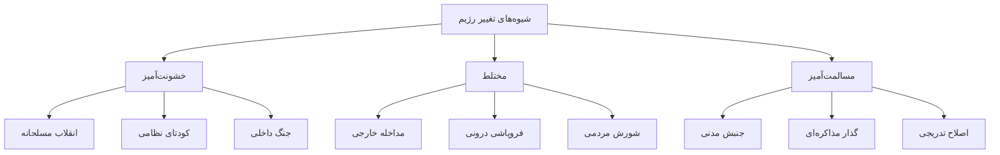

## **۲.۲. ماتریس تفصیلی شیوه‌ها**

| شیوه | سطح خشونت (۱-۵) | بازیگر اصلی | مدت زمان | عمق تغییر |
| --- | --- | --- | --- | --- |
| انقلاب اجتماعی | ۴ | توده‌ها | ماه‌ها تا سال‌ها | بسیار عمیق |
| کودتای نظامی | ۲ | نظامیان | ساعت‌ها تا روزها | سطحی-متوسط |
| جنگ داخلی | ۵ | گروه‌های مسلح | سال‌ها | متغیر |
| مداخله خارجی | ۴ | قدرت خارجی | متغیر | متغیر |
| جنبش مدنی | ۱ | توده‌ها | هفته‌ها تا ماه‌ها | متوسط-عمیق |
| گذار مذاکره‌ای | ۱ | نخبگان | ماه‌ها تا سال‌ها | متوسط |
| فروپاشی درونی | ۲ | بدون بازیگر مشخص | متغیر | عمیق |
| اصلاح از بالا | ۱ | رهبران رژیم | سال‌ها تا دهه‌ها | تدریجی |
| جدایی‌طلبی | ۳ | گروه قومی/منطقه‌ای | سال‌ها | تغییر دولت |

---

# **بخش سوم: تحلیل تفصیلی هر شیوه**

## **۳.۱. شیوه اول: انقلاب (Revolution)**

### **۳.۱.۱. تعریف آکادمیک**

> "تحول سریع، بنیادین و خشونت‌آمیز در ارزش‌های غالب جامعه، نهادهای سیاسی، ساختار اجتماعی، رهبری و سیاست‌ها و فعالیت‌های دولت"
>
>
> — Samuel Huntington, *Political Order in Changing Societies* (1968)
>

> "تغییر سریع و پایه‌ای دولت و ساختارهای طبقاتی یک جامعه که با شورش‌های طبقاتی از پایین همراه و تا حدی توسط آن‌ها پیش برده می‌شود"
>
>
> — Theda Skocpol, *States and Social Revolutions* (1979)
>

### **۳.۱.۲. انواع انقلاب**

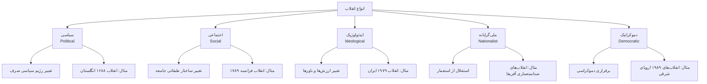

### **۳.۱.۳. نسل‌های نظریه انقلاب**

| نسل نظری | نظریه‌پرداز اصلی | تمرکز تحلیلی | متغیر کلیدی |
| --- | --- | --- | --- |
| **نسل اول** | Crane Brinton, Lyford Edwards | توصیف مراحل | روان‌شناسی توده |
| **نسل دوم** | Ted Gurr, James Davies | محرومیت نسبی | نارضایتی |
| **نسل سوم** | Theda Skocpol, Charles Tilly | ساختاری | فشار دولت، منابع |
| **نسل چهارم** | Jack Goldstone, Jeff Goodwin | ترکیبی | فرهنگ + ساختار + عاملیت |

### **۳.۱.۴. مدل ساختاری اسکاچپول**

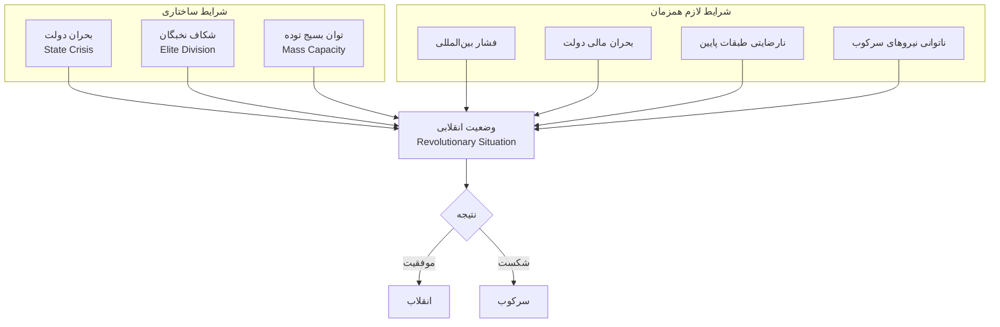

### **۳.۱.۵. نمونه‌های موفق تاریخی**

### **انقلاب فرانسه (۱۷۸۹)**

| ویژگی | توضیح |
| --- | --- |
| **علل** | بحران مالی پس از جنگ هفت‌ساله، نارضایتی بورژوازی، قحطی |
| **ایدئولوژی** | روشنگری، حقوق طبیعی |
| **پیامد** | سقوط سلطنت → ترور → ناپلئون → دموکراسی نهایی |

### **انقلاب روسیه (۱۹۱۷)**

| ویژگی | توضیح |
| --- | --- |
| **علل** | شکست در جنگ جهانی اول، بحران اقتصادی، ضعف تزار |
| **سازماندهی** | حزب پیشتاز لنینی (بلشویک‌ها) |
| **پیامد** | نظام کمونیستی ۷۰ ساله، جنگ سرد |

### **انقلاب کوبا (۱۹۵۹)**

| ویژگی | توضیح |
| --- | --- |
| **علل** | فساد و سرکوب رژیم باتیستا، نابرابری شدید |
| **استراتژی** | چریکی روستایی (فوکیسم) |
| **پیامد** | نظام سوسیالیستی، تنش با آمریکا |

### **انقلاب ایران (۱۹۷۹)**

| ویژگی | توضیح |
| --- | --- |
| **علل** | نارضایتی از غرب‌گرایی سریع، سرکوب ساواک |
| **سازماندهی** | نقش محوری روحانیت و مساجد |
| **پیامد** | جمهوری اسلامی، تغییر ژئوپلیتیک منطقه |

### **۳.۱.۶. پیامدهای انقلاب**

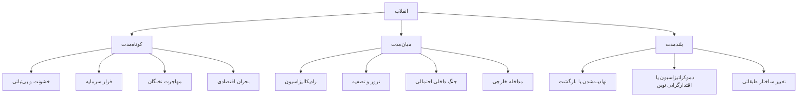

### **۳.۱.۷. گروه‌های طرفدار انقلاب**

| طیف ایدئولوژیک | گروه‌های نمونه | استدلال اصلی |
| --- | --- | --- |
| **چپ رادیکال** | مارکسیست-لنینیست‌ها، مائوئیست‌ها | انقلاب تنها راه براندازی سرمایه‌داری |
| **آنارشیست‌ها** | فدراسیون آنارشیستی | نابودی کامل دولت |
| **ملی‌گرایان رادیکال** | جنبش‌های ضداستعماری | آزادی ملی به هر قیمت |
| **اسلام‌گرایان انقلابی** | برخی جریانات | برقراری حکومت اسلامی |

### **۳.۱.۸. عوامل موفقیت و شکست**

**عوامل افزایش احتمال موفقیت:**

- ✅ بحران مالی شدید دولت
- ✅ شکست نظامی یا فشار ژئوپلیتیک
- ✅ شکاف در نخبگان حاکم
- ✅ از دست رفتن وفاداری نیروهای مسلح
- ✅ وجود ایدئولوژی بسیج‌کننده
- ✅ شبکه‌های سازماندهی قوی
- ✅ بسته بودن کانال‌های اصلاحی

**عوامل کاهش احتمال موفقیت:**

- ❌ دستگاه سرکوب کارآمد و وفادار
- ❌ حمایت بین‌المللی از رژیم
- ❌ منابع مالی مستقل (نفت)
- ❌ تفرقه در اپوزیسیون
- ❌ فقدان ایدئولوژی منسجم

---

## **۳.۲. شیوه دوم: کودتای نظامی (Military Coup d'État)**

### **۳.۲.۱. تعریف آکادمیک**

> "نفوذ و جایگزینی ناگهانی بخش کوچکی از دستگاه دولت توسط بخش دیگر همان دستگاه، با استفاده از ابزارها و روش‌های غیرقانونی"
>
>
> — Edward Luttwak, *Coup d'État: A Practical Handbook* (1968)
>

> "تلاش غیرقانونی و آشکار توسط نظامیان یا سایر نخبگان درون دستگاه دولت برای برکناری رهبران ملی موجود"
>
>
> — Jonathan Powell & Clayton Thyne (2011)
>

### **۳.۲.۲. انواع کودتا**

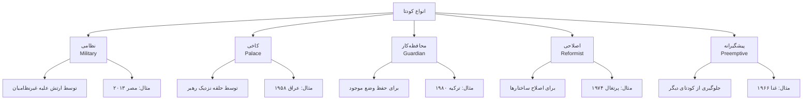

### **۳.۲.۳. شرایط موفقیت کودتا (مدل لوتواک)**

**پیش‌نیازها:**

1. استقلال اقتصادی کشور هدف (وابستگی کم به یک قدرت خارجی)
2. تمرکز قدرت در پایتخت
3. عدم وابستگی رژیم به پایگاه مردمی فعال
4. وجود واحدهای نظامی متمرکز

**عوامل تاکتیکی:**

1. سرعت عمل (کمتر از ۴۸ ساعت)
2. کنترل ارتباطات (رادیو، تلویزیون)
3. بی‌طرف‌سازی واحدهای وفادار
4. دستگیری رهبران کلیدی رژیم
5. ارائه فوری مشروعیت (بیانیه، نمایش قدرت)

### **۳.۲.۴. نمونه‌های تاریخی**

| کودتا | سال | ویژگی‌ها | پیامد |
| --- | --- | --- | --- |
| **ایران (۲۸ مرداد)** | ۱۹۵۳ | با حمایت CIA و MI6، علیه مصدق | ۲۵ سال دیکتاتوری، انقلاب ۵۷ |
| **شیلی** | ۱۹۷۳ | سرنگونی آلنده، حمایت آمریکا | ۱۷ سال دیکتاتوری پینوشه |
| **پرتغال** | ۱۹۷۴ | انقلاب گل میخک، افسران چپ‌گرا | دموکراتیزاسیون موفق |
| **مصر** | ۲۰۱۳ | علیه مرسی منتخب، رهبری سیسی | بازگشت اقتدارگرایی نظامی |

### **۳.۲.۵. آمار جهانی کودتاها (۱۹۵۰-۲۰۲۰)**

| شاخص | مقدار |
| --- | --- |
| تعداد کل تلاش‌های کودتا | ~۴۷۵ |
| کودتاهای موفق | ~۲۳۵ (حدود ۵۰%) |

**توزیع منطقه‌ای کودتاهای موفق:**

| منطقه | درصد |
| --- | --- |
| آفریقا | ۳۶% |
| آمریکای لاتین | ۲۵% |
| آسیا | ۱۸% |
| خاورمیانه | ۱۵% |
| سایر | ۶% |

> منبع: Powell & Thyne Coup Dataset
>

### **۳.۲.۶. پیامدهای کودتا**

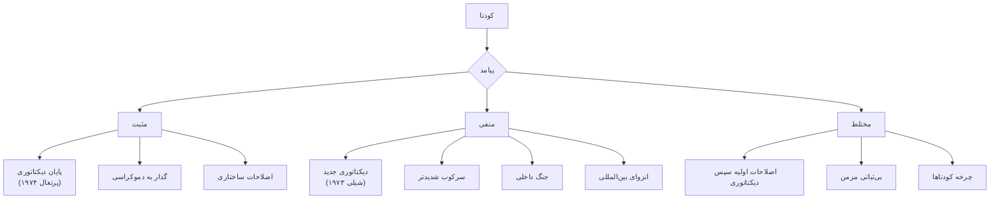

---

## **۳.۳. شیوه سوم: جنبش مقاومت مدنی غیرخشونت‌آمیز**

### **۳.۳.۱. تعریف و چارچوب نظری**

> "روشی برای مبارزه که در آن مردم غیرمسلح از طریق اعتصاب، تظاهرات، تحریم، نافرمانی مدنی و سایر اقدامات غیرخشونت‌آمیز علیه حاکمان مبارزه می‌کنند تا قدرت آنان را سلب کرده یا امتیاز بگیرند"
>
>
> — Gene Sharp, *The Politics of Nonviolent Action* (1973)
>

### **۳.۳.۲. نظریه قدرت ژین شارپ**

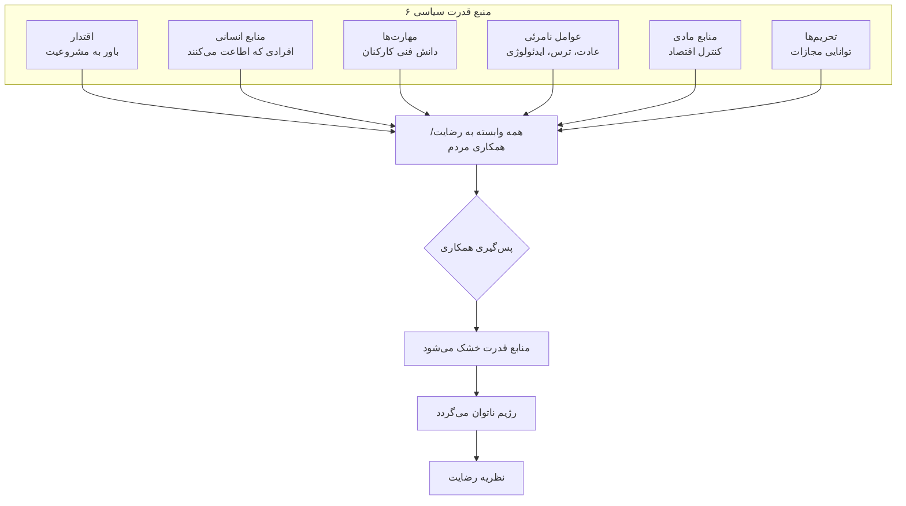

### **۳.۳.۳. ۱۹۸ روش غیرخشونت‌آمیز شارپ**

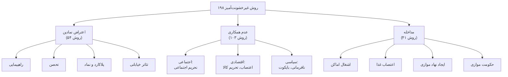

### **۳.۳.۴. یافته‌های پژوهش چنووث و استفان**

**تحلیل ۳۲۳ جنبش بین سال‌های ۱۹۰۰-۲۰۰۶:**

| نوع جنبش | نرخ موفقیت |
| --- | --- |
| جنبش‌های غیرخشونت‌آمیز | **۵۳%** |
| جنبش‌های خشونت‌آمیز | **۲۶%** |

**دلایل اثربخشی بیشتر جنبش‌های غیرخشن:**

1. مشارکت گسترده‌تر (موانع ورود کمتر)
2. جلب حمایت طیف‌های متنوع جامعه
3. افزایش احتمال ریزش در ارکان قدرت
4. مشروعیت بین‌المللی بیشتر
5. کاهش توجیه سرکوب

> قانون ۳.۵٪: اگر ۳.۵٪ جمعیت فعالانه در جنبش شرکت کنند، هیچ جنبشی شکست نخورده است.
>

### **۳.۳.۵. نمونه‌های موفق تاریخی**

| جنبش | دوره | ویژگی‌های کلیدی | پیامد |
| --- | --- | --- | --- |
| **استقلال هند** | ۱۹۱۵-۱۹۴۷ | رهبری گاندی، نمک‌سازی، تحریم | استقلال (با تجزیه) |
| **حقوق مدنی آمریکا** | ۱۹۵۴-۱۹۶۸ | رهبری کینگ، نافرمانی مدنی | قوانین حقوق مدنی |
| **همبستگی لهستان** | ۱۹۸۰-۱۹۸۹ | اعتصاب کارگری، نقش کلیسا | پایان کمونیسم |
| **انقلاب‌های ۱۹۸۹** | ۱۹۸۹ | انقلاب مخملی، دیوار برلین | فروپاشی بلوک شرق |
| **انقلاب‌های رنگی** | ۲۰۰۰-۲۰۰۵ | صربستان، گرجستان، اوکراین | نتایج متغیر |
| **بهار عربی** | ۲۰۱۰-۲۰۱۲ | تونس، مصر | موفقیت محدود (تونس) |

### **۳.۳.۶. مراحل جنبش غیرخشونت‌آمیز موفق**

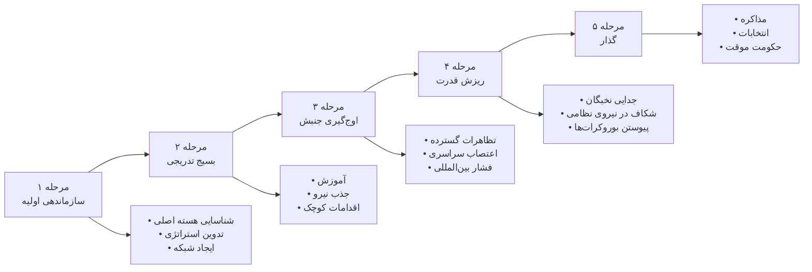

### **۳.۳.۷. پیامدها و خطرات**

| پیامدهای مثبت بالقوه | خطرات و چالش‌ها |
| --- | --- |
| ✅ گذار مسالمت‌آمیز به دموکراسی | ❌ سرکوب خشونت‌آمیز |
| ✅ حفظ زیرساخت‌ها و نهادها | ❌ فرسایش و خستگی جنبش |
| ✅ مشروعیت بین‌المللی | ❌ تفرقه داخلی |
| ✅ کاهش تلفات انسانی | ❌ مصادره توسط نخبگان |
| ✅ امکان آشتی ملی | ❌ بازگشت اقتدارگرایی |
| ✅ تقویت جامعه مدنی | ❌ انتظارات برآورده‌نشده |

---

## **۳.۴. شیوه چهارم: گذار مذاکره‌ای (Negotiated Transition)**

### **۳.۴.۱. تعریف و چارچوب**

> "فرآیندی که در آن نخبگان رژیم اقتدارگرا و نیروهای اپوزیسیون از طریق مذاکره و توافق، قواعد بازی سیاسی جدید را تعیین کرده و به نظام دموکراتیک گذار می‌کنند"
>
>
> — Guillermo O'Donnell & Philippe Schmitter, *Transitions from Authoritarian Rule* (1986)
>

### **۳.۴.۲. مراحل گذار (مدل اودانل و اشمیتر)**

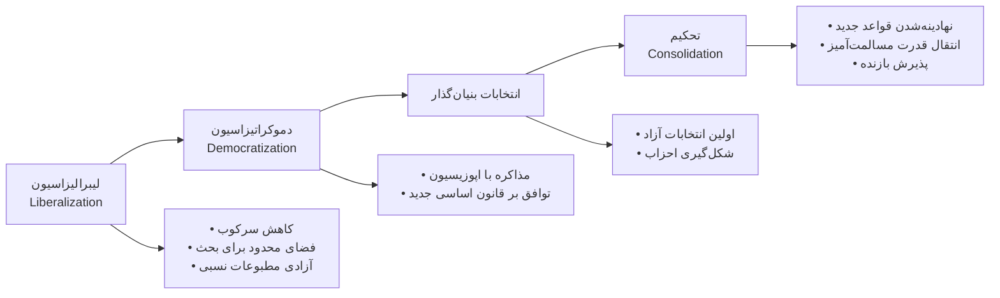

> نکته کلیدی: نقش «نرم‌خویان» (Softliners) در رژیم و «میانه‌روها» در اپوزیسیون
>

### **۳.۴.۳. انواع گذار مذاکره‌ای**

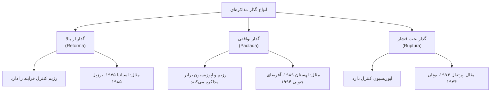

### **۳.۴.۴. نمونه‌های موفق**

| مورد | دوره | ویژگی‌ها | پیامد |
| --- | --- | --- | --- |
| **اسپانیا** | ۱۹۷۵-۱۹۷۸ | نقش خوان کارلوس، توافق مونکلوا، عفو متقابل | الگوی موفق، عضویت در اروپا |
| **لهستان** | ۱۹۸۹ | مذاکره میز گرد، نقش همبستگی و کلیسا | الگو برای اروپای شرقی |
| **آفریقای جنوبی** | ۱۹۹۰-۱۹۹۴ | مذاکره ماندلا-دکلرک، کمیسیون حقیقت | پایان آپارتاید |
| **برزیل** | ۱۹۷۴-۱۹۸۵ | گذار تدریجی نظامیان، قانون عفو | دموکراسی پایدار |
| **تونس** | ۲۰۱۱-۲۰۱۴ | گفتگوی ملی چهارجانبه، جایزه نوبل | تنها موفقیت بهار عربی (تا ۲۰۲۱) |

### **۳.۴.۵. عوامل موفقیت گذار مذاکره‌ای**

**در سطح رژیم:**

- ✅ وجود «نرم‌خویان» با انگیزه اصلاح
- ✅ درک هزینه‌های سرکوب مداوم
- ✅ تضمین امنیت نخبگان قدیم

**در سطح اپوزیسیون:**

- ✅ وحدت حداقلی بر سر گذار
- ✅ رهبری میانه‌رو و واقع‌بین
- ✅ پذیرش سازش موقت

**در سطح ساختاری:**

- ✅ فشار اقتصادی یا بین‌المللی کافی
- ✅ عدم قطبی‌شدگی شدید جامعه
- ✅ وجود نهادهای واسط (کلیسا، اتحادیه، دانشگاه)
- ✅ الگوهای منطقه‌ای موفق

### **۳.۴.۶. انتقادات به گذار مذاکره‌ای**

1. **دموکراسی «محدود» یا «قیّم‌دار»**
    - حفظ امتیازات نخبگان قدیم
    - قوانین عفو مانع عدالت
    - نفوذ نظامیان در سیاست
2. **مشکل عدالت انتقالی**
    - تنش بین صلح و عدالت
    - نارضایتی قربانیان
3. **عدم تغییر ساختارهای اقتصادی**
    - حفظ نابرابری
    - شکاف طبقاتی مستمر
4. **آسیب‌پذیری در برابر بازگشت**
    - ضعف نهادهای نوپا
    - ناامیدی توده‌ها

## **۳.۵. شیوه پنجم: جنگ داخلی (Civil War)**

### **۳.۵.۱. تعریف**

> "درگیری مسلحانه میان دولت و یک یا چند گروه سازمان‌یافته غیردولتی در داخل یک کشور که حداقل ۱۰۰۰ کشته در سال داشته باشد"
>
>
> — Correlates of War Project / Uppsala Conflict Data Program
>

> "منازعه مسلحانه داخلی که در آن حداقل یکی از طرفین دولت است و طرف مقابل به دنبال کسب قدرت، تغییر سیاست‌ها یا جدایی است"
>
>
> — James Fearon & David Laitin (2003)
>

### **۳.۵.۲. انواع جنگ داخلی**

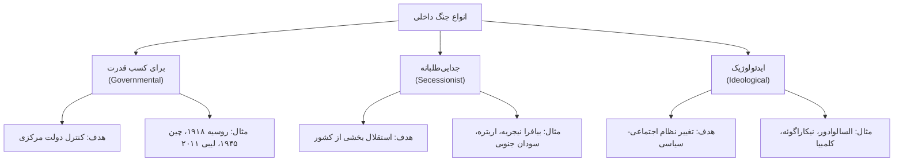

### **۳.۵.۳. نمونه‌های تاریخی**

| جنگ داخلی | دوره | ویژگی‌ها | پیامد |
| --- | --- | --- | --- |
| **اسپانیا** | ۱۹۳۶-۱۹۳۹ | فاشیست‌ها vs جمهوری‌خواهان، مداخله خارجی | ۳۶ سال دیکتاتوری فرانکو |
| **چین** | ۱۹۴۵-۱۹۴۹ | کمونیست‌ها vs ناسیونالیست‌ها | جمهوری خلق چین، تایوان |
| **نیکاراگوئه** | ۱۹۷۹-۱۹۹۰ | سانیدنیست‌ها، جنگ کنتراها | دموکراسی موقت |
| **سوریه** | ۲۰۱۱-کنون | جنگ چندجانبه، داعش، مداخله خارجی | ویرانی، بحران انسانی، بقای اسد |

### **۳.۵.۴. عوامل شروع جنگ داخلی (Fearon & Laitin 2003)**

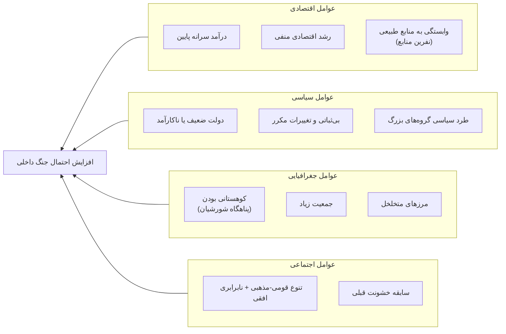

### **۳.۵.۵. پیامدهای جنگ داخلی**

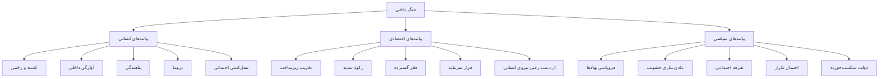

---

## **۳.۶. شیوه ششم: مداخله خارجی (Foreign Intervention)**

### **۳.۶.۱. تعریف و انواع**

> "اقدام یک یا چند دولت خارجی برای تغییر رژیم یک کشور دیگر از طریق ابزارهای نظامی، اقتصادی، سیاسی یا مخفی"
>
>
> — Lindsey O'Rourke, *Covert Regime Change* (2018)
>

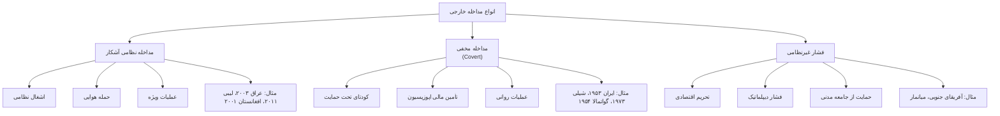

### **۳.۶.۲. نمونه‌های تاریخی**

| مداخله | سال | ویژگی‌ها | پیامد |
| --- | --- | --- | --- |
| **عراق** | ۲۰۰۳ | ادعای WMD، بدون مجوز سازمان ملل | هرج‌ومرج، داعش، بی‌ثباتی منطقه‌ای |
| **لیبی** | ۲۰۱۱ | منطقه پرواز ممنوع ناتو | جنگ داخلی مستمر، دولت‌های رقیب |
| **افغانستان** | ۲۰۰۱ | پاسخ به ۱۱ سپتامبر | بازگشت طالبان ۲۰۲۱، شکست دولت‌سازی |
| **گواتمالا** | ۱۹۵۴ | اقدام CIA، سرنگونی آربنز | ۳۶ سال جنگ داخلی، ۲۰۰،۰۰۰ کشته |

### **۳.۶.۳. ارزیابی اثربخشی**

**یافته‌های پژوهشی (Downes & Monten 2013):**

از ۱۰۰+ مداخله برای ترویج دموکراسی (۱۸۵۲-۲۰۰۴):

- تنها **۳۰%** به دموکراسی پایدار منجر شد
- موفقیت بیشتر در: اشغال طولانی + بازسازی + کشورهای توسعه‌یافته‌تر

**موارد موفق نادر:**

- آلمان و ژاپن پس از ۱۹۴۵ (اشغال طولانی، بازسازی عظیم)
- پاناما ۱۹۸۹ (کوچک، قبلاً دموکراتیک)

**موارد شکست:**

- عراق، افغانستان، لیبی، ویتنام، سومالی...

### **۳.۶.۴. استدلال‌های موافق و مخالف**

| استدلال‌های موافق (مشروط) | استدلال‌های مخالف |
| --- | --- |
| مداخله بشردوستانه در نسل‌کشی | نقض حاکمیت ملی |
| حمایت از مردم تحت ستم | امپریالیسم نوین |
| جلوگیری از تهدیدات بین‌المللی | انگیزه‌های خودخواهانه |
| مسئولیت حمایت (R2P) | پیامدهای ناخواسته |
|  | نابودی زیرساخت و تلفات غیرنظامی |
|  | شکست‌های مکرر در دولت‌سازی |

---

## **۳.۷. شیوه هفتم: فروپاشی درونی (Internal Collapse)**

### **۳.۷.۱. تعریف و مکانیسم**

> "از هم پاشیدن رژیم سیاسی بدون بازیگر خارجی مشخص یا جنبش سازمان‌یافته داخلی، به دلیل تضادهای درونی، ناکارآمدی سیستمی، یا بحران مشروعیت"
>

**مکانیسم‌ها:**

- بحران جانشینی
- انباشت تضادهای اقتصادی
- فساد سیستمی فلج‌کننده
- ناتوانی در انطباق با تغییرات
- شکاف فزاینده نخبگان

### **۳.۷.۲. تحلیل فروپاشی شوروی (۱۹۸۵-۱۹۹۱)**

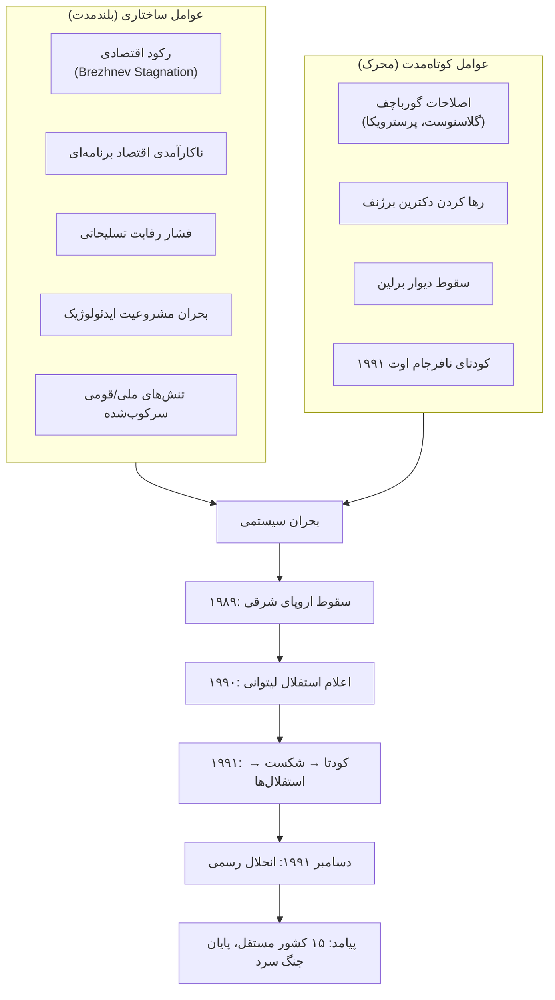

### **۳.۷.۳. سایر نمونه‌ها**

| مورد | علت اصلی | پیامد |
| --- | --- | --- |
| **یوگسلاوی** | مرگ تیتو + تنش قومی + بحران اقتصادی | جنگ‌های خونین، ۷ کشور |
| **چکسلواکی** | جدایی مسالمت‌آمیز پس از ۱۹۸۹ | دو کشور (طلاق مخملی) |
| **اتیوپی دِرگ** | جنگ داخلی + قحطی + پایان حمایت شوروی | فروپاشی ۱۹۹۱، استقلال اریتره |

---

## **۳.۸. شیوه هشتم: اصلاح از بالا (Reform from Above)**

### **۳.۸.۱. تعریف و انواع**

> "فرآیندی که در آن رهبران رژیم موجود، خود آغازگر تغییرات سیاسی بنیادین هستند، بدون فشار مستقیم و فوری از پایین یا بیرون"
>

**انواع:**

- اصلاحات لیبرالی تدریجی
- نوسازی از بالا
- دموکراتیزاسیون کنترل‌شده
- انقلاب از بالا (رادیکال)

### **۳.۸.۲. نمونه‌های تاریخی**

| مورد | دوره | ویژگی‌ها | پیامد |
| --- | --- | --- | --- |
| **ژاپن میجی** | ۱۸۶۸-۱۹۱۲ | نوسازی اقتصادی-نظامی، قانون اساسی ۱۸۸۹ | قدرت صنعتی-نظامی |
| **پروس/آلمان** | ۱۸۶۲-۱۸۹۰ | اصلاحات بیسمارک، اتحاد آلمان | قدرت بزرگ، دموکراسی ناقص |
| **چین** | ۱۹۷۸-کنون | درهای باز دنگ، اصلاحات اقتصادی بدون سیاسی | رشد عظیم، اقتدارگرایی پایدار |
| **عربستان** | ۲۰۱۷-کنون | اصلاحات اجتماعی MBS، چشم‌انداز ۲۰۳۰ | مدرنیزاسیون استبدادی |
| **شوروی** | ۱۹۸۵-۱۹۹۱ | گورباچف: گلاسنوست + پرسترویکا | فروپاشی ناخواسته (شکست) |

### **۳.۸.۳. معضل اصلاح‌طلب (Reformer's Dilemma)**

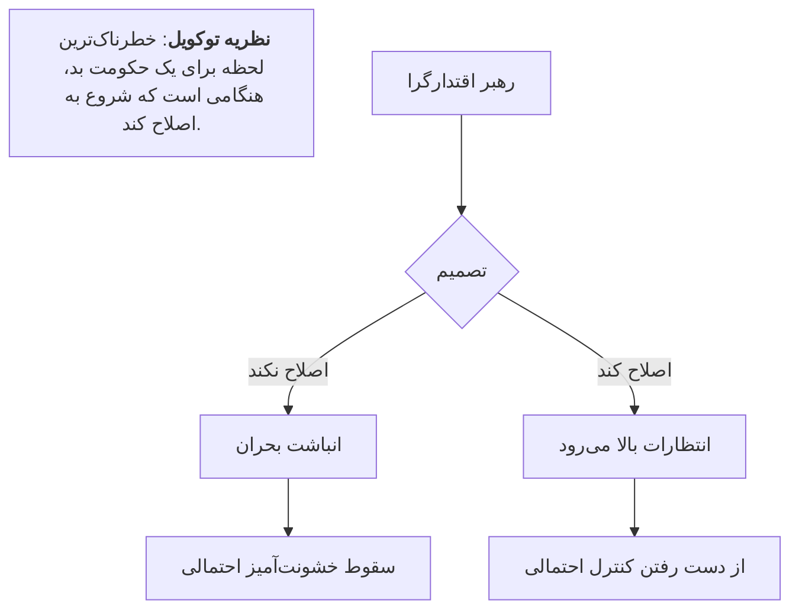

### **۳.۸.۴. منحنی J انتظارات**

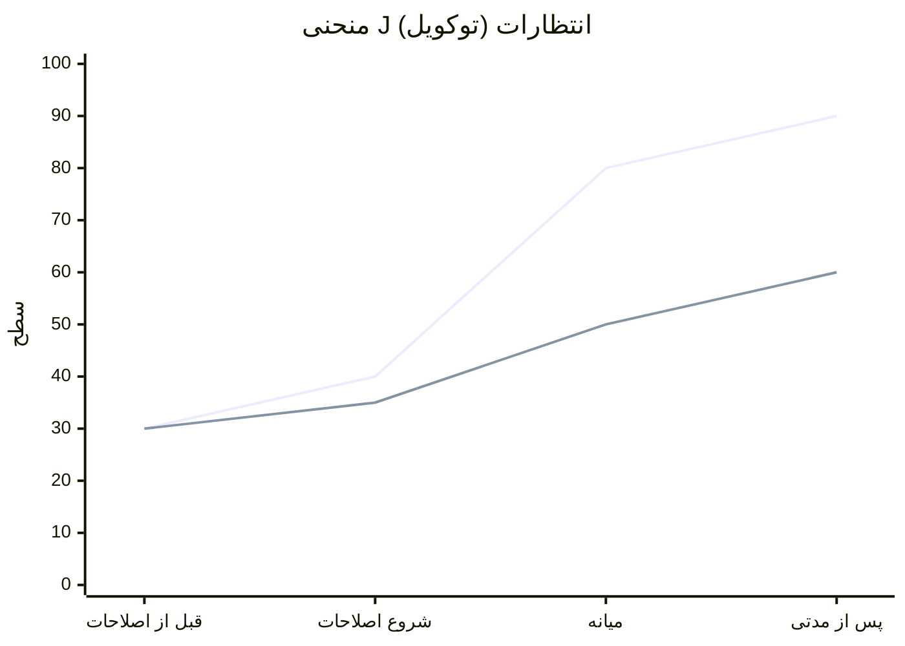

> نکته: شکاف بین انتظارات و واقعیت = پتانسیل انقلاب
>

### **۳.۸.۵. شرایط موفقیت و شکست**

**عوامل مساعد:**

- ✅ رهبری قوی و متعهد به اصلاح
- ✅ وحدت نسبی نخبگان حاکم
- ✅ منابع کافی (نفت، رشد اقتصادی)
- ✅ فقدان اپوزیسیون سازمان‌یافته قوی
- ✅ حمایت یا سکوت قدرت‌های خارجی

**عوامل شکست:**

- ❌ مقاومت محافظه‌کاران درون رژیم
- ❌ انتظارات فزاینده (منحنی J)
- ❌ سرعت نامناسب (خیلی سریع یا خیلی آهسته)
- ❌ بحران اقتصادی همزمان
- ❌ فشار بین‌المللی

---

## **۳.۹. شیوه نهم: جدایی‌طلبی و تجزیه (Secession)**

### **۳.۹.۱. تعریف و انواع**

> "خروج رسمی بخشی از سرزمین و جمعیت یک دولت برای تشکیل دولت مستقل جدید یا پیوستن به دولت دیگر"
>
>
> — Allen Buchanan, *Secession: The Morality of Political Divorce* (1991)
>

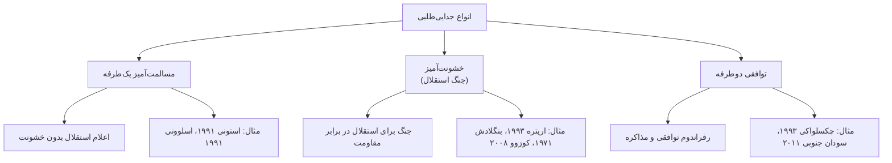

### **۳.۹.۲. نمونه‌های تاریخی**

| مورد | دوره | ویژگی‌ها | پیامد |
| --- | --- | --- | --- |
| **اریتره** | ۱۹۶۱-۱۹۹۳ | جنگ ۳۰ ساله، رفراندوم ۹۹.۸% | استقلال، دیکتاتوری افورقی |
| **بنگلادش** | ۱۹۷۱ | نسل‌کشی پاکستان، مداخله هند | استقلال، بی‌ثباتی طولانی |
| **چکسلواکی** | ۱۹۹۳ | طلاق مخملی، توافق نخبگان | دو کشور موفق، عضو EU |
| **سودان جنوبی** | ۲۰۱۱ | رفراندوم ۹۸%، حمایت بین‌المللی | استقلال، جنگ داخلی ۲۰۱۳ |
| **کوزوو** | ۲۰۰۸ | اعلام یک‌طرفه، مداخله ناتو ۱۹۹۹ | شبه‌دولت، عضویت محدود |
| **اسکاتلند** | ۲۰۱۴ | رفراندوم قانونی، ۴۵% موافق | باقی ماندن در بریتانیا |
| **کاتالونیا** | ۲۰۱۷ | رفراندوم یک‌طرفه، سرکوب | شکست، بحران سیاسی |

### **۳.۹.۳. عوامل موفقیت جدایی‌طلبی**

**شرایط ضروری:**

- ✅ هویت متمایز قوی (زبان، قومیت، مذهب، تاریخ)
- ✅ سرزمین مشخص و قابل دفاع
- ✅ توان اقتصادی حداقلی
- ✅ رهبری و سازماندهی

**شرایط مساعد:**

- ✅ ضعف دولت مرکزی یا بحران
- ✅ حمایت بین‌المللی (یا حداقل سکوت)
- ✅ قدرت نظامی کافی یا حامی خارجی
- ✅ سابقه خودمختاری یا استقلال
- ✅ نقض حقوق توسط دولت مرکزی

**موانع اصلی:**

- ❌ مخالفت قدرت‌های بزرگ
- ❌ سابقه مرزهای رسمی
- ❌ جمعیت مختلط
- ❌ ترس از اثر دومینویی
- ❌ منافع اقتصادی مشترک

---

# **بخش چهارم: نمودارهای مفهومی تطبیقی**

## **۴.۱. ماتریس مقایسه‌ای جامع**

| شیوه | خشونت (۱-۵) | سرعت (۱-۵) | مشارکت مردمی | عمق تغییر | موفقیت تاریخی | ثبات پس از آن |
| --- | --- | --- | --- | --- | --- | --- |
| انقلاب | ۴ | ۴ | بالا | عمیق | ~۴۰% | متغیر/کم |
| کودتا | ۲ | ۵ | ندارد | سطحی | ~۵۰% | کم |
| جنبش مدنی | ۱ | ۳ | بالا | متوسط-عمیق | ~۵۳% | نسبتاً بالا |
| گذار مذاکره‌ای | ۱ | ۲ | کم | متوسط | ~۶۰% | بالا |
| جنگ داخلی | ۵ | ۱ | متوسط | متغیر | ~۴۵% | بسیار کم |
| مداخله خارجی | ۴ | ۴ | ندارد | متغیر | ~۳۰% | کم |
| فروپاشی | ۲ | ۳ | متغیر | عمیق | - | کم |
| اصلاح از بالا | ۱ | ۱ | ندارد | تدریجی | ~۳۵% | متوسط |
| جدایی‌طلبی | ۳ | ۲ | متوسط | تغییر دولت | ~۴۰% | متغیر |

> توضیح: ۱=کم/آهسته، ۵=زیاد/سریع
>

## **۴.۲. نمودار تصمیم: کدام شیوه محتمل‌تر؟**

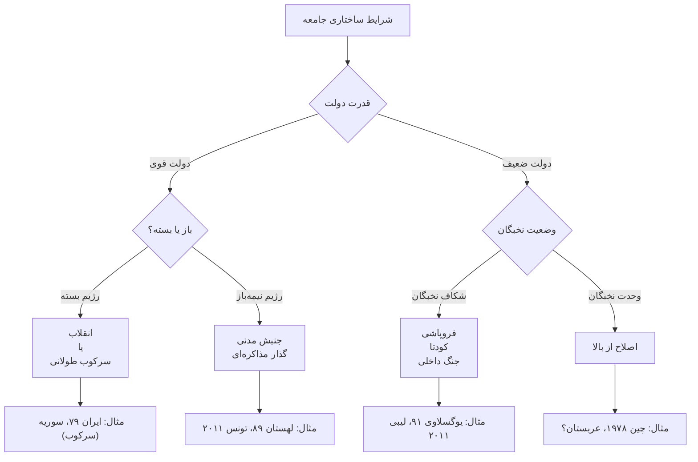

## **۴.۳. چرخه حیات رژیم‌ها**

```mermaid
xychart-beta
    title "چرخه حیات رژیم اقتدارگرا"
    x-axis ["تأسیس", "تحکیم", "اوج", "فرسودگی", "بحران"]
    y-axis "مشروعیت/ثبات" 0 --> 100
    line "مسیر رژیم" [20, 60, 85, 60, 25]
```

**نقاط آسیب‌پذیر اصلی:**

- بحران جانشینی رهبری
- شکست اقتصادی / بحران مالی
- شکست نظامی / فشار خارجی
- شکاف در ائتلاف حاکم
- خیزش نسل جدید با انتظارات متفاوت

## **۴.۴. نقشه دوبعدی شیوه‌ها**

```mermaid
quadrantChart
    title Regime Change Methods
    x-axis Low Violence --> High Violence
    y-axis Low Participation --> High Participation
    quadrant-1 Social Revolution
    quadrant-2 Civil Movement
    quadrant-3 Reform / Coup
    quadrant-4 Civil War / Intervention
    
    Civil Movement: [0.2, 0.85]
    Revolution: [0.7, 0.8]
    Negotiated Transition: [0.15, 0.4]
    Coup: [0.35, 0.15]
    Reform from Above: [0.1, 0.1]
    Civil War: [0.9, 0.5]
    Foreign Intervention: [0.85, 0.1]
```

---

```mermaid

flowchart TB
    subgraph بالا["مشارکت بالا"]
        direction LR
        A["جنبش مدنی<br/>خشونت: کم"] ~~~ B["انقلاب<br/>خشونت: بالا"]
    end
    
    subgraph پایین["مشارکت کم"]
        direction LR
        C["اصلاح از بالا<br/>کودتا<br/>خشونت: کم"] ~~~ D["جنگ داخلی<br/>مداخله<br/>خشونت: بالا"]
    end
    
                   **بالا ~~~ پایین**
```

## **۴.۵. پیامدهای احتمالی تغییر رژیم**

```mermaid

flowchart TD
    A[تغییر رژیم] --> B{نتیجه نهایی}
    
    B --> C["دموکراسی پایدار"]
    B --> D["اقتدارگرای جدید"]
    B --> E["هرج‌ومرج / دولت شکست‌خورده"]
    
    C --> C1["شرایط مساعد:<br/>• سابقه دموکراتیک<br/>• طبقه متوسط قوی<br/>• همسایگان دموکرات<br/>• توسعه اقتصادی"]
    C --> C2["مثال: لهستان ۱۹۸۹، اسپانیا ۱۹۷۵"]
    
    D --> D1["شرایط مساعد:<br/>• نخبگان منسجم<br/>• منابع (نفت)<br/>• حمایت خارجی<br/>• فقدان جایگزین"]
    D --> D2["مثال: مصر ۲۰۱۳، چین ۱۹۸۹"]
    
    E --> E1["شرایط مساعد:<br/>• شکاف عمیق قومی<br/>• دولت ضعیف سابق<br/>• مداخله خارجی<br/>• فقدان توافق"]
    E --> E2["مثال: لیبی ۲۰۱۱، سومالی ۱۹۹۱"]
```

---

# **بخش پنجم: تحلیل تطبیقی عوامل زمینه‌ای**

## **۵.۱. عوامل ساختاری تأثیرگذار**

### **عوامل اقتصادی**

| عامل | تأثیر |
| --- | --- |
| **سطح توسعه (GDP سرانه)** | ثروتمندتر → گذار مسالمت‌آمیز محتمل‌تر |
| **وابستگی به منابع طبیعی** | درآمد نفتی → تقویت رژیم، سرکوب آسان‌تر |
| **بحران اقتصادی** | محرک اصلی نارضایتی |
| **ساختار طبقاتی** | طبقه متوسط قوی → مطالبه دموکراسی |

> منبع: Ross (2001): نفت مانع دموکراتیزاسیون
>

### **عوامل اجتماعی**

| عامل | تأثیر |
| --- | --- |
| **تنوع قومی-مذهبی** | تنوع + نابرابری افقی → خطر جنگ/جدایی |
| **شهرنشینی** | شهرنشینی بالا → بسیج آسان‌تر |
| **سواد و تحصیلات** | تحصیلات بالا → مطالبات سیاسی بیشتر |
| **جمعیت جوان (Youth Bulge)** | جوان بیکار → پتانسیل بی‌ثباتی |

### **عوامل سیاسی-نهادی**

| عامل | تأثیر |
| --- | --- |
| **نوع رژیم اقتدارگرا** | شخصی: آسیب‌پذیرتر / تک‌حزبی: مقاوم‌تر |
| **قدرت دستگاه سرکوب** | سرکوب کارآمد → مانع جنبش‌ها |
| **وحدت یا شکاف نخبگان** | شکاف → فرصت برای تغییر |
| **سابقه دموکراتیک** | سابقه مثبت → گذار آسان‌تر |

### **عوامل بین‌المللی**

| عامل | تأثیر |
| --- | --- |
| **موقعیت ژئوپلیتیک** | همسایگی با قدرت بزرگ → محدودیت یا فرصت |
| **اثر سرایت (Diffusion)** | انقلاب‌های همسایه → الهام‌بخشی |
| **حمایت خارجی** | از رژیم → مقاومت / از اپوزیسیون → شانس بیشتر |
| **فشار بین‌المللی** | تأثیر متغیر، اغلب محدود بدون شرایط داخلی |

## **۵.۲. مدل تلفیقی عوامل**

```mermaid

flowchart TD
    subgraph ساختار["فشارهای ساختاری (بلندمدت)"]
        A1[اقتصادی]
        A2[جمعیتی]
        A3[بین‌المللی]
    end
    
    subgraph محرک["محرک‌های کوتاه‌مدت"]
        B1[بحران مالی]
        B2[سرکوب وحشیانه]
        B3[تقلب انتخاباتی]
        B4[مرگ رهبر]
    end
    
    subgraph فرصت["فرصت‌های سیاسی"]
        C1[شکاف نخبگان]
        C2[تغییر رهبری]
        C3[فشار خارجی]
    end
    
    subgraph عاملیت["عاملیت و رهبری"]
        D1[سازماندهی اپوزیسیون]
        D2[انتخاب تاکتیک]
        D3[استراتژی]
    end
    
    ساختار --> E["وضعیت انقلابی /<br/>بحران مشروعیت"]
    محرک --> E
    فرصت --> E
    عاملیت --> E
    
    E --> F{نتیجه}
    F --> G[سرکوب]
    F --> H[گذار]
    F --> I[انقلاب]
    F --> J[فروپاشی]
```

## **۵.۳. تحلیل تطبیقی: تونس vs مصر**

| عامل | تونس ✓ | مصر ✗ |
| --- | --- | --- |
| **نقش ارتش** | کوچک، حرفه‌ای، بدون منافع اقتصادی | بزرگ با منافع اقتصادی گسترده |
| **تنوع اجتماعی** | نسبتاً همگن، طبقه متوسط قوی‌تر | شکاف اسلام‌گرا/سکولار عمیق |
| **جامعه مدنی** | اتحادیه کارگری قوی (UGTT) | ضعیف‌تر، سرکوب طولانی‌تر |
| **رهبری اپوزیسیون** | میانه‌روها غالب، توافق چهارجانبه | اخوان قوی اما بدون تجربه |
| **فشار خارجی** | کمتر استراتژیک برای غرب | نقش عربستان و امارات |
| **نتیجه** | دموکراسی (تا ۲۰۲۱) | کودتا ۲۰۱۳، بازگشت اقتدارگرایی |

> درس کلیدی: عوامل ساختاری (نقش ارتش، جامعه مدنی) + عاملیت (توافق نخبگان) هر دو ضروری‌اند
>

## **۵.۴. عوامل تحکیم دموکراسی (Linz & Stepan 1996)**

> دموکراسی «تحکیم‌شده»: وقتی دموکراسی «تنها بازی در شهر» باشد
>

**پنج عرصه تحکیم:**

1. **جامعه مدنی آزاد و فعال**
    - رسانه‌های مستقل
    - NGOها و انجمن‌ها
    - آزادی بیان و تجمع
2. **جامعه سیاسی نهادینه**
    - احزاب سیاسی پایدار
    - انتخابات منظم و آزاد
    - پارلمان کارآمد
3. **حاکمیت قانون**
    - قوه قضائیه مستقل
    - قانون اساسی محترم
    - حقوق اقلیت‌ها
4. **دستگاه دولتی کارآمد**
    - بوروکراسی حرفه‌ای
    - کنترل دموکراتیک بر ارتش
    - ظرفیت مالیاتی
5. **جامعه اقتصادی نهادینه**
    - بازار تنظیم‌شده
    - حقوق مالکیت
    - رفاه حداقلی

---

# **بخش ششم: نظریه‌پردازان، مکاتب و گروه‌های طرفدار**

## **۶.۱. نقشه نظریه‌پردازان اصلی**

### **انقلاب**

| نظریه‌پرداز | رویکرد | اثر اصلی |
| --- | --- | --- |
| **Karl Marx** | طبقاتی | *The Communist Manifesto* |
| **Alexis de Tocqueville** | انتظارات فزاینده | *The Old Regime and the Revolution* |
| **Crane Brinton** | آناتومی انقلاب | *The Anatomy of Revolution* (1938) |
| **Theda Skocpol** | ساختاری-تاریخی | *States and Social Revolutions* (1979) |
| **Charles Tilly** | بسیج منابع | *From Mobilization to Revolution* (1978) |
| **Jack Goldstone** | جمعیت و بحران مالی | *Revolution and Rebellion* (1991) |
| **Jeff Goodwin** | دولت و انقلاب | *No Other Way Out* (2001) |
| **John Foran** | فرهنگ و انقلاب | *Taking Power* (2005) |

### **گذار دموکراتیک**

| نظریه‌پرداز | رویکرد | اثر اصلی |
| --- | --- | --- |
| **Juan Linz** | فروپاشی دموکراسی، تحکیم | *The Breakdown of Democratic Regimes* |
| **Alfred Stepan** | نقش ارتش، عرصه‌های تحکیم | *Rethinking Military Politics* |
| **Guillermo O'Donnell** | گذار از اقتدارگرایی | *Transitions from Authoritarian Rule* |
| **Philippe Schmitter** | مدل‌های گذار | *Transitions from Authoritarian Rule* |
| **Samuel Huntington** | موج سوم دموکراتیزاسیون | *The Third Wave* (1991) |
| **Larry Diamond** | دموکراسی انتخاباتی vs لیبرال | *Developing Democracy* (1999) |
| **Adam Przeworski** | انتخاب عقلانی در گذار | *Democracy and the Market* (1991) |

### **مقاومت غیرخشونت‌آمیز**

| نظریه‌پرداز | رویکرد | اثر اصلی |
| --- | --- | --- |
| **Mahatma Gandhi** | ساتیاگراها، آهیمسا | عمل و نوشته‌های متعدد |
| **Gene Sharp** | ۱۹۸ روش، نظریه قدرت | *The Politics of Nonviolent Action* (1973) |
| **Erica Chenoweth** | تحلیل کمّی اثربخشی | *Why Civil Resistance Works* (2011) |
| **Maria Stephan** | همکار چنووث | *Why Civil Resistance Works* (2011) |
| **Peter Ackerman** | جنبش‌های استراتژیک | *A Force More Powerful* (2000) |
| **Kurt Schock** | جنبش‌های ضداستبدادی | *Unarmed Insurrections* (2005) |

### **کودتا و ارتش**

| نظریه‌پرداز | رویکرد | اثر اصلی |
| --- | --- | --- |
| **Edward Luttwak** | تاکتیک کودتا | *Coup d'État: A Practical Handbook* (1968) |
| **Samuel Finer** | ارتش و سیاست | *The Man on Horseback* (1962) |
| **Eric Nordlinger** | سربازان در سیاست | *Soldiers in Politics* (1977) |
| **Jonathan Powell** | پایگاه داده کودتا | Powell-Thyne Coup Dataset |
| **Naunihal Singh** | روان‌شناسی کودتا | *Seizing Power* (2014) |

### **جنگ داخلی و خشونت سیاسی**

| نظریه‌پرداز | رویکرد | اثر اصلی |
| --- | --- | --- |
| **James Fearon** | علل جنگ داخلی | "Ethnicity, Insurgency, and Civil War" (2003) |
| **David Laitin** | قومیت و درگیری | همکار Fearon |
| **Paul Collier** | اقتصاد سیاسی جنگ | "Greed and Grievance" (2004) |
| **Stathis Kalyvas** | منطق خشونت | *The Logic of Violence in Civil War* (2006) |
| **Barbara Walter** | پایان جنگ داخلی | *Committing to Peace* (2002) |

### **اقتدارگرایی و پایداری رژیم**

| نظریه‌پرداز | رویکرد | اثر اصلی |
| --- | --- | --- |
| **Steven Levitsky** | اقتدارگرایی رقابتی | *Competitive Authoritarianism* (2010) |
| **Lucan Way** | همکار Levitsky | *Competitive Authoritarianism* (2010) |
| **Barbara Geddes** | انواع رژیم اقتدارگرا | *How Dictatorships Work* (2018) |
| **Milan Svolik** | سیاست اقتدارگرا | *The Politics of Authoritarian Rule* (2012) |
| **Jennifer Gandhi** | نهادها در دیکتاتوری | *Political Institutions under Dictatorship* (2008) |

### **مداخله خارجی**

| نظریه‌پرداز | رویکرد | اثر اصلی |
| --- | --- | --- |
| **Lindsey O'Rourke** | تغییر رژیم پنهان | *Covert Regime Change* (2018) |
| **Alexander Downes** | پیامدهای مداخله | *Catastrophic Success* (2021) |
| **John Owen** | تحمیل نهادها | *The Clash of Ideas in World Politics* (2010) |

## **۶.۲. مکاتب فکری اصلی**

### **۱. مکتب ساختارگرا (Structuralist)**

| ویژگی | توضیح |
| --- | --- |
| **تأکید بر** | شرایط عینی، طبقات، دولت، نظام بین‌الملل |
| **نمایندگان** | Skocpol, Tilly, Moore |
| **نقد** | نادیده‌گرفتن عاملیت، ایدئولوژی، رهبری |

### **۲. مکتب انتخاب عقلانی (Rational Choice)**

| ویژگی | توضیح |
| --- | --- |
| **تأکید بر** | محاسبات هزینه-فایده بازیگران |
| **نمایندگان** | Przeworski, Acemoglu, Bueno de Mesquita |
| **نقد** | ساده‌سازی انگیزه‌ها، نادیده‌گرفتن فرهنگ |

### **۳. مکتب نهادگرا (Institutionalist)**

| ویژگی | توضیح |
| --- | --- |
| **تأکید بر** | نقش نهادها در شکل‌دهی رفتار |
| **نمایندگان** | Linz, Stepan, North |
| **نقد** | کم‌توجهی به منابع قدرت غیررسمی |

### **۴. مکتب فرهنگی-ایدئولوژیک (Culturalist)**

| ویژگی | توضیح |
| --- | --- |
| **تأکید بر** | ارزش‌ها، باورها، فریم‌ها، روایت‌ها |
| **نمایندگان** | Foran, Goldstone (نسل چهارم), Snow |
| **نقد** | دشواری سنجش، تبیین‌های پسینی |

### **۵. مکتب بسیج منابع (Resource Mobilization)**

| ویژگی | توضیح |
| --- | --- |
| **تأکید بر** | سازماندهی، منابع، فرصت‌های سیاسی |
| **نمایندگان** | McCarthy, Zald, McAdam, Tarrow |
| **نقد** | کم‌توجهی به نارضایتی و احساسات |

### **۶. مکتب تلفیقی (Synthetic)**

| ویژگی | توضیح |
| --- | --- |
| **تأکید بر** | ترکیب ساختار، فرهنگ، عاملیت |
| **نمایندگان** | Goldstone (نسل چهارم), Goodwin, Foran |
| **مزیت** | جامعیت بیشتر |
| **چالش** | پیچیدگی نظری |

## **۶.۳. گروه‌های سیاسی و موضع آنها**

### **چپ رادیکال / مارکسیست**

| ویژگی | توضیح |
| --- | --- |
| **شیوه ترجیحی** | انقلاب اجتماعی |
| **استدلال** | سرمایه‌داری اصلاح‌پذیر نیست، دولت ابزار طبقه حاکم |
| **نمونه** | احزاب کمونیست، جنبش‌های مائوئیست، FARC (سابق) |
| **نقد به سایر شیوه‌ها** | اصلاحات «فریب بورژوایی» |

### **سوسیال‌دموکرات / چپ میانه**

| ویژگی | توضیح |
| --- | --- |
| **شیوه ترجیحی** | اصلاحات تدریجی، جنبش مدنی، گذار مذاکره‌ای |
| **استدلال** | تغییر از درون سیستم ممکن و کم‌هزینه‌تر |
| **نمونه** | احزاب سوسیالیست اروپا، Labour، SPD |
| **نقد به انقلاب** | خشونت ضدتولیدی، دیکتاتوری انقلابی |

### **لیبرال‌دموکرات**

| ویژگی | توضیح |
| --- | --- |
| **شیوه ترجیحی** | گذار مذاکره‌ای، جنبش مدنی، اصلاحات |
| **استدلال** | حقوق فردی، قانون، تغییر مسالمت‌آمیز |
| **نمونه** | احزاب لیبرال، جنبش‌های حقوق بشر |
| **نکته** | گاهی حمایت از مداخله «بشردوستانه» |

### **محافظه‌کار سنتی**

| ویژگی | توضیح |
| --- | --- |
| **شیوه ترجیحی** | اصلاح از بالا، تغییر تدریجی، حفظ نظم |
| **استدلال** | ثبات ارزش دارد، تغییر سریع خطرناک |
| **نمونه** | احزاب محافظه‌کار اروپا، تفکر برکی |
| **نقد به انقلاب** | ویرانگر، منجر به استبداد جدید |

### **نئوکانسرواتیو / لیبرال مداخله‌گرا**

| ویژگی | توضیح |
| --- | --- |
| **شیوه ترجیحی** | مداخله خارجی برای ترویج دموکراسی |
| **استدلال** | برخی رژیم‌ها از درون تغییر نمی‌کنند، منافع امنیتی |
| **نمونه** | نئوکان‌های آمریکایی (دوره بوش) |
| **نقد** | امپریالیسم، پیامدهای ناخواسته (عراق، لیبی) |

### **ملی‌گرای رادیکال / ضداستعماری**

| ویژگی | توضیح |
| --- | --- |
| **شیوه ترجیحی** | انقلاب ملی، جنگ رهایی‌بخش، جدایی‌طلبی |
| **استدلال** | آزادی ملی مقدس، استعمارگر اصلاح نمی‌کند |
| **نمونه** | FLN الجزایر، ANC (دوره مبارزه)، جنبش‌های کردی |
| **متن کلیدی** | Frantz Fanon, *The Wretched of the Earth* |

### **اسلام‌گرای سیاسی**

| طیف | شیوه | نمونه |
| --- | --- | --- |
| **اصلاح‌طلب** | مشارکت در انتخابات | حزب عدالت ترکیه، النهضه تونس |
| **انقلابی** | انقلاب اسلامی | خط امام |
| **جهادی** | جهاد مسلحانه | القاعده، داعش |

### **آنارشیست**

| طیف | شیوه | هدف |
| --- | --- | --- |
| **مسالمت‌جو** | اقدام مستقیم غیرخشن، جوامع جایگزین | نابودی دولت نه تصرف آن |
| **شورشی** | انقلاب ضددولتی | نابودی دولت |
| **نمونه** | CNT اسپانیا، جنبش‌های آنارشیستی معاصر |  |

## **۶.۴. نهادها و سازمان‌های مرتبط**

### **نهادهای آکادمیک و پژوهشی**

| نهاد | حوزه فعالیت |
| --- | --- |
| **Albert Einstein Institution** (بوستون) | تحقیق و ترویج مقاومت غیرخشونت‌آمیز |
| **ICNC** (International Center on Nonviolent Conflict) | آموزش و پژوهش جنبش‌های مدنی |
| **V-Dem Institute** (گوتنبرگ) | پایگاه داده دموکراسی |
| **Freedom House** | رتبه‌بندی آزادی جهانی |
| **Polity Project** (CSP) | داده‌های طولی نوع رژیم |
| **UCDP** (Uppsala) | داده‌های جنگ داخلی و خشونت |
| **Correlates of War Project** | داده‌های جنگ و منازعه |

### **نهادهای حقوق بشری و نظارتی**

- Amnesty International
- Human Rights Watch
- International Crisis Group
- Reporters Without Borders
- CIVICUS

### **نهادهای ترویج دموکراسی (بحث‌برانگیز)**

| نهاد | کشور |
| --- | --- |
| **NED** (National Endowment for Democracy) | آمریکا |
| **USAID Office of Democracy** | آمریکا |
| **German Stiftungen** (فریدریش ابرت، کنراد آدنائر...) | آلمان |
| **Westminster Foundation** | بریتانیا |
| **European Endowment for Democracy** | اتحادیه اروپا |

> ⚠️ نکته: منتقدان این نهادها را ابزار نفوذ می‌دانند
>

---

# **بخش هفتم: موضوعات نوظهور**

## **۷.۱. فناوری و تغییر رژیم**

### **نقش شبکه‌های اجتماعی**

**مزایا برای جنبش‌ها:**

- تسهیل ارتباط و هماهنگی
- کاهش هزینه بسیج
- گسترش سریع اطلاعات
- مستندسازی سرکوب

**معایب و چالش‌ها:**

- پیوندهای ضعیف (Weak Ties)
- فقدان ساختار سازمانی
- آسیب‌پذیری در برابر نظارت
- اطلاعات کاذب

### **سرکوب دیجیتال (Digital Authoritarianism)**

```mermaid
flowchart TD
    A[سرکوب دیجیتال] --> B[نظارت گسترده]
    A --> C[شناسایی چهره]
    A --> D[قطع اینترنت]
    A --> E[ترول‌فارم‌ها]
    A --> F[صادرات فناوری]
    
    B --> B1["چین: سیستم اعتبار اجتماعی"]
    C --> C1[ردیابی معترضان]
    D --> D1[ایران، میانمار، بلاروس]
    E --> E1[اطلاعات کاذب، پروپاگاندا]
    F --> F1[چین به آفریقا و آسیا]

```

### **هوش مصنوعی و آینده**

- پیش‌بینی اعتراضات توسط دولت‌ها
- Deepfake و جنگ اطلاعاتی
- ابزارهای رمزنگاری برای فعالان

> منابع کلیدی:
>
> - Zeynep Tufekci, *Twitter and Tear Gas* (2017)
> - Steven Feldstein, *The Rise of Digital Repression* (2021)

## **۷.۲. واپس‌گرایی دموکراتیک (Democratic Backsliding)**

### **پدیده جدید: فروپاشی دموکراسی «از درون»**

- نه کودتای کلاسیک، بلکه فرسایش تدریجی
- رهبران منتخب که دموکراسی را تخریب می‌کنند

### **نمونه‌ها**

| کشور | رهبر | وضعیت |
| --- | --- | --- |
| مجارستان | اوربان | اقتدارگرایی رقابتی |
| ترکیه | اردوغان | اقتدارگرایی رقابتی |
| لهستان | PiS | تضعیف قوه قضائیه |
| ونزوئلا | چاوز/مادورو | اقتدارگرایی کامل |
| هند | مودی | مورد بحث |
| آمریکا | ترامپ | مورد بحث |

### **مکانیسم‌های واپس‌گرایی**

```mermaid

flowchart TD
    A[رهبر پوپولیست منتخب] --> B[تضعیف قوه قضائیه]
    A --> C[کنترل رسانه‌ها]
    A --> D[تغییر قوانین انتخاباتی]
    A --> E[حمله به جامعه مدنی]
    A --> F[قطبی‌سازی جامعه]
    
    B --> G[اقتدارگرایی رقابتی]
    C --> G
    D --> G
    E --> G
    F --> G
    
    G --> H[اقتدارگرایی کامل؟]
```

> منابع کلیدی:
>
> - Levitsky & Ziblatt, *How Democracies Die* (2018)
> - Lührmann & Lindberg, "A Third Wave of Autocratization" (2019)

## **۷.۳. اقتدارگرایی صادراتی و شبکه‌ای**

### **همکاری بین رژیم‌های اقتدارگرا**

- اشتراک تجربیات سرکوب
- حمایت متقابل در سازمان‌های بین‌المللی
- مقابله مشترک با فشار غرب

### **نقش چین و روسیه**

| قدرت | استراتژی |
| --- | --- |
| **چین** | مدل «توسعه بدون دموکراسی»، صادرات فناوری نظارت |
| **روسیه** | بی‌ثبات‌سازی دموکراسی‌ها، حمایت از رژیم‌های متحد |
| **هر دو** | وتو در سازمان ملل علیه مداخلات |

> منبع: Alexander Cooley, Authoritarianism Goes Global (2015)
>

## **۷.۴. جنبش‌های نسل جدید**

### **ویژگی‌های جنبش‌های اخیر**

- افقی و بدون رهبر (Leaderless)
- شبکه‌ای و غیرمتمرکز
- ترکیب مطالبات (اقتصادی + سیاسی + هویتی)
- استفاده از نمادها و میم‌ها
- پیوند جهانی (همبستگی بین‌المللی)

### **نمونه‌های اخیر**

| جنبش | سال | ویژگی خاص |
| --- | --- | --- |
| شیلی | ۲۰۱۹ | اعتراض به نابرابری |
| هنگ‌کنگ | ۲۰۱۹-۲۰ | "Be Water" |
| بلاروس | ۲۰۲۰ | رهبری زنان |
| میانمار | ۲۰۲۱ | CDM گسترده |
| ایران | ۲۰۲۲ | زن، زندگی، آزادی |
| اسرائیل | ۲۰۲۳ | ضد اصلاحات قضایی |

### **چالش‌های جنبش‌های بدون رهبر**

- فقدان رهبری: قدرت یا ضعف؟
- دشواری مذاکره بدون نماینده
- پایداری و خستگی جنبش

## **۷.۵. جنسیت و تغییر رژیم**

### **نقش زنان در جنبش‌ها**

- تاریخاً نادیده گرفته شده
- پژوهش‌های جدید: نقش محوری زنان در موفقیت

### **یافته‌های چنووث**

> جنبش‌هایی با مشارکت بالای زنان موفق‌ترند
>

### **نمونه‌های برجسته**

| جنبش | سال | نقش زنان |
| --- | --- | --- |
| سودان | ۲۰۱۹ | «کانداکه» - زنان در خط مقدم |
| بلاروس | ۲۰۲۰ | سه زن رهبر اپوزیسیون |
| ایران | ۲۰۲۲ | «زن، زندگی، آزادی» |
| لهستان | ۲۰۲۰ | اعتراض به قانون سقط جنین |

---

# **بخش هشتم: جمع‌بندی نهایی**

## **۸.۱. ده درس کلیدی**

1. **هیچ شیوه‌ای تضمین‌شده نیست**
    - همه شیوه‌ها می‌توانند موفق شوند یا شکست بخورند
2. **زمینه همه‌چیز است**
    - موفقیت به تناسب شیوه با شرایط بستگی دارد
3. **جنبش‌های غیرخشونت‌آمیز مؤثرترند**
    - نرخ موفقیت ۵۳% در مقابل ۲۶%
4. **شکاف در نخبگان حیاتی است**
    - تقریباً در همه شیوه‌ها شرط لازم است
5. **تغییر رژیم آسان‌تر از دموکراتیزاسیون پایدار است**
    - سرنگونی اول کار است؛ ساختن دشوارتر
6. **مداخله خارجی به‌ندرت موفق است**
    - بدون شرایط داخلی مساعد، ناپایدار است
7. **خشونت هزینه‌های بلندمدت دارد**
    - انتقام، تروما، نهادهای ضعیف
8. **توافق نخبگان برای تحکیم ضروری است**
    - بدون توافق بر «قواعد بازی»، بازگشت محتمل
9. **عاملیت مهم است**
    - رهبری، استراتژی، تصمیمات در لحظات بحرانی
10. **دموکراسی به زمان نیاز دارد**
    - نهادینه‌شدن فرآیندی نسلی است

## **۸.۲. جدول جمع‌بندی نهایی**

| شیوه | خشونت | عمق | موفقیت | ثبات | بهترین شرایط |
| --- | --- | --- | --- | --- | --- |
| انقلاب | بالا | عمیق | ~۴۰% | کم-متوسط | بحران عمیق، شکاف نخبگان |
| کودتا | کم-متوسط | سطحی | ~۵۰% | کم | رژیم ضعیف، ارتش ناراضی |
| جنبش مدنی | کم | متوسط-عمیق | ~۵۳% | بالا | فضای نیمه‌باز، جامعه مدنی |
| گذار مذاکره‌ای | کم | متوسط | ~۶۰% | بالا | نرم‌خویان در رژیم |
| جنگ داخلی | بسیار بالا | متغیر | ~۴۵% | بسیار کم | تضادهای عمیق |
| مداخله خارجی | بالا | متغیر | ~۳۰% | کم | توافق بین‌المللی |
| فروپاشی | متغیر | عمیق | - | کم | بحران سیستمی |
| اصلاح از بالا | کم | تدریجی | ~۳۵% | متوسط | رهبر اصلاح‌طلب |
| جدایی‌طلبی | متغیر | تغییر دولت | ~۴۰% | متغیر | هویت متمایز |

---

## **۸.۳. نمودار جامع مسیرهای تغییر رژیم**

```mermaid
flowchart TD
    A[رژیم موجود] --> B{نوع فشار/بحران}
    
    B --> C[بدون چالش جدی]
    B --> D[فشار از پایین]
    B --> E[فشار از درون]
    B --> F[فشار از بیرون]
    
    C --> C1[تداوم استبداد]
    
    D --> D1[جنبش مدنی]
    D --> D2[انقلاب]
    D --> D3[جنگ داخلی]
    
    E --> E1[کودتا]
    E --> E2[اصلاح از بالا]
    E --> E3[فروپاشی]
    
    F --> F1[مداخله خارجی]
    F --> F2[فشار دیپلماتیک/تحریم]
    
    D1 --> G{واکنش رژیم}
    D2 --> G
    D3 --> G
    E1 --> G
    E2 --> G
    E3 --> G
    F1 --> G
    F2 --> G
    
    G --> H[سرکوب موفق]
    G --> I[گذار/توافق]
    G --> J[سقوط/فروپاشی]
    
    H --> K[تداوم با انباشت بحران]
    
    I --> L{نتیجه نهایی}
    J --> L
    
    L --> M[دموکراسی پایدار]
    L --> N[دموکراسی ناپایدار]
    L --> O[اقتدارگرای جدید]
    L --> P[هرج‌ومرج/دولت شکست‌خورده]
    
    M --> Q[تحکیم]
    N --> R[بازگشت یا تحکیم]
    O --> S[چرخه جدید]
    P --> T[بحران مستمر]

```

---

# **بخش نهم: پیوست‌ها**

## **۹.۱. مطالعات موردی تفصیلی: جنبش‌های ۲۰۱۹-۲۰۲۳**

### **مورد ۱: سودان (۲۰۱۸-۲۰۲۳)**

### **فاز اول: جنبش مدنی (۲۰۱۸-۲۰۱۹)**

| مرحله | رویداد |
| --- | --- |
| **آغاز** | اعتراض به قیمت نان (دسامبر ۲۰۱۸) |
| **گسترش** | تبدیل به مطالبه سقوط بشیر |
| **اوج** | تحصن مقابل ستاد ارتش |
| **نتیجه اولیه** | سقوط بشیر توسط ارتش (آوریل ۲۰۱۹) |
| **بحران** | کشتار ۳ ژوئن ۲۰۱۹ |
| **توافق** | دولت انتقالی مشترک (غیرنظامی-نظامی) |

### **فاز دوم: کودتا (۲۰۲۱)**

| مرحله | رویداد |
| --- | --- |
| **کودتا** | ژنرال برهان (اکتبر ۲۰۲۱) |
| **مقاومت** | کمیته‌های مقاومت محلی |
| **وضعیت** | بن‌بست سیاسی |

### **فاز سوم: جنگ داخلی (۲۰۲۳)**

| مرحله | رویداد |
| --- | --- |
| **آغاز جنگ** | ارتش vs RSF (آوریل ۲۰۲۳) |
| **پیامد** | فاجعه انسانی |

### **درس‌های سودان**

- ❌ جنبش مدنی بدون کنترل بر ارتش آسیب‌پذیر است
- ❌ توافق با نظامیان می‌تواند شکننده باشد
- ❌ شکاف در نیروهای مسلح می‌تواند به جنگ داخلی بینجامد

---

### **مورد ۲: بلاروس (۲۰۲۰)**

### **زمینه**

| عامل | وضعیت |
| --- | --- |
| **رژیم** | لوکاشنکو از ۱۹۹۴ («آخرین دیکتاتور اروپا») |
| **محرک** | انتخابات آگوست ۲۰۲۰، ادعای پیروزی ۸۰% |
| **اپوزیسیون** | سوتلانا تیخانوفسکایا |

### **جنبش**

| ویژگی | توضیح |
| --- | --- |
| **مشارکت** | بزرگ‌ترین اعتراضات تاریخ بلاروس (صدها هزار) |
| **تاکتیک** | اعتصاب کارگری، زنجیره انسانی، لباس سفید |
| **نقش زنان** | سه رهبر زن، «زنان سفیدپوش» |

### **سرکوب و شکست**

| عامل | توضیح |
| --- | --- |
| **سرکوب** | شدید (شکنجه، بازداشت هزاران نفر) |
| **وفاداری** | ارتش و پلیس وفادار ماندند |
| **عامل خارجی** | حمایت کامل روسیه از لوکاشنکو |
| **نتیجه** | مهاجرت اجباری رهبران و فعالان |

### **درس‌های بلاروس**

- ❌ بدون شکاف در نیروهای امنیتی، سرکوب ممکن است
- ❌ حمایت خارجی از رژیم (روسیه) تعیین‌کننده بود
- ❌ اعتصاب کارگری به اندازه کافی گسترده نشد
- ❌ فقدان جامعه مدنی مستقل قبل از جنبش

---

### **مورد ۳: میانمار (۲۰۲۱)**

### **زمینه**

| عامل | وضعیت |
| --- | --- |
| **قبل از کودتا** | دموکراسی شکننده از ۲۰۱۱ (گذار ناقص) |
| **قدرت ارتش** | ۲۵% پارلمان + وزارتخانه‌های کلیدی |
| **رهبر** | آنگ سان سوچی و NLD |

### **کودتا (فوریه ۲۰۲۱)**

| مرحله | رویداد |
| --- | --- |
| **علت** | ارتش پیروزی NLD را نپذیرفت |
| **اقدام** | بازداشت سوچی و رهبران |
| **اعلام** | حکومت نظامی |

### **مقاومت و تحول**

```mermaid
flowchart LR
    A[کودتا] --> B[جنبش CDM]
    B --> C[اعتصاب گسترده]
    C --> D[سرکوب خونین]
    D --> E[رادیکال‌شدن]
    E --> F[تشکیل PDF]
    F --> G[جنگ داخلی چندوجهی]

```

### **درس‌های میانمار**

- ❌ گذار ناقص آسیب‌پذیر است (ارتش باید کنترل شود)
- ❌ سرکوب شدید می‌تواند جنبش مدنی را مسلحانه کند
- ❌ تنوع قومی پیچیدگی‌های خاص دارد
- ❌ جامعه بین‌المللی اغلب ناتوان است

---

### **مورد ۴: ایران (۲۰۲۲) - «زن، زندگی، آزادی»**

### **آغاز و گسترش**

| مرحله | رویداد |
| --- | --- |
| **محرک** | مرگ مهسا (ژینا) امینی در بازداشت گشت ارشاد |
| **تاریخ** | سپتامبر ۲۰۲۲ |
| **شروع** | کردستان |
| **گسترش** | سراسر کشور |

### **ویژگی‌های منحصربه‌فرد**

| ویژگی | توضیح |
| --- | --- |
| **شعار** | «زن، زندگی، آزادی» (ژن، ژیان، ئازادی) |
| **رهبری** | زنان و دختران جوان در خط مقدم |
| **فراگیری** | طبقاتی و قومی |
| **رادیکالیسم** | «مرگ بر دیکتاتور» |
| **ساختار** | بدون رهبری متمرکز |
| **بین‌المللی** | همبستگی گسترده ایرانیان خارج |

### **سرکوب**

| شاخص | برآورد |
| --- | --- |
| **کشته** | ۵۰۰+ (طبق گزارش‌ها) |
| **بازداشت** | ۲۰،۰۰۰+ |
| **اعدام** | چندین نفر |
| **دیگر** | قطع اینترنت، تیراندازی با ساچمه |

### **وضعیت (تا ۲۰۲۳)**

- کاهش اعتراضات خیابانی
- مقاومت مدنی ادامه‌دار (بی‌حجابی گسترده)
- تغییر در جامعه، کاهش مشروعیت رژیم
- بحران ادامه دارد

### **درس‌های ایران (تا این لحظه)**

- ✅ قدرت نمادها و شعارهای ساده
- ✅ نقش زنان به عنوان پیشگام
- ❌ رژیم با منابع (نفت) و سرکوب کارآمد مقاوم‌تر است
- ⏳ تغییر فرهنگی می‌تواند مقدمه تغییر سیاسی باشد

---

## **۹.۲. جدول مقایسه جنبش‌های اخیر**

| شاخص | سودان ۲۰۱۹ | بلاروس ۲۰۲۰ | میانمار ۲۰۲۱ | ایران ۲۰۲۲ | هنگ‌کنگ ۲۰۱۹ | شیلی ۲۰۱۹ |
| --- | --- | --- | --- | --- | --- | --- |
| **نوع رژیم** | نظامی-شخصی | شخصی | نظامی | تئوکراسی | ترکیبی (چین) | دموکراسی نابرابر |
| **محرک** | قیمت نان | تقلب انتخابات | کودتا | مرگ ژینا | لایحه استرداد | قیمت مترو |
| **مشارکت** | میلیونی | صدهزاری | میلیونی | سراسری | میلیونی | میلیونی |
| **رهبری** | SPA + کمیته‌ها | سه زن | NUG | بدون رهبر | بدون رهبر | بدون رهبر |
| **شیوه** | غیرخشن → توافق | غیرخشن | غیرخشن → مسلح | غیرخشن | غیرخشن ↔ محدود | غیرخشن ↔ محدود |
| **واکنش رژیم** | کودتا → توافق → جنگ | سرکوب کامل | سرکوب خونین | سرکوب شدید | سرکوب + قانون | امتیاز (رفراندوم) |
| **عامل خارجی** | متوسط | روسیه (حمایت رژیم) | محدود | محدود | چین (حمایت رژیم) | کم |
| **نتیجه** | جنگ داخلی | شکست | جنگ داخلی | سرکوب/ادامه‌دار | شکست | موفقیت جزئی |

---

## **۹.۳. نتایج کلیدی از جنبش‌های اخیر**

### **۱. بسیج بدون سازمان کافی نیست**

- جنبش‌های بدون رهبر می‌توانند سریع رشد کنند
- **اما:** دشواری در مذاکره، استراتژی، پایداری
- نیاز به ساختاری که هم منعطف باشد هم مؤثر

### **۲. عامل خارجی همچنان تعیین‌کننده**

- روسیه (بلاروس)، چین (هنگ‌کنگ): حمایت از رژیم
- غرب: اغلب ناتوان از کمک مؤثر
- تحریم‌ها: تأثیر محدود

### **۳. سرکوب می‌تواند «کارساز» باشد (کوتاه‌مدت)**

- رژیم‌های با منابع کافی و سرکوب وفادار می‌توانند دوام بیاورند
- **اما:** هزینه‌های بلندمدت (مشروعیت، اقتصاد)

### **۴. موفقیت نیاز به «شکاف در بالا» دارد**

- هیچ‌کدام از جنبش‌های ناموفق شکاف جدی در نخبگان ایجاد نکردند
- سودان: شکاف بین ارتش و RSF به جنگ انجامید نه دموکراسی

### **۵. فناوری: شمشیر دولبه**

- کمک به بسیج و هماهنگی
- **اما:** کمک به نظارت و سرکوب
- قطع اینترنت: ابزار مؤثر رژیم‌ها

### **۶. تغییر فرهنگی مقدم بر تغییر سیاسی؟**

- جنبش‌ها حتی در صورت شکست، فرهنگ را تغییر می‌دهند
- ایران: بی‌حجابی گسترده، تغییر در باورها
- بلاروس: نسل جدید با تجربه مبارزه
- این تغییرات می‌توانند پایه موج بعدی باشند

### **۷. صبر استراتژیک ضروری است**

- تغییر رژیم اغلب یک رویداد نیست، یک فرآیند است
- جنبش‌ها ممکن است چند موج داشته باشند
- شکست امروز لزوماً شکست دائمی نیست
- **مثال:** لهستان همبستگی: ۱۹۸۰ → سرکوب → ۱۹۸۹ موفقیت

---

## **۹.۴. واژه‌نامه تخصصی**

| اصطلاح انگلیسی | معادل فارسی | تعریف |
| --- | --- | --- |
| Regime Change | تغییر رژیم | جایگزینی بنیادین نظام سیاسی |
| Transition | گذار | فرآیند حرکت از یک نوع رژیم به دیگری |
| Democratization | دموکراتیزاسیون | فرآیند تبدیل به دموکراسی |
| Consolidation | تحکیم | نهادینه‌شدن دموکراسی |
| Liberalization | لیبرالیزاسیون | کاهش سرکوب بدون دموکراسی کامل |
| Revolution | انقلاب | تغییر سریع و بنیادین با مشارکت توده |
| Coup d'État | کودتا | تصرف غیرقانونی قدرت توسط بخشی از دولت |
| Civil Resistance | مقاومت مدنی | مبارزه غیرمسلحانه و سازمان‌یافته |
| Nonviolent Action | اقدام غیرخشونت‌آمیز | روش مبارزه بدون آسیب فیزیکی |
| Civil War | جنگ داخلی | منازعه مسلحانه داخلی با ۱۰۰۰+ کشته |
| State Collapse | فروپاشی دولت | از دست رفتن ظرفیت حکمرانی |
| Secession | جدایی‌طلبی | خروج بخشی از سرزمین |
| Intervention | مداخله | دخالت خارجی در امور داخلی |
| Authoritarianism | اقتدارگرایی | حکومت با محدودیت شدید آزادی‌ها |
| Hybrid Regime | رژیم ترکیبی | نه کاملاً دموکرات، نه کاملاً استبدادی |
| Elite Split | شکاف نخبگان | اختلاف در ائتلاف حاکم |
| Softliners/Hardliners | نرم‌خویان/سخت‌گیران | جناح‌های درون رژیم |
| Revolutionary Situation | وضعیت انقلابی | شرایط ساختاری مساعد انقلاب |
| Political Opportunity | فرصت سیاسی | شرایط مساعد برای چالشگری |
| Resource Mobilization | بسیج منابع | جمع‌آوری منابع برای اقدام جمعی |
| Framing | چارچوب‌بندی | تفسیر وضعیت برای بسیج |
| Defection | ریزش | خروج از ائتلاف حاکم |
| Pacted Transition | گذار توافقی | گذار با توافق رژیم و اپوزیسیون |
| Transitional Justice | عدالت انتقالی | رسیدگی به خشونت‌های گذشته |
| Truth Commission | کمیسیون حقیقت | نهاد بررسی جنایات گذشته |
| Lustration | تطهیر | محرومیت همکاران رژیم قبلی |
| Democratic Backsliding | واپس‌گرایی دموکراتیک | فرسایش تدریجی دموکراسی |
| Competitive Authoritarianism | اقتدارگرایی رقابتی | رژیم با انتخابات اما ناعادلانه |
| Rentier State | دولت رانتیر | دولت وابسته به درآمد منابع طبیعی |

---

## **۹.۵. جدول زمانی تاریخی تغییرات رژیم مهم**

### **قرن ۱۸ و ۱۹**

| سال | رویداد | شیوه | نتیجه |
| --- | --- | --- | --- |
| ۱۷۸۹ | انقلاب فرانسه | انقلاب | دموکراسی ناپایدار → ناپلئون |
| ۱۸۴۸ | انقلاب‌های اروپا | انقلاب | عمدتاً شکست |
| ۱۸۶۸ | رستوراسیون میجی ژاپن | اصلاح از بالا | نوسازی موفق |

### **اوایل قرن ۲۰**

| سال | رویداد | شیوه | نتیجه |
| --- | --- | --- | --- |
| ۱۹۱۰ | انقلاب مکزیک | انقلاب | تک‌حزبی (PRI) |
| ۱۹۱۷ | انقلاب روسیه | انقلاب | توتالیتاریسم کمونیستی |

### **میانه قرن ۲۰**

| سال | رویداد | شیوه | نتیجه |
| --- | --- | --- | --- |
| ۱۹۴۵ | آلمان/ژاپن | مداخله + اشغال | دموکراسی پایدار |
| ۱۹۴۷ | استقلال هند | جنبش مدنی | دموکراسی |
| ۱۹۴۹ | انقلاب چین | انقلاب/جنگ داخلی | توتالیتاریسم کمونیستی |
| ۱۹۵۳ | ایران (۲۸ مرداد) | کودتا | سلطنت استبدادی |
| ۱۹۵۴ | گواتمالا | کودتا | دیکتاتوری، جنگ داخلی |
| ۱۹۵۹ | انقلاب کوبا | انقلاب | سوسیالیسم |

### **دهه ۱۹۷۰**

| سال | رویداد | شیوه | نتیجه |
| --- | --- | --- | --- |
| ۱۹۷۳ | شیلی | کودتا | دیکتاتوری پینوشه |
| ۱۹۷۴ | پرتغال (انقلاب گل میخک) | کودتای اصلاحی | دموکراسی |
| ۱۹۷۵-۷۸ | اسپانیا | گذار از بالا | دموکراسی |
| ۱۹۷۹ | ایران | انقلاب | جمهوری اسلامی |
| ۱۹۷۹ | نیکاراگوئه | انقلاب | انقلابی → دموکراسی |

### **دهه ۱۹۸۰**

| سال | رویداد | شیوه | نتیجه |
| --- | --- | --- | --- |
| ۱۹۸۶ | فیلیپین (People Power) | جنبش مدنی | دموکراسی |
| ۱۹۸۷ | کره جنوبی | جنبش مدنی | دموکراسی |
| ۱۹۸۹ | اروپای شرقی | جنبش/فروپاشی | دموکراسی |
| ۱۹۸۹ | چین (تیان‌آن‌من) | جنبش مدنی | سرکوب، ادامه اقتدارگرایی |

### **دهه ۱۹۹۰**

| سال | رویداد | شیوه | نتیجه |
| --- | --- | --- | --- |
| ۱۹۹۱ | فروپاشی شوروی | فروپاشی | ۱۵ کشور مستقل |
| ۱۹۹۱-۹۹ | یوگسلاوی | فروپاشی/جنگ | ۷ کشور، جنگ‌های خونین |
| ۱۹۹۴ | آفریقای جنوبی | گذار توافقی | دموکراسی |
| ۱۹۹۸ | اندونزی | جنبش مدنی | دموکراسی |

### **دهه ۲۰۰۰**

| سال | رویداد | شیوه | نتیجه |
| --- | --- | --- | --- |
| ۲۰۰۰ | صربستان (انقلاب بولدوزر) | جنبش مدنی | دموکراسی |
| ۲۰۰۳ | گرجستان (انقلاب رز) | جنبش مدنی | دموکراسی ناپایدار |
| ۲۰۰۳ | عراق | مداخله نظامی | شکست دولت‌سازی |
| ۲۰۰۴ | اوکراین (انقلاب نارنجی) | جنبش مدنی | دموکراسی → برگشت |
| ۲۰۰۵ | قرقیزستان (انقلاب لاله) | جنبش مدنی | بی‌ثباتی |

### **دهه ۲۰۱۰**

| سال | رویداد | شیوه | نتیجه |
| --- | --- | --- | --- |
| ۲۰۱۱ | تونس | جنبش مدنی | دموکراسی (تا ۲۰۲۱) |
| ۲۰۱۱ | مصر | جنبش → کودتا ۲۰۱۳ | اقتدارگرایی |
| ۲۰۱۱ | لیبی | انقلاب/مداخله | هرج‌ومرج، جنگ داخلی |
| ۲۰۱۱- | سوریه | انقلاب → جنگ داخلی | جنگ مستمر |
| ۲۰۱۴ | اوکراین (میدان) | جنبش مدنی | دموکراسی |

### **دهه ۲۰۲۰**

| سال | رویداد | شیوه | نتیجه |
| --- | --- | --- | --- |
| ۲۰۱۹ | سودان | جنبش → کودتا → جنگ | بحران مستمر |
| ۲۰۱۹ | هنگ‌کنگ | جنبش مدنی | سرکوب، قانون امنیت ملی |
| ۲۰۱۹ | شیلی | جنبش مدنی | موفقیت جزئی |
| ۲۰۲۰ | بلاروس | جنبش مدنی | سرکوب |
| ۲۰۲۱ | میانمار | کودتا → مقاومت → جنگ | جنگ داخلی |
| ۲۰۲۱ | افغانستان | بازگشت طالبان | سقوط دولت |
| ۲۰۲۱ | تونس | کودتای قیس سعید | واپس‌گرایی |
| ۲۰۲۲ | ایران | جنبش مدنی | سرکوب/ادامه‌دار |

---

## **۹.۶. منابع کلیدی آکادمیک**

### **کتاب‌های بنیادین: انقلاب**

| نویسنده | عنوان | سال | ناشر |
| --- | --- | --- | --- |
| Skocpol, Theda | *States and Social Revolutions* | 1979 | Cambridge University Press |
| Goldstone, Jack | *Revolutions: A Very Short Introduction* | 2014 | Oxford University Press |
| Foran, John | *Taking Power: On the Origins of Third World Revolutions* | 2005 | Cambridge University Press |
| Goodwin, Jeff | *No Other Way Out: States and Revolutionary Movements* | 2001 | Cambridge University Press |
| Tilly, Charles | *From Mobilization to Revolution* | 1978 | Addison-Wesley |
| Brinton, Crane | *The Anatomy of Revolution* | 1938 | W.W. Norton |
| Moore, Barrington | *Social Origins of Dictatorship and Democracy* | 1966 | Beacon Press |

### **کتاب‌های بنیادین: گذار دموکراتیک**

| نویسنده | عنوان | سال | ناشر |
| --- | --- | --- | --- |
| O'Donnell, G. & Schmitter, P. | *Transitions from Authoritarian Rule: Tentative Conclusions* | 1986 | Johns Hopkins |
| Linz, J. & Stepan, A. | *Problems of Democratic Transition and Consolidation* | 1996 | Johns Hopkins |
| Huntington, Samuel | *The Third Wave: Democratization in the Late 20th Century* | 1991 | University of Oklahoma Press |
| Przeworski, Adam | *Democracy and the Market* | 1991 | Cambridge |
| Diamond, Larry | *Developing Democracy: Toward Consolidation* | 1999 | Johns Hopkins |

### **کتاب‌های بنیادین: مقاومت غیرخشونت‌آمیز**

| نویسنده | عنوان | سال | ناشر |
| --- | --- | --- | --- |
| Sharp, Gene | *The Politics of Nonviolent Action* (3 vols) | 1973 | Porter Sargent |
| Sharp, Gene | *From Dictatorship to Democracy* | 1993 | Albert Einstein Institution |
| Chenoweth, E. & Stephan, M. | *Why Civil Resistance Works* | 2011 | Columbia University Press |
| Schock, Kurt | *Unarmed Insurrections: People Power Movements* | 2005 | University of Minnesota Press |
| Nepstad, Sharon | *Nonviolent Revolutions: Civil Resistance in the Late 20th Century* | 2011 | Oxford University Press |
| Ackerman, P. & DuVall, J. | *A Force More Powerful* | 2000 | St. Martin's Press |

### **کتاب‌های بنیادین: کودتا و ارتش**

| نویسنده | عنوان | سال | ناشر |
| --- | --- | --- | --- |
| Luttwak, Edward | *Coup d'État: A Practical Handbook* | 1968/2016 | Harvard University Press |
| Finer, Samuel | *The Man on Horseback: The Role of the Military in Politics* | 1962 | Pall Mall Press |
| Singh, Naunihal | *Seizing Power: The Strategic Logic of Military Coups* | 2014 | Johns Hopkins |

### **کتاب‌های بنیادین: جنگ داخلی**

| نویسنده | عنوان | سال | ناشر |
| --- | --- | --- | --- |
| Kalyvas, Stathis | *The Logic of Violence in Civil War* | 2006 | Cambridge University Press |
| Walter, Barbara | *Committing to Peace: The Successful Settlement of Civil Wars* | 2002 | Princeton University Press |
| Collier, Paul | *The Bottom Billion* | 2007 | Oxford University Press |

### **کتاب‌های بنیادین: اقتدارگرایی**

| نویسنده | عنوان | سال | ناشر |
| --- | --- | --- | --- |
| Levitsky, S. & Way, L. | *Competitive Authoritarianism: Hybrid Regimes After the Cold War* | 2010 | Cambridge |
| Geddes, B., Wright, J. & Frantz, E. | *How Dictatorships Work* | 2018 | Cambridge University Press |
| Svolik, Milan | *The Politics of Authoritarian Rule* | 2012 | Cambridge University Press |
| Gandhi, Jennifer | *Political Institutions under Dictatorship* | 2008 | Cambridge University Press |
| Levitsky, S. & Ziblatt, D. | *How Democracies Die* | 2018 | Crown |

### **کتاب‌های بنیادین: مداخله خارجی**

| نویسنده | عنوان | سال | ناشر |
| --- | --- | --- | --- |
| O'Rourke, Lindsey | *Covert Regime Change: America's Secret Cold War* | 2018 | Cornell University Press |
| Downes, Alexander | *Catastrophic Success: Why Foreign-Imposed Regime Change Goes Wrong* | 2021 | Cornell University Press |
| Owen, John | *The Clash of Ideas in World Politics* | 2010 | Princeton |

### **کتاب‌های بنیادین: فناوری و جنبش‌ها**

| نویسنده | عنوان | سال | ناشر |
| --- | --- | --- | --- |
| Tufekci, Zeynep | *Twitter and Tear Gas: The Power and Fragility of Networked Protest* | 2017 | Yale University Press |
| Feldstein, Steven | *The Rise of Digital Repression* | 2021 | Oxford University Press |

---

## **۹.۷. مقالات علمی کلیدی**

### **گذار و دموکراتیزاسیون**

```
Geddes, B. (1999). "What Do We Know About Democratization After
    Twenty Years?" Annual Review of Political Science 2: 115-144.

Teorell, J. (2010). "Determinants of Democratization: Explaining
    Regime Change in the World, 1972-2006." Cambridge University Press.

Haggard, S. & Kaufman, R. (2016). "Democratization During the
    Third Wave." Annual Review of Political Science 19: 125-144.

Treisman, D. (2020). "Democracy by Mistake: How the Errors of
    Autocrats Trigger Transitions to Freer Government."
    American Political Science Review 114(3): 792-810.

```

### **مقاومت غیرخشونت‌آمیز**

```
Chenoweth, E. & Stephan, M. (2008). "Why Civil Resistance Works:
    The Strategic Logic of Nonviolent Conflict."
    International Security 33(1): 7-44. ⭐ مقاله پایه‌ای

Chenoweth, E. & Ulfelder, J. (2017). "Can Structural Conditions
    Explain the Onset of Nonviolent Uprisings?"
    Journal of Conflict Resolution 61(2): 298-324.

Pinckney, J. (2020). "From Dissent to Democracy: The Promise and
    Peril of Civil Resistance Transitions." Oxford University Press.

Celestino, M.R. & Gleditsch, K.S. (2013). "Fresh Carnations or All
    Thorn, No Rose? Nonviolent Campaigns and Transitions in Autocracies."
    Journal of Peace Research 50(3): 385-400.

```

### **کودتا**

```
Powell, J. & Thyne, C. (2011). "Global Instances of Coups from
    1950 to 2010: A New Dataset."
    Journal of Peace Research 48(2): 249-259.

Geddes, B., Wright, J. & Frantz, E. (2014). "Autocratic Breakdown
    and Regime Transitions: A New Data Set."
    Perspectives on Politics 12(2): 313-331.

Derpanopoulos, G. et al. (2016). "Are Coups Good for Democracy?"
    Research & Politics 3(1).

Thyne, C. & Powell, J. (2016). "Coup d'état or Coup d'Autocracy?
    How Coups Impact Democratization, 1950-2008."
    Foreign Policy Analysis 12(2): 192-213.

```

### **انقلاب**

```
Goldstone, J. (2001). "Toward a Fourth Generation of Revolutionary
    Theory." Annual Review of Political Science 4: 139-187.

Kuran, T. (1991). "Now Out of Never: The Element of Surprise in
    the East European Revolution of 1989."
    World Politics 44(1): 7-48.

Beissinger, M. (2007). "Structure and Example in Modular Political
    Phenomena: The Diffusion of Bulldozer/Rose/Orange/Tulip Revolutions."
    Perspectives on Politics 5(2): 259-276.

```

### **جنگ داخلی**

```
Fearon, J. & Laitin, D. (2003). "Ethnicity, Insurgency, and Civil War."
    American Political Science Review 97(1): 75-90. ⭐ مقاله پایه‌ای

Collier, P. & Hoeffler, A. (2004). "Greed and Grievance in Civil War."
    Oxford Economic Papers 56(4): 563-595.

Ross, M. (2004). "What Do We Know About Natural Resources and Civil War?"
    Journal of Peace Research 41(3): 337-356.

```

### **واپس‌گرایی دموکراتیک**

```
Lührmann, A. & Lindberg, S. (2019). "A Third Wave of Autocratization
    Is Here: What Is New About It?" Democratization 26(7): 1095-1113.

Waldner, D. & Lust, E. (2018). "Unwelcome Change: Coming to Terms
    with Democratic Backsliding." Annual Review of Political Science 21: 93-113.

Bermeo, N. (2016). "On Democratic Backsliding."
    Journal of Democracy 27(1): 5-19.

```

---

## **۹.۸. پایگاه‌های داده برای پژوهش**

### **نوع رژیم و دموکراسی**

| پایگاه داده | آدرس | توضیح |
| --- | --- | --- |
| **V-Dem** | [v-dem.net](https://www.v-dem.net/) | جامع‌ترین داده‌های کیفیت دموکراسی، ۲۰۰+ کشور، ۱۷۸۹-کنون |
| **Polity5** | [systemicpeace.org](https://www.systemicpeace.org/polityproject.html) | مقیاس استبداد-دموکراسی (-۱۰ تا +۱۰)، ۱۸۰۰-کنون |
| **Freedom House** | [freedomhouse.org](https://freedomhouse.org/) | رتبه‌بندی آزادی سیاسی و مدنی، سالانه از ۱۹۷۲ |
| **GWF Autocratic Regimes** | [sites.psu.edu/dictators](https://sites.psu.edu/dictators/) | انواع رژیم اقتدارگرا، ۱۹۴۶-۲۰۱۰ |

### **کودتا و بی‌ثباتی**

| پایگاه داده | آدرس | توضیح |
| --- | --- | --- |
| **Powell-Thyne Coup Data** | [jonathanmpowell.com](https://www.jonathanmpowell.com/coup-detat-dataset.html) | همه تلاش‌های کودتا ۱۹۵۰-۲۰۲۲ |
| **Cline Center CDP** | [clinecenter.illinois.edu](https://clinecenter.illinois.edu/) | داده‌های تفصیلی کودتا |

### **جنگ، خشونت و اعتراض**

| پایگاه داده | آدرس | توضیح |
| --- | --- | --- |
| **UCDP** | [ucdp.uu.se](https://ucdp.uu.se/) | داده‌های جنگ داخلی و خشونت سیاسی |
| **NAVCO** | [Harvard Dataverse](https://dataverse.harvard.edu/) | داده‌های چنووث، جنبش‌های خشن و غیرخشن ۱۹۰۰-۲۰۱۹ |
| **ACLED** | [acleddata.com](https://acleddata.com/) | رویدادهای خشونت و اعتراض، جغرافیایی، روزانه |
| **Mass Mobilization** | [massmobilization.github.io](https://massmobilization.github.io/) | اعتراضات ضددولتی ۱۹۹۰-۲۰۲۰ |
| **GDELT** | [gdeltproject.org](https://www.gdeltproject.org/) | رویدادهای جهانی از رسانه‌ها |

### **سایر پایگاه‌ها**

| پایگاه داده | آدرس | توضیح |
| --- | --- | --- |
| **Correlates of War** | [correlatesofwar.org](https://correlatesofwar.org/) | داده‌های جنگ بین‌دولتی و داخلی |
| **WGI** (World Governance Indicators) | [World Bank](https://info.worldbank.org/governance/wgi/) | شاخص‌های حکمرانی |
| **BTI** (Bertelsmann Transformation Index) | [bti-project.org](https://bti-project.org/) | شاخص گذار |

---

## **۹.۹. چک‌لیست تحلیل وضعیت یک کشور**

### **۱. نوع رژیم کنونی**

- [ ]  شخصی (Personalist)
- [ ]  تک‌حزبی (Single-party)
- [ ]  نظامی (Military)
- [ ]  سلطنتی (Monarchic)
- [ ]  ترکیبی/رقابتی اقتدارگرا
- [ ]  دموکراسی ضعیف/در حال افول

### **۲. عوامل ساختاری**

**اقتصادی:**

- [ ]  GDP سرانه: پایین / متوسط / بالا
- [ ]  وابستگی به منابع طبیعی: بالا / متوسط / پایین
- [ ]  بحران اقتصادی جاری: بله / خیر
- [ ]  نابرابری: شدید / متوسط / کم

**اجتماعی:**

- [ ]  تنوع قومی-مذهبی: بالا / متوسط / پایین
- [ ]  نابرابری افقی: شدید / متوسط / کم
- [ ]  شهرنشینی: بالا / متوسط / پایین
- [ ]  سواد و تحصیلات: بالا / متوسط / پایین
- [ ]  جمعیت جوان: بالا / متوسط / پایین

**سیاسی:**

- [ ]  قدرت دستگاه سرکوب: بالا / متوسط / پایین
- [ ]  وفاداری ارتش به رژیم: قوی / متزلزل / ضعیف
- [ ]  جامعه مدنی: قوی / متوسط / ضعیف / سرکوب‌شده
- [ ]  سابقه دموکراتیک: دارد / ندارد
- [ ]  سابقه کودتا: دارد / ندارد

### **۳. وضعیت کنونی**

- [ ]  شکاف در نخبگان حاکم: آشکار / پنهان / ندارد
- [ ]  بحران جانشینی: در جریان / قریب‌الوقوع / نه
- [ ]  اعتراضات اخیر: گسترده / محدود / نه
- [ ]  سرکوب اخیر: شدید / متوسط / کم
- [ ]  اپوزیسیون سازمان‌یافته: قوی / متوسط / ضعیف / نه
- [ ]  رهبری اپوزیسیون: واحد / پراکنده / نه

### **۴. عوامل بین‌المللی**

- [ ]  حمایت خارجی از رژیم: قوی / متوسط / ضعیف
- [ ]  فشار خارجی بر رژیم: قوی / متوسط / ضعیف
- [ ]  تحریم‌های بین‌المللی: شدید / محدود / نه
- [ ]  همسایگان دموکرات: بله / نه
- [ ]  اثر سرایت منطقه‌ای: محتمل / نامحتمل
- [ ]  اهمیت ژئوپلیتیک: بالا / متوسط / پایین

### **۵. ارزیابی نهایی**

**پتانسیل تغییر در کوتاه‌مدت:**

- [ ]  بالا
- [ ]  متوسط
- [ ]  پایین

**محتمل‌ترین شیوه تغییر (در صورت وقوع):**

- [ ]  انقلاب
- [ ]  جنبش مدنی
- [ ]  کودتا
- [ ]  گذار مذاکره‌ای
- [ ]  فروپاشی
- [ ]  اصلاح از بالا
- [ ]  مداخله خارجی
- [ ]  جنگ داخلی

**محتمل‌ترین نتیجه (در صورت تغییر):**

- [ ]  دموکراسی پایدار
- [ ]  دموکراسی ناپایدار
- [ ]  اقتدارگرای جدید
- [ ]  هرج‌ومرج/جنگ
- [ ]  جدایی

---

## **۹.۱۰. نمودار نقشه مفهومی نهایی**

```mermaid
flowchart TD
    subgraph رژیم["رژیم موجود"]
        R1[اقتدارگرا]
        R2[ترکیبی]
        R3[دموکراسی ضعیف]
    end
    
    subgraph عوامل["عوامل تأثیرگذار"]
        direction TB
        A1[اقتصادی]
        A2[سیاسی]
        A3[اجتماعی]
        A4[بین‌المللی]
    end
    
    عوامل --> B[بحران/فرصت]
    
    B --> C["شکاف نخبگان<br/>+<br/>بسیج توده<br/>+<br/>ضعف سرکوب"]
    
    subgraph شیوه["شیوه‌های تغییر"]
        S1[از پایین:<br/>جنبش/انقلاب/جنگ]
        S2[از درون:<br/>کودتا/اصلاح/فروپاشی]
        S3[از بیرون:<br/>مداخله/فشار]
    end
    
    C --> شیوه
    
    شیوه --> D{واکنش رژیم}
    
    D --> E[سرکوب]
    D --> F[مذاکره]
    D --> G[سقوط]
    
    E --> H[تداوم + انباشت بحران]
    F --> I[گذار]
    G --> I
    
    I --> J{نتیجه}
    
    J --> K[دموکراسی]
    J --> L[اقتدارگرا جدید]
    J --> M[هرج‌ومرج]
    
    K --> N{تحکیم؟}
    
    N --> |بله| O[دموکراسی پایدار]
    N --> |خیر| P[واپس‌گرایی]
    
    subgraph عوامل_تحکیم["عوامل تحکیم"]
        T1[جامعه مدنی]
        T2[نهادها]
        T3[فرهنگ سیاسی]
        T4[توسعه اقتصادی]
        T5[زمان]
    end
    
    عوامل_تحکیم --> N

```

---

## **۹.۱۱. پرسش‌های کلیدی برای تأمل بیشتر**

### **پرسش‌های نظری**

1. **آیا انقلاب در عصر دیجیتال ماهیت متفاوتی دارد؟**
2. **چرا برخی جنبش‌های غیرخشونت‌آمیز (مثل هنگ‌کنگ ۲۰۱۹) با وجود بسیج گسترده شکست خوردند؟**
3. **آیا «دولت رانتیر» نفتی واقعاً در برابر تغییر مصون‌تر است؟**
4. **نقش شبکه‌های اجتماعی: تسهیل‌کننده یا جایگزین سازماندهی سنتی؟**
5. **آیا «موج چهارم» دموکراتیزاسیون در حال وقوع است یا موج واپس‌گرایی؟**
6. **چرا برخی گذارهای دموکراتیک به بازگشت استبداد منجر می‌شوند؟**
7. **آیا مداخله بشردوستانه می‌تواند اخلاقاً موجه باشد؟ تحت چه شرایطی؟**
8. **رابطه توسعه اقتصادی و دموکراسی: علّی است یا همبستگی؟**

### **پرسش‌های کاربردی**

1. **در یک رژیم اقتدارگرای مشخص، کدام شیوه تغییر محتمل‌تر است؟**
2. **چگونه می‌توان از تجربه گذارهای موفق (اسپانیا، تونس) درس گرفت؟**
3. **نقش دیاسپورا و نیروهای خارج از کشور در تغییر رژیم چیست؟**
4. **چگونه می‌توان از «شکست پیروزی» (فردای انقلاب) جلوگیری کرد؟**
5. **نقش عدالت انتقالی در پایداری دموکراسی چیست؟**
6. **چگونه جنبش‌ها می‌توانند در برابر تاکتیک‌های جدید سرکوب (دیجیتال) مقاومت کنند؟**

---
