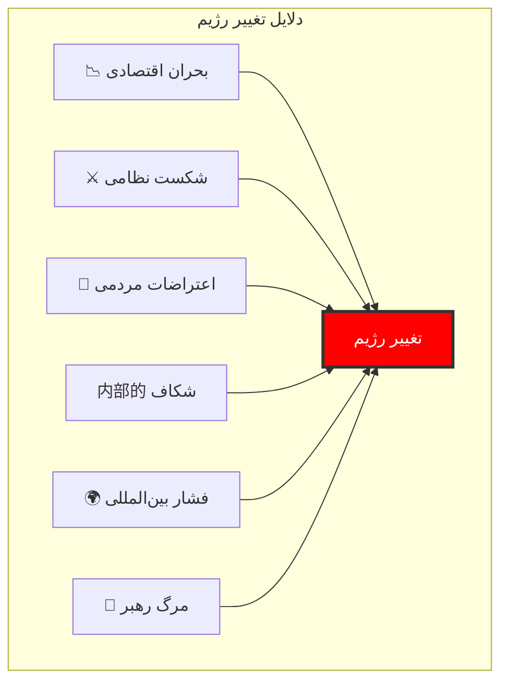
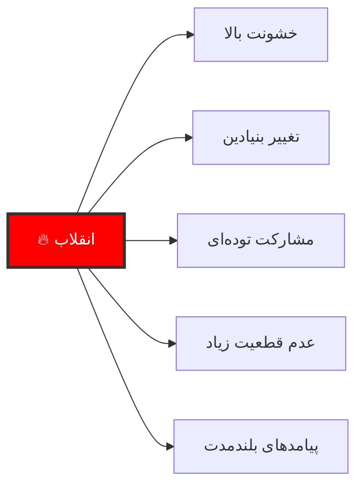
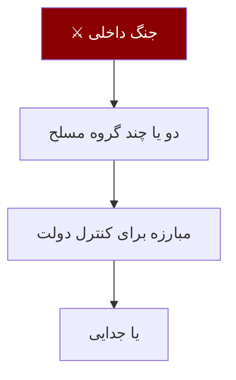
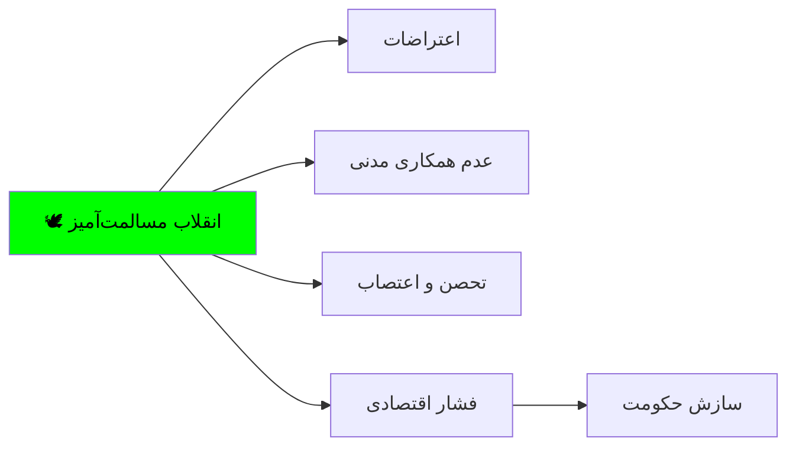
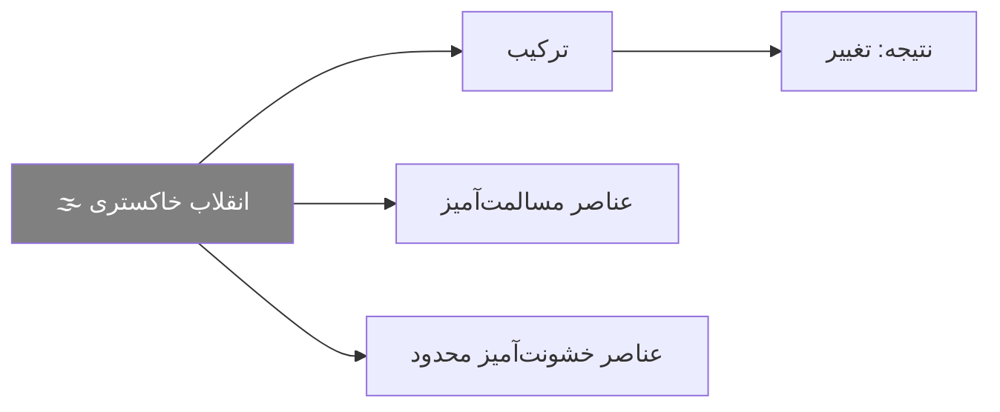
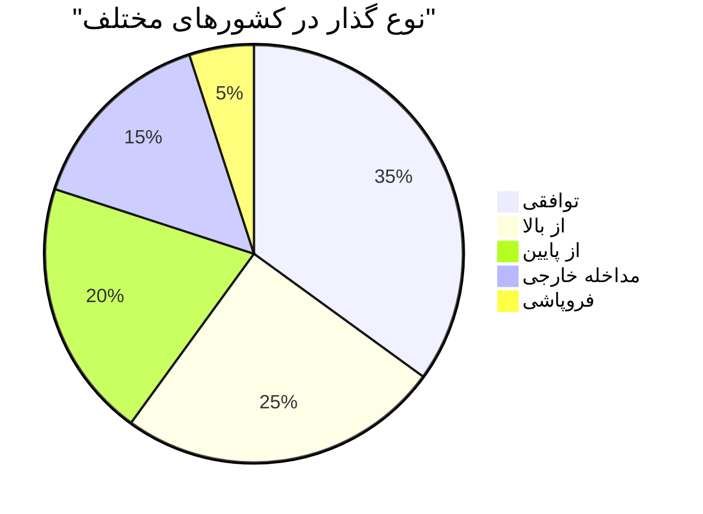
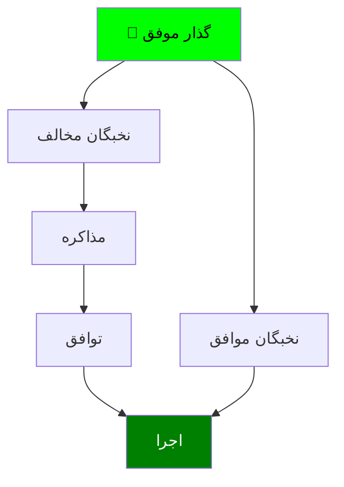
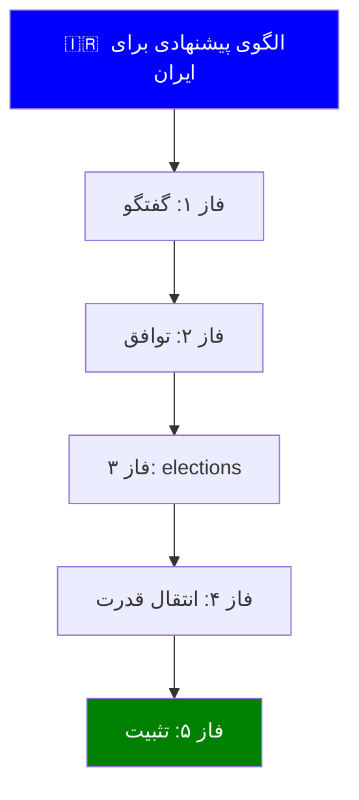

# مروری بر شیوه‌های تغییر رژیم‌های سیاسی

> *«همه رژیم‌ها می‌میرند، اما برخی自杀 نمی‌کنند - آن‌ها را می‌کشند.»*

---

## فهرست مطالب

📚 فهرست کامل مطالب

| بخش | موضوع | صفحه |
|------|-------|-------|
| اول | مقدمه و چارچوب نظری | ۱ |
| دوم | شیوه‌های خشونت‌آمیز | ۲ |
| سوم | شیوه‌های مسالمت‌آمیز | ۳ |
| چهارم | شیوه‌های ترکیبی | ۴ |
| پنجم | عوامل تعیین‌کننده موفقیت | ۵ |
| ششم | مطالعات تطبیقی | ۶ |
| هفتم | نتیجه‌گیری و توصیه‌ها | ۷ |

---

## بخش اول: مقدمه و چارچوب نظری

### ۱.۱ چرا رژیم‌ها تغییر می‌کنند؟

### ۱.۲ طبقه‌بندی شیوه‌ها

| شیوه | خشونت | مدت | مشارکت مردم |
|------|--------|-----|-------------|
| **کودتا** | بالا | کوتاه | کم |
| **انقلاب** | بالا | متوسط-بلند | زیاد |
| **گذار** | کم-متوسط | بلند | زیاد |
| **صلح‌آمیز** | کم | بلند | خیلی زیاد |
| **مداخله** | بالا | متغیر | ندارد |

---

## بخش دوم: شیوه‌های خشونت‌آمیز

### ۲.۱ انقلاب (Revolution)

### تعریف انقلاب

انقلاب تغییر سریع، بنیادین و خشونت‌آمیز در ساختار قدرت، ایدئولوژی و طبقات اجتماعی یک کشور است.

### انواع انقلاب

| نوع | توضیح | نمونه |
|-----|--------|-------|
| **سیاسی** | تغییر حکومت | انقلاب ۱۹۰۵ روسیه |
| **اجتماعی** | تغییر ساختار طبقاتی | انقلاب فرانسه |
| **اقتصادی** | تغییر نظام مالکیت | انقلاب کمونیستی |
| **فرهنگی** | تغییر ارزش‌ها | انقلاب فرهنگی چین |

### ویژگی‌های انقلاب

### ۲.۲ کودتا (Coup)

### تعریف کودتا

کودتا تغییر سریع در رهبری سیاسی است که توسط گروه کوچکی از نخبگان - معمولاً نظامیان - با استفاده از زور یا تهدید انجام می‌شود.

### انواع کودتا

| نوع | توضیح | نمونه |
|-----|--------|-------|
| **نظامی** | توسط ارتش | کودتای ترکیه ۱۹۶۰ |
| **سرهنگی** | توسط افسران ارشد | کودتای یونان ۱۹۶۷ |
| **دولتی** | توسط مقامات رسمی | کودتای پاراگوئه |
| **پیشگیرانه** | قبل از تهدید | کودتای احتمالی |

### تفاوت انقلاب و کودتا

| معیار | انقلاب | کودتا |
|-------|--------|-------|
| وسعت تغییر | گسترده | محدود |
| مشارکت مردم | زیاد | کم |
| خشونت | بالا | متوسط |
| حفظ نهادها | خیر | معمولاً بله |
| زمان | هفته‌ها-ماه‌ها | ساعت‌ها-روزها |

### ۲.۳ جنگ داخلی (Civil War)

---

## بخش سوم: شیوه‌های مسالمت‌آمیز

### ۳.۱ گذار دموکراتیک (Democratic Transition)

### تعریف

گذار دموکراتیک فرآیندی است که طی آن یک نظام سیاسی (معمولاً استبدادی) به صورت مسالمت‌آمیز به دموکراسی تبدیل می‌شود.

### ویژگی‌های گذار موفق

| ویژگی | توضیح |
|--------|--------|
| **مذاکره** | گفتگو بین نخبگان حکومت و مخالفان |
| **خشونت‌پرهیزی** | عدم استفاده از زور |
| **تدریج** | تغییر گام‌به‌گام |
| **نهادسازی** | ایجاد ساختارهای دموکراتیک |

### ۳.۲ انقلاب مسالمت‌آمیز (Peaceful Revolution)

### نمونه‌های انقلاب مسالمت‌آمیز

| کشور | سال | روش |
|-------|-----|------|
| **هند** | ۱۹۴۷ | عدم همکاری |
| **فیلیپین** | ۱۹۸۶ | انقلاب مخملی |
| **چکسلواکی** | ۱۹۸۹ | انقلاب مخملی |
| **گرجستان** | ۲۰۰۳ | انقلاب گل‌ریزان |
| **اوکراین** | ۲۰۰۴ | انقلاب نارنجی |

### ۳.۳ فروپاشی تدریجی (Gradual Collapse)

### تعریف

فروپاشی تدریجی زمانی رخ می‌دهد که یک رژیم به دلیل بحران‌های متعدد (اقتصادی، سیاسی، اجتماعی) به صورت تدریجی قدرت خود را از دست می‌دهد.

### نمونه‌ها

| کشور | دوره فروپاشی |
|-------|--------------|
| **اتحاد شوروی** | ۱۹۸۵-۱۹۹۱ |
| **یوگoslavی** | ۱۹۹۱-۱۹۹۲ |
| **آلبانی** | ۱۹۹۰-۱۹۹۲ |

---

## بخش چهارم: شیوه‌های ترکیبی

### ۴.۱ انقلاب خاکستری (Grey Revolution)

### ۴.۲ گذار توافقی (Negotiated Transition)

| مرحله | اقدام |
|--------|--------|
| ۱ | مذاکره محرمانه |
| ۲ | توافق چارچوب |
| ۳ | تصویب قانونی |
| ۴ | برگزاری elections |
| ۵ | انتقال قدرت |

### نمونه‌های گذار توافقی

---

## بخش پنجم: عوامل تعیین‌کننده موفقیت

### ۵.۱ عوامل کلیدی موفقیت

| عامل | توضیح | اهمیت |
|-----|--------|--------|
| **اتحاد نخبگان** | اجماع نخبگان برای تغییر | بسیار بالا |
| **خشونت‌پرهیزی** | عدم استفاده از زور | بالا |
| **حمایت بین‌المللی** | پشتیبانی جامعه جهانی | متوسط |
| **برنامه‌ریزی** | وجود نقشه راه مشخص | بالا |
| **نهادهای مدنی** | سازمان‌های مردم‌نهاد | متوسط |

### ۵.۲ مدل موفقیت گذار

---

## بخش ششم: مطالعات تطبیقی

### ۶.۱ جدول مقایسه‌ای

| کشور | سال | شیوه | مدت | نتیجه |
|-------|-----|-------|-----|--------|
| **اسپانیا** | ۱۹۷۵-۱۹۸۲ | گذار توافقی | ۷ سال | ✅ موفق |
| **لهستان** | ۱۹۸۹-۱۹۹۱ | میزگرد | ۲ سال | ✅ موفق |
| **آفریقای جنوبی** | ۱۹۹۰-۱۹۹۴ | مذاکره | ۴ سال | ✅ موفق |
| **مصر** | ۲۰۱۱ | انقلاب | ۱۸ ماه | ❌ ناموفق |
| **لیبی** | ۲۰۱۱ | مداخله+جنگ | ۱۰ ماه | ❌ شکست |
| **سوریه** | ۲۰۱۱-حال | جنگ داخلی | تا امروز | ❌ بحران |

### ۶.۲ درس‌های کلیدی

#### ✅ عوامل موفقیت

| درس | توضیح |
|-----|--------|
| **اجماع نخبگان** | توافق قبل از رقابت |
| **مذاکره** | گفتگو به جای تقابل |
| **مصالحه** | بخشش به جای انتقام |
| **تدریج** | گام‌به‌گام |
| **برنامه‌ریزی** | نقشه راه مشخص |

#### ❌ عوامل شکست

| درس | توضیح |
|-----|--------|
| **تفرقه** | اختلاف بین مخالفان |
| **خشونت** | استفاده از زور |
| **مداخله خارجی** | دخالت بیگانگان |
| **عجله** | تغییر یکباره |
| **عدم بخشش** | انتقام‌جویی |

---

## بخش هفتم: نتیجه‌گیری و توصیه‌ها

### ۷.۱ نتیجه‌گیری کلی

### خلاصه یافته‌ها

| شیوه | مزایا | معایب |
|------|--------|--------|
| **انقلاب** | تغییر سریع | خشونت، بی‌ثباتی |
| **کودتا** | سرعت | عدم مشروعیت |
| **گذار** | ثبات، مشروعیت | زمان‌بر |
| **مسالمت‌آمیز** | کمترین هزینه | نیاز به بسیج |

> **نتیجه نهایی:** بهترین شیوه برای تغییر رژیم، گذار توافقی و مسالمت‌آمیز است که مبتنی بر مذاکره، اجماع و نهادسازی باشد.

### ۷.۲ توصیه‌های عملی

| توصیه | توضیح |
|--------|--------|
| **۱. تشکیل ائتلاف** | وحدت نخبگان مخالف |
| **۲. گفتگو** | مذاکره با حکومت |
| **۳. برنامه‌ریزی** | تدوین نقشه راه |
| **۴. خشونت‌پرهیزی** | عدم استفاده از زور |
| **۵. بین‌المللی‌سازی** | جلب حمایت جهانی |
| **۶. نهادسازی** | ایجاد ساختارهای دموکراتیک |

### ۷.۳ الگوی پیشنهادی برای ایران

---

## منابع

### منابع اصلی لاتین

| نویسنده | اثر | سال |
|---------|------|-----|
| Huntington, Samuel | *The Third Wave* | 1991 |
| O'Donnell & Schmitter | *Transitions from Authoritarian Rule* | 1986 |
| Linz & Stepan | *Problems of Democratic Transition* | 1996 |
| Diamond, Larry | *Developing Democracy* | 1999 |

### منابع فارسی

| نویسنده | اثر |
|---------|------|
| آبراهامیان، یرواند | ایران بین دو انقلاب |
| کاتوزیان، همایون | اقتصاد سیاسی ایران |
| بشیریه، حسین | درآمدی بر جامعه‌شناسی سیاسی |

---

> **پیام پایانی:** تغییر رژیم سیاسی یک فرآیند پیچیده است که نیازمند برنامه‌ریزی دقیق، اجماع نخبگان و صبر است. خشونت راه‌حل نیست - تنها به ویرانی و بی‌ثباتی می‌انجامد.

