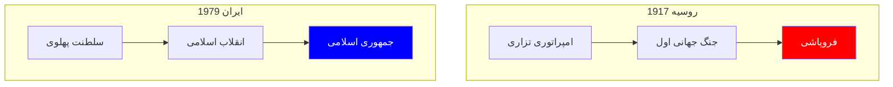
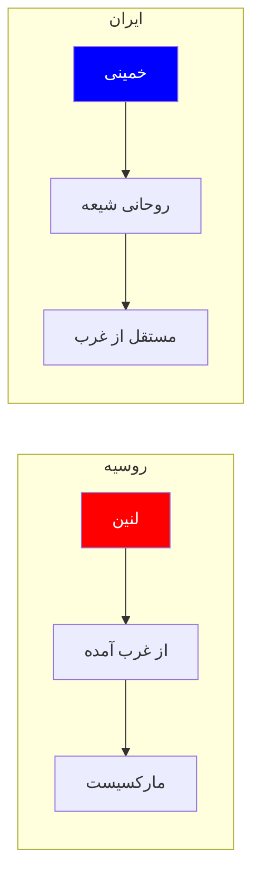
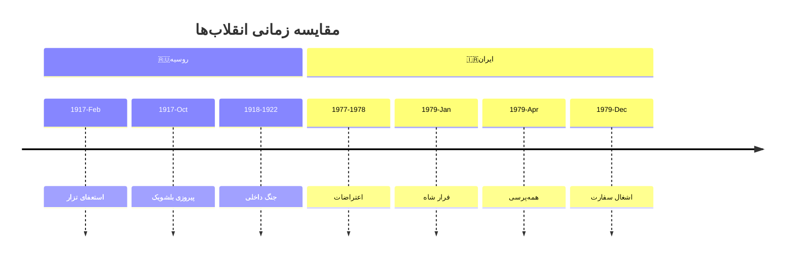
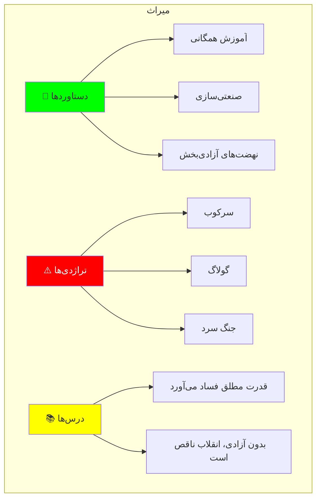

# مقایسه انقلاب ایران و انقلاب روسیه

> *«هر انقلابی در بستر خاص خود رخ می‌دهد، اما همه انقلاب‌ها از قواعد مشترکی پیروی می‌کنند.»*

---

## فهرست مطالب

📚 فهرست کامل مطالب

| بخش | موضوع |
|------|-------|
| اول | بستر تاریخی و زمینه‌ها |
| دوم | علل و محرک‌ها |
| سوم | رهبران و نیروها |
| چهارم | ایدئولوژی و اهداف |
| پنجم | فرآیند انقلاب |
| ششم | پیامدها و میراث |
| هفتم | درس‌ها و نتیجه‌گیری |

---

## بخش اول: بستر تاریخی و زمینه‌ها

### ۱.۱ زمینه‌های تاریخی

### ۱.۲ ویژگی‌های کشورها

| شاخص | 🇷🇺 روسیه (1917) | 🇮🇷 ایران (1979) |
|-------|-----------------|------------------|
| جمعیت | ۱۶۷ میلیون | ۳۶ میلیون |
| منابع | نفت، گندم | نفت |
| قدرت حاکم | تزار | شاه |
| نقش مذهب | کم | بسیار زیاد |
| صنعتی‌شدن | ۲۰٪ اروپا | ۵۰٪ |

---

## بخش دوم: علل و محرک‌ها

### ۲.۱ عوامل مشترک

#### 🔴 عوامل مشترک

| عامل | توضیح |
|------|--------|
| استبداد سیاسی | حکومت‌های تمامیت‌خواه |
| نابرابری اجتماعی | شکاف طبقاتی عمیق |
| بحران اقتصادی | تورم و فقر |
| شکست نظامی | جنگ‌های ناموفق |
| ظهور نخبگان | روشنفکران وابسته |

#### 🔵 عوامل متفاوت

| عامل | 🇷🇺 روسیه | 🇮🇷 ایران |
|------|----------|----------|
| محرک اصلی | جنگ جهانی | انقلاب اسلامی |
| ایدئولوژی | کمونیسم | اسلام شیعه |
| نقش نظامیان | شکست ارتش | کودتای ۲۸ مرداد |
| نقش مذهب | کم‌رنگ | محوری |

### ۲.۲ مقایسه علل

---

## بخش سوم: رهبران و نیروها

### ۳.۱ رهبران کلیدی

| 🇷🇺روسیه | 🇮🇷ایران | نقش مشترک |
|----------|----------|-----------|
| لنین | خمینی | رهبری معنوی |
| تروتسکی | بهشتی | سازماندهی |
| استالین | رفسنجانی | قدرت اجرایی |

### ۳.۲ تفاوت رهبری

### ۳.۳ نیروهای اجتماعی

| نیرو | 🇷🇺روسیه | 🇮🇷ایران |
|------|----------|----------|
| کارگران | بسیار زیاد | کم |
| دهقانان | زیاد | متوسط |
| روحانیت | کم | بسیار زیاد |
| بازاریان | کم | متوسط |
| نظامیان | متوسط | زیاد |

---

## بخش چهارم: ایدئولوژی و اهداف

### ۴.۱ مقایسه ایدئولوژی

| معیار | 🇷🇺روسیه | 🇮🇷ایران |
|-------|----------|----------|
| ایدئولوژی رسمی | کمونیسم | اسلام شیعه |
| هدف نهایی | جامعه بی‌طبقه | حکومت الله |
| نسبت با غرب | ضد امپریالیسم | ضد آمریکا |
| نقش مذهب | الحاد دولتی | اسلام رسمی |
| الگوی اقتصادی | سوسیالیسم | اقتصاد اسلامی |

### ۴.۲ مقایسه شعارها

**🇷🇺 شعارهای انقلاب روسیه**

- «همه قدرت به شوراها!»
- «کارگران جهان، متحد شوید!»
- «سربازان، اسلحه‌های خود را زمین نگذارید!»

**🇮🇷 شعارهای انقلاب ایران**

- «استقلال، آزادی، جمهوری اسلامی»
- «مرگ بر شاه»
- «نه شرقی، نه غربی»

---

## بخش پنجم: فرآیند انقلاب

### ۵.۱ جدول زمانی

### ۵.۲ شباهت‌های فرآیند

| مرحله | 🇷🇺روسیه | 🇮🇷ایران |
|-------|----------|----------|
| فروپاشی حکومت | فوریه ۱۹۱۷ | ژانویه ۱۹۷۹ |
| دولت موقت | کرنسکی | بازرگان |
| قدرت نهایی | اکتبر ۱۹۷۹ | اسفند ۱۹۷۹ |
| تثبیت | ۱۹۲۲ | ۱۹۸۱ |

---

## بخش ششم: پیامدها و میراث

### ۶.۱ مقایسه پیامدها

| پیامد | 🇷🇺روسیه | 🇮🇷ایران |
|-------|----------|----------|
| نظام سیاسی | تک‌حزبی | تک‌حزبی |
| نقش مذهب | حذف | محوری |
| روابط خارجی | جنگ سرد | تحریم |
| اقتصاد | صنعتی‌سازی | نفتی |
| قربانیان | ۲۰ میلیون | صدها هزار |

### ۶.۲ میراث

---

## بخش هفتم: درس‌ها و نتیجه‌گیری

### ۷.۱ درس‌های کلیدی

| درس | توضیح |
|-----|--------|
| **۱. ایدئولوژی** | هر دو انقلاب با ایدئولوژی مطلق‌گرا به استبداد رسیدند |
| **۲. رهبری** | رهبران انقلابی خود به مستبد تبدیل شدند |
| **۳. اقتصاد** | بدون آزادی اقتصادی، توسعه پایدار نیست |
| **۴. جامعه مدنی** | بدون جامعه مدنی، دموکراسی شکست می‌خورد |
| **۵. نقش مذهب** | می‌تواند هم mobilizing و هم سرکوب‌کننده باشد |

### ۷.۲ تفاوت‌های ساختاری

#### 🇷🇺روسیه
- انقلاب کارگری-دهقانی
- الگوی مارکسیستی
- حذف مذهب
- صنعتی‌سازی سریع
- فروپاشی نهایی (۱۹۹۱)

#### 🇮🇷ایران
- انقلاب مذهبی
- الگوی اسلامی
- تثبیت مذهب
- اقتصاد نفتی
- ادامه تا امروز

---

## جمع‌بندی نهایی

> **نتیجه‌گیری کلی:**
> 
> هر دو انقلاب نشان دادند که:
> 1. استبداد می‌تواند توده‌ها را بسیج کند
> 2. اما بدون آزادی و دموکراسی، انقلاب‌ها به استبداد جدید می‌رسند
> 3. ایدئولوژی‌های مطلق‌گرا (چپ یا راست) به سرکوب منجر می‌شوند
> 4. تنها راه، گذار مسالمت‌آمیز به دموکراسی است

---

## منابع

### منابع اصلی

- آبراهامیان، یرواند. *ایران بین دو انقلاب*
- تروتسکی، لئون. *تاریخ انقلاب روسیه*
- کاتوزیان، همایون. *اقتصاد سیاسی ایران*

### منابع تطبیقی

- هانتینگتون، ساموئل. *سومین موج*
- اسکاچپول، تeda. *انقلاب‌ها و اجتماعات*
