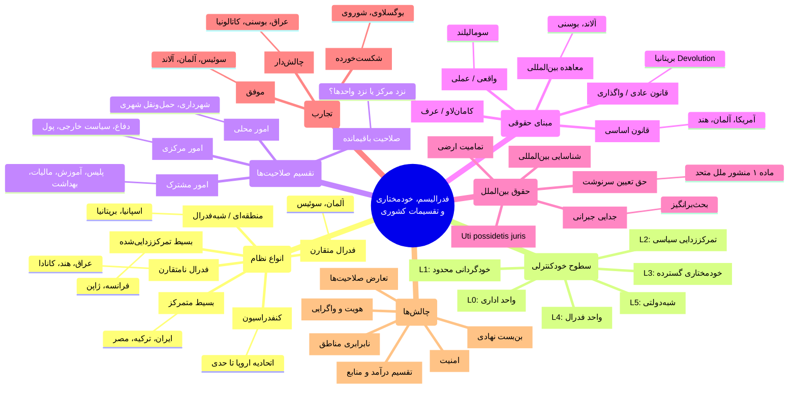
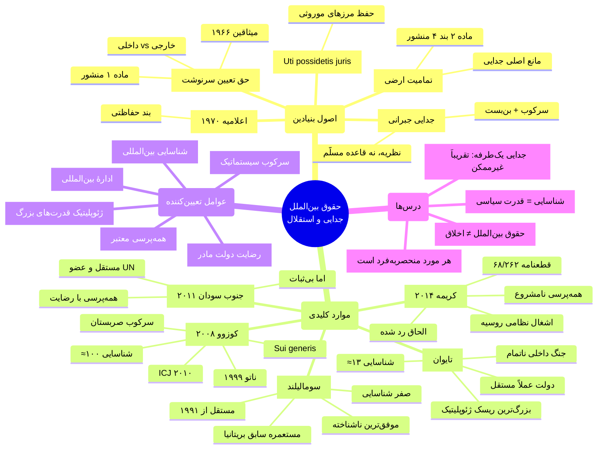

# دولت، ملت و تنوع قومی

## بخش اول: جغرافیای مفهومی جامع

---

### ۱) انواع نظام‌های تقسیم قدرت سرزمینی (طیف)

| سطح | نوع نظام | ویژگی کلیدی | نمونه |
|---|---|---|---|
| ۰ | بسیط متمرکز | تمام قدرت در مرکز | ایران، ترکیه، مصر |
| ۱ | بسیط تمرکززدایی‌شده | اختیارات اداری محدود به مناطق | فرانسه، ژاپن، اندونزی |
| ۲ | منطقه‌ای / شبه‌فدرال | خودمختاری نامتقارن در کشور غیرفدرال | اسپانیا، بریتانیا، ایتالیا |
| ۳ | فدرال متقارن | واحدها اختیارات مشابه دارند | آلمان، سوئیس، استرالیا |
| ۴ | فدرال نامتقارن | برخی واحدها اختیارات بیشتر دارند | عراق، هند، کانادا، روسیه |
| ۵ | کنفدرال / شبه‌مستقل | اتحاد دولت‌های تقریباً مستقل | اتحادیه اروپا (بعضی جنبه‌ها) |

---

### ۲) سطوح خودکنترلی واحدهای فرودولتی

| سطح | عنوان | اختیارات | نمونه |
|---|---|---|---|
| L0 | واحد صرفاً اداری | مجری دستور مرکز | استانداری ایران |
| L1 | خودگردانی اداری محدود | شهرداری، خدمات شهری | ژاپن، ترکیه |
| L2 | تمرکززدایی سیاسی | شورای منطقه‌ای، آموزش محلی | فرانسه، اندونزی |
| L3 | خودمختاری گسترده | پارلمان، دولت، زبان رسمی محلی | اسکاتلند، کاتالونیا، آلاند |
| L4 | واحد فدرال | قانون‌گذاری تضمین‌شده قانون اساسی | بایرن، کالیفرنیا، کبک |
| L5 | شبه‌دولتی | کنترل تقریبی بر همه امور داخلی | هنگ‌کنگ (سابق)، گرینلند |

---

### ۳) تقسیم خدمات و صلاحیت‌ها

#### الف) امور حاکمیتی سخت (معمولاً مرکزی)
- دفاع و ارتش
- سیاست خارجی
- پول ملی و بانک مرکزی
- تابعیت و گذرنامه
- گمرک و مرزهای بین‌المللی

#### ب) امور قابل‌تقسیم (بسته به مدل)
- پلیس و نظم عمومی
- آموزش
- بهداشت و سلامت
- مالیات
- منابع طبیعی
- محیط زیست
- توسعه اقتصادی
- رسانه و فرهنگ
- زبان رسمی

#### ج) امور محلی کلاسیک
- آب، فاضلاب، پسماند
- حمل‌ونقل شهری
- مجوزهای ساختمانی
- آتش‌نشانی
- پارک‌ها و فضای سبز

---

### ۴) مبنای حقوقی تقسیم قدرت

| مبنا | ویژگی | نمونه |
|---|---|---|
| قانون اساسی نوشته | تقسیم صلاحیت در متن قانون اساسی | آمریکا، آلمان، هند، عراق |
| قانون عادی | پارلمان می‌تواند اختیارات را پس بگیرد | بریتانیا (devolution) |
| کامان‌لاو / عرف | رویه تاریخی و عرفی | بخش‌هایی از نظام بریتانیا |
| معاهده بین‌المللی | توافق بین‌المللی | آلاند (معاهده ۱۹۲۱)، بوسنی (دیتون) |
| واقعی / عملی | بدون مبنای حقوقی رسمی | سومالیلند، شمال قبرس |

---

### ۵) حقوق بین‌الملل: خودمختاری، جدایی، استقلال

| اصل | محتوا |
|---|---|
| حق تعیین سرنوشت | ماده ۱ منشور ملل متحد؛ اما بیشتر برای مستعمرات تفسیر شده |
| تمامیت ارضی | اصل حفظ مرزهای موجود؛ مانع جدایی یک‌طرفه |
| Uti possidetis juris | مرزهای استعماری در استقلال حفظ شوند |
| جدایی جبرانی (Remedial secession) | اگر سرکوب شدید و راه دیگری نباشد؛ بحث‌برانگیز |
| شناسایی بین‌المللی | استقلال بدون شناسایی، ناقص است |

---

### ۶) تجارب موفق و ناموفق

#### موفق (نسبتاً)
- سوئیس: فدرالیسم چندزبانه، دموکراسی مستقیم
- آلمان: فدرالیسم متقارن، مالی منسجم
- کانادا: مدیریت تنوع کبک
- آلاند: خودمختاری پایدار زبانی

#### چالش‌دار
- عراق: فدرالیسم نامتقارن، نفت، امنیت
- بوسنی: ساختار پیچیده و کم‌کارآمد
- اسپانیا/کاتالونیا: تنش استقلال‌طلبی
- بلژیک: تمرکززدایی رو به فرسایش انسجام

#### شکست‌خورده
- یوگسلاوی: فروپاشی و جنگ
- اتحاد شوروی: فروپاشی
- سودان: جدایی جنوب سودان

---

### ۷) چالش‌های کلیدی

| چالش | توضیح |
|---|---|
| تقسیم درآمد و منابع طبیعی | نفت، معادن، مالیات |
| تعارض صلاحیت‌ها | مرکز و منطقه بر سر حدود اختیار |
| هویت و واگرایی | خودمختاری می‌تواند هم چسب وحدت باشد هم سکوی جدایی |
| نابرابری بین مناطق | مناطق فقیر/غنی |
| امنیت | نیروهای مسلح محلی، مرزبانی |
| مشروعیت | مردم محلی vs مردم ملی |
| بن‌بست نهادی | وتوی متقابل، فلج تصمیم‌گیری |

---

## بخش دوم: نقشهٔ ذهنی Mermaid

# بخش اول: تحلیل جامع حقوق بین‌الملل — جدایی، استقلال و شناسایی

---

### ۱) اصول بنیادین حقوق بین‌الملل

| اصل | منبع | محتوا | تنش با |
|---|---|---|---|
| **حق تعیین سرنوشت** | ماده ۱ منشور ملل متحد، میثاقین ۱۹۶۶ | ملت‌ها حق دارند نظام سیاسی خود را تعیین کنند | تمامیت ارضی |
| **تمامیت ارضی** | ماده ۲(۴) منشور ملل متحد | مرزهای دولت‌ها باید محترم شمرده شود | حق تعیین سرنوشت |
| **Uti possidetis juris** | رویه بین‌المللی، آفریقا/آمریکای لاتین | مرزهای به‌ارث‌رسیده در استقلال حفظ شوند | تغییر مرز بر اساس قومیت |
| **اعلامیه روابط دوستانه ۱۹۷۰** | قطعنامه ۲۶۲۵ مجمع عمومی | تعیین سرنوشت «داخلی» مقدم؛ اما اگر حکومت نمایندهٔ مردم نباشد... | بندِ «حفاظتی» (safeguard clause) |
| **جدایی جبرانی** | نظریه حقوقی، نه قاعده مسلّم | اگر سرکوب سیستماتیک + نبود راه‌حل داخلی → شاید حق جدایی | هنوز بحث‌برانگیز |

---

### ۲) تعیین سرنوشت: داخلی vs خارجی

| نوع | معنا | پذیرش بین‌المللی |
|---|---|---|
| **داخلی** | خودگردانی، مشارکت سیاسی، حقوق اقلیت‌ها در چارچوب دولت موجود | گسترده و پذیرفته‌شده |
| **خارجی** | جدایی و تشکیل دولت مستقل جدید | فقط در: ① استعمارزدایی ② اشغال خارجی ③ شاید سرکوب سیستماتیک |

---

### ۳) پنج مورد کلیدی: تحلیل تطبیقی عمیق

#### الف) کوزوو (۲۰۰۸)

| مؤلفه | جزئیات |
|---|---|
| **پیش‌زمینه** | سرکوب سیستماتیک آلبانیایی‌تبارها توسط صربستان؛ پاک‌سازی قومی ۱۹۹۸-۹۹ |
| **مداخله** | ناتو ۱۹۹۹ (بدون مجوز شورای امنیت)؛ ادارهٔ موقت سازمان ملل (UNMIK) |
| **اعلام استقلال** | ۱۷ فوریه ۲۰۰۸ توسط پارلمان کوزوو |
| **نظر مشورتی ICJ** | ۲۰۱۰: «اعلام استقلال ناقض حقوق بین‌الملل عمومی نیست» — اما سؤال بسیار باریک بود |
| **شناسایی** | ≈۱۰۰ کشور (شامل آمریکا، اکثر اروپا) اما نه روسیه، چین، هند، اسپانیا |
| **عضویت سازمان ملل** | ندارد (وتوی روسیه و چین) |
| **استدلال موافقان** | جدایی جبرانی؛ سرکوب گسترده؛ شکست مذاکره؛ sui generis (یگانه) |
| **استدلال مخالفان** | نقض تمامیت ارضی؛ سابقهٔ خطرناک؛ بدون رضایت صربستان |
| **وضعیت کنونی** | دولت عملاً مستقل؛ عضو IMF و بانک جهانی؛ اما شناسایی ناکامل |

#### ب) کریمه (۲۰۱۴)

| مؤلفه | جزئیات |
|---|---|
| **پیش‌زمینه** | بحران اوکراین ۲۰۱۴؛ تغییر حکومت کیِف؛ جمعیت عمدتاً روس‌زبان |
| **مداخله** | نیروهای نظامی روسیه بدون نشان («مردان سبزپوش») کنترل شبه‌جزیره را گرفتند |
| **همه‌پرسی** | ۱۶ مارس ۲۰۱۴: ۹۷٪ به الحاق رأی دادند؛ زیر اشغال نظامی، بدون نظارت بین‌المللی |
| **الحاق** | روسیه کریمه را ضمیمه کرد |
| **واکنش بین‌المللی** | قطعنامه ۶۸/۲۶۲ مجمع عمومی: الحاق بی‌اعتبار؛ تحریم‌های غربی |
| **استدلال روسیه** | حق تعیین سرنوشت مردم؛ حفاظت از روس‌زبانان؛ مقایسه با کوزوو |
| **استدلال جامعه بین‌المللی** | اشغال نظامی ← همه‌پرسی نامشروع؛ نقض آشکار تمامیت ارضی اوکراین |
| **تفاوت اساسی با کوزوو** | کوزوو: سرکوب سیستماتیک قبلی + ادارهٔ بین‌المللی + مذاکره ناموفق. کریمه: مداخلهٔ نظامی خارجی بدون سرکوب قبلی |

#### ج) تایوان

| مؤلفه | جزئیات |
|---|---|
| **پیش‌زمینه** | جمهوری چین (ROC) ۱۹۱۲؛ شکست در جنگ داخلی ۱۹۴۹؛ عقب‌نشینی به تایوان |
| **ماهیت حقوقی** | نه جدایی بلکه «ادامهٔ» یک دولت؛ تایوان تا ۱۹۷۱ کرسی چین در سازمان ملل را داشت |
| **وضعیت فعلی** | دولت عملاً مستقل با ارتش، اقتصاد، دموکراسی، گذرنامه، پول ملی |
| **شناسایی** | ≈۱۲-۱۳ کشور (عمدتاً کوچک)؛ آمریکا: شناسایی رسمی ندارد اما حمایت عملی |
| **سیاست «یک چین»** | PRC: تایوان بخشی از چین است؛ ROC: ادعای تاریخی متقابل |
| **عضویت سازمان ملل** | از ۱۹۷۱ ندارد (قطعنامه ۲۷۵۸) |
| **خاص بودن** | این مورد اصلاً «جدایی» نیست؛ بلکه «جنگ داخلیِ ناتمام» + دو حکومت رقیب است |
| **ریسک** | خطر درگیری نظامی بالا؛ مهم‌ترین بحران بالقوه ژئوپلیتیک جهان |

#### د) سومالیلند

| مؤلفه | جزئیات |
|---|---|
| **پیش‌زمینه** | مستعمره سابق بریتانیا؛ استقلال ۱۹۶۰؛ اتحاد داوطلبانه با سومالی ایتالیایی |
| **جدایی** | ۱۹۹۱ پس از سقوط سیاد بره و جنگ داخلی |
| **عملکرد** | دولت نسبتاً پایدار؛ انتخابات چندحزبی؛ صلح داخلی نسبی؛ پول و گذرنامه خودی |
| **شناسایی** | صفر شناسایی رسمی (!) علیرغم بیش از ۳۰ سال حکومت مستقل |
| **استدلال سومالیلند** | بازگشت به مرزهای استعماری (uti possidetis)؛ اتحاد ۱۹۶۰ شکست‌خورده |
| **مانع شناسایی** | ترس از سابقه‌سازی در آفریقا؛ اتحادیه آفریقا: حفظ مرزهای موجود |
| **وضعیت کنونی** | موفق‌ترین دولت بدون شناسایی در جهان |

#### هـ) موارد مقایسه‌ای دیگر

| مورد | سال | وضعیت | شناسایی | ویژگی خاص |
|---|---|---|---|---|
| **جنوب سودان** | ۲۰۱۱ | مستقل | کامل (عضو سازمان ملل) | همه‌پرسی با رضایت شمال + فشار بین‌المللی |
| **کاتالونیا** | ۲۰۱۷ | شکست | صفر | همه‌پرسی یک‌طرفه؛ بدون سرکوب سیستماتیک |
| **کردستان عراق** | ۲۰۱۷ | شکست | صفر | همه‌پرسی مشورتی؛ واکنش نظامی بغداد |
| **آبخازیا/اوستیای جنوبی** | ۲۰۰۸ | بحثی | ≈۴-۵ کشور | شناسایی روسیه پس از جنگ |
| **ترانسنیستریا** | ۱۹۹۰ | بحثی | صفر | وابسته به روسیه |
| **شمال قبرس** | ۱۹۸۳ | بحثی | فقط ترکیه | ناشی از مداخله نظامی ترکیه ۱۹۷۴ |

---

### ۴) ماتریس مقایسه‌ای پنج مورد

| معیار | کوزوو | کریمه | تایوان | سومالیلند | جنوب سودان |
|---|---|---|---|---|---|
| **سرکوب سیستماتیک قبلی** | ✓✓✓ | ✗ | نامربوط | ✓✓ | ✓✓✓ |
| **مداخله نظامی خارجی** | ✓ (ناتو) | ✓✓✓ (روسیه) | ✗ | ✗ | ✗ |
| **همه‌پرسی معتبر** | ✗ (اعلام پارلمانی) | ✗ (زیر اشغال) | ✗ | ✗ (اما ثبات عملی) | ✓✓✓ |
| **رضایت دولت مادر** | ✗ | ✗ | ✗ | ✗ | ✓ |
| **ادارهٔ بین‌المللی قبلی** | ✓ (UNMIK) | ✗ | ✗ | ✗ | ✗ |
| **شناسایی گسترده** | جزئی (≈۱۰۰) | ✗ (≈۱۰) | ✗ (≈۱۳) | ✗ (۰) | ✓✓✓ (۱۹۳) |
| **عضویت سازمان ملل** | ✗ | ✗ | ✗ | ✗ | ✓ |
| **ثبات داخلی** | نسبی | تحت کنترل روسیه | بالا | نسبی | بسیار ضعیف |

---

### ۵) توزیع مدل‌های حکمرانی در جهان (تقریبی)

| مدل | اروپا | آسیا | آفریقا | آمریکا | اقیانوسیه | مجموع |
|---|---|---|---|---|---|---|
| **بسیط متمرکز** | ≈۲۰ | ≈۲۵ | ≈۴۰ | ≈۱۵ | ≈۸ | **≈۱۰۸** |
| **بسیط تمرکززدایی‌شده** | ≈۱۲ | ≈۸ | ≈۸ | ≈۱۰ | ≈۴ | **≈۴۲** |
| **منطقه‌ای / شبه‌فدرال** | ≈۴ | ≈۲ | ≈۱ | ≈۱ | ≈۰ | **≈۸** |
| **فدرال متقارن** | ≈۴ | ≈۳ | ≈۲ | ≈۵ | ≈۳ | **≈۱۷** |
| **فدرال نامتقارن** | ≈۳ | ≈۴ | ≈۳ | ≈۲ | ≈۰ | **≈۱۲** |
| **واحدهای خودمختار ویژه** | ≈۶ | ≈۴ | ≈۲ | ≈۳ | ≈۱ | **≈۱۶** |

---

## بخش دوم: نقشهٔ ذهنی Mermaid

---

