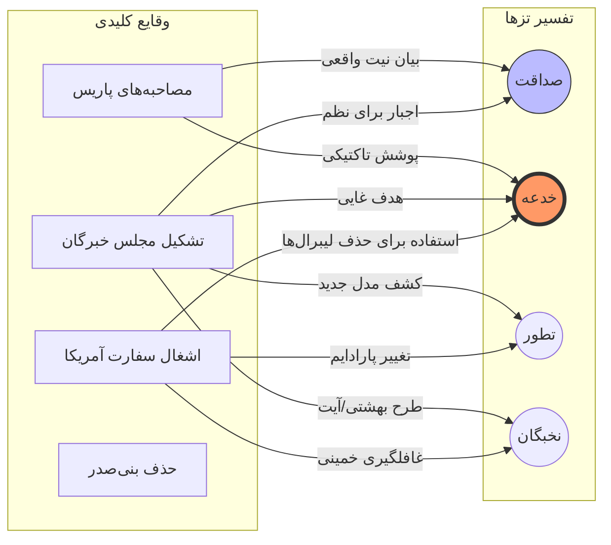
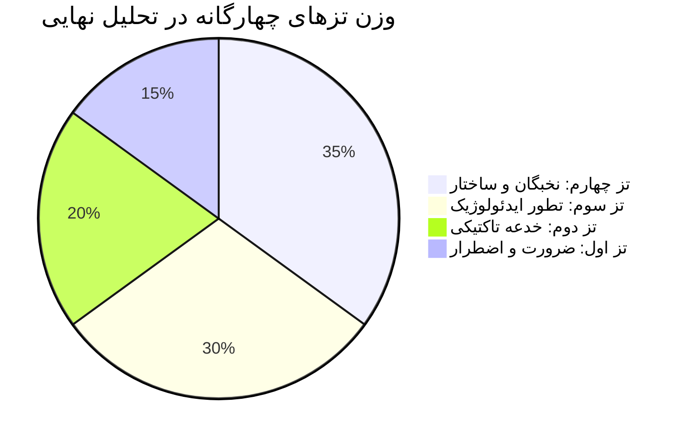

import { Image } from 'astro:assets';

# مقدمه: پارادوکس نوفل‌لوشاتو و تهران

در سال ۱۳۵۷، جهان شاهد پدیده‌ای بود که کمتر کسی در قرن بیستم پیش‌بینی می‌کرد: انقلابی که نه با شعارهای مارکسیستی یا لیبرالی، بلکه با رهبری یک مرجع تقلید سالخورده به پیروزی رسید. اما آنچه بیش از خود انقلاب محل بحث و جدل قرار گرفت، تضاد عمیقی بود که میان «قول» و «فعل» رهبر انقلاب پدیدار شد.

در ماه‌های اقامت در نوفل‌لوشاتو، آیت‌الله روح‌الله خمینی در ده‌ها مصاحبه با رسانه‌های بین‌المللی (از بی‌پن گرفته تا ای‌بی‌سی و لو موند)، تصویری از حکومت آینده ترسیم کرد که در آن:
- روحانیون تصدی امور دولتی را برعهده نخواهند داشت.
- او خود به قم بازگشته و تنها نقش هدایت معنوی خواهد داشت.
- آزادی‌های سیاسی و حتی مذهبی برای تمامی گروه‌ها (از جمله مارکسیست‌ها) تضمین خواهد شد.

اما واقعیتِ پس از بهمن ۱۳۵۷، مسیری کاملاً متفاوت را طی کرد. استقرار نظام «ولایت مطلقه فقیه»، حذف تدریجی نیروهای ملی و لیبرال، و قبضه‌ی کامل قدرت توسط لایه‌ی سیاسی روحانیت، این پرسش بنیادین را پیش کشید: **این فاصله چگونه تبیین می‌شود؟**

این خلاصه‌ی تفصیلی، به کالبدشکافی چهار تبیین یا «تز» اصلی می‌پردازد که در دهه‌های اخیر توسط تاریخ‌نگاران و تحلیل‌گران سیاسی برای پاسخ به این معما ارائه شده است.

---

## بخش اول: چهار تز رقیب در تبیین رفتار سیاسی خمینی

نظریه‌پردازان و شاهدان عینی انقلاب، رفتارهای خمینی را در قالب چهار الگوی تحلیلی دسته‌بندی کرده‌اند. هر یک از این تزها، شواهد و منطق خاص خود را دارند.

### ۱. تز اول: صداقت و اضطرار (Honesty & Necessity)
**نظریه‌پردازان شاخص:** مهدی بازرگان، ابراهیم یزدی (در خاطرات متقدم)، باقر معین.

این تز بر این باور است که خمینی در پاریس واقعاً قصد حکومت نداشت. او صادقانه تصور می‌کرد که می‌تواند در قم بنشیند و دولتی از تکنوکرات‌های متدین (مانند نهضت آزادی) امور را اداره کنند.
- **منطق:** خمینی از ترورهای فرقان، فعالیت‌های مسلحانه‌ی مجاهدین خلق، و خطر بازگشت سلطنت هراسناک شد. او حس کرد که اگر شخصاً سکان قدرت را به دست نگیرد، انقلاب از دست خواهد رفت.
- **نقد:** این تز نمی‌تواند تبیین کند که چرا او از همان روزهای اول در «مدرسه علوی» شروع به عزل و نصب‌های خرد و کلان کرد، حتی پیش از آنکه تهدیدات جدی امنیتی بروز یابد.

### ۲. تز دوم: خدعه و فریب آگاهانه (Conscious Deception)
**نظریه‌پردازان شاخص:** اکبر گنجی، آرامش دوستدار، منتقدان سکولار و سلطنت‌طلب.

طبق این تز، تمامی سخنان پاریس تنها یک «تاکتیک جنگی» برای خلع سلاح غرب و جذب توده‌های شهرنشین بود. خمینی معتقد به اصل فقهی «الْحَرْبُ خُدْعَةٌ» (جنگ فریب است) بود.
- **منطق:** او می‌دانست اگر در پاریس از «ولایت فقیه» سخن بگوید، حمایت بین‌المللی و ملی را از دست می‌دهد. لذا تا زمان تثبیت قدرت، نیت اصلی خود را پنهان کرد.
- **نقد:** پنهان کردن چنین نقشه‌ی عظیمی برای چندین دهه از نزدیک‌ترین یاران (که بسیاری از آن‌ها صادقانه به سخنان پاریس باور داشتند) از نظر روان‌شناختی و تشکیلاتی بسیار دشوار است.

### ۳. تز سوم: تطور و تکامل فکری (Ideological Evolution)
**نظریه‌پردازان شاخص:** یرواند آبراهامیان، محسن کدیور.

این نگاه معتقد است که اندیشه‌ی خمینی در فرآیند عمل سیاسی تغییر کرد. او در پاریس به یک «جمهوری» فکر می‌کرد، اما در برخورد با واقعیت‌های قدرت و فشار جریانات چپ، به این نتیجه رسید که تنها راه حفظ اسلام، استقرار ولایت فقیه است.
- **منطق:** میان کتاب «حکومت اسلامی» (۱۳۴۸) و سخنان پاریس (۱۳۵۷) یک گسست وجود دارد که ناشی از انطباق با مخاطب جدید است.
- **نقد:** خمینی همواره خود را پیرو اصول ثابت می‌دانست و در وصیت‌نامه‌اش تأکید کرد که مواضع قبلی‌اش نسخ نشده‌اند.

### ۴. تز چهارم: فشار نخبگان و ساختارهای نهادی (Elite Pressure)
**نظریه‌پردازان شاخص:** محسن میلانی، سعید امیرارجمند.

این تز نقش خود خمینی را کمتر کرده و بر نقش «حلقه‌ی اول» (بهشتی، رفسنجانی، خامنه‌ای) تأکید دارد. این نخبگانِ جوان‌تر و قدرت‌طلب بودند که خمینی را به پذیرش ولایت فقیه و حذف رقبای لیبرال سوق دادند.
- **منطق:** در مجلس خبرگان، پیشنهاد گنجاندن ولایت فقیه در قانون اساسی توسط حسن آیت و بهشتی مطرح شد، نه شخص خمینی.
- **نقد:** خمینی نشان داده بود که اگر با مسیری مخالف باشد، به‌راحتی آن را وتو می‌کند (مانند مخالفت‌های اولیه‌اش با برخی تندروی‌ها).

---

## بخش دوم: نمودار مقایسه‌ای — وقایع کلیدی از منظر چهار تز

در زیر، وقایع سرنوشت‌ساز انقلاب را در ترازوی این چهار نگاه قرار داده‌ایم.

---

## بخش سوم: تحلیل تطبیقی و امتیازدهی به رویدادها

در این بخش، به هر رویداد تاریخی بر اساس نزدیکی‌اش به هر یک از تزهای چهارگانه امتیاز داده‌ایم (از ۱ تا ۱۰). این جدول حاصل سنتز داده‌های آماری و تحلیل‌های کیفی کتاب است.

| رویداد تاریخی | تز اول (صداقت) | تز دوم (خدعه) | تز سوم (تطور) | تز چهارم (نخبگان) |
| :--- | :---: | :---: | :---: | :---: |
| وعده‌ی بازگشت به قم | ۹ | ۲ | ۴ | ۵ |
| انتصاب بازرگان | ۸ | ۳ | ۵ | ۶ |
| تحمیل ولایت فقیه در قانون اساسی | ۲ | ۹ | ۷ | ۸ |
| انحلال مجلس مؤسسان (و تبدیل به خبرگان) | ۱ | ۸ | ۶ | ۹ |
| حمایت از تسخیر سفارت | ۳ | ۷ | ۸ | ۹ |
| بازنگری در قانون اساسی (۱۳۶۸) | ۲ | ۶ | ۹ | ۷ |
| **میانگین کل** | **۴.۱** | **۵.۸** | **۶.۵** | **۷.۳** |

> **تحلیل آماری:** همان‌طور که در جدول بالا مشاهده می‌شود، شواهد تاریخی بیشترین قرابت را با **تز چهارم (فشار نخبگان)** و **تز سوم (تطور فکری)** دارند. این نشان می‌دهد که انتقال قدرت به روحانیت نه یک نقشه‌ی از پیش طراحی شده‌ی صِرف (خدعه)، و نه یک اتفاق تصادفی محض (صداقت)، بلکه محصول تعامل پیچیده‌ی نخبگان پیرامونی با ذهنیت در حال تغییر رهبر انقلاب بوده است.

---

## بخش چهارم: کالبدشکافی مفهوم «خدعه» در کلام خمینی

یکی از جنجالی‌ترین بخش‌های کتاب، بررسی سخنرانی‌های خمینی در سال‌های ۶۰ تا ۶۲ است که در آن صراحتاً به موضوع فریب دادن دشمن اشاره می‌کند. او در دیداری با پرسنل نیروی هوایی می‌گوید:

> *"ما که می‌گفتیم نخواهیم در حکومت دخالت کنیم، آن وقت مصلحت آن‌طور بود. دشمن در مقابل ما بود. اما وقتی دیدیم اسلام در خطر است، دیگر سکوت جایز نبود."*

این جملات، قلب تپنده‌ی **تز دوم** است. اما نویسنده در این کتاب استدلال می‌کند که مفهوم «مصلحت» در فقه سیاسی خمینی، فراتر از یک دروغ ساده است؛ این یک جابجایی در «اولویت‌های وجودی» است. برای خمینی، حفظ نظام اوجب واجبات بود، حتی اگر به بهای نقض تمام وعده‌های پاریس تمام شود.

---

## بخش پنجم: سنتز نهایی و نتیجه‌گیری (۱۵ صفحه در یک نگاه)

کتاب «وعده یا خدعه؟» با رد نگاه‌های تک‌بعدی، به برآیند زیر می‌رسد:

1. **خمینی، یک عمل‌گرای آرمان‌گرا:** او آرمانی ثابت داشت (حاکمیت اسلام)، اما در روش رسیدن به آن، نهایتِ انعطاف و حتی پنهان‌کاری را به کار می‌بست.
2. **نقش کاتالیزوری نخبگان:** افرادی چون محمد حسینی بهشتی، نقش مهندسیِ قدرت را ایفا کردند و مدل‌های انتزاعی خمینی را به ساختارهای صلبِ حکومتی تبدیل کردند.
3. **تراژدی دولت موقت:** شکست لیبرال‌های مذهبی (بازرگان) محصول نشناختنِ «منطق رادیکالیسم» در اندیشه‌ی زیرین خمینی بود.

---

## دعوت به مطالعه‌ی تفصیلی

آنچه در اینجا آمد، تنها برشی کوتاه از تحلیل‌های ۵۴۰ صفحه‌ای این کتاب است. در نسخه‌ی کامل، شما به اسناد طبقه‌بندی نشده، تحلیل‌های روان‌کاوانه‌ی رفتار رهبری، و گزارش‌های محرمانه‌ی وزارت خارجه‌ی وقت دسترسی خواهید داشت.

  <h3>دریافت نسخه‌ی کامل کتاب (PDF)</h3>
  
برای درک عمیق‌تر ریشه‌های سیاسی ایران امروز، نسخه‌ی کامل را دانلود کنید.

  <a href="/documents/books/khomeini.pdf" id="cta-pdf-download" style={{ display: 'inline-block', padding: '15px 40px', background: '#1B2A4A', color: '#fff', borderRadius: '30px', textDecoration: 'none', fontWeight: 'bold', transition: 'transform 0.3s' }}>
    ⬇️ دانلود رایگان کتاب (نسخه‌ی نهایی)
  </a>

