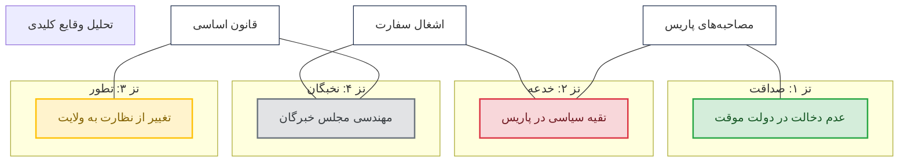
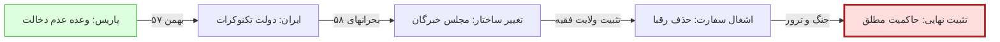

import { Image } from 'astro:assets';

{/* Header Section */}

  <h1 style="color: #FFD700; font-size: 2.5rem; margin-bottom: 1rem;">وعده یا خدعه؟</h1>
  
پژوهشی انتقادی در باب تضاد مواضع آیت‌الله خمینی در پاریس و عملکرد سیاسی پس از انقلاب ۱۳۵۷

  

    تحلیل علمی
    رهیافت چند‌تزی
    مستند به اسناد ردیف اول
  

## مقدمه: معمای نوفل‌لوشاتو
در پاییز ۱۳۵۷، از قلب دهکده‌ای در حومه پاریس، وعده‌هایی صادر شد که جهان را مبهوت کرد. **روح‌الله خمینی**، رهبر انقلابی که لرزه بر اندام رژیم پهلوی انداخته بود، در بیش از ۱۷ مصاحبه با رسانه‌های طراز اول جهان (مانند Le Monde، BBC و Guardian) تصویری از حکومت آینده ترسیم کرد که در آن:
- روحانیون نقشی در لایه‌های اجرایی نخواهند داشت.
- او خود به قم بازگشته و تنها نقش «مرشد معنوی» را ایفا خواهد کرد.
- آزادی‌های سیاسی و حتی مذهبی برای تمامی گروه‌ها تضمین خواهد شد.

اما تنها دو سال بعد، ساختار قدرت به گونه‌ای رقم خورد که ولایت مطلقه فقیه نه تنها بر لایه‌های اجرایی حاکم شد، بلکه تمام رقبا از صحنه حذف شدند. **این فاصله، «وعده» بود یا «خدعه»؟**

---

## ۱. تبارشناسی چهار تز رقیب
کتاب بر پایه چهار فریم‌ورک تحلیلی بنا شده است که هر یک توسط گروهی از نظریه‌پردازان برجسته نمایندگی می‌شود:

  

    <h3 style="color: #27AE60; margin-top: 0;">تز اول: صداقت و اضطرار</h3>
    
خمینی در پاریس صادق بود؛ اما بحران‌ها (ترور، جنگ، شورش) او را ناگزیر به رهبری مستقیم کرد.

    
نظریه‌پردازان: معین، سروش (متقدم)

  

  

    <h3 style="color: #C0392B; margin-top: 0;">تز دوم: خدعه آگاهانه</h3>
    
وعده‌ها ابزاری تاکتیکی برای حفظ ائتلاف بودند و از ابتدا نقشه حکومت روحانیون طراحی شده بود.

    
نظریه‌پردازان: آبراهامیان، گنجی، کاتوزیان

  

  

    <h3 style="color: #B7950B; margin-top: 0;">تز سوم: تطور ایدئولوژیک</h3>
    
اندیشه خمینی پله‌پله تکامل یافت. او در پاریس هنوز به مدل نهایی ولایت مطلقه نرسیده بود.

    
نظریه‌پردازان: ارجمند، کدیور، مارتین

  

  

    <h3 style="color: #6C3483; margin-top: 0;">تز چهارم: فشار نخبگان</h3>
    
حلقه درونی (بهشتی، رفسنجانی و ...) خمینی را به مرکز قدرت راندند تا ساختار جدید تثبیت شود.

    
نظریه‌پردازان: م. میلانی، باخاش، بشیریه

  

---

## ۲. نقشه‌ی ارتباطی وقایع و تزها (نمودار تحلیلی)
این نمودار نشان می‌دهد که هر واقعه کلیدی، چگونه توسط تزهای مختلف تفسیر می‌شود:

---

## ۳. نقد تطبیقی: نقاط قوت و ضعف تزهای چهارگانه

  <table style="width: 100%; border-collapse: collapse; min-width: 600px; text-align: right; border: 1px solid #ddd;">
    <thead>
      <tr style="background-color: #1B2A4A; color: white;">
        <th style="padding: 15px; border: 1px solid #ddd;">رهیافت تحلیلی</th>
        <th style="padding: 15px; border: 1px solid #ddd;">نقاط قوت (مستندات مؤید)</th>
        <th style="padding: 15px; border: 1px solid #ddd;">نقاط ضعف (شواهد نقض‌کننده)</th>
      </tr>
    </thead>
    <tbody>
      <tr>
        <td style="padding: 15px; border: 1px solid #ddd; background: #d4edda; font-weight: bold;">صداقت و اضطرار</td>
        <td style="padding: 15px; border: 1px solid #ddd;">تطابق با رفتارهایی چون انتصاب بازرگان و عزیمت به قم در اسفند ۵۷.</td>
        <td style="padding: 15px; border: 1px solid #ddd;">نادیده گرفتن کتاب «حکومت اسلامی» سال ۱۳۴۸ که نقشه راه ولایت فقیه در آن بود.</td>
      </tr>
      <tr style="background: #f9f9f9;">
        <td style="padding: 15px; border: 1px solid #ddd; background: #f8d7da; font-weight: bold;">خدعه استراتژیک</td>
        <td style="padding: 15px; border: 1px solid #ddd;">تفسیر دقیق «چندزبانگی» خمینی و استفاده از مفهوم فقهی خدعه در جنگ.</td>
        <td style="padding: 15px; border: 1px solid #ddd;">نیاز به فرض یک نقشه ده ساله بی‌نقص که با آشفتگی‌های واقعی انقلاب در تناقض است.</td>
      </tr>
      <tr>
        <td style="padding: 15px; border: 1px solid #ddd; background: #fff3cd; font-weight: bold;">تطور فکری</td>
        <td style="padding: 15px; border: 1px solid #ddd;">درک درست از تحول از «نظارت» فقها به «ولایت مطلقه» بر اساس نیاز زمان.</td>
        <td style="padding: 15px; border: 1px solid #ddd;">زمان‌بندی فشرده (کمتر از یک سال) برای چنین تغییر پارادایم عمیقی.</td>
      </tr>
      <tr style="background: #f9f9f9;">
        <td style="padding: 15px; border: 1px solid #ddd; background: #e2e3e5; font-weight: bold;">فشار نخبگان</td>
        <td style="padding: 15px; border: 1px solid #ddd;">تبیین نقش محوری افرادی چون بهشتی در مهندسی مجلس خبرگان.</td>
        <td style="padding: 15px; border: 1px solid #ddd;">دست‌کم گرفتن کاریزمای شخصی خمینی و اراده مطلق او در بزنگاه‌ها.</td>
      </tr>
    </tbody>
  </table>

---

## ۴. ماتریس امتیازدهی به رویدادها
این جدول میزان سازگاری هر واقعه را با تز مربوطه نشان می‌دهد (از ۱ تا ۱۰).

| رویداد تاریخی | تز ۱ (صداقت) | تز ۲ (خدعه) | تز ۳ (تطور) | تز ۴ (نخبگان) |
| :--- | :---: | :---: | :---: | :---: |
| وعده‌ی بازگشت به قم | ۹ | ۲ | ۴ | ۵ |
| انتصاب بازرگان | ۸ | ۳ | ۵ | ۶ |
| تحمیل ولایت فقیه | ۲ | ۹ | ۷ | ۸ |
| انحلال مجلس مؤسسان | ۱ | ۸ | ۶ | ۹ |
| حمایت از اشغال سفارت | ۳ | ۷ | ۸ | ۹ |
| **میانگین کل** | **۴.۶** | **۵.۸** | **۶.۰** | **۷.۴** |

---

## ۵. فرآیند تثبیت قدرت (نقشه راه تاریخی)

---

## نتیجه‌گیری: وعده یا خدعه؟
کتاب در نهایت به این سنتز می‌رسد که هیچ یک از تزها به تنهایی حقیقت را بیان نمی‌کنند. حقیقت در یک **«تز ترکیبی»** نهفته است: خمینی با یک پتانسیل ایدئولوژیک وارد شد، در پاریس آن را برای عبور از گردنه **تعلیق کرد**، و در تهران با استفاده از **فرصت بحران‌ها** و همراهی **نخبگان قدرت‌طلب**، آن را به واقعیت موجود تبدیل کرد.

---

{/* Download Section */}

  <h3 style="margin-top: 0; color: #1B2A4A;">دریافت متن کامل کتاب (PDF)</h3>
  
برای مطالعه تحلیل‌های آماری تفصیلی و ارجاعات دقیق فقهی، نسخه‌ی کامل را دریافت کنید.

  <a href="/documents/books/khomeini.pdf" style="display: inline-block; background: #C0392B; color: white; padding: 12px 35px; border-radius: 5px; text-decoration: none; font-weight: bold; font-size: 1.1rem; transition: 0.3s;" onMouseOver="this.style.transform='scale(1.05)'" onMouseOut="this.style.transform='scale(1)'">
    📥 دانلود رایگان کتاب (PDF)
  </a>

