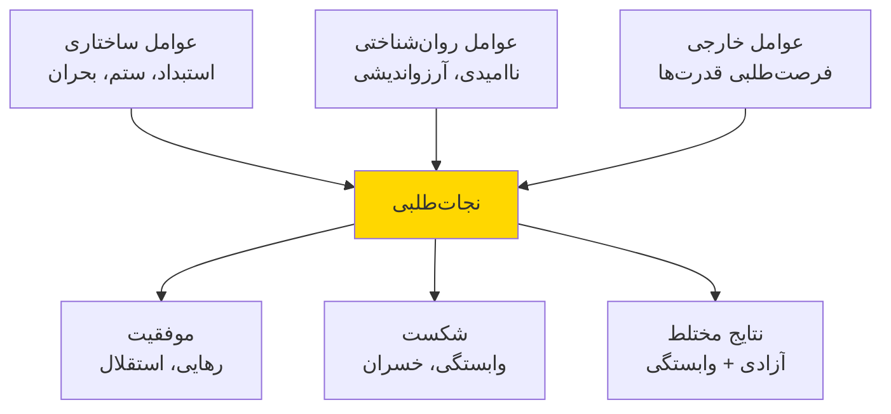
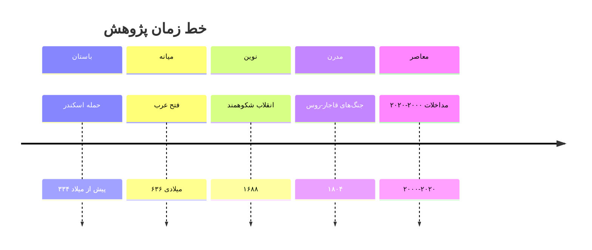
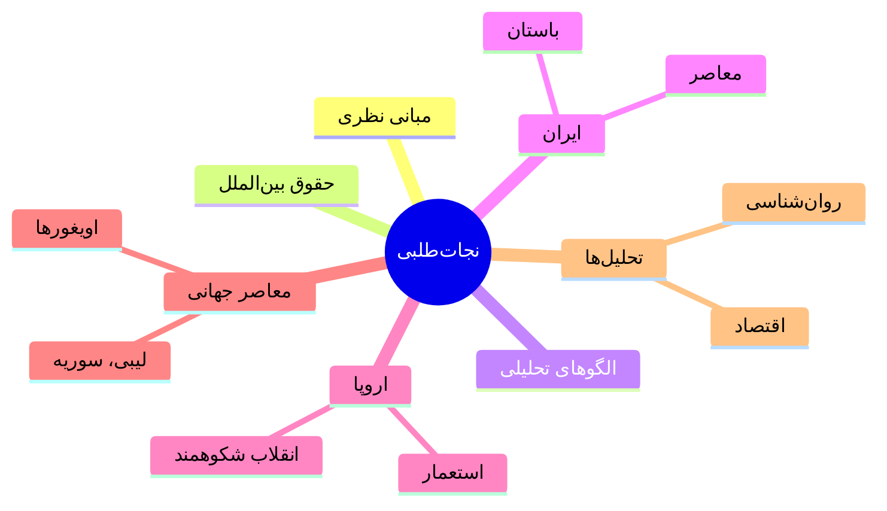
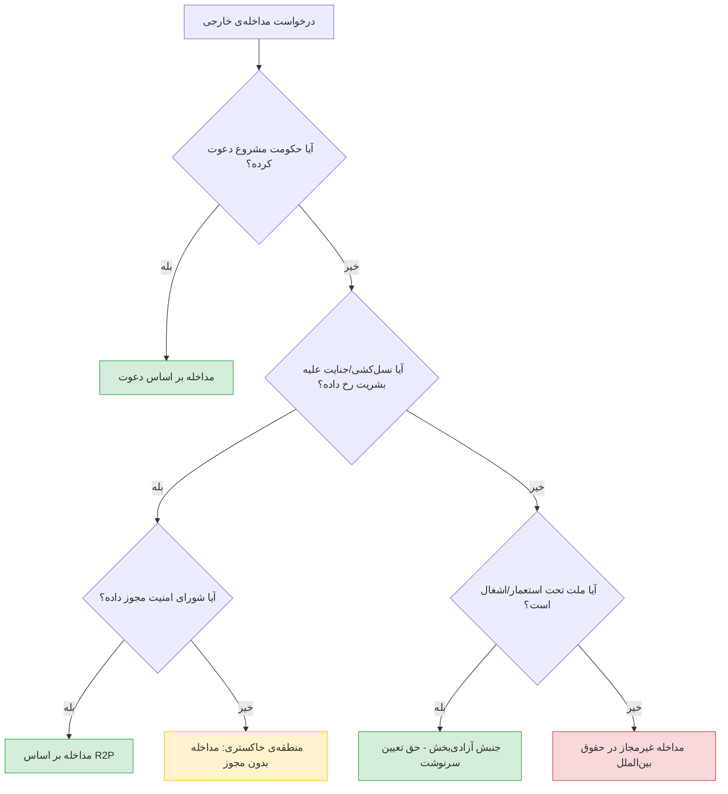

# فصل ۱ — درآمد، پرسش‌ها و چارچوب مفهومی

> **چکیدهی فصل** 
این فصل به طرح مسئلهی اصلی پژوهش، تعریف مفاهیم کلیدی، مرور ادبیات نظری، و بیان چارچوب مفهومی کتاب اختصاص دارد. پرسش محوری آن است که پدیدهی «نجاتطلبی» — یعنی دعوت از نیروی خارجی برای رهایی از ستم داخلی — چه ماهیتی دارد، چه الگوهایی در تاریخ بروز داده، و با چه معیارهایی میتوان آن را ارزیابی کرد.

## طرح مسئله

در سراسر تاریخ بشر، گروه‌های انسانی در مواجهه با ستم، سرکوب یا بحران‌های وجودی، راه‌حل‌های گوناگونی جسته‌اند. یکی از مهم‌ترین و بحث‌برانگیزترین این راه‌حل‌ها، **دعوت از نیروی خارجی** برای مداخله — اعم از نظامی، سیاسی یا اقتصادی — بوده است.

این پدیده در زبان این پژوهش **نجات‌طلبی** نامیده می‌شود: فرایندی که طی آن بخشی از یک جامعه‌ی سیاسی (ملت، قوم، طبقه، فرقه‌ی مذهبی یا نخبگان سیاسی) از قدرتی بیرونی می‌خواهد تا در امور داخلی آنان مداخله کرده و وضعیت موجود را تغییر دهد. 

> **هدایت**، در «بوف کور»، تصویری نمادین از انزوای ملتی ترسیم می‌کند که راه نجاتی نمی‌یابد. اما در واقعیت تاریخی، ملت‌ها همیشه «بوف کور» نمانده‌اند — گاه دست به دامان دیگری شده‌اند.

### پرسش‌های محوری پژوهش

1. آیا نجات‌طلبی یک الگوی تکرارشونده در تاریخ است و اگر هست، چه عوامل ساختاری آن را ایجاد می‌کند؟
2. چه تمایز معناداری میان «دعوت مشروع برای مداخله‌ی انسان‌دوستانه» و «خیانت به حاکمیت ملی» وجود دارد؟
3. الگوی نتایج مداخلات خارجی — اعم از فوری و بلندمدت — چیست و آیا الگوی قابل تعمیمی وجود دارد؟
4. نقش عوامل روان‌شناسی جمعی (ناامیدی، آرزواندیشی، هویت‌طلبی) در شکل‌گیری نجات‌طلبی چیست؟
5. آیا فعالیت‌های میسیونری، ایدئولوژیک و فرهنگی در تسهیل پذیرش مداخله‌ی خارجی نقش دارند؟

## تعریف مفاهیم کلیدی

### نجات‌طلبی

**نجات‌طلبی** (*Salvation-Seeking*) در این پژوهش به معنای هرگونه تلاش سازمان‌یافته یا نیمه‌سازمان‌یافته‌ی بخشی از یک واحد سیاسی برای جلب مداخله‌ی قدرت خارجی به‌منظور تغییر وضع موجود سیاسی، نظامی یا اجتماعی تعریف می‌شود.

| نوع | ماهیت درخواست | نمونه‌ی تاریخی |
|---|---|---|
| نظامی مستقیم | درخواست لشکرکشی و اشغال | دعوت پارلمان انگلستان از ویلیام اورانژ (۱۶۸۸) |
| نظامی غیرمستقیم | درخواست تسلیحات و آموزش | کمک‌های امریکا به مجاهدین افغان (۱۹۷۹–۱۹۸۹) |
| دیپلماتیک-سیاسی | درخواست فشار سیاسی و تحریم | درخواست اپوزیسیون آفریقای جنوبی برای تحریم آپارتاید |
| انسان‌دوستانه | درخواست حمایت سازمان‌های بین‌المللی | ایزدی‌های عراق (۲۰۱۴) |
| فرهنگی-ایدئولوژیک | پذیرش و ترویج ایدئولوژی خارجی | نفوذ پان‌اسلاویسم در بالکان |
| اقتصادی | واگذاری امتیازات اقتصادی در قبال حمایت | امتیازنامه‌ی رویتر (۱۸۷۲) |

### مداخله‌ی خارجی

**مداخله‌ی خارجی** (*Foreign Intervention*) در ادبیات روابط بین‌الملل به «هرگونه اقدام اجباری یا نیمه‌اجباری یک دولت یا سازمان بین‌المللی در امور داخلی دولتی دیگر» اشاره دارد. 

**هدلی بول** (*Hedley Bull*) مداخله را «اعمال نفوذ اجباری» تعریف می‌کند که «حق خودمختاری واحد سیاسی هدف را نقض می‌کند.» 

**تمایز کلیدی**: *مداخله‌ی تقاضامحور* (دعوت شده) vs *مداخله‌ی یک‌جانبه*

### موفقیت و شکست: مسئله‌ی تعریف

> **معضل تعریف «موفقیت»** 
> «موفقیت» مداخله‌ی خارجی مفهومی ذاتاً چندبُعدی و وابسته به منظر (*perspective-dependent*) است. آنچه از دید مداخله‌کننده موفقیت محسوب شود، ممکن است از دید ملت هدف شکست باشد و بالعکس.

**موفقیت** در سه بُعد سنجیده می‌شود:

1. **بُعد فوری (۰ تا ۵ سال)**: آیا هدف اعلام‌شده‌ی دعوت‌کنندگان محقق شد؟
2. **بُعد میان‌مدت (۵ تا ۲۵ سال)**: آیا نظم جدید پایدار ماند؟
3. **بُعد بلندمدت (بیش از ۲۵ سال)**: آیا جامعه به خودمختاری رسید؟

## مرور ادبیات نظری

### نظریه‌های روابط بین‌الملل

#### واقع‌گرایی
**هانس مورگنتاو**: «هیچ دولتی برای نجات ملت دیگر وارد جنگ نمی‌شود مگر آنکه منافعش ایجاب کند.»

**کنت والتز**: نجات ملت‌ها اغلب پوشش ایدئولوژیک برای توسعه‌طلبی است.

#### لیبرالیسم
**مایکل دویل**: دموکراسی‌ها می‌توانند (و گاه باید) برای دفاع از حقوق بشر مداخله کنند.

#### سازه‌انگاری
**مارتا فینه‌مور**: هنجارهای بین‌المللی درباره‌ی مداخله تحول یافته‌اند.

### نظریه‌های پسااستعماری

**ادوارد سعید**: غرب از طریق بازنمایی «شرقِ» ناتوان، مداخلات خود را مشروعیت بخشیده است.

**فرانتس فانون**: ملت تحت ستم، خود را ناتوان از رهایی درونی می‌بیند.

### ادبیات فارسی

- **احمد اشرف و علی بنوعزیزی**: تحلیل طبقاتی مداخلات در ایران
- **یرواند آبراهامیان**: نقش قدرت‌های خارجی در ایران
- **همایون کاتوزیان**: اقتصاد سیاسی وابستگی
- **فریدون آدمیت**: مشروطه و اندیشه‌ی ترقی

## چارچوب مفهومی پژوهش

**سه دسته عوامل:**

a. **ساختاری-سیاسی**: استبداد، سرکوب، بحران مشروعیت
b. **روان‌شناسی جمعی**: ناامیدی، آرزواندیشی، تروما
c. **بین‌المللی**: منافع ژئوپولیتیک، هنجارها

## گونه‌شناسی مداخلات از منظر عامل دعوت‌کننده

| عامل | مشروعیت حقوقی | مشروعیت اخلاقی | نمونه |
|---|---|---|---|
| حکومت مستقر | بالا | بحث‌برانگیز | دعوت اسد از روسیه (۲۰۱۵) |
| اپوزیسیون سیاسی | پایین-متوسط | بحث‌برانگیز | شورای ملی لیبی (۲۰۱۱) |
| نخبگان نظامی | بسیار پایین | بسیار بحث‌برانگیز | ژنرال‌های عراق (۲۰۰۳) |
| اقلیت قومی | متغیر | بالا | کردهای عراق (۱۹۹۱) |
| مردم (جنبش عمومی) | متغیر | بالاترین | کوزوو (۱۹۹۹) |

## تمایز مفهومی

### نجات‌طلبی در برابر خیانت
**بندیکت اندرسون**: «ملت» ساختاری تخیلی است.

### نجات‌طلبی در برابر امپریالیسم

> امپریالیسم «از بالا به پایین» است؛ نجات‌طلبی «از پایین به بالا». اما در عمل درهم‌تنیده‌اند.

## بازه‌ی زمانی و جغرافیایی

## ماتریس تحلیلی

| بُعد ارزیابی | فوری (۵>) | میان‌مدت | بلندمدت | منبع سنجش |
|---|---|---|---|---|
| نظامی | پایان خشونت | ثبات | خودکفایی | آمار تلفات |
| سیاسی | تغییر رژیم | نهادسازی | حکمرانی خوب | Freedom House |
| اقتصادی | بازسازی | رشد | استقلال | GDP, HDI |
| اجتماعی | کاهش تنش | انسجام | هویت ملی | پیمایش‌ها |
| حاکمیت | تمامیت ارضی | استقلال | عدم وابستگی | معاهدات |

## نقشه‌ی مفهومی کتاب

## جمع‌بندی فصل

در این فصل، **نجات‌طلبی** تعریف و چارچوب مفهومی سه‌لایه‌ای و ماتریس پنج‌بُعدی معرفی شد. فصل بعد مبانی حقوقی مداخله را بررسی می‌کند.

---

# فصل دوم؛ مبانی حقوقی مداخله‌ی خارجی در حقوق بین‌الملل

### 📋 چکیده‌ی فصل

این فصل به بررسی نظام حقوقی بین‌المللی حاکم بر مداخله‌ی خارجی می‌پردازد. از اصل حاکمیت وستفالیایی تا دکترین «مسئولیت حمایت» (R2P)، تحول هنجارهای بین‌المللی، رویه‌ی دیوان بین‌المللی دادگستری، و مشروعیت حقوقی «مداخله بر اساس دعوت» بررسی می‌شود.

---

## ۱. اصل حاکمیت دولت‌ها و منع مداخله

### ۱.۱. صلح وستفالی و تولد اصل حاکمیت

نظام مدرن دولت‌ـ‌ملت‌ها ریشه در **صلح وستفالی (۱۶۴۸ م.)** دارد. این معاهده که به جنگ‌های سی‌ساله در اروپا پایان داد، دو اصل بنیادین را بنا نهاد:

1. **اصل برابری حاکمیت**: هر دولت در قلمرو خود اقتدار عالی دارد و هیچ قدرت فراملی حق دخالت در امور داخلی آن را ندارد.

2. **اصل عدم مداخله**: دولت‌ها حق ندارند در امور داخلی یکدیگر مداخله کنند.[^1]

**ژان بُدَن** (*Jean Bodin*) پیش از وستفالی، حاکمیت را «قدرت مطلق و دائمی یک جمهوری» تعریف کرده بود.[^2] اما در عمل، اصل حاکمیت هرگز مطلق نبوده و از همان آغاز با استثنائاتی همراه بوده است. **هوگو گروسیوس** (*Hugo Grotius*)، پدر حقوق بین‌الملل، حق مداخله‌ی بشردوستانه را در صورت ستم فاحش حاکم بر رعایایش به رسمیت می‌شناخت.[^3]

### ⚖️ اصل حاکمیت در منشور سازمان ملل

ماده‌ی ۲ بند ۱ منشور سازمان ملل متحد (۱۹۴۵) مقرر می‌دارد: 

> «سازمان بر مبنای اصل برابری حاکمیت کلیه‌ی اعضا استوار است.»

بند ۷ همین ماده تصریح می‌کند: 

> «هیچ‌یک از مقررات منشور حاضر، ملل متحد را مجاز نمی‌دارد در اموری که اساساً در صلاحیت داخلی هر دولتی است مداخله نمایند.»[^4]

با این حال، **فصل هفتم منشور** (مواد ۳۹ تا ۵۱) به شورای امنیت اجازه می‌دهد در صورت «تهدید علیه صلح، نقض صلح یا عمل تجاوزکارانه» اقدامات اجباری — از جمله نظامی — اتخاذ کند. این استثنا، روزنه‌ی اصلی برای مداخلات بین‌المللی «مشروع» بوده است.

### ۱.۲. تحول تاریخی اصل عدم مداخله

اصل عدم مداخله در طول تاریخ حقوق بین‌الملل تحولات مهمی را پشت سر گذاشته است:

| سال | رویداد | اهمیت |
|:----|:-------|:------|
| **۱۶۴۸** | وستفالی | تولد اصل حاکمیت |
| **۱۸۱۵** | کنگره‌ی وین | مداخله‌ی جمعی مشروع |
| **۱۸۹۹/۱۹۰۷** | کنوانسیون‌های لاهه | حقوق جنگ |
| **۱۹۴۵** | منشور ملل متحد | منع توسل به زور |
| **۱۹۷۰** | قطعنامه ۲۶۲۵ | حق تعیین سرنوشت |
| **۲۰۰۵** | اجلاس جهانی | مسئولیت حمایت |
| **۲۰۱۱** | بحران لیبی | اِعمال R2P |

---

## ۲. مداخله بر اساس دعوت (Intervention by Invitation)

### ۲.۱. مبانی حقوقی

مداخله بر اساس دعوت (*Intervention by Invitation*) یکی از پیچیده‌ترین موضوعات حقوق بین‌الملل است. اصل کلی آن است که اگر **حکومت مشروع** یک دولت، از دولت دیگری برای مداخله — اعم از نظامی یا غیرنظامی — در امور داخلی‌اش دعوت کند، این مداخله از نظر حقوقی مجاز است؛ زیرا **رضایت دولت** استثنایی بر اصل منع توسل به زور (ماده‌ی ۲ بند ۴ منشور) محسوب می‌شود.[^5]

**لوئیز دوسوالد-بک** (*Louise Doswald-Beck*) در پژوهش بنیادین خود، شرایط مشروعیت حقوقی مداخله بر اساس دعوت را چنین برشمرده است:

✅ شرایط حقوقی مداخله بر اساس دعوت

| شرط | توضیح |
|:----|:------|
| **شرط ۱: مشروعیت دعوت‌کننده** | دعوت باید از سوی «حکومت مشروع» — یعنی حکومتی که از نظر حقوق بین‌الملل به رسمیت شناخته شده — صادر شود. |
| **شرط ۲: رضایت واقعی** | رضایت نباید تحت اجبار، فریب یا فشار نظامی مداخله‌گر باشد. |
| **شرط ۳: تناسب** | مداخله باید متناسب با درخواست و محدود به هدف اعلام‌شده باشد. |
| **شرط ۴: عدم نقض حقوق بنیادین** | مداخله نباید ناقض هنجارهای آمره (*jus cogens*) — مانند ممنوعیت نسل‌کشی — باشد. |
| **شرط ۵: عدم مداخله در جنگ داخلی** | اگر کشور هدف درگیر جنگ داخلی تمام‌عیار باشد، مشروعیت دعوت حکومت زیر سؤال می‌رود. |

### ۲.۲. رویه‌ی دیوان بین‌المللی دادگستری

دیوان بین‌المللی دادگستری (ICJ) در چندین پرونده به مسئله‌ی مداخله بر اساس دعوت پرداخته است:

📁 پرونده‌ی نیکاراگوئه علیه ایالات متحده (۱۹۸۶)

در این پرونده، دیوان مقرر داشت که:

> «اصل عدم مداخله، حق هر دولت حاکم را برای اداره‌ی امور خود بدون دخالت خارجی تضمین می‌کند.»

دیوان تأکید کرد که حمایت از گروه‌های مسلح اپوزیسیون (کنتراها) علیه حکومت نیکاراگوئه، نقض حقوق بین‌الملل بوده و دفاع امریکا مبنی بر «دعوت» از سوی اپوزیسیون مردود است.[^6]

**🔑 نکته‌ی کلیدی:** دیوان صراحتاً اعلام کرد که «دعوت» از سوی اپوزیسیون (نه حکومت مشروع) مبنای حقوقی برای مداخله نظامی ایجاد نمی‌کند.

📁 پرونده‌ی فعالیت‌های مسلحانه در قلمرو کنگو (۲۰۰۵)

در این پرونده، دیوان رضایت دولت جمهوری دموکراتیک کنگو به حضور نظامی اوگاندا را بررسی کرد و نتیجه گرفت که **حتی اگر رضایت اولیه وجود داشته باشد، تداوم حضور نظامی پس از لغو رضایت غیرقانونی است.**[^7]

### ۲.۳. معضل «حکومت مشروع» در جنگ‌های داخلی

یکی از بزرگ‌ترین چالش‌های حقوقی مداخله بر اساس دعوت، تعیین «حکومت مشروع» در شرایط جنگ داخلی است. **جیمز کرافورد** (*James Crawford*) و **مارکو ساسولی** (*Marco Sassòli*) نشان داده‌اند که در عمل، «مشروعیت» اغلب بر اساس **واقعیت سیاسی** (کنترل مؤثر بر قلمرو) و نه بر اساس معیارهای دموکراتیک تعیین می‌شود.[^8]

#### نمونه‌های بحث‌برانگیز مداخله بر اساس دعوت

| مورد | دعوت‌کننده | مداخله‌گر | سال | وضعیت حقوقی |
|:-----|:-----------|:----------|:----|:------------|
| مجارستان | دولت کادار | شوروی | ۱۹۵۶ | بحث‌برانگیز[^9] |
| چکسلواکی | «درخواست رفقا» | شوروی (پیمان ورشو) | ۱۹۶۸ | بسیار بحث‌برانگیز[^10] |
| افغانستان | دولت کارمل | شوروی | ۱۹۷۹ | محکوم‌شده[^11] |
| گرانادا | فرماندار کل | ایالات متحده | ۱۹۸۳ | بحث‌برانگیز |
| سوریه | دولت اسد | روسیه و ایران | ۲۰۱۵ | فنی مجاز؛ اخلاقاً بحث‌برانگیز[^12] |
| مالی | دولت مالی | فرانسه | ۲۰۱۳ | نسبتاً پذیرفته‌شده[^13] |

---

## ۳. دکترین مسئولیت حمایت (R2P)

### ۳.۱. زمینه‌ی تاریخی: از رواندا تا کوزوو

شکست جامعه‌ی بین‌المللی در جلوگیری از **نسل‌کشی رواندا (۱۹۹۴)** و **قتل‌عام سربرنیتسا (۱۹۹۵)** و سپس مداخله‌ی بدون مجوز شورای امنیت ناتو در **کوزوو (۱۹۹۹)**، بحران عمیقی در حقوق بین‌الملل ایجاد کرد.

**کوفی عنان**، دبیرکل وقت سازمان ملل، در گزارش هزاره (۲۰۰۰) پرسش بنیادینی مطرح کرد:

> «اگر مداخله‌ی بشردوستانه واقعاً تعرض غیرقابل قبولی به حاکمیت است، پس ما باید به مردم رواندا و سربرنیتسا چه پاسخ دهیم — مردمی که حاکمیت دولت‌هایشان ابزار سرکوب‌شان بود؟»

**— کوفی عنان، ۲۰۰۰**[^14]

### ۳.۲. گزارش کمیسیون بین‌المللی (۲۰۰۱)

در پاسخ به این پرسش، دولت کانادا **کمیسیون بین‌المللی مداخله و حاکمیت دولت** (ICISS) را تأسیس کرد. گزارش نهایی این کمیسیون (دسامبر ۲۰۰۱) مفهوم «مسئولیت حمایت» را با سه رکن معرفی کرد:

🏛️ سه رکن مسئولیت حمایت

| رکن | عنوان | شرح |
|:----|:------|:----|
| **رکن ۱** | مسئولیت پیشگیری | رسیدگی به ریشه‌های بحران پیش از وقوع فاجعه |
| **رکن ۲** | مسئولیت واکنش | اقدام قاطع — شامل مداخله‌ی نظامی در موارد حاد — هنگامی که دولت ناتوان یا ناخواسته از حمایت شهروندانش باشد |
| **رکن ۳** | مسئولیت بازسازی | کمک به بازسازی و صلح‌سازی پس از مداخله |

*منبع:* ICISS. *The Responsibility to Protect*. IDRC, 2001.[^15]

### ۳.۳. سند اجلاس جهانی ۲۰۰۵

در اجلاس جهانی ۲۰۰۵، سران دولت‌ها بندهای ۱۳۸ و ۱۳۹ سند نهایی را تصویب کردند که R2P را در **چهار جرم** محدود ساخت:

⚠️ چهار جرم مشمول مسئولیت حمایت

1. 🔴 **نسل‌کشی** (*Genocide*)
2. 🔴 **جنایات جنگی** (*War Crimes*)
3. 🔴 **پاک‌سازی قومی** (*Ethnic Cleansing*)
4. 🔴 **جنایات علیه بشریت** (*Crimes against Humanity*)

---

**بند ۱۳۹:** 
> «ما آماده‌ایم که از طریق شورای امنیت و بر مبنای فصل هفتم منشور، اقدام جمعی به‌موقع و قاطعانه‌ای انجام دهیم... هرگاه ابزارهای مسالمت‌آمیز ناکافی باشد و مقامات ملی آشکارا از حمایت مردم خود ناتوان باشند.»[^16]

### ۳.۴. نقد R2P: مشروعیت‌بخشی به امپریالیسم؟

دکترین R2P از سوی بسیاری از کشورهای جهان سوم و اندیشمندان پسااستعماری مورد نقد قرار گرفته است:

- **نوام چامسکی** (*Noam Chomsky*) آن را «نسخه‌ی نوین بار سفیدپوست» (*White Man's Burden*) می‌خواند.[^17]

- **محمود ممدانی** (*Mahmood Mamdani*) استدلال می‌کند که R2P ابزاری برای «تقسیم جهان به ناجیان و قربانیان» است.[^18]

- نمایندگان چین و روسیه در شورای امنیت بارها R2P را «ابزار تغییر رژیم» خوانده‌اند — به‌ویژه پس از تجربه‌ی لیبی (۲۰۱۱).[^19]

---

## ۴. حق تعیین سرنوشت و مداخله‌ی خارجی

### ۴.۱. ریشه‌ها و تحول مفهوم

حق تعیین سرنوشت (*Self-Determination*) از اصول بنیادین حقوق بین‌الملل معاصر است. ماده‌ی ۱ مشترک میثاقین بین‌المللی (۱۹۶۶) مقرر می‌دارد:

> «همه‌ی مردمان حق تعیین سرنوشت دارند. به موجب این حق، آنان آزادانه وضعیت سیاسی خود را تعیین و آزادانه تحول اقتصادی، اجتماعی و فرهنگی خود را دنبال می‌کنند.»[^20]

#### تحول مفهوم حق تعیین سرنوشت

| دوره | مبنا | دامنه | محدودیت |
|:-----|:-----|:------|:--------|
| **۱۹۱۸–۱۹۴۵** | چهارده اصل ویلسون | ملت‌های اروپایی | عملاً محدود به متفقین |
| **۱۹۴۵–۱۹۶۰** | منشور ملل متحد (ماده ۱ بند ۲) | ملت‌های تحت استعمار | استعمارزدایی |
| **۱۹۶۰–۱۹۷۰** | قطعنامه ۱۵۱۴ و ۲۶۲۵ | همه‌ی مردمان تحت سلطه‌ی بیگانه | منع تجزیه‌ی ارضی دولت‌ها |
| **۱۹۹۰–کنون** | رویه‌ی دیوان و عملکرد دولت‌ها | حق تعیین سرنوشت داخلی | جدایی تنها در شرایط استثنایی[^21] |

### ۴.۲. تنش میان حق تعیین سرنوشت و تمامیت ارضی

تنش بنیادین حقوقی آنجاست که حق تعیین سرنوشت ممکن است با اصل تمامیت ارضی تعارض پیدا کند. این تنش در موارد زیر بارز بوده است:

- **کوزوو (۲۰۰۸):** اعلام استقلال یک‌جانبه؛ نظر مشورتی دیوان (۲۰۱۰) آن را «مغایر با حقوق بین‌الملل» ندانست اما حق جدایی یک‌جانبه را نیز تأیید نکرد.[^22]

- **کریمه (۲۰۱۴):** الحاق توسط روسیه با ادعای «رفراندوم»؛ محکوم‌شده توسط مجمع عمومی.[^23]

- **کاتالونیا (۲۰۱۷):** رفراندوم غیرقانونی از نظر دادگاه قانون اساسی اسپانیا.

- **اقلیم کردستان عراق (۲۰۱۷):** رفراندوم استقلال؛ عملاً بی‌نتیجه.

---

## ۵. مداخله‌ی انسان‌دوستانه: مرز باریک حقوق و اخلاق

### ۵.۱. تعریف و ویژگی‌ها

**مداخله‌ی انسان‌دوستانه** (*Humanitarian Intervention*) به «توسل به زور توسط یک دولت، گروهی از دولت‌ها، یا سازمان بین‌المللی، عمدتاً به‌منظور حمایت از حقوق بشر اتباع دولت هدف» تعریف می‌شود.[^24]

📋 معیارهای مشروعیت مداخله‌ی انسان‌دوستانه (ICISS)

| # | معیار | شرح |
|:--|:------|:----|
| ۱ | **آستانه‌ی عادلانه** | نسل‌کشی، پاک‌سازی قومی، یا تلفات انسانی گسترده |
| ۲ | **نیت درست** | هدف اصلی باید توقف رنج بشری باشد |
| ۳ | **آخرین راه‌حل** | تمامی ابزارهای مسالمت‌آمیز امتحان شده باشند |
| ۴ | **ابزار متناسب** | اقدام نظامی متناسب با تهدید باشد |
| ۵ | **چشم‌انداز معقول** | احتمال معقولی وجود داشته باشد که مداخله وضعیت را بهبود بخشد |
| ۶ | **مرجع صالح** | ترجیحاً شورای امنیت سازمان ملل |

*منبع:* ICISS, 2001, pp. 32–37.

### ۵.۲. نقد اخلاقی-سیاسی معیارهای مشروعیت

**مایکل والزر** (*Michael Walzer*) در اثر کلاسیک «جنگ‌های عادلانه و ناعادلانه» به تنش بنیادین میان حاکمیت و حقوق بشر پرداخته و استدلال می‌کند که مداخله‌ی نظامی تنها در سه مورد مجاز است: جدایی‌طلبی مشروع، ضدحمله‌ی متقابل، و توقف نسل‌کشی یا فاجعه‌ی بشری.[^25]

در مقابل، **آلن بوکانان** (*Allen Buchanan*) از حق مداخله‌ی «گسترده‌تر» دفاع می‌کند و استدلال می‌کند که اصل حاکمیت تنها زمانی معتبر است که دولت حداقلی از عدالت را رعایت کند.[^26]

#### نقدها و دفاعیه‌ها

❌ نقدها

- گزینشی بودن: چرا لیبی آری و سوریه نه؟
- ابزار تغییر رژیم به نفع قدرت‌های بزرگ
- نادیده‌گرفتن ریشه‌های ساختاری بحران
- نبود سازوکار پاسخ‌گویی پس از مداخله
- تشدید بی‌ثباتی بلندمدت

✅ دفاعیه‌ها

- نجات جان انسان‌ها در بحران فوری
- تقویت هنجار مسئولیت دولت‌ها در قبال شهروندان
- ایجاد فشار بازدارنده بر دیکتاتورها
- وجود سازوکار نهادی (شورای امنیت)
- حق اخلاقی مردم تحت ستم برای طلب کمک

---

## ۶. چارچوب حقوقی استمداد از قدرت خارجی برای رفع استبداد

### ۶.۱. سنت حقوق طبیعی و حق مقاومت

پرسش از مشروعیت استمداد خارجی برای رفع استبداد، ریشه در سنت کهن **حق مقاومت در برابر ظلم** (*Right of Resistance*) دارد:

| متفکر/سنت | دوره | موضع اصلی |
|:----------|:-----|:----------|
| **توماس آکویناس** | سده‌ی ۱۳ | مقاومت در برابر حاکم ستم‌گر مجاز است مشروط بر آنکه ستم آشکار و بی‌درمان باشد[^27] |
| **جان لاک** | سده‌ی ۱۷ | اگر حاکم «قرارداد اجتماعی» را نقض کند، مردم حق شورش و حتی دعوت از یاری‌رسان خارجی دارند[^28] |
| **فقه اسلامی** | متقدم و متأخر | اختلاف‌نظر شدید: برخی خروج بر حاکم جائر را واجب و برخی حرام می‌دانند. استمداد از «کافر» اجماعاً ممنوع[^29] |
| **فلسفه‌ی روشنگری** | سده‌ی ۱۸ | حق مقاومت جزء حقوق طبیعی بشر |
| **حقوق بین‌الملل مدرن** | قرن ۲۰–۲۱ | حق مقاومت مسلحانه‌ی ملت‌های تحت استعمار اما نه ملت‌های در دولت‌های مستقل[^30] |

### ۶.۲. معضل «در شهر هر آنکه هست گیرند»

نکته‌ی بنیادین حقوقی آن است که **مشروعیت‌بخشی به مداخله‌ی خارجی یک فرایند برگشت‌ناپذیر است**. هنگامی که دری به مداخله گشوده شود، کنترل حدود و ثغور آن از دست دعوت‌کنندگان خارج می‌شود.

⚠️ «گر رسم شود که مست گیرند، در شهر باید هر آنکه هست گیرند»

این ضرب‌المثل فارسی، بیان‌گر اصل حقوقی مهمی است: **مداخله‌ی خارجی، حتی اگر با دعوت آغاز شود، ذاتاً تمایل به گسترش فراتر از محدوده‌ی اولیه دارد.**

دلایل حقوقی این گسترش:

1. **ابهام در حدود رضایت:** رضایت اولیه به‌ندرت شامل تعریف دقیق حدود عملیات، مدت زمان، و شرایط خروج می‌شود.

2. **پویایی جنگ:** عملیات نظامی منطق خاص خود را دارد (*fog of war*).[^31]

3. **عدم تقارن قدرت:** مداخله‌گر معمولاً قوی‌تر از دعوت‌کننده است.

4. **منافع مداخله‌گر:** مداخله‌گر ناگزیر منافع خود را نیز دنبال می‌کند.

**جان استوارت میل** (*John Stuart Mill*) در مقاله‌ی معروف «چند کلمه درباره‌ی عدم مداخله» (۱۸۵۹) استدلال می‌کند:

> «ملتی که آزادی خود را مدیون دست بیگانه باشد... معمولاً شایسته‌ی حفظ آن نیست. اگر ملتی نتواند آزادی‌اش را خود به‌دست آورد... به‌ندرت می‌تواند آن را حفظ کند... آزادی‌ای که از بیرون تحمیل شود، آزادی نیست بلکه شکلی دیگر از سلطه است.»

**— جان استوارت میل، ۱۸۵۹**[^32]

---

## ۷. درخواست جدایی و حقوق بین‌الملل: تحلیل انتقادی

### ۷.۱. حق جدایی در حقوق بین‌الملل: موجود یا معدوم؟

بر خلاف تصور عمومی، حقوق بین‌الملل **حق عامی برای جدایی یک‌جانبه** (*unilateral secession*) قائل نیست.

### ⚖️ نظر مشورتی دیوان عالی کانادا درباره‌ی جدایی کبک (۱۹۹۸)

> «نه حقوق بین‌الملل و نه حقوق داخلی کانادا، حق جدایی یک‌جانبه‌ی کبک را به رسمیت نمی‌شناسند... با این حال، حق تعیین سرنوشت ممکن است در شرایط استثنایی — یعنی هنگامی که مردمی از دسترسی معنادار به حکومت برای پیگیری توسعه‌ی سیاسی، اقتصادی، اجتماعی و فرهنگی خود محروم شوند — حق جدایی اصلاحی (*remedial secession*) را ایجاد کند.»[^33]

### ۷.۲. جدایی اصلاحی: نظریه‌ای در حال شکل‌گیری

نظریه‌ی **جدایی اصلاحی** (*Remedial Secession*) بر آن است که اگر دولتی به‌طور سیستماتیک حقوق بنیادین بخشی از شهروندان خود را نقض کند و هیچ راه‌حل داخلی وجود نداشته باشد، آن گروه حق جدایی دارد. اما این نظریه هنوز در حقوق بین‌الملل عرفی تثبیت نشده است.[^34]

#### مقایسه‌ی نظریه‌های حقوقی درباره‌ی جدایی

| نظریه | شرط جدایی | طرفداران اصلی | انتقاد اصلی |
|:------|:----------|:--------------|:------------|
| **حق اولیه** | رأی اکثریت ساکنان کافی است | Beran, Philpott | بی‌ثبات‌سازی نظم بین‌الملل |
| **جدایی اصلاحی** | فقط در صورت نقض فاحش حقوق | Buchanan, Cassese | ابهام در تعریف «نقض فاحش» |
| **ممنوعیت مطلق** | جدایی هرگز مجاز نیست | بسیاری از دولت‌ها | نادیده‌گرفتن حق تعیین سرنوشت |

---

## ۸. نمودار تحلیلی: مسیرهای حقوقی مداخله

## ۹. جمع‌بندی فصل

این فصل نشان داد که نظام حقوقی بین‌المللی در مورد مداخله‌ی خارجی، در تنش دائمی میان دو اصل بنیادین قرار دارد: **حاکمیت دولت‌ها** و **حقوق بشر**. از صلح وستفالی (۱۶۴۸) تا دکترین مسئولیت حمایت (۲۰۰۵)، هنجارهای بین‌المللی به‌تدریج فضای بیشتری برای مداخله باز کرده‌اند، اما این گشایش همواره با خطر سوءاستفاده همراه بوده است.

### 📋 نکات کلیدی

- ✅ مداخله بر اساس دعوت حکومت مشروع، از نظر فنی-حقوقی مجاز اما اخلاقاً بحث‌برانگیز است.

- ✅ حق تعیین سرنوشت شامل حق جدایی یک‌جانبه نمی‌شود مگر در شرایط استثنایی (جدایی اصلاحی).

- ✅ دکترین R2P محدود به چهار جرم بین‌المللی است و اِعمال آن منوط به تأیید شورای امنیت است.

- ⚠️ هشدار اساسی میل و ضرب‌المثل «مست گیرند...» حقیقتی تجربی است: **مداخله ذاتاً گسترش‌یابنده است**.

---

## پانوشت‌ها

[^1]: Krasner, Stephen D. *Sovereignty: Organized Hypocrisy*. Princeton UP, 1999, pp. 20–25.

[^2]: Bodin, Jean. *Six Books of the Commonwealth*. Trans. M.J. Tooley. Blackwell, 1955 [1576], Book I, Ch. 8.

[^3]: Grotius, Hugo. *De Jure Belli ac Pacis*. Trans. F.W. Kelsey. Clarendon, 1925 [1625], Book II, Ch. 25.

[^4]: منشور سازمان ملل متحد، ماده‌ی ۲، بندهای ۱ و ۷. متن رسمی فارسی.

[^5]: Doswald-Beck, Louise. "The Legal Validity of Military Intervention by Invitation of the Government." *British Year Book of International Law* 56, no. 1 (1985): 189–252.

[^6]: ICJ. *Military and Paramilitary Activities in and against Nicaragua (Nicaragua v. United States of America)*. Judgment, 27 June 1986. ICJ Reports 1986, p. 14, paras. 202–209.

[^7]: ICJ. *Armed Activities on the Territory of the Congo (Democratic Republic of the Congo v. Uganda)*. Judgment, 19 December 2005. ICJ Reports 2005, p. 168, paras. 42–53.

[^8]: Crawford, James. *Brownlie's Principles of Public International Law*. 9th ed. Oxford UP, 2019, pp. 142–148.

[^9]: Franck, Thomas M. *Recourse to Force*. Cambridge UP, 2002, pp. 95–98.

[^10]: دکترین برژنف مبنای ادعای شوروی بود. رجوع کنید به: Ouimet, Matthew J. *The Rise and Fall of the Brezhnev Doctrine*. U of North Carolina P, 2003.

[^11]: UN General Assembly Resolution ES-6/2. 14 January 1980.

[^12]: Ruys, Tom, and Luca Ferro. "Weathering the Storm: Legality and Legal Implications of the Saudi-Led Military Intervention in Yemen." *ICLQ* 65 (2016): 61–98.

[^13]: Bothe, Michael. "The Legality of the French Intervention in Mali." *EJIL Talk*, January 2013.

[^14]: Annan, Kofi. *We the Peoples: The Role of the United Nations in the 21st Century*. UN, 2000, p. 48.

[^15]: International Commission on Intervention and State Sovereignty (ICISS). *The Responsibility to Protect*. IDRC, 2001, pp. xi–xiii.

[^16]: UN General Assembly. *2005 World Summit Outcome*. A/RES/60/1, paras. 138–139.

[^17]: Chomsky, Noam. *A New Generation Draws the Line*. Verso, 2012.

[^18]: Mamdani, Mahmood. "Responsibility to Protect or Right to Punish?" *Journal of Intervention and Statebuilding* 4, no. 1 (2010): 53–67.

[^19]: Zifcak, Spencer. "The Responsibility to Protect after Libya and Syria." *Melbourne Journal of International Law* 13, no. 1 (2012): 1–35.

[^20]: میثاق بین‌المللی حقوق مدنی و سیاسی، ماده‌ی ۱.

[^21]: Supreme Court of Canada. *Reference Re Secession of Quebec*. [1998] 2 SCR 217, para. 134.

[^22]: ICJ. *Accordance with International Law of the Unilateral Declaration of Independence in Respect of Kosovo*. Advisory Opinion, 22 July 2010. ICJ Reports 2010, p. 403.

[^23]: UN General Assembly Resolution 68/262. 27 March 2014.

[^24]: Welsh, Jennifer M. *Humanitarian Intervention and International Relations*. Oxford UP, 2004, p. 3.

[^25]: Walzer, Michael. *Just and Unjust Wars*. 5th ed. Basic Books, 2015, pp. 86–108.

[^26]: Buchanan, Allen. *Justice, Legitimacy, and Self-Determination*. Oxford UP, 2004, pp. 331–400.

[^27]: Aquinas, Thomas. *Summa Theologica*. II-II, Q. 42, Art. 2.

[^28]: Locke, John. *Two Treatises of Government*. Ed. Peter Laslett. Cambridge UP, 1988 [1689], Second Treatise, Ch. 19, sec. 222.

[^29]: طباطبایی، سیدجواد. *زوال اندیشه‌ی سیاسی در ایران*. کویر، ۱۳۸۳، ص ۲۱۵–۲۴۰.

[^30]: Cassese, Antonio. *Self-Determination of Peoples*. Cambridge UP, 1995, pp. 150–170.

[^31]: Clausewitz, Carl von. *On War*. Trans. Howard and Paret. Princeton UP, 1976, Book I, Ch. 7.

[^32]: Mill, John Stuart. "A Few Words on Non-Intervention." *Fraser's Magazine* 60 (December 1859): 766–776.

[^33]: Supreme Court of Canada. *Reference Re Secession of Quebec*. [1998] 2 SCR 217, paras. 122–123, 134–135.

[^34]: Vidmar, Jure. "Remedial Secession in International Law: Theory and (Lack of) Practice." *St Antony's International Review* 6, no. 1 (2010): 37–56.